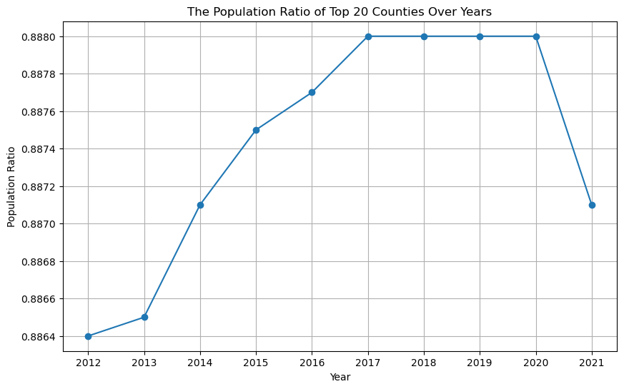
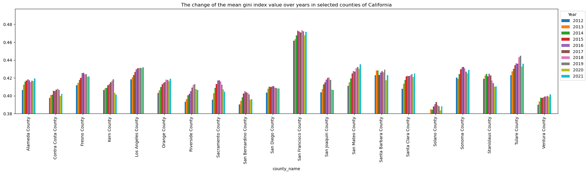
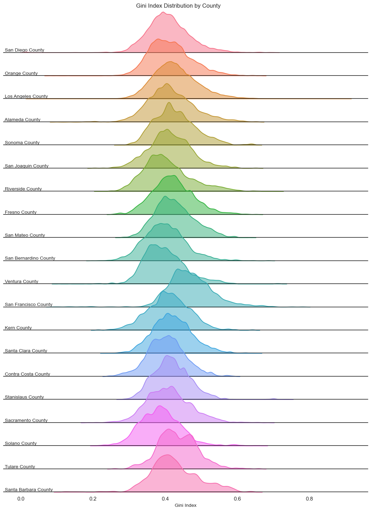
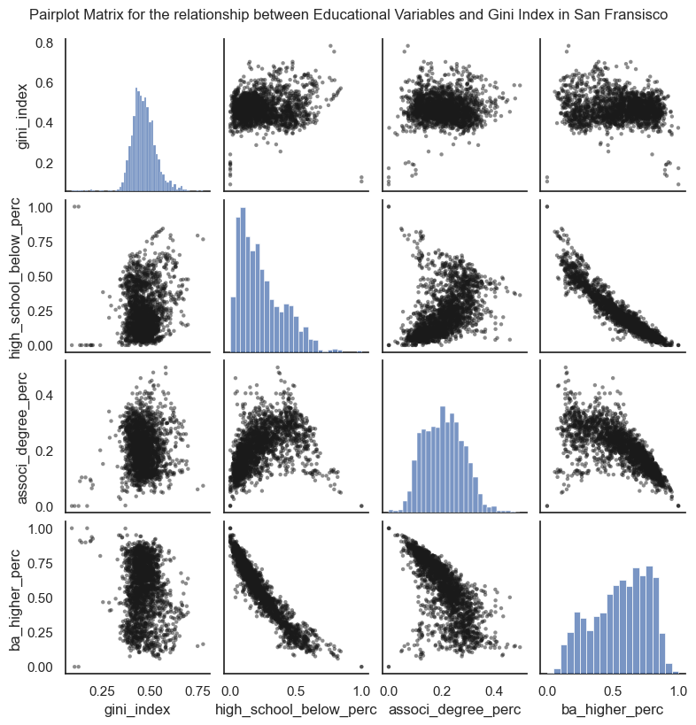
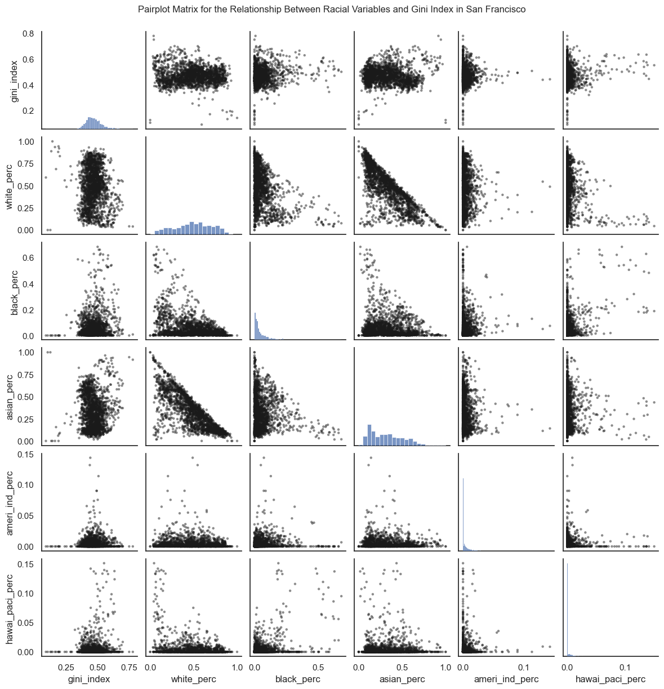

# The Study of Factors Influence on Income Inequality in California

by Yanyao Cui

## 01.The Brief Summary of the Topic
Regional income inequality represents a critical challenge within the domain of social science, influenced by a lot of factors. This study embarks on an initial investigation with the relationship between the Gini index(a measure of income distribution within a population) and several determinants over a decade (2012-2021) in CA. These determinants include education levels, and racial composition. Through this exploration, the research aims to contribute to a deeper understanding of how these variables interact with income inequality across different regions.The API allowing me to fetch the American Community Survey (ACS) five-year data from the 2012-2021 , with census tracts as the smallest unit of analysis.

## 02.Accessing the Dataset by API
The dataset comes from US.Bureau, can be divided into responding variable and Explanatory Variables.
### Responding Variable
The Gini Index, a widely used metric for assessing income inequality(Farris,F.A,2010), provides valuable insights into the socioeconomic disparities within a population. At the Census Tract level, a more granular examination of these disparities becomes possible, making it an essential tool for understanding localized inequalities. 
- [Farris, F. A. (2010). The Gini index and measures of inequality. The American Mathematical Monthly, 117(10), 851-864.](https://scholarcommons.scu.edu/cgi/viewcontent.cgi?article=1013&context=math_compsci).

ACS has published the table ***[B19083(Gini Index of income inequality)](https://data.census.gov/table?q=B19083:%20Gini%20Index%20of%20Income%20Inequality&g=010XX00US$1400000)*** from 2010-2021, and you can click the link to review it.

### Explanatory Variable
I reviewed some literatures and find several factors(racial composition and educational level) maybe have correlation with regioanl income inequality. Specifically,   

On the impact of race on income disparities: The report from Federal Reserve System(FEDS) showed that in the United States, the average income of Black and Hispanic or Latino families is about half that of White families, while their net wealth is only 15% to 20% of that of White families. This reflects a trend: White families are typically more capable of accumulating and growing wealth over time, and increasingly distance far from other racial groups(This disparity may be due to differences in savings capacity, opportunities to acquire high-return assets, and other factors). Among minorities, homeownership—a common means of wealth accumulation in recent years—is becoming declining in Black communities, exacerbating wealth disparities(Aladangady.et ,2021).
- [Aladangady, A., & Forde, A. (2021). Wealth inequality and the racial wealth gap](https://www.federalreserve.gov/econres/notes/feds-notes/wealth-inequality-and-the-racial-wealth-gap-20211022.html?utm_medium=Partnership&utm_source=powertofly&utm_campaign=How_the_Climate_Gap_Exacerbates_DEIB_Issues_%E2%80%94_And_6_Things_You_Can_Do_About_It&utm_content=How_the_Climate_Gap_Exacerbates_DEIB_Issues_%E2%80%94_And_6_Things_You_Can_Do_About_It).

On the impact of education level on income inequality: Education affects both ends of the income distribution, For the poor, education is a crucial means to transcend social classes and acquire knowledge. Higher education often translates to better job opportunities and higher salaries, helping them escape poverty. In contrast, for the wealthy, the direct impact of education is minimal as their primary income often derives from capital investments such as real estate and stocks, rather than wages. Therefore, the effect of education on the income of the wealthy is relatively weaker(Abdullah.et,2015).
- [Abdullah, A., Doucouliagos, H., & Manning, E. (2015). Does education reduce income inequality? A meta‐regression analysis. Journal of Economic Surveys, 29(2), 301-316](https://onlinelibrary.wiley.com/doi/full/10.1111/joes.12056).

Even though there are also some other factors maybe have influence on income inequality, but in this study, I only want to operate a preliminary analysis, focusing on racial and educational factors. I use API to fetch relevant data as below,
- racial characteristics,***[B02001(Race)](https://data.census.gov/table?q=B02001&g=010XX00US$1400000)***
- education level,***[B15003(Educational Attainment for the Population 25 Years and Over)](https://data.census.gov/table?q=B15003&g=010XX00US$1400000)***

## 03.Determine the Scope of the Study
In my research focusing on California, I referenced data from [Wikipedia](https://en.wikipedia.org/wiki/List_of_counties_in_California) and noted that there are 58 counties in the state. I grouped the data by county name and calculated the total population for each. From 2012 to 2021, I found that the sum population of the top 20 counties represents approximately 88.6% to 88.8% of the entire population of California's counties. Therefore, I believe these 20 counties provide a representative sample of the overall situation in California.

## 04.Data Visualization by Pivot Table
I analyzed the distribution of the Mean Gini Index across the 20 most populous counties in California over several years, visualizing the results with a pivot table. This analysis was designed to identify trends and variations in income inequality within these 20 counties.

## 05.Data Visualization by Kdeplot
Since the Gini Index is aggregated at the county level, the figure above only displays the annual average Gini coefficients for the top 20 most populous counties in California, while the figure below includes Gini Index over a decade at all tract level, the detailed tract-level analysis allows for a more granular understanding of income inequality, which might be masked in a broader county-level analysis.Finally, I find both of these two figures identify the San Francisco County as an outlier, with a significant rightward shift in its distribution. This trend may be attributed to difference in the SF county' population composition.

## 06.Case Study in San Fransisco
Based on the findings from the analysis above, I have decided to further narrow my research focus. This time, I will concentrate exclusively on the outlier, San Francisco County.

## 07.Data Visualization by Pairplot
I used a pairplot to investigate potential correlations between educational attainment and the Gini Index within San Fransisco County. It was evident that higher educational attainment, such as a bachelor's degree or above, is negatively correlated with the Gini Index, while having a high school education or less shows a positive correlation. This suggests that higher educational levels tend to reduce overall income inequality.

Following the same methodology within San Fransisco County, I shifted my focus to the influence of racial composition on the Gini Index. I discovered that the percentages of White and Asian populations have significant linear correlations with the Gini Index.

## 08.Animation by Plotly
Next, I plan to create an animation that illustrates the changing correlations between various factors and the Gini Index from 2012 to 2021 within San Francisco County.
- Firstly, let's study the correlation between the percentage of individuals with higher educational attainment and the Gini Index. Over the past decade, we have observed that as the proportion of people holding a bachelor's degree or higher increases, the Gini Index has gradually decreased.

                        
                        

            <script type="text/javascript">                                    window.PLOTLYENV=window.PLOTLYENV || {};                                    if (document.getElementById("d11fce1c-3d1c-4867-a8c7-b56a3a55683d")) {                    Plotly.newPlot(                        "d11fce1c-3d1c-4867-a8c7-b56a3a55683d",                        [{"hovertemplate":"\u003cb\u003e%{hovertext}\u003c\u002fb\u003e\u003cbr\u003e\u003cbr\u003ecounty_name= San Francisco County\u003cbr\u003eyear=2012\u003cbr\u003eba_higher_perc=%{x}\u003cbr\u003egini_index=%{y}\u003cbr\u003etotal_pop=%{marker.size}\u003cextra\u003e\u003c\u002fextra\u003e","hovertext":["032802","032901","032902","033203","033204","042601","042602","047801","047802","061100","061200","061400","980200","980300","980501","980600","980900","011901","011902","012201","012202","012301","010300","011000","015400","010400","025500","025600","025800","026001","045100","045200","026100","023300","025300","025401","026301","026302","026303","030500","031100","016600","017902","021400","021700","022802","022901","022902","022903","023003","026403","030201","030302","030400","061500","012302","012401","012402","012501","012502","017802","020401","020402","022704","025701","025702","031201","031202","031301","012601","012602","012901","012902","013101","013102","015801","015802","016801","016802","017101","017102","017801","023400","016500","030700","035100","013000","026002","026402","030301","030800","025402","026200","021600","030900","047901","031302","032601","032602","032801","012000","012700","013200","013300","013500","015300","016700","020200","020500","021000","023001","035202","042700","060100","031400","040100","023200","030102","032700","035201","035400","015900","016000","010500","011300","015200","017700","022702","022801","023103","025900","026003","047701","047702","060502","060700","047902","060400","010900","011800","012100","012800","015500","016100","016300","017601","020100","020600","020900","021800","022600","023102","025100","017000","018000","015600","010200","010800","033100","040200","021500","022803","042800","026404","030600","031000","026004","030101","033000","025403","026401","030202","035300","047600","010600","061000","020300","020700","020800","021100","021200","021300","010700","016200","016900","033201","011100","011700","025200","010100","011200","013400","015100","015700","016400"],"ids":["032802","032901","032902","033203","033204","042601","042602","047801","047802","061100","061200","061400","980200","980300","980501","980600","980900","011901","011902","012201","012202","012301","010300","011000","015400","010400","025500","025600","025800","026001","045100","045200","026100","023300","025300","025401","026301","026302","026303","030500","031100","016600","017902","021400","021700","022802","022901","022902","022903","023003","026403","030201","030302","030400","061500","012302","012401","012402","012501","012502","017802","020401","020402","022704","025701","025702","031201","031202","031301","012601","012602","012901","012902","013101","013102","015801","015802","016801","016802","017101","017102","017801","023400","016500","030700","035100","013000","026002","026402","030301","030800","025402","026200","021600","030900","047901","031302","032601","032602","032801","012000","012700","013200","013300","013500","015300","016700","020200","020500","021000","023001","035202","042700","060100","031400","040100","023200","030102","032700","035201","035400","015900","016000","010500","011300","015200","017700","022702","022801","023103","025900","026003","047701","047702","060502","060700","047902","060400","010900","011800","012100","012800","015500","016100","016300","017601","020100","020600","020900","021800","022600","023102","025100","017000","018000","015600","010200","010800","033100","040200","021500","022803","042800","026404","030600","031000","026004","030101","033000","025403","026401","030202","035300","047600","010600","061000","020300","020700","020800","021100","021200","021300","010700","016200","016900","033201","011100","011700","025200","010100","011200","013400","015100","015700","016400"],"legendgroup":" San Francisco County","marker":{"color":"#636efa","size":[3787.0,5606.0,3691.0,3845.0,3830.0,4047.0,3631.0,4250.0,4140.0,4543.0,3713.0,5301.0,308.0,27.0,646.0,288.0,337.0,2254.0,2844.0,4469.0,2598.0,1974.0,4393.0,5256.0,5875.0,4749.0,8731.0,5719.0,2044.0,5734.0,4820.0,6819.0,6567.0,3132.0,4812.0,3510.0,4488.0,4754.0,5623.0,3137.0,6672.0,5335.0,2501.0,3519.0,3713.0,2072.0,4497.0,2507.0,2985.0,3947.0,3899.0,4202.0,3732.0,5294.0,11083.0,2306.0,4081.0,3194.0,3358.0,3895.0,3922.0,3206.0,4047.0,3095.0,4442.0,3889.0,6953.0,3282.0,4331.0,2272.0,2990.0,2456.0,3192.0,3776.0,2899.0,3414.0,2469.0,3473.0,3099.0,3502.0,3590.0,3034.0,3754.0,5166.0,6672.0,8074.0,3844.0,3747.0,4331.0,5950.0,5260.0,3108.0,7306.0,3919.0,6317.0,6775.0,6005.0,4543.0,4432.0,4052.0,3502.0,3702.0,4558.0,4147.0,2570.0,2224.0,5213.0,5822.0,2405.0,4142.0,5247.0,4534.0,5978.0,2879.0,6729.0,4234.0,4397.0,4998.0,7022.0,5021.0,6191.0,4312.0,2420.0,2504.0,3267.0,3820.0,1549.0,2167.0,4468.0,3766.0,4248.0,4506.0,4136.0,4152.0,2863.0,8372.0,3813.0,2144.0,4772.0,1635.0,3530.0,4446.0,3920.0,4585.0,4476.0,6706.0,5680.0,4605.0,4944.0,4189.0,1599.0,3674.0,3198.0,3941.0,3615.0,3004.0,4040.0,4811.0,4180.0,5564.0,5626.0,4876.0,2204.0,2646.0,2112.0,3413.0,4454.0,4787.0,8307.0,5385.0,4107.0,4351.0,7890.0,5508.0,3942.0,3888.0,3106.0,5709.0,6470.0,3992.0,2837.0,2510.0,5555.0,2276.0,3123.0,3725.0,5008.0,1396.0,5766.0,3598.0,3170.0,3770.0,2000.0,7489.0,3951.0],"sizemode":"area","sizeref":42.42,"symbol":"circle"},"mode":"markers","name":" San Francisco County","orientation":"v","showlegend":true,"x":[0.4047297297297297,0.4387065637065637,0.4573041637261821,0.5158411423471665,0.50143815915628,0.5662262326780535,0.5901701323251418,0.4894278606965174,0.5121477162293488,0.05825776312173674,0.15080033698399326,0.6680641183723798,0.6282527881040892,1.0,0.20950323974082075,0.20238095238095238,0.7740963855421686,0.6366648260629486,0.4739075095460331,0.3108433734939759,0.3289054197662062,0.2975059382422803,0.5551169146674765,0.4963261436359327,0.7279159519725558,0.6537429895147525,0.3183545349413514,0.26645145269431336,0.14877192982456142,0.25250060990485484,0.5061150143117357,0.506951056941535,0.2503147293327738,0.18688230008984727,0.5395373856912319,0.446875,0.2540983606557377,0.28554467200949835,0.1717713118938234,0.5164750957854406,0.5568071470188386,0.7254308337214718,0.3818306010928962,0.8064966818023053,0.6631507315413406,0.34720496894409936,0.35772104607721045,0.38090185676392574,0.3839816933638444,0.18945918015845678,0.15217391304347827,0.564743967039435,0.6502329192546584,0.6591151385927505,0.7448542897900958,0.38173817381738173,0.1037062223733424,0.3913731697665216,0.24001426533523537,0.11864941621962764,0.43526785714285715,0.7755030003529827,0.628226249313564,0.7994143484626647,0.2171606864274571,0.2094833687190375,0.27249408050513024,0.2646812080536913,0.38353936239427455,0.8308647873865265,0.7796327212020033,0.79750346740638,0.7905759162303665,0.89585225552528,0.8027989821882952,0.5244375484871994,0.655965500718735,0.6021543985637343,0.6282542113323124,0.7944214876033058,0.829979879275654,0.3761153054221002,0.12522768670309653,0.6792852104396896,0.6341603053435114,0.4697392160078727,0.7841561423650976,0.24200278164116829,0.2999331997327989,0.7321209644462607,0.7031019202363368,0.5784003615002259,0.2670403182064726,0.6648079306071871,0.6062761506276151,0.5049291987811436,0.37267225325884545,0.4573222951755638,0.443969465648855,0.3849886768036234,0.4427966101694915,0.7621419676214197,0.8670069854916711,0.7650773602778654,0.8321041214750542,0.7106430155210643,0.701381027846955,0.5693246370713234,0.6677933365523901,0.7762056020791221,0.168100975329891,0.4833819241982507,0.518640350877193,0.8412098298676749,0.24319868095630667,0.6036036036036037,0.16764275256222547,0.8112021857923497,0.5381615598885794,0.3672018952355883,0.3581051716644937,0.5339774557165862,0.6,0.7643835616438356,0.22849564228874575,0.7139764996907854,0.4532818532818533,0.7300275482093664,0.5711352302728073,0.14004078857919783,0.33956788132860366,0.2143065693430657,0.47368421052631576,0.5116725295810681,0.1662162162162162,0.7691970802919708,0.5737860996509044,0.586266589728794,0.7823795180722891,0.12824675324675325,0.5766531215367565,0.8032742155525239,0.5676068624600175,0.3827063740856844,0.5920765027322404,0.327741935483871,0.40781758957654723,0.7871613375640713,0.4612640163098879,0.7111496244945118,0.7668754349338901,0.13793103448275862,0.6115506329113924,0.8136119740186388,0.5005156411137848,0.633692458374143,0.7996119733924612,0.5909300184162063,0.5787841191066998,0.5799108190565595,0.6599552572706935,0.42451820128479656,0.8081321473951716,0.07520198881292728,0.6507237256135935,0.527134724857685,0.24017199017199017,0.6959745762711864,0.5723616363011345,0.3142857142857143,0.1471738357625311,0.6955153422501967,0.3961973278520041,0.4654346338124572,0.3842962962962963,0.4912878787878788,0.724937566892615,0.7173557101923864,0.39115508885298866,0.780355528773727,0.7807093425605537,0.7518834756403817,0.26170072511535925,0.6284403669724771,0.6774749913763367,0.5466666666666666,0.5504302103250478,0.3562231759656652,0.551395657953035,0.5782475281281964,0.612289685442575,0.7223984771573604,0.7395002658160553,0.631590806669671,0.6329818394844757],"xaxis":"x","y":[0.4249,0.3888,0.4492,0.4085,0.4635,0.5152,0.5098,0.4004,0.4305,0.5524,0.4125,0.445,0.4164,0.0913,0.6376,0.345,0.3309,0.4704,0.5929,0.488,0.5521,0.4669,0.4601,0.4842,0.5062,0.5428,0.3928,0.3733,0.4373,0.4277,0.5333,0.5014,0.435,0.3611,0.4207,0.477,0.4377,0.357,0.3818,0.3923,0.3858,0.4236,0.5524,0.4592,0.5027,0.4645,0.4467,0.4209,0.3994,0.4496,0.4486,0.4167,0.4055,0.4518,0.5022,0.5215,0.4465,0.5915,0.4605,0.4697,0.4685,0.3863,0.4221,0.4203,0.4969,0.4174,0.4183,0.3558,0.5478,0.4271,0.4767,0.4528,0.4458,0.4491,0.5461,0.5169,0.4389,0.5093,0.5937,0.4497,0.4584,0.6913,0.4755,0.4847,0.3714,0.3994,0.4865,0.402,0.3881,0.4448,0.46,0.4027,0.3992,0.4714,0.4394,0.4793,0.3809,0.4027,0.4329,0.4326,0.5079,0.4964,0.5535,0.6101,0.48,0.514,0.4448,0.4587,0.4864,0.4644,0.4055,0.3776,0.4497,0.5552,0.4207,0.5439,0.4317,0.4843,0.4437,0.3987,0.4405,0.6079,0.442,0.4989,0.5761,0.5383,0.4583,0.4457,0.4939,0.5015,0.4078,0.3902,0.4213,0.4596,0.496,0.4754,0.4527,0.4856,0.5172,0.61,0.4805,0.4775,0.5305,0.5397,0.5165,0.5671,0.5288,0.5213,0.4675,0.4464,0.3809,0.5253,0.4037,0.4274,0.4139,0.4599,0.4519,0.5751,0.3711,0.4973,0.38,0.4081,0.5231,0.3961,0.4747,0.4286,0.4031,0.5013,0.3973,0.4763,0.4002,0.3878,0.4278,0.4422,0.5191,0.3214,0.3539,0.4502,0.4924,0.4261,0.4464,0.4473,0.6045,0.4891,0.4207,0.4745,0.4375,0.6627,0.4122,0.4884,0.6735,0.545,0.4555,0.4733,0.4515],"yaxis":"y","type":"scatter"},{"hovertemplate":"\u003cb\u003eOLS trendline\u003c\u002fb\u003e\u003cbr\u003egini_index = -0.00161722 * ba_higher_perc + 0.462353\u003cbr\u003eR\u003csup\u003e2\u003c\u002fsup\u003e=0.000024\u003cbr\u003e\u003cbr\u003ecounty_name= San Francisco County\u003cbr\u003eyear=2012\u003cbr\u003eba_higher_perc=%{x}\u003cbr\u003egini_index=%{y} \u003cb\u003e(trend)\u003c\u002fb\u003e\u003cextra\u003e\u003c\u002fextra\u003e","legendgroup":" San Francisco County","marker":{"color":"#636efa","symbol":"circle"},"mode":"lines","name":" San Francisco County","showlegend":false,"x":[0.05825776312173674,0.07520198881292728,0.1037062223733424,0.11864941621962764,0.12522768670309653,0.12824675324675325,0.13793103448275862,0.14004078857919783,0.1471738357625311,0.14877192982456142,0.15080033698399326,0.15217391304347827,0.1662162162162162,0.16764275256222547,0.168100975329891,0.1717713118938234,0.18688230008984727,0.18945918015845678,0.20238095238095238,0.2094833687190375,0.20950323974082075,0.2143065693430657,0.2171606864274571,0.22849564228874575,0.24001426533523537,0.24017199017199017,0.24200278164116829,0.24319868095630667,0.2503147293327738,0.25250060990485484,0.2540983606557377,0.26170072511535925,0.2646812080536913,0.26645145269431336,0.2670403182064726,0.27249408050513024,0.28554467200949835,0.2975059382422803,0.2999331997327989,0.3108433734939759,0.3142857142857143,0.3183545349413514,0.327741935483871,0.3289054197662062,0.33956788132860366,0.34720496894409936,0.3562231759656652,0.35772104607721045,0.3581051716644937,0.3672018952355883,0.37267225325884545,0.3761153054221002,0.38090185676392574,0.38173817381738173,0.3818306010928962,0.3827063740856844,0.38353936239427455,0.3839816933638444,0.3842962962962963,0.3849886768036234,0.39115508885298866,0.3913731697665216,0.3961973278520041,0.4047297297297297,0.40781758957654723,0.42451820128479656,0.43526785714285715,0.4387065637065637,0.4427966101694915,0.443969465648855,0.446875,0.4532818532818533,0.4573041637261821,0.4573222951755638,0.4612640163098879,0.4654346338124572,0.4697392160078727,0.47368421052631576,0.4739075095460331,0.4833819241982507,0.4894278606965174,0.4912878787878788,0.4963261436359327,0.5005156411137848,0.50143815915628,0.5049291987811436,0.5061150143117357,0.506951056941535,0.5116725295810681,0.5121477162293488,0.5158411423471665,0.5164750957854406,0.518640350877193,0.5244375484871994,0.527134724857685,0.5339774557165862,0.5381615598885794,0.5395373856912319,0.5466666666666666,0.5504302103250478,0.551395657953035,0.5551169146674765,0.5568071470188386,0.564743967039435,0.5662262326780535,0.5676068624600175,0.5693246370713234,0.5711352302728073,0.5723616363011345,0.5737860996509044,0.5766531215367565,0.5782475281281964,0.5784003615002259,0.5787841191066998,0.5799108190565595,0.586266589728794,0.5901701323251418,0.5909300184162063,0.5920765027322404,0.6,0.6021543985637343,0.6036036036036037,0.6062761506276151,0.6115506329113924,0.612289685442575,0.628226249313564,0.6282527881040892,0.6282542113323124,0.6284403669724771,0.631590806669671,0.6329818394844757,0.633692458374143,0.6341603053435114,0.6366648260629486,0.6502329192546584,0.6507237256135935,0.6537429895147525,0.655965500718735,0.6591151385927505,0.6599552572706935,0.6631507315413406,0.6648079306071871,0.6677933365523901,0.6680641183723798,0.6774749913763367,0.6792852104396896,0.6955153422501967,0.6959745762711864,0.701381027846955,0.7031019202363368,0.7106430155210643,0.7111496244945118,0.7139764996907854,0.7173557101923864,0.7223984771573604,0.724937566892615,0.7254308337214718,0.7279159519725558,0.7300275482093664,0.7321209644462607,0.7395002658160553,0.7448542897900958,0.7518834756403817,0.7621419676214197,0.7643835616438356,0.7650773602778654,0.7668754349338901,0.7691970802919708,0.7740963855421686,0.7755030003529827,0.7762056020791221,0.7796327212020033,0.780355528773727,0.7807093425605537,0.7823795180722891,0.7841561423650976,0.7871613375640713,0.7905759162303665,0.7944214876033058,0.79750346740638,0.7994143484626647,0.7996119733924612,0.8027989821882952,0.8032742155525239,0.8064966818023053,0.8081321473951716,0.8112021857923497,0.8136119740186388,0.829979879275654,0.8308647873865265,0.8321041214750542,0.8412098298676749,0.8670069854916711,0.89585225552528,1.0],"xaxis":"x","y":[0.4622588427088419,0.46223144019388435,0.46218534262054406,0.4621611762112699,0.4621505377106619,0.4621456552204479,0.46212999362184437,0.46212658168852633,0.4621150459927857,0.4621124615255319,0.4621091811479839,0.4621069597753935,0.46208425030316724,0.4620819432822227,0.4620812022358938,0.462075266499766,0.4620508287303682,0.46204666135229433,0.4620257640234309,0.4620142778644593,0.4620142457286756,0.46200647769526587,0.46200186196436605,0.4619835308642501,0.4619649027341676,0.46196464765864653,0.46196168686884514,0.46195975283836965,0.4619482446334136,0.46194470958695216,0.46194212567490756,0.4619298309905936,0.4619250108984993,0.4619221480261481,0.4619211957019582,0.46191237577677025,0.4618912701189833,0.46187192613815886,0.46186800072601475,0.4618503565913621,0.46184478957421105,0.4618382094022452,0.46182302792458624,0.4618211463163009,0.4618039027863944,0.461791551947151,0.46177696753607766,0.46177454515284905,0.4617739239378498,0.4617592125483614,0.4617503657842609,0.46174479761666665,0.4617370567173697,0.46173570420997373,0.4617355547348755,0.46173413841860517,0.46173279129451694,0.4617320759486976,0.46173156716702063,0.46173044743646735,0.46172047500093105,0.46172012231644705,0.4617123205988292,0.4616985218408134,0.4616935280967981,0.4616665195588763,0.46164913501674326,0.46164357387693294,0.46163695937819926,0.4616350626146409,0.461630363730787,0.4616200024492456,0.46161349749445313,0.46161346817193805,0.4616070935476672,0.4616003487479591,0.4615933872980737,0.4615870073800255,0.46158664625672374,0.46157132405823836,0.46156154645798997,0.46155853840235506,0.4615503904273236,0.4615436150945705,0.46154212318134186,0.4615364774075377,0.461534559684745,0.461533207621152,0.46152557196833527,0.4615248034877051,0.461518830410724,0.46151780516950663,0.46151430347895317,0.4615049281438322,0.46150056622035557,0.46148950002954053,0.46148273341894136,0.46148050840802474,0.46146897880306514,0.4614628923307015,0.46146133099095377,0.4614553129058174,0.46145257943081924,0.46143974385879055,0.46143734671140396,0.46143511393140324,0.46143233591455324,0.4614294077897637,0.4614274244232678,0.46142512075481107,0.46142048415402787,0.46141790565021973,0.4614176584852658,0.4614170378653718,0.4614152157453888,0.46140493707558783,0.4613986241943542,0.4613973952925232,0.4613955411768976,0.46138272715067097,0.4613792430174953,0.46137689933632003,0.46137257724387776,0.4613640472536434,0.4613628520442305,0.4613370791385925,0.46133703621957,0.461337033917899,0.46133673286355714,0.4613316379142512,0.4613293883102735,0.4613282390842712,0.46132748247350536,0.46132343211630833,0.4613014895452279,0.461300695804113,0.4612958129947288,0.46129221870853243,0.4612871250559497,0.46128576640049634,0.46128059862044585,0.46127791856748757,0.46127309051381554,0.4612726526004516,0.46125743316269413,0.4612545056429677,0.46122825797383216,0.46122751529208567,0.46121877187867316,0.46121598881969483,0.46120379322102295,0.46120297392362775,0.4611984022488129,0.46119293732713385,0.4611847820711957,0.4611806758083474,0.461179878088115,0.4611758591089484,0.4611724441964869,0.46116905868505725,0.46115712474249493,0.46114846611596894,0.4611370983866957,0.4611205081638625,0.46111688301657944,0.46111576099260543,0.461112853113039,0.46110909850525633,0.46110117525825484,0.4610989004547852,0.46109776419428794,0.461092221793901,0.46109105285613683,0.46109048066194147,0.46108777962323505,0.46108490643359246,0.4610800463763735,0.4610745242566448,0.4610683051275451,0.46106332089284524,0.46106023058068335,0.4610599109779943,0.46105475688846614,0.46105398833228606,0.46104877690030804,0.46104613199512395,0.4610411670722864,0.4610372699182282,0.46101079943932854,0.4610093683495764,0.46100736407558257,0.46099263815567476,0.46095091851880654,0.46090426941497864,0.4607358397577149],"yaxis":"y","type":"scatter"}],                        {"height":600,"legend":{"itemsizing":"constant","title":{"text":"county_name"},"tracegroupgap":0},"margin":{"t":60},"sliders":[{"active":0,"currentvalue":{"prefix":"year="},"len":0.9,"pad":{"b":10,"t":60},"steps":[{"args":[["2012"],{"frame":{"duration":0,"redraw":false},"mode":"immediate","fromcurrent":true,"transition":{"duration":0,"easing":"linear"}}],"label":"2012","method":"animate"},{"args":[["2013"],{"frame":{"duration":0,"redraw":false},"mode":"immediate","fromcurrent":true,"transition":{"duration":0,"easing":"linear"}}],"label":"2013","method":"animate"},{"args":[["2014"],{"frame":{"duration":0,"redraw":false},"mode":"immediate","fromcurrent":true,"transition":{"duration":0,"easing":"linear"}}],"label":"2014","method":"animate"},{"args":[["2015"],{"frame":{"duration":0,"redraw":false},"mode":"immediate","fromcurrent":true,"transition":{"duration":0,"easing":"linear"}}],"label":"2015","method":"animate"},{"args":[["2016"],{"frame":{"duration":0,"redraw":false},"mode":"immediate","fromcurrent":true,"transition":{"duration":0,"easing":"linear"}}],"label":"2016","method":"animate"},{"args":[["2017"],{"frame":{"duration":0,"redraw":false},"mode":"immediate","fromcurrent":true,"transition":{"duration":0,"easing":"linear"}}],"label":"2017","method":"animate"},{"args":[["2018"],{"frame":{"duration":0,"redraw":false},"mode":"immediate","fromcurrent":true,"transition":{"duration":0,"easing":"linear"}}],"label":"2018","method":"animate"},{"args":[["2019"],{"frame":{"duration":0,"redraw":false},"mode":"immediate","fromcurrent":true,"transition":{"duration":0,"easing":"linear"}}],"label":"2019","method":"animate"},{"args":[["2020"],{"frame":{"duration":0,"redraw":false},"mode":"immediate","fromcurrent":true,"transition":{"duration":0,"easing":"linear"}}],"label":"2020","method":"animate"},{"args":[["2021"],{"frame":{"duration":0,"redraw":false},"mode":"immediate","fromcurrent":true,"transition":{"duration":0,"easing":"linear"}}],"label":"2021","method":"animate"}],"x":0.1,"xanchor":"left","y":0,"yanchor":"top"}],"template":{"data":{"barpolar":[{"marker":{"line":{"color":"#E5ECF6","width":0.5},"pattern":{"fillmode":"overlay","size":10,"solidity":0.2}},"type":"barpolar"}],"bar":[{"error_x":{"color":"#2a3f5f"},"error_y":{"color":"#2a3f5f"},"marker":{"line":{"color":"#E5ECF6","width":0.5},"pattern":{"fillmode":"overlay","size":10,"solidity":0.2}},"type":"bar"}],"carpet":[{"aaxis":{"endlinecolor":"#2a3f5f","gridcolor":"white","linecolor":"white","minorgridcolor":"white","startlinecolor":"#2a3f5f"},"baxis":{"endlinecolor":"#2a3f5f","gridcolor":"white","linecolor":"white","minorgridcolor":"white","startlinecolor":"#2a3f5f"},"type":"carpet"}],"choropleth":[{"colorbar":{"outlinewidth":0,"ticks":""},"type":"choropleth"}],"contourcarpet":[{"colorbar":{"outlinewidth":0,"ticks":""},"type":"contourcarpet"}],"contour":[{"colorbar":{"outlinewidth":0,"ticks":""},"colorscale":[[0.0,"#0d0887"],[0.1111111111111111,"#46039f"],[0.2222222222222222,"#7201a8"],[0.3333333333333333,"#9c179e"],[0.4444444444444444,"#bd3786"],[0.5555555555555556,"#d8576b"],[0.6666666666666666,"#ed7953"],[0.7777777777777778,"#fb9f3a"],[0.8888888888888888,"#fdca26"],[1.0,"#f0f921"]],"type":"contour"}],"heatmapgl":[{"colorbar":{"outlinewidth":0,"ticks":""},"colorscale":[[0.0,"#0d0887"],[0.1111111111111111,"#46039f"],[0.2222222222222222,"#7201a8"],[0.3333333333333333,"#9c179e"],[0.4444444444444444,"#bd3786"],[0.5555555555555556,"#d8576b"],[0.6666666666666666,"#ed7953"],[0.7777777777777778,"#fb9f3a"],[0.8888888888888888,"#fdca26"],[1.0,"#f0f921"]],"type":"heatmapgl"}],"heatmap":[{"colorbar":{"outlinewidth":0,"ticks":""},"colorscale":[[0.0,"#0d0887"],[0.1111111111111111,"#46039f"],[0.2222222222222222,"#7201a8"],[0.3333333333333333,"#9c179e"],[0.4444444444444444,"#bd3786"],[0.5555555555555556,"#d8576b"],[0.6666666666666666,"#ed7953"],[0.7777777777777778,"#fb9f3a"],[0.8888888888888888,"#fdca26"],[1.0,"#f0f921"]],"type":"heatmap"}],"histogram2dcontour":[{"colorbar":{"outlinewidth":0,"ticks":""},"colorscale":[[0.0,"#0d0887"],[0.1111111111111111,"#46039f"],[0.2222222222222222,"#7201a8"],[0.3333333333333333,"#9c179e"],[0.4444444444444444,"#bd3786"],[0.5555555555555556,"#d8576b"],[0.6666666666666666,"#ed7953"],[0.7777777777777778,"#fb9f3a"],[0.8888888888888888,"#fdca26"],[1.0,"#f0f921"]],"type":"histogram2dcontour"}],"histogram2d":[{"colorbar":{"outlinewidth":0,"ticks":""},"colorscale":[[0.0,"#0d0887"],[0.1111111111111111,"#46039f"],[0.2222222222222222,"#7201a8"],[0.3333333333333333,"#9c179e"],[0.4444444444444444,"#bd3786"],[0.5555555555555556,"#d8576b"],[0.6666666666666666,"#ed7953"],[0.7777777777777778,"#fb9f3a"],[0.8888888888888888,"#fdca26"],[1.0,"#f0f921"]],"type":"histogram2d"}],"histogram":[{"marker":{"pattern":{"fillmode":"overlay","size":10,"solidity":0.2}},"type":"histogram"}],"mesh3d":[{"colorbar":{"outlinewidth":0,"ticks":""},"type":"mesh3d"}],"parcoords":[{"line":{"colorbar":{"outlinewidth":0,"ticks":""}},"type":"parcoords"}],"pie":[{"automargin":true,"type":"pie"}],"scatter3d":[{"line":{"colorbar":{"outlinewidth":0,"ticks":""}},"marker":{"colorbar":{"outlinewidth":0,"ticks":""}},"type":"scatter3d"}],"scattercarpet":[{"marker":{"colorbar":{"outlinewidth":0,"ticks":""}},"type":"scattercarpet"}],"scattergeo":[{"marker":{"colorbar":{"outlinewidth":0,"ticks":""}},"type":"scattergeo"}],"scattergl":[{"marker":{"colorbar":{"outlinewidth":0,"ticks":""}},"type":"scattergl"}],"scattermapbox":[{"marker":{"colorbar":{"outlinewidth":0,"ticks":""}},"type":"scattermapbox"}],"scatterpolargl":[{"marker":{"colorbar":{"outlinewidth":0,"ticks":""}},"type":"scatterpolargl"}],"scatterpolar":[{"marker":{"colorbar":{"outlinewidth":0,"ticks":""}},"type":"scatterpolar"}],"scatter":[{"fillpattern":{"fillmode":"overlay","size":10,"solidity":0.2},"type":"scatter"}],"scatterternary":[{"marker":{"colorbar":{"outlinewidth":0,"ticks":""}},"type":"scatterternary"}],"surface":[{"colorbar":{"outlinewidth":0,"ticks":""},"colorscale":[[0.0,"#0d0887"],[0.1111111111111111,"#46039f"],[0.2222222222222222,"#7201a8"],[0.3333333333333333,"#9c179e"],[0.4444444444444444,"#bd3786"],[0.5555555555555556,"#d8576b"],[0.6666666666666666,"#ed7953"],[0.7777777777777778,"#fb9f3a"],[0.8888888888888888,"#fdca26"],[1.0,"#f0f921"]],"type":"surface"}],"table":[{"cells":{"fill":{"color":"#EBF0F8"},"line":{"color":"white"}},"header":{"fill":{"color":"#C8D4E3"},"line":{"color":"white"}},"type":"table"}]},"layout":{"annotationdefaults":{"arrowcolor":"#2a3f5f","arrowhead":0,"arrowwidth":1},"autotypenumbers":"strict","coloraxis":{"colorbar":{"outlinewidth":0,"ticks":""}},"colorscale":{"diverging":[[0,"#8e0152"],[0.1,"#c51b7d"],[0.2,"#de77ae"],[0.3,"#f1b6da"],[0.4,"#fde0ef"],[0.5,"#f7f7f7"],[0.6,"#e6f5d0"],[0.7,"#b8e186"],[0.8,"#7fbc41"],[0.9,"#4d9221"],[1,"#276419"]],"sequential":[[0.0,"#0d0887"],[0.1111111111111111,"#46039f"],[0.2222222222222222,"#7201a8"],[0.3333333333333333,"#9c179e"],[0.4444444444444444,"#bd3786"],[0.5555555555555556,"#d8576b"],[0.6666666666666666,"#ed7953"],[0.7777777777777778,"#fb9f3a"],[0.8888888888888888,"#fdca26"],[1.0,"#f0f921"]],"sequentialminus":[[0.0,"#0d0887"],[0.1111111111111111,"#46039f"],[0.2222222222222222,"#7201a8"],[0.3333333333333333,"#9c179e"],[0.4444444444444444,"#bd3786"],[0.5555555555555556,"#d8576b"],[0.6666666666666666,"#ed7953"],[0.7777777777777778,"#fb9f3a"],[0.8888888888888888,"#fdca26"],[1.0,"#f0f921"]]},"colorway":["#636efa","#EF553B","#00cc96","#ab63fa","#FFA15A","#19d3f3","#FF6692","#B6E880","#FF97FF","#FECB52"],"font":{"color":"#2a3f5f"},"geo":{"bgcolor":"white","lakecolor":"white","landcolor":"#E5ECF6","showlakes":true,"showland":true,"subunitcolor":"white"},"hoverlabel":{"align":"left"},"hovermode":"closest","mapbox":{"style":"light"},"paper_bgcolor":"white","plot_bgcolor":"#E5ECF6","polar":{"angularaxis":{"gridcolor":"white","linecolor":"white","ticks":""},"bgcolor":"#E5ECF6","radialaxis":{"gridcolor":"white","linecolor":"white","ticks":""}},"scene":{"xaxis":{"backgroundcolor":"#E5ECF6","gridcolor":"white","gridwidth":2,"linecolor":"white","showbackground":true,"ticks":"","zerolinecolor":"white"},"yaxis":{"backgroundcolor":"#E5ECF6","gridcolor":"white","gridwidth":2,"linecolor":"white","showbackground":true,"ticks":"","zerolinecolor":"white"},"zaxis":{"backgroundcolor":"#E5ECF6","gridcolor":"white","gridwidth":2,"linecolor":"white","showbackground":true,"ticks":"","zerolinecolor":"white"}},"shapedefaults":{"line":{"color":"#2a3f5f"}},"ternary":{"aaxis":{"gridcolor":"white","linecolor":"white","ticks":""},"baxis":{"gridcolor":"white","linecolor":"white","ticks":""},"bgcolor":"#E5ECF6","caxis":{"gridcolor":"white","linecolor":"white","ticks":""}},"title":{"x":0.05},"xaxis":{"automargin":true,"gridcolor":"white","linecolor":"white","ticks":"","title":{"standoff":15},"zerolinecolor":"white","zerolinewidth":2},"yaxis":{"automargin":true,"gridcolor":"white","linecolor":"white","ticks":"","title":{"standoff":15},"zerolinecolor":"white","zerolinewidth":2}}},"title":{"text":"The correlation between bachelor higher percentage and gini index in San Fransisco County over years"},"updatemenus":[{"buttons":[{"args":[null,{"frame":{"duration":500,"redraw":false},"mode":"immediate","fromcurrent":true,"transition":{"duration":500,"easing":"linear"}}],"label":"&#9654;","method":"animate"},{"args":[[null],{"frame":{"duration":0,"redraw":false},"mode":"immediate","fromcurrent":true,"transition":{"duration":0,"easing":"linear"}}],"label":"&#9724;","method":"animate"}],"direction":"left","pad":{"r":10,"t":70},"showactive":false,"type":"buttons","x":0.1,"xanchor":"right","y":0,"yanchor":"top"}],"width":1000,"xaxis":{"anchor":"y","domain":[0.0,1.0],"range":[0,1],"title":{"text":"ba_higher_perc"}},"yaxis":{"anchor":"x","domain":[0.0,1.0],"range":[0,1],"title":{"text":"gini_index"}}},                        {"responsive": true}                    ).then(function(){
                            Plotly.addFrames('d11fce1c-3d1c-4867-a8c7-b56a3a55683d', [{"data":[{"hovertemplate":"\u003cb\u003e%{hovertext}\u003c\u002fb\u003e\u003cbr\u003e\u003cbr\u003ecounty_name= San Francisco County\u003cbr\u003eyear=2012\u003cbr\u003eba_higher_perc=%{x}\u003cbr\u003egini_index=%{y}\u003cbr\u003etotal_pop=%{marker.size}\u003cextra\u003e\u003c\u002fextra\u003e","hovertext":["032802","032901","032902","033203","033204","042601","042602","047801","047802","061100","061200","061400","980200","980300","980501","980600","980900","011901","011902","012201","012202","012301","010300","011000","015400","010400","025500","025600","025800","026001","045100","045200","026100","023300","025300","025401","026301","026302","026303","030500","031100","016600","017902","021400","021700","022802","022901","022902","022903","023003","026403","030201","030302","030400","061500","012302","012401","012402","012501","012502","017802","020401","020402","022704","025701","025702","031201","031202","031301","012601","012602","012901","012902","013101","013102","015801","015802","016801","016802","017101","017102","017801","023400","016500","030700","035100","013000","026002","026402","030301","030800","025402","026200","021600","030900","047901","031302","032601","032602","032801","012000","012700","013200","013300","013500","015300","016700","020200","020500","021000","023001","035202","042700","060100","031400","040100","023200","030102","032700","035201","035400","015900","016000","010500","011300","015200","017700","022702","022801","023103","025900","026003","047701","047702","060502","060700","047902","060400","010900","011800","012100","012800","015500","016100","016300","017601","020100","020600","020900","021800","022600","023102","025100","017000","018000","015600","010200","010800","033100","040200","021500","022803","042800","026404","030600","031000","026004","030101","033000","025403","026401","030202","035300","047600","010600","061000","020300","020700","020800","021100","021200","021300","010700","016200","016900","033201","011100","011700","025200","010100","011200","013400","015100","015700","016400"],"ids":["032802","032901","032902","033203","033204","042601","042602","047801","047802","061100","061200","061400","980200","980300","980501","980600","980900","011901","011902","012201","012202","012301","010300","011000","015400","010400","025500","025600","025800","026001","045100","045200","026100","023300","025300","025401","026301","026302","026303","030500","031100","016600","017902","021400","021700","022802","022901","022902","022903","023003","026403","030201","030302","030400","061500","012302","012401","012402","012501","012502","017802","020401","020402","022704","025701","025702","031201","031202","031301","012601","012602","012901","012902","013101","013102","015801","015802","016801","016802","017101","017102","017801","023400","016500","030700","035100","013000","026002","026402","030301","030800","025402","026200","021600","030900","047901","031302","032601","032602","032801","012000","012700","013200","013300","013500","015300","016700","020200","020500","021000","023001","035202","042700","060100","031400","040100","023200","030102","032700","035201","035400","015900","016000","010500","011300","015200","017700","022702","022801","023103","025900","026003","047701","047702","060502","060700","047902","060400","010900","011800","012100","012800","015500","016100","016300","017601","020100","020600","020900","021800","022600","023102","025100","017000","018000","015600","010200","010800","033100","040200","021500","022803","042800","026404","030600","031000","026004","030101","033000","025403","026401","030202","035300","047600","010600","061000","020300","020700","020800","021100","021200","021300","010700","016200","016900","033201","011100","011700","025200","010100","011200","013400","015100","015700","016400"],"legendgroup":" San Francisco County","marker":{"color":"#636efa","size":[3787.0,5606.0,3691.0,3845.0,3830.0,4047.0,3631.0,4250.0,4140.0,4543.0,3713.0,5301.0,308.0,27.0,646.0,288.0,337.0,2254.0,2844.0,4469.0,2598.0,1974.0,4393.0,5256.0,5875.0,4749.0,8731.0,5719.0,2044.0,5734.0,4820.0,6819.0,6567.0,3132.0,4812.0,3510.0,4488.0,4754.0,5623.0,3137.0,6672.0,5335.0,2501.0,3519.0,3713.0,2072.0,4497.0,2507.0,2985.0,3947.0,3899.0,4202.0,3732.0,5294.0,11083.0,2306.0,4081.0,3194.0,3358.0,3895.0,3922.0,3206.0,4047.0,3095.0,4442.0,3889.0,6953.0,3282.0,4331.0,2272.0,2990.0,2456.0,3192.0,3776.0,2899.0,3414.0,2469.0,3473.0,3099.0,3502.0,3590.0,3034.0,3754.0,5166.0,6672.0,8074.0,3844.0,3747.0,4331.0,5950.0,5260.0,3108.0,7306.0,3919.0,6317.0,6775.0,6005.0,4543.0,4432.0,4052.0,3502.0,3702.0,4558.0,4147.0,2570.0,2224.0,5213.0,5822.0,2405.0,4142.0,5247.0,4534.0,5978.0,2879.0,6729.0,4234.0,4397.0,4998.0,7022.0,5021.0,6191.0,4312.0,2420.0,2504.0,3267.0,3820.0,1549.0,2167.0,4468.0,3766.0,4248.0,4506.0,4136.0,4152.0,2863.0,8372.0,3813.0,2144.0,4772.0,1635.0,3530.0,4446.0,3920.0,4585.0,4476.0,6706.0,5680.0,4605.0,4944.0,4189.0,1599.0,3674.0,3198.0,3941.0,3615.0,3004.0,4040.0,4811.0,4180.0,5564.0,5626.0,4876.0,2204.0,2646.0,2112.0,3413.0,4454.0,4787.0,8307.0,5385.0,4107.0,4351.0,7890.0,5508.0,3942.0,3888.0,3106.0,5709.0,6470.0,3992.0,2837.0,2510.0,5555.0,2276.0,3123.0,3725.0,5008.0,1396.0,5766.0,3598.0,3170.0,3770.0,2000.0,7489.0,3951.0],"sizemode":"area","sizeref":42.42,"symbol":"circle"},"mode":"markers","name":" San Francisco County","orientation":"v","showlegend":true,"x":[0.4047297297297297,0.4387065637065637,0.4573041637261821,0.5158411423471665,0.50143815915628,0.5662262326780535,0.5901701323251418,0.4894278606965174,0.5121477162293488,0.05825776312173674,0.15080033698399326,0.6680641183723798,0.6282527881040892,1.0,0.20950323974082075,0.20238095238095238,0.7740963855421686,0.6366648260629486,0.4739075095460331,0.3108433734939759,0.3289054197662062,0.2975059382422803,0.5551169146674765,0.4963261436359327,0.7279159519725558,0.6537429895147525,0.3183545349413514,0.26645145269431336,0.14877192982456142,0.25250060990485484,0.5061150143117357,0.506951056941535,0.2503147293327738,0.18688230008984727,0.5395373856912319,0.446875,0.2540983606557377,0.28554467200949835,0.1717713118938234,0.5164750957854406,0.5568071470188386,0.7254308337214718,0.3818306010928962,0.8064966818023053,0.6631507315413406,0.34720496894409936,0.35772104607721045,0.38090185676392574,0.3839816933638444,0.18945918015845678,0.15217391304347827,0.564743967039435,0.6502329192546584,0.6591151385927505,0.7448542897900958,0.38173817381738173,0.1037062223733424,0.3913731697665216,0.24001426533523537,0.11864941621962764,0.43526785714285715,0.7755030003529827,0.628226249313564,0.7994143484626647,0.2171606864274571,0.2094833687190375,0.27249408050513024,0.2646812080536913,0.38353936239427455,0.8308647873865265,0.7796327212020033,0.79750346740638,0.7905759162303665,0.89585225552528,0.8027989821882952,0.5244375484871994,0.655965500718735,0.6021543985637343,0.6282542113323124,0.7944214876033058,0.829979879275654,0.3761153054221002,0.12522768670309653,0.6792852104396896,0.6341603053435114,0.4697392160078727,0.7841561423650976,0.24200278164116829,0.2999331997327989,0.7321209644462607,0.7031019202363368,0.5784003615002259,0.2670403182064726,0.6648079306071871,0.6062761506276151,0.5049291987811436,0.37267225325884545,0.4573222951755638,0.443969465648855,0.3849886768036234,0.4427966101694915,0.7621419676214197,0.8670069854916711,0.7650773602778654,0.8321041214750542,0.7106430155210643,0.701381027846955,0.5693246370713234,0.6677933365523901,0.7762056020791221,0.168100975329891,0.4833819241982507,0.518640350877193,0.8412098298676749,0.24319868095630667,0.6036036036036037,0.16764275256222547,0.8112021857923497,0.5381615598885794,0.3672018952355883,0.3581051716644937,0.5339774557165862,0.6,0.7643835616438356,0.22849564228874575,0.7139764996907854,0.4532818532818533,0.7300275482093664,0.5711352302728073,0.14004078857919783,0.33956788132860366,0.2143065693430657,0.47368421052631576,0.5116725295810681,0.1662162162162162,0.7691970802919708,0.5737860996509044,0.586266589728794,0.7823795180722891,0.12824675324675325,0.5766531215367565,0.8032742155525239,0.5676068624600175,0.3827063740856844,0.5920765027322404,0.327741935483871,0.40781758957654723,0.7871613375640713,0.4612640163098879,0.7111496244945118,0.7668754349338901,0.13793103448275862,0.6115506329113924,0.8136119740186388,0.5005156411137848,0.633692458374143,0.7996119733924612,0.5909300184162063,0.5787841191066998,0.5799108190565595,0.6599552572706935,0.42451820128479656,0.8081321473951716,0.07520198881292728,0.6507237256135935,0.527134724857685,0.24017199017199017,0.6959745762711864,0.5723616363011345,0.3142857142857143,0.1471738357625311,0.6955153422501967,0.3961973278520041,0.4654346338124572,0.3842962962962963,0.4912878787878788,0.724937566892615,0.7173557101923864,0.39115508885298866,0.780355528773727,0.7807093425605537,0.7518834756403817,0.26170072511535925,0.6284403669724771,0.6774749913763367,0.5466666666666666,0.5504302103250478,0.3562231759656652,0.551395657953035,0.5782475281281964,0.612289685442575,0.7223984771573604,0.7395002658160553,0.631590806669671,0.6329818394844757],"xaxis":"x","y":[0.4249,0.3888,0.4492,0.4085,0.4635,0.5152,0.5098,0.4004,0.4305,0.5524,0.4125,0.445,0.4164,0.0913,0.6376,0.345,0.3309,0.4704,0.5929,0.488,0.5521,0.4669,0.4601,0.4842,0.5062,0.5428,0.3928,0.3733,0.4373,0.4277,0.5333,0.5014,0.435,0.3611,0.4207,0.477,0.4377,0.357,0.3818,0.3923,0.3858,0.4236,0.5524,0.4592,0.5027,0.4645,0.4467,0.4209,0.3994,0.4496,0.4486,0.4167,0.4055,0.4518,0.5022,0.5215,0.4465,0.5915,0.4605,0.4697,0.4685,0.3863,0.4221,0.4203,0.4969,0.4174,0.4183,0.3558,0.5478,0.4271,0.4767,0.4528,0.4458,0.4491,0.5461,0.5169,0.4389,0.5093,0.5937,0.4497,0.4584,0.6913,0.4755,0.4847,0.3714,0.3994,0.4865,0.402,0.3881,0.4448,0.46,0.4027,0.3992,0.4714,0.4394,0.4793,0.3809,0.4027,0.4329,0.4326,0.5079,0.4964,0.5535,0.6101,0.48,0.514,0.4448,0.4587,0.4864,0.4644,0.4055,0.3776,0.4497,0.5552,0.4207,0.5439,0.4317,0.4843,0.4437,0.3987,0.4405,0.6079,0.442,0.4989,0.5761,0.5383,0.4583,0.4457,0.4939,0.5015,0.4078,0.3902,0.4213,0.4596,0.496,0.4754,0.4527,0.4856,0.5172,0.61,0.4805,0.4775,0.5305,0.5397,0.5165,0.5671,0.5288,0.5213,0.4675,0.4464,0.3809,0.5253,0.4037,0.4274,0.4139,0.4599,0.4519,0.5751,0.3711,0.4973,0.38,0.4081,0.5231,0.3961,0.4747,0.4286,0.4031,0.5013,0.3973,0.4763,0.4002,0.3878,0.4278,0.4422,0.5191,0.3214,0.3539,0.4502,0.4924,0.4261,0.4464,0.4473,0.6045,0.4891,0.4207,0.4745,0.4375,0.6627,0.4122,0.4884,0.6735,0.545,0.4555,0.4733,0.4515],"yaxis":"y","type":"scatter"},{"hovertemplate":"\u003cb\u003eOLS trendline\u003c\u002fb\u003e\u003cbr\u003egini_index = -0.00161722 * ba_higher_perc + 0.462353\u003cbr\u003eR\u003csup\u003e2\u003c\u002fsup\u003e=0.000024\u003cbr\u003e\u003cbr\u003ecounty_name= San Francisco County\u003cbr\u003eyear=2012\u003cbr\u003eba_higher_perc=%{x}\u003cbr\u003egini_index=%{y} \u003cb\u003e(trend)\u003c\u002fb\u003e\u003cextra\u003e\u003c\u002fextra\u003e","legendgroup":" San Francisco County","marker":{"color":"#636efa","symbol":"circle"},"mode":"lines","name":" San Francisco County","showlegend":false,"x":[0.05825776312173674,0.07520198881292728,0.1037062223733424,0.11864941621962764,0.12522768670309653,0.12824675324675325,0.13793103448275862,0.14004078857919783,0.1471738357625311,0.14877192982456142,0.15080033698399326,0.15217391304347827,0.1662162162162162,0.16764275256222547,0.168100975329891,0.1717713118938234,0.18688230008984727,0.18945918015845678,0.20238095238095238,0.2094833687190375,0.20950323974082075,0.2143065693430657,0.2171606864274571,0.22849564228874575,0.24001426533523537,0.24017199017199017,0.24200278164116829,0.24319868095630667,0.2503147293327738,0.25250060990485484,0.2540983606557377,0.26170072511535925,0.2646812080536913,0.26645145269431336,0.2670403182064726,0.27249408050513024,0.28554467200949835,0.2975059382422803,0.2999331997327989,0.3108433734939759,0.3142857142857143,0.3183545349413514,0.327741935483871,0.3289054197662062,0.33956788132860366,0.34720496894409936,0.3562231759656652,0.35772104607721045,0.3581051716644937,0.3672018952355883,0.37267225325884545,0.3761153054221002,0.38090185676392574,0.38173817381738173,0.3818306010928962,0.3827063740856844,0.38353936239427455,0.3839816933638444,0.3842962962962963,0.3849886768036234,0.39115508885298866,0.3913731697665216,0.3961973278520041,0.4047297297297297,0.40781758957654723,0.42451820128479656,0.43526785714285715,0.4387065637065637,0.4427966101694915,0.443969465648855,0.446875,0.4532818532818533,0.4573041637261821,0.4573222951755638,0.4612640163098879,0.4654346338124572,0.4697392160078727,0.47368421052631576,0.4739075095460331,0.4833819241982507,0.4894278606965174,0.4912878787878788,0.4963261436359327,0.5005156411137848,0.50143815915628,0.5049291987811436,0.5061150143117357,0.506951056941535,0.5116725295810681,0.5121477162293488,0.5158411423471665,0.5164750957854406,0.518640350877193,0.5244375484871994,0.527134724857685,0.5339774557165862,0.5381615598885794,0.5395373856912319,0.5466666666666666,0.5504302103250478,0.551395657953035,0.5551169146674765,0.5568071470188386,0.564743967039435,0.5662262326780535,0.5676068624600175,0.5693246370713234,0.5711352302728073,0.5723616363011345,0.5737860996509044,0.5766531215367565,0.5782475281281964,0.5784003615002259,0.5787841191066998,0.5799108190565595,0.586266589728794,0.5901701323251418,0.5909300184162063,0.5920765027322404,0.6,0.6021543985637343,0.6036036036036037,0.6062761506276151,0.6115506329113924,0.612289685442575,0.628226249313564,0.6282527881040892,0.6282542113323124,0.6284403669724771,0.631590806669671,0.6329818394844757,0.633692458374143,0.6341603053435114,0.6366648260629486,0.6502329192546584,0.6507237256135935,0.6537429895147525,0.655965500718735,0.6591151385927505,0.6599552572706935,0.6631507315413406,0.6648079306071871,0.6677933365523901,0.6680641183723798,0.6774749913763367,0.6792852104396896,0.6955153422501967,0.6959745762711864,0.701381027846955,0.7031019202363368,0.7106430155210643,0.7111496244945118,0.7139764996907854,0.7173557101923864,0.7223984771573604,0.724937566892615,0.7254308337214718,0.7279159519725558,0.7300275482093664,0.7321209644462607,0.7395002658160553,0.7448542897900958,0.7518834756403817,0.7621419676214197,0.7643835616438356,0.7650773602778654,0.7668754349338901,0.7691970802919708,0.7740963855421686,0.7755030003529827,0.7762056020791221,0.7796327212020033,0.780355528773727,0.7807093425605537,0.7823795180722891,0.7841561423650976,0.7871613375640713,0.7905759162303665,0.7944214876033058,0.79750346740638,0.7994143484626647,0.7996119733924612,0.8027989821882952,0.8032742155525239,0.8064966818023053,0.8081321473951716,0.8112021857923497,0.8136119740186388,0.829979879275654,0.8308647873865265,0.8321041214750542,0.8412098298676749,0.8670069854916711,0.89585225552528,1.0],"xaxis":"x","y":[0.4622588427088419,0.46223144019388435,0.46218534262054406,0.4621611762112699,0.4621505377106619,0.4621456552204479,0.46212999362184437,0.46212658168852633,0.4621150459927857,0.4621124615255319,0.4621091811479839,0.4621069597753935,0.46208425030316724,0.4620819432822227,0.4620812022358938,0.462075266499766,0.4620508287303682,0.46204666135229433,0.4620257640234309,0.4620142778644593,0.4620142457286756,0.46200647769526587,0.46200186196436605,0.4619835308642501,0.4619649027341676,0.46196464765864653,0.46196168686884514,0.46195975283836965,0.4619482446334136,0.46194470958695216,0.46194212567490756,0.4619298309905936,0.4619250108984993,0.4619221480261481,0.4619211957019582,0.46191237577677025,0.4618912701189833,0.46187192613815886,0.46186800072601475,0.4618503565913621,0.46184478957421105,0.4618382094022452,0.46182302792458624,0.4618211463163009,0.4618039027863944,0.461791551947151,0.46177696753607766,0.46177454515284905,0.4617739239378498,0.4617592125483614,0.4617503657842609,0.46174479761666665,0.4617370567173697,0.46173570420997373,0.4617355547348755,0.46173413841860517,0.46173279129451694,0.4617320759486976,0.46173156716702063,0.46173044743646735,0.46172047500093105,0.46172012231644705,0.4617123205988292,0.4616985218408134,0.4616935280967981,0.4616665195588763,0.46164913501674326,0.46164357387693294,0.46163695937819926,0.4616350626146409,0.461630363730787,0.4616200024492456,0.46161349749445313,0.46161346817193805,0.4616070935476672,0.4616003487479591,0.4615933872980737,0.4615870073800255,0.46158664625672374,0.46157132405823836,0.46156154645798997,0.46155853840235506,0.4615503904273236,0.4615436150945705,0.46154212318134186,0.4615364774075377,0.461534559684745,0.461533207621152,0.46152557196833527,0.4615248034877051,0.461518830410724,0.46151780516950663,0.46151430347895317,0.4615049281438322,0.46150056622035557,0.46148950002954053,0.46148273341894136,0.46148050840802474,0.46146897880306514,0.4614628923307015,0.46146133099095377,0.4614553129058174,0.46145257943081924,0.46143974385879055,0.46143734671140396,0.46143511393140324,0.46143233591455324,0.4614294077897637,0.4614274244232678,0.46142512075481107,0.46142048415402787,0.46141790565021973,0.4614176584852658,0.4614170378653718,0.4614152157453888,0.46140493707558783,0.4613986241943542,0.4613973952925232,0.4613955411768976,0.46138272715067097,0.4613792430174953,0.46137689933632003,0.46137257724387776,0.4613640472536434,0.4613628520442305,0.4613370791385925,0.46133703621957,0.461337033917899,0.46133673286355714,0.4613316379142512,0.4613293883102735,0.4613282390842712,0.46132748247350536,0.46132343211630833,0.4613014895452279,0.461300695804113,0.4612958129947288,0.46129221870853243,0.4612871250559497,0.46128576640049634,0.46128059862044585,0.46127791856748757,0.46127309051381554,0.4612726526004516,0.46125743316269413,0.4612545056429677,0.46122825797383216,0.46122751529208567,0.46121877187867316,0.46121598881969483,0.46120379322102295,0.46120297392362775,0.4611984022488129,0.46119293732713385,0.4611847820711957,0.4611806758083474,0.461179878088115,0.4611758591089484,0.4611724441964869,0.46116905868505725,0.46115712474249493,0.46114846611596894,0.4611370983866957,0.4611205081638625,0.46111688301657944,0.46111576099260543,0.461112853113039,0.46110909850525633,0.46110117525825484,0.4610989004547852,0.46109776419428794,0.461092221793901,0.46109105285613683,0.46109048066194147,0.46108777962323505,0.46108490643359246,0.4610800463763735,0.4610745242566448,0.4610683051275451,0.46106332089284524,0.46106023058068335,0.4610599109779943,0.46105475688846614,0.46105398833228606,0.46104877690030804,0.46104613199512395,0.4610411670722864,0.4610372699182282,0.46101079943932854,0.4610093683495764,0.46100736407558257,0.46099263815567476,0.46095091851880654,0.46090426941497864,0.4607358397577149],"yaxis":"y","type":"scatter"}],"name":"2012"},{"data":[{"hovertemplate":"\u003cb\u003e%{hovertext}\u003c\u002fb\u003e\u003cbr\u003e\u003cbr\u003ecounty_name= San Francisco County\u003cbr\u003eyear=2013\u003cbr\u003eba_higher_perc=%{x}\u003cbr\u003egini_index=%{y}\u003cbr\u003etotal_pop=%{marker.size}\u003cextra\u003e\u003c\u002fextra\u003e","hovertext":["017102","017801","017601","020100","020600","020900","021800","022600","023102","025100","017000","018000","021500","022803","026004","030101","033000","025403","026401","030202","035300","047600","010600","061000","020300","012000","012700","013200","013300","013500","015300","016700","020200","020500","021000","023001","035202","042700","060100","031400","040100","023200","030102","032700","035201","035400","015900","016000","020700","020800","021100","021200","021300","010700","016200","016900","025200","010100","011200","013400","015100","010500","011300","015200","017700","022702","022801","023103","025900","026003","015700","016400","031302","032601","032602","032801","061500","015600","010200","010800","033100","040200","010300","011000","015400","010400","025500","025600","025800","026001","045100","045200","026100","023300","025300","025401","026301","026302","026303","030500","017802","020401","020402","022704","025701","025702","031201","031202","031301","031100","032802","032901","032902","033203","033204","042601","042602","047801","047802","061100","061200","061400","980200","980300","980501","980600","980900","026404","030600","031000","033201","011100","011700","011901","011902","012201","012202","012301","023400","016500","030700","035100","013000","026002","026402","030301","030800","025402","026200","021600","030900","047901","016600","017902","021400","021700","022802","022901","022902","022903","023003","026403","030201","030302","030400","042800","012302","012401","012402","012501","012502","012601","012602","012901","012902","013101","013102","015801","015802","016801","016802","017101","047701","047702","060502","060700","047902","060400","010900","011800","012100","012800","015500","016100","016300"],"ids":["017102","017801","017601","020100","020600","020900","021800","022600","023102","025100","017000","018000","021500","022803","026004","030101","033000","025403","026401","030202","035300","047600","010600","061000","020300","012000","012700","013200","013300","013500","015300","016700","020200","020500","021000","023001","035202","042700","060100","031400","040100","023200","030102","032700","035201","035400","015900","016000","020700","020800","021100","021200","021300","010700","016200","016900","025200","010100","011200","013400","015100","010500","011300","015200","017700","022702","022801","023103","025900","026003","015700","016400","031302","032601","032602","032801","061500","015600","010200","010800","033100","040200","010300","011000","015400","010400","025500","025600","025800","026001","045100","045200","026100","023300","025300","025401","026301","026302","026303","030500","017802","020401","020402","022704","025701","025702","031201","031202","031301","031100","032802","032901","032902","033203","033204","042601","042602","047801","047802","061100","061200","061400","980200","980300","980501","980600","980900","026404","030600","031000","033201","011100","011700","011901","011902","012201","012202","012301","023400","016500","030700","035100","013000","026002","026402","030301","030800","025402","026200","021600","030900","047901","016600","017902","021400","021700","022802","022901","022902","022903","023003","026403","030201","030302","030400","042800","012302","012401","012402","012501","012502","012601","012602","012901","012902","013101","013102","015801","015802","016801","016802","017101","047701","047702","060502","060700","047902","060400","010900","011800","012100","012800","015500","016100","016300"],"legendgroup":" San Francisco County","marker":{"color":"#636efa","size":[3728.0,3042.0,6964.0,5492.0,4500.0,4969.0,4133.0,1743.0,3950.0,3310.0,3641.0,3616.0,4958.0,5097.0,4743.0,4795.0,8173.0,5383.0,3849.0,4101.0,7917.0,5650.0,3607.0,4177.0,3138.0,3723.0,3682.0,4377.0,4314.0,2569.0,2193.0,4895.0,5994.0,2496.0,4599.0,5179.0,4563.0,5582.0,2918.0,6956.0,4408.0,4385.0,4953.0,7140.0,5169.0,6648.0,4404.0,2447.0,5731.0,6673.0,3883.0,2738.0,2477.0,5535.0,2391.0,3113.0,5779.0,3741.0,2932.0,3635.0,2067.0,2592.0,3204.0,3966.0,1534.0,2324.0,4760.0,3959.0,4005.0,5042.0,7557.0,4023.0,6321.0,4738.0,4205.0,3941.0,12038.0,2762.0,4028.0,4925.0,4467.0,5540.0,4729.0,5621.0,5937.0,5103.0,8793.0,5786.0,1986.0,5408.0,4768.0,7145.0,6759.0,3484.0,4462.0,3760.0,4300.0,5058.0,5473.0,2900.0,4175.0,2887.0,4192.0,3191.0,4557.0,4313.0,7628.0,2946.0,4079.0,6433.0,4012.0,5413.0,3780.0,3861.0,3588.0,4146.0,3500.0,3958.0,3860.0,4358.0,3995.0,5488.0,324.0,39.0,662.0,357.0,247.0,2437.0,2257.0,3503.0,3744.0,5286.0,1461.0,2443.0,2723.0,4514.0,2605.0,1804.0,3716.0,5289.0,6684.0,7966.0,4143.0,3627.0,4203.0,5551.0,5508.0,3358.0,7671.0,4149.0,6477.0,6445.0,5639.0,2654.0,3359.0,3762.0,2262.0,4303.0,2426.0,3033.0,3914.0,3650.0,4251.0,4059.0,5515.0,2459.0,2423.0,4196.0,3466.0,3336.0,3741.0,2392.0,3259.0,2399.0,3284.0,3750.0,2809.0,3847.0,2849.0,3610.0,3089.0,3453.0,4011.0,4113.0,3058.0,9251.0,3645.0,1996.0,4571.0,1808.0,3784.0,4634.0,3939.0,4907.0,4674.0],"sizemode":"area","sizeref":42.42,"symbol":"circle"},"mode":"markers","name":" San Francisco County","orientation":"v","showlegend":true,"x":[0.8436741767764299,0.36382322713257964,0.30804195804195805,0.3726625111308994,0.7926920208799404,0.43006369426751595,0.6989795918367347,0.8232009925558312,0.15114822546972861,0.6427480916030535,0.8022275737507526,0.48461804355340476,0.6951573849878935,0.4220136951559726,0.20491803278688525,0.6837516512549537,0.5019878997407087,0.31338028169014087,0.13449254790631654,0.6758732737611698,0.34521768940692493,0.5245975969167989,0.3814565287135066,0.46161861757554706,0.7493652520856003,0.41078561917443407,0.7499217527386541,0.8538011695906432,0.774002493765586,0.8304195804195804,0.7275693311582382,0.773865608727994,0.5921845770110165,0.681653042688465,0.8071052631578948,0.17826321467098166,0.4623900085154698,0.48708920187793425,0.878500237304224,0.22419644639648634,0.610800223838836,0.1809421841541756,0.8371566128575474,0.5077405086619978,0.33050629658185554,0.3454761433379529,0.5265610438024231,0.6319509896324222,0.7940698619008936,0.3898045228056727,0.7697775030902348,0.7806306306306307,0.7752525252525253,0.25870307167235496,0.6695197337137423,0.6914225941422594,0.6315309148984714,0.6073701842546063,0.600796812749004,0.713520749665328,0.758887171561051,0.768783542039356,0.23115773115773117,0.6845972957084068,0.45249221183800625,0.7228853139595226,0.5882511452438696,0.13636363636363635,0.3165699548678272,0.19416210581183216,0.6221227621483376,0.6116589327146171,0.3760262725779967,0.4546421920723597,0.43347094315655765,0.43914415994387934,0.7756455340098463,0.6812134113890367,0.8364036293648611,0.6637405510851012,0.6034428794992175,0.5676621558562762,0.5462678221973721,0.5121218622613173,0.7291483757682178,0.6560036044154088,0.3401006983920741,0.25892215568862276,0.1577424023154848,0.2501276161306789,0.5042340261739799,0.5171372757947079,0.2111521115211152,0.18962153726102224,0.5596356390549388,0.4715447154471545,0.2580152671755725,0.33524121013900243,0.1765924391506991,0.5424782428512226,0.44190751445086707,0.7445589919816724,0.6392969569779643,0.8219914040114613,0.22449612403100774,0.2263191354100445,0.26676358349990914,0.24285714285714285,0.3618917066483893,0.5387787158845474,0.39349952666456295,0.4105793450881612,0.4463620981387479,0.5330414012738853,0.5578034682080925,0.5534959349593496,0.6233716475095785,0.5539119000657462,0.48280558392917944,0.09014248328002326,0.18038528896672504,0.6835593623602189,0.564935064935065,0.8974358974358975,0.22170900692840648,0.19122257053291536,0.8016528925619835,0.10440251572327044,0.5753991720875222,0.5567751703255109,0.4261501210653753,0.5453336289071159,0.36707818930041153,0.6206365503080082,0.6039729501267963,0.33735909822866345,0.34884965222043873,0.24983818770226537,0.11648139197680038,0.6992115027829313,0.650543682039745,0.476966107272129,0.8032293377120964,0.25036284470246734,0.28012519561815336,0.6944198405668733,0.7142857142857143,0.5338610378188214,0.27362766493201274,0.7227694090382387,0.6275530636764117,0.5105980317940954,0.7178217821782178,0.40425531914893614,0.8059427732942039,0.6330513988288874,0.36670480549199086,0.3498849062808287,0.4324905863367402,0.4518455663979635,0.2551699964949176,0.14589068029885963,0.5776629342520815,0.64943741209564,0.6585874381026844,0.8233601841196778,0.3640020110608346,0.1388469664956233,0.44696387394312065,0.20854877628403998,0.12101105845181674,0.8504587155963302,0.8170083523158694,0.8134328358208955,0.8186372745490982,0.876360338573156,0.8118022328548644,0.5172529313232831,0.7003179650238474,0.6740088105726872,0.6652861445783133,0.7977792732166891,0.47832817337461303,0.5020242914979757,0.1717296962182269,0.7783875604338168,0.5346054333764554,0.5381840048105833,0.7967858994297563,0.1548974943052392,0.5380014074595355,0.8097974822112753,0.5958520179372198,0.3805151747003315,0.6126401630988787],"xaxis":"x","y":[0.4443,0.6751,0.6233,0.5509,0.5223,0.5208,0.429,0.3747,0.5188,0.4113,0.4272,0.4317,0.3987,0.3969,0.438,0.4955,0.4106,0.5114,0.3933,0.4118,0.4663,0.4356,0.5426,0.3479,0.3926,0.5045,0.5089,0.5392,0.6068,0.5016,0.5263,0.4411,0.4627,0.4485,0.4586,0.4134,0.3792,0.5057,0.4954,0.4324,0.5435,0.4494,0.4223,0.4517,0.4046,0.4179,0.589,0.4866,0.4714,0.5204,0.4804,0.4303,0.4302,0.5902,0.5372,0.4063,0.5018,0.5294,0.6908,0.5456,0.4364,0.503,0.585,0.5184,0.469,0.4226,0.4824,0.4712,0.3949,0.4065,0.4837,0.4459,0.4005,0.4131,0.4546,0.4205,0.5187,0.4905,0.4116,0.5325,0.3944,0.5021,0.561,0.4639,0.506,0.5089,0.384,0.3852,0.4326,0.4376,0.5189,0.4562,0.443,0.3721,0.4406,0.475,0.4751,0.3725,0.3867,0.4392,0.4737,0.4043,0.4049,0.4275,0.5524,0.4156,0.4094,0.3796,0.5268,0.3694,0.411,0.403,0.4637,0.3943,0.4643,0.5122,0.4961,0.3946,0.4042,0.538,0.4146,0.4708,0.3424,0.143,0.6349,0.3814,0.376,0.4432,0.4859,0.3852,0.5104,0.455,0.6517,0.458,0.58,0.5167,0.4963,0.5096,0.4015,0.4759,0.3569,0.393,0.5026,0.3773,0.3835,0.479,0.4531,0.4085,0.3895,0.4625,0.4377,0.4916,0.3916,0.5081,0.4591,0.4883,0.4949,0.4548,0.4107,0.4237,0.4125,0.4352,0.4211,0.4053,0.492,0.5225,0.5217,0.4434,0.5785,0.4574,0.5014,0.4414,0.4705,0.4549,0.4356,0.4455,0.4852,0.4841,0.4852,0.4409,0.5717,0.4806,0.3929,0.4156,0.5197,0.4625,0.459,0.4667,0.5015,0.4851,0.4555,0.4845,0.5749,0.5284,0.5492],"yaxis":"y","type":"scatter"},{"hovertemplate":"\u003cb\u003eOLS trendline\u003c\u002fb\u003e\u003cbr\u003egini_index = 0.00160668 * ba_higher_perc + 0.462424\u003cbr\u003eR\u003csup\u003e2\u003c\u002fsup\u003e=0.000026\u003cbr\u003e\u003cbr\u003ecounty_name= San Francisco County\u003cbr\u003eyear=2013\u003cbr\u003eba_higher_perc=%{x}\u003cbr\u003egini_index=%{y} \u003cb\u003e(trend)\u003c\u002fb\u003e\u003cextra\u003e\u003c\u002fextra\u003e","legendgroup":" San Francisco County","marker":{"color":"#636efa","symbol":"circle"},"mode":"lines","name":" San Francisco County","showlegend":false,"x":[0.09014248328002326,0.10440251572327044,0.11648139197680038,0.12101105845181674,0.13449254790631654,0.13636363636363635,0.1388469664956233,0.14589068029885963,0.15114822546972861,0.1548974943052392,0.1577424023154848,0.1717296962182269,0.1765924391506991,0.17826321467098166,0.18038528896672504,0.1809421841541756,0.18962153726102224,0.19122257053291536,0.19416210581183216,0.20491803278688525,0.20854877628403998,0.2111521115211152,0.22170900692840648,0.22419644639648634,0.22449612403100774,0.2263191354100445,0.23115773115773117,0.24285714285714285,0.24983818770226537,0.2501276161306789,0.25036284470246734,0.2551699964949176,0.2580152671755725,0.25870307167235496,0.25892215568862276,0.26676358349990914,0.27362766493201274,0.28012519561815336,0.30804195804195805,0.31338028169014087,0.3165699548678272,0.33050629658185554,0.33524121013900243,0.33735909822866345,0.3401006983920741,0.34521768940692493,0.3454761433379529,0.34884965222043873,0.3498849062808287,0.3618917066483893,0.36382322713257964,0.3640020110608346,0.36670480549199086,0.36707818930041153,0.3726625111308994,0.3760262725779967,0.3805151747003315,0.3814565287135066,0.3898045228056727,0.39349952666456295,0.40425531914893614,0.4105793450881612,0.41078561917443407,0.4220136951559726,0.4261501210653753,0.43006369426751595,0.4324905863367402,0.43347094315655765,0.43914415994387934,0.44190751445086707,0.4463620981387479,0.44696387394312065,0.4518455663979635,0.45249221183800625,0.4546421920723597,0.46161861757554706,0.4623900085154698,0.4715447154471545,0.476966107272129,0.47832817337461303,0.48280558392917944,0.48461804355340476,0.48708920187793425,0.5019878997407087,0.5020242914979757,0.5042340261739799,0.5077405086619978,0.5105980317940954,0.5121218622613173,0.5171372757947079,0.5172529313232831,0.5245975969167989,0.5265610438024231,0.5330414012738853,0.5338610378188214,0.5346054333764554,0.5380014074595355,0.5381840048105833,0.5387787158845474,0.5424782428512226,0.5453336289071159,0.5462678221973721,0.5534959349593496,0.5539119000657462,0.5567751703255109,0.5578034682080925,0.5596356390549388,0.564935064935065,0.5676621558562762,0.5753991720875222,0.5776629342520815,0.5882511452438696,0.5921845770110165,0.5958520179372198,0.600796812749004,0.6034428794992175,0.6039729501267963,0.6073701842546063,0.610800223838836,0.6116589327146171,0.6126401630988787,0.6206365503080082,0.6221227621483376,0.6233716475095785,0.6275530636764117,0.6315309148984714,0.6319509896324222,0.6330513988288874,0.6392969569779643,0.6427480916030535,0.64943741209564,0.650543682039745,0.6560036044154088,0.6585874381026844,0.6637405510851012,0.6652861445783133,0.6695197337137423,0.6740088105726872,0.6758732737611698,0.6812134113890367,0.681653042688465,0.6835593623602189,0.6837516512549537,0.6845972957084068,0.6914225941422594,0.6944198405668733,0.6951573849878935,0.6989795918367347,0.6992115027829313,0.7003179650238474,0.713520749665328,0.7142857142857143,0.7178217821782178,0.7227694090382387,0.7228853139595226,0.7275693311582382,0.7291483757682178,0.7445589919816724,0.7493652520856003,0.7499217527386541,0.758887171561051,0.768783542039356,0.7697775030902348,0.773865608727994,0.774002493765586,0.7752525252525253,0.7756455340098463,0.7783875604338168,0.7806306306306307,0.7926920208799404,0.7940698619008936,0.7967858994297563,0.7977792732166891,0.8016528925619835,0.8022275737507526,0.8032293377120964,0.8059427732942039,0.8071052631578948,0.8097974822112753,0.8118022328548644,0.8134328358208955,0.8170083523158694,0.8186372745490982,0.8219914040114613,0.8232009925558312,0.8233601841196778,0.8304195804195804,0.8364036293648611,0.8371566128575474,0.8436741767764299,0.8504587155963302,0.8538011695906432,0.876360338573156,0.878500237304224,0.8974358974358975],"xaxis":"x","y":[0.4625687463840512,0.4625916576802595,0.4626110645583861,0.46261834227887844,0.46264000270633193,0.4626430089450658,0.46264699885970756,0.4626583158475191,0.4626667630355053,0.4626727869074142,0.46267735776167895,0.46269983085457217,0.46270764372205014,0.462710328122173,0.46271373761461,0.4627146323664731,0.4627285773017822,0.46273114964849166,0.462735872538412,0.46275315386157173,0.46275898730129567,0.4627631700256326,0.4627801315689306,0.46278412808595676,0.4627846095717513,0.462787538566048,0.4627953126367486,0.46281410983710386,0.4628253261360097,0.4628257911546189,0.46282616909145086,0.4628338926418055,0.4628384640787652,0.46283956915988067,0.46283992115759254,0.4628525198158351,0.4628635481920688,0.4628739876388769,0.4629188409178307,0.46292741789090885,0.4629325426721653,0.4629549339012414,0.4629625413879327,0.4629659441544798,0.4629703490261852,0.46297857038874546,0.4629789856412769,0.46298440578751954,0.46298606910859,0.46300536018389643,0.4630084635175054,0.4630087507659078,0.463013093289254,0.4630136931972183,0.4630226654104366,0.4630280698956785,0.46303528212093703,0.4630367945747634,0.4630502071224663,0.463056143807971,0.4630734249150474,0.4630835855954034,0.46308391701166834,0.46310195692677275,0.46310860283586386,0.463114890692166,0.4631187899289514,0.4631203650477723,0.4631294800866606,0.4631339199106154,0.4631410769971623,0.46314204385777497,0.46314988717105465,0.46315092612277353,0.463154380451099,0.4631655893282047,0.4631668287059121,0.4631815373822806,0.4631902478192629,0.4631924362224137,0.4631996299844104,0.463202542025423,0.463206512383876,0.46323044981047096,0.46323050828034706,0.4632340586148856,0.4632396924070422,0.4632442835297596,0.4632467318363357,0.46325478999647857,0.4632549758178001,0.4632667763385656,0.46326993096765673,0.4632803428226196,0.4632816597155326,0.4632828557203233,0.4632883119609344,0.4632886053362835,0.4632895608461415,0.4632955047988289,0.4633000924879507,0.4633015934367931,0.4633132066945592,0.4633138750170054,0.4633184753735128,0.4633201275182377,0.4633230712288599,0.46333158570570676,0.4633359672657159,0.4633483981680542,0.4633520353074298,0.46336904716482313,0.4633753669274668,0.46338125932818336,0.4633892040267016,0.46339345540686794,0.4633943070602711,0.4633997653253698,0.46340527629830996,0.4634066559679207,0.46340823249027935,0.46342108011854904,0.4634234679840632,0.4634254745420816,0.4634321927360794,0.46343858386653325,0.4634392587918322,0.46344102679629856,0.4634510614040955,0.4634566062699971,0.4634673538614803,0.4634691312822875,0.4634779036255007,0.463482055017105,0.4634903344160758,0.4634928176888511,0.4634996197080675,0.4635068322140717,0.46350982780812455,0.463518407695686,0.46351911404211005,0.46352217688610015,0.46352248583265004,0.46352384451192635,0.463534810576327,0.4635396261895394,0.46354081118675206,0.46354695224664316,0.46354732485311534,0.4635491025828818,0.46357031522113484,0.46357154427380887,0.4635772256002168,0.4635851748489278,0.46358536107094334,0.4635928867835188,0.46359542380150454,0.46362018371661856,0.46362790583431596,0.4636287999522889,0.46364320450340674,0.46365910479510086,0.46366070177155566,0.4636672700454758,0.4636674899758059,0.46366949837528054,0.4636701298142403,0.46367453537080966,0.46367813926483303,0.46369751804856196,0.46369973179694474,0.4637040955976993,0.4637056916306094,0.46371191529388445,0.4637128386221443,0.4637144481353723,0.4637188077556334,0.46372067550381085,0.4637250010359185,0.4637282220268947,0.4637308418826139,0.46373658659026723,0.4637392037455882,0.4637445927553214,0.4637465361759652,0.463746791945725,0.4637581341302763,0.4637677485766989,0.46376895837954535,0.46377943001332994,0.4637903305901104,0.46379570084111305,0.4638319461866148,0.46383538431719956,0.46386580784673237],"yaxis":"y","type":"scatter"}],"name":"2013"},{"data":[{"hovertemplate":"\u003cb\u003e%{hovertext}\u003c\u002fb\u003e\u003cbr\u003e\u003cbr\u003ecounty_name= San Francisco County\u003cbr\u003eyear=2014\u003cbr\u003eba_higher_perc=%{x}\u003cbr\u003egini_index=%{y}\u003cbr\u003etotal_pop=%{marker.size}\u003cextra\u003e\u003c\u002fextra\u003e","hovertext":["047701","047702","060502","060700","047902","060400","010900","011800","012100","012800","015500","016100","016300","017601","020100","020600","020900","021800","022600","023102","025100","026404","030600","031000","033201","011100","011700","023400","016500","030700","035100","013000","022803","017000","018000","021500","016600","017902","021400","021700","022802","022901","022902","022903","023003","026403","030201","030302","030400","030800","026002","026402","030301","025402","026200","021600","030900","047901","031302","032601","032602","032801","042800","032802","032901","032902","033203","033204","042601","042602","047801","047802","061100","061200","061400","980200","980300","980501","980600","980900","061500","012302","012401","012402","012501","012502","012601","012602","012901","012902","013101","016801","013102","015801","015802","016802","017101","017102","017801","015700","016400","012000","012700","013200","013300","013500","015300","016700","020200","020500","021000","023001","035202","042700","060100","031400","040100","023200","030102","032700","035201","035400","015900","016000","010500","011300","015200","017700","022702","022801","023103","025900","026003","015600","010200","017802","020401","020402","022704","025701","025702","010300","011000","015400","010400","025500","025600","025800","026001","010800","033100","040200","031201","031202","031301","023300","045100","045200","026100","025300","025401","026301","026302","026303","030500","031100","011901","011902","012201","012202","012301","026004","030101","033000","025403","026401","030202","035300","047600","010600","061000","020300","020700","021300","020800","021100","021200","010700","016200","016900","025200","010100","011200","013400","015100"],"ids":["047701","047702","060502","060700","047902","060400","010900","011800","012100","012800","015500","016100","016300","017601","020100","020600","020900","021800","022600","023102","025100","026404","030600","031000","033201","011100","011700","023400","016500","030700","035100","013000","022803","017000","018000","021500","016600","017902","021400","021700","022802","022901","022902","022903","023003","026403","030201","030302","030400","030800","026002","026402","030301","025402","026200","021600","030900","047901","031302","032601","032602","032801","042800","032802","032901","032902","033203","033204","042601","042602","047801","047802","061100","061200","061400","980200","980300","980501","980600","980900","061500","012302","012401","012402","012501","012502","012601","012602","012901","012902","013101","016801","013102","015801","015802","016802","017101","017102","017801","015700","016400","012000","012700","013200","013300","013500","015300","016700","020200","020500","021000","023001","035202","042700","060100","031400","040100","023200","030102","032700","035201","035400","015900","016000","010500","011300","015200","017700","022702","022801","023103","025900","026003","015600","010200","017802","020401","020402","022704","025701","025702","010300","011000","015400","010400","025500","025600","025800","026001","010800","033100","040200","031201","031202","031301","023300","045100","045200","026100","025300","025401","026301","026302","026303","030500","031100","011901","011902","012201","012202","012301","026004","030101","033000","025403","026401","030202","035300","047600","010600","061000","020300","020700","021300","020800","021100","021200","010700","016200","016900","025200","010100","011200","013400","015100"],"legendgroup":" San Francisco County","marker":{"color":"#636efa","size":[4016.0,4221.0,3184.0,9804.0,3669.0,1854.0,4740.0,1740.0,3876.0,4908.0,3918.0,5085.0,4748.0,7220.0,5257.0,4607.0,4723.0,4238.0,1866.0,4870.0,3402.0,2476.0,2353.0,3744.0,3702.0,5078.0,1547.0,3699.0,5787.0,6905.0,8031.0,4548.0,4930.0,3857.0,3232.0,5129.0,5537.0,3083.0,3459.0,4079.0,2220.0,5024.0,2460.0,3097.0,4369.0,3833.0,4184.0,3936.0,5411.0,5646.0,3549.0,4155.0,5648.0,3287.0,7867.0,4335.0,6619.0,6571.0,6301.0,4766.0,4540.0,4111.0,2357.0,3986.0,5582.0,3995.0,3931.0,3736.0,4111.0,3487.0,4001.0,3952.0,4488.0,4023.0,5625.0,299.0,45.0,850.0,401.0,246.0,12391.0,2518.0,4613.0,3393.0,3547.0,4120.0,2499.0,3101.0,2588.0,3444.0,3791.0,3329.0,2692.0,3738.0,2837.0,2957.0,3557.0,3862.0,3066.0,8373.0,4135.0,3563.0,3758.0,4695.0,4482.0,2592.0,2066.0,4960.0,5962.0,2646.0,4556.0,4835.0,4551.0,5370.0,3451.0,6578.0,4346.0,4319.0,5229.0,7130.0,5439.0,6330.0,4081.0,2552.0,2606.0,3058.0,3865.0,1654.0,2297.0,4988.0,2934.0,3996.0,5097.0,3015.0,4220.0,4307.0,3090.0,4128.0,3314.0,5116.0,4831.0,4346.0,5303.0,5927.0,5265.0,8696.0,5578.0,1994.0,5448.0,4779.0,4677.0,5045.0,7169.0,2982.0,4363.0,3367.0,5053.0,6896.0,7047.0,4718.0,3351.0,4672.0,5295.0,5365.0,2825.0,6602.0,2543.0,2625.0,4576.0,3079.0,1790.0,4658.0,4728.0,8770.0,5125.0,3802.0,4296.0,7885.0,5586.0,3664.0,4474.0,3042.0,5427.0,2626.0,6182.0,3993.0,2842.0,5311.0,2604.0,3021.0,5957.0,3827.0,3078.0,3968.0,2106.0],"sizemode":"area","sizeref":42.42,"symbol":"circle"},"mode":"markers","name":" San Francisco County","orientation":"v","showlegend":true,"x":[0.4509626955475331,0.514424536896447,0.1475783475783476,0.7704414115332595,0.5324185248713551,0.5527246992215145,0.8000968054211036,0.15883306320907617,0.4989754098360656,0.7814586543400103,0.5242415650694642,0.4229599594526102,0.5959907478797224,0.3446931163106138,0.38919288645690836,0.7889975550122249,0.39013086150490733,0.7251409913921045,0.8374704491725768,0.16203536629375676,0.6272595806218366,0.1092896174863388,0.6320224719101124,0.5760831889081456,0.45641646489104115,0.5717498875393612,0.3549359457422758,0.12602212602212604,0.6019108280254777,0.6376811594202898,0.4917288355497892,0.8158561296859169,0.39579451690178336,0.8246065808297568,0.506405425772419,0.6929133858267716,0.7362325174825175,0.3642506142506142,0.8220880681818182,0.6347986474023978,0.34706546275395034,0.30868443680137575,0.45976422347514095,0.4265323257766583,0.23996235884567127,0.1966918374685365,0.656131109160082,0.662859120803046,0.6594240837696335,0.7066361556064074,0.26251840942562593,0.2854833494988684,0.6729492396658814,0.5817371937639199,0.28474407818452874,0.7256080114449213,0.6518650088809946,0.49078564500484967,0.35734396996715156,0.4777777777777778,0.4793132564030397,0.4176450855417645,0.7795893719806763,0.4245647969052224,0.3856224708402761,0.4307644110275689,0.5100972326103216,0.4990800367985281,0.488515043675186,0.6419847328244275,0.5828393135725429,0.4568205851251322,0.07868757259001162,0.19031657355679701,0.6980670962008443,0.4628975265017668,0.9111111111111111,0.19410745233968804,0.29559748427672955,0.600896860986547,0.7737530266343826,0.5009398496240601,0.17731309080492696,0.5121313923105636,0.17945383615084526,0.11729074889867841,0.8469798657718121,0.8088642659279779,0.8195679796696315,0.7797131147540983,0.8908590645062672,0.6848507187615186,0.8032719836400818,0.5491251682368775,0.723404255319149,0.6874766355140187,0.8036072144288577,0.8582887700534759,0.4081769436997319,0.6581937223185057,0.631908831908832,0.3693820224719101,0.7558538869809553,0.8409831953850012,0.7724425887265136,0.8139433551198257,0.7150259067357513,0.794362292051756,0.6084905660377359,0.6923411662315057,0.743865798698047,0.18521549372613202,0.457174950856501,0.4680693069306931,0.8948226661231146,0.20961727183513248,0.6427542494958225,0.16984592809977989,0.831081081081081,0.507102010699133,0.368019680196802,0.39398998330550916,0.546485260770975,0.6846435100548446,0.756486117432863,0.26424442609413706,0.6721063765488063,0.4154929577464789,0.713903743315508,0.5518672199170125,0.16732128829536527,0.3992989165073295,0.20510123586642123,0.668467583497053,0.825351379489849,0.4349514563106796,0.7458957887223412,0.6560190073917634,0.8256912845642282,0.20774647887323944,0.19087018544935805,0.5435435435435435,0.6285289747399703,0.7569597878921785,0.6773767605633803,0.35427259307856324,0.25575698187163154,0.2273371104815864,0.21395939086294416,0.6257010485247501,0.6083650190114068,0.6269404106159239,0.2998676498392891,0.21869244935543278,0.3429660209590346,0.23629191321499013,0.5623261694058154,0.5390160389259326,0.2442642405063291,0.5373216245883644,0.47298420615128844,0.2405887347863006,0.3275052192066806,0.17179555793417178,0.5542422963275644,0.5777986829727187,0.6557377049180327,0.5731173380035026,0.3506363863239331,0.38087520259319285,0.2116154873164219,0.2574563871693866,0.6848218895198761,0.4510495382031906,0.29594697935253633,0.13129102844638948,0.6770053475935829,0.324577547264514,0.5635669362084457,0.36310679611650487,0.4556021956732322,0.7326468344774981,0.7823631624674197,0.8024271844660195,0.4397000624869819,0.7776082977425259,0.8464483198638877,0.27367703838292073,0.6647602287725473,0.678494623655914,0.6425720620842572,0.5856264163159599,0.6367746797287114,0.7349397590361446,0.7456676860346585],"xaxis":"x","y":[0.4209,0.4383,0.5396,0.4419,0.4812,0.4622,0.5045,0.5128,0.446,0.5153,0.5933,0.5527,0.5872,0.6538,0.5566,0.5302,0.4963,0.4304,0.3835,0.5108,0.4579,0.4467,0.4671,0.3841,0.5177,0.4729,0.6466,0.438,0.4568,0.3593,0.4001,0.4522,0.3898,0.4212,0.4392,0.4181,0.3796,0.5027,0.4443,0.4896,0.5074,0.4767,0.427,0.4538,0.4047,0.4147,0.4133,0.4306,0.5161,0.4591,0.3748,0.3854,0.4596,0.4048,0.379,0.443,0.4308,0.506,0.4072,0.3968,0.4414,0.4203,0.5334,0.437,0.4375,0.5036,0.3928,0.4999,0.5192,0.4888,0.4088,0.4287,0.5452,0.433,0.4307,0.2867,0.134,0.6361,0.4328,0.5632,0.4875,0.5472,0.4776,0.5649,0.4447,0.5226,0.4372,0.4748,0.411,0.42,0.4195,0.4508,0.5485,0.4857,0.5378,0.5457,0.4686,0.4632,0.6641,0.4743,0.4017,0.5033,0.4612,0.5299,0.5867,0.5006,0.533,0.4305,0.4539,0.5099,0.4833,0.4323,0.3758,0.5395,0.4828,0.4296,0.5457,0.478,0.4022,0.4313,0.4207,0.4281,0.5809,0.4869,0.4881,0.5922,0.4634,0.4784,0.4196,0.474,0.505,0.3695,0.3951,0.5306,0.451,0.514,0.4167,0.4127,0.4494,0.5244,0.4086,0.566,0.4613,0.48,0.4811,0.4168,0.4024,0.4265,0.4478,0.4981,0.4276,0.5191,0.4246,0.3726,0.4682,0.433,0.531,0.4743,0.4506,0.4523,0.4528,0.4521,0.3601,0.3938,0.4428,0.3829,0.501,0.4603,0.4835,0.5576,0.4628,0.4826,0.4918,0.4517,0.5072,0.4144,0.4477,0.458,0.4361,0.5547,0.3611,0.4193,0.4963,0.4549,0.5601,0.4857,0.4344,0.5966,0.5174,0.4288,0.4946,0.513,0.7008,0.5076,0.4201],"yaxis":"y","type":"scatter"},{"hovertemplate":"\u003cb\u003eOLS trendline\u003c\u002fb\u003e\u003cbr\u003egini_index = -0.0133064 * ba_higher_perc + 0.474618\u003cbr\u003eR\u003csup\u003e2\u003c\u002fsup\u003e=0.001771\u003cbr\u003e\u003cbr\u003ecounty_name= San Francisco County\u003cbr\u003eyear=2014\u003cbr\u003eba_higher_perc=%{x}\u003cbr\u003egini_index=%{y} \u003cb\u003e(trend)\u003c\u002fb\u003e\u003cextra\u003e\u003c\u002fextra\u003e","legendgroup":" San Francisco County","marker":{"color":"#636efa","symbol":"circle"},"mode":"lines","name":" San Francisco County","showlegend":false,"x":[0.07868757259001162,0.1092896174863388,0.11729074889867841,0.12602212602212604,0.13129102844638948,0.1475783475783476,0.15883306320907617,0.16203536629375676,0.16732128829536527,0.16984592809977989,0.17179555793417178,0.17731309080492696,0.17945383615084526,0.18521549372613202,0.19031657355679701,0.19087018544935805,0.19410745233968804,0.1966918374685365,0.20510123586642123,0.20774647887323944,0.20961727183513248,0.2116154873164219,0.21395939086294416,0.21869244935543278,0.2273371104815864,0.23629191321499013,0.23996235884567127,0.2405887347863006,0.2442642405063291,0.25575698187163154,0.2574563871693866,0.26251840942562593,0.26424442609413706,0.27367703838292073,0.28474407818452874,0.2854833494988684,0.29559748427672955,0.29594697935253633,0.2998676498392891,0.30868443680137575,0.324577547264514,0.3275052192066806,0.3429660209590346,0.3446931163106138,0.34706546275395034,0.3506363863239331,0.35427259307856324,0.3549359457422758,0.35734396996715156,0.36310679611650487,0.3642506142506142,0.368019680196802,0.3693820224719101,0.38087520259319285,0.3856224708402761,0.38919288645690836,0.39013086150490733,0.39398998330550916,0.39579451690178336,0.3992989165073295,0.4081769436997319,0.4154929577464789,0.4176450855417645,0.4229599594526102,0.4245647969052224,0.4265323257766583,0.4307644110275689,0.4349514563106796,0.4397000624869819,0.4509626955475331,0.4510495382031906,0.4556021956732322,0.45641646489104115,0.4568205851251322,0.457174950856501,0.45976422347514095,0.4628975265017668,0.4680693069306931,0.47298420615128844,0.4777777777777778,0.4793132564030397,0.488515043675186,0.49078564500484967,0.4917288355497892,0.4989754098360656,0.4990800367985281,0.5009398496240601,0.506405425772419,0.507102010699133,0.5100972326103216,0.5121313923105636,0.514424536896447,0.5242415650694642,0.5324185248713551,0.5373216245883644,0.5390160389259326,0.5435435435435435,0.546485260770975,0.5491251682368775,0.5518672199170125,0.5527246992215145,0.5542422963275644,0.5623261694058154,0.5635669362084457,0.5717498875393612,0.5731173380035026,0.5760831889081456,0.5777986829727187,0.5817371937639199,0.5828393135725429,0.5856264163159599,0.5959907478797224,0.600896860986547,0.6019108280254777,0.6083650190114068,0.6084905660377359,0.6257010485247501,0.6269404106159239,0.6272595806218366,0.6285289747399703,0.631908831908832,0.6320224719101124,0.6347986474023978,0.6367746797287114,0.6376811594202898,0.6419847328244275,0.6425720620842572,0.6427542494958225,0.6518650088809946,0.6557377049180327,0.6560190073917634,0.656131109160082,0.6581937223185057,0.6594240837696335,0.662859120803046,0.6647602287725473,0.668467583497053,0.6721063765488063,0.6729492396658814,0.6770053475935829,0.6773767605633803,0.678494623655914,0.6846435100548446,0.6848218895198761,0.6848507187615186,0.6874766355140187,0.6923411662315057,0.6929133858267716,0.6980670962008443,0.7066361556064074,0.713903743315508,0.7150259067357513,0.723404255319149,0.7251409913921045,0.7256080114449213,0.7326468344774981,0.7349397590361446,0.7362325174825175,0.743865798698047,0.7456676860346585,0.7458957887223412,0.7558538869809553,0.756486117432863,0.7569597878921785,0.7704414115332595,0.7724425887265136,0.7737530266343826,0.7776082977425259,0.7795893719806763,0.7797131147540983,0.7814586543400103,0.7823631624674197,0.7889975550122249,0.794362292051756,0.8000968054211036,0.8024271844660195,0.8032719836400818,0.8036072144288577,0.8088642659279779,0.8139433551198257,0.8158561296859169,0.8195679796696315,0.8220880681818182,0.8246065808297568,0.825351379489849,0.8256912845642282,0.831081081081081,0.8374704491725768,0.8409831953850012,0.8464483198638877,0.8469798657718121,0.8582887700534759,0.8908590645062672,0.8948226661231146,0.9111111111111111],"xaxis":"x","y":[0.47357134665066286,0.47316414475000185,0.47305767879553445,0.47294149592696794,0.4728713860016729,0.4726546610301988,0.4725049017049067,0.47246229069943335,0.4723919543054736,0.4723583605332167,0.4723324180520251,0.4722589997598965,0.47223051422644136,0.47215384752251477,0.47208597070547503,0.4720786041449839,0.47203552789844044,0.4720011391332428,0.47188924063029525,0.47185404206811626,0.4718291486189234,0.4718025596395049,0.4717713708094008,0.47170839101767087,0.4715933620235933,0.4714742061728834,0.47142536589302136,0.4714170311077344,0.4713681234964896,0.47121519691450425,0.4711925840116874,0.4711252269088888,0.4711022599055277,0.47097674614769863,0.47082948410500924,0.4708196470929624,0.4706850647498857,0.47068041424173757,0.47062824437925027,0.4705109250164153,0.4702994455283638,0.47026048886440874,0.470054761832747,0.47003178047603805,0.47000021317444024,0.4699526971711882,0.46990431248622033,0.46989548567525435,0.4698634436321644,0.4697867613787678,0.46977154132011495,0.4697213887625913,0.46970326094251735,0.46955032852228595,0.46948715965041127,0.46943965040617064,0.4694271693702264,0.4693758184968645,0.4693518067188052,0.4693051759075347,0.46918704165999947,0.46908969212550955,0.46906105513305774,0.46899033349450053,0.46896897894570583,0.46894279829344,0.468886484633233,0.4688307702911617,0.4687675836163159,0.468617718938833,0.468616563378982,0.46855598406864046,0.46854514910730816,0.4685397717370058,0.46853505641814946,0.4685006026182412,0.4684589097525484,0.46839009216772376,0.4683246927373601,0.46826090773593704,0.4682404761008372,0.4681180337843387,0.4680878203400995,0.46807526990486265,0.46797884436099296,0.46797745215670994,0.467952704813191,0.4678799778760416,0.4678707088645396,0.4678308533562142,0.46780378608999096,0.46777327267701396,0.4676426437421033,0.467533838151358,0.4674685957294656,0.46744604923817384,0.4673858046208031,0.4673466610651918,0.4673115334996541,0.46727504676618103,0.4672636368357743,0.46724344313865,0.46713587619358743,0.46711936610081356,0.46701048078461155,0.46699228499312295,0.46695282030605584,0.4669299933202765,0.46687758606823226,0.4668629208626113,0.4668258346633621,0.46668792311117197,0.4666226405920225,0.4666091483791048,0.4665232665746174,0.46652159600038234,0.46629258708271865,0.46627609568154454,0.4662718486897673,0.4662549576715578,0.46620998406708836,0.4662084719320441,0.46617153113475895,0.46614523733244057,0.46613317538512394,0.46607591047764024,0.46606809526163995,0.4660656710099104,0.4659444399434678,0.4658929084463961,0.4658891653337266,0.46588767366696765,0.4658602277887172,0.46584385615332174,0.4657981483055755,0.46577285147390407,0.46572352006826245,0.4656751009690877,0.4656638855269683,0.4656099134848044,0.46560497132921497,0.46559009663775236,0.4655082773267529,0.4655059037449401,0.46550552013260205,0.4654705787325676,0.46540584952376157,0.46539823536243424,0.4653296582243087,0.4652156352141261,0.46511893005803634,0.4651039981448546,0.4649925128019921,0.4649694031623504,0.4649631888242629,0.4648695276938714,0.46483901720865656,0.46482181529622746,0.4647202440898008,0.4646962675238317,0.4646932323067969,0.46456072624219846,0.46455231355466253,0.4645460107238559,0.4643666193534673,0.464339990964436,0.46432255380268456,0.4642712541680321,0.46424489327620744,0.4642432467100155,0.46422001992763967,0.4642079842146704,0.4641197045829292,0.4640483194475095,0.4639720139342252,0.46394100506604125,0.4639297638620459,0.46392530315967084,0.46385535092708097,0.46378776672545147,0.46376231465381745,0.4637129234326276,0.46367939022151466,0.4636458779794225,0.4636359674185098,0.46363144451839644,0.46355972593248906,0.4634747066849292,0.4634279648106824,0.46335524388361066,0.46334817094110864,0.46319769056198734,0.46276429841936434,0.4627115572997002,0.4624948173471776],"yaxis":"y","type":"scatter"}],"name":"2014"},{"data":[{"hovertemplate":"\u003cb\u003e%{hovertext}\u003c\u002fb\u003e\u003cbr\u003e\u003cbr\u003ecounty_name= San Francisco County\u003cbr\u003eyear=2015\u003cbr\u003eba_higher_perc=%{x}\u003cbr\u003egini_index=%{y}\u003cbr\u003etotal_pop=%{marker.size}\u003cextra\u003e\u003c\u002fextra\u003e","hovertext":["026004","030101","033000","025403","026401","030202","035300","047600","010600","061000","020300","020700","020800","021100","021200","021300","010700","016200","016900","025200","010100","011200","013400","015100","015700","016400","061500","015600","010200","010800","033100","040200","010300","011000","015400","010400","025500","025600","025800","026001","045100","045200","026100","023300","025300","025401","026301","026302","026303","030500","031100","017802","020401","020402","022704","025701","025702","031201","031202","031301","011901","011902","012201","012202","012301","012302","012401","012402","012501","012502","012601","012602","012901","012902","013101","013102","015801","015802","016801","016802","017101","017102","017801","016000","010500","011300","015200","017700","022702","022801","023103","025900","026003","017601","020100","020600","020900","021800","022600","023102","025100","017000","018000","021500","022803","016600","017902","021400","021700","022802","022901","022902","022903","023003","026403","030201","030302","030400","026404","030600","031000","033201","011100","011700","042800","023400","016500","030700","035100","013000","026002","026402","030301","030800","025402","026200","021600","030900","047901","031302","032601","032602","032801","032802","032901","032902","033203","033204","042601","042602","047801","047802","061100","061200","061400","980200","980300","980501","980600","980900","047701","047702","060502","060700","047902","060400","010900","011800","012100","012800","015500","016100","016300","012000","012700","013200","013300","013500","015300","016700","020200","020500","021000","023001","035202","042700","060100","031400","040100","023200","030102","032700","035201","035400","015900"],"ids":["026004","030101","033000","025403","026401","030202","035300","047600","010600","061000","020300","020700","020800","021100","021200","021300","010700","016200","016900","025200","010100","011200","013400","015100","015700","016400","061500","015600","010200","010800","033100","040200","010300","011000","015400","010400","025500","025600","025800","026001","045100","045200","026100","023300","025300","025401","026301","026302","026303","030500","031100","017802","020401","020402","022704","025701","025702","031201","031202","031301","011901","011902","012201","012202","012301","012302","012401","012402","012501","012502","012601","012602","012901","012902","013101","013102","015801","015802","016801","016802","017101","017102","017801","016000","010500","011300","015200","017700","022702","022801","023103","025900","026003","017601","020100","020600","020900","021800","022600","023102","025100","017000","018000","021500","022803","016600","017902","021400","021700","022802","022901","022902","022903","023003","026403","030201","030302","030400","026404","030600","031000","033201","011100","011700","042800","023400","016500","030700","035100","013000","026002","026402","030301","030800","025402","026200","021600","030900","047901","031302","032601","032602","032801","032802","032901","032902","033203","033204","042601","042602","047801","047802","061100","061200","061400","980200","980300","980501","980600","980900","047701","047702","060502","060700","047902","060400","010900","011800","012100","012800","015500","016100","016300","012000","012700","013200","013300","013500","015300","016700","020200","020500","021000","023001","035202","042700","060100","031400","040100","023200","030102","032700","035201","035400","015900"],"legendgroup":" San Francisco County","marker":{"color":"#636efa","size":[5015.0,4895.0,8227.0,5154.0,3937.0,4467.0,7395.0,5451.0,3604.0,4587.0,3030.0,5553.0,6302.0,3984.0,2851.0,2661.0,5302.0,2733.0,2987.0,5948.0,3798.0,3281.0,4026.0,2175.0,8403.0,4118.0,12511.0,3323.0,4172.0,5065.0,4630.0,5711.0,4387.0,5085.0,6080.0,5148.0,9303.0,5648.0,2035.0,5751.0,4964.0,7259.0,6934.0,3218.0,4574.0,3309.0,4750.0,4785.0,5218.0,2820.0,6616.0,4539.0,3139.0,4490.0,3250.0,5074.0,4911.0,7110.0,3213.0,4594.0,2561.0,2786.0,4845.0,3295.0,1996.0,2468.0,4787.0,3600.0,3728.0,4101.0,2334.0,2943.0,2587.0,3537.0,4071.0,2823.0,3997.0,3081.0,3558.0,3011.0,3733.0,3764.0,3115.0,2554.0,2589.0,2885.0,4300.0,1763.0,2342.0,5252.0,2922.0,4249.0,4976.0,7208.0,5548.0,4661.0,4774.0,4144.0,1889.0,4667.0,3422.0,3825.0,3231.0,5181.0,4832.0,5468.0,3187.0,3697.0,3975.0,2355.0,5347.0,2547.0,3111.0,4387.0,3655.0,4233.0,4171.0,5373.0,2377.0,2243.0,3674.0,3967.0,4940.0,1635.0,2491.0,2976.0,5708.0,6952.0,8691.0,4626.0,3497.0,4407.0,6101.0,5681.0,3080.0,7746.0,4395.0,6788.0,6865.0,6376.0,4638.0,4523.0,4171.0,4060.0,5608.0,4264.0,3935.0,3933.0,4027.0,3375.0,4186.0,4065.0,4527.0,4296.0,6140.0,330.0,78.0,880.0,487.0,271.0,4259.0,4121.0,3417.0,9979.0,3722.0,1634.0,4535.0,1622.0,3973.0,5128.0,3633.0,5482.0,4623.0,3776.0,3760.0,4796.0,4497.0,2580.0,2141.0,4793.0,5925.0,2738.0,4564.0,5080.0,4571.0,5049.0,3681.0,6968.0,4491.0,4355.0,5095.0,6950.0,5775.0,7022.0,4077.0],"sizemode":"area","sizeref":42.42,"symbol":"circle"},"mode":"markers","name":" San Francisco County","orientation":"v","showlegend":true,"x":[0.2690677966101695,0.7012048192771084,0.4530207085401335,0.30469973890339425,0.1380738695201933,0.7143954918032787,0.3290299444145598,0.5997304582210242,0.40751633986928104,0.45662535748331745,0.7545941807044411,0.8058084091894235,0.4671342685370741,0.7834087481146305,0.8671507902605724,0.8256532066508313,0.24532710280373832,0.6840350145894123,0.7413919413919414,0.6636262513904339,0.5694263363754889,0.6756183745583039,0.7621131603626133,0.7397530864197531,0.6789304001517162,0.6401673640167364,0.7408530805687203,0.68337617823479,0.80574236937403,0.628584972742356,0.6402224824355972,0.5570380253502335,0.5480824270177447,0.673164392462638,0.7101327153991995,0.707066087354219,0.35511882998171845,0.282618825722274,0.280812324929972,0.19044062733383121,0.5783333333333334,0.5834329632792485,0.2694422623723488,0.2548780487804878,0.6105702364394993,0.4880857823669579,0.2896457765667575,0.29102902374670186,0.16209611729568288,0.5330490405117271,0.5772093911051728,0.4632505175983437,0.7387096774193549,0.6432050657574282,0.8027916964924839,0.24284523478744097,0.15944491645426226,0.3411854103343465,0.2388680815647108,0.36572966507177035,0.6829268292682927,0.5861064891846922,0.39855072463768115,0.4226729445852952,0.2358974358974359,0.561624649859944,0.2167352537722908,0.49814126394052044,0.21273885350318472,0.10719168717528028,0.8355640535372849,0.8290879211175021,0.8627118644067797,0.8072934091669455,0.8765361531866247,0.795942255169723,0.5354713313896987,0.7311390532544378,0.6991441737985516,0.6796754250386399,0.782187802516941,0.8572388310379577,0.3920265780730897,0.6561499771376315,0.7333333333333333,0.2689328743545611,0.6711464618760286,0.47903780068728524,0.7453319502074689,0.5242505483792347,0.14037985136251033,0.36728028503562943,0.21216041397153945,0.3655183835707188,0.358974358974359,0.7566213314244811,0.4238463590290744,0.742960944595822,0.8110047846889952,0.1743222891566265,0.6270566727605119,0.8094410657399362,0.5298232695139912,0.7379022921972679,0.4683337863549878,0.7158655891110166,0.40792540792540793,0.8238047475760615,0.6650717703349283,0.38077535847052574,0.3486735246345425,0.5076242006886375,0.42488924687877566,0.2876756066411239,0.21843917368018362,0.7280346820809248,0.6771170006464124,0.5976953907815631,0.11342734518700184,0.636144578313253,0.6261946902654867,0.47796610169491527,0.5873271889400922,0.38721264367816094,0.7868375072801398,0.1264,0.6274841437632135,0.6227106227106227,0.5246142542248347,0.8243718592964824,0.30794341675734493,0.29052176597715346,0.6709807886754298,0.7211668928086838,0.5999131190269331,0.25607252822442694,0.7446033081020466,0.6517893870835048,0.5153172866520788,0.3458735010580766,0.5169698615259299,0.48440111420612814,0.4398934398934399,0.41203281677301734,0.4625498943413947,0.421222810111699,0.5206430398246255,0.5840749414519907,0.528519617540389,0.6033120060218291,0.5636913767019667,0.47213459516298634,0.07260351673284175,0.2049581005586592,0.6541932643627559,0.4090909090909091,0.8974358974358975,0.23141891891891891,0.27170868347338933,0.7041666666666667,0.4620111731843575,0.5014014325755216,0.12391304347826088,0.7594129676410442,0.5557074504442926,0.5944734876773712,0.8229873908826382,0.1881342701014832,0.5388349514563107,0.787420770355924,0.5506646971935008,0.358404035771612,0.5921773791728948,0.40192427063935443,0.762854471798068,0.8708723509117792,0.7710989678202793,0.7947483588621445,0.6983333333333334,0.8134364427259546,0.6302816901408451,0.701255230125523,0.722473604826546,0.20120830049908064,0.4338877925007048,0.5037726358148893,0.8584983498349835,0.208664546899841,0.6437603078614623,0.15806111696522657,0.8288193531422561,0.5074906367041199,0.4290984551533318,0.41392077008515366,0.5833333333333334],"xaxis":"x","y":[0.4582,0.4959,0.4607,0.4495,0.4317,0.4401,0.4555,0.4319,0.5699,0.34,0.4464,0.4827,0.5444,0.472,0.4523,0.442,0.6054,0.4975,0.4403,0.4833,0.5391,0.6647,0.5162,0.411,0.4587,0.4175,0.5161,0.5336,0.5417,0.4552,0.4209,0.5329,0.5614,0.466,0.4809,0.4978,0.4532,0.4416,0.4185,0.4641,0.5203,0.478,0.4513,0.4719,0.4727,0.421,0.4675,0.3444,0.4062,0.4242,0.4014,0.5086,0.4325,0.4524,0.4444,0.5334,0.4251,0.4288,0.3762,0.4599,0.5026,0.4659,0.4796,0.5648,0.4641,0.5464,0.4813,0.5512,0.4547,0.5166,0.4338,0.4304,0.4354,0.424,0.4389,0.5263,0.4894,0.5562,0.4902,0.4859,0.4881,0.4751,0.7015,0.5507,0.537,0.6293,0.4523,0.4901,0.3981,0.4507,0.4461,0.4312,0.4184,0.6794,0.5744,0.5176,0.5234,0.4332,0.3742,0.5081,0.474,0.4067,0.4177,0.4542,0.4332,0.3886,0.4893,0.4623,0.4808,0.5271,0.4829,0.4087,0.4427,0.4262,0.4293,0.4022,0.4318,0.5069,0.4852,0.4885,0.3935,0.5403,0.4743,0.6616,0.547,0.476,0.4343,0.4079,0.4239,0.4345,0.4645,0.3525,0.4701,0.4631,0.4093,0.3942,0.4755,0.4421,0.5181,0.4207,0.393,0.429,0.4341,0.4077,0.4467,0.4696,0.3886,0.5023,0.514,0.4466,0.4558,0.4337,0.5344,0.4299,0.4593,0.2978,0.1632,0.575,0.4873,0.5089,0.417,0.4761,0.554,0.4605,0.492,0.4575,0.4915,0.5981,0.473,0.5154,0.6086,0.6122,0.5416,0.467,0.4598,0.539,0.5441,0.4804,0.5045,0.4529,0.4978,0.4758,0.4884,0.4407,0.4106,0.5423,0.4216,0.4271,0.5311,0.5547,0.4802,0.4273,0.4158,0.4664,0.5243],"yaxis":"y","type":"scatter"},{"hovertemplate":"\u003cb\u003eOLS trendline\u003c\u002fb\u003e\u003cbr\u003egini_index = -0.0261072 * ba_higher_perc + 0.486772\u003cbr\u003eR\u003csup\u003e2\u003c\u002fsup\u003e=0.007101\u003cbr\u003e\u003cbr\u003ecounty_name= San Francisco County\u003cbr\u003eyear=2015\u003cbr\u003eba_higher_perc=%{x}\u003cbr\u003egini_index=%{y} \u003cb\u003e(trend)\u003c\u002fb\u003e\u003cextra\u003e\u003c\u002fextra\u003e","legendgroup":" San Francisco County","marker":{"color":"#636efa","symbol":"circle"},"mode":"lines","name":" San Francisco County","showlegend":false,"x":[0.07260351673284175,0.10719168717528028,0.11342734518700184,0.12391304347826088,0.1264,0.1380738695201933,0.14037985136251033,0.15806111696522657,0.15944491645426226,0.16209611729568288,0.1743222891566265,0.1881342701014832,0.19044062733383121,0.20120830049908064,0.2049581005586592,0.208664546899841,0.21216041397153945,0.21273885350318472,0.2167352537722908,0.21843917368018362,0.23141891891891891,0.2358974358974359,0.2388680815647108,0.24284523478744097,0.24532710280373832,0.2548780487804878,0.25607252822442694,0.2689328743545611,0.2690677966101695,0.2694422623723488,0.27170868347338933,0.280812324929972,0.282618825722274,0.2876756066411239,0.2896457765667575,0.29052176597715346,0.29102902374670186,0.30469973890339425,0.30794341675734493,0.3290299444145598,0.3411854103343465,0.3458735010580766,0.3486735246345425,0.35511882998171845,0.358404035771612,0.358974358974359,0.3655183835707188,0.36572966507177035,0.36728028503562943,0.38077535847052574,0.38721264367816094,0.3920265780730897,0.39855072463768115,0.40192427063935443,0.40751633986928104,0.40792540792540793,0.4090909090909091,0.41203281677301734,0.41392077008515366,0.421222810111699,0.4226729445852952,0.4238463590290744,0.42488924687877566,0.4290984551533318,0.4338877925007048,0.4398934398934399,0.4530207085401335,0.45662535748331745,0.4620111731843575,0.4625498943413947,0.4632505175983437,0.4671342685370741,0.4683337863549878,0.47213459516298634,0.47796610169491527,0.47903780068728524,0.48440111420612814,0.4880857823669579,0.49814126394052044,0.5014014325755216,0.5037726358148893,0.5074906367041199,0.5076242006886375,0.5153172866520788,0.5169698615259299,0.5206430398246255,0.5242505483792347,0.5246142542248347,0.528519617540389,0.5298232695139912,0.5330490405117271,0.5354713313896987,0.5388349514563107,0.5480824270177447,0.5506646971935008,0.5557074504442926,0.5570380253502335,0.561624649859944,0.5636913767019667,0.5694263363754889,0.5772093911051728,0.5783333333333334,0.5833333333333334,0.5834329632792485,0.5840749414519907,0.5861064891846922,0.5873271889400922,0.5921773791728948,0.5944734876773712,0.5976953907815631,0.5997304582210242,0.5999131190269331,0.6033120060218291,0.6105702364394993,0.6227106227106227,0.6261946902654867,0.6270566727605119,0.6274841437632135,0.628584972742356,0.6302816901408451,0.636144578313253,0.6401673640167364,0.6402224824355972,0.6432050657574282,0.6437603078614623,0.6517893870835048,0.6541932643627559,0.6561499771376315,0.6636262513904339,0.6650717703349283,0.6709807886754298,0.6711464618760286,0.673164392462638,0.6756183745583039,0.6771170006464124,0.6789304001517162,0.6796754250386399,0.6829268292682927,0.68337617823479,0.6840350145894123,0.6983333333333334,0.6991441737985516,0.7012048192771084,0.701255230125523,0.7041666666666667,0.707066087354219,0.7101327153991995,0.7143954918032787,0.7158655891110166,0.7211668928086838,0.722473604826546,0.7280346820809248,0.7311390532544378,0.7333333333333333,0.7379022921972679,0.7387096774193549,0.7397530864197531,0.7408530805687203,0.7413919413919414,0.742960944595822,0.7446033081020466,0.7453319502074689,0.7545941807044411,0.7566213314244811,0.7594129676410442,0.7621131603626133,0.762854471798068,0.7710989678202793,0.782187802516941,0.7834087481146305,0.7868375072801398,0.787420770355924,0.7947483588621445,0.795942255169723,0.8027916964924839,0.80574236937403,0.8058084091894235,0.8072934091669455,0.8094410657399362,0.8110047846889952,0.8134364427259546,0.8229873908826382,0.8238047475760615,0.8243718592964824,0.8256532066508313,0.8288193531422561,0.8290879211175021,0.8355640535372849,0.8572388310379577,0.8584983498349835,0.8627118644067797,0.8671507902605724,0.8708723509117792,0.8765361531866247,0.8974358974358975],"xaxis":"x","y":[0.4848769147895718,0.4839739147027718,0.4838111191673673,0.48353736700453104,0.4834724395473608,0.4831676675673693,0.4831074648513211,0.48264585661446574,0.4826097294923101,0.48254051407677057,0.4822213230322475,0.4818607309618215,0.48180051844539284,0.4815194047097289,0.48142150795092475,0.4813247430360711,0.4812334757551249,0.48121837432187176,0.48111403952347886,0.4810695549553434,0.48073069022421444,0.48061376871120565,0.480536213487524,0.4804323811755109,0.480367586564941,0.48011823816241767,0.48008705365546744,0.47975130610006794,0.47974778365852316,0.47973800740810496,0.4796788375120166,0.47944116697552003,0.47939400430830215,0.4792619859462367,0.47921055033715126,0.47918768071139467,0.47917443763423645,0.47881753361719237,0.47873285028915846,0.478182340214147,0.4778649951033691,0.4777426022078703,0.4776695014482682,0.47750123260913896,0.47741546510321187,0.4774005755645344,0.47722972944278397,0.47722421347558047,0.47718373113887264,0.4768314126343896,0.47666335317860187,0.4765376748579256,0.4763673476958131,0.4762792738748111,0.47613328063679294,0.4761226010175629,0.47609217305215884,0.4760153680966402,0.4759660789326594,0.47577544315477804,0.4757375842122905,0.4757069496533927,0.4756797227776501,0.47556983215930676,0.4754447959985306,0.4752880053950509,0.4749452892416441,0.4748511819712409,0.4747105734341799,0.4746965089362506,0.47467821762873863,0.4745768237883035,0.47454550774354487,0.47444627928943384,0.47429403501524564,0.4742660559614028,0.474126034893185,0.4740298385455176,0.4737673181341286,0.4736822042780694,0.4736202988143348,0.47352323224265,0.4735197452617525,0.47331890037160984,0.4732757562782553,0.47317985989865136,0.473085677971817,0.4730761826326318,0.47297422455367527,0.4729401898582791,0.47285597402802004,0.4727927348093772,0.47270492012669063,0.4724634944852693,0.47239607865601263,0.472264426517003,0.47222968893938067,0.4721099450420479,0.4720559886027837,0.4719062648961886,0.4717030711739832,0.4716737281958318,0.47154319222424834,0.47154059116589053,0.4715238309169877,0.47147079290556637,0.4714389238598498,0.47131229900096905,0.47125235405007043,0.4711682391996597,0.4711151092985701,0.4711103405374162,0.47102160513417995,0.4708321131022704,0.47051516167881036,0.470424202450143,0.4704016985056478,0.4703905384371155,0.47036179888104757,0.4703175023502247,0.4701644387894505,0.4700594151413952,0.4700579761541236,0.4699801092717748,0.4699656134582719,0.4697559967268379,0.46969323823559495,0.4696421539549593,0.4694469694102764,0.46940923096630405,0.4692549630762676,0.4692506378138265,0.4691979553078843,0.469133888720463,0.46909476379797266,0.46904742102471386,0.46902797051522016,0.46894308547319447,0.4689313542324101,0.4689141538636771,0.46854086487782737,0.46851969610824207,0.4684658984363156,0.4684645823505003,0.46838857291097996,0.4683128771716841,0.4682328161174168,0.46812152698550685,0.46808314686942926,0.4679447447036624,0.4679106301190961,0.46776544599460584,0.4676843995731478,0.46762711307674276,0.467507830379857,0.4674867518169755,0.46745951133545033,0.467430793574456,0.4674167254302345,0.46737576315870727,0.4673328856555116,0.467313862854478,0.4670720520030875,0.46701912878533014,0.4669462469961628,0.46687575254008823,0.4668563989783936,0.46664115831869846,0.4663516599565269,0.4663197844925579,0.4662302692107588,0.4662150418483015,0.46602373907129674,0.4659925697884008,0.46581375009282666,0.4657367163025431,0.46573499218825,0.4656962230052765,0.4656401537177999,0.4655993294033401,0.46553584563445743,0.46528649717502213,0.46526515828500087,0.46525035258911657,0.4652169002047494,0.4651342410030626,0.4651272294467456,0.4649581557992416,0.4643922881712602,0.46435940566928074,0.4642494026255986,0.4641335147257762,0.46403635521869374,0.46388848923213294,0.46334285554784777],"yaxis":"y","type":"scatter"}],"name":"2015"},{"data":[{"hovertemplate":"\u003cb\u003e%{hovertext}\u003c\u002fb\u003e\u003cbr\u003e\u003cbr\u003ecounty_name= San Francisco County\u003cbr\u003eyear=2016\u003cbr\u003eba_higher_perc=%{x}\u003cbr\u003egini_index=%{y}\u003cbr\u003etotal_pop=%{marker.size}\u003cextra\u003e\u003c\u002fextra\u003e","hovertext":["015700","016400","015600","010200","010800","033100","040200","031302","032601","032602","032801","012302","012401","012402","012501","012502","012601","012602","012901","010300","011000","015400","010400","025500","025600","025800","026001","045100","045200","026100","023300","025300","025401","026301","026302","026303","030500","031100","012902","013101","013102","015801","015802","016801","016802","017101","017102","017801","042800","032802","032901","032902","033203","033204","042601","042602","047801","047802","061100","061200","061400","980200","980300","980501","980600","980900","026404","030600","031000","012000","012700","013200","013300","013500","015300","016700","020200","020500","021000","023001","035202","042700","060100","031400","040100","023200","030102","032700","035201","035400","033201","011100","011700","023400","016500","030700","035100","013000","026002","026402","030301","030800","025402","026200","021600","030900","047901","015900","016000","010500","011300","015200","017700","022702","022801","023103","025900","026003","017802","020401","026004","030101","033000","025403","026401","030202","035300","047600","010600","061000","020300","020700","020800","021100","021200","021300","010700","016200","016900","025200","010100","011200","013400","015100","020402","022704","025701","025702","031201","031202","031301","016600","017902","021400","021700","022802","022901","022902","022903","023003","026403","030201","030302","030400","061500","047701","047702","060502","060700","011901","011902","012201","012202","012301","047902","060400","010900","011800","012100","012800","015500","016100","016300","017601","020100","020600","020900","021800","022600","023102","025100","017000","018000","021500","022803"],"ids":["015700","016400","015600","010200","010800","033100","040200","031302","032601","032602","032801","012302","012401","012402","012501","012502","012601","012602","012901","010300","011000","015400","010400","025500","025600","025800","026001","045100","045200","026100","023300","025300","025401","026301","026302","026303","030500","031100","012902","013101","013102","015801","015802","016801","016802","017101","017102","017801","042800","032802","032901","032902","033203","033204","042601","042602","047801","047802","061100","061200","061400","980200","980300","980501","980600","980900","026404","030600","031000","012000","012700","013200","013300","013500","015300","016700","020200","020500","021000","023001","035202","042700","060100","031400","040100","023200","030102","032700","035201","035400","033201","011100","011700","023400","016500","030700","035100","013000","026002","026402","030301","030800","025402","026200","021600","030900","047901","015900","016000","010500","011300","015200","017700","022702","022801","023103","025900","026003","017802","020401","026004","030101","033000","025403","026401","030202","035300","047600","010600","061000","020300","020700","020800","021100","021200","021300","010700","016200","016900","025200","010100","011200","013400","015100","020402","022704","025701","025702","031201","031202","031301","016600","017902","021400","021700","022802","022901","022902","022903","023003","026403","030201","030302","030400","061500","047701","047702","060502","060700","011901","011902","012201","012202","012301","047902","060400","010900","011800","012100","012800","015500","016100","016300","017601","020100","020600","020900","021800","022600","023102","025100","017000","018000","021500","022803"],"legendgroup":" San Francisco County","marker":{"color":"#636efa","size":[8910.0,4320.0,3274.0,4300.0,4514.0,4042.0,5563.0,5989.0,4908.0,4662.0,4207.0,2529.0,4593.0,3668.0,3660.0,3585.0,2408.0,2900.0,2731.0,4341.0,4742.0,6161.0,5028.0,9446.0,5504.0,2061.0,5901.0,5093.0,7322.0,7156.0,3203.0,4349.0,4044.0,4830.0,4717.0,4844.0,2950.0,6885.0,3638.0,4072.0,2913.0,4121.0,3321.0,3232.0,3293.0,3814.0,3760.0,3209.0,2456.0,4383.0,5757.0,4463.0,4212.0,4262.0,4175.0,3090.0,4023.0,3937.0,4686.0,4249.0,6035.0,320.0,89.0,853.0,476.0,260.0,2823.0,2424.0,3601.0,3962.0,3860.0,3877.0,4561.0,2704.0,2234.0,4863.0,6013.0,2890.0,4618.0,5204.0,4650.0,4897.0,3828.0,6990.0,4525.0,4414.0,5073.0,7113.0,5841.0,6473.0,4165.0,5081.0,1716.0,3176.0,5890.0,6673.0,8868.0,4788.0,3359.0,4734.0,6024.0,6136.0,2965.0,7671.0,4551.0,6891.0,6860.0,4332.0,2769.0,2684.0,3061.0,4267.0,1791.0,2239.0,5278.0,2904.0,4498.0,5261.0,4856.0,3118.0,4924.0,4936.0,8165.0,5315.0,3710.0,4621.0,7514.0,5647.0,3567.0,4730.0,3161.0,5169.0,6292.0,4180.0,3098.0,2714.0,5509.0,2937.0,2907.0,5845.0,4000.0,3335.0,4000.0,2178.0,4461.0,3411.0,5116.0,4739.0,7331.0,3220.0,4477.0,5613.0,3090.0,3736.0,4094.0,2402.0,5691.0,2712.0,3148.0,4330.0,3868.0,4327.0,4143.0,5568.0,13057.0,4322.0,4218.0,3430.0,10529.0,2570.0,2839.0,4728.0,3271.0,2189.0,3701.0,1662.0,4447.0,1562.0,3908.0,4783.0,3651.0,5498.0,4469.0,7834.0,5959.0,5052.0,4927.0,4112.0,2082.0,4653.0,3620.0,3959.0,3279.0,4920.0,4637.0],"sizemode":"area","sizeref":42.42,"symbol":"circle"},"mode":"markers","name":" San Francisco County","orientation":"v","showlegend":true,"x":[0.7208310146540531,0.6914408371344245,0.6574450772986168,0.7973890339425588,0.6190853819719799,0.6366918280275681,0.5975197294250282,0.3469147432878003,0.5354269400467169,0.47163695299837927,0.4562519885459752,0.6232537178909419,0.24972098214285715,0.5571992110453649,0.23812643301670489,0.13439705431113838,0.829971181556196,0.8312167144612863,0.862515163768702,0.6101408450704225,0.6579968058407484,0.7549101546176348,0.704712289841345,0.36525547445255474,0.3010521281683405,0.28797250859106527,0.20241254523522317,0.5908653846153846,0.5843424867815111,0.2802299703264095,0.246661101836394,0.5911174785100286,0.457914790439903,0.26014319809069214,0.29840669727248176,0.1962358151120952,0.5642389525368249,0.5769301639948407,0.8194398682042834,0.8402777777777778,0.8457185967559412,0.5393368010403121,0.77007928300586,0.7028885832187071,0.6449022346368715,0.7845074912336627,0.8565615462868769,0.43758002560819464,0.8098341232227488,0.44173759906075727,0.4666969765855876,0.4587701898554831,0.5455543358946213,0.5550718328254245,0.5188679245283019,0.6600646725949879,0.5382746051032807,0.4845878136200717,0.08049040511727079,0.2147413182140326,0.64398377647589,0.40522875816993464,0.9101123595505618,0.17719298245614035,0.31693989071038253,0.6529680365296804,0.13528437327443402,0.6478791400348635,0.6883586406362979,0.4014358360753814,0.8230328610189931,0.8732654949121184,0.7753357753357754,0.8077735530207013,0.7131993481803368,0.7808090310442145,0.638162951575711,0.7313432835820896,0.7091575091575092,0.20948012232415902,0.46987620357634113,0.45652718616888,0.8576131687242798,0.1877003205128205,0.6571428571428571,0.1700656757690978,0.8608891108891109,0.5199926632428467,0.4188458070333634,0.41059479553903344,0.5203955500618047,0.6128887894383531,0.45345744680851063,0.1514066496163683,0.6765188834154351,0.6593137254901961,0.5576305806828129,0.8471244843484591,0.3440418378782219,0.21251096170710318,0.6862541528239202,0.7030239833159542,0.5123482628714944,0.255781359495445,0.788626907073509,0.6884236453201971,0.5267520723436323,0.591710758377425,0.6315572077653862,0.7529827662395051,0.2875710804224208,0.6883998913338767,0.4870218579234973,0.8157752566180443,0.5140708393983503,0.15894511760513186,0.3829726651480638,0.2108418034923117,0.4614835948644793,0.694121915820029,0.2732438016528926,0.7159640635798203,0.465324384787472,0.3508905852417303,0.16450683945284378,0.712671905697446,0.346854896354539,0.5765027322404371,0.41914964847673253,0.47581120943952804,0.7659182922340817,0.8180212014134276,0.5054296056391694,0.7808139534883721,0.8433938370620515,0.8378623188405797,0.2296245421245421,0.7203972498090145,0.7325807707279097,0.6276362038664324,0.548721071863581,0.7353846153846154,0.7657320872274144,0.753763963088878,0.6827348745696016,0.7871813031161473,0.24986821296784398,0.20262773722627736,0.3650380828534275,0.22511747116616831,0.35324015247776364,0.7483200977397678,0.3931034482758621,0.8041406506736772,0.6657241595978637,0.37266112266112267,0.36046213093709883,0.5212613473483039,0.43675417661097854,0.27907711757269277,0.19424990785108737,0.712521055586749,0.6998368678629691,0.602068456045309,0.7626107394684506,0.48160261651676206,0.5018248175182481,0.1545219638242894,0.7296935933147632,0.7295285359801489,0.6269709543568465,0.4163531477301229,0.3361629881154499,0.24166179052077238,0.5735343383584589,0.5783497350492052,0.795219319862001,0.20371867421180276,0.5426958362738179,0.7617794156356936,0.5164634146341464,0.39021164021164023,0.6889004689942678,0.37959501557632397,0.4237721021611002,0.7808035714285714,0.46597520870225145,0.6865448007192089,0.8432671081677704,0.19844357976653695,0.6586373021335169,0.8111111111111111,0.5501097293343087,0.789677732008723,0.4913229018492176],"xaxis":"x","y":[0.4674,0.4033,0.5119,0.5617,0.46,0.4612,0.525,0.4213,0.3906,0.429,0.4394,0.531,0.5223,0.5658,0.4939,0.5212,0.44,0.4446,0.4569,0.5456,0.4785,0.4935,0.4968,0.4649,0.4617,0.4019,0.4434,0.5176,0.5092,0.4437,0.5131,0.4615,0.4196,0.4595,0.3608,0.3831,0.4362,0.3883,0.3933,0.4591,0.5249,0.491,0.574,0.5011,0.4941,0.4964,0.4833,0.6946,0.539,0.4027,0.4713,0.4512,0.4635,0.5313,0.5032,0.4474,0.4379,0.4714,0.5283,0.4527,0.4773,0.2902,0.1914,0.5843,0.4748,0.5192,0.4942,0.4791,0.393,0.514,0.4624,0.5498,0.5338,0.4901,0.4633,0.4452,0.5176,0.4933,0.5025,0.4276,0.4053,0.5295,0.4519,0.4099,0.5384,0.5424,0.4595,0.4556,0.431,0.4499,0.5247,0.4685,0.6123,0.4896,0.4565,0.4276,0.4784,0.4457,0.4482,0.3831,0.4783,0.4623,0.4229,0.3655,0.4763,0.437,0.497,0.499,0.5442,0.4949,0.6364,0.4581,0.4331,0.3863,0.4795,0.4864,0.4016,0.3928,0.5593,0.4355,0.4325,0.492,0.4601,0.4452,0.4227,0.4369,0.4365,0.4027,0.5773,0.3713,0.4607,0.4579,0.5425,0.4794,0.4634,0.4678,0.5943,0.4728,0.4436,0.4794,0.5544,0.5402,0.4997,0.4239,0.4427,0.4636,0.412,0.4356,0.4032,0.3681,0.4099,0.3796,0.4784,0.4724,0.474,0.4862,0.4841,0.4038,0.4455,0.4268,0.3903,0.3756,0.4252,0.4766,0.4746,0.4324,0.4396,0.5352,0.4534,0.5012,0.4547,0.4739,0.5706,0.4474,0.45,0.4878,0.5034,0.6239,0.4685,0.5298,0.6096,0.6299,0.5174,0.6724,0.549,0.5131,0.5062,0.4237,0.3546,0.545,0.4861,0.4421,0.3899,0.4638,0.4641],"yaxis":"y","type":"scatter"},{"hovertemplate":"\u003cb\u003eOLS trendline\u003c\u002fb\u003e\u003cbr\u003egini_index = -0.0141841 * ba_higher_perc + 0.47962\u003cbr\u003eR\u003csup\u003e2\u003c\u002fsup\u003e=0.002214\u003cbr\u003e\u003cbr\u003ecounty_name= San Francisco County\u003cbr\u003eyear=2016\u003cbr\u003eba_higher_perc=%{x}\u003cbr\u003egini_index=%{y} \u003cb\u003e(trend)\u003c\u002fb\u003e\u003cextra\u003e\u003c\u002fextra\u003e","legendgroup":" San Francisco County","marker":{"color":"#636efa","symbol":"circle"},"mode":"lines","name":" San Francisco County","showlegend":false,"x":[0.08049040511727079,0.13439705431113838,0.13528437327443402,0.1514066496163683,0.1545219638242894,0.15894511760513186,0.16450683945284378,0.1700656757690978,0.17719298245614035,0.1877003205128205,0.19424990785108737,0.1962358151120952,0.19844357976653695,0.20241254523522317,0.20262773722627736,0.20371867421180276,0.20948012232415902,0.2108418034923117,0.21251096170710318,0.2147413182140326,0.22511747116616831,0.2296245421245421,0.23812643301670489,0.24166179052077238,0.246661101836394,0.24972098214285715,0.24986821296784398,0.255781359495445,0.26014319809069214,0.2732438016528926,0.27907711757269277,0.2802299703264095,0.2875710804224208,0.28797250859106527,0.29840669727248176,0.3010521281683405,0.31693989071038253,0.3361629881154499,0.3440418378782219,0.346854896354539,0.3469147432878003,0.3508905852417303,0.35324015247776364,0.36046213093709883,0.3650380828534275,0.36525547445255474,0.37266112266112267,0.37959501557632397,0.3829726651480638,0.39021164021164023,0.3931034482758621,0.4014358360753814,0.40522875816993464,0.41059479553903344,0.4163531477301229,0.4188458070333634,0.41914964847673253,0.4237721021611002,0.43675417661097854,0.43758002560819464,0.44173759906075727,0.45345744680851063,0.4562519885459752,0.45652718616888,0.457914790439903,0.4587701898554831,0.4614835948644793,0.465324384787472,0.46597520870225145,0.4666969765855876,0.46987620357634113,0.47163695299837927,0.47581120943952804,0.48160261651676206,0.4845878136200717,0.4870218579234973,0.4913229018492176,0.5018248175182481,0.5054296056391694,0.5123482628714944,0.5140708393983503,0.5164634146341464,0.5188679245283019,0.5199926632428467,0.5203955500618047,0.5212613473483039,0.5267520723436323,0.5354269400467169,0.5382746051032807,0.5393368010403121,0.5426958362738179,0.5455543358946213,0.548721071863581,0.5501097293343087,0.5550718328254245,0.5571992110453649,0.5576305806828129,0.5642389525368249,0.5735343383584589,0.5765027322404371,0.5769301639948407,0.5783497350492052,0.5843424867815111,0.5908653846153846,0.5911174785100286,0.591710758377425,0.5975197294250282,0.602068456045309,0.6101408450704225,0.6128887894383531,0.6190853819719799,0.6232537178909419,0.6269709543568465,0.6276362038664324,0.6315572077653862,0.6366918280275681,0.638162951575711,0.64398377647589,0.6449022346368715,0.6478791400348635,0.6529680365296804,0.6571428571428571,0.6574450772986168,0.6579968058407484,0.6586373021335169,0.6593137254901961,0.6600646725949879,0.6657241595978637,0.6765188834154351,0.6827348745696016,0.6862541528239202,0.6865448007192089,0.6883586406362979,0.6883998913338767,0.6884236453201971,0.6889004689942678,0.6914408371344245,0.694121915820029,0.6998368678629691,0.7028885832187071,0.7030239833159542,0.704712289841345,0.7091575091575092,0.712521055586749,0.712671905697446,0.7131993481803368,0.7159640635798203,0.7203972498090145,0.7208310146540531,0.7295285359801489,0.7296935933147632,0.7313432835820896,0.7325807707279097,0.7353846153846154,0.7483200977397678,0.7529827662395051,0.753763963088878,0.7549101546176348,0.7617794156356936,0.7626107394684506,0.7657320872274144,0.7659182922340817,0.77007928300586,0.7753357753357754,0.7808035714285714,0.7808090310442145,0.7808139534883721,0.7845074912336627,0.7871813031161473,0.788626907073509,0.789677732008723,0.795219319862001,0.7973890339425588,0.8041406506736772,0.8077735530207013,0.8098341232227488,0.8111111111111111,0.8157752566180443,0.8180212014134276,0.8194398682042834,0.8230328610189931,0.829971181556196,0.8312167144612863,0.8378623188405797,0.8402777777777778,0.8432671081677704,0.8433938370620515,0.8457185967559412,0.8471244843484591,0.8565615462868769,0.8576131687242798,0.8608891108891109,0.862515163768702,0.8732654949121184,0.9101123595505618],"xaxis":"x","y":[0.47847848901410767,0.47771386960534,0.47770128374976845,0.47747260314006806,0.47742841509010747,0.4773656764617681,0.4772867882256317,0.4772079409182748,0.47710684620905713,0.47695780866484383,0.4768649084072106,0.4768367400224475,0.4768054247815631,0.47674912842340567,0.4767460761102786,0.47673060210836327,0.47664888092711394,0.4766295666520608,0.47660589107981843,0.47657425539295656,0.4764270785965096,0.47636314967525406,0.47624255767251256,0.4761924116700255,0.4761215007430887,0.4760780989752954,0.4760760106327989,0.4759921377401316,0.47593026881491163,0.475744448032132,0.47566170746790754,0.47564535524412577,0.47554122791762243,0.4755355340046532,0.4753875340213513,0.475350010861634,0.4751246566282843,0.4748519935414045,0.47474023884068633,0.47470033802805645,0.4746994891508324,0.47464309525565196,0.47460976866723026,0.47450733112042875,0.4744424251820865,0.47443934166941265,0.47433429892534573,0.47423594762396526,0.47418803857272224,0.47408535994372253,0.47404434213598634,0.4739261543886831,0.47387235505422604,0.4737962424339474,0.4737145651656759,0.4736792089394737,0.4736748992101868,0.4736093336842999,0.4734251941349329,0.4734134801779086,0.4733545085778788,0.473188272627588,0.47314863445895705,0.47314473101760307,0.4731250490456538,0.4731129159413859,0.4730744286273949,0.4730199503290025,0.47301071895208757,0.47300048129605665,0.4729553866982963,0.47293041198363306,0.47287120374977315,0.4727890576263997,0.47274671517554584,0.4727121903526524,0.4726511837474794,0.47250222311516665,0.4724510922991547,0.4723529571028189,0.4723285238378095,0.4722945872179382,0.4722604813152131,0.47224452786487264,0.4722388132622045,0.47222653267308956,0.4721486514661806,0.4720256059362978,0.47198521425912104,0.4719701479242345,0.47192250290135357,0.47188195754521095,0.47183704012184075,0.4718173432111604,0.47174696004518074,0.47171678501666237,0.47171066640973575,0.4716169323443562,0.47148508529918665,0.4714429811875609,0.47143691843611507,0.4714167830428654,0.4713317810189041,0.47123925932891275,0.4712356835940534,0.4712272684299089,0.47114487317673726,0.4710803534057803,0.4709658535172503,0.47092687629218893,0.47083898296195437,0.47077985870560446,0.4707271329066295,0.4707176969150717,0.47066208085048916,0.4705892506826374,0.47056838406164675,0.47048582067178163,0.47047279313349966,0.4704305682933471,0.4703583866777703,0.47029917044161584,0.4702948837088979,0.4702870579145294,0.4702779730260413,0.4702683785430824,0.4702577270049166,0.4701774520542235,0.47002433819041206,0.46993616970744606,0.46988625177527354,0.4698821291851074,0.4698564014274793,0.46985581632184825,0.46985547939200295,0.46984871605869977,0.46981268312372004,0.4697746543307955,0.46969359265626087,0.4696503067012641,0.4696483861674552,0.46962443899291234,0.4695613873839514,0.4695136783736429,0.4695115386946946,0.46950405737716777,0.46946484226946256,0.46940196133948053,0.46939580875859643,0.4692724419065744,0.46927010071038633,0.46924670127421814,0.469229148584449,0.46918937846191777,0.46900589978130175,0.4689397638428811,0.4689286832381314,0.46891242549809087,0.46881499094452755,0.4688031993316745,0.4687589257009869,0.46875628454327745,0.4686972644715167,0.4686227056533079,0.46854514967314115,0.46854507223319364,0.46854500241256114,0.4684926127595351,0.4684546870399566,0.4684341823923905,0.46841927734537503,0.46834067469261564,0.46830989916636273,0.46821413329572575,0.46816260370362106,0.46813337628931917,0.4681152633155246,0.4680491064270285,0.4680172496337154,0.4679971270666651,0.46794616355691676,0.4678477494535301,0.46783008264159254,0.4677358204648966,0.46770155925942225,0.4676591581814553,0.46765736064119506,0.46762438592640104,0.4676044446212771,0.4674705880223647,0.46745567166346724,0.4674092052442279,0.4673861410840545,0.46723365689210683,0.4667110158399156],"yaxis":"y","type":"scatter"}],"name":"2016"},{"data":[{"hovertemplate":"\u003cb\u003e%{hovertext}\u003c\u002fb\u003e\u003cbr\u003e\u003cbr\u003ecounty_name= San Francisco County\u003cbr\u003eyear=2017\u003cbr\u003eba_higher_perc=%{x}\u003cbr\u003egini_index=%{y}\u003cbr\u003etotal_pop=%{marker.size}\u003cextra\u003e\u003c\u002fextra\u003e","hovertext":["011000","015700","016400","016600","017902","021400","012000","012700","013200","013300","013500","015300","016700","020200","020500","021000","023001","035202","042700","060100","031400","040100","023200","030102","032700","035201","035400","015900","016000","010500","011300","015200","017700","022702","022801","023103","025900","026003","047701","047702","060502","060700","047902","060400","010900","011800","012100","012800","015500","016100","016300","017601","020100","020600","020900","021800","022600","023102","025100","017000","018000","021500","026004","030101","033000","025403","026401","030202","035300","047600","010600","061000","020300","020700","020800","015600","010200","010800","015400","010400","025500","025600","025800","026001","045100","045200","026100","023300","025300","025401","026301","026302","026303","030500","031100","021100","021200","021300","010700","016200","016900","025200","010100","011200","013400","015100","033100","040200","011901","011902","012201","012202","012301","012302","012401","012402","012501","012502","012601","012602","012901","012902","013101","013102","015801","015802","016801","016802","017101","017102","017801","017802","020401","020402","022704","025701","025702","031201","031202","031301","031302","032601","032602","032801","032802","032901","032902","033203","033204","042601","042602","047801","047802","061100","061200","042800","023400","016500","030700","035100","013000","026002","026402","030301","030800","025402","026200","021600","030900","047901","061500","061400","980200","980300","980501","980600","980900","026404","022803","030600","031000","033201","011100","011700","022901","021700","022802","022902","022903","023003","026403","030201","030302","030400","010300"],"ids":["011000","015700","016400","016600","017902","021400","012000","012700","013200","013300","013500","015300","016700","020200","020500","021000","023001","035202","042700","060100","031400","040100","023200","030102","032700","035201","035400","015900","016000","010500","011300","015200","017700","022702","022801","023103","025900","026003","047701","047702","060502","060700","047902","060400","010900","011800","012100","012800","015500","016100","016300","017601","020100","020600","020900","021800","022600","023102","025100","017000","018000","021500","026004","030101","033000","025403","026401","030202","035300","047600","010600","061000","020300","020700","020800","015600","010200","010800","015400","010400","025500","025600","025800","026001","045100","045200","026100","023300","025300","025401","026301","026302","026303","030500","031100","021100","021200","021300","010700","016200","016900","025200","010100","011200","013400","015100","033100","040200","011901","011902","012201","012202","012301","012302","012401","012402","012501","012502","012601","012602","012901","012902","013101","013102","015801","015802","016801","016802","017101","017102","017801","017802","020401","020402","022704","025701","025702","031201","031202","031301","031302","032601","032602","032801","032802","032901","032902","033203","033204","042601","042602","047801","047802","061100","061200","042800","023400","016500","030700","035100","013000","026002","026402","030301","030800","025402","026200","021600","030900","047901","061500","061400","980200","980300","980501","980600","980900","026404","022803","030600","031000","033201","011100","011700","022901","021700","022802","022902","022903","023003","026403","030201","030302","030400","010300"],"legendgroup":" San Francisco County","marker":{"color":"#636efa","size":[4989.0,9377.0,3915.0,5787.0,3129.0,3806.0,3951.0,3637.0,4044.0,4626.0,2617.0,2210.0,5036.0,6087.0,2973.0,4835.0,5178.0,4911.0,5397.0,4117.0,6915.0,4670.0,4456.0,5090.0,7215.0,6180.0,7075.0,4432.0,2807.0,2691.0,2907.0,4385.0,1822.0,2264.0,5361.0,2722.0,4897.0,5342.0,4342.0,4054.0,3446.0,11425.0,3858.0,1616.0,4519.0,1558.0,4062.0,4738.0,3740.0,5562.0,4671.0,8432.0,5911.0,4953.0,4816.0,4075.0,2361.0,4537.0,3788.0,4113.0,2972.0,5155.0,5043.0,4893.0,8390.0,5054.0,3587.0,4384.0,7510.0,5660.0,3505.0,4813.0,3413.0,5011.0,6305.0,3236.0,4363.0,4927.0,5877.0,4645.0,9366.0,5503.0,1853.0,5940.0,5139.0,7113.0,7310.0,3429.0,4634.0,4171.0,5084.0,5149.0,4783.0,3116.0,6726.0,4246.0,3091.0,2592.0,5502.0,3236.0,3133.0,5809.0,3967.0,3378.0,4031.0,2425.0,3978.0,5633.0,2613.0,2825.0,4710.0,3443.0,2124.0,2507.0,4986.0,4000.0,3559.0,3707.0,2592.0,2814.0,2754.0,3628.0,3742.0,3084.0,4129.0,3506.0,3424.0,3390.0,3743.0,3719.0,3472.0,5108.0,3290.0,4646.0,3365.0,5301.0,4698.0,7477.0,3451.0,4397.0,6225.0,5178.0,5047.0,4505.0,4226.0,5878.0,4423.0,3580.0,4678.0,3956.0,3157.0,4134.0,3892.0,4572.0,4451.0,2497.0,3432.0,5760.0,6964.0,9020.0,4957.0,3570.0,5120.0,5907.0,6768.0,3249.0,7806.0,4372.0,6942.0,7113.0,13864.0,6124.0,304.0,84.0,782.0,513.0,242.0,3061.0,4677.0,2420.0,3799.0,4281.0,4844.0,1704.0,5392.0,4235.0,2335.0,2597.0,3481.0,3921.0,3945.0,4454.0,4108.0,5626.0,4377.0],"sizemode":"area","sizeref":42.42,"symbol":"circle"},"mode":"markers","name":" San Francisco County","orientation":"v","showlegend":true,"x":[0.6807573756054601,0.7550107372942019,0.6624569460390356,0.7563236145974126,0.4328267477203647,0.7881853785900783,0.42869928400954654,0.819254064392732,0.8920521945432978,0.7950236966824644,0.8015064244572442,0.70915907873594,0.7644404332129964,0.5659879336349924,0.7595034910783554,0.7706313549302436,0.22109275730622618,0.4617169373549884,0.473284200829111,0.835129740518962,0.2190673185408048,0.6474050294275013,0.1840846994535519,0.8563577317012241,0.5479428172942817,0.39916230366492145,0.47918816649466806,0.6411730879815987,0.6329896907216495,0.7557046979865771,0.26683188764973154,0.6680772282464956,0.5688741721854305,0.8517130620985011,0.5028818443804035,0.18078668683812404,0.3980245595301655,0.20875251509054327,0.5325524380277853,0.5138499844382197,0.12518778167250877,0.6861650745948267,0.5496277915632755,0.5568773234200743,0.7956782713085234,0.26369327073552423,0.6262350936967632,0.7861602497398543,0.4620433789954338,0.4252536640360767,0.7036285206800305,0.4179676412148737,0.47762951334379905,0.7645454545454545,0.4843915343915344,0.7110077519379845,0.8017324350336862,0.16634872186188476,0.6652071404513304,0.8164763458401305,0.5861538461538461,0.7501165501165501,0.2532188841201717,0.753131021194605,0.4551468215553404,0.3600741329097167,0.13783987915407855,0.7281931464174455,0.36900436046511625,0.6107811786203746,0.4366523321204102,0.4928790840547333,0.7927835051546391,0.7943229409027455,0.5775683317624882,0.6795959595959596,0.8338965427605927,0.6486551392891451,0.7587294909549853,0.7494934143870314,0.41845764854614415,0.2770624701955174,0.3393895348837209,0.22107486505515136,0.6634943875061006,0.618632240055827,0.2869228057807543,0.27656187823318745,0.6066795473364615,0.47564469914040114,0.23715515059478612,0.2961309523809524,0.24958402662229617,0.5611732921651872,0.6058868501529052,0.7596541786743516,0.839622641509434,0.8407494145199064,0.25315599639314695,0.70580204778157,0.7249637155297532,0.6213699844823765,0.5703125,0.7397582269979852,0.8149642968022354,0.7629596809924679,0.637524557956778,0.6301149425287357,0.703507928880346,0.6229508196721312,0.449293330027275,0.3475130890052356,0.2218350754936121,0.6184271754304328,0.29447209850668066,0.6111786148238153,0.29803122878479293,0.13629758791049112,0.8162280701754386,0.8181438127090301,0.8354124748490945,0.8109634551495016,0.8285968028419183,0.8607548552583364,0.536561585960351,0.7417285617825793,0.7199734571997346,0.6186730506155951,0.7886731391585761,0.8159303882195449,0.44262782401902495,0.5210025527964725,0.7079707622694048,0.7165582067968185,0.79491833030853,0.2894866732477789,0.20298507462686566,0.36695776153983245,0.2541548439400081,0.37644486098094343,0.3456736035049288,0.5420676042437701,0.47425,0.4931237721021611,0.5130145278450363,0.4859770114942529,0.43886707795849694,0.5389773679798826,0.5407089988313206,0.5872299258303773,0.6852893890675241,0.5641471184477266,0.522735409953455,0.09181744531460978,0.21525067547283097,0.8069767441860465,0.16029143897996356,0.7192331478045764,0.6603738663705349,0.549500070412618,0.8581048581048581,0.3818505338078292,0.20240963855421687,0.6722653789628386,0.7008530805687204,0.49184149184149184,0.24375,0.7884726224783861,0.7113673139158576,0.4942487419122933,0.7980875949799369,0.6181533646322379,0.4664429530201342,0.9047619047619048,0.14097744360902256,0.29015544041450775,0.5728643216080402,0.145,0.49986153420105234,0.6440774487471527,0.674409891345073,0.5615491009681881,0.6441379310344828,0.4809364548494983,0.41372761801410746,0.6733870967741935,0.4060701203558346,0.44969865554010197,0.4549745824255628,0.32116788321167883,0.15724815724815724,0.723996723996724,0.6876640419947506,0.6207723674742145,0.6515670265999474],"xaxis":"x","y":[0.4618,0.3943,0.4151,0.3709,0.4842,0.4786,0.507,0.4412,0.5246,0.5415,0.4881,0.4283,0.443,0.5219,0.5013,0.4896,0.4499,0.4008,0.5218,0.4235,0.4095,0.5129,0.5373,0.4727,0.4256,0.4255,0.4523,0.4935,0.5464,0.5182,0.6332,0.4781,0.4152,0.4306,0.4678,0.5708,0.4535,0.4145,0.4297,0.4458,0.5862,0.4309,0.4463,0.4393,0.4864,0.6157,0.4333,0.5121,0.5936,0.6376,0.5163,0.6356,0.5521,0.4958,0.5215,0.4372,0.3735,0.5847,0.4636,0.4393,0.4084,0.4506,0.4309,0.4737,0.4382,0.4678,0.432,0.4328,0.4252,0.4207,0.5854,0.3922,0.4745,0.4588,0.5278,0.5102,0.5635,0.4516,0.4759,0.5355,0.4597,0.4785,0.4339,0.47,0.5147,0.5113,0.423,0.5298,0.4472,0.4398,0.4772,0.3619,0.3902,0.4553,0.4112,0.4607,0.4709,0.5035,0.5602,0.474,0.4649,0.4836,0.5477,0.5346,0.4791,0.4143,0.4476,0.5267,0.4958,0.4244,0.4848,0.6302,0.4622,0.539,0.5151,0.5987,0.536,0.4913,0.4198,0.4677,0.4523,0.3938,0.4595,0.4929,0.5339,0.5681,0.5081,0.5032,0.48,0.4799,0.6722,0.5764,0.4341,0.4357,0.4546,0.4216,0.4651,0.4092,0.3937,0.4008,0.4254,0.3815,0.4238,0.4136,0.4069,0.4736,0.4757,0.4806,0.5235,0.4668,0.4178,0.4724,0.483,0.5183,0.4614,0.5401,0.5212,0.4295,0.4443,0.4736,0.4465,0.4539,0.3759,0.4884,0.4434,0.4282,0.3466,0.4718,0.4275,0.4294,0.4871,0.5116,0.2548,0.1887,0.5526,0.4784,0.4843,0.4744,0.4248,0.3999,0.3988,0.5143,0.485,0.5653,0.4752,0.463,0.4658,0.3939,0.4207,0.3858,0.4479,0.3827,0.4641,0.4739,0.5471],"yaxis":"y","type":"scatter"},{"hovertemplate":"\u003cb\u003eOLS trendline\u003c\u002fb\u003e\u003cbr\u003egini_index = -0.0328285 * ba_higher_perc + 0.489151\u003cbr\u003eR\u003csup\u003e2\u003c\u002fsup\u003e=0.011412\u003cbr\u003e\u003cbr\u003ecounty_name= San Francisco County\u003cbr\u003eyear=2017\u003cbr\u003eba_higher_perc=%{x}\u003cbr\u003egini_index=%{y} \u003cb\u003e(trend)\u003c\u002fb\u003e\u003cextra\u003e\u003c\u002fextra\u003e","legendgroup":" San Francisco County","marker":{"color":"#636efa","symbol":"circle"},"mode":"lines","name":" San Francisco County","showlegend":false,"x":[0.09181744531460978,0.12518778167250877,0.13629758791049112,0.13783987915407855,0.14097744360902256,0.145,0.15724815724815724,0.16029143897996356,0.16634872186188476,0.18078668683812404,0.1840846994535519,0.20240963855421687,0.20298507462686566,0.20875251509054327,0.21525067547283097,0.2190673185408048,0.22107486505515136,0.22109275730622618,0.2218350754936121,0.23715515059478612,0.24375,0.24958402662229617,0.25315599639314695,0.2532188841201717,0.2541548439400081,0.26369327073552423,0.26683188764973154,0.27656187823318745,0.2770624701955174,0.2869228057807543,0.2894866732477789,0.29015544041450775,0.29447209850668066,0.2961309523809524,0.29803122878479293,0.32116788321167883,0.3393895348837209,0.3456736035049288,0.3475130890052356,0.3600741329097167,0.36695776153983245,0.36900436046511625,0.37644486098094343,0.3818505338078292,0.3980245595301655,0.39916230366492145,0.4060701203558346,0.41372761801410746,0.4179676412148737,0.41845764854614415,0.4252536640360767,0.42869928400954654,0.4328267477203647,0.4366523321204102,0.43886707795849694,0.44262782401902495,0.449293330027275,0.44969865554010197,0.4549745824255628,0.4551468215553404,0.4617169373549884,0.4620433789954338,0.4664429530201342,0.473284200829111,0.47425,0.47564469914040114,0.47762951334379905,0.47918816649466806,0.4809364548494983,0.4843915343915344,0.4859770114942529,0.49184149184149184,0.4928790840547333,0.4931237721021611,0.4942487419122933,0.49986153420105234,0.5028818443804035,0.5130145278450363,0.5138499844382197,0.5210025527964725,0.522735409953455,0.5325524380277853,0.536561585960351,0.5389773679798826,0.5407089988313206,0.5420676042437701,0.5479428172942817,0.549500070412618,0.5496277915632755,0.5568773234200743,0.5611732921651872,0.5615491009681881,0.5641471184477266,0.5659879336349924,0.5688741721854305,0.5703125,0.5728643216080402,0.5775683317624882,0.5861538461538461,0.5872299258303773,0.6058868501529052,0.6066795473364615,0.6107811786203746,0.6111786148238153,0.6181533646322379,0.6184271754304328,0.618632240055827,0.6186730506155951,0.6207723674742145,0.6213699844823765,0.6229508196721312,0.6262350936967632,0.6301149425287357,0.6329896907216495,0.637524557956778,0.6411730879815987,0.6440774487471527,0.6441379310344828,0.6474050294275013,0.6486551392891451,0.6515670265999474,0.6603738663705349,0.6624569460390356,0.6634943875061006,0.6652071404513304,0.6680772282464956,0.6722653789628386,0.6733870967741935,0.674409891345073,0.6795959595959596,0.6807573756054601,0.6852893890675241,0.6861650745948267,0.6876640419947506,0.7008530805687204,0.703507928880346,0.7036285206800305,0.70580204778157,0.7079707622694048,0.70915907873594,0.7110077519379845,0.7113673139158576,0.7165582067968185,0.7192331478045764,0.7199734571997346,0.723996723996724,0.7249637155297532,0.7281931464174455,0.7397582269979852,0.7417285617825793,0.7494934143870314,0.7501165501165501,0.753131021194605,0.7550107372942019,0.7557046979865771,0.7563236145974126,0.7587294909549853,0.7595034910783554,0.7596541786743516,0.7629596809924679,0.7644404332129964,0.7645454545454545,0.7706313549302436,0.7861602497398543,0.7881853785900783,0.7884726224783861,0.7886731391585761,0.7927835051546391,0.7943229409027455,0.79491833030853,0.7950236966824644,0.7956782713085234,0.7980875949799369,0.8015064244572442,0.8017324350336862,0.8069767441860465,0.8109634551495016,0.8149642968022354,0.8159303882195449,0.8162280701754386,0.8164763458401305,0.8181438127090301,0.819254064392732,0.8285968028419183,0.8338965427605927,0.835129740518962,0.8354124748490945,0.839622641509434,0.8407494145199064,0.8517130620985011,0.8563577317012241,0.8581048581048581,0.8607548552583364,0.8920521945432978,0.9047619047619048],"xaxis":"x","y":[0.48613701828450595,0.48504151982555466,0.484676801427681,0.484626170302406,0.4845231687327369,0.4843911141954347,0.48398902542873956,0.48388911902049747,0.48369026744191557,0.48321629054781934,0.48310802170392597,0.4825064412364758,0.4824875505269531,0.48229821404342804,0.4820848891129129,0.48195959440342934,0.4818936896403142,0.48189310226435045,0.4818687330634646,0.48136579780730315,0.4811492987201216,0.48095777631214637,0.48084051386272364,0.4808384493522763,0.48080772318490195,0.48049459083456425,0.48039155471422446,0.4800721336099399,0.4800556999211268,0.4797319997844989,0.47964783183279003,0.47962587720240535,0.4794841677441285,0.47942971004123336,0.4793673267961362,0.47860778487848504,0.47800959518353625,0.4778032985667853,0.47774291099654215,0.47733055062676355,0.4771045713475796,0.4770373845519569,0.4767931239978679,0.47661566380723824,0.4760846946235949,0.4760473441775898,0.4758205708403825,0.47556918659318487,0.47542999294429444,0.47541390673316,0.4751908036629247,0.47507768908923315,0.4749421906008126,0.4748166023607095,0.47474389555228624,0.47462043585833447,0.4744016172200728,0.47438831098695866,0.47421511016241275,0.47420945580822166,0.47399376868848603,0.47398305209545527,0.47383862063056353,0.47361403265063856,0.4735823269017957,0.4735365410055247,0.4734713825103329,0.4734202142480024,0.4733628205442657,0.47324939542702205,0.4731973465742894,0.47300482441586567,0.472970761808332,0.4729627290640406,0.47292579798009377,0.4727415383659022,0.47264238607952586,0.4723097451675046,0.47228231837142626,0.4720475102013805,0.4719906230808943,0.4716683446653708,0.47153673030779497,0.47145742378084915,0.4714005769181482,0.47135597592522743,0.47116310142813467,0.4711119791267878,0.47110778623157035,0.47086979489423214,0.4707287646364158,0.470716427392939,0.4706311383471638,0.47057070712527754,0.47047595621086485,0.4704287380501778,0.4703449655460848,0.4701905398963155,0.4699086902414555,0.46987336414780434,0.4692608850997991,0.4692348620314762,0.46910021158317017,0.4690871643443371,0.4688581936925358,0.46884920489169635,0.46884247292535663,0.46884113317544057,0.46877221572855593,0.4687525968519446,0.4687007003863034,0.46859288255989107,0.4684655128992798,0.46837113919619705,0.4682222662566393,0.46810249044806607,0.4680071446083125,0.46800515906486895,0.46789790508887036,0.4678568658433482,0.46776127291832004,0.46747215748078186,0.46740377307667397,0.46736971541791283,0.4673134882887662,0.46721926757960286,0.4670817768271453,0.4670449525014766,0.4670113756785101,0.4668411247791506,0.4668029972207417,0.46665421796630474,0.4666254705142145,0.46657626164622396,0.4661432851464407,0.4660561304290611,0.46605217157982143,0.4659808179211502,0.46590962225342164,0.46587061159305926,0.4658099224042473,0.46579811851985026,0.4656277092350686,0.46553989490439013,0.46551559164916234,0.46538351379028847,0.4653517688979718,0.46524575149009156,0.4648660871133904,0.4648014039559601,0.46454649540571563,0.4645260387874759,0.46442707819010154,0.4643653699091813,0.4643425882128593,0.4643222701020043,0.46424328876319243,0.4642178794915181,0.46421293264209396,0.4641044179224124,0.4640558070316416,0.4640523593376588,0.4638525682890652,0.46334277779277855,0.46327629582775415,0.46326686603856626,0.4632602833744964,0.46312534617859524,0.4630748087949855,0.46305526304724365,0.4630518040260629,0.46303031531565775,0.4629512208066651,0.4628389857250753,0.4628315661343483,0.4626594032729058,0.4625285254876204,0.4623971838128446,0.4623654684699869,0.46235569601458093,0.4623475454941562,0.4622928050394709,0.46225635712970164,0.4619496489364219,0.4617756663654498,0.4617351823190984,0.46172590057199125,0.46158768706887093,0.46155069678854166,0.46119077656184626,0.4610382989740405,0.46098094341543155,0.46089394795435124,0.4598665029029071,0.4594492620393787],"yaxis":"y","type":"scatter"}],"name":"2017"},{"data":[{"hovertemplate":"\u003cb\u003e%{hovertext}\u003c\u002fb\u003e\u003cbr\u003e\u003cbr\u003ecounty_name= San Francisco County\u003cbr\u003eyear=2018\u003cbr\u003eba_higher_perc=%{x}\u003cbr\u003egini_index=%{y}\u003cbr\u003etotal_pop=%{marker.size}\u003cextra\u003e\u003c\u002fextra\u003e","hovertext":["042800","012000","012700","013200","013300","013500","015300","016700","020200","020500","021000","023001","035202","042700","060100","031400","040100","023200","030102","032700","035201","035400","015900","016000","010500","011300","015200","017700","022702","022801","023103","025900","026003","012302","012401","012402","012501","012502","012601","012602","012901","012902","013101","013102","015801","015802","016801","016802","017101","047701","047702","060502","060700","047902","060400","010900","011800","012100","012800","015500","016100","016300","017601","020100","017102","017801","015700","016400","020600","020900","021800","022600","023102","025100","017000","018000","021500","022803","061500","026004","030101","033000","025403","026401","030202","035300","047600","010600","061000","020300","015600","010200","010800","033100","040200","020700","020800","021100","021200","021300","010700","016200","016900","025200","010100","011200","013400","015100","031302","032601","032602","032801","016600","017902","021400","010300","011000","015400","010400","025500","025600","025800","026001","045100","045200","026100","021700","022802","022901","022902","022903","023003","026403","030201","030302","030400","023300","025300","025401","026301","026302","026303","030500","031100","032802","032901","032902","033203","033204","042601","042602","047801","047802","061100","061200","061400","980200","980300","980501","980600","980900","017802","020401","020402","022704","025701","025702","031201","031202","031301","023400","026404","030600","031000","033201","011100","011700","016500","030700","035100","013000","026002","026402","030301","030800","025402","026200","021600","030900","047901","011901","011902","012201","012202","012301"],"ids":["042800","012000","012700","013200","013300","013500","015300","016700","020200","020500","021000","023001","035202","042700","060100","031400","040100","023200","030102","032700","035201","035400","015900","016000","010500","011300","015200","017700","022702","022801","023103","025900","026003","012302","012401","012402","012501","012502","012601","012602","012901","012902","013101","013102","015801","015802","016801","016802","017101","047701","047702","060502","060700","047902","060400","010900","011800","012100","012800","015500","016100","016300","017601","020100","017102","017801","015700","016400","020600","020900","021800","022600","023102","025100","017000","018000","021500","022803","061500","026004","030101","033000","025403","026401","030202","035300","047600","010600","061000","020300","015600","010200","010800","033100","040200","020700","020800","021100","021200","021300","010700","016200","016900","025200","010100","011200","013400","015100","031302","032601","032602","032801","016600","017902","021400","010300","011000","015400","010400","025500","025600","025800","026001","045100","045200","026100","021700","022802","022901","022902","022903","023003","026403","030201","030302","030400","023300","025300","025401","026301","026302","026303","030500","031100","032802","032901","032902","033203","033204","042601","042602","047801","047802","061100","061200","061400","980200","980300","980501","980600","980900","017802","020401","020402","022704","025701","025702","031201","031202","031301","023400","026404","030600","031000","033201","011100","011700","016500","030700","035100","013000","026002","026402","030301","030800","025402","026200","021600","030900","047901","011901","011902","012201","012202","012301"],"legendgroup":" San Francisco County","marker":{"color":"#636efa","size":[2490.0,3993.0,4027.0,4274.0,4729.0,2673.0,2236.0,5225.0,6181.0,2949.0,4692.0,5095.0,4960.0,5422.0,4119.0,6743.0,4436.0,4179.0,5255.0,6681.0,5987.0,7112.0,4563.0,2850.0,2932.0,3046.0,4301.0,1956.0,2287.0,5765.0,2654.0,4809.0,5011.0,2621.0,4782.0,4320.0,4002.0,3584.0,2630.0,2688.0,2661.0,4026.0,4139.0,2959.0,4164.0,3321.0,3746.0,3642.0,3888.0,4469.0,3877.0,3488.0,12180.0,3771.0,1557.0,4510.0,1477.0,4002.0,4436.0,3532.0,5140.0,4745.0,9244.0,6039.0,3828.0,3654.0,8912.0,4187.0,5203.0,4746.0,4332.0,2648.0,4526.0,3573.0,4268.0,3091.0,5435.0,5117.0,14758.0,5011.0,5045.0,8425.0,5050.0,3548.0,4487.0,7309.0,5605.0,3356.0,4851.0,3413.0,3432.0,4299.0,4860.0,3861.0,5541.0,5075.0,6399.0,4199.0,3095.0,2650.0,5522.0,3358.0,3191.0,5407.0,3850.0,3459.0,3880.0,2600.0,6198.0,5404.0,4891.0,4396.0,5583.0,3064.0,3783.0,4229.0,4792.0,5970.0,4430.0,9754.0,5403.0,2020.0,6018.0,5330.0,6913.0,7516.0,4309.0,2329.0,5174.0,2605.0,3561.0,3830.0,3962.0,4542.0,4315.0,5641.0,3456.0,4819.0,3725.0,5246.0,5269.0,5216.0,3344.0,6899.0,4355.0,5765.0,4211.0,3797.0,4806.0,3824.0,3022.0,4521.0,3783.0,4692.0,4293.0,5977.0,305.0,66.0,669.0,575.0,272.0,5782.0,3260.0,4675.0,3297.0,5307.0,4427.0,7251.0,3515.0,4510.0,3663.0,2843.0,2516.0,3520.0,4483.0,4778.0,1768.0,5487.0,7022.0,9053.0,4863.0,3527.0,5164.0,5663.0,6584.0,3284.0,7583.0,4345.0,7314.0,7597.0,2674.0,2813.0,4638.0,3525.0,2116.0],"sizemode":"area","sizeref":42.42,"symbol":"circle"},"mode":"markers","name":" San Francisco County","orientation":"v","showlegend":true,"x":[0.8348729792147807,0.4994305239179954,0.8380898558914948,0.922527158376215,0.795526240321193,0.7962147887323944,0.7343331547937868,0.7747265014512168,0.6100523168908819,0.7892871209137455,0.7809937288953208,0.22354497354497355,0.49426166794185156,0.5322283609576427,0.8303193535975375,0.25891291642314435,0.6598583877995643,0.21105866486850977,0.8602380952380952,0.5748514115898959,0.4271105308964317,0.5149679875410971,0.6639276910435498,0.6711515631183221,0.7652811735941321,0.24080664294187426,0.6626730564430245,0.5738423028785983,0.8638771186440678,0.4859122401847575,0.14653902798232696,0.4082067679189981,0.25621159497729096,0.573231185218567,0.30400860909335486,0.579203899268887,0.37306201550387597,0.14603658536585365,0.8600352112676056,0.8449197860962567,0.8734762505254309,0.7926829268292683,0.8582452129179766,0.8574196048043394,0.576608951323097,0.7566324725857799,0.7153891859774213,0.6755050505050505,0.8218700475435816,0.5663811563169164,0.5470896010464356,0.14285714285714285,0.7052685421994885,0.5833601027947317,0.5587076438140268,0.7733942747173442,0.2959747434885556,0.6418572891771935,0.775047258979206,0.4497979483991296,0.4068830851842812,0.7159748427672956,0.43195423706265795,0.4643660915228807,0.831979200519987,0.445993031358885,0.7700716170373162,0.7060869565217391,0.775305410122164,0.5518724696356275,0.7274704785581106,0.779385171790235,0.19310839913854988,0.6666666666666666,0.8315374507227332,0.6049066276089344,0.7676542659835153,0.4849566547679755,0.7859253499222395,0.3069664168748265,0.7320690493557014,0.524241051200725,0.3847573839662447,0.1700232378001549,0.7590392561983471,0.4425501687089327,0.6048534798534798,0.47484704282800816,0.43722222222222223,0.7939885173927728,0.676504854368932,0.8427143608627038,0.6174809722563221,0.608738828202582,0.6744675871752867,0.7864883560064561,0.5542910447761195,0.7643027413587604,0.8544657097288676,0.8523304107060452,0.21172145328719724,0.702415458937198,0.7500891265597148,0.6703010191988623,0.5845963501391896,0.7340219496449322,0.8350951374207188,0.748669668440442,0.372673527479746,0.5648964039056918,0.4983164983164983,0.48914253897550114,0.7696993515425428,0.3756838905775076,0.7937074278300357,0.7104183757178015,0.6805366075488859,0.7667005076142132,0.736953642384106,0.4045557479685627,0.2410736271854223,0.3055190538764783,0.2446060037523452,0.7038936815108416,0.6566946369937979,0.30157653839633836,0.7204871955028107,0.408004158004158,0.46802865481560096,0.4665127020785219,0.4873259550160657,0.29270833333333335,0.1770590196732244,0.7497276688453159,0.7134502923976608,0.644095984794488,0.264947245017585,0.6208355367530407,0.5672535211267605,0.24016512870325402,0.2829861111111111,0.3015911872705018,0.5465282748747315,0.6275104206138689,0.5007500750075008,0.4966651845264562,0.4483784587920262,0.5499618611746758,0.5100574712643678,0.622809917355372,0.6979893311448502,0.5602035048049746,0.5947136563876652,0.10303030303030303,0.21583411875589067,0.6376909254267745,0.5782312925170068,0.9242424242424242,0.11506276150627615,0.3203125,0.5525114155251142,0.5254273053386791,0.7526501766784452,0.7269008662175168,0.7699147832530567,0.2981640146878825,0.1854959544501049,0.39452054794520547,0.30237233614796943,0.4173861268234594,0.14767392232180965,0.1734951947395043,0.6813428728673638,0.6987542468856173,0.5367156208277704,0.6543608675588372,0.46749024707412223,0.7235131102110425,0.6819277108433734,0.545220377790498,0.861271676300578,0.4229784120014636,0.1890145395799677,0.6975417032484635,0.7023138246159829,0.5236851920925027,0.2322077922077922,0.7615894039735099,0.6830847723704867,0.49536082474226806,0.7247165532879819,0.6635777598710717,0.4495054659031754,0.3524243410348194,0.21184510250569477],"xaxis":"x","y":[0.5258,0.4886,0.4359,0.5308,0.5314,0.4943,0.3933,0.4644,0.5227,0.5256,0.4567,0.4715,0.4189,0.5389,0.4506,0.4302,0.4565,0.5433,0.4854,0.4024,0.4141,0.4663,0.4723,0.5307,0.4982,0.6428,0.5017,0.4305,0.4318,0.4736,0.5849,0.46,0.3895,0.5202,0.49,0.5719,0.5132,0.4874,0.4402,0.483,0.4345,0.3947,0.5131,0.4867,0.5148,0.4981,0.5131,0.5151,0.438,0.4258,0.4771,0.6245,0.4124,0.451,0.4167,0.4991,0.5864,0.4626,0.5257,0.5912,0.6534,0.4828,0.6118,0.575,0.4911,0.6701,0.3979,0.3857,0.483,0.4964,0.4301,0.392,0.6118,0.4716,0.4391,0.4157,0.4492,0.4199,0.4564,0.4244,0.4181,0.4329,0.4937,0.4166,0.428,0.4361,0.4585,0.5787,0.4163,0.4508,0.5291,0.5138,0.4862,0.4543,0.5164,0.4632,0.5027,0.4184,0.4648,0.5098,0.5669,0.4646,0.4684,0.4455,0.5138,0.5034,0.5055,0.4285,0.4259,0.3796,0.4161,0.4422,0.406,0.4507,0.4804,0.4522,0.4729,0.4744,0.5395,0.4539,0.4827,0.4513,0.458,0.4739,0.5092,0.3866,0.4577,0.469,0.4909,0.4363,0.4349,0.3919,0.4036,0.3649,0.4823,0.4924,0.5291,0.4288,0.4488,0.4529,0.4146,0.3766,0.4577,0.4382,0.3995,0.4532,0.5022,0.4887,0.5184,0.5211,0.4573,0.4783,0.5152,0.6088,0.5342,0.5115,0.5011,0.2019,0.5569,0.4778,0.4867,0.571,0.4343,0.4541,0.4882,0.4029,0.4871,0.395,0.4273,0.3956,0.512,0.5222,0.4272,0.4348,0.4775,0.473,0.5741,0.438,0.4548,0.4715,0.4539,0.4574,0.41,0.4846,0.4349,0.4237,0.3744,0.5039,0.438,0.4336,0.4848,0.4168,0.4953,0.6221,0.5336],"yaxis":"y","type":"scatter"},{"hovertemplate":"\u003cb\u003eOLS trendline\u003c\u002fb\u003e\u003cbr\u003egini_index = -0.0591327 * ba_higher_perc + 0.507093\u003cbr\u003eR\u003csup\u003e2\u003c\u002fsup\u003e=0.041396\u003cbr\u003e\u003cbr\u003ecounty_name= San Francisco County\u003cbr\u003eyear=2018\u003cbr\u003eba_higher_perc=%{x}\u003cbr\u003egini_index=%{y} \u003cb\u003e(trend)\u003c\u002fb\u003e\u003cextra\u003e\u003c\u002fextra\u003e","legendgroup":" San Francisco County","marker":{"color":"#636efa","symbol":"circle"},"mode":"lines","name":" San Francisco County","showlegend":false,"x":[0.10303030303030303,0.11506276150627615,0.14285714285714285,0.14603658536585365,0.14653902798232696,0.14767392232180965,0.1700232378001549,0.1734951947395043,0.1770590196732244,0.1854959544501049,0.1890145395799677,0.19310839913854988,0.21105866486850977,0.21172145328719724,0.21184510250569477,0.21583411875589067,0.22354497354497355,0.2322077922077922,0.24016512870325402,0.24080664294187426,0.2410736271854223,0.2446060037523452,0.25621159497729096,0.25891291642314435,0.264947245017585,0.2829861111111111,0.29270833333333335,0.2959747434885556,0.2981640146878825,0.30157653839633836,0.3015911872705018,0.30237233614796943,0.30400860909335486,0.3055190538764783,0.3069664168748265,0.3203125,0.3524243410348194,0.372673527479746,0.37306201550387597,0.3756838905775076,0.3847573839662447,0.39452054794520547,0.4045557479685627,0.4068830851842812,0.408004158004158,0.4082067679189981,0.4173861268234594,0.4229784120014636,0.4271105308964317,0.43195423706265795,0.43722222222222223,0.4425501687089327,0.445993031358885,0.4483784587920262,0.4495054659031754,0.4497979483991296,0.4643660915228807,0.4665127020785219,0.46749024707412223,0.46802865481560096,0.47484704282800816,0.4849566547679755,0.4859122401847575,0.4873259550160657,0.48914253897550114,0.49426166794185156,0.49536082474226806,0.4966651845264562,0.4983164983164983,0.4994305239179954,0.5007500750075008,0.5100574712643678,0.5149679875410971,0.5236851920925027,0.524241051200725,0.5254273053386791,0.5322283609576427,0.5367156208277704,0.545220377790498,0.5465282748747315,0.5470896010464356,0.5499618611746758,0.5518724696356275,0.5525114155251142,0.5542910447761195,0.5587076438140268,0.5602035048049746,0.5648964039056918,0.5663811563169164,0.5672535211267605,0.573231185218567,0.5738423028785983,0.5748514115898959,0.576608951323097,0.5782312925170068,0.579203899268887,0.5833601027947317,0.5845963501391896,0.5947136563876652,0.6048534798534798,0.6049066276089344,0.608738828202582,0.6100523168908819,0.6174809722563221,0.6208355367530407,0.622809917355372,0.6275104206138689,0.6376909254267745,0.6418572891771935,0.644095984794488,0.6543608675588372,0.6566946369937979,0.6598583877995643,0.6626730564430245,0.6635777598710717,0.6639276910435498,0.6666666666666666,0.6703010191988623,0.6711515631183221,0.6744675871752867,0.6755050505050505,0.676504854368932,0.6805366075488859,0.6813428728673638,0.6819277108433734,0.6830847723704867,0.6975417032484635,0.6979893311448502,0.6987542468856173,0.7023138246159829,0.702415458937198,0.7038936815108416,0.7052685421994885,0.7060869565217391,0.7104183757178015,0.7134502923976608,0.7153891859774213,0.7159748427672956,0.7204871955028107,0.7235131102110425,0.7247165532879819,0.7269008662175168,0.7274704785581106,0.7320690493557014,0.7340219496449322,0.7343331547937868,0.736953642384106,0.748669668440442,0.7497276688453159,0.7500891265597148,0.7526501766784452,0.7566324725857799,0.7590392561983471,0.7615894039735099,0.7643027413587604,0.7652811735941321,0.7667005076142132,0.7676542659835153,0.7696993515425428,0.7699147832530567,0.7700716170373162,0.7733942747173442,0.7747265014512168,0.775047258979206,0.775305410122164,0.779385171790235,0.7809937288953208,0.7859253499222395,0.7864883560064561,0.7892871209137455,0.7926829268292683,0.7937074278300357,0.7939885173927728,0.795526240321193,0.7962147887323944,0.8218700475435816,0.8303193535975375,0.8315374507227332,0.831979200519987,0.8348729792147807,0.8350951374207188,0.8380898558914948,0.8427143608627038,0.8449197860962567,0.8523304107060452,0.8544657097288676,0.8574196048043394,0.8582452129179766,0.8600352112676056,0.8602380952380952,0.861271676300578,0.8638771186440678,0.8734762505254309,0.922527158376215,0.9242424242424242],"xaxis":"x","y":[0.5010009612319017,0.5002894493405594,0.4986458922168732,0.4984578831614251,0.4984281723673216,0.4983610629881726,0.49703948737185477,0.49683418114507594,0.49662344251472307,0.49612454368766984,0.49591648020957046,0.4956743991948524,0.4946129513165885,0.4945737588404805,0.49456644712696063,0.4943305657813121,0.4938746020324406,0.4933623460788094,0.4928918071983937,0.4928538727222303,0.4928380852200781,0.49262920621691486,0.49194293614342194,0.49178319968267287,0.49142637347298473,0.4903596864150153,0.4897847850567271,0.48959163336855943,0.4894621758271264,0.489260384048422,0.4892595178207776,0.4892133263698503,0.4891165691144276,0.48902725241937695,0.48894166592128346,0.48815247584301596,0.48625361562298774,0.48505622633015605,0.48503325398004454,0.484878215398675,0.4843416751351043,0.4837643527797414,0.483170944195546,0.4830333224362477,0.482967030361025,0.48295504948745704,0.48241224910892555,0.4820815621248921,0.4818372187318872,0.48155079725432137,0.48123928700960045,0.4809242310890419,0.48072064528647374,0.4805795884951286,0.48051294550917434,0.4804956502262281,0.47963419642707117,0.47950726152515816,0.4794494566393087,0.4794176191298573,0.47901442936109134,0.4784166205985258,0.47836011424210734,0.4782765174513558,0.4781690979168242,0.47786638994237773,0.4778013938208031,0.4777242634904644,0.4776266168291193,0.47756074147502536,0.47748271284161753,0.4769323412673113,0.47664196912678,0.476126497188109,0.47609362773202896,0.47602348130875277,0.4756213164514017,0.4753559726096993,0.47485306327292165,0.47477572377244115,0.47474253103407543,0.4745726865055984,0.4744597070473787,0.47442192444466275,0.47431669014222994,0.47405552466710804,0.4739670703512274,0.47368956650430394,0.4736017690688592,0.47355018377255154,0.4731967082885295,0.47316057124446737,0.47310089991053517,0.47299697182117784,0.47290103838799075,0.47284352551388076,0.47259775793135533,0.47252465527424015,0.4719263915263522,0.4713267962743557,0.4713236535034847,0.47109704509275685,0.47101937494556834,0.4705800984136984,0.47038173392031946,0.4702649834424849,0.4699870299410959,0.4693850290907532,0.46913866070660293,0.4690062805653391,0.46839929021796717,0.46826128810410644,0.4680742069415958,0.4679077679537523,0.4678542703872758,0.46783357800833536,0.467671614953999,0.4674567058355382,0.46740641086763846,0.4672103253749506,0.46714897735555516,0.4670898562424774,0.4668514477463066,0.4668037710921283,0.46676918803703027,0.46670076785197834,0.4658458903344258,0.4658194208833314,0.4657741893417875,0.4655637018600838,0.46555769194712565,0.4654702806386804,0.4653889813987233,0.46534058634101433,0.46508445778087504,0.4649051723276498,0.4647905202936701,0.4647558888198883,0.46448906116902533,0.4643101306286546,0.46423896777681467,0.464109803431317,0.4640761207093199,0.46380419475069734,0.46368871446201254,0.4636703120578406,0.463515355522121,0.46282255513764387,0.4627599927053183,0.4627386187307041,0.4625871768938227,0.4623516929402674,0.4622093733001333,0.46205857614838486,0.4618981291525623,0.46184027180181975,0.46175634273320165,0.4616999444150541,0.46157901296143916,0.46156627390033134,0.46155699989347,0.46136052213666573,0.461281743958041,0.461262776695793,0.4612475115188265,0.4610062641505957,0.46091114580795134,0.4606195256863234,0.46058623361017637,0.46042073505336983,0.4602199318430858,0.4601593503213466,0.4601427287334293,0.46005179900769244,0.4600110832733882,0.45849401826493014,0.45799438789072316,0.4579223585052807,0.4578962366421243,0.45772511966246715,0.45771198284544845,0.4575348970231758,0.457261437506556,0.45713102473328343,0.45669281440887904,0.4565665483885688,0.45639187656433833,0.4563430561182412,0.45623720866289474,0.4562252115836732,0.4561640931332675,0.4560100262637826,0.45544240357106436,0.45254189040605675,0.452440462085065],"yaxis":"y","type":"scatter"}],"name":"2018"},{"data":[{"hovertemplate":"\u003cb\u003e%{hovertext}\u003c\u002fb\u003e\u003cbr\u003e\u003cbr\u003ecounty_name= San Francisco County\u003cbr\u003eyear=2019\u003cbr\u003eba_higher_perc=%{x}\u003cbr\u003egini_index=%{y}\u003cbr\u003etotal_pop=%{marker.size}\u003cextra\u003e\u003c\u002fextra\u003e","hovertext":["042800","026404","030600","031000","033201","011100","011700","016600","017902","021400","021700","022802","022901","022902","022903","023003","026403","030201","030302","015600","010200","010800","033100","040200","030400","026004","030101","033000","025403","026401","030202","035300","047600","010600","061000","020300","020700","020800","021100","021200","021300","010700","016200","016900","025200","010100","011200","013400","015100","015700","016400","061500","010300","011000","015400","010400","025500","017802","025600","025800","026001","045100","045200","026100","023300","025300","025401","026301","026302","026303","030500","031100","020401","020402","022704","025701","025702","031201","031202","031301","012000","012700","013200","013300","013500","015300","016700","020200","020500","021000","023001","035202","042700","060100","031400","040100","023200","030102","032700","035201","035400","015900","016000","010500","011300","015200","017700","022702","022801","023103","025900","026003","011901","011902","012201","012202","012301","012302","012401","012402","012501","012502","012601","012901","012902","013101","013102","015801","015802","016801","016802","017101","017102","017801","012602","031302","032601","032602","032801","032802","032901","032902","033203","033204","042601","042602","047801","047802","061100","061200","061400","980200","980300","980501","980600","980900","023400","016500","030700","035100","013000","026002","026402","030301","030800","025402","026200","021600","030900","047901","047701","047702","060502","060700","047902","060400","010900","011800","012100","012800","020900","021800","022600","023102","025100","017000","018000","021500","022803","015500","016100","016300","017601","020100","020600"],"ids":["042800","026404","030600","031000","033201","011100","011700","016600","017902","021400","021700","022802","022901","022902","022903","023003","026403","030201","030302","015600","010200","010800","033100","040200","030400","026004","030101","033000","025403","026401","030202","035300","047600","010600","061000","020300","020700","020800","021100","021200","021300","010700","016200","016900","025200","010100","011200","013400","015100","015700","016400","061500","010300","011000","015400","010400","025500","017802","025600","025800","026001","045100","045200","026100","023300","025300","025401","026301","026302","026303","030500","031100","020401","020402","022704","025701","025702","031201","031202","031301","012000","012700","013200","013300","013500","015300","016700","020200","020500","021000","023001","035202","042700","060100","031400","040100","023200","030102","032700","035201","035400","015900","016000","010500","011300","015200","017700","022702","022801","023103","025900","026003","011901","011902","012201","012202","012301","012302","012401","012402","012501","012502","012601","012901","012902","013101","013102","015801","015802","016801","016802","017101","017102","017801","012602","031302","032601","032602","032801","032802","032901","032902","033203","033204","042601","042602","047801","047802","061100","061200","061400","980200","980300","980501","980600","980900","023400","016500","030700","035100","013000","026002","026402","030301","030800","025402","026200","021600","030900","047901","047701","047702","060502","060700","047902","060400","010900","011800","012100","012800","020900","021800","022600","023102","025100","017000","018000","021500","022803","015500","016100","016300","017601","020100","020600"],"legendgroup":" San Francisco County","marker":{"color":"#636efa","size":[2507.0,2897.0,2495.0,3804.0,4551.0,4835.0,1790.0,5691.0,3008.0,3823.0,4556.0,2438.0,4856.0,2483.0,3240.0,4084.0,4082.0,4529.0,4348.0,3506.0,4167.0,5038.0,3895.0,5600.0,5573.0,4649.0,5048.0,8127.0,4782.0,3738.0,4438.0,7487.0,5670.0,3429.0,4839.0,3548.0,4793.0,6458.0,4080.0,3105.0,2590.0,5548.0,3278.0,3254.0,5256.0,3889.0,3329.0,3742.0,2624.0,8904.0,4008.0,16968.0,4359.0,5127.0,5951.0,4536.0,9684.0,6367.0,5314.0,2224.0,5986.0,5126.0,7286.0,7455.0,3739.0,4454.0,3775.0,5083.0,5255.0,4822.0,3230.0,6437.0,3176.0,4564.0,3367.0,5088.0,4401.0,6690.0,3394.0,4241.0,3973.0,4092.0,4292.0,4634.0,2606.0,2289.0,5376.0,6131.0,3046.0,4523.0,5398.0,5244.0,5379.0,4226.0,7096.0,4560.0,3972.0,5262.0,6898.0,5704.0,7342.0,4832.0,2562.0,2779.0,2843.0,4277.0,1915.0,2298.0,5769.0,2890.0,4618.0,5126.0,2699.0,2712.0,4620.0,3181.0,2117.0,2713.0,4667.0,4662.0,4293.0,3674.0,2516.0,2783.0,3865.0,4061.0,3012.0,3837.0,3412.0,4145.0,3622.0,4113.0,4095.0,3891.0,2844.0,6109.0,5211.0,4753.0,4401.0,4432.0,5615.0,4457.0,3956.0,4698.0,4004.0,2861.0,4421.0,3869.0,4477.0,3842.0,6283.0,312.0,63.0,507.0,690.0,253.0,3661.0,5267.0,7024.0,9116.0,4719.0,3644.0,5102.0,5914.0,6226.0,3427.0,7903.0,4135.0,7103.0,7589.0,4569.0,3927.0,3511.0,13222.0,3632.0,1596.0,4486.0,1570.0,3859.0,4556.0,4597.0,4095.0,3213.0,4549.0,3473.0,4287.0,3457.0,5674.0,5224.0,3551.0,5340.0,4658.0,10343.0,6343.0,5191.0],"sizemode":"area","sizeref":42.42,"symbol":"circle"},"mode":"markers","name":" San Francisco County","orientation":"v","showlegend":true,"x":[0.845931909982689,0.19731156985117618,0.7001656543346217,0.6554006968641115,0.5576036866359447,0.6510344827586206,0.525584333543904,0.7770376175548589,0.3872422680412371,0.7744262295081967,0.7625386996904024,0.4302848575712144,0.49061810154525387,0.489593188268685,0.522093023255814,0.312,0.14830371567043618,0.6947032206547777,0.7325227963525835,0.6996212121212121,0.8580803937653815,0.5840423085766843,0.569374791039786,0.663448275862069,0.6935714285714286,0.24287410926365796,0.7728789323164919,0.5546320084630497,0.4237528344671202,0.22836984775343483,0.8009872694206287,0.45226130653266333,0.6198830409356725,0.4842871319880913,0.4293628808864266,0.7889284558109421,0.7846564700169945,0.5741265344664778,0.7760024118179077,0.8235058162855997,0.8171077504725898,0.2216285531096388,0.724848075624578,0.7575221238938054,0.6867943053510064,0.5295792470737108,0.744746813641061,0.8802816901408451,0.804975922953451,0.7668512507160589,0.7106205250596659,0.7967367256637168,0.7279124315871774,0.6650319829424307,0.804263168682107,0.7411193457705085,0.42410596026490066,0.5805769230769231,0.2771712158808933,0.3139386189258312,0.2535950696188085,0.6831225680933852,0.6744622738135883,0.30127226463104323,0.2725258493353028,0.6139222812412636,0.6225761772853186,0.25460974993685276,0.24170381376919267,0.32039351236373304,0.5695288753799392,0.6465821732806981,0.7637460092231287,0.7356293960708222,0.7729905865314989,0.30791033238855964,0.19510774606872452,0.39100077579519005,0.33163913595933925,0.456973293768546,0.5595810925559015,0.8560460652591171,0.9175141242937853,0.819988137603796,0.8012939001848429,0.7568710359408034,0.7355316285329744,0.6211191671314371,0.7990525069088038,0.775172062197298,0.20462543991955756,0.5249273959341723,0.5785595436177798,0.8417878680383114,0.28122634367903104,0.6533024929324082,0.2872549019607843,0.8305409286740068,0.6174276878297253,0.40660096264038503,0.49940828402366866,0.6824925816023739,0.6743491250533504,0.7855661551223558,0.24373201808466913,0.6698743651430099,0.6462628865979382,0.854343220338983,0.5210370707300432,0.14125087842586087,0.36020913593835996,0.2794463306346304,0.7206832871652816,0.6697753285290378,0.4794816414686825,0.3239634574841883,0.2669956140350877,0.5635574837310195,0.2930989241668853,0.5542536933265411,0.3614088820826952,0.13911972914742998,0.8289349670122526,0.9,0.8214965123652505,0.8671986320889142,0.8753858024691358,0.5438716285421645,0.7707333790267307,0.71499176276771,0.6804979253112033,0.8349717009234435,0.8082064034815045,0.4195258019525802,0.8531289910600255,0.40106951871657753,0.5451146560319042,0.5518403317781234,0.4920022062879206,0.5255747126436782,0.5283106078114167,0.4670177383592018,0.5729996207811907,0.5192582025677603,0.655140758873929,0.7209203238176395,0.549792531120332,0.599929627023223,0.1236501079913607,0.21968478610485687,0.6285097192224622,0.6174496644295302,0.9365079365079365,0.0891891891891892,0.33403805496828753,0.6047619047619047,0.21353322528363047,0.7550664632817607,0.6567501412163435,0.5541637010676157,0.8843606724401426,0.45392022008253097,0.20681265206812652,0.7502672653410306,0.7268509178938874,0.5039483129935391,0.18381887270424319,0.7503624238909828,0.6431674565560821,0.4848743804477867,0.6068651112898901,0.5469977994341402,0.13103802672147996,0.6813994603145064,0.6456641766807405,0.573170731707317,0.7525067253607239,0.3105224429727741,0.6694766420793818,0.7952218430034129,0.5666408868265017,0.7591929710380736,0.8240810202550638,0.19100346020761247,0.6879380302471413,0.8218928757150286,0.6089743589743589,0.7778014033595577,0.48611787627861663,0.5212833545108005,0.3847770254494513,0.7354922279792746,0.45535924617196705,0.5288171661642135,0.7704918032786885],"xaxis":"x","y":[0.5071,0.4915,0.4123,0.4458,0.506,0.4663,0.5415,0.4008,0.4706,0.4683,0.4375,0.4696,0.5091,0.4196,0.4524,0.4347,0.4367,0.3733,0.477,0.5023,0.5606,0.4921,0.4341,0.5337,0.4763,0.4011,0.3722,0.4276,0.5396,0.3903,0.4308,0.4535,0.4659,0.5615,0.4395,0.4556,0.429,0.4816,0.4184,0.4599,0.5024,0.6573,0.483,0.4637,0.4373,0.5473,0.5041,0.4726,0.4643,0.3902,0.3752,0.4426,0.4512,0.4842,0.5138,0.5328,0.431,0.5631,0.4704,0.4798,0.4638,0.4598,0.4993,0.3923,0.5354,0.4535,0.4383,0.4597,0.4156,0.3787,0.4671,0.4231,0.4284,0.4403,0.4564,0.4389,0.4586,0.445,0.4315,0.4062,0.4914,0.4323,0.5271,0.5555,0.5123,0.3865,0.4623,0.5253,0.4996,0.4373,0.4529,0.4395,0.4997,0.4323,0.4609,0.4398,0.4995,0.5087,0.4258,0.4204,0.4945,0.4776,0.541,0.5094,0.6209,0.5049,0.4296,0.4194,0.4912,0.5837,0.5118,0.4094,0.4585,0.405,0.481,0.6405,0.5651,0.4912,0.4728,0.5758,0.5207,0.5024,0.4443,0.4385,0.4076,0.4707,0.4523,0.5037,0.4983,0.4805,0.5388,0.4087,0.468,0.6536,0.4901,0.4336,0.3768,0.4198,0.4605,0.3855,0.4107,0.4767,0.5198,0.4757,0.5033,0.457,0.4884,0.5108,0.6218,0.4977,0.5065,0.4684,0.196,0.5459,0.4949,0.4394,0.5323,0.4319,0.4456,0.4653,0.4103,0.4609,0.4326,0.4947,0.434,0.4309,0.3943,0.4952,0.4808,0.4692,0.4514,0.477,0.6209,0.4301,0.4572,0.5219,0.5058,0.5785,0.4567,0.4902,0.4661,0.4316,0.3827,0.6062,0.4664,0.4185,0.3806,0.4281,0.4148,0.5115,0.6659,0.439,0.5695,0.5716,0.4865],"yaxis":"y","type":"scatter"},{"hovertemplate":"\u003cb\u003eOLS trendline\u003c\u002fb\u003e\u003cbr\u003egini_index = -0.0818379 * ba_higher_perc + 0.519439\u003cbr\u003eR\u003csup\u003e2\u003c\u002fsup\u003e=0.079187\u003cbr\u003e\u003cbr\u003ecounty_name= San Francisco County\u003cbr\u003eyear=2019\u003cbr\u003eba_higher_perc=%{x}\u003cbr\u003egini_index=%{y} \u003cb\u003e(trend)\u003c\u002fb\u003e\u003cextra\u003e\u003c\u002fextra\u003e","legendgroup":" San Francisco County","marker":{"color":"#636efa","symbol":"circle"},"mode":"lines","name":" San Francisco County","showlegend":false,"x":[0.0891891891891892,0.1236501079913607,0.13103802672147996,0.13911972914742998,0.14125087842586087,0.14830371567043618,0.18381887270424319,0.19100346020761247,0.19510774606872452,0.19731156985117618,0.20462543991955756,0.20681265206812652,0.21353322528363047,0.21968478610485687,0.2216285531096388,0.22836984775343483,0.24170381376919267,0.24287410926365796,0.24373201808466913,0.2535950696188085,0.25460974993685276,0.2669956140350877,0.2725258493353028,0.2771712158808933,0.2794463306346304,0.28122634367903104,0.2872549019607843,0.2930989241668853,0.30127226463104323,0.30791033238855964,0.3105224429727741,0.312,0.3139386189258312,0.32039351236373304,0.3239634574841883,0.33163913595933925,0.33403805496828753,0.36020913593835996,0.3614088820826952,0.3847770254494513,0.3872422680412371,0.39100077579519005,0.40106951871657753,0.40660096264038503,0.4195258019525802,0.4237528344671202,0.42410596026490066,0.4293628808864266,0.4302848575712144,0.45226130653266333,0.45392022008253097,0.45535924617196705,0.456973293768546,0.4670177383592018,0.4794816414686825,0.4842871319880913,0.4848743804477867,0.48611787627861663,0.489593188268685,0.49061810154525387,0.4920022062879206,0.49940828402366866,0.5039483129935391,0.5192582025677603,0.5210370707300432,0.5212833545108005,0.522093023255814,0.5249273959341723,0.5255747126436782,0.525584333543904,0.5283106078114167,0.5288171661642135,0.5295792470737108,0.5438716285421645,0.5451146560319042,0.5469977994341402,0.549792531120332,0.5518403317781234,0.5541637010676157,0.5542536933265411,0.5546320084630497,0.5576036866359447,0.5595810925559015,0.5635574837310195,0.5666408868265017,0.569374791039786,0.5695288753799392,0.5729996207811907,0.573170731707317,0.5741265344664778,0.5785595436177798,0.5805769230769231,0.5840423085766843,0.599929627023223,0.6047619047619047,0.6068651112898901,0.6089743589743589,0.6139222812412636,0.6174276878297253,0.6174496644295302,0.6198830409356725,0.6211191671314371,0.6225761772853186,0.6285097192224622,0.6431674565560821,0.6456641766807405,0.6462628865979382,0.6465821732806981,0.6510344827586206,0.6533024929324082,0.655140758873929,0.6554006968641115,0.6567501412163435,0.663448275862069,0.6650319829424307,0.6694766420793818,0.6697753285290378,0.6698743651430099,0.6743491250533504,0.6744622738135883,0.6804979253112033,0.6813994603145064,0.6824925816023739,0.6831225680933852,0.6867943053510064,0.6879380302471413,0.6935714285714286,0.6947032206547777,0.6996212121212121,0.7001656543346217,0.7106205250596659,0.71499176276771,0.7206832871652816,0.7209203238176395,0.724848075624578,0.7268509178938874,0.7279124315871774,0.7325227963525835,0.7354922279792746,0.7355316285329744,0.7356293960708222,0.7411193457705085,0.744746813641061,0.7502672653410306,0.7503624238909828,0.7525067253607239,0.7550664632817607,0.7568710359408034,0.7575221238938054,0.7591929710380736,0.7625386996904024,0.7637460092231287,0.7668512507160589,0.7704918032786885,0.7707333790267307,0.7728789323164919,0.7729905865314989,0.7744262295081967,0.775172062197298,0.7760024118179077,0.7770376175548589,0.7778014033595577,0.7846564700169945,0.7855661551223558,0.7889284558109421,0.7952218430034129,0.7967367256637168,0.7990525069088038,0.8009872694206287,0.8012939001848429,0.804263168682107,0.804975922953451,0.8082064034815045,0.8171077504725898,0.819988137603796,0.8214965123652505,0.8218928757150286,0.8235058162855997,0.8240810202550638,0.8289349670122526,0.8305409286740068,0.8349717009234435,0.8417878680383114,0.845931909982689,0.8531289910600255,0.854343220338983,0.8560460652591171,0.8580803937653815,0.8671986320889142,0.8753858024691358,0.8802816901408451,0.8843606724401426,0.9,0.9175141242937853,0.9365079365079365],"xaxis":"x","y":[0.5121403392415775,0.5093201307987287,0.5087155192125614,0.5080541298414568,0.5078797211084075,0.5073025318797229,0.5043960468178814,0.5038080754276899,0.50347218938519,0.5032918331250014,0.502693281524124,0.50251428472479,0.501964287278931,0.5014608565995485,0.501301782834009,0.500750089590445,0.4996588661163938,0.4995630916173717,0.49949288218058624,0.4986857109798265,0.49860267169651057,0.497589038870806,0.4971364561531443,0.49675628921600573,0.4965700986540601,0.4964244261650293,0.49593106175237367,0.49545279938042547,0.49478391054679854,0.4942406651724828,0.4940268955871288,0.4939059754565051,0.4937473229988187,0.4932190682219869,0.4929269114914304,0.4922987502585718,0.4921024278191851,0.4899606421072607,0.48986245742956963,0.4879500581811644,0.48774830796054675,0.48744071966433616,0.4866167151170755,0.48616403348822457,0.4851062920751192,0.4847603607070632,0.4847314616413707,0.4843012464168341,0.4842257938020772,0.4824272878695828,0.4822915259061206,0.482173759065654,0.4820416688365698,0.4812196528131169,0.4801996334403893,0.47980636229713663,0.47975830312977696,0.4796565380706128,0.4793721259145647,0.4792882491876451,0.47917497699361383,0.47856887931297293,0.4781973329794259,0.4769444041157422,0.47679882532143364,0.4767786699796154,0.47671240840824797,0.4764804493649162,0.47642747433950183,0.47642668698545015,0.47620357448659606,0.4761621188263,0.47609975174237407,0.4749300935821509,0.47482836685102736,0.4746742543924314,0.47444553948375057,0.4742779518248861,0.47408781221416657,0.4740804474387272,0.47404948693102383,0.4738062910974844,0.4736444643945339,0.47331904498164723,0.4730667058176074,0.4728429689001878,0.47283035896487224,0.47254632052875917,0.47253231717379074,0.4724540963049115,0.4720913082461398,0.4719262101935961,0.47164261040044325,0.4703424259835863,0.4699469626311709,0.4697748406735026,0.46960222432041154,0.4691972968652908,0.4689104218311935,0.46890862331291633,0.468709480945104,0.4686083190012297,0.4684890803831046,0.46800349190639584,0.46680393379772667,0.4665996075226376,0.46655061037392576,0.4665244806295746,0.46616011307304206,0.4659745039348382,0.4658240641523635,0.46580279137903036,0.4656923557177769,0.4651441945968371,0.4650145873711948,0.4646508459023276,0.46462640203732447,0.46461829709106695,0.464252092238802,0.4642428323844507,0.46374888747806603,0.4636751077671293,0.46358564904135363,0.46353409228423315,0.46323360510125033,0.4631400050835928,0.46267897972303035,0.4625863562614409,0.4621838782794951,0.4621393222844644,0.4612837178574053,0.46092598504242455,0.46046020276741156,0.46044080419095224,0.46011936532070813,0.4599554569609216,0.4598685849335911,0.4594912824678428,0.4592482704868759,0.45924504602919863,0.4592370449414372,0.45878775911180647,0.45849089484148847,0.45803911279290266,0.45803132521917245,0.4578558401387051,0.4576463566209315,0.4574986742251724,0.45744539056919575,0.45730865198569987,0.4570348446549393,0.4569360410055975,0.45668191463346797,0.45638397953972587,0.4563642094933111,0.45618862196655063,0.45617948442260847,0.4560619944489068,0.4560009570848473,0.45593300303452133,0.4558482839944924,0.4557857773855623,0.4552247732819115,0.45515032658392296,0.4548751630328934,0.45436012558435024,0.4542361508031484,0.45404663218187546,0.45388829532492514,0.45386320131408237,0.45362020268328146,0.45356187238671386,0.45329749671780106,0.4525690293753864,0.4523333046069107,0.45220986241833605,0.4521774248831706,0.45204542525074487,0.45199835177889824,0.45160111508000617,0.4514696865866636,0.45110708159119217,0.4505492609435312,0.45021012134756905,0.4496211275098049,0.44952175756312035,0.4493824003495709,0.4492159152229894,0.44846969795433334,0.44779967730973325,0.4473990082554269,0.4470651930027127,0.44578530363359903,0.4443519848795058,0.4427975716070176],"yaxis":"y","type":"scatter"}],"name":"2019"},{"data":[{"hovertemplate":"\u003cb\u003e%{hovertext}\u003c\u002fb\u003e\u003cbr\u003e\u003cbr\u003ecounty_name= San Francisco County\u003cbr\u003eyear=2020\u003cbr\u003eba_higher_perc=%{x}\u003cbr\u003egini_index=%{y}\u003cbr\u003etotal_pop=%{marker.size}\u003cextra\u003e\u003c\u002fextra\u003e","hovertext":["010101","010102","010201","010202","010300","010401","010402","010500","010600","010701","010702","010800","010901","010902","011001","011002","011101","011102","011200","011300","011700","011800","011901","011902","012001","012002","012100","012202","012203","012204","012301","012302","012403","012404","012405","012406","012502","012503","012504","012601","012602","012700","012801","012802","012901","012902","013001","013002","013101","013102","013200","013300","013401","013402","013500","015100","015201","015202","015300","015401","015402","015500","015600","015701","015702","015801","015802","015900","016000","016101","016102","016200","016300","016400","016500","016601","016602","016700","016801","016802","016900","017000","017101","017102","017602","017603","017604","017700","017801","017803","017804","017903","018000","020101","020102","020201","020202","020300","020401","020402","020500","020601","020602","020701","020702","020801","020802","020900","021000","021100","021200","021300","021400","021500","021600","021700","021800","022600","022702","022704","022801","022802","022803","022901","022902","022903","023001","023003","023102","023103","023200","023300","023400","025100","025200","025300","025401","025402","025403","025501","025502","025600","025701","025702","025800","025900","026001","026002","026003","026004","026100","026201","026202","026301","026302","026303","026401","026402","026403","026404","030101","030102","030201","030202","030301","030302","030400","030500","030600","030700","030800","030900","031000","031100","031201","031202","031301","031302","031401","031402","032601","032602","032700","032801","032802","032901","032902","033001","033002","033100","033201","033203","033204","035101","035102","035201","035202","035300","035400","040100","040200","042601","042602","042700","042800","045100","045201","045202","047600","047701","047702","047801","047802","047902","047903","047904","060100","060400","060502","060701","060702","060703","061000","061101","061102","061200","061401","061402","061501","061502","061503","061504","061505","061506","061507","061508","980300","980501","980600","980900"],"ids":["010101","010102","010201","010202","010300","010401","010402","010500","010600","010701","010702","010800","010901","010902","011001","011002","011101","011102","011200","011300","011700","011800","011901","011902","012001","012002","012100","012202","012203","012204","012301","012302","012403","012404","012405","012406","012502","012503","012504","012601","012602","012700","012801","012802","012901","012902","013001","013002","013101","013102","013200","013300","013401","013402","013500","015100","015201","015202","015300","015401","015402","015500","015600","015701","015702","015801","015802","015900","016000","016101","016102","016200","016300","016400","016500","016601","016602","016700","016801","016802","016900","017000","017101","017102","017602","017603","017604","017700","017801","017803","017804","017903","018000","020101","020102","020201","020202","020300","020401","020402","020500","020601","020602","020701","020702","020801","020802","020900","021000","021100","021200","021300","021400","021500","021600","021700","021800","022600","022702","022704","022801","022802","022803","022901","022902","022903","023001","023003","023102","023103","023200","023300","023400","025100","025200","025300","025401","025402","025403","025501","025502","025600","025701","025702","025800","025900","026001","026002","026003","026004","026100","026201","026202","026301","026302","026303","026401","026402","026403","026404","030101","030102","030201","030202","030301","030302","030400","030500","030600","030700","030800","030900","031000","031100","031201","031202","031301","031302","031401","031402","032601","032602","032700","032801","032802","032901","032902","033001","033002","033100","033201","033203","033204","035101","035102","035201","035202","035300","035400","040100","040200","042601","042602","042700","042800","045100","045201","045202","047600","047701","047702","047801","047802","047902","047903","047904","060100","060400","060502","060701","060702","060703","061000","061101","061102","061200","061401","061402","061501","061502","061503","061504","061505","061506","061507","061508","980300","980501","980600","980900"],"legendgroup":" San Francisco County","marker":{"color":"#636efa","size":[2045.0,1920.0,2331.0,1984.0,4282.0,2305.0,2238.0,3151.0,3426.0,3800.0,1682.0,5013.0,2130.0,2448.0,2796.0,2266.0,2728.0,2141.0,3298.0,2920.0,1727.0,1590.0,2390.0,2957.0,1938.0,2196.0,3586.0,2714.0,1920.0,2639.0,1973.0,2656.0,2253.0,2443.0,3381.0,1433.0,4034.0,3600.0,680.0,2371.0,3062.0,3970.0,2751.0,1915.0,2897.0,3493.0,1972.0,2755.0,3775.0,2981.0,4477.0,4487.0,1644.0,2156.0,2552.0,2715.0,1802.0,2277.0,2289.0,3252.0,2706.0,3624.0,3142.0,5318.0,3236.0,3432.0,3613.0,4652.0,2717.0,2754.0,2416.0,3430.0,4528.0,3999.0,5654.0,3217.0,2527.0,5427.0,4087.0,3774.0,3134.0,4323.0,4117.0,3893.0,3499.0,4684.0,2710.0,1877.0,3895.0,2458.0,4382.0,3184.0,3504.0,3314.0,2860.0,2197.0,4201.0,3651.0,3308.0,4498.0,3051.0,3050.0,2621.0,2912.0,2355.0,3719.0,2675.0,4546.0,4303.0,3941.0,3079.0,2673.0,3633.0,5325.0,3977.0,4509.0,4145.0,3328.0,2200.0,3421.0,5672.0,2424.0,5265.0,4608.0,2280.0,3216.0,5125.0,3968.0,3671.0,3954.0,4326.0,3797.0,3873.0,3579.0,5402.0,4601.0,4005.0,3713.0,4849.0,4348.0,4895.0,5114.0,5427.0,3904.0,2112.0,4800.0,6708.0,3662.0,5336.0,4214.0,7518.0,3849.0,4036.0,5561.0,5332.0,5053.0,3651.0,5758.0,4143.0,2712.0,5252.0,4829.0,4552.0,4190.0,5649.0,4079.0,5403.0,3570.0,2537.0,6895.0,6297.0,6803.0,4020.0,6530.0,7025.0,3306.0,4069.0,5635.0,2545.0,4755.0,5196.0,4637.0,7242.0,4055.0,4572.0,5335.0,4450.0,4210.0,3986.0,3868.0,4444.0,3498.0,4821.0,4160.0,4575.0,5467.0,5015.0,7539.0,7332.0,4478.0,6144.0,4159.0,2854.0,5276.0,2416.0,5289.0,3357.0,3485.0,5418.0,4947.0,3803.0,4283.0,3904.0,3650.0,4315.0,3136.0,4073.0,1605.0,3611.0,6889.0,1203.0,5238.0,5008.0,1913.0,2405.0,3769.0,3496.0,2400.0,2050.0,1703.0,3102.0,1646.0,710.0,4899.0,1673.0,2302.0,32.0,153.0,747.0,242.0],"sizemode":"area","sizeref":42.42,"symbol":"circle"},"mode":"markers","name":" San Francisco County","orientation":"v","showlegend":true,"x":[0.6576819407008087,0.3981994459833795,0.8424725822532403,0.8819362455726092,0.7128309572301426,0.6954570947840718,0.7734836285560923,0.7998517420311342,0.47882960413080894,0.11035301097597153,0.3612273361227336,0.6259243149195303,0.8560807222517259,0.7351949927780452,0.6842917792358163,0.6155741744701824,0.71328125,0.54,0.7551454932576295,0.30457256461232607,0.5826446280991735,0.3098995695839311,0.661378284581061,0.564756671899529,0.5916052183777651,0.6468699839486356,0.7254758418740849,0.3986350863107186,0.4258150365934797,0.5529772329246935,0.2910614525139665,0.49503668536901163,0.26054852320675104,0.21649484536082475,0.7561224489795918,0.47058823529411764,0.16017450919289497,0.2840952021156026,0.2329192546583851,0.8422664624808576,0.8456057007125891,0.8596343178621659,0.8285994123408423,0.7657430730478589,0.901843120445778,0.8332747098135772,0.8521897810218978,0.9505773672055428,0.8777777777777778,0.8622112211221122,0.888228636106395,0.8212545676004872,0.7833806818181818,0.8853006681514477,0.8278388278388278,0.8306264501160093,0.6468769325912183,0.5799200799200799,0.8014112903225806,0.801440329218107,0.8221442885771543,0.5977961432506887,0.6994839221913458,0.7222893994357114,0.8389988793425476,0.5383452965621458,0.8152355496157702,0.6613756613756614,0.6512922465208748,0.4634042553191489,0.30546448087431693,0.7280701754385965,0.7514330380406462,0.7034525277435265,0.7698059822150364,0.7568857877341167,0.8326235093696763,0.7689640225400953,0.744322960470984,0.6365296803652968,0.7223076923076923,0.8299104791995787,0.8548539114043355,0.785837057408044,0.3213663297316138,0.5743093922651934,0.5840670859538785,0.6925525143220879,0.44711405689036177,0.438753959873284,0.6728123280132086,0.40148911798396336,0.5941155618574974,0.6568067226890756,0.5690028901734104,0.6789873417721519,0.6648077487525682,0.8045066991473813,0.7578571428571429,0.7427675988428158,0.8158432013066558,0.6658191064293498,0.89,0.8650234741784038,0.7274539113104136,0.5711829436038515,0.7190121155638397,0.5698924731182796,0.7278429233706026,0.8015848826577263,0.8025127601099332,0.8127833182230281,0.717391304347826,0.781048758049678,0.7527990571596935,0.7938306578533207,0.751185583306987,0.8335078534031414,0.8573770491803279,0.8173849525200877,0.5305219012115564,0.45639246778989095,0.4504705299653294,0.4695381127798243,0.5135983263598326,0.6061912225705329,0.25131995776135163,0.3815274151436031,0.22085106382978723,0.08822149225715627,0.28858447488584477,0.23220035778175313,0.19078708741385564,0.6352899069434502,0.666746641074856,0.5275652862041678,0.6826923076923077,0.46816976127320953,0.40422033433817484,0.48727925770727326,0.44517486195109124,0.3031709203402939,0.2844509948415623,0.21234000656383328,0.24559270516717324,0.36075949367088606,0.31158605174353204,0.4297915954902631,0.3368340163934426,0.27451602665820374,0.3555139550714772,0.17947860962566844,0.2682502896871379,0.21956224350205197,0.21573359073359075,0.275243081525804,0.2243958573072497,0.32915506035283193,0.14571165078389178,0.22417251755265796,0.8199576370910803,0.8762666666666666,0.6309071156979902,0.7459789240155297,0.7795652173913044,0.72724399494311,0.7088167053364269,0.511049723756906,0.7448055407565264,0.6972718720602069,0.7330237957051654,0.6377068557919622,0.6336045056320401,0.6535176901179341,0.32142857142857145,0.3358843537414966,0.421021021021021,0.48195232690124856,0.2966194111232279,0.29877527769866136,0.5491542044618779,0.5967871485943775,0.5679946209446965,0.4833040421792619,0.538333794630501,0.5313054499366286,0.4776037372904644,0.6012425868398757,0.5188589540412044,0.5780590717299579,0.5010729613733905,0.5202892728003214,0.5348623853211009,0.5882352941176471,0.5342305441778818,0.428241275710654,0.494640522875817,0.5106531610199092,0.5019572953736655,0.6332874828060523,0.6355896126011068,0.6030089038992938,0.7629272567922875,0.570589617101245,0.8263888888888888,0.7446758163748225,0.6383763837638377,0.7532228360957642,0.6166056166056166,0.6529364868456019,0.5743308610125766,0.6194852941176471,0.5618058043711931,0.6047318611987381,0.4831565814098565,0.4791318864774624,0.8344903178662769,0.5821767713659606,0.15200368493781669,0.6999817284852914,0.4227353463587922,0.8014335014600478,0.4120762711864407,0.14905149051490515,0.10180275715800637,0.24814814814814815,0.6367041198501873,0.6988906497622821,0.7993842996408415,0.8061002178649237,0.8705123033481242,0.9983333333333333,0.935042735042735,0.9491231868369777,0.4140767824497258,0.727027027027027,1.0,0.0,0.39122137404580154,0.6313131313131313],"xaxis":"x","y":[0.5081,0.5303,0.5103,0.5186,0.4525,0.52,0.5458,0.4692,0.5568,0.5696,0.5772,0.5185,0.4619,0.5013,0.526,0.46,0.4417,0.4393,0.4638,0.5984,0.5595,0.5034,0.4877,0.4267,0.4589,0.4408,0.4504,0.6411,0.5701,0.5213,0.5648,0.4755,0.5533,0.4859,0.4716,0.5595,0.5083,0.4462,0.5907,0.4435,0.5114,0.4706,0.5237,0.4324,0.4479,0.3842,0.3729,0.429,0.4451,0.4648,0.5203,0.5998,0.4171,0.4717,0.5095,0.464,0.5436,0.4975,0.4045,0.5091,0.4466,0.528,0.5184,0.393,0.4448,0.4911,0.4433,0.4859,0.4934,0.6665,0.5205,0.4401,0.4587,0.3804,0.4096,0.3922,0.3759,0.4455,0.4613,0.5453,0.4796,0.4461,0.4216,0.4684,0.4997,0.5665,0.5091,0.3847,0.6061,0.6106,0.5154,0.4933,0.4095,0.492,0.5445,0.5508,0.4395,0.411,0.434,0.4218,0.5169,0.4764,0.475,0.3552,0.4756,0.4602,0.4582,0.4737,0.4759,0.424,0.452,0.4712,0.5227,0.4209,0.4317,0.4708,0.4256,0.3909,0.4191,0.4607,0.5089,0.4394,0.4391,0.5118,0.4247,0.4167,0.4537,0.4356,0.5816,0.545,0.4768,0.5076,0.5103,0.4987,0.4997,0.4636,0.4166,0.4465,0.5088,0.4236,0.3761,0.456,0.4284,0.4904,0.4996,0.4886,0.4383,0.4213,0.399,0.4074,0.4463,0.3855,0.3931,0.4239,0.4344,0.3873,0.4121,0.4085,0.4365,0.515,0.3763,0.4608,0.4423,0.4482,0.4747,0.5036,0.5132,0.4874,0.426,0.4295,0.4799,0.48,0.4333,0.3977,0.4198,0.4336,0.4335,0.424,0.4496,0.4143,0.4126,0.4403,0.4347,0.4587,0.4216,0.4044,0.4687,0.4352,0.431,0.4459,0.4525,0.5637,0.489,0.4288,0.4747,0.427,0.4364,0.4303,0.4963,0.4801,0.4978,0.4863,0.4343,0.4937,0.494,0.4279,0.4945,0.4382,0.4735,0.4356,0.4607,0.4828,0.5385,0.4335,0.4121,0.5124,0.4291,0.5581,0.6303,0.5181,0.4315,0.4028,0.4688,0.7517,0.513,0.5119,0.5183,0.4466,0.4638,0.4985,0.3907,0.3726,0.3563,0.3381,0.4628,0.4203,0.1717,0.1266,0.4681,0.5081],"yaxis":"y","type":"scatter"},{"hovertemplate":"\u003cb\u003eOLS trendline\u003c\u002fb\u003e\u003cbr\u003egini_index = -0.0692285 * ba_higher_perc + 0.508523\u003cbr\u003eR\u003csup\u003e2\u003c\u002fsup\u003e=0.051724\u003cbr\u003e\u003cbr\u003ecounty_name= San Francisco County\u003cbr\u003eyear=2020\u003cbr\u003eba_higher_perc=%{x}\u003cbr\u003egini_index=%{y} \u003cb\u003e(trend)\u003c\u002fb\u003e\u003cextra\u003e\u003c\u002fextra\u003e","legendgroup":" San Francisco County","marker":{"color":"#636efa","symbol":"circle"},"mode":"lines","name":" San Francisco County","showlegend":false,"x":[0.0,0.08822149225715627,0.10180275715800637,0.11035301097597153,0.14571165078389178,0.14905149051490515,0.15200368493781669,0.16017450919289497,0.17947860962566844,0.19078708741385564,0.21234000656383328,0.21573359073359075,0.21649484536082475,0.21956224350205197,0.22085106382978723,0.22417251755265796,0.2243958573072497,0.23220035778175313,0.2329192546583851,0.24559270516717324,0.24814814814814815,0.25131995776135163,0.26054852320675104,0.2682502896871379,0.27451602665820374,0.275243081525804,0.2840952021156026,0.2844509948415623,0.28858447488584477,0.2910614525139665,0.2966194111232279,0.29877527769866136,0.3031709203402939,0.30457256461232607,0.30546448087431693,0.3098995695839311,0.31158605174353204,0.3213663297316138,0.32142857142857145,0.32915506035283193,0.3358843537414966,0.3368340163934426,0.3555139550714772,0.36075949367088606,0.3612273361227336,0.3815274151436031,0.39122137404580154,0.3981994459833795,0.3986350863107186,0.40148911798396336,0.40422033433817484,0.4120762711864407,0.4140767824497258,0.421021021021021,0.4227353463587922,0.4258150365934797,0.428241275710654,0.4297915954902631,0.438753959873284,0.44517486195109124,0.44711405689036177,0.4504705299653294,0.45639246778989095,0.4634042553191489,0.46816976127320953,0.4695381127798243,0.47058823529411764,0.4776037372904644,0.47882960413080894,0.4791318864774624,0.48195232690124856,0.4831565814098565,0.4833040421792619,0.48727925770727326,0.494640522875817,0.49503668536901163,0.5010729613733905,0.5019572953736655,0.5106531610199092,0.511049723756906,0.5135983263598326,0.5188589540412044,0.5202892728003214,0.5275652862041678,0.5305219012115564,0.5313054499366286,0.5342305441778818,0.5348623853211009,0.538333794630501,0.5383452965621458,0.54,0.5491542044618779,0.5529772329246935,0.5618058043711931,0.564756671899529,0.5679946209446965,0.5690028901734104,0.5698924731182796,0.570589617101245,0.5711829436038515,0.5743093922651934,0.5743308610125766,0.5780590717299579,0.5799200799200799,0.5821767713659606,0.5826446280991735,0.5840670859538785,0.5882352941176471,0.5916052183777651,0.5941155618574974,0.5967871485943775,0.5977961432506887,0.6012425868398757,0.6030089038992938,0.6047318611987381,0.6061912225705329,0.6155741744701824,0.6166056166056166,0.6194852941176471,0.6259243149195303,0.6309071156979902,0.6313131313131313,0.6332874828060523,0.6336045056320401,0.6352899069434502,0.6355896126011068,0.6365296803652968,0.6367041198501873,0.6377068557919622,0.6383763837638377,0.6468699839486356,0.6468769325912183,0.6512922465208748,0.6529364868456019,0.6535176901179341,0.6568067226890756,0.6576819407008087,0.6613756613756614,0.661378284581061,0.6648077487525682,0.6658191064293498,0.666746641074856,0.6728123280132086,0.6789873417721519,0.6826923076923077,0.6842917792358163,0.6925525143220879,0.6954570947840718,0.6972718720602069,0.6988906497622821,0.6994839221913458,0.6999817284852914,0.7034525277435265,0.7088167053364269,0.7128309572301426,0.71328125,0.717391304347826,0.7190121155638397,0.7222893994357114,0.7223076923076923,0.7254758418740849,0.727027027027027,0.72724399494311,0.7274539113104136,0.7278429233706026,0.7280701754385965,0.7330237957051654,0.7351949927780452,0.7427675988428158,0.744322960470984,0.7446758163748225,0.7448055407565264,0.7459789240155297,0.751185583306987,0.7514330380406462,0.7527990571596935,0.7532228360957642,0.7551454932576295,0.7561224489795918,0.7568857877341167,0.7578571428571429,0.7629272567922875,0.7657430730478589,0.7689640225400953,0.7698059822150364,0.7734836285560923,0.7795652173913044,0.781048758049678,0.7833806818181818,0.785837057408044,0.7938306578533207,0.7993842996408415,0.7998517420311342,0.8014112903225806,0.8014335014600478,0.801440329218107,0.8015848826577263,0.8025127601099332,0.8045066991473813,0.8061002178649237,0.8127833182230281,0.8152355496157702,0.8158432013066558,0.8173849525200877,0.8199576370910803,0.8212545676004872,0.8221442885771543,0.8263888888888888,0.8278388278388278,0.8285994123408423,0.8299104791995787,0.8306264501160093,0.8326235093696763,0.8332747098135772,0.8335078534031414,0.8344903178662769,0.8389988793425476,0.8422664624808576,0.8424725822532403,0.8456057007125891,0.8521897810218978,0.8548539114043355,0.8560807222517259,0.8573770491803279,0.8596343178621659,0.8622112211221122,0.8650234741784038,0.8705123033481242,0.8762666666666666,0.8777777777777778,0.8819362455726092,0.8853006681514477,0.888228636106395,0.89,0.901843120445778,0.935042735042735,0.9491231868369777,0.9505773672055428,0.9983333333333333,1.0],"xaxis":"x","y":[0.5085225938664235,0.5024151552065461,0.501474945058392,0.50088302409465,0.4984351996677621,0.49820398768336804,0.49799961178936925,0.4974339581525767,0.4960975648740135,0.4953146962933436,0.49382262074256866,0.4935876881130739,0.49353498762228165,0.4933226363514784,0.4932334132960317,0.49300347414679446,0.4929880126779779,0.4924477190749172,0.492397950946262,0.49152058739673377,0.4913436779968154,0.49112409847987654,0.49048521904206166,0.489952037555916,0.4895182701911772,0.48946793729731397,0.48885511855973873,0.48883048757477315,0.48854433308819184,0.4883728557243592,0.48798808677053945,0.487838839432601,0.48753453583131684,0.48743750214717274,0.48737575615171874,0.4870687217596215,0.4869519691851954,0.48627489553386055,0.4862705866366006,0.4857356936535666,0.4852698349886985,0.4852040912991968,0.48391090778203505,0.4835477671865379,0.4835153791708283,0.482110035821509,0.4814389379081573,0.4809558566857411,0.4809256979737434,0.4807281177364144,0.4805390398153384,0.4799951853509773,0.47985669302312944,0.4793759540327923,0.47925727391782674,0.4790440716842378,0.4788761068697327,0.4787687806081279,0.47814832986175854,0.4777038206545579,0.47756957316181975,0.4773372096765237,0.47692724299963174,0.47644182769849164,0.47611191902711175,0.4760171901500776,0.47594449177831677,0.47545881933031464,0.47537395444828845,0.4753530279048474,0.47515777313822094,0.47507440444478777,0.47506419596178845,0.47478899788503914,0.4742793887827025,0.47425196306064055,0.4738340809268474,0.47377285983974793,0.4731708583923664,0.47314340496203966,0.47296696911100683,0.4726027839214979,0.4725037651465727,0.4720000578932097,0.47179537596892457,0.4717411320919172,0.47153863230194837,0.4714948909082554,0.47125457056365405,0.47125377430255944,0.4711392217203211,0.4705054901793953,0.4702408277798572,0.46962963931337026,0.46942535527824875,0.46920119702983093,0.4691313960968671,0.4690698116333803,0.4690215494242051,0.4689804743400364,0.4687640350922538,0.4687625488437854,0.4685044505314021,0.46837561578744236,0.4682193884982937,0.4681869994939071,0.46808852491734304,0.4677999662562901,0.46756667156606757,0.4673928843354799,0.4672079344813958,0.4671380833281915,0.4668994913221265,0.4667772118999779,0.46665793420753904,0.4665569048570623,0.4659073374817038,0.4658359323239333,0.46563657666450176,0.4651908131258105,0.4648458614668641,0.4648177536282753,0.46468107230122513,0.46465912529699793,0.464542447548035,0.464521699384823,0.46445661993469106,0.46444454375657873,0.46437512588458685,0.4643287754895223,0.463740776569951,0.4637402955260777,0.46343463011168096,0.46332080187472374,0.4632805660632013,0.4630528713805946,0.46299228137940646,0.462736570759792,0.46273638915930376,0.46249897261229417,0.4624289578708054,0.4623647460692658,0.4619448278616025,0.4615173411257546,0.4612608520150475,0.4611501230521807,0.46057824502638356,0.4603771653739046,0.46025153112524525,0.46013946562661845,0.46009839428587823,0.46006393191931666,0.4598236538076222,0.4594523000164867,0.45917439951198485,0.45914322643385475,0.45885869367232607,0.45874648739664675,0.45851960605847897,0.45851833967099587,0.4582990135334867,0.4581916273634127,0.4581766070072077,0.45816207481891424,0.45813514411036727,0.45811941179809174,0.457776480261248,0.45762617161647395,0.4571019317078903,0.4569942564068392,0.45696982873356673,0.456960848113497,0.4568796165893464,0.45651916754873434,0.45650203663688677,0.45640746922746817,0.45637813166140373,0.4562450290536419,0.4561773959067449,0.4561245511350154,0.45605730570899666,0.45570630949406954,0.4555113748515194,0.4552883934560896,0.4552301058785705,0.4549755080604419,0.4545544889888376,0.4544517857434193,0.45429035023591136,0.45412029911960317,0.4535669144154679,0.45318244430859933,0.4531500839885379,0.4530421188512065,0.4530405812082107,0.45304010853298765,0.4530301013199723,0.4529658657864504,0.4528278284437216,0.45271751158587037,0.45225485079369115,0.45208508657379626,0.45204301977880446,0.45193628670589997,0.45175818369713705,0.45166839918624674,0.45160680516703017,0.4513129579946875,0.45121258094403066,0.45115992684497996,0.45106916369629746,0.4510195981273813,0.45088134477686714,0.45083626316846703,0.45082012299518526,0.4507521084865821,0.45043998768748766,0.4502137779162325,0.450199508560385,0.4499826075727116,0.44952680178670656,0.4493423681246095,0.4492574378904227,0.4491676951645061,0.44901142791419707,0.44883303285206544,0.44863834488433885,0.44825836165563876,0.4478599959048963,0.44775538399930226,0.44746749964905824,0.44723458583179626,0.4470318870990339,0.44690925829229167,0.4460893772200776,0.4437910187986234,0.4428162507071245,0.4427155800295585,0.4394095077074255,0.4392941269291967],"yaxis":"y","type":"scatter"}],"name":"2020"},{"data":[{"hovertemplate":"\u003cb\u003e%{hovertext}\u003c\u002fb\u003e\u003cbr\u003e\u003cbr\u003ecounty_name= San Francisco County\u003cbr\u003eyear=2021\u003cbr\u003eba_higher_perc=%{x}\u003cbr\u003egini_index=%{y}\u003cbr\u003etotal_pop=%{marker.size}\u003cextra\u003e\u003c\u002fextra\u003e","hovertext":["010101","010102","010201","010202","010300","010401","010402","010500","010600","010701","010702","010800","010901","010902","011001","011002","011101","011102","011200","011300","011700","011800","011901","011902","012001","012002","012100","012202","012203","012204","012301","012302","012403","012404","012405","012406","012502","012503","012504","012601","012602","012700","012801","012802","012901","012902","013001","013002","013101","013102","013200","013300","013401","013402","013500","015100","015201","015202","015300","015401","015402","015500","015600","015701","015702","015801","015802","015900","016000","016101","016102","016200","016300","016400","016500","016601","016602","016700","016801","016802","016900","017000","017101","017102","017602","017603","017604","017700","017801","017803","017804","017903","018000","020101","020102","020201","020202","020300","020401","020402","020500","020601","020602","020701","020702","020801","020802","020900","021000","021100","021200","021300","021400","021500","021600","021700","021800","022600","022702","022704","022801","022802","022803","022901","022902","022903","023001","023003","023102","023103","023200","023300","023400","025100","025200","025300","025401","025402","025403","025501","025502","025600","025701","025702","025800","025900","026001","026002","026003","026004","026100","026201","026202","026301","026302","026303","026401","026402","026403","026404","030101","030102","030201","030202","030301","030302","030400","030500","030600","030700","030800","030900","031000","031100","031201","031202","031301","031302","031401","031402","032601","032602","032700","032801","032802","032901","032902","033001","033002","033100","033201","033203","033204","035101","035102","035201","035202","035300","035400","040100","040200","042601","042602","042700","042800","045100","045201","045202","047600","047701","047702","047801","047802","047902","047903","047904","060100","060400","060502","060701","060702","060703","061000","061101","061102","061200","061401","061402","061501","061502","061503","061504","061505","061506","061507","061508","980300","980501","980600","980900"],"ids":["010101","010102","010201","010202","010300","010401","010402","010500","010600","010701","010702","010800","010901","010902","011001","011002","011101","011102","011200","011300","011700","011800","011901","011902","012001","012002","012100","012202","012203","012204","012301","012302","012403","012404","012405","012406","012502","012503","012504","012601","012602","012700","012801","012802","012901","012902","013001","013002","013101","013102","013200","013300","013401","013402","013500","015100","015201","015202","015300","015401","015402","015500","015600","015701","015702","015801","015802","015900","016000","016101","016102","016200","016300","016400","016500","016601","016602","016700","016801","016802","016900","017000","017101","017102","017602","017603","017604","017700","017801","017803","017804","017903","018000","020101","020102","020201","020202","020300","020401","020402","020500","020601","020602","020701","020702","020801","020802","020900","021000","021100","021200","021300","021400","021500","021600","021700","021800","022600","022702","022704","022801","022802","022803","022901","022902","022903","023001","023003","023102","023103","023200","023300","023400","025100","025200","025300","025401","025402","025403","025501","025502","025600","025701","025702","025800","025900","026001","026002","026003","026004","026100","026201","026202","026301","026302","026303","026401","026402","026403","026404","030101","030102","030201","030202","030301","030302","030400","030500","030600","030700","030800","030900","031000","031100","031201","031202","031301","031302","031401","031402","032601","032602","032700","032801","032802","032901","032902","033001","033002","033100","033201","033203","033204","035101","035102","035201","035202","035300","035400","040100","040200","042601","042602","042700","042800","045100","045201","045202","047600","047701","047702","047801","047802","047902","047903","047904","060100","060400","060502","060701","060702","060703","061000","061101","061102","061200","061401","061402","061501","061502","061503","061504","061505","061506","061507","061508","980300","980501","980600","980900"],"legendgroup":" San Francisco County","marker":{"color":"#636efa","size":[2118.0,1783.0,2499.0,1891.0,3996.0,2202.0,2292.0,3430.0,3277.0,3458.0,1584.0,4999.0,1948.0,2403.0,2628.0,2249.0,2528.0,2024.0,3120.0,2801.0,1800.0,1658.0,2298.0,2771.0,1834.0,2202.0,3846.0,2821.0,1834.0,2763.0,1887.0,2600.0,2591.0,2566.0,3817.0,1463.0,4371.0,3788.0,617.0,2241.0,2977.0,4046.0,2791.0,2012.0,2823.0,3545.0,1758.0,2800.0,4088.0,2951.0,4456.0,4483.0,1516.0,2239.0,2449.0,2817.0,1713.0,2277.0,2206.0,3349.0,2643.0,3666.0,2923.0,5327.0,3435.0,3406.0,3589.0,4829.0,2498.0,2295.0,2555.0,3365.0,4423.0,4262.0,5279.0,3180.0,2498.0,5427.0,4243.0,3709.0,3132.0,4375.0,4249.0,3671.0,3218.0,4509.0,2856.0,1989.0,3636.0,2507.0,4474.0,3185.0,3772.0,3550.0,2941.0,2168.0,4132.0,3521.0,3303.0,4419.0,2973.0,3132.0,2487.0,3073.0,2228.0,3629.0,2604.0,4402.0,4051.0,3960.0,3017.0,2692.0,3641.0,5622.0,4189.0,4512.0,4218.0,3570.0,2218.0,3565.0,5068.0,2384.0,4903.0,4573.0,2233.0,3090.0,5309.0,4195.0,3707.0,4064.0,3857.0,3930.0,4148.0,3384.0,5505.0,4441.0,3781.0,3522.0,4692.0,4443.0,4428.0,5158.0,5424.0,3979.0,2153.0,4409.0,6463.0,3660.0,5085.0,4107.0,7566.0,3825.0,3839.0,5724.0,5142.0,4818.0,3444.0,5056.0,3801.0,2760.0,5062.0,4731.0,4262.0,4013.0,6074.0,3928.0,5088.0,3676.0,2514.0,6959.0,6041.0,6767.0,4089.0,6295.0,6522.0,3239.0,3866.0,5503.0,2378.0,4788.0,4874.0,4505.0,6932.0,4042.0,4624.0,5360.0,4103.0,4200.0,4227.0,3948.0,4262.0,3320.0,4402.0,4035.0,4760.0,5497.0,4796.0,7537.0,7769.0,4342.0,5460.0,4261.0,2615.0,5361.0,2501.0,5209.0,3360.0,3396.0,5145.0,4978.0,3541.0,4550.0,3781.0,3610.0,4283.0,3111.0,4231.0,1595.0,3539.0,7621.0,1488.0,5787.0,4825.0,1856.0,2341.0,3952.0,3199.0,2537.0,1837.0,1774.0,3400.0,1443.0,776.0,4422.0,1940.0,2006.0,25.0,104.0,970.0,296.0],"sizemode":"area","sizeref":42.42,"symbol":"circle"},"mode":"markers","name":" San Francisco County","orientation":"v","showlegend":true,"x":[0.7437825332562175,0.3946153846153846,0.8031496062992126,0.858727378867484,0.7318998366902558,0.7588270496708558,0.7848687596500258,0.753419852683269,0.47555233611010506,0.11838709677419355,0.41064638783269963,0.6855237685523768,0.8727705112960761,0.7139545665275846,0.6918103448275862,0.5691333982473223,0.5751575157515751,0.5688172043010753,0.7226053639846743,0.29569663400085217,0.5621761658031088,0.31824417009602196,0.655367231638418,0.5674321503131524,0.5957579538365565,0.7122492080253432,0.6958867161159811,0.39674990091161316,0.37418086500655307,0.5180369127516778,0.2739156268568033,0.4568888888888889,0.2978303747534517,0.18664226898444647,0.7322097378277154,0.4059485530546624,0.12860052371254,0.2545126353790614,0.13769363166953527,0.8801916932907349,0.8417053609117772,0.8476400772840188,0.8427128427128427,0.9320512820512821,0.9045138888888888,0.7806652806652806,0.8944055944055944,0.9494485294117647,0.8506435199042203,0.8850478967097043,0.859697386519945,0.8366351722035965,0.825,0.9003690036900369,0.8483412322274881,0.8270592620201267,0.644299674267101,0.5925558312655087,0.8109631147540983,0.8378564067330814,0.773972602739726,0.636919315403423,0.6958564715933362,0.7048665620094191,0.8455167446885128,0.526354862657758,0.8180032733224223,0.6525,0.6777730915225643,0.5278462296697881,0.22291666666666668,0.6623989218328841,0.7266207687894435,0.7182288671650374,0.7193059521194817,0.7511346444780636,0.8492663405958204,0.8141906873614191,0.7623652942801878,0.6551836204094897,0.7535315985130111,0.8506042684494729,0.8424112607099143,0.7706455102776776,0.3639705882352941,0.5673352435530086,0.5433734939759036,0.6452205882352942,0.4563049853372434,0.5014677103718199,0.7076572729860519,0.4018388318009735,0.6372168284789644,0.622299872935197,0.525909592061742,0.7396777442094663,0.6684507879869165,0.8314606741573034,0.7710929156283375,0.7330204988886144,0.7964854924397221,0.6978181818181818,0.8883201489064682,0.8811056418023476,0.7267987486965589,0.579402232625135,0.6581371545547595,0.5893451720310766,0.726926457661881,0.8360409145607701,0.801449859041482,0.7972972972972973,0.7401601067378252,0.806881243063263,0.7719094602437608,0.7681339119652821,0.7798193709124883,0.8309905197777051,0.8724973656480506,0.849828178694158,0.5550847457627118,0.4745078243311459,0.468724166437035,0.4396401625072548,0.577577045696068,0.5373134328358209,0.25301204819277107,0.3971232020012508,0.19424151267726686,0.08143651997976732,0.30940834141610085,0.24130879345603273,0.15560958666203542,0.6310715609936967,0.6587666820064427,0.547104350146784,0.6934710438952416,0.5468477882270986,0.443537031822022,0.47398669086509376,0.43969776227840746,0.31334371754932505,0.2612855740922473,0.241400875547217,0.24850657108721624,0.38499708114419146,0.3233690163603313,0.39993110575266966,0.35197018104366345,0.28483396097226976,0.3351909523029012,0.23503989361702127,0.2787188173698799,0.23591549295774647,0.24702085402184706,0.3134931322380824,0.21362725450901804,0.37196495619524406,0.193196405648267,0.22340425531914893,0.8102815177478581,0.8323369565217391,0.6404330017554125,0.7240250074426913,0.7216860350600749,0.7231944002545339,0.7433691756272401,0.5612661674608578,0.7604113110539846,0.7138202031819053,0.7167788057190917,0.6261626756382347,0.5974225222460877,0.6686979484054438,0.3392378990731205,0.39244186046511625,0.4296602095903461,0.4818782767266925,0.31833150384193193,0.32490769667708036,0.551487414187643,0.6067722555980338,0.5649247121346325,0.5307081986482516,0.5316014997321907,0.5245359776252225,0.4683171234895373,0.607717934480844,0.5703905540417802,0.6360179744210163,0.5820271682340648,0.5099567099567099,0.5472343070229957,0.6042234332425068,0.48334756618274977,0.4579247434435576,0.5025432349949135,0.5072366206664423,0.5200541546793027,0.673093280408279,0.6862880886426593,0.5880398671096345,0.7388475836431226,0.6237623762376238,0.8318485523385301,0.7511807109122546,0.7054667162513946,0.7518192263500575,0.6734239802224969,0.7390216787103947,0.6282320055904962,0.6517202481669486,0.5488372093023256,0.5864830237027546,0.5130791049479987,0.5617562576938859,0.8554592720970537,0.6140350877192983,0.17297802711547453,0.6637483787289234,0.4383116883116883,0.8524904214559387,0.39431466366450885,0.16319194823867722,0.1575492341356674,0.24552845528455283,0.6646010844306739,0.7546523016650343,0.7457428068115091,0.767349636483807,0.9417364813404417,0.9410112359550562,0.8477088948787062,0.9481534090909091,0.41540905480540113,0.7044364508393285,0.8,0.0,0.37936267071320184,0.6581196581196581],"xaxis":"x","y":[0.5204,0.598,0.4909,0.5112,0.4603,0.4996,0.6275,0.4794,0.5406,0.5612,0.6121,0.5521,0.4536,0.5177,0.519,0.4805,0.4853,0.4282,0.4804,0.5867,0.5495,0.4768,0.4899,0.4363,0.4284,0.4907,0.4328,0.6128,0.5776,0.5074,0.556,0.5043,0.4886,0.4293,0.4613,0.552,0.4943,0.4752,0.5826,0.4306,0.5056,0.4387,0.5258,0.3549,0.4662,0.3911,0.3931,0.3822,0.4499,0.4784,0.4905,0.6021,0.427,0.5175,0.4899,0.4723,0.5633,0.5752,0.4363,0.4704,0.4471,0.5314,0.5175,0.3977,0.4237,0.5185,0.4827,0.4745,0.4856,0.6781,0.5322,0.4868,0.4863,0.4156,0.4196,0.4113,0.4038,0.4395,0.4672,0.5489,0.4996,0.4065,0.399,0.4515,0.4916,0.5423,0.4466,0.4183,0.6031,0.5862,0.4899,0.4752,0.4598,0.5026,0.5488,0.53,0.4435,0.3886,0.4467,0.4378,0.5122,0.5057,0.4876,0.384,0.5295,0.4931,0.4786,0.4951,0.4761,0.4176,0.458,0.4748,0.5058,0.4147,0.4559,0.4869,0.4134,0.3995,0.4421,0.4602,0.5188,0.513,0.4053,0.5422,0.4738,0.4449,0.4373,0.4334,0.5773,0.5193,0.4822,0.4711,0.497,0.5029,0.5315,0.4832,0.4435,0.4427,0.5257,0.4324,0.3837,0.4323,0.4217,0.4963,0.5061,0.4649,0.4183,0.4533,0.4179,0.4439,0.4584,0.3904,0.377,0.4241,0.4096,0.3809,0.412,0.4236,0.4894,0.4782,0.3601,0.4988,0.4537,0.4446,0.4553,0.5018,0.534,0.5063,0.4233,0.4469,0.4514,0.4982,0.4823,0.4141,0.457,0.4567,0.4264,0.3929,0.445,0.3892,0.411,0.4585,0.4705,0.4407,0.4488,0.3868,0.439,0.4149,0.4274,0.4157,0.4517,0.5635,0.4307,0.4258,0.3814,0.4255,0.4457,0.4303,0.4802,0.5164,0.5011,0.488,0.4378,0.4873,0.5522,0.4211,0.4885,0.4525,0.4775,0.507,0.4925,0.4598,0.5425,0.4499,0.398,0.492,0.3665,0.5272,0.6264,0.5153,0.4942,0.3762,0.486,0.7806,0.5289,0.5342,0.5182,0.4167,0.4716,0.5449,0.4544,0.4507,0.3524,0.3465,0.5065,0.446,0.2405,0.1056,0.4415,0.4952],"yaxis":"y","type":"scatter"},{"hovertemplate":"\u003cb\u003eOLS trendline\u003c\u002fb\u003e\u003cbr\u003egini_index = -0.0501862 * ba_higher_perc + 0.50143\u003cbr\u003eR\u003csup\u003e2\u003c\u002fsup\u003e=0.025860\u003cbr\u003e\u003cbr\u003ecounty_name= San Francisco County\u003cbr\u003eyear=2021\u003cbr\u003eba_higher_perc=%{x}\u003cbr\u003egini_index=%{y} \u003cb\u003e(trend)\u003c\u002fb\u003e\u003cextra\u003e\u003c\u002fextra\u003e","legendgroup":" San Francisco County","marker":{"color":"#636efa","symbol":"circle"},"mode":"lines","name":" San Francisco County","showlegend":false,"x":[0.0,0.08143651997976732,0.11838709677419355,0.12860052371254,0.13769363166953527,0.15560958666203542,0.1575492341356674,0.16319194823867722,0.17297802711547453,0.18664226898444647,0.193196405648267,0.19424151267726686,0.21362725450901804,0.22291666666666668,0.22340425531914893,0.23503989361702127,0.23591549295774647,0.24130879345603273,0.241400875547217,0.24552845528455283,0.24702085402184706,0.24850657108721624,0.25301204819277107,0.2545126353790614,0.2612855740922473,0.2739156268568033,0.2787188173698799,0.28483396097226976,0.29569663400085217,0.2978303747534517,0.30940834141610085,0.31334371754932505,0.3134931322380824,0.31824417009602196,0.31833150384193193,0.3233690163603313,0.32490769667708036,0.3351909523029012,0.3392378990731205,0.35197018104366345,0.3639705882352941,0.37196495619524406,0.37418086500655307,0.37936267071320184,0.38499708114419146,0.39244186046511625,0.39431466366450885,0.3946153846153846,0.39674990091161316,0.3971232020012508,0.39993110575266966,0.4018388318009735,0.4059485530546624,0.41064638783269963,0.41540905480540113,0.4296602095903461,0.4383116883116883,0.4396401625072548,0.43969776227840746,0.443537031822022,0.4563049853372434,0.4568888888888889,0.4579247434435576,0.4683171234895373,0.468724166437035,0.47398669086509376,0.4745078243311459,0.47555233611010506,0.4818782767266925,0.48334756618274977,0.5014677103718199,0.5025432349949135,0.5072366206664423,0.5099567099567099,0.5130791049479987,0.5180369127516778,0.5200541546793027,0.5245359776252225,0.525909592061742,0.526354862657758,0.5278462296697881,0.5307081986482516,0.5316014997321907,0.5373134328358209,0.5433734939759036,0.5468477882270986,0.547104350146784,0.5472343070229957,0.5488372093023256,0.551487414187643,0.5550847457627118,0.5612661674608578,0.5617562576938859,0.5621761658031088,0.5649247121346325,0.5673352435530086,0.5674321503131524,0.5688172043010753,0.5691333982473223,0.5703905540417802,0.5751575157515751,0.577577045696068,0.579402232625135,0.5820271682340648,0.5864830237027546,0.5880398671096345,0.5893451720310766,0.5925558312655087,0.5957579538365565,0.5974225222460877,0.6042234332425068,0.6067722555980338,0.607717934480844,0.6140350877192983,0.622299872935197,0.6237623762376238,0.6261626756382347,0.6282320055904962,0.6310715609936967,0.6360179744210163,0.636919315403423,0.6372168284789644,0.6404330017554125,0.644299674267101,0.6452205882352942,0.6517202481669486,0.6525,0.6551836204094897,0.655367231638418,0.6581196581196581,0.6581371545547595,0.6587666820064427,0.6623989218328841,0.6637483787289234,0.6646010844306739,0.6684507879869165,0.6686979484054438,0.673093280408279,0.6734239802224969,0.6777730915225643,0.6855237685523768,0.6862880886426593,0.6918103448275862,0.6934710438952416,0.6958564715933362,0.6958867161159811,0.6978181818181818,0.7044364508393285,0.7048665620094191,0.7054667162513946,0.7076572729860519,0.7122492080253432,0.7138202031819053,0.7139545665275846,0.7167788057190917,0.7182288671650374,0.7193059521194817,0.7216860350600749,0.7226053639846743,0.7231944002545339,0.7240250074426913,0.7266207687894435,0.7267987486965589,0.726926457661881,0.7318998366902558,0.7322097378277154,0.7330204988886144,0.7388475836431226,0.7390216787103947,0.7396777442094663,0.7401601067378252,0.7433691756272401,0.7437825332562175,0.7457428068115091,0.7511346444780636,0.7511807109122546,0.7518192263500575,0.753419852683269,0.7535315985130111,0.7546523016650343,0.7588270496708558,0.7604113110539846,0.7623652942801878,0.767349636483807,0.7681339119652821,0.7706455102776776,0.7710929156283375,0.7719094602437608,0.773972602739726,0.7798193709124883,0.7806652806652806,0.7848687596500258,0.7964854924397221,0.7972972972972973,0.8,0.801449859041482,0.8031496062992126,0.806881243063263,0.8102815177478581,0.8109631147540983,0.8141906873614191,0.8180032733224223,0.825,0.8270592620201267,0.8309905197777051,0.8314606741573034,0.8318485523385301,0.8323369565217391,0.8360409145607701,0.8366351722035965,0.8378564067330814,0.8417053609117772,0.8424112607099143,0.8427128427128427,0.8455167446885128,0.8476400772840188,0.8477088948787062,0.8483412322274881,0.8492663405958204,0.849828178694158,0.8506042684494729,0.8506435199042203,0.8524904214559387,0.8554592720970537,0.858727378867484,0.859697386519945,0.8724973656480506,0.8727705112960761,0.8801916932907349,0.8811056418023476,0.8850478967097043,0.8883201489064682,0.8944055944055944,0.9003690036900369,0.9045138888888888,0.9320512820512821,0.9410112359550562,0.9417364813404417,0.9481534090909091,0.9494485294117647],"xaxis":"x","y":[0.5014296619720904,0.49734267189031495,0.4954882625796983,0.4949756894170886,0.49451934081523297,0.49362020698218023,0.4935228634317824,0.4932396770115004,0.49274855082734026,0.4920627943509174,0.49173386708896794,0.4916814171308536,0.49070852027065,0.4902423199054666,0.4902178496802264,0.4896339011233585,0.4895899581132441,0.4893192888158575,0.48931466756493136,0.48910751999216645,0.48903262215961063,0.4889580596548278,0.4887319468463649,0.4886566380666094,0.48831672995963066,0.4876828755120945,0.4874418215968155,0.4871349257316949,0.48658976937014586,0.4864826850141945,0.4859016307779731,0.4857041291751475,0.48569663061858864,0.48545819404727686,0.48545381109779145,0.48520099744975453,0.48512377692025327,0.4846076993206514,0.4844045984106976,0.4837656134670273,0.48316335854280357,0.48276215153432017,0.48265094347513265,0.48239088829922355,0.48210811860874775,0.4817344933696881,0.48164050447990087,0.4816254124358902,0.4815182891583454,0.4814995545924376,0.4813586365524049,0.48126289501727915,0.48105664369407847,0.4808208771835691,0.48058185699109196,0.4798666455813413,0.47943246067590084,0.47936578959439435,0.479362898880333,0.4791702205027462,0.47852944533953634,0.47850014143479086,0.4784481558232723,0.4779266016828877,0.4779061737411032,0.47764206759870026,0.477615913886489,0.4775634938017167,0.4772460188339219,0.4771722807685471,0.4762628994541262,0.476208922952326,0.4759733797255986,0.47583686876032616,0.4756801675977034,0.47543135402701026,0.4753301163052511,0.4751051906093496,0.4750362541103485,0.475013907667867,0.4749390616136892,0.47479543024495885,0.4747505988514882,0.47446393859208486,0.47415980710684186,0.4739854454549769,0.47397256958526424,0.47396604754252136,0.4738856039562863,0.4737526002242548,0.4735720637957358,0.4732618416843554,0.4732372459142752,0.4732161723188161,0.4730782332025691,0.4729572577728582,0.472952394390095,0.4728828837833946,0.47286701520842905,0.47280392332699217,0.47256468759794856,0.4724432605663397,0.4723516613565707,0.4722199257936849,0.47199630330698134,0.4719181712408717,0.47185266293736183,0.4716915321271265,0.4715308297396503,0.47144729136421526,0.47110597943442867,0.47097806370706413,0.47093060367051603,0.4706135697079028,0.4701987914829274,0.47012539398886616,0.470004932065321,0.4699010802431543,0.4697585737267607,0.4695103319966028,0.4694650971111201,0.4694501660582063,0.4692887585191147,0.46909470489048877,0.46904848771108193,0.46872229442971153,0.4686831616424962,0.46854848091203816,0.4685392661608219,0.46840113231457653,0.4684002542348557,0.4683686606396005,0.4681863722983381,0.46811864817467386,0.46807585410947317,0.46788265208836466,0.4678702480443389,0.46764966300084543,0.46763306643138136,0.4674148010296632,0.4670258239447416,0.46698746561816945,0.4667103245239475,0.4666269803361064,0.4665072647669081,0.4665057469090219,0.466408813970702,0.46607666814896664,0.4660550825005787,0.46602496303531793,0.4659150273007073,0.46568457549645037,0.4656057332076961,0.46559899002096267,0.4654572521671458,0.46538447908267433,0.46533042427376137,0.4652109769376716,0.46516483930559127,0.465135277809185,0.4650935927845708,0.46496332136725743,0.46495438923072563,0.4649479800021049,0.46469838497069976,0.46468283220794115,0.4646421431851857,0.4643497039011488,0.4643409667299951,0.46430804129078956,0.4642838333448986,0.4641227823480481,0.4641020374963492,0.4640036588011393,0.4637330629177294,0.46373075101810884,0.4636987063499181,0.463618376984787,0.46361276888539926,0.4635565250445761,0.4633470102753062,0.46326750220495405,0.4631694391975044,0.46291929396591264,0.4628799341539393,0.46275388656012373,0.4627314329824029,0.4626904537049805,0.4625869124077788,0.46229348528763103,0.46225103228533426,0.4620400756171973,0.4614570758560837,0.46141633444913177,0.46128069605074884,0.46120793312418984,0.46112262925578296,0.4609353525591946,0.4607647056686508,0.4607304988999313,0.4605685192716563,0.46037718004188066,0.4600260408657069,0.45992269431487043,0.4597253993976992,0.45970180413249384,0.45968233799764424,0.45965782684400985,0.45947193923765595,0.459442115700343,0.4593808265709602,0.4591876621582686,0.4591522357245945,0.45913710046764694,0.458996383261562,0.45888982125154115,0.4588863675574613,0.4588546329441275,0.4588082052636854,0.458780008740356,0.4587410597389335,0.4587390898572847,0.45864640087295966,0.4584974055189401,0.45833339163474845,0.4582847106295208,0.4576423282222606,0.4576286200781179,0.4572561790993684,0.4572103114898101,0.45701246466739925,0.45684824273998187,0.4565428373100311,0.456243556414861,0.45603554034661525,0.45465354302206584,0.4542038769171416,0.45416747960181353,0.45384543833484703,0.4537804411578144],"yaxis":"y","type":"scatter"}],"name":"2021"}]);
                        }).then(function(){
                            Plotly.animate('d11fce1c-3d1c-4867-a8c7-b56a3a55683d', null);
                        })                };                            </script>        

- Secondly, let's study the correlation between the percentage of individuals with lower educational attainment and the Gini Index. Over the past decade, we have observed that as the proportion of people holding a high schooll degree or lower increases, the Gini Index has gradually increased.

                        
                        

            <script type="text/javascript">                                    window.PLOTLYENV=window.PLOTLYENV || {};                                    if (document.getElementById("8284a49f-6854-495e-8bfc-ab087cea6004")) {                    Plotly.newPlot(                        "8284a49f-6854-495e-8bfc-ab087cea6004",                        [{"hovertemplate":"\u003cb\u003e%{hovertext}\u003c\u002fb\u003e\u003cbr\u003e\u003cbr\u003ecounty_name= San Francisco County\u003cbr\u003eyear=2012\u003cbr\u003ehigh_school_below_perc=%{x}\u003cbr\u003egini_index=%{y}\u003cbr\u003etotal_pop=%{marker.size}\u003cextra\u003e\u003c\u002fextra\u003e","hovertext":["032802","032901","032902","033203","033204","042601","042602","047801","047802","061100","061200","061400","980200","980300","980501","980600","980900","011901","011902","012201","012202","012301","010300","011000","015400","010400","025500","025600","025800","026001","045100","045200","026100","023300","025300","025401","026301","026302","026303","030500","031100","016600","017902","021400","021700","022802","022901","022902","022903","023003","026403","030201","030302","030400","061500","012302","012401","012402","012501","012502","017802","020401","020402","022704","025701","025702","031201","031202","031301","012601","012602","012901","012902","013101","013102","015801","015802","016801","016802","017101","017102","017801","023400","016500","030700","035100","013000","026002","026402","030301","030800","025402","026200","021600","030900","047901","031302","032601","032602","032801","012000","012700","013200","013300","013500","015300","016700","020200","020500","021000","023001","035202","042700","060100","031400","040100","023200","030102","032700","035201","035400","015900","016000","010500","011300","015200","017700","022702","022801","023103","025900","026003","047701","047702","060502","060700","047902","060400","010900","011800","012100","012800","015500","016100","016300","017601","020100","020600","020900","021800","022600","023102","025100","017000","018000","015600","010200","010800","033100","040200","021500","022803","042800","026404","030600","031000","026004","030101","033000","025403","026401","030202","035300","047600","010600","061000","020300","020700","020800","021100","021200","021300","010700","016200","016900","033201","011100","011700","025200","010100","011200","013400","015100","015700","016400"],"ids":["032802","032901","032902","033203","033204","042601","042602","047801","047802","061100","061200","061400","980200","980300","980501","980600","980900","011901","011902","012201","012202","012301","010300","011000","015400","010400","025500","025600","025800","026001","045100","045200","026100","023300","025300","025401","026301","026302","026303","030500","031100","016600","017902","021400","021700","022802","022901","022902","022903","023003","026403","030201","030302","030400","061500","012302","012401","012402","012501","012502","017802","020401","020402","022704","025701","025702","031201","031202","031301","012601","012602","012901","012902","013101","013102","015801","015802","016801","016802","017101","017102","017801","023400","016500","030700","035100","013000","026002","026402","030301","030800","025402","026200","021600","030900","047901","031302","032601","032602","032801","012000","012700","013200","013300","013500","015300","016700","020200","020500","021000","023001","035202","042700","060100","031400","040100","023200","030102","032700","035201","035400","015900","016000","010500","011300","015200","017700","022702","022801","023103","025900","026003","047701","047702","060502","060700","047902","060400","010900","011800","012100","012800","015500","016100","016300","017601","020100","020600","020900","021800","022600","023102","025100","017000","018000","015600","010200","010800","033100","040200","021500","022803","042800","026404","030600","031000","026004","030101","033000","025403","026401","030202","035300","047600","010600","061000","020300","020700","020800","021100","021200","021300","010700","016200","016900","033201","011100","011700","025200","010100","011200","013400","015100","015700","016400"],"legendgroup":" San Francisco County","marker":{"color":"orange","size":[3787.0,5606.0,3691.0,3845.0,3830.0,4047.0,3631.0,4250.0,4140.0,4543.0,3713.0,5301.0,308.0,27.0,646.0,288.0,337.0,2254.0,2844.0,4469.0,2598.0,1974.0,4393.0,5256.0,5875.0,4749.0,8731.0,5719.0,2044.0,5734.0,4820.0,6819.0,6567.0,3132.0,4812.0,3510.0,4488.0,4754.0,5623.0,3137.0,6672.0,5335.0,2501.0,3519.0,3713.0,2072.0,4497.0,2507.0,2985.0,3947.0,3899.0,4202.0,3732.0,5294.0,11083.0,2306.0,4081.0,3194.0,3358.0,3895.0,3922.0,3206.0,4047.0,3095.0,4442.0,3889.0,6953.0,3282.0,4331.0,2272.0,2990.0,2456.0,3192.0,3776.0,2899.0,3414.0,2469.0,3473.0,3099.0,3502.0,3590.0,3034.0,3754.0,5166.0,6672.0,8074.0,3844.0,3747.0,4331.0,5950.0,5260.0,3108.0,7306.0,3919.0,6317.0,6775.0,6005.0,4543.0,4432.0,4052.0,3502.0,3702.0,4558.0,4147.0,2570.0,2224.0,5213.0,5822.0,2405.0,4142.0,5247.0,4534.0,5978.0,2879.0,6729.0,4234.0,4397.0,4998.0,7022.0,5021.0,6191.0,4312.0,2420.0,2504.0,3267.0,3820.0,1549.0,2167.0,4468.0,3766.0,4248.0,4506.0,4136.0,4152.0,2863.0,8372.0,3813.0,2144.0,4772.0,1635.0,3530.0,4446.0,3920.0,4585.0,4476.0,6706.0,5680.0,4605.0,4944.0,4189.0,1599.0,3674.0,3198.0,3941.0,3615.0,3004.0,4040.0,4811.0,4180.0,5564.0,5626.0,4876.0,2204.0,2646.0,2112.0,3413.0,4454.0,4787.0,8307.0,5385.0,4107.0,4351.0,7890.0,5508.0,3942.0,3888.0,3106.0,5709.0,6470.0,3992.0,2837.0,2510.0,5555.0,2276.0,3123.0,3725.0,5008.0,1396.0,5766.0,3598.0,3170.0,3770.0,2000.0,7489.0,3951.0],"sizemode":"area","sizeref":42.42,"symbol":"circle"},"mode":"markers","name":" San Francisco County","orientation":"v","showlegend":true,"x":[0.3543918918918919,0.3344594594594595,0.30522230063514466,0.17759928603302097,0.1965484180249281,0.1601675797615211,0.18487712665406428,0.3246268656716418,0.22578555231616457,0.8194558944765046,0.5956192080876158,0.18618988902589395,0.1449814126394052,0.0,0.5637149028077754,0.47619047619047616,0.08433734939759036,0.11485367200441744,0.26516758591429784,0.4117804551539491,0.37353878852284805,0.5255344418052257,0.2754327361068934,0.330173026783598,0.10377358490566038,0.14362350646183858,0.3654386254749711,0.44449962751427863,0.5473684210526316,0.48133691144181506,0.25422846734322146,0.21938678346981527,0.4639110365086026,0.5296495956873315,0.23937600860677785,0.314453125,0.5033394049787493,0.42742653606411396,0.5438999489535478,0.23409961685823755,0.17886968343367643,0.05752212389380531,0.29918032786885246,0.06776108976597975,0.15515481456277647,0.3440993788819876,0.4679327521793275,0.32891246684350134,0.3437070938215103,0.45883568722011714,0.6710144927536232,0.2012948793407887,0.1611024844720497,0.13912579957356078,0.09578153658039536,0.23432343234323433,0.5800748044882693,0.3110407597942224,0.4247503566333809,0.6235405490691069,0.3048469387755102,0.07836216025414755,0.11092806150466776,0.07101024890190337,0.5790951638065522,0.583864118895966,0.5363062352012629,0.43456375838926176,0.3575146389069616,0.06354515050167224,0.07888146911519199,0.07350901525658807,0.06841186736474694,0.036027853466545565,0.041560644614079725,0.20364623739332816,0.06995687589841879,0.14470377019748654,0.13859111791730475,0.06852617079889807,0.019114688128772636,0.4752916952642416,0.6853369763205829,0.12579355748883142,0.12423664122137404,0.31015253403313103,0.10533869115958668,0.5006954102920723,0.405811623246493,0.10890886800163466,0.12629246676514033,0.20379575237234523,0.5192551075754837,0.09293680297397769,0.16757322175732217,0.22943179781322817,0.34543761638733705,0.1932629174992863,0.2851908396946565,0.3778712390812035,0.2634180790960452,0.10491905354919054,0.03922622246104245,0.08272813388064414,0.04859002169197397,0.12195121951219512,0.112293411817976,0.20849989480328213,0.13037180106228874,0.08749639041293676,0.5576592082616179,0.23236151603498542,0.2449561403508772,0.055293005671077505,0.4563066776586974,0.16303400174367916,0.4612005856515373,0.05792349726775956,0.313091922005571,0.28639115556725453,0.4048239895697523,0.15909822866344606,0.18922716627634661,0.11187214611872145,0.6438044713906783,0.10853432282003711,0.22084942084942086,0.05950413223140496,0.2798474625990026,0.41468388851121685,0.4143824572718478,0.49576642335766424,0.29773561811505506,0.2791813239526703,0.575,0.12554744525547445,0.17645192002538876,0.1944604731679169,0.09964859437751004,0.7946428571428571,0.16771333579608422,0.06521145975443383,0.21954056411747602,0.39237199582027166,0.19480874316939892,0.3161290322580645,0.36199782844733985,0.08347571393702709,0.3244138634046891,0.09069901790872328,0.04175365344467641,0.44245409762651144,0.13291139240506328,0.04913866139508613,0.26366448951529736,0.15670910871694418,0.042682926829268296,0.26657458563535913,0.22456575682382135,0.2140342642572166,0.13467561521252797,0.39748394004282656,0.08322744599745871,0.6476072094468615,0.17306482064191314,0.1859582542694497,0.504914004914005,0.08421610169491525,0.24630457201787556,0.4020408163265306,0.610024884464984,0.12562286913191711,0.38454950325453924,0.2375085557837098,0.4862222222222222,0.2556818181818182,0.07741705315733143,0.15779778960294719,0.4400242326332795,0.11027417896956915,0.07396193771626297,0.06177800100452034,0.6466710613052077,0.1488277268093782,0.12383580545015523,0.18787878787878787,0.252868068833652,0.3871244635193133,0.22972972972972974,0.22025230139788612,0.1506949524506218,0.09644670050761421,0.07123870281765018,0.1818386660657954,0.15348564733450498],"xaxis":"x","y":[0.4249,0.3888,0.4492,0.4085,0.4635,0.5152,0.5098,0.4004,0.4305,0.5524,0.4125,0.445,0.4164,0.0913,0.6376,0.345,0.3309,0.4704,0.5929,0.488,0.5521,0.4669,0.4601,0.4842,0.5062,0.5428,0.3928,0.3733,0.4373,0.4277,0.5333,0.5014,0.435,0.3611,0.4207,0.477,0.4377,0.357,0.3818,0.3923,0.3858,0.4236,0.5524,0.4592,0.5027,0.4645,0.4467,0.4209,0.3994,0.4496,0.4486,0.4167,0.4055,0.4518,0.5022,0.5215,0.4465,0.5915,0.4605,0.4697,0.4685,0.3863,0.4221,0.4203,0.4969,0.4174,0.4183,0.3558,0.5478,0.4271,0.4767,0.4528,0.4458,0.4491,0.5461,0.5169,0.4389,0.5093,0.5937,0.4497,0.4584,0.6913,0.4755,0.4847,0.3714,0.3994,0.4865,0.402,0.3881,0.4448,0.46,0.4027,0.3992,0.4714,0.4394,0.4793,0.3809,0.4027,0.4329,0.4326,0.5079,0.4964,0.5535,0.6101,0.48,0.514,0.4448,0.4587,0.4864,0.4644,0.4055,0.3776,0.4497,0.5552,0.4207,0.5439,0.4317,0.4843,0.4437,0.3987,0.4405,0.6079,0.442,0.4989,0.5761,0.5383,0.4583,0.4457,0.4939,0.5015,0.4078,0.3902,0.4213,0.4596,0.496,0.4754,0.4527,0.4856,0.5172,0.61,0.4805,0.4775,0.5305,0.5397,0.5165,0.5671,0.5288,0.5213,0.4675,0.4464,0.3809,0.5253,0.4037,0.4274,0.4139,0.4599,0.4519,0.5751,0.3711,0.4973,0.38,0.4081,0.5231,0.3961,0.4747,0.4286,0.4031,0.5013,0.3973,0.4763,0.4002,0.3878,0.4278,0.4422,0.5191,0.3214,0.3539,0.4502,0.4924,0.4261,0.4464,0.4473,0.6045,0.4891,0.4207,0.4745,0.4375,0.6627,0.4122,0.4884,0.6735,0.545,0.4555,0.4733,0.4515],"yaxis":"y","type":"scatter"},{"hovertemplate":"\u003cb\u003eOLS trendline\u003c\u002fb\u003e\u003cbr\u003egini_index = 0.0133825 * high_school_below_perc + 0.457971\u003cbr\u003eR\u003csup\u003e2\u003c\u002fsup\u003e=0.001141\u003cbr\u003e\u003cbr\u003ecounty_name= San Francisco County\u003cbr\u003eyear=2012\u003cbr\u003ehigh_school_below_perc=%{x}\u003cbr\u003egini_index=%{y} \u003cb\u003e(trend)\u003c\u002fb\u003e\u003cextra\u003e\u003c\u002fextra\u003e","legendgroup":" San Francisco County","marker":{"color":"orange","symbol":"circle"},"mode":"lines","name":" San Francisco County","showlegend":false,"x":[0.0,0.019114688128772636,0.036027853466545565,0.03922622246104245,0.041560644614079725,0.04175365344467641,0.042682926829268296,0.04859002169197397,0.04913866139508613,0.055293005671077505,0.05752212389380531,0.05792349726775956,0.05950413223140496,0.06177800100452034,0.06354515050167224,0.06521145975443383,0.06776108976597975,0.06841186736474694,0.06852617079889807,0.06995687589841879,0.07101024890190337,0.07123870281765018,0.07350901525658807,0.07396193771626297,0.07741705315733143,0.07836216025414755,0.07888146911519199,0.08272813388064414,0.08322744599745871,0.08347571393702709,0.08421610169491525,0.08433734939759036,0.08749639041293676,0.09069901790872328,0.09293680297397769,0.09578153658039536,0.09644670050761421,0.09964859437751004,0.10377358490566038,0.10491905354919054,0.10533869115958668,0.10853432282003711,0.10890886800163466,0.11027417896956915,0.11092806150466776,0.11187214611872145,0.112293411817976,0.11485367200441744,0.12195121951219512,0.12383580545015523,0.12423664122137404,0.12554744525547445,0.12562286913191711,0.12579355748883142,0.12629246676514033,0.13037180106228874,0.13291139240506328,0.13467561521252797,0.13859111791730475,0.13912579957356078,0.14362350646183858,0.14470377019748654,0.1449814126394052,0.1488277268093782,0.1506949524506218,0.15348564733450498,0.15515481456277647,0.15670910871694418,0.15779778960294719,0.15909822866344606,0.1601675797615211,0.1611024844720497,0.16303400174367916,0.16757322175732217,0.16771333579608422,0.17306482064191314,0.17645192002538876,0.17759928603302097,0.17886968343367643,0.1818386660657954,0.18487712665406428,0.1859582542694497,0.18618988902589395,0.18787878787878787,0.18922716627634661,0.1932629174992863,0.1944604731679169,0.19480874316939892,0.1965484180249281,0.2012948793407887,0.20364623739332816,0.20379575237234523,0.20849989480328213,0.2140342642572166,0.21938678346981527,0.21954056411747602,0.22025230139788612,0.22084942084942086,0.22456575682382135,0.22578555231616457,0.22943179781322817,0.22972972972972974,0.23236151603498542,0.23409961685823755,0.23432343234323433,0.2375085557837098,0.23937600860677785,0.2449561403508772,0.24630457201787556,0.252868068833652,0.25422846734322146,0.2556818181818182,0.2634180790960452,0.26366448951529736,0.26516758591429784,0.26657458563535913,0.2754327361068934,0.2791813239526703,0.2798474625990026,0.2851908396946565,0.28639115556725453,0.29773561811505506,0.29918032786885246,0.3048469387755102,0.30522230063514466,0.31015253403313103,0.3110407597942224,0.313091922005571,0.314453125,0.3161290322580645,0.3244138634046891,0.3246268656716418,0.32891246684350134,0.330173026783598,0.3344594594594595,0.3437070938215103,0.3440993788819876,0.34543761638733705,0.3543918918918919,0.3575146389069616,0.36199782844733985,0.3654386254749711,0.37353878852284805,0.3778712390812035,0.38454950325453924,0.3871244635193133,0.39237199582027166,0.39748394004282656,0.4020408163265306,0.4048239895697523,0.405811623246493,0.4117804551539491,0.4143824572718478,0.41468388851121685,0.4247503566333809,0.42742653606411396,0.43456375838926176,0.4400242326332795,0.44245409762651144,0.44449962751427863,0.4563066776586974,0.45883568722011714,0.4612005856515373,0.4639110365086026,0.4679327521793275,0.4752916952642416,0.47619047619047616,0.48133691144181506,0.4862222222222222,0.49576642335766424,0.5006954102920723,0.5033394049787493,0.504914004914005,0.5192551075754837,0.5255344418052257,0.5296495956873315,0.5363062352012629,0.5438999489535478,0.5473684210526316,0.5576592082616179,0.5637149028077754,0.575,0.5790951638065522,0.5800748044882693,0.583864118895966,0.5956192080876158,0.610024884464984,0.6235405490691069,0.6438044713906783,0.6466710613052077,0.6476072094468615,0.6710144927536232,0.6853369763205829,0.7946428571428571,0.8194558944765046],"xaxis":"x","y":[0.4579710099997939,0.4582268119746183,0.45845315210974297,0.45849595422607875,0.45852719458913344,0.4585297775263853,0.458542213510971,0.45862126510319035,0.4586286072642854,0.4587109676673923,0.4587407988024675,0.45874617017452485,0.4587673229938883,0.4587977530024103,0.45882140184921,0.45884370120322787,0.4588778215816317,0.45888653060130363,0.45888806026498363,0.4589072066505999,0.4589213033961342,0.4589243606766093,0.4589547430925523,0.4589608043193349,0.4590070423404377,0.45901969021939637,0.45902663986101777,0.45907811778400875,0.45908479981955513,0.4590881222608526,0.45909803048688946,0.4590996530821198,0.4591419288924722,0.4591847879981259,0.4592147351170675,0.45925280471409513,0.4592617062585524,0.45930455554647065,0.45935975815904395,0.45937508737284755,0.45938070316572505,0.4594234686497365,0.4594284809939855,0.4594467522437958,0.45945550281522307,0.4594681370108244,0.4594737745915722,0.45950803722810296,0.45960302003172854,0.45962824046961426,0.45963360464721253,0.45965114645894767,0.45965215581763624,0.459654440051545,0.45966111669608545,0.4597157083149573,0.45974969435105434,0.4597733040314812,0.4598257031769742,0.45983285854475475,0.4598930490274062,0.4599075056376866,0.45991122118274075,0.459962694413894,0.45998768252791683,0.46002502895269864,0.4600473665535231,0.46006816686747093,0.46008273612011674,0.4601001392227765,0.4601144497948782,0.4601269611405834,0.4601528096362094,0.4602135556675247,0.46021543074116306,0.460287046892187,0.46033237468960553,0.46034772929485057,0.46036473036553033,0.46040446272294044,0.4604451248678663,0.460459593039002,0.4604626928870214,0.4604852945459623,0.46050333919594993,0.46055734756510425,0.4605733738325973,0.46057803454971447,0.46060131571761,0.4606648351519761,0.4606963021594055,0.4606983030409601,0.46076125614359936,0.46083531974464725,0.4609069497380661,0.4609090077048557,0.46091853251638587,0.46092652345685425,0.4609762572571108,0.46099258114865016,0.46104137696433706,0.46104536403292484,0.461080583866472,0.46110384396990844,0.4611068391766664,0.4611494640346104,0.46117445518888994,0.4612491312029742,0.46126717656583915,0.4613550124455521,0.4613732179544755,0.46139266739629325,0.46149619777075107,0.46149949535381585,0.46151961051471335,0.46153843966352287,0.4616569837050811,0.46170714911543426,0.46171606370405277,0.4617875713532538,0.4618036345591275,0.4619554516279438,0.46197478543059756,0.46205061875054076,0.4620556420239691,0.4621216207849645,0.46213350745045684,0.46216095709236643,0.4621791733672942,0.46220160116644776,0.46231247277230997,0.4623153232713692,0.46237267525303305,0.4623895446740714,0.4624469077833228,0.4625706640861372,0.4625759138340006,0.4625938227736781,0.46271365320678565,0.4627554433133231,0.4628154395178238,0.46286148592301274,0.4629698862113192,0.46302786515406674,0.46311723690590645,0.4631516962659748,0.46322192127391093,0.4632903317767929,0.4633513140928291,0.4633885598593882,0.4634017768495484,0.463481654636674,0.46351647588386213,0.46352050978207615,0.4636552241131606,0.46369103803692197,0.46378655178808725,0.46385962648779916,0.4638921441129698,0.46391951838040896,0.4640775260195316,0.4641113704451274,0.464143018656437,0.46417929121695334,0.4642331117555791,0.464331592680879,0.46434362060068163,0.4644124926791445,0.464477870264007,0.4646055953664057,0.46467155744662436,0.4647069406586193,0.4647280127143224,0.4649199322663052,0.465003965345251,0.4650590363190832,0.46514811867930195,0.4652497414188936,0.46529615818523534,0.4654338744625202,0.46551491468736744,0.4656659373003658,0.4657207407573664,0.4657338507814125,0.46578456121425815,0.465941873486852,0.46613465719544234,0.4663155303372643,0.46658671191828854,0.46662507400697173,0.4666376019928719,0.46695084954652305,0.46714251992880373,0.4686053039400253,0.4689373639720058],"yaxis":"y","type":"scatter"}],                        {"height":600,"legend":{"itemsizing":"constant","title":{"text":"county_name"},"tracegroupgap":0},"margin":{"t":60},"sliders":[{"active":0,"currentvalue":{"prefix":"year="},"len":0.9,"pad":{"b":10,"t":60},"steps":[{"args":[["2012"],{"frame":{"duration":0,"redraw":false},"mode":"immediate","fromcurrent":true,"transition":{"duration":0,"easing":"linear"}}],"label":"2012","method":"animate"},{"args":[["2013"],{"frame":{"duration":0,"redraw":false},"mode":"immediate","fromcurrent":true,"transition":{"duration":0,"easing":"linear"}}],"label":"2013","method":"animate"},{"args":[["2014"],{"frame":{"duration":0,"redraw":false},"mode":"immediate","fromcurrent":true,"transition":{"duration":0,"easing":"linear"}}],"label":"2014","method":"animate"},{"args":[["2015"],{"frame":{"duration":0,"redraw":false},"mode":"immediate","fromcurrent":true,"transition":{"duration":0,"easing":"linear"}}],"label":"2015","method":"animate"},{"args":[["2016"],{"frame":{"duration":0,"redraw":false},"mode":"immediate","fromcurrent":true,"transition":{"duration":0,"easing":"linear"}}],"label":"2016","method":"animate"},{"args":[["2017"],{"frame":{"duration":0,"redraw":false},"mode":"immediate","fromcurrent":true,"transition":{"duration":0,"easing":"linear"}}],"label":"2017","method":"animate"},{"args":[["2018"],{"frame":{"duration":0,"redraw":false},"mode":"immediate","fromcurrent":true,"transition":{"duration":0,"easing":"linear"}}],"label":"2018","method":"animate"},{"args":[["2019"],{"frame":{"duration":0,"redraw":false},"mode":"immediate","fromcurrent":true,"transition":{"duration":0,"easing":"linear"}}],"label":"2019","method":"animate"},{"args":[["2020"],{"frame":{"duration":0,"redraw":false},"mode":"immediate","fromcurrent":true,"transition":{"duration":0,"easing":"linear"}}],"label":"2020","method":"animate"},{"args":[["2021"],{"frame":{"duration":0,"redraw":false},"mode":"immediate","fromcurrent":true,"transition":{"duration":0,"easing":"linear"}}],"label":"2021","method":"animate"}],"x":0.1,"xanchor":"left","y":0,"yanchor":"top"}],"template":{"data":{"barpolar":[{"marker":{"line":{"color":"#E5ECF6","width":0.5},"pattern":{"fillmode":"overlay","size":10,"solidity":0.2}},"type":"barpolar"}],"bar":[{"error_x":{"color":"#2a3f5f"},"error_y":{"color":"#2a3f5f"},"marker":{"line":{"color":"#E5ECF6","width":0.5},"pattern":{"fillmode":"overlay","size":10,"solidity":0.2}},"type":"bar"}],"carpet":[{"aaxis":{"endlinecolor":"#2a3f5f","gridcolor":"white","linecolor":"white","minorgridcolor":"white","startlinecolor":"#2a3f5f"},"baxis":{"endlinecolor":"#2a3f5f","gridcolor":"white","linecolor":"white","minorgridcolor":"white","startlinecolor":"#2a3f5f"},"type":"carpet"}],"choropleth":[{"colorbar":{"outlinewidth":0,"ticks":""},"type":"choropleth"}],"contourcarpet":[{"colorbar":{"outlinewidth":0,"ticks":""},"type":"contourcarpet"}],"contour":[{"colorbar":{"outlinewidth":0,"ticks":""},"colorscale":[[0.0,"#0d0887"],[0.1111111111111111,"#46039f"],[0.2222222222222222,"#7201a8"],[0.3333333333333333,"#9c179e"],[0.4444444444444444,"#bd3786"],[0.5555555555555556,"#d8576b"],[0.6666666666666666,"#ed7953"],[0.7777777777777778,"#fb9f3a"],[0.8888888888888888,"#fdca26"],[1.0,"#f0f921"]],"type":"contour"}],"heatmapgl":[{"colorbar":{"outlinewidth":0,"ticks":""},"colorscale":[[0.0,"#0d0887"],[0.1111111111111111,"#46039f"],[0.2222222222222222,"#7201a8"],[0.3333333333333333,"#9c179e"],[0.4444444444444444,"#bd3786"],[0.5555555555555556,"#d8576b"],[0.6666666666666666,"#ed7953"],[0.7777777777777778,"#fb9f3a"],[0.8888888888888888,"#fdca26"],[1.0,"#f0f921"]],"type":"heatmapgl"}],"heatmap":[{"colorbar":{"outlinewidth":0,"ticks":""},"colorscale":[[0.0,"#0d0887"],[0.1111111111111111,"#46039f"],[0.2222222222222222,"#7201a8"],[0.3333333333333333,"#9c179e"],[0.4444444444444444,"#bd3786"],[0.5555555555555556,"#d8576b"],[0.6666666666666666,"#ed7953"],[0.7777777777777778,"#fb9f3a"],[0.8888888888888888,"#fdca26"],[1.0,"#f0f921"]],"type":"heatmap"}],"histogram2dcontour":[{"colorbar":{"outlinewidth":0,"ticks":""},"colorscale":[[0.0,"#0d0887"],[0.1111111111111111,"#46039f"],[0.2222222222222222,"#7201a8"],[0.3333333333333333,"#9c179e"],[0.4444444444444444,"#bd3786"],[0.5555555555555556,"#d8576b"],[0.6666666666666666,"#ed7953"],[0.7777777777777778,"#fb9f3a"],[0.8888888888888888,"#fdca26"],[1.0,"#f0f921"]],"type":"histogram2dcontour"}],"histogram2d":[{"colorbar":{"outlinewidth":0,"ticks":""},"colorscale":[[0.0,"#0d0887"],[0.1111111111111111,"#46039f"],[0.2222222222222222,"#7201a8"],[0.3333333333333333,"#9c179e"],[0.4444444444444444,"#bd3786"],[0.5555555555555556,"#d8576b"],[0.6666666666666666,"#ed7953"],[0.7777777777777778,"#fb9f3a"],[0.8888888888888888,"#fdca26"],[1.0,"#f0f921"]],"type":"histogram2d"}],"histogram":[{"marker":{"pattern":{"fillmode":"overlay","size":10,"solidity":0.2}},"type":"histogram"}],"mesh3d":[{"colorbar":{"outlinewidth":0,"ticks":""},"type":"mesh3d"}],"parcoords":[{"line":{"colorbar":{"outlinewidth":0,"ticks":""}},"type":"parcoords"}],"pie":[{"automargin":true,"type":"pie"}],"scatter3d":[{"line":{"colorbar":{"outlinewidth":0,"ticks":""}},"marker":{"colorbar":{"outlinewidth":0,"ticks":""}},"type":"scatter3d"}],"scattercarpet":[{"marker":{"colorbar":{"outlinewidth":0,"ticks":""}},"type":"scattercarpet"}],"scattergeo":[{"marker":{"colorbar":{"outlinewidth":0,"ticks":""}},"type":"scattergeo"}],"scattergl":[{"marker":{"colorbar":{"outlinewidth":0,"ticks":""}},"type":"scattergl"}],"scattermapbox":[{"marker":{"colorbar":{"outlinewidth":0,"ticks":""}},"type":"scattermapbox"}],"scatterpolargl":[{"marker":{"colorbar":{"outlinewidth":0,"ticks":""}},"type":"scatterpolargl"}],"scatterpolar":[{"marker":{"colorbar":{"outlinewidth":0,"ticks":""}},"type":"scatterpolar"}],"scatter":[{"fillpattern":{"fillmode":"overlay","size":10,"solidity":0.2},"type":"scatter"}],"scatterternary":[{"marker":{"colorbar":{"outlinewidth":0,"ticks":""}},"type":"scatterternary"}],"surface":[{"colorbar":{"outlinewidth":0,"ticks":""},"colorscale":[[0.0,"#0d0887"],[0.1111111111111111,"#46039f"],[0.2222222222222222,"#7201a8"],[0.3333333333333333,"#9c179e"],[0.4444444444444444,"#bd3786"],[0.5555555555555556,"#d8576b"],[0.6666666666666666,"#ed7953"],[0.7777777777777778,"#fb9f3a"],[0.8888888888888888,"#fdca26"],[1.0,"#f0f921"]],"type":"surface"}],"table":[{"cells":{"fill":{"color":"#EBF0F8"},"line":{"color":"white"}},"header":{"fill":{"color":"#C8D4E3"},"line":{"color":"white"}},"type":"table"}]},"layout":{"annotationdefaults":{"arrowcolor":"#2a3f5f","arrowhead":0,"arrowwidth":1},"autotypenumbers":"strict","coloraxis":{"colorbar":{"outlinewidth":0,"ticks":""}},"colorscale":{"diverging":[[0,"#8e0152"],[0.1,"#c51b7d"],[0.2,"#de77ae"],[0.3,"#f1b6da"],[0.4,"#fde0ef"],[0.5,"#f7f7f7"],[0.6,"#e6f5d0"],[0.7,"#b8e186"],[0.8,"#7fbc41"],[0.9,"#4d9221"],[1,"#276419"]],"sequential":[[0.0,"#0d0887"],[0.1111111111111111,"#46039f"],[0.2222222222222222,"#7201a8"],[0.3333333333333333,"#9c179e"],[0.4444444444444444,"#bd3786"],[0.5555555555555556,"#d8576b"],[0.6666666666666666,"#ed7953"],[0.7777777777777778,"#fb9f3a"],[0.8888888888888888,"#fdca26"],[1.0,"#f0f921"]],"sequentialminus":[[0.0,"#0d0887"],[0.1111111111111111,"#46039f"],[0.2222222222222222,"#7201a8"],[0.3333333333333333,"#9c179e"],[0.4444444444444444,"#bd3786"],[0.5555555555555556,"#d8576b"],[0.6666666666666666,"#ed7953"],[0.7777777777777778,"#fb9f3a"],[0.8888888888888888,"#fdca26"],[1.0,"#f0f921"]]},"colorway":["#636efa","#EF553B","#00cc96","#ab63fa","#FFA15A","#19d3f3","#FF6692","#B6E880","#FF97FF","#FECB52"],"font":{"color":"#2a3f5f"},"geo":{"bgcolor":"white","lakecolor":"white","landcolor":"#E5ECF6","showlakes":true,"showland":true,"subunitcolor":"white"},"hoverlabel":{"align":"left"},"hovermode":"closest","mapbox":{"style":"light"},"paper_bgcolor":"white","plot_bgcolor":"#E5ECF6","polar":{"angularaxis":{"gridcolor":"white","linecolor":"white","ticks":""},"bgcolor":"#E5ECF6","radialaxis":{"gridcolor":"white","linecolor":"white","ticks":""}},"scene":{"xaxis":{"backgroundcolor":"#E5ECF6","gridcolor":"white","gridwidth":2,"linecolor":"white","showbackground":true,"ticks":"","zerolinecolor":"white"},"yaxis":{"backgroundcolor":"#E5ECF6","gridcolor":"white","gridwidth":2,"linecolor":"white","showbackground":true,"ticks":"","zerolinecolor":"white"},"zaxis":{"backgroundcolor":"#E5ECF6","gridcolor":"white","gridwidth":2,"linecolor":"white","showbackground":true,"ticks":"","zerolinecolor":"white"}},"shapedefaults":{"line":{"color":"#2a3f5f"}},"ternary":{"aaxis":{"gridcolor":"white","linecolor":"white","ticks":""},"baxis":{"gridcolor":"white","linecolor":"white","ticks":""},"bgcolor":"#E5ECF6","caxis":{"gridcolor":"white","linecolor":"white","ticks":""}},"title":{"x":0.05},"xaxis":{"automargin":true,"gridcolor":"white","linecolor":"white","ticks":"","title":{"standoff":15},"zerolinecolor":"white","zerolinewidth":2},"yaxis":{"automargin":true,"gridcolor":"white","linecolor":"white","ticks":"","title":{"standoff":15},"zerolinecolor":"white","zerolinewidth":2}}},"title":{"text":"The correlation between high school and below percentage and gini index in San Fransisco County over years"},"updatemenus":[{"buttons":[{"args":[null,{"frame":{"duration":500,"redraw":false},"mode":"immediate","fromcurrent":true,"transition":{"duration":500,"easing":"linear"}}],"label":"&#9654;","method":"animate"},{"args":[[null],{"frame":{"duration":0,"redraw":false},"mode":"immediate","fromcurrent":true,"transition":{"duration":0,"easing":"linear"}}],"label":"&#9724;","method":"animate"}],"direction":"left","pad":{"r":10,"t":70},"showactive":false,"type":"buttons","x":0.1,"xanchor":"right","y":0,"yanchor":"top"}],"width":1000,"xaxis":{"anchor":"y","domain":[0.0,1.0],"range":[0,1],"title":{"text":"high_school_below_perc"}},"yaxis":{"anchor":"x","domain":[0.0,1.0],"range":[0,1],"title":{"text":"gini_index"}}},                        {"responsive": true}                    ).then(function(){
                            Plotly.addFrames('8284a49f-6854-495e-8bfc-ab087cea6004', [{"data":[{"hovertemplate":"\u003cb\u003e%{hovertext}\u003c\u002fb\u003e\u003cbr\u003e\u003cbr\u003ecounty_name= San Francisco County\u003cbr\u003eyear=2012\u003cbr\u003ehigh_school_below_perc=%{x}\u003cbr\u003egini_index=%{y}\u003cbr\u003etotal_pop=%{marker.size}\u003cextra\u003e\u003c\u002fextra\u003e","hovertext":["032802","032901","032902","033203","033204","042601","042602","047801","047802","061100","061200","061400","980200","980300","980501","980600","980900","011901","011902","012201","012202","012301","010300","011000","015400","010400","025500","025600","025800","026001","045100","045200","026100","023300","025300","025401","026301","026302","026303","030500","031100","016600","017902","021400","021700","022802","022901","022902","022903","023003","026403","030201","030302","030400","061500","012302","012401","012402","012501","012502","017802","020401","020402","022704","025701","025702","031201","031202","031301","012601","012602","012901","012902","013101","013102","015801","015802","016801","016802","017101","017102","017801","023400","016500","030700","035100","013000","026002","026402","030301","030800","025402","026200","021600","030900","047901","031302","032601","032602","032801","012000","012700","013200","013300","013500","015300","016700","020200","020500","021000","023001","035202","042700","060100","031400","040100","023200","030102","032700","035201","035400","015900","016000","010500","011300","015200","017700","022702","022801","023103","025900","026003","047701","047702","060502","060700","047902","060400","010900","011800","012100","012800","015500","016100","016300","017601","020100","020600","020900","021800","022600","023102","025100","017000","018000","015600","010200","010800","033100","040200","021500","022803","042800","026404","030600","031000","026004","030101","033000","025403","026401","030202","035300","047600","010600","061000","020300","020700","020800","021100","021200","021300","010700","016200","016900","033201","011100","011700","025200","010100","011200","013400","015100","015700","016400"],"ids":["032802","032901","032902","033203","033204","042601","042602","047801","047802","061100","061200","061400","980200","980300","980501","980600","980900","011901","011902","012201","012202","012301","010300","011000","015400","010400","025500","025600","025800","026001","045100","045200","026100","023300","025300","025401","026301","026302","026303","030500","031100","016600","017902","021400","021700","022802","022901","022902","022903","023003","026403","030201","030302","030400","061500","012302","012401","012402","012501","012502","017802","020401","020402","022704","025701","025702","031201","031202","031301","012601","012602","012901","012902","013101","013102","015801","015802","016801","016802","017101","017102","017801","023400","016500","030700","035100","013000","026002","026402","030301","030800","025402","026200","021600","030900","047901","031302","032601","032602","032801","012000","012700","013200","013300","013500","015300","016700","020200","020500","021000","023001","035202","042700","060100","031400","040100","023200","030102","032700","035201","035400","015900","016000","010500","011300","015200","017700","022702","022801","023103","025900","026003","047701","047702","060502","060700","047902","060400","010900","011800","012100","012800","015500","016100","016300","017601","020100","020600","020900","021800","022600","023102","025100","017000","018000","015600","010200","010800","033100","040200","021500","022803","042800","026404","030600","031000","026004","030101","033000","025403","026401","030202","035300","047600","010600","061000","020300","020700","020800","021100","021200","021300","010700","016200","016900","033201","011100","011700","025200","010100","011200","013400","015100","015700","016400"],"legendgroup":" San Francisco County","marker":{"color":"orange","size":[3787.0,5606.0,3691.0,3845.0,3830.0,4047.0,3631.0,4250.0,4140.0,4543.0,3713.0,5301.0,308.0,27.0,646.0,288.0,337.0,2254.0,2844.0,4469.0,2598.0,1974.0,4393.0,5256.0,5875.0,4749.0,8731.0,5719.0,2044.0,5734.0,4820.0,6819.0,6567.0,3132.0,4812.0,3510.0,4488.0,4754.0,5623.0,3137.0,6672.0,5335.0,2501.0,3519.0,3713.0,2072.0,4497.0,2507.0,2985.0,3947.0,3899.0,4202.0,3732.0,5294.0,11083.0,2306.0,4081.0,3194.0,3358.0,3895.0,3922.0,3206.0,4047.0,3095.0,4442.0,3889.0,6953.0,3282.0,4331.0,2272.0,2990.0,2456.0,3192.0,3776.0,2899.0,3414.0,2469.0,3473.0,3099.0,3502.0,3590.0,3034.0,3754.0,5166.0,6672.0,8074.0,3844.0,3747.0,4331.0,5950.0,5260.0,3108.0,7306.0,3919.0,6317.0,6775.0,6005.0,4543.0,4432.0,4052.0,3502.0,3702.0,4558.0,4147.0,2570.0,2224.0,5213.0,5822.0,2405.0,4142.0,5247.0,4534.0,5978.0,2879.0,6729.0,4234.0,4397.0,4998.0,7022.0,5021.0,6191.0,4312.0,2420.0,2504.0,3267.0,3820.0,1549.0,2167.0,4468.0,3766.0,4248.0,4506.0,4136.0,4152.0,2863.0,8372.0,3813.0,2144.0,4772.0,1635.0,3530.0,4446.0,3920.0,4585.0,4476.0,6706.0,5680.0,4605.0,4944.0,4189.0,1599.0,3674.0,3198.0,3941.0,3615.0,3004.0,4040.0,4811.0,4180.0,5564.0,5626.0,4876.0,2204.0,2646.0,2112.0,3413.0,4454.0,4787.0,8307.0,5385.0,4107.0,4351.0,7890.0,5508.0,3942.0,3888.0,3106.0,5709.0,6470.0,3992.0,2837.0,2510.0,5555.0,2276.0,3123.0,3725.0,5008.0,1396.0,5766.0,3598.0,3170.0,3770.0,2000.0,7489.0,3951.0],"sizemode":"area","sizeref":42.42,"symbol":"circle"},"mode":"markers","name":" San Francisco County","orientation":"v","showlegend":true,"x":[0.3543918918918919,0.3344594594594595,0.30522230063514466,0.17759928603302097,0.1965484180249281,0.1601675797615211,0.18487712665406428,0.3246268656716418,0.22578555231616457,0.8194558944765046,0.5956192080876158,0.18618988902589395,0.1449814126394052,0.0,0.5637149028077754,0.47619047619047616,0.08433734939759036,0.11485367200441744,0.26516758591429784,0.4117804551539491,0.37353878852284805,0.5255344418052257,0.2754327361068934,0.330173026783598,0.10377358490566038,0.14362350646183858,0.3654386254749711,0.44449962751427863,0.5473684210526316,0.48133691144181506,0.25422846734322146,0.21938678346981527,0.4639110365086026,0.5296495956873315,0.23937600860677785,0.314453125,0.5033394049787493,0.42742653606411396,0.5438999489535478,0.23409961685823755,0.17886968343367643,0.05752212389380531,0.29918032786885246,0.06776108976597975,0.15515481456277647,0.3440993788819876,0.4679327521793275,0.32891246684350134,0.3437070938215103,0.45883568722011714,0.6710144927536232,0.2012948793407887,0.1611024844720497,0.13912579957356078,0.09578153658039536,0.23432343234323433,0.5800748044882693,0.3110407597942224,0.4247503566333809,0.6235405490691069,0.3048469387755102,0.07836216025414755,0.11092806150466776,0.07101024890190337,0.5790951638065522,0.583864118895966,0.5363062352012629,0.43456375838926176,0.3575146389069616,0.06354515050167224,0.07888146911519199,0.07350901525658807,0.06841186736474694,0.036027853466545565,0.041560644614079725,0.20364623739332816,0.06995687589841879,0.14470377019748654,0.13859111791730475,0.06852617079889807,0.019114688128772636,0.4752916952642416,0.6853369763205829,0.12579355748883142,0.12423664122137404,0.31015253403313103,0.10533869115958668,0.5006954102920723,0.405811623246493,0.10890886800163466,0.12629246676514033,0.20379575237234523,0.5192551075754837,0.09293680297397769,0.16757322175732217,0.22943179781322817,0.34543761638733705,0.1932629174992863,0.2851908396946565,0.3778712390812035,0.2634180790960452,0.10491905354919054,0.03922622246104245,0.08272813388064414,0.04859002169197397,0.12195121951219512,0.112293411817976,0.20849989480328213,0.13037180106228874,0.08749639041293676,0.5576592082616179,0.23236151603498542,0.2449561403508772,0.055293005671077505,0.4563066776586974,0.16303400174367916,0.4612005856515373,0.05792349726775956,0.313091922005571,0.28639115556725453,0.4048239895697523,0.15909822866344606,0.18922716627634661,0.11187214611872145,0.6438044713906783,0.10853432282003711,0.22084942084942086,0.05950413223140496,0.2798474625990026,0.41468388851121685,0.4143824572718478,0.49576642335766424,0.29773561811505506,0.2791813239526703,0.575,0.12554744525547445,0.17645192002538876,0.1944604731679169,0.09964859437751004,0.7946428571428571,0.16771333579608422,0.06521145975443383,0.21954056411747602,0.39237199582027166,0.19480874316939892,0.3161290322580645,0.36199782844733985,0.08347571393702709,0.3244138634046891,0.09069901790872328,0.04175365344467641,0.44245409762651144,0.13291139240506328,0.04913866139508613,0.26366448951529736,0.15670910871694418,0.042682926829268296,0.26657458563535913,0.22456575682382135,0.2140342642572166,0.13467561521252797,0.39748394004282656,0.08322744599745871,0.6476072094468615,0.17306482064191314,0.1859582542694497,0.504914004914005,0.08421610169491525,0.24630457201787556,0.4020408163265306,0.610024884464984,0.12562286913191711,0.38454950325453924,0.2375085557837098,0.4862222222222222,0.2556818181818182,0.07741705315733143,0.15779778960294719,0.4400242326332795,0.11027417896956915,0.07396193771626297,0.06177800100452034,0.6466710613052077,0.1488277268093782,0.12383580545015523,0.18787878787878787,0.252868068833652,0.3871244635193133,0.22972972972972974,0.22025230139788612,0.1506949524506218,0.09644670050761421,0.07123870281765018,0.1818386660657954,0.15348564733450498],"xaxis":"x","y":[0.4249,0.3888,0.4492,0.4085,0.4635,0.5152,0.5098,0.4004,0.4305,0.5524,0.4125,0.445,0.4164,0.0913,0.6376,0.345,0.3309,0.4704,0.5929,0.488,0.5521,0.4669,0.4601,0.4842,0.5062,0.5428,0.3928,0.3733,0.4373,0.4277,0.5333,0.5014,0.435,0.3611,0.4207,0.477,0.4377,0.357,0.3818,0.3923,0.3858,0.4236,0.5524,0.4592,0.5027,0.4645,0.4467,0.4209,0.3994,0.4496,0.4486,0.4167,0.4055,0.4518,0.5022,0.5215,0.4465,0.5915,0.4605,0.4697,0.4685,0.3863,0.4221,0.4203,0.4969,0.4174,0.4183,0.3558,0.5478,0.4271,0.4767,0.4528,0.4458,0.4491,0.5461,0.5169,0.4389,0.5093,0.5937,0.4497,0.4584,0.6913,0.4755,0.4847,0.3714,0.3994,0.4865,0.402,0.3881,0.4448,0.46,0.4027,0.3992,0.4714,0.4394,0.4793,0.3809,0.4027,0.4329,0.4326,0.5079,0.4964,0.5535,0.6101,0.48,0.514,0.4448,0.4587,0.4864,0.4644,0.4055,0.3776,0.4497,0.5552,0.4207,0.5439,0.4317,0.4843,0.4437,0.3987,0.4405,0.6079,0.442,0.4989,0.5761,0.5383,0.4583,0.4457,0.4939,0.5015,0.4078,0.3902,0.4213,0.4596,0.496,0.4754,0.4527,0.4856,0.5172,0.61,0.4805,0.4775,0.5305,0.5397,0.5165,0.5671,0.5288,0.5213,0.4675,0.4464,0.3809,0.5253,0.4037,0.4274,0.4139,0.4599,0.4519,0.5751,0.3711,0.4973,0.38,0.4081,0.5231,0.3961,0.4747,0.4286,0.4031,0.5013,0.3973,0.4763,0.4002,0.3878,0.4278,0.4422,0.5191,0.3214,0.3539,0.4502,0.4924,0.4261,0.4464,0.4473,0.6045,0.4891,0.4207,0.4745,0.4375,0.6627,0.4122,0.4884,0.6735,0.545,0.4555,0.4733,0.4515],"yaxis":"y","type":"scatter"},{"hovertemplate":"\u003cb\u003eOLS trendline\u003c\u002fb\u003e\u003cbr\u003egini_index = 0.0133825 * high_school_below_perc + 0.457971\u003cbr\u003eR\u003csup\u003e2\u003c\u002fsup\u003e=0.001141\u003cbr\u003e\u003cbr\u003ecounty_name= San Francisco County\u003cbr\u003eyear=2012\u003cbr\u003ehigh_school_below_perc=%{x}\u003cbr\u003egini_index=%{y} \u003cb\u003e(trend)\u003c\u002fb\u003e\u003cextra\u003e\u003c\u002fextra\u003e","legendgroup":" San Francisco County","marker":{"color":"orange","symbol":"circle"},"mode":"lines","name":" San Francisco County","showlegend":false,"x":[0.0,0.019114688128772636,0.036027853466545565,0.03922622246104245,0.041560644614079725,0.04175365344467641,0.042682926829268296,0.04859002169197397,0.04913866139508613,0.055293005671077505,0.05752212389380531,0.05792349726775956,0.05950413223140496,0.06177800100452034,0.06354515050167224,0.06521145975443383,0.06776108976597975,0.06841186736474694,0.06852617079889807,0.06995687589841879,0.07101024890190337,0.07123870281765018,0.07350901525658807,0.07396193771626297,0.07741705315733143,0.07836216025414755,0.07888146911519199,0.08272813388064414,0.08322744599745871,0.08347571393702709,0.08421610169491525,0.08433734939759036,0.08749639041293676,0.09069901790872328,0.09293680297397769,0.09578153658039536,0.09644670050761421,0.09964859437751004,0.10377358490566038,0.10491905354919054,0.10533869115958668,0.10853432282003711,0.10890886800163466,0.11027417896956915,0.11092806150466776,0.11187214611872145,0.112293411817976,0.11485367200441744,0.12195121951219512,0.12383580545015523,0.12423664122137404,0.12554744525547445,0.12562286913191711,0.12579355748883142,0.12629246676514033,0.13037180106228874,0.13291139240506328,0.13467561521252797,0.13859111791730475,0.13912579957356078,0.14362350646183858,0.14470377019748654,0.1449814126394052,0.1488277268093782,0.1506949524506218,0.15348564733450498,0.15515481456277647,0.15670910871694418,0.15779778960294719,0.15909822866344606,0.1601675797615211,0.1611024844720497,0.16303400174367916,0.16757322175732217,0.16771333579608422,0.17306482064191314,0.17645192002538876,0.17759928603302097,0.17886968343367643,0.1818386660657954,0.18487712665406428,0.1859582542694497,0.18618988902589395,0.18787878787878787,0.18922716627634661,0.1932629174992863,0.1944604731679169,0.19480874316939892,0.1965484180249281,0.2012948793407887,0.20364623739332816,0.20379575237234523,0.20849989480328213,0.2140342642572166,0.21938678346981527,0.21954056411747602,0.22025230139788612,0.22084942084942086,0.22456575682382135,0.22578555231616457,0.22943179781322817,0.22972972972972974,0.23236151603498542,0.23409961685823755,0.23432343234323433,0.2375085557837098,0.23937600860677785,0.2449561403508772,0.24630457201787556,0.252868068833652,0.25422846734322146,0.2556818181818182,0.2634180790960452,0.26366448951529736,0.26516758591429784,0.26657458563535913,0.2754327361068934,0.2791813239526703,0.2798474625990026,0.2851908396946565,0.28639115556725453,0.29773561811505506,0.29918032786885246,0.3048469387755102,0.30522230063514466,0.31015253403313103,0.3110407597942224,0.313091922005571,0.314453125,0.3161290322580645,0.3244138634046891,0.3246268656716418,0.32891246684350134,0.330173026783598,0.3344594594594595,0.3437070938215103,0.3440993788819876,0.34543761638733705,0.3543918918918919,0.3575146389069616,0.36199782844733985,0.3654386254749711,0.37353878852284805,0.3778712390812035,0.38454950325453924,0.3871244635193133,0.39237199582027166,0.39748394004282656,0.4020408163265306,0.4048239895697523,0.405811623246493,0.4117804551539491,0.4143824572718478,0.41468388851121685,0.4247503566333809,0.42742653606411396,0.43456375838926176,0.4400242326332795,0.44245409762651144,0.44449962751427863,0.4563066776586974,0.45883568722011714,0.4612005856515373,0.4639110365086026,0.4679327521793275,0.4752916952642416,0.47619047619047616,0.48133691144181506,0.4862222222222222,0.49576642335766424,0.5006954102920723,0.5033394049787493,0.504914004914005,0.5192551075754837,0.5255344418052257,0.5296495956873315,0.5363062352012629,0.5438999489535478,0.5473684210526316,0.5576592082616179,0.5637149028077754,0.575,0.5790951638065522,0.5800748044882693,0.583864118895966,0.5956192080876158,0.610024884464984,0.6235405490691069,0.6438044713906783,0.6466710613052077,0.6476072094468615,0.6710144927536232,0.6853369763205829,0.7946428571428571,0.8194558944765046],"xaxis":"x","y":[0.4579710099997939,0.4582268119746183,0.45845315210974297,0.45849595422607875,0.45852719458913344,0.4585297775263853,0.458542213510971,0.45862126510319035,0.4586286072642854,0.4587109676673923,0.4587407988024675,0.45874617017452485,0.4587673229938883,0.4587977530024103,0.45882140184921,0.45884370120322787,0.4588778215816317,0.45888653060130363,0.45888806026498363,0.4589072066505999,0.4589213033961342,0.4589243606766093,0.4589547430925523,0.4589608043193349,0.4590070423404377,0.45901969021939637,0.45902663986101777,0.45907811778400875,0.45908479981955513,0.4590881222608526,0.45909803048688946,0.4590996530821198,0.4591419288924722,0.4591847879981259,0.4592147351170675,0.45925280471409513,0.4592617062585524,0.45930455554647065,0.45935975815904395,0.45937508737284755,0.45938070316572505,0.4594234686497365,0.4594284809939855,0.4594467522437958,0.45945550281522307,0.4594681370108244,0.4594737745915722,0.45950803722810296,0.45960302003172854,0.45962824046961426,0.45963360464721253,0.45965114645894767,0.45965215581763624,0.459654440051545,0.45966111669608545,0.4597157083149573,0.45974969435105434,0.4597733040314812,0.4598257031769742,0.45983285854475475,0.4598930490274062,0.4599075056376866,0.45991122118274075,0.459962694413894,0.45998768252791683,0.46002502895269864,0.4600473665535231,0.46006816686747093,0.46008273612011674,0.4601001392227765,0.4601144497948782,0.4601269611405834,0.4601528096362094,0.4602135556675247,0.46021543074116306,0.460287046892187,0.46033237468960553,0.46034772929485057,0.46036473036553033,0.46040446272294044,0.4604451248678663,0.460459593039002,0.4604626928870214,0.4604852945459623,0.46050333919594993,0.46055734756510425,0.4605733738325973,0.46057803454971447,0.46060131571761,0.4606648351519761,0.4606963021594055,0.4606983030409601,0.46076125614359936,0.46083531974464725,0.4609069497380661,0.4609090077048557,0.46091853251638587,0.46092652345685425,0.4609762572571108,0.46099258114865016,0.46104137696433706,0.46104536403292484,0.461080583866472,0.46110384396990844,0.4611068391766664,0.4611494640346104,0.46117445518888994,0.4612491312029742,0.46126717656583915,0.4613550124455521,0.4613732179544755,0.46139266739629325,0.46149619777075107,0.46149949535381585,0.46151961051471335,0.46153843966352287,0.4616569837050811,0.46170714911543426,0.46171606370405277,0.4617875713532538,0.4618036345591275,0.4619554516279438,0.46197478543059756,0.46205061875054076,0.4620556420239691,0.4621216207849645,0.46213350745045684,0.46216095709236643,0.4621791733672942,0.46220160116644776,0.46231247277230997,0.4623153232713692,0.46237267525303305,0.4623895446740714,0.4624469077833228,0.4625706640861372,0.4625759138340006,0.4625938227736781,0.46271365320678565,0.4627554433133231,0.4628154395178238,0.46286148592301274,0.4629698862113192,0.46302786515406674,0.46311723690590645,0.4631516962659748,0.46322192127391093,0.4632903317767929,0.4633513140928291,0.4633885598593882,0.4634017768495484,0.463481654636674,0.46351647588386213,0.46352050978207615,0.4636552241131606,0.46369103803692197,0.46378655178808725,0.46385962648779916,0.4638921441129698,0.46391951838040896,0.4640775260195316,0.4641113704451274,0.464143018656437,0.46417929121695334,0.4642331117555791,0.464331592680879,0.46434362060068163,0.4644124926791445,0.464477870264007,0.4646055953664057,0.46467155744662436,0.4647069406586193,0.4647280127143224,0.4649199322663052,0.465003965345251,0.4650590363190832,0.46514811867930195,0.4652497414188936,0.46529615818523534,0.4654338744625202,0.46551491468736744,0.4656659373003658,0.4657207407573664,0.4657338507814125,0.46578456121425815,0.465941873486852,0.46613465719544234,0.4663155303372643,0.46658671191828854,0.46662507400697173,0.4666376019928719,0.46695084954652305,0.46714251992880373,0.4686053039400253,0.4689373639720058],"yaxis":"y","type":"scatter"}],"name":"2012"},{"data":[{"hovertemplate":"\u003cb\u003e%{hovertext}\u003c\u002fb\u003e\u003cbr\u003e\u003cbr\u003ecounty_name= San Francisco County\u003cbr\u003eyear=2013\u003cbr\u003ehigh_school_below_perc=%{x}\u003cbr\u003egini_index=%{y}\u003cbr\u003etotal_pop=%{marker.size}\u003cextra\u003e\u003c\u002fextra\u003e","hovertext":["017102","017801","017601","020100","020600","020900","021800","022600","023102","025100","017000","018000","021500","022803","026004","030101","033000","025403","026401","030202","035300","047600","010600","061000","020300","012000","012700","013200","013300","013500","015300","016700","020200","020500","021000","023001","035202","042700","060100","031400","040100","023200","030102","032700","035201","035400","015900","016000","020700","020800","021100","021200","021300","010700","016200","016900","025200","010100","011200","013400","015100","010500","011300","015200","017700","022702","022801","023103","025900","026003","015700","016400","031302","032601","032602","032801","061500","015600","010200","010800","033100","040200","010300","011000","015400","010400","025500","025600","025800","026001","045100","045200","026100","023300","025300","025401","026301","026302","026303","030500","017802","020401","020402","022704","025701","025702","031201","031202","031301","031100","032802","032901","032902","033203","033204","042601","042602","047801","047802","061100","061200","061400","980200","980300","980501","980600","980900","026404","030600","031000","033201","011100","011700","011901","011902","012201","012202","012301","023400","016500","030700","035100","013000","026002","026402","030301","030800","025402","026200","021600","030900","047901","016600","017902","021400","021700","022802","022901","022902","022903","023003","026403","030201","030302","030400","042800","012302","012401","012402","012501","012502","012601","012602","012901","012902","013101","013102","015801","015802","016801","016802","017101","047701","047702","060502","060700","047902","060400","010900","011800","012100","012800","015500","016100","016300"],"ids":["017102","017801","017601","020100","020600","020900","021800","022600","023102","025100","017000","018000","021500","022803","026004","030101","033000","025403","026401","030202","035300","047600","010600","061000","020300","012000","012700","013200","013300","013500","015300","016700","020200","020500","021000","023001","035202","042700","060100","031400","040100","023200","030102","032700","035201","035400","015900","016000","020700","020800","021100","021200","021300","010700","016200","016900","025200","010100","011200","013400","015100","010500","011300","015200","017700","022702","022801","023103","025900","026003","015700","016400","031302","032601","032602","032801","061500","015600","010200","010800","033100","040200","010300","011000","015400","010400","025500","025600","025800","026001","045100","045200","026100","023300","025300","025401","026301","026302","026303","030500","017802","020401","020402","022704","025701","025702","031201","031202","031301","031100","032802","032901","032902","033203","033204","042601","042602","047801","047802","061100","061200","061400","980200","980300","980501","980600","980900","026404","030600","031000","033201","011100","011700","011901","011902","012201","012202","012301","023400","016500","030700","035100","013000","026002","026402","030301","030800","025402","026200","021600","030900","047901","016600","017902","021400","021700","022802","022901","022902","022903","023003","026403","030201","030302","030400","042800","012302","012401","012402","012501","012502","012601","012602","012901","012902","013101","013102","015801","015802","016801","016802","017101","047701","047702","060502","060700","047902","060400","010900","011800","012100","012800","015500","016100","016300"],"legendgroup":" San Francisco County","marker":{"color":"orange","size":[3728.0,3042.0,6964.0,5492.0,4500.0,4969.0,4133.0,1743.0,3950.0,3310.0,3641.0,3616.0,4958.0,5097.0,4743.0,4795.0,8173.0,5383.0,3849.0,4101.0,7917.0,5650.0,3607.0,4177.0,3138.0,3723.0,3682.0,4377.0,4314.0,2569.0,2193.0,4895.0,5994.0,2496.0,4599.0,5179.0,4563.0,5582.0,2918.0,6956.0,4408.0,4385.0,4953.0,7140.0,5169.0,6648.0,4404.0,2447.0,5731.0,6673.0,3883.0,2738.0,2477.0,5535.0,2391.0,3113.0,5779.0,3741.0,2932.0,3635.0,2067.0,2592.0,3204.0,3966.0,1534.0,2324.0,4760.0,3959.0,4005.0,5042.0,7557.0,4023.0,6321.0,4738.0,4205.0,3941.0,12038.0,2762.0,4028.0,4925.0,4467.0,5540.0,4729.0,5621.0,5937.0,5103.0,8793.0,5786.0,1986.0,5408.0,4768.0,7145.0,6759.0,3484.0,4462.0,3760.0,4300.0,5058.0,5473.0,2900.0,4175.0,2887.0,4192.0,3191.0,4557.0,4313.0,7628.0,2946.0,4079.0,6433.0,4012.0,5413.0,3780.0,3861.0,3588.0,4146.0,3500.0,3958.0,3860.0,4358.0,3995.0,5488.0,324.0,39.0,662.0,357.0,247.0,2437.0,2257.0,3503.0,3744.0,5286.0,1461.0,2443.0,2723.0,4514.0,2605.0,1804.0,3716.0,5289.0,6684.0,7966.0,4143.0,3627.0,4203.0,5551.0,5508.0,3358.0,7671.0,4149.0,6477.0,6445.0,5639.0,2654.0,3359.0,3762.0,2262.0,4303.0,2426.0,3033.0,3914.0,3650.0,4251.0,4059.0,5515.0,2459.0,2423.0,4196.0,3466.0,3336.0,3741.0,2392.0,3259.0,2399.0,3284.0,3750.0,2809.0,3847.0,2849.0,3610.0,3089.0,3453.0,4011.0,4113.0,3058.0,9251.0,3645.0,1996.0,4571.0,1808.0,3784.0,4634.0,3939.0,4907.0,4674.0],"sizemode":"area","sizeref":42.42,"symbol":"circle"},"mode":"markers","name":" San Francisco County","orientation":"v","showlegend":true,"x":[0.02149046793760832,0.473792394655704,0.3501748251748252,0.4209706144256456,0.08501118568232663,0.3294267515923567,0.10294117647058823,0.04094292803970223,0.3695198329853862,0.1217557251908397,0.04515352197471403,0.23539578292430002,0.09588377723970944,0.41541973116916053,0.5053702656868287,0.06129458388375165,0.27381158167675024,0.4074446680080483,0.5901348474095103,0.12997562956945571,0.38001371271854645,0.22103831330763998,0.4510747513634905,0.32511288641889546,0.07798331519767863,0.2603195739014647,0.12363067292644757,0.04891015417331207,0.07543640897755612,0.051573426573426576,0.1022294725394236,0.07289858666005455,0.2076491373934733,0.09173478655767484,0.05447368421052631,0.5738942826321467,0.2591541300028385,0.2636150234741784,0.01566207878500237,0.4703533639448992,0.1846670397313934,0.4125624553890079,0.041348060039648825,0.29948396608920014,0.3066049858648162,0.3947733122154029,0.20130475302889095,0.1880301602262017,0.08834281072298944,0.4518972786508241,0.09981458590852905,0.06981981981981981,0.05303030303030303,0.6273037542662117,0.1340941512125535,0.12273361227336123,0.17408167921514944,0.19698492462311556,0.14103585657370518,0.11713520749665328,0.0824317362184441,0.11717352415026834,0.642968142968143,0.12139917695473251,0.220404984423676,0.07887908666320706,0.2859067636755592,0.4615877080665813,0.4174725983236622,0.5011727912431587,0.1504688832054561,0.17430394431554525,0.38048322777386817,0.19287044426709232,0.26452842172118135,0.31006664328305855,0.0796744700090425,0.12506652474720595,0.019521583722848502,0.20531577663984393,0.21158059467918622,0.2491833877741484,0.24070450097847357,0.27526281913752415,0.12335381913959614,0.12074791619734174,0.3584537924313789,0.45964071856287425,0.5607814761215629,0.47549770290964777,0.29586861688478316,0.20049724738057184,0.4665846658466585,0.5645727662895045,0.20324508966695132,0.28339140534262486,0.5053435114503817,0.37585173071681655,0.5326255825996893,0.2204724409448819,0.2728323699421965,0.10500190912562046,0.09575026232948583,0.0583810888252149,0.5227906976744187,0.607120152574698,0.4975467926585499,0.4542857142857143,0.33447566826593556,0.1606126055370116,0.34995266645629536,0.34710327455919393,0.31370558375634516,0.15843949044585987,0.1859344894026975,0.16390243902439025,0.15057471264367817,0.22813938198553582,0.2540006809669731,0.7883105553940098,0.5866900175131349,0.15774446823697358,0.20454545454545456,0.0,0.5658198614318707,0.5611285266457681,0.1446280991735537,0.6364779874213836,0.179183914843288,0.15934897804693415,0.21912832929782083,0.25781423187763247,0.3497942386831276,0.13193018480492813,0.18469991546914624,0.37600644122383253,0.314071696094168,0.5184466019417475,0.6326727887868535,0.11363636363636363,0.1389201349831271,0.30783152352747617,0.09386973180076628,0.4296081277213353,0.4134585289514867,0.10274579273693533,0.10305614783226724,0.24494283201407213,0.511499076716468,0.08227114716106605,0.14757709251101322,0.20609386828160484,0.09793370641411968,0.2666223404255319,0.07850330154071901,0.1567989590110605,0.34839816933638446,0.4330812232818152,0.35072619688004303,0.26092490453966904,0.4048370136698212,0.6582776248525364,0.21590582830892907,0.14873417721518986,0.13604378420641125,0.06731875719217491,0.20211161387631976,0.5333534560821008,0.2970791698693313,0.40296449500172354,0.6078988941548183,0.05045871559633028,0.05808656036446469,0.07882462686567164,0.06880427521710086,0.03990326481257558,0.04665071770334928,0.20871021775544388,0.04491255961844197,0.10945442222975263,0.10881024096385543,0.07032301480484522,0.30526315789473685,0.26845219557770167,0.5771853688778673,0.09264340781392919,0.2018111254851229,0.23692122669873722,0.10057024364955935,0.7479119210326499,0.1446164672765658,0.06951286261631089,0.20347533632286996,0.4327977556745728,0.18093781855249746],"xaxis":"x","y":[0.4443,0.6751,0.6233,0.5509,0.5223,0.5208,0.429,0.3747,0.5188,0.4113,0.4272,0.4317,0.3987,0.3969,0.438,0.4955,0.4106,0.5114,0.3933,0.4118,0.4663,0.4356,0.5426,0.3479,0.3926,0.5045,0.5089,0.5392,0.6068,0.5016,0.5263,0.4411,0.4627,0.4485,0.4586,0.4134,0.3792,0.5057,0.4954,0.4324,0.5435,0.4494,0.4223,0.4517,0.4046,0.4179,0.589,0.4866,0.4714,0.5204,0.4804,0.4303,0.4302,0.5902,0.5372,0.4063,0.5018,0.5294,0.6908,0.5456,0.4364,0.503,0.585,0.5184,0.469,0.4226,0.4824,0.4712,0.3949,0.4065,0.4837,0.4459,0.4005,0.4131,0.4546,0.4205,0.5187,0.4905,0.4116,0.5325,0.3944,0.5021,0.561,0.4639,0.506,0.5089,0.384,0.3852,0.4326,0.4376,0.5189,0.4562,0.443,0.3721,0.4406,0.475,0.4751,0.3725,0.3867,0.4392,0.4737,0.4043,0.4049,0.4275,0.5524,0.4156,0.4094,0.3796,0.5268,0.3694,0.411,0.403,0.4637,0.3943,0.4643,0.5122,0.4961,0.3946,0.4042,0.538,0.4146,0.4708,0.3424,0.143,0.6349,0.3814,0.376,0.4432,0.4859,0.3852,0.5104,0.455,0.6517,0.458,0.58,0.5167,0.4963,0.5096,0.4015,0.4759,0.3569,0.393,0.5026,0.3773,0.3835,0.479,0.4531,0.4085,0.3895,0.4625,0.4377,0.4916,0.3916,0.5081,0.4591,0.4883,0.4949,0.4548,0.4107,0.4237,0.4125,0.4352,0.4211,0.4053,0.492,0.5225,0.5217,0.4434,0.5785,0.4574,0.5014,0.4414,0.4705,0.4549,0.4356,0.4455,0.4852,0.4841,0.4852,0.4409,0.5717,0.4806,0.3929,0.4156,0.5197,0.4625,0.459,0.4667,0.5015,0.4851,0.4555,0.4845,0.5749,0.5284,0.5492],"yaxis":"y","type":"scatter"},{"hovertemplate":"\u003cb\u003eOLS trendline\u003c\u002fb\u003e\u003cbr\u003egini_index = 0.00775061 * high_school_below_perc + 0.461262\u003cbr\u003eR\u003csup\u003e2\u003c\u002fsup\u003e=0.000409\u003cbr\u003e\u003cbr\u003ecounty_name= San Francisco County\u003cbr\u003eyear=2013\u003cbr\u003ehigh_school_below_perc=%{x}\u003cbr\u003egini_index=%{y} \u003cb\u003e(trend)\u003c\u002fb\u003e\u003cextra\u003e\u003c\u002fextra\u003e","legendgroup":" San Francisco County","marker":{"color":"orange","symbol":"circle"},"mode":"lines","name":" San Francisco County","showlegend":false,"x":[0.0,0.01566207878500237,0.019521583722848502,0.02149046793760832,0.03990326481257558,0.04094292803970223,0.041348060039648825,0.04491255961844197,0.04515352197471403,0.04665071770334928,0.04891015417331207,0.05045871559633028,0.051573426573426576,0.05303030303030303,0.05447368421052631,0.05808656036446469,0.0583810888252149,0.06129458388375165,0.06731875719217491,0.06880427521710086,0.06951286261631089,0.06981981981981981,0.07032301480484522,0.07289858666005455,0.07543640897755612,0.07798331519767863,0.07850330154071901,0.07882462686567164,0.07887908666320706,0.0796744700090425,0.08227114716106605,0.0824317362184441,0.08501118568232663,0.08834281072298944,0.09173478655767484,0.09264340781392919,0.09386973180076628,0.09575026232948583,0.09588377723970944,0.09793370641411968,0.09981458590852905,0.10057024364955935,0.1022294725394236,0.10274579273693533,0.10294117647058823,0.10305614783226724,0.10500190912562046,0.10881024096385543,0.10945442222975263,0.11363636363636363,0.11713520749665328,0.11717352415026834,0.12074791619734174,0.12139917695473251,0.1217557251908397,0.12273361227336123,0.12335381913959614,0.12363067292644757,0.12506652474720595,0.12997562956945571,0.13193018480492813,0.1340941512125535,0.13604378420641125,0.1389201349831271,0.14103585657370518,0.1446164672765658,0.1446280991735537,0.14757709251101322,0.14873417721518986,0.1504688832054561,0.15057471264367817,0.1567989590110605,0.15774446823697358,0.15843949044585987,0.15934897804693415,0.1606126055370116,0.16390243902439025,0.17408167921514944,0.17430394431554525,0.179183914843288,0.18093781855249746,0.1846670397313934,0.18469991546914624,0.1859344894026975,0.1880301602262017,0.19287044426709232,0.19698492462311556,0.20049724738057184,0.20130475302889095,0.2018111254851229,0.20211161387631976,0.20324508966695132,0.20347533632286996,0.20454545454545456,0.20531577663984393,0.20609386828160484,0.2076491373934733,0.20871021775544388,0.21158059467918622,0.21590582830892907,0.21912832929782083,0.220404984423676,0.2204724409448819,0.22103831330763998,0.22813938198553582,0.23539578292430002,0.23692122669873722,0.24070450097847357,0.24494283201407213,0.2491833877741484,0.2540006809669731,0.25781423187763247,0.2591541300028385,0.2603195739014647,0.26092490453966904,0.2636150234741784,0.26452842172118135,0.2666223404255319,0.26845219557770167,0.2728323699421965,0.27381158167675024,0.27526281913752415,0.28339140534262486,0.2859067636755592,0.29586861688478316,0.2970791698693313,0.29948396608920014,0.30526315789473685,0.3066049858648162,0.30783152352747617,0.31006664328305855,0.31370558375634516,0.314071696094168,0.32511288641889546,0.3294267515923567,0.33447566826593556,0.34710327455919393,0.34839816933638446,0.3497942386831276,0.34995266645629536,0.3501748251748252,0.35072619688004303,0.3584537924313789,0.3695198329853862,0.37585173071681655,0.37600644122383253,0.38001371271854645,0.38048322777386817,0.3947733122154029,0.40296449500172354,0.4048370136698212,0.4074446680080483,0.4125624553890079,0.4134585289514867,0.41541973116916053,0.4174725983236622,0.4209706144256456,0.4296081277213353,0.4327977556745728,0.4330812232818152,0.4510747513634905,0.4518972786508241,0.4542857142857143,0.45964071856287425,0.4615877080665813,0.4665846658466585,0.4703533639448992,0.473792394655704,0.47549770290964777,0.4975467926585499,0.5011727912431587,0.5053435114503817,0.5053702656868287,0.511499076716468,0.5184466019417475,0.5227906976744187,0.5326255825996893,0.5333534560821008,0.5607814761215629,0.5611285266457681,0.5645727662895045,0.5658198614318707,0.5738942826321467,0.5771853688778673,0.5866900175131349,0.5901348474095103,0.607120152574698,0.6078988941548183,0.6273037542662117,0.6326727887868535,0.6364779874213836,0.642968142968143,0.6582776248525364,0.7479119210326499,0.7883105553940098],"xaxis":"x","y":[0.4612616812270812,0.4613830718897079,0.46141298540682446,0.4614282454602788,0.46157095586572017,0.4615790138898038,0.4615821539098867,0.4616097809555517,0.46161164856077175,0.4616232527407836,0.4616407647514188,0.4616527670468892,0.46166140673680545,0.4616726984178711,0.46168388550231215,0.4617118874959386,0.4617141702711375,0.4617367516347336,0.46178344265191756,0.46179495632260364,0.46180044830710326,0.46180282741263856,0.4618067274806628,0.4618266897333394,0.4618463594040759,0.46186609948059787,0.46187012969188745,0.4618726201591269,0.4618730422557719,0.4618792069617933,0.4618993327933919,0.4619005774565272,0.46192056976303586,0.46194639188900405,0.4619726817704328,0.46197972413932187,0.4619892288981346,0.46200380415663667,0.46200483897861944,0.46202072717993903,0.462035305143138,0.46204116195149414,0.46205402198732687,0.4620580237837527,0.46205953812684986,0.462060429225022,0.46207551006173314,0.46210502695611805,0.4621100197538043,0.4621424323502024,0.4621695505240067,0.4621698475014409,0.46219755121976835,0.4622025988878313,0.46220536235411397,0.4622129415754007,0.4622177485568679,0.46221989434256455,0.46223102306987773,0.46226907162623204,0.4622842206213579,0.4623009926807843,0.46231610352553565,0.462338396998294,0.46235479513096456,0.462382547047667,0.46238263720196277,0.46240549369887035,0.46241446181101453,0.46242790684040763,0.46242872708309746,0.46247696878850963,0.4624842970616609,0.4624896839076623,0.4624967329912521,0.4625065268749657,0.46253202509090796,0.46261092041053664,0.4626126431006205,0.46265046584842384,0.4626640596718471,0.46269296341037386,0.46269321821739184,0.4627027869183231,0.46271902964532025,0.46275654479864636,0.4627884345307591,0.46281565717423695,0.46282191583549576,0.46282584053085973,0.4628281694991544,0.46283695462781993,0.46283873917982693,0.4628470332486994,0.46285300371473764,0.4628590343995065,0.4628710886836564,0.46287931270359706,0.4629015598753515,0.46293508307387043,0.46296005942188445,0.4629699542777207,0.46297047710690065,0.4629748629628282,0.46302990057590626,0.46308614210874066,0.4630979652283355,0.4631272879113599,0.4631601375617738,0.4631930044551592,0.4632303414153911,0.46325989876077034,0.46327028378842244,0.46327931668942174,0.46328400837104894,0.4633048584334505,0.46331193782693125,0.46332816697393636,0.4633423494673641,0.4633762984900848,0.46338388797823266,0.4633951359536394,0.46345813745421927,0.463477633015375,0.46355484345331605,0.4635642259772425,0.46358286461459197,0.4636276568757184,0.4636380568608452,0.4636475632757759,0.4636648868170442,0.46369309082504184,0.4636959284189458,0.46378150437780186,0.4638149394638513,0.4638540716473223,0.46395194329746337,0.46396197952172147,0.46397279991059837,0.4639740278224629,0.4639757496880224,0.46398002315501036,0.46403991673346595,0.4641256852967547,0.46417476136589303,0.46417596046667775,0.46420701926473046,0.46421065829275865,0.4643214151624668,0.4643849018247277,0.4643994149864237,0.4644196258979102,0.46445929187136653,0.4644662369879762,0.46448143750126797,0.4644973484737251,0.46452446023189764,0.4645914062278158,0.46461612778975475,0.4646183248365931,0.4647577856531813,0.46476416074130394,0.4647826725741418,0.46482417712321833,0.46483926747930876,0.4648779969496663,0.46490720665839436,0.46493386124381103,0.4649470784228184,0.4651179723157477,0.465146076016215,0.4651784016414743,0.4651786090031237,0.46522611102646394,0.4652799585841406,0.465313627975461,0.46538985433176555,0.46539549579517225,0.46560807967837403,0.46561076953159697,0.4656374644894207,0.4656471302373568,0.46570971192611493,0.46573521985169836,0.46580888667534975,0.4658355862079914,0.46596723268207846,0.465973268404266,0.4661236679048326,0.466165281196853,0.46619477380699836,0.4662450764707243,0.46636373429232825,0.4670584547541994,0.4673715688089591],"yaxis":"y","type":"scatter"}],"name":"2013"},{"data":[{"hovertemplate":"\u003cb\u003e%{hovertext}\u003c\u002fb\u003e\u003cbr\u003e\u003cbr\u003ecounty_name= San Francisco County\u003cbr\u003eyear=2014\u003cbr\u003ehigh_school_below_perc=%{x}\u003cbr\u003egini_index=%{y}\u003cbr\u003etotal_pop=%{marker.size}\u003cextra\u003e\u003c\u002fextra\u003e","hovertext":["047701","047702","060502","060700","047902","060400","010900","011800","012100","012800","015500","016100","016300","017601","020100","020600","020900","021800","022600","023102","025100","026404","030600","031000","033201","011100","011700","023400","016500","030700","035100","013000","022803","017000","018000","021500","016600","017902","021400","021700","022802","022901","022902","022903","023003","026403","030201","030302","030400","030800","026002","026402","030301","025402","026200","021600","030900","047901","031302","032601","032602","032801","042800","032802","032901","032902","033203","033204","042601","042602","047801","047802","061100","061200","061400","980200","980300","980501","980600","980900","061500","012302","012401","012402","012501","012502","012601","012602","012901","012902","013101","016801","013102","015801","015802","016802","017101","017102","017801","015700","016400","012000","012700","013200","013300","013500","015300","016700","020200","020500","021000","023001","035202","042700","060100","031400","040100","023200","030102","032700","035201","035400","015900","016000","010500","011300","015200","017700","022702","022801","023103","025900","026003","015600","010200","017802","020401","020402","022704","025701","025702","010300","011000","015400","010400","025500","025600","025800","026001","010800","033100","040200","031201","031202","031301","023300","045100","045200","026100","025300","025401","026301","026302","026303","030500","031100","011901","011902","012201","012202","012301","026004","030101","033000","025403","026401","030202","035300","047600","010600","061000","020300","020700","021300","020800","021100","021200","010700","016200","016900","025200","010100","011200","013400","015100"],"ids":["047701","047702","060502","060700","047902","060400","010900","011800","012100","012800","015500","016100","016300","017601","020100","020600","020900","021800","022600","023102","025100","026404","030600","031000","033201","011100","011700","023400","016500","030700","035100","013000","022803","017000","018000","021500","016600","017902","021400","021700","022802","022901","022902","022903","023003","026403","030201","030302","030400","030800","026002","026402","030301","025402","026200","021600","030900","047901","031302","032601","032602","032801","042800","032802","032901","032902","033203","033204","042601","042602","047801","047802","061100","061200","061400","980200","980300","980501","980600","980900","061500","012302","012401","012402","012501","012502","012601","012602","012901","012902","013101","016801","013102","015801","015802","016802","017101","017102","017801","015700","016400","012000","012700","013200","013300","013500","015300","016700","020200","020500","021000","023001","035202","042700","060100","031400","040100","023200","030102","032700","035201","035400","015900","016000","010500","011300","015200","017700","022702","022801","023103","025900","026003","015600","010200","017802","020401","020402","022704","025701","025702","010300","011000","015400","010400","025500","025600","025800","026001","010800","033100","040200","031201","031202","031301","023300","045100","045200","026100","025300","025401","026301","026302","026303","030500","031100","011901","011902","012201","012202","012301","026004","030101","033000","025403","026401","030202","035300","047600","010600","061000","020300","020700","021300","020800","021100","021200","010700","016200","016900","025200","010100","011200","013400","015100"],"legendgroup":" San Francisco County","marker":{"color":"orange","size":[4016.0,4221.0,3184.0,9804.0,3669.0,1854.0,4740.0,1740.0,3876.0,4908.0,3918.0,5085.0,4748.0,7220.0,5257.0,4607.0,4723.0,4238.0,1866.0,4870.0,3402.0,2476.0,2353.0,3744.0,3702.0,5078.0,1547.0,3699.0,5787.0,6905.0,8031.0,4548.0,4930.0,3857.0,3232.0,5129.0,5537.0,3083.0,3459.0,4079.0,2220.0,5024.0,2460.0,3097.0,4369.0,3833.0,4184.0,3936.0,5411.0,5646.0,3549.0,4155.0,5648.0,3287.0,7867.0,4335.0,6619.0,6571.0,6301.0,4766.0,4540.0,4111.0,2357.0,3986.0,5582.0,3995.0,3931.0,3736.0,4111.0,3487.0,4001.0,3952.0,4488.0,4023.0,5625.0,299.0,45.0,850.0,401.0,246.0,12391.0,2518.0,4613.0,3393.0,3547.0,4120.0,2499.0,3101.0,2588.0,3444.0,3791.0,3329.0,2692.0,3738.0,2837.0,2957.0,3557.0,3862.0,3066.0,8373.0,4135.0,3563.0,3758.0,4695.0,4482.0,2592.0,2066.0,4960.0,5962.0,2646.0,4556.0,4835.0,4551.0,5370.0,3451.0,6578.0,4346.0,4319.0,5229.0,7130.0,5439.0,6330.0,4081.0,2552.0,2606.0,3058.0,3865.0,1654.0,2297.0,4988.0,2934.0,3996.0,5097.0,3015.0,4220.0,4307.0,3090.0,4128.0,3314.0,5116.0,4831.0,4346.0,5303.0,5927.0,5265.0,8696.0,5578.0,1994.0,5448.0,4779.0,4677.0,5045.0,7169.0,2982.0,4363.0,3367.0,5053.0,6896.0,7047.0,4718.0,3351.0,4672.0,5295.0,5365.0,2825.0,6602.0,2543.0,2625.0,4576.0,3079.0,1790.0,4658.0,4728.0,8770.0,5125.0,3802.0,4296.0,7885.0,5586.0,3664.0,4474.0,3042.0,5427.0,2626.0,6182.0,3993.0,2842.0,5311.0,2604.0,3021.0,5957.0,3827.0,3078.0,3968.0,2106.0],"sizemode":"area","sizeref":42.42,"symbol":"circle"},"mode":"markers","name":" San Francisco County","orientation":"v","showlegend":true,"x":[0.292719614921781,0.2465836623139994,0.6182336182336182,0.10217631870158612,0.2034305317324185,0.2229299363057325,0.08712487899322362,0.7325769854132901,0.17896174863387979,0.07190549563430919,0.21689821377941593,0.3520020273694881,0.17964533538936006,0.3579179382841641,0.3898768809849521,0.07995110024449878,0.35932388222464556,0.05609973285841496,0.03723404255319149,0.3875857091302779,0.13232104121475055,0.6077717061323619,0.10168539325842697,0.1663778162911612,0.20702179176755447,0.2156995051731894,0.38055764883195176,0.6026936026936027,0.14118895966029724,0.16088791047514217,0.3094388582549465,0.07446808510638298,0.396326856534469,0.03233190271816881,0.23285606631499622,0.08136482939632546,0.09943181818181818,0.2628992628992629,0.07421875,0.14632646787580694,0.36681715575620766,0.46832903410719406,0.31266017426960535,0.22334172963895885,0.4347553324968632,0.5882775979863358,0.16330114135206322,0.1540325372101073,0.12513089005235603,0.10434782608695652,0.43924889543446244,0.39670223084384093,0.14585564360676803,0.22628062360801782,0.4808679807851582,0.07782546494992847,0.1521610420367081,0.22909796314258002,0.3932426091037072,0.19483204134366924,0.24176752040529131,0.3019121100301912,0.07548309178743962,0.3059316569954868,0.3192097119733397,0.30106516290726815,0.17427075542258788,0.16743330266789327,0.2374636040116467,0.14770992366412214,0.21154446177847114,0.2784631653154741,0.8173635307781649,0.5795158286778399,0.14107976005332148,0.1978798586572438,0.0,0.5909878682842288,0.4528301886792453,0.273542600896861,0.0840677966101695,0.19407894736842105,0.5116012603838441,0.2631578947368421,0.44245773732119636,0.6098568281938326,0.046532438478747204,0.0593589236248516,0.08555696738670054,0.06591530054644809,0.03485172730051972,0.11279026907482492,0.028629856850715747,0.24798115746971736,0.04054596547571256,0.12785046728971963,0.06847027388109553,0.026737967914438502,0.47084450402144773,0.14423262083574043,0.1678062678062678,0.24157303370786518,0.12644395878863565,0.03611738148984198,0.08082314345362362,0.06405228758169934,0.11456534254461716,0.04990757855822551,0.18632075471698112,0.08877284595300261,0.05658487731597396,0.5960174577195854,0.2659365346812693,0.29207920792079206,0.0040766408479412965,0.5048086359175662,0.19734946701238837,0.44497432134996334,0.04002079002079002,0.2707987456188895,0.2917589175891759,0.3589315525876461,0.18399740848720442,0.13208409506398539,0.09558488848429676,0.6317093311312965,0.09217286189181022,0.2612676056338028,0.0877005347593583,0.2787863070539419,0.49018067556952083,0.3604206500956023,0.5098606363397318,0.1444007858546169,0.03357626236335242,0.31955617198335645,0.08565310492505353,0.08658922914466737,0.05110255512775639,0.4945828819068256,0.6579172610556349,0.22192192192192192,0.1961367013372957,0.10605391073795846,0.08252640845070422,0.31917336394948337,0.45957863792258696,0.49008498583569404,0.4906091370558376,0.2370153621068032,0.220824802573852,0.19879819729594392,0.42465494422386085,0.47467771639042355,0.34360114322006985,0.5282051282051282,0.21137800252844502,0.170481167777978,0.4634098101265823,0.2239297475301866,0.2797173732335827,0.49702802151146336,0.3713465553235908,0.56997591651057,0.21443647108484593,0.15296331138287864,0.10655737704918032,0.20928196147110334,0.4322435737459446,0.2965964343598055,0.4459279038718291,0.4473832301631964,0.07227671657201859,0.30277078085642317,0.4149885291868468,0.637126185266229,0.1302139037433155,0.39233729295633263,0.2275381850853549,0.46440129449838186,0.28479173393606716,0.08237986270022883,0.08188531711555169,0.05825242718446602,0.40470735263486773,0.08907870652837095,0.05572096980008507,0.6082216670451964,0.12758468983721954,0.12043010752688173,0.15388026607538802,0.1861443832955649,0.1480783722682743,0.08958912573370405,0.09327217125382263],"xaxis":"x","y":[0.4209,0.4383,0.5396,0.4419,0.4812,0.4622,0.5045,0.5128,0.446,0.5153,0.5933,0.5527,0.5872,0.6538,0.5566,0.5302,0.4963,0.4304,0.3835,0.5108,0.4579,0.4467,0.4671,0.3841,0.5177,0.4729,0.6466,0.438,0.4568,0.3593,0.4001,0.4522,0.3898,0.4212,0.4392,0.4181,0.3796,0.5027,0.4443,0.4896,0.5074,0.4767,0.427,0.4538,0.4047,0.4147,0.4133,0.4306,0.5161,0.4591,0.3748,0.3854,0.4596,0.4048,0.379,0.443,0.4308,0.506,0.4072,0.3968,0.4414,0.4203,0.5334,0.437,0.4375,0.5036,0.3928,0.4999,0.5192,0.4888,0.4088,0.4287,0.5452,0.433,0.4307,0.2867,0.134,0.6361,0.4328,0.5632,0.4875,0.5472,0.4776,0.5649,0.4447,0.5226,0.4372,0.4748,0.411,0.42,0.4195,0.4508,0.5485,0.4857,0.5378,0.5457,0.4686,0.4632,0.6641,0.4743,0.4017,0.5033,0.4612,0.5299,0.5867,0.5006,0.533,0.4305,0.4539,0.5099,0.4833,0.4323,0.3758,0.5395,0.4828,0.4296,0.5457,0.478,0.4022,0.4313,0.4207,0.4281,0.5809,0.4869,0.4881,0.5922,0.4634,0.4784,0.4196,0.474,0.505,0.3695,0.3951,0.5306,0.451,0.514,0.4167,0.4127,0.4494,0.5244,0.4086,0.566,0.4613,0.48,0.4811,0.4168,0.4024,0.4265,0.4478,0.4981,0.4276,0.5191,0.4246,0.3726,0.4682,0.433,0.531,0.4743,0.4506,0.4523,0.4528,0.4521,0.3601,0.3938,0.4428,0.3829,0.501,0.4603,0.4835,0.5576,0.4628,0.4826,0.4918,0.4517,0.5072,0.4144,0.4477,0.458,0.4361,0.5547,0.3611,0.4193,0.4963,0.4549,0.5601,0.4857,0.4344,0.5966,0.5174,0.4288,0.4946,0.513,0.7008,0.5076,0.4201],"yaxis":"y","type":"scatter"},{"hovertemplate":"\u003cb\u003eOLS trendline\u003c\u002fb\u003e\u003cbr\u003egini_index = 0.0300417 * high_school_below_perc + 0.460036\u003cbr\u003eR\u003csup\u003e2\u003c\u002fsup\u003e=0.006091\u003cbr\u003e\u003cbr\u003ecounty_name= San Francisco County\u003cbr\u003eyear=2014\u003cbr\u003ehigh_school_below_perc=%{x}\u003cbr\u003egini_index=%{y} \u003cb\u003e(trend)\u003c\u002fb\u003e\u003cextra\u003e\u003c\u002fextra\u003e","legendgroup":" San Francisco County","marker":{"color":"orange","symbol":"circle"},"mode":"lines","name":" San Francisco County","showlegend":false,"x":[0.0,0.0040766408479412965,0.026737967914438502,0.028629856850715747,0.03233190271816881,0.03357626236335242,0.03485172730051972,0.03611738148984198,0.03723404255319149,0.04002079002079002,0.04054596547571256,0.046532438478747204,0.04990757855822551,0.05110255512775639,0.05572096980008507,0.05609973285841496,0.05658487731597396,0.05825242718446602,0.0593589236248516,0.06405228758169934,0.06591530054644809,0.06847027388109553,0.07190549563430919,0.07227671657201859,0.07421875,0.07446808510638298,0.07548309178743962,0.07782546494992847,0.07995110024449878,0.08082314345362362,0.08136482939632546,0.08188531711555169,0.08237986270022883,0.08252640845070422,0.0840677966101695,0.08555696738670054,0.08565310492505353,0.08658922914466737,0.08712487899322362,0.0877005347593583,0.08877284595300261,0.08907870652837095,0.08958912573370405,0.09217286189181022,0.09327217125382263,0.09558488848429676,0.09943181818181818,0.10168539325842697,0.10217631870158612,0.10434782608695652,0.10605391073795846,0.10655737704918032,0.11279026907482492,0.11456534254461716,0.12043010752688173,0.12513089005235603,0.12644395878863565,0.12758468983721954,0.12785046728971963,0.1302139037433155,0.13208409506398539,0.13232104121475055,0.14107976005332148,0.14118895966029724,0.14423262083574043,0.1444007858546169,0.14585564360676803,0.14632646787580694,0.14770992366412214,0.1480783722682743,0.1521610420367081,0.15296331138287864,0.15388026607538802,0.1540325372101073,0.16088791047514217,0.16330114135206322,0.1663778162911612,0.16743330266789327,0.1678062678062678,0.170481167777978,0.17427075542258788,0.17896174863387979,0.17964533538936006,0.18399740848720442,0.1861443832955649,0.18632075471698112,0.19407894736842105,0.19483204134366924,0.1961367013372957,0.19734946701238837,0.1978798586572438,0.19879819729594392,0.2034305317324185,0.20702179176755447,0.20928196147110334,0.21137800252844502,0.21154446177847114,0.21443647108484593,0.2156995051731894,0.21689821377941593,0.220824802573852,0.22192192192192192,0.2229299363057325,0.22334172963895885,0.2239297475301866,0.22628062360801782,0.2275381850853549,0.22909796314258002,0.23285606631499622,0.2370153621068032,0.2374636040116467,0.24157303370786518,0.24176752040529131,0.2465836623139994,0.24798115746971736,0.2612676056338028,0.2628992628992629,0.2631578947368421,0.2659365346812693,0.2707987456188895,0.273542600896861,0.2784631653154741,0.2787863070539419,0.2797173732335827,0.28479173393606716,0.2917589175891759,0.29207920792079206,0.292719614921781,0.2965964343598055,0.30106516290726815,0.3019121100301912,0.30277078085642317,0.3059316569954868,0.3094388582549465,0.31266017426960535,0.31917336394948337,0.3192097119733397,0.31955617198335645,0.34360114322006985,0.3520020273694881,0.3579179382841641,0.3589315525876461,0.35932388222464556,0.3604206500956023,0.36681715575620766,0.3713465553235908,0.38055764883195176,0.3875857091302779,0.3898768809849521,0.39233729295633263,0.3932426091037072,0.396326856534469,0.39670223084384093,0.40470735263486773,0.4149885291868468,0.42465494422386085,0.4322435737459446,0.4347553324968632,0.43924889543446244,0.44245773732119636,0.44497432134996334,0.4459279038718291,0.4473832301631964,0.4528301886792453,0.45957863792258696,0.4634098101265823,0.46440129449838186,0.46832903410719406,0.47084450402144773,0.47467771639042355,0.4808679807851582,0.49008498583569404,0.49018067556952083,0.4906091370558376,0.4945828819068256,0.49702802151146336,0.5048086359175662,0.5098606363397318,0.5116012603838441,0.5282051282051282,0.56997591651057,0.5795158286778399,0.5882775979863358,0.5909878682842288,0.5960174577195854,0.6026936026936027,0.6077717061323619,0.6082216670451964,0.6098568281938326,0.6182336182336182,0.6317093311312965,0.637126185266229,0.6579172610556349,0.7325769854132901,0.8173635307781649],"xaxis":"x","y":[0.46003567259538763,0.46015814187749365,0.46083892700449475,0.460895762592542,0.46100697839904103,0.46104436109673547,0.46108267825074356,0.46112070067306193,0.46115424708636765,0.46123796575928927,0.46125374293057886,0.46143358684579616,0.46153498184181346,0.46157088098722826,0.4617096260841071,0.4617210047759204,0.46173557934739995,0.4617856754051317,0.4618189164557323,0.4619599131576487,0.46201588126199183,0.46209263704249,0.46219583699502037,0.4622069891085962,0.46226533112316703,0.4622728215773477,0.46230331411868225,0.4623736830254206,0.4624375407549227,0.4624637384283922,0.4624800116030486,0.4624956479467188,0.46251050494417906,0.46251490742983475,0.46256121337347256,0.4626059506173794,0.46260883875389786,0.46263696153081507,0.46265305337085194,0.46267034705725907,0.46270256112442326,0.4627117497006278,0.4627270835688742,0.4628047034339144,0.46283772857235556,0.46290720656403916,0.4630227749292548,0.4630904761892134,0.4631052244314142,0.4631704602371901,0.4632217139458718,0.4632368389372556,0.46342408570249627,0.46347741195360337,0.46365359955115965,0.4637948191195997,0.4638342659562199,0.46386853547315976,0.4638765198836148,0.4639475215677394,0.46400370532220453,0.4640108235909126,0.4642739505251556,0.46427723106861557,0.4643686678699023,0.4643737198354556,0.4644174262572667,0.46443157062572543,0.4644731320100956,0.46448420083801706,0.4646068512392337,0.4646309527862048,0.464658499677654,0.4646630741636708,0.46486902133283625,0.46494151892683006,0.46503394751819227,0.4650656561390035,0.46507686065135845,0.4651572192336962,0.4652710649453064,0.4654119904259607,0.4654325265443787,0.4655632702836107,0.4656277690887023,0.4656330675886611,0.46586613700043966,0.4658887612349374,0.4659279554585082,0.46596438901916054,0.465980322893741,0.466007911361307,0.4661470746317718,0.46625496224188134,0.4663228616157423,0.466385830283607,0.4663908310049388,0.46647771192401083,0.4665156556340026,0.46655166689619976,0.4666696283572941,0.4667025877039608,0.4667328701846949,0.4667452411626097,0.4667629062284544,0.4668335305773513,0.4668713098807234,0.46691816828842675,0.46703106815249956,0.4671560205308643,0.46716948648637613,0.467292940801714,0.46729878351563003,0.4674434686777723,0.4674854518288154,0.46788459951660255,0.46793361729898697,0.46794138704291577,0.46802486215193767,0.4681709313067123,0.46825336142470164,0.46840118361811567,0.4684108913500952,0.46843886217481756,0.46859130467234444,0.46880061081731134,0.46881023288813917,0.4688294718126832,0.4689459381169615,0.46908018638595256,0.4691056301299553,0.46913142607411046,0.4692263842139163,0.469331746554252,0.4694285204115692,0.46962418779902565,0.46962527975599555,0.4696356880088409,0.4703580401795276,0.47061041714605745,0.4707881412551335,0.4708185919670579,0.4708303782221597,0.4708633270098511,0.47105548900926714,0.4711915599397414,0.4714682769848424,0.471679411968629,0.47174824270027543,0.47182215769525765,0.47184935494485203,0.4719420110268499,0.47195328791483304,0.4721937755014237,0.47250263967624107,0.472793035360894,0.47302101080548276,0.47309646834577695,0.47323146268243627,0.47332786179555864,0.4734034642954743,0.47343211154973036,0.473475832047263,0.47363946802207757,0.47384220301026725,0.4739572979933548,0.4739870838841808,0.47410507991771256,0.4741806489477176,0.4742958052208599,0.47448177137896586,0.4747586660169315,0.4747615407006341,0.4747744124184519,0.474893790528353,0.47496724671524776,0.4752009897149874,0.4753527604713479,0.47540505180263026,0.4759038604659646,0.47715872657941033,0.47744532190091626,0.477708540476507,0.47778996164409987,0.47794105913598395,0.4781416219799285,0.4782941769156715,0.47830769451313127,0.47835681755817516,0.47860847069633267,0.47901330422128713,0.479176035808867,0.4798006353802092,0.48204354153391976,0.4845906747571787],"yaxis":"y","type":"scatter"}],"name":"2014"},{"data":[{"hovertemplate":"\u003cb\u003e%{hovertext}\u003c\u002fb\u003e\u003cbr\u003e\u003cbr\u003ecounty_name= San Francisco County\u003cbr\u003eyear=2015\u003cbr\u003ehigh_school_below_perc=%{x}\u003cbr\u003egini_index=%{y}\u003cbr\u003etotal_pop=%{marker.size}\u003cextra\u003e\u003c\u002fextra\u003e","hovertext":["026004","030101","033000","025403","026401","030202","035300","047600","010600","061000","020300","020700","020800","021100","021200","021300","010700","016200","016900","025200","010100","011200","013400","015100","015700","016400","061500","015600","010200","010800","033100","040200","010300","011000","015400","010400","025500","025600","025800","026001","045100","045200","026100","023300","025300","025401","026301","026302","026303","030500","031100","017802","020401","020402","022704","025701","025702","031201","031202","031301","011901","011902","012201","012202","012301","012302","012401","012402","012501","012502","012601","012602","012901","012902","013101","013102","015801","015802","016801","016802","017101","017102","017801","016000","010500","011300","015200","017700","022702","022801","023103","025900","026003","017601","020100","020600","020900","021800","022600","023102","025100","017000","018000","021500","022803","016600","017902","021400","021700","022802","022901","022902","022903","023003","026403","030201","030302","030400","026404","030600","031000","033201","011100","011700","042800","023400","016500","030700","035100","013000","026002","026402","030301","030800","025402","026200","021600","030900","047901","031302","032601","032602","032801","032802","032901","032902","033203","033204","042601","042602","047801","047802","061100","061200","061400","980200","980300","980501","980600","980900","047701","047702","060502","060700","047902","060400","010900","011800","012100","012800","015500","016100","016300","012000","012700","013200","013300","013500","015300","016700","020200","020500","021000","023001","035202","042700","060100","031400","040100","023200","030102","032700","035201","035400","015900"],"ids":["026004","030101","033000","025403","026401","030202","035300","047600","010600","061000","020300","020700","020800","021100","021200","021300","010700","016200","016900","025200","010100","011200","013400","015100","015700","016400","061500","015600","010200","010800","033100","040200","010300","011000","015400","010400","025500","025600","025800","026001","045100","045200","026100","023300","025300","025401","026301","026302","026303","030500","031100","017802","020401","020402","022704","025701","025702","031201","031202","031301","011901","011902","012201","012202","012301","012302","012401","012402","012501","012502","012601","012602","012901","012902","013101","013102","015801","015802","016801","016802","017101","017102","017801","016000","010500","011300","015200","017700","022702","022801","023103","025900","026003","017601","020100","020600","020900","021800","022600","023102","025100","017000","018000","021500","022803","016600","017902","021400","021700","022802","022901","022902","022903","023003","026403","030201","030302","030400","026404","030600","031000","033201","011100","011700","042800","023400","016500","030700","035100","013000","026002","026402","030301","030800","025402","026200","021600","030900","047901","031302","032601","032602","032801","032802","032901","032902","033203","033204","042601","042602","047801","047802","061100","061200","061400","980200","980300","980501","980600","980900","047701","047702","060502","060700","047902","060400","010900","011800","012100","012800","015500","016100","016300","012000","012700","013200","013300","013500","015300","016700","020200","020500","021000","023001","035202","042700","060100","031400","040100","023200","030102","032700","035201","035400","015900"],"legendgroup":" San Francisco County","marker":{"color":"orange","size":[5015.0,4895.0,8227.0,5154.0,3937.0,4467.0,7395.0,5451.0,3604.0,4587.0,3030.0,5553.0,6302.0,3984.0,2851.0,2661.0,5302.0,2733.0,2987.0,5948.0,3798.0,3281.0,4026.0,2175.0,8403.0,4118.0,12511.0,3323.0,4172.0,5065.0,4630.0,5711.0,4387.0,5085.0,6080.0,5148.0,9303.0,5648.0,2035.0,5751.0,4964.0,7259.0,6934.0,3218.0,4574.0,3309.0,4750.0,4785.0,5218.0,2820.0,6616.0,4539.0,3139.0,4490.0,3250.0,5074.0,4911.0,7110.0,3213.0,4594.0,2561.0,2786.0,4845.0,3295.0,1996.0,2468.0,4787.0,3600.0,3728.0,4101.0,2334.0,2943.0,2587.0,3537.0,4071.0,2823.0,3997.0,3081.0,3558.0,3011.0,3733.0,3764.0,3115.0,2554.0,2589.0,2885.0,4300.0,1763.0,2342.0,5252.0,2922.0,4249.0,4976.0,7208.0,5548.0,4661.0,4774.0,4144.0,1889.0,4667.0,3422.0,3825.0,3231.0,5181.0,4832.0,5468.0,3187.0,3697.0,3975.0,2355.0,5347.0,2547.0,3111.0,4387.0,3655.0,4233.0,4171.0,5373.0,2377.0,2243.0,3674.0,3967.0,4940.0,1635.0,2491.0,2976.0,5708.0,6952.0,8691.0,4626.0,3497.0,4407.0,6101.0,5681.0,3080.0,7746.0,4395.0,6788.0,6865.0,6376.0,4638.0,4523.0,4171.0,4060.0,5608.0,4264.0,3935.0,3933.0,4027.0,3375.0,4186.0,4065.0,4527.0,4296.0,6140.0,330.0,78.0,880.0,487.0,271.0,4259.0,4121.0,3417.0,9979.0,3722.0,1634.0,4535.0,1622.0,3973.0,5128.0,3633.0,5482.0,4623.0,3776.0,3760.0,4796.0,4497.0,2580.0,2141.0,4793.0,5925.0,2738.0,4564.0,5080.0,4571.0,5049.0,3681.0,6968.0,4491.0,4355.0,5095.0,6950.0,5775.0,7022.0,4077.0],"sizemode":"area","sizeref":42.42,"symbol":"circle"},"mode":"markers","name":" San Francisco County","orientation":"v","showlegend":true,"x":[0.4226694915254237,0.07759036144578313,0.26955331165497176,0.3921671018276762,0.6423886779426994,0.10706967213114754,0.3518020441097364,0.20215633423180593,0.42091503267973857,0.27200508420718145,0.07886676875957122,0.08387516254876463,0.4206412825651303,0.07058823529411765,0.04613413071337035,0.06223277909738718,0.6299065420560748,0.13088786994581075,0.08205128205128205,0.1710789766407119,0.2089308996088657,0.16148409893992932,0.08471397311659894,0.10666666666666667,0.13085530058790062,0.1609483960948396,0.09962085308056871,0.1778063410454156,0.05173305742369374,0.24531879592320455,0.18208430913348947,0.2512786301979097,0.24413279908414426,0.1726229153129738,0.11860122182431009,0.058998399268236905,0.31337599024984764,0.4326654240447344,0.47128851540616246,0.49141150112023896,0.2154761904761905,0.15678906917164817,0.45326001571091906,0.5321138211382114,0.19554937413073714,0.2621127879269261,0.45722070844686646,0.42691292875989445,0.5476513711648113,0.2208955223880597,0.1416300820767322,0.27717391304347827,0.09713261648745519,0.08670238675109596,0.05440229062276306,0.4576271186440678,0.6451430189747946,0.38126899696048633,0.42613399916770706,0.33702153110047844,0.09905425584868094,0.1713810316139767,0.4028985507246377,0.28540383918869977,0.425,0.1657329598506069,0.5385459533607682,0.2652923284893545,0.4207006369426752,0.5854525567404977,0.044933078393881457,0.02875924404272802,0.04788135593220339,0.061893609902977584,0.034581308945412975,0.026921576277799453,0.24425008098477485,0.05584319526627219,0.08426596445029624,0.13446676970633695,0.06905453372055502,0.0235136042996305,0.47475083056478407,0.18289894833104708,0.0863849765258216,0.612736660929432,0.0877674163466813,0.2542955326460481,0.08506224066390042,0.25249817206921765,0.49463253509496286,0.3652019002375297,0.4595084087968952,0.3297449486584962,0.41111829347123463,0.0816034359341446,0.3286209655908242,0.056009688162276715,0.0430622009569378,0.44126506024096385,0.10712979890310786,0.055893426006371275,0.1874079528718704,0.04352859458207919,0.36096765425387334,0.10825180774138664,0.2663170163170163,0.07054496823804747,0.14003189792663476,0.38183749336165695,0.4523551705468327,0.2877520905066404,0.2774869109947644,0.3834610472541507,0.5279265493496557,0.12976878612716763,0.13930187459599225,0.15756513026052105,0.5836909871244635,0.10722891566265061,0.15716814159292036,0.1807909604519774,0.20483870967741935,0.3699712643678161,0.060570762958648806,0.6538666666666667,0.1408033826638478,0.14725274725274726,0.2802351212343865,0.07010050251256282,0.38737758433079433,0.42513121333744985,0.1672396359959555,0.10176390773405698,0.1633362293657689,0.4982894286691755,0.07176899355200449,0.1635129576306047,0.21134208606856308,0.37173759699035974,0.19332066250339397,0.26518105849582174,0.327006327006327,0.2780309936189608,0.25921577835172577,0.29482657260435036,0.11326269638290098,0.16721311475409836,0.228486646884273,0.15016936394429808,0.21996974281391832,0.24465474938661058,0.8085649461145774,0.5590083798882681,0.13691393352410303,0.2857142857142857,0.0,0.5625,0.48739495798319327,0.24166666666666667,0.2701117318435754,0.24727499221426347,0.6070652173913044,0.09948273788042825,0.1862611073137389,0.17475728155339806,0.06013579049466537,0.7033567525370804,0.2087378640776699,0.08459288152120917,0.1881831610044313,0.36367805549185966,0.16915794718485302,0.28677839851024206,0.11031473979432845,0.02858551010349926,0.10321797207043108,0.07833698030634573,0.11944444444444445,0.04833252779120348,0.15688575899843504,0.07489539748953974,0.08823529411764706,0.5773574993433149,0.28813081477304764,0.2731388329979879,0.009900990099009901,0.4844992050874404,0.16492578339747113,0.5072005619950826,0.04417565080199842,0.2795880149812734,0.25870417339174545,0.3261754905590522,0.18007662835249041],"xaxis":"x","y":[0.4582,0.4959,0.4607,0.4495,0.4317,0.4401,0.4555,0.4319,0.5699,0.34,0.4464,0.4827,0.5444,0.472,0.4523,0.442,0.6054,0.4975,0.4403,0.4833,0.5391,0.6647,0.5162,0.411,0.4587,0.4175,0.5161,0.5336,0.5417,0.4552,0.4209,0.5329,0.5614,0.466,0.4809,0.4978,0.4532,0.4416,0.4185,0.4641,0.5203,0.478,0.4513,0.4719,0.4727,0.421,0.4675,0.3444,0.4062,0.4242,0.4014,0.5086,0.4325,0.4524,0.4444,0.5334,0.4251,0.4288,0.3762,0.4599,0.5026,0.4659,0.4796,0.5648,0.4641,0.5464,0.4813,0.5512,0.4547,0.5166,0.4338,0.4304,0.4354,0.424,0.4389,0.5263,0.4894,0.5562,0.4902,0.4859,0.4881,0.4751,0.7015,0.5507,0.537,0.6293,0.4523,0.4901,0.3981,0.4507,0.4461,0.4312,0.4184,0.6794,0.5744,0.5176,0.5234,0.4332,0.3742,0.5081,0.474,0.4067,0.4177,0.4542,0.4332,0.3886,0.4893,0.4623,0.4808,0.5271,0.4829,0.4087,0.4427,0.4262,0.4293,0.4022,0.4318,0.5069,0.4852,0.4885,0.3935,0.5403,0.4743,0.6616,0.547,0.476,0.4343,0.4079,0.4239,0.4345,0.4645,0.3525,0.4701,0.4631,0.4093,0.3942,0.4755,0.4421,0.5181,0.4207,0.393,0.429,0.4341,0.4077,0.4467,0.4696,0.3886,0.5023,0.514,0.4466,0.4558,0.4337,0.5344,0.4299,0.4593,0.2978,0.1632,0.575,0.4873,0.5089,0.417,0.4761,0.554,0.4605,0.492,0.4575,0.4915,0.5981,0.473,0.5154,0.6086,0.6122,0.5416,0.467,0.4598,0.539,0.5441,0.4804,0.5045,0.4529,0.4978,0.4758,0.4884,0.4407,0.4106,0.5423,0.4216,0.4271,0.5311,0.5547,0.4802,0.4273,0.4158,0.4664,0.5243],"yaxis":"y","type":"scatter"},{"hovertemplate":"\u003cb\u003eOLS trendline\u003c\u002fb\u003e\u003cbr\u003egini_index = 0.0557345 * high_school_below_perc + 0.459077\u003cbr\u003eR\u003csup\u003e2\u003c\u002fsup\u003e=0.021617\u003cbr\u003e\u003cbr\u003ecounty_name= San Francisco County\u003cbr\u003eyear=2015\u003cbr\u003ehigh_school_below_perc=%{x}\u003cbr\u003egini_index=%{y} \u003cb\u003e(trend)\u003c\u002fb\u003e\u003cextra\u003e\u003c\u002fextra\u003e","legendgroup":" San Francisco County","marker":{"color":"orange","symbol":"circle"},"mode":"lines","name":" San Francisco County","showlegend":false,"x":[0.0,0.009900990099009901,0.0235136042996305,0.026921576277799453,0.02858551010349926,0.02875924404272802,0.034581308945412975,0.0430622009569378,0.04352859458207919,0.04417565080199842,0.044933078393881457,0.04613413071337035,0.04788135593220339,0.04833252779120348,0.05173305742369374,0.05440229062276306,0.05584319526627219,0.055893426006371275,0.056009688162276715,0.058998399268236905,0.06013579049466537,0.060570762958648806,0.061893609902977584,0.06223277909738718,0.06905453372055502,0.07010050251256282,0.07054496823804747,0.07058823529411765,0.07176899355200449,0.07489539748953974,0.07759036144578313,0.07833698030634573,0.07886676875957122,0.0816034359341446,0.08205128205128205,0.08387516254876463,0.08426596445029624,0.08459288152120917,0.08471397311659894,0.08506224066390042,0.0863849765258216,0.08670238675109596,0.0877674163466813,0.08823529411764706,0.09713261648745519,0.09905425584868094,0.09948273788042825,0.09962085308056871,0.10176390773405698,0.10321797207043108,0.10666666666666667,0.10706967213114754,0.10712979890310786,0.10722891566265061,0.10825180774138664,0.11031473979432845,0.11326269638290098,0.11860122182431009,0.11944444444444445,0.12976878612716763,0.13085530058790062,0.13088786994581075,0.13446676970633695,0.13691393352410303,0.13930187459599225,0.14003189792663476,0.1408033826638478,0.1416300820767322,0.14725274725274726,0.15016936394429808,0.15678906917164817,0.15688575899843504,0.15716814159292036,0.15756513026052105,0.1609483960948396,0.16148409893992932,0.1633362293657689,0.1635129576306047,0.16492578339747113,0.1657329598506069,0.16721311475409836,0.1672396359959555,0.16915794718485302,0.1710789766407119,0.1713810316139767,0.1726229153129738,0.17475728155339806,0.1778063410454156,0.18007662835249041,0.1807909604519774,0.18208430913348947,0.18289894833104708,0.1862611073137389,0.1874079528718704,0.1881831610044313,0.19332066250339397,0.19554937413073714,0.20215633423180593,0.20483870967741935,0.2087378640776699,0.2089308996088657,0.21134208606856308,0.2154761904761905,0.21996974281391832,0.2208955223880597,0.228486646884273,0.24166666666666667,0.24413279908414426,0.24425008098477485,0.24465474938661058,0.24531879592320455,0.24727499221426347,0.2512786301979097,0.25249817206921765,0.2542955326460481,0.25870417339174545,0.25921577835172577,0.2621127879269261,0.26518105849582174,0.2652923284893545,0.2663170163170163,0.26955331165497176,0.2701117318435754,0.27200508420718145,0.2731388329979879,0.27717391304347827,0.2774869109947644,0.2780309936189608,0.2795880149812734,0.2802351212343865,0.28540383918869977,0.2857142857142857,0.28677839851024206,0.2877520905066404,0.28813081477304764,0.29482657260435036,0.31337599024984764,0.3261754905590522,0.327006327006327,0.3286209655908242,0.3297449486584962,0.33702153110047844,0.3518020441097364,0.36096765425387334,0.36367805549185966,0.3652019002375297,0.3699712643678161,0.37173759699035974,0.38126899696048633,0.38183749336165695,0.3834610472541507,0.38737758433079433,0.3921671018276762,0.4028985507246377,0.41111829347123463,0.4206412825651303,0.4207006369426752,0.42091503267973857,0.4226694915254237,0.425,0.42513121333744985,0.42613399916770706,0.42691292875989445,0.4326654240447344,0.44126506024096385,0.4523551705468327,0.45326001571091906,0.45722070844686646,0.4576271186440678,0.4595084087968952,0.47128851540616246,0.47475083056478407,0.4844992050874404,0.48739495798319327,0.49141150112023896,0.49463253509496286,0.4982894286691755,0.5072005619950826,0.5279265493496557,0.5321138211382114,0.5385459533607682,0.5476513711648113,0.5590083798882681,0.5625,0.5773574993433149,0.5836909871244635,0.5854525567404977,0.6070652173913044,0.612736660929432,0.6299065420560748,0.6423886779426994,0.6451430189747946,0.6538666666666667,0.7033567525370804,0.8085649461145774],"xaxis":"x","y":[0.4590768504879774,0.4596286768092707,0.4603873684898395,0.46057730996245766,0.4606700484131307,0.4606797313801481,0.4610042210145636,0.4614768989380042,0.46150289313412624,0.46153895646213056,0.46158117127877973,0.46164811127937727,0.4617454919307402,0.46177063774996974,0.4619601644274819,0.4621089326943104,0.4621892407342954,0.4621920403173924,0.46219852012569007,0.46236509432064615,0.4624284862046976,0.46245272915941865,0.4625264573174739,0.46254536072884744,0.4629255675284527,0.46298386403263153,0.4630086360891413,0.4630110475550801,0.4630768564771445,0.46325110490750093,0.46340130726414613,0.4634429196620086,0.4634724471345425,0.46362497379747697,0.4636499342582848,0.4637515872500907,0.463773368382434,0.4637915889283396,0.4637983379028316,0.46381774840597634,0.46389147037291373,0.4639091610599261,0.4639685199076699,0.4639945968218558,0.46449048426579764,0.46459758579493293,0.4646214670089282,0.46462916478481187,0.4647486067753541,0.4648296482636943,0.46502185938937707,0.4650443206806925,0.4650476718137661,0.46505319603268264,0.4651102063687444,0.46522518276953556,0.4653894855335356,0.4656870253579374,0.46573402191402385,0.4663094435065696,0.46636999980163735,0.4663718150371626,0.46657128307716456,0.46670767442728767,0.4668407650297414,0.4668814524847311,0.4669244507687626,0.46697052641284115,0.4672839026114755,0.46744645866328716,0.46781540434923624,0.46782079330436993,0.46783653174534945,0.4678586576937492,0.4680472221828194,0.46807707929078096,0.46818030677704503,0.4681901566311786,0.46826889971018,0.4683138872526696,0.4683963828846387,0.46839786103169107,0.46850477706694404,0.46861184460333405,0.46862867947369125,0.46869789518911353,0.46881685293565883,0.4689867906152302,0.4691133238488173,0.4691531367615361,0.469225220849888,0.46927062432439653,0.46945801243452173,0.4695219312506307,0.4695651370560855,0.46985147291991947,0.469975688955512,0.47034392429874994,0.4704934250415725,0.4707107423004858,0.47072150103127874,0.47085588720283345,0.47108629927317086,0.47133674497923367,0.47138834280244307,0.47181143001527076,0.47254601128021095,0.47268345983496657,0.47268999647818427,0.47271255045241267,0.47274956072651575,0.47285858826742105,0.4730817288622719,0.4731496993680271,0.47324987428641724,0.47349558749088205,0.47352410151626717,0.47368556477606727,0.4738565731746046,0.473862774747436,0.4739198851685917,0.4741002583366389,0.4741313815834386,0.4742369065520804,0.474300095426955,0.4745249884280953,0.4745424331994064,0.4745727573498184,0.47465953709224296,0.4746956032088202,0.47498367890488785,0.47500098147386927,0.4750602892242823,0.47511455742039926,0.4751356654122896,0.4755088498489337,0.47654269159597995,0.477256064814152,0.4773023710336019,0.47739236204070234,0.4774550066282867,0.47786056301006186,0.47868434689825523,0.47919518721600823,0.4793462499611913,0.47943118062285406,0.47969699854980935,0.4797954441419705,0.4803266715575818,0.48035835639663216,0.4804488442935957,0.4806671303665642,0.48093407153049267,0.48153218302315537,0.48199030593374037,0.4825210645737198,0.48252437265780895,0.4825363218881083,0.4826341057017465,0.48276399532949155,0.48277130843379584,0.48282719815898717,0.4828706113779789,0.4831912235874192,0.4836705196536884,0.48428862094574365,0.4843390520009457,0.48455979906567304,0.48458245011792284,0.48468730280577915,0.4853438606681373,0.4855368309284884,0.4860801513032825,0.4862415445227341,0.4864654043793209,0.4866449269635532,0.4868487419465235,0.4873453991366242,0.4885005508176858,0.4887339261432065,0.4890924175493135,0.4895999030795885,0.49023287981040936,0.49042748336645203,0.4912555580462821,0.4916085515578681,0.4917067316864408,0.4929113016234906,0.4932273964577214,0.4941843504839764,0.4948800355679245,0.4950335472737366,0.49551975505355716,0.4982780581882194,0.5041417798818294],"yaxis":"y","type":"scatter"}],"name":"2015"},{"data":[{"hovertemplate":"\u003cb\u003e%{hovertext}\u003c\u002fb\u003e\u003cbr\u003e\u003cbr\u003ecounty_name= San Francisco County\u003cbr\u003eyear=2016\u003cbr\u003ehigh_school_below_perc=%{x}\u003cbr\u003egini_index=%{y}\u003cbr\u003etotal_pop=%{marker.size}\u003cextra\u003e\u003c\u002fextra\u003e","hovertext":["015700","016400","015600","010200","010800","033100","040200","031302","032601","032602","032801","012302","012401","012402","012501","012502","012601","012602","012901","010300","011000","015400","010400","025500","025600","025800","026001","045100","045200","026100","023300","025300","025401","026301","026302","026303","030500","031100","012902","013101","013102","015801","015802","016801","016802","017101","017102","017801","042800","032802","032901","032902","033203","033204","042601","042602","047801","047802","061100","061200","061400","980200","980300","980501","980600","980900","026404","030600","031000","012000","012700","013200","013300","013500","015300","016700","020200","020500","021000","023001","035202","042700","060100","031400","040100","023200","030102","032700","035201","035400","033201","011100","011700","023400","016500","030700","035100","013000","026002","026402","030301","030800","025402","026200","021600","030900","047901","015900","016000","010500","011300","015200","017700","022702","022801","023103","025900","026003","017802","020401","026004","030101","033000","025403","026401","030202","035300","047600","010600","061000","020300","020700","020800","021100","021200","021300","010700","016200","016900","025200","010100","011200","013400","015100","020402","022704","025701","025702","031201","031202","031301","016600","017902","021400","021700","022802","022901","022902","022903","023003","026403","030201","030302","030400","061500","047701","047702","060502","060700","011901","011902","012201","012202","012301","047902","060400","010900","011800","012100","012800","015500","016100","016300","017601","020100","020600","020900","021800","022600","023102","025100","017000","018000","021500","022803"],"ids":["015700","016400","015600","010200","010800","033100","040200","031302","032601","032602","032801","012302","012401","012402","012501","012502","012601","012602","012901","010300","011000","015400","010400","025500","025600","025800","026001","045100","045200","026100","023300","025300","025401","026301","026302","026303","030500","031100","012902","013101","013102","015801","015802","016801","016802","017101","017102","017801","042800","032802","032901","032902","033203","033204","042601","042602","047801","047802","061100","061200","061400","980200","980300","980501","980600","980900","026404","030600","031000","012000","012700","013200","013300","013500","015300","016700","020200","020500","021000","023001","035202","042700","060100","031400","040100","023200","030102","032700","035201","035400","033201","011100","011700","023400","016500","030700","035100","013000","026002","026402","030301","030800","025402","026200","021600","030900","047901","015900","016000","010500","011300","015200","017700","022702","022801","023103","025900","026003","017802","020401","026004","030101","033000","025403","026401","030202","035300","047600","010600","061000","020300","020700","020800","021100","021200","021300","010700","016200","016900","025200","010100","011200","013400","015100","020402","022704","025701","025702","031201","031202","031301","016600","017902","021400","021700","022802","022901","022902","022903","023003","026403","030201","030302","030400","061500","047701","047702","060502","060700","011901","011902","012201","012202","012301","047902","060400","010900","011800","012100","012800","015500","016100","016300","017601","020100","020600","020900","021800","022600","023102","025100","017000","018000","021500","022803"],"legendgroup":" San Francisco County","marker":{"color":"orange","size":[8910.0,4320.0,3274.0,4300.0,4514.0,4042.0,5563.0,5989.0,4908.0,4662.0,4207.0,2529.0,4593.0,3668.0,3660.0,3585.0,2408.0,2900.0,2731.0,4341.0,4742.0,6161.0,5028.0,9446.0,5504.0,2061.0,5901.0,5093.0,7322.0,7156.0,3203.0,4349.0,4044.0,4830.0,4717.0,4844.0,2950.0,6885.0,3638.0,4072.0,2913.0,4121.0,3321.0,3232.0,3293.0,3814.0,3760.0,3209.0,2456.0,4383.0,5757.0,4463.0,4212.0,4262.0,4175.0,3090.0,4023.0,3937.0,4686.0,4249.0,6035.0,320.0,89.0,853.0,476.0,260.0,2823.0,2424.0,3601.0,3962.0,3860.0,3877.0,4561.0,2704.0,2234.0,4863.0,6013.0,2890.0,4618.0,5204.0,4650.0,4897.0,3828.0,6990.0,4525.0,4414.0,5073.0,7113.0,5841.0,6473.0,4165.0,5081.0,1716.0,3176.0,5890.0,6673.0,8868.0,4788.0,3359.0,4734.0,6024.0,6136.0,2965.0,7671.0,4551.0,6891.0,6860.0,4332.0,2769.0,2684.0,3061.0,4267.0,1791.0,2239.0,5278.0,2904.0,4498.0,5261.0,4856.0,3118.0,4924.0,4936.0,8165.0,5315.0,3710.0,4621.0,7514.0,5647.0,3567.0,4730.0,3161.0,5169.0,6292.0,4180.0,3098.0,2714.0,5509.0,2937.0,2907.0,5845.0,4000.0,3335.0,4000.0,2178.0,4461.0,3411.0,5116.0,4739.0,7331.0,3220.0,4477.0,5613.0,3090.0,3736.0,4094.0,2402.0,5691.0,2712.0,3148.0,4330.0,3868.0,4327.0,4143.0,5568.0,13057.0,4322.0,4218.0,3430.0,10529.0,2570.0,2839.0,4728.0,3271.0,2189.0,3701.0,1662.0,4447.0,1562.0,3908.0,4783.0,3651.0,5498.0,4469.0,7834.0,5959.0,5052.0,4927.0,4112.0,2082.0,4653.0,3620.0,3959.0,3279.0,4920.0,4637.0],"sizemode":"area","sizeref":42.42,"symbol":"circle"},"mode":"markers","name":" San Francisco County","orientation":"v","showlegend":true,"x":[0.11741791875347801,0.1140327341024953,0.22620016273393004,0.0587467362924282,0.24662965900079303,0.1670495569412537,0.247576099210823,0.3407913330193123,0.19958473916428757,0.27660723933009185,0.32007636016544705,0.13384407390716538,0.552734375,0.20479947403024326,0.41663937111038324,0.5498619208346118,0.0643611911623439,0.04956984842277755,0.04852405984634048,0.1791549295774648,0.18275154004106775,0.06539908065190138,0.08453705896282264,0.32554744525547447,0.4397417503586801,0.465979381443299,0.47165259348612787,0.24110576923076923,0.14429472966058332,0.4612388724035608,0.5367278797996661,0.19369627507163323,0.30550744717700035,0.4531954388756298,0.4110180934377532,0.49487960143924714,0.1783960720130933,0.14888520361157176,0.049093904448105435,0.050277777777777775,0.034326669181440964,0.19700910273081926,0.06273698724577732,0.07393397524071527,0.15467877094972068,0.06853681861651259,0.02882332994235334,0.40172855313700384,0.04798578199052133,0.2582917522747285,0.2355080700159127,0.23207707565882688,0.09623124771313575,0.17588158467566392,0.24465408805031447,0.14308811641067098,0.23390036452004861,0.23225806451612904,0.7886460554371002,0.5450035435861091,0.14781433077963047,0.34967320261437906,0.0,0.631578947368421,0.42349726775956287,0.2374429223744292,0.5543898398674766,0.11504938988959908,0.15509761388286333,0.2898594077176189,0.0690382876092855,0.032685784767190876,0.11202686202686203,0.07266582171525138,0.133623030961434,0.05950141110065851,0.17947732513451192,0.05970149253731343,0.0796092796092796,0.5759429153924567,0.27840440165061897,0.27787521924329744,0.0242798353909465,0.4895833333333333,0.17058823529411765,0.5005184929139301,0.039460539460539464,0.25073367571533384,0.2511271415689811,0.3349442379182156,0.14956736711990112,0.19825464309688967,0.34574468085106386,0.5728900255754475,0.12541050903119869,0.13914027149321267,0.23840093376130728,0.05314244115505945,0.346283152782966,0.4355451622332651,0.16362126245847175,0.12221063607924922,0.23440770196735036,0.4800280308339173,0.0710124826629681,0.13156814449917897,0.1900904295403165,0.1746031746031746,0.19619991738950845,0.07688908528501988,0.5694557270511779,0.10323281716924748,0.28210382513661203,0.051323608860075635,0.2445414847161572,0.436208125445474,0.3211845102505695,0.45321866041178005,0.2791250594388968,0.08236574746008708,0.43491735537190085,0.0856945404284727,0.2467733608673206,0.3608142493638677,0.5500359971202304,0.12573673870333987,0.3479270907791279,0.229735883424408,0.4395714763977235,0.2908554572271386,0.07177033492822966,0.0715547703180212,0.3817870070489617,0.05116279069767442,0.047699451245251163,0.05615942028985507,0.6563644688644689,0.08976317799847211,0.07629427792915532,0.2054042179261863,0.25274056029232644,0.13709401709401708,0.07725856697819315,0.11898980087421078,0.1057550418101328,0.06763456090651558,0.44175013178703215,0.5932846715328467,0.3594649823518484,0.45194361384023923,0.3443456162642948,0.09570352270413358,0.2702194357366771,0.08248439040420638,0.11749921457744267,0.39345114345114346,0.4421052631578947,0.26899187768752986,0.2657120127287192,0.3862199747155499,0.5503133063029856,0.1507580011229646,0.14420880913539968,0.1406057621275548,0.08786837823178449,0.26383210684110114,0.25,0.5943152454780362,0.11576601671309192,0.08883374689826302,0.16141078838174275,0.3872585904188613,0.3534804753820034,0.42715038033937974,0.19195979899497487,0.161998485995458,0.07762444553967472,0.6798706548100243,0.21347918136908964,0.10608054751250329,0.21402439024390243,0.30952380952380953,0.11646690984887963,0.3370716510903427,0.38664047151277015,0.07008928571428572,0.31393878067290665,0.06083308360803116,0.019867549668874173,0.4464096215068978,0.0956641431520991,0.046723646723646726,0.20921726408193123,0.01768839350617882,0.3285917496443812],"xaxis":"x","y":[0.4674,0.4033,0.5119,0.5617,0.46,0.4612,0.525,0.4213,0.3906,0.429,0.4394,0.531,0.5223,0.5658,0.4939,0.5212,0.44,0.4446,0.4569,0.5456,0.4785,0.4935,0.4968,0.4649,0.4617,0.4019,0.4434,0.5176,0.5092,0.4437,0.5131,0.4615,0.4196,0.4595,0.3608,0.3831,0.4362,0.3883,0.3933,0.4591,0.5249,0.491,0.574,0.5011,0.4941,0.4964,0.4833,0.6946,0.539,0.4027,0.4713,0.4512,0.4635,0.5313,0.5032,0.4474,0.4379,0.4714,0.5283,0.4527,0.4773,0.2902,0.1914,0.5843,0.4748,0.5192,0.4942,0.4791,0.393,0.514,0.4624,0.5498,0.5338,0.4901,0.4633,0.4452,0.5176,0.4933,0.5025,0.4276,0.4053,0.5295,0.4519,0.4099,0.5384,0.5424,0.4595,0.4556,0.431,0.4499,0.5247,0.4685,0.6123,0.4896,0.4565,0.4276,0.4784,0.4457,0.4482,0.3831,0.4783,0.4623,0.4229,0.3655,0.4763,0.437,0.497,0.499,0.5442,0.4949,0.6364,0.4581,0.4331,0.3863,0.4795,0.4864,0.4016,0.3928,0.5593,0.4355,0.4325,0.492,0.4601,0.4452,0.4227,0.4369,0.4365,0.4027,0.5773,0.3713,0.4607,0.4579,0.5425,0.4794,0.4634,0.4678,0.5943,0.4728,0.4436,0.4794,0.5544,0.5402,0.4997,0.4239,0.4427,0.4636,0.412,0.4356,0.4032,0.3681,0.4099,0.3796,0.4784,0.4724,0.474,0.4862,0.4841,0.4038,0.4455,0.4268,0.3903,0.3756,0.4252,0.4766,0.4746,0.4324,0.4396,0.5352,0.4534,0.5012,0.4547,0.4739,0.5706,0.4474,0.45,0.4878,0.5034,0.6239,0.4685,0.5298,0.6096,0.6299,0.5174,0.6724,0.549,0.5131,0.5062,0.4237,0.3546,0.545,0.4861,0.4421,0.3899,0.4638,0.4641],"yaxis":"y","type":"scatter"},{"hovertemplate":"\u003cb\u003eOLS trendline\u003c\u002fb\u003e\u003cbr\u003egini_index = 0.0428127 * high_school_below_perc + 0.461605\u003cbr\u003eR\u003csup\u003e2\u003c\u002fsup\u003e=0.012749\u003cbr\u003e\u003cbr\u003ecounty_name= San Francisco County\u003cbr\u003eyear=2016\u003cbr\u003ehigh_school_below_perc=%{x}\u003cbr\u003egini_index=%{y} \u003cb\u003e(trend)\u003c\u002fb\u003e\u003cextra\u003e\u003c\u002fextra\u003e","legendgroup":" San Francisco County","marker":{"color":"orange","symbol":"circle"},"mode":"lines","name":" San Francisco County","showlegend":false,"x":[0.0,0.01768839350617882,0.019867549668874173,0.0242798353909465,0.02882332994235334,0.032685784767190876,0.034326669181440964,0.039460539460539464,0.046723646723646726,0.047699451245251163,0.04798578199052133,0.04852405984634048,0.049093904448105435,0.04956984842277755,0.050277777777777775,0.05116279069767442,0.051323608860075635,0.05314244115505945,0.05615942028985507,0.0587467362924282,0.05950141110065851,0.05970149253731343,0.06083308360803116,0.06273698724577732,0.0643611911623439,0.06539908065190138,0.06763456090651558,0.06853681861651259,0.0690382876092855,0.07008928571428572,0.0710124826629681,0.0715547703180212,0.07177033492822966,0.07266582171525138,0.07393397524071527,0.07629427792915532,0.07688908528501988,0.07725856697819315,0.07762444553967472,0.0796092796092796,0.08236574746008708,0.08248439040420638,0.08453705896282264,0.0856945404284727,0.08786837823178449,0.08883374689826302,0.08976317799847211,0.0956641431520991,0.09570352270413358,0.09623124771313575,0.10323281716924748,0.1057550418101328,0.10608054751250329,0.11202686202686203,0.1140327341024953,0.11504938988959908,0.11576601671309192,0.11646690984887963,0.11741791875347801,0.11749921457744267,0.11898980087421078,0.12221063607924922,0.12541050903119869,0.12573673870333987,0.13156814449917897,0.133623030961434,0.13384407390716538,0.13709401709401708,0.13914027149321267,0.1406057621275548,0.14308811641067098,0.14420880913539968,0.14429472966058332,0.14781433077963047,0.14888520361157176,0.14956736711990112,0.1507580011229646,0.15467877094972068,0.15509761388286333,0.16141078838174275,0.161998485995458,0.16362126245847175,0.1670495569412537,0.17058823529411765,0.1746031746031746,0.17588158467566392,0.1783960720130933,0.1791549295774648,0.17947732513451192,0.18275154004106775,0.1900904295403165,0.19195979899497487,0.19369627507163323,0.19619991738950845,0.19700910273081926,0.19825464309688967,0.19958473916428757,0.20479947403024326,0.2054042179261863,0.20921726408193123,0.21347918136908964,0.21402439024390243,0.22620016273393004,0.229735883424408,0.23207707565882688,0.23225806451612904,0.23390036452004861,0.23440770196735036,0.2355080700159127,0.2374429223744292,0.23840093376130728,0.24110576923076923,0.2445414847161572,0.24465408805031447,0.24662965900079303,0.2467733608673206,0.247576099210823,0.25,0.25073367571533384,0.2511271415689811,0.25274056029232644,0.2582917522747285,0.26383210684110114,0.2657120127287192,0.26899187768752986,0.2702194357366771,0.27660723933009185,0.27787521924329744,0.27840440165061897,0.2791250594388968,0.28210382513661203,0.2898594077176189,0.2908554572271386,0.30550744717700035,0.30952380952380953,0.31393878067290665,0.32007636016544705,0.3211845102505695,0.32554744525547447,0.3285917496443812,0.3349442379182156,0.3370716510903427,0.3407913330193123,0.3443456162642948,0.34574468085106386,0.346283152782966,0.3479270907791279,0.34967320261437906,0.3534804753820034,0.3594649823518484,0.3608142493638677,0.3817870070489617,0.3862199747155499,0.38664047151277015,0.3872585904188613,0.39345114345114346,0.40172855313700384,0.4110180934377532,0.41663937111038324,0.42349726775956287,0.42715038033937974,0.43491735537190085,0.4355451622332651,0.436208125445474,0.4395714763977235,0.4397417503586801,0.44175013178703215,0.4421052631578947,0.4464096215068978,0.45194361384023923,0.4531954388756298,0.45321866041178005,0.4612388724035608,0.465979381443299,0.47165259348612787,0.4800280308339173,0.4895833333333333,0.49487960143924714,0.5005184929139301,0.5367278797996661,0.5450035435861091,0.5498619208346118,0.5500359971202304,0.5503133063029856,0.552734375,0.5543898398674766,0.5694557270511779,0.5728900255754475,0.5759429153924567,0.5932846715328467,0.5943152454780362,0.631578947368421,0.6563644688644689,0.6798706548100243,0.7886460554371002],"xaxis":"x","y":[0.46160483724035234,0.4623621243186241,0.46245541977832594,0.4626443214421091,0.4628388405041583,0.4630042024477534,0.4630744530651097,0.4632942476791614,0.46360520058036925,0.46364697736212573,0.4636592359413703,0.46368228104518877,0.4637066776051923,0.4637270540300991,0.4637573623649224,0.46379525211721145,0.46380213716962143,0.46388000620809877,0.464009171093163,0.464119940959034,0.46415225059079174,0.4641608166081934,0.464209263025639,0.4642907741941143,0.4643603106750878,0.46440474547912136,0.46450045232270554,0.4645390803702336,0.46456054958891924,0.46460554560757555,0.4646450701194931,0.4646682868934604,0.4646775157866206,0.4647158539529633,0.46477014697158947,0.46487119779489583,0.4648966630766638,0.4649124815687049,0.46492814580111413,0.46501312181619997,0.46513113352169255,0.4651362129410575,0.46522409313067853,0.4652736479846549,0.4653667157512744,0.4654080457463719,0.4654478371588643,0.46570047314067986,0.465702159083832,0.4657247523922666,0.46602450816572816,0.46613249129762613,0.46614642706077064,0.466401004569095,0.46648688127706245,0.466530407009931,0.4665610877064671,0.46659109480206884,0.46663181001764353,0.46663529050766,0.4666991064636538,0.46683699896820297,0.466973994023055,0.4669879607812671,0.4672376187423366,0.4673255938862997,0.46733505732154534,0.4674741960160605,0.4675618015984909,0.4676245431425621,0.46773081931861166,0.4677787991489368,0.4677824776346883,0.4679331611010638,0.4679790080095362,0.4680082132400703,0.4680591874421739,0.4682270460057932,0.46824497778354246,0.46851526154160145,0.4685404224364358,0.46860989780433365,0.4687566721912453,0.46890817240463933,0.4690800626137605,0.46913479474238995,0.469242446619789,0.4692749353264399,0.46928873793600745,0.4694289157672703,0.46974311310716466,0.46982314577559403,0.46989748892575756,0.47000467649908234,0.4700393198714546,0.47009264476070256,0.4701495897039699,0.47037284634563287,0.47039873703705726,0.4705619836643776,0.47074444765632245,0.4707677894954618,0.4712890666352684,0.47144044022328485,0.47154067287732754,0.4715484214907275,0.47161873271323507,0.4716404531760363,0.4716875628530247,0.47177039901838685,0.4718114140288154,0.47192721521500897,0.4720743073147406,0.4720791281623714,0.4721637075987393,0.47216985985708926,0.47220422721637234,0.47230800084318675,0.4723394114480373,0.4723562567656522,0.47242533150387556,0.4726629927677891,0.4729001900531555,0.4729806738142479,0.47312109353924536,0.47317364855777333,0.47344712738546574,0.4735014129712903,0.4735240686748155,0.4735549219476539,0.47368245081404253,0.4740144878908418,0.4740571314142694,0.47468442199643124,0.4748563731295759,0.4750453897636182,0.47530815583335445,0.47535559867998467,0.4755423875085688,0.475672722260294,0.47594468914541377,0.47603576935034214,0.4761950188072872,0.47634718710753465,0.47640708477618715,0.4764301381889179,0.47650051953822126,0.4765752752207874,0.4767382746740374,0.4769944873027596,0.4770522530050538,0.47795015243187844,0.4781399395446047,0.4781579421286652,0.4781844054397768,0.47844952507267174,0.47880390295297354,0.47920161283150975,0.4794422746498582,0.47973587940908824,0.4798922788554936,0.48022480367338244,0.48025168175157507,0.4802800649664668,0.48042405894844953,0.4804313488286952,0.4805173329687134,0.48053253708536475,0.4807168180918232,0.4809537429931055,0.48100733694572917,0.48100833112133123,0.481351697685641,0.48155465146089316,0.48179753672748504,0.4821561114321998,0.482565199295903,0.4827919465919913,0.48303336250395995,0.4845835824711454,0.4849378856048588,0.48514588563099886,0.48515333829885626,0.48516521064106266,0.48526886301849403,0.4853397378637554,0.4859847484851514,0.48613177992101636,0.48626248223770785,0.48700492885023206,0.4870490504563928,0.48864440844751295,0.489705542413728,0.4907119046291437,0.4953688682646455],"yaxis":"y","type":"scatter"}],"name":"2016"},{"data":[{"hovertemplate":"\u003cb\u003e%{hovertext}\u003c\u002fb\u003e\u003cbr\u003e\u003cbr\u003ecounty_name= San Francisco County\u003cbr\u003eyear=2017\u003cbr\u003ehigh_school_below_perc=%{x}\u003cbr\u003egini_index=%{y}\u003cbr\u003etotal_pop=%{marker.size}\u003cextra\u003e\u003c\u002fextra\u003e","hovertext":["011000","015700","016400","016600","017902","021400","012000","012700","013200","013300","013500","015300","016700","020200","020500","021000","023001","035202","042700","060100","031400","040100","023200","030102","032700","035201","035400","015900","016000","010500","011300","015200","017700","022702","022801","023103","025900","026003","047701","047702","060502","060700","047902","060400","010900","011800","012100","012800","015500","016100","016300","017601","020100","020600","020900","021800","022600","023102","025100","017000","018000","021500","026004","030101","033000","025403","026401","030202","035300","047600","010600","061000","020300","020700","020800","015600","010200","010800","015400","010400","025500","025600","025800","026001","045100","045200","026100","023300","025300","025401","026301","026302","026303","030500","031100","021100","021200","021300","010700","016200","016900","025200","010100","011200","013400","015100","033100","040200","011901","011902","012201","012202","012301","012302","012401","012402","012501","012502","012601","012602","012901","012902","013101","013102","015801","015802","016801","016802","017101","017102","017801","017802","020401","020402","022704","025701","025702","031201","031202","031301","031302","032601","032602","032801","032802","032901","032902","033203","033204","042601","042602","047801","047802","061100","061200","042800","023400","016500","030700","035100","013000","026002","026402","030301","030800","025402","026200","021600","030900","047901","061500","061400","980200","980300","980501","980600","980900","026404","022803","030600","031000","033201","011100","011700","022901","021700","022802","022902","022903","023003","026403","030201","030302","030400","010300"],"ids":["011000","015700","016400","016600","017902","021400","012000","012700","013200","013300","013500","015300","016700","020200","020500","021000","023001","035202","042700","060100","031400","040100","023200","030102","032700","035201","035400","015900","016000","010500","011300","015200","017700","022702","022801","023103","025900","026003","047701","047702","060502","060700","047902","060400","010900","011800","012100","012800","015500","016100","016300","017601","020100","020600","020900","021800","022600","023102","025100","017000","018000","021500","026004","030101","033000","025403","026401","030202","035300","047600","010600","061000","020300","020700","020800","015600","010200","010800","015400","010400","025500","025600","025800","026001","045100","045200","026100","023300","025300","025401","026301","026302","026303","030500","031100","021100","021200","021300","010700","016200","016900","025200","010100","011200","013400","015100","033100","040200","011901","011902","012201","012202","012301","012302","012401","012402","012501","012502","012601","012602","012901","012902","013101","013102","015801","015802","016801","016802","017101","017102","017801","017802","020401","020402","022704","025701","025702","031201","031202","031301","031302","032601","032602","032801","032802","032901","032902","033203","033204","042601","042602","047801","047802","061100","061200","042800","023400","016500","030700","035100","013000","026002","026402","030301","030800","025402","026200","021600","030900","047901","061500","061400","980200","980300","980501","980600","980900","026404","022803","030600","031000","033201","011100","011700","022901","021700","022802","022902","022903","023003","026403","030201","030302","030400","010300"],"legendgroup":" San Francisco County","marker":{"color":"orange","size":[4989.0,9377.0,3915.0,5787.0,3129.0,3806.0,3951.0,3637.0,4044.0,4626.0,2617.0,2210.0,5036.0,6087.0,2973.0,4835.0,5178.0,4911.0,5397.0,4117.0,6915.0,4670.0,4456.0,5090.0,7215.0,6180.0,7075.0,4432.0,2807.0,2691.0,2907.0,4385.0,1822.0,2264.0,5361.0,2722.0,4897.0,5342.0,4342.0,4054.0,3446.0,11425.0,3858.0,1616.0,4519.0,1558.0,4062.0,4738.0,3740.0,5562.0,4671.0,8432.0,5911.0,4953.0,4816.0,4075.0,2361.0,4537.0,3788.0,4113.0,2972.0,5155.0,5043.0,4893.0,8390.0,5054.0,3587.0,4384.0,7510.0,5660.0,3505.0,4813.0,3413.0,5011.0,6305.0,3236.0,4363.0,4927.0,5877.0,4645.0,9366.0,5503.0,1853.0,5940.0,5139.0,7113.0,7310.0,3429.0,4634.0,4171.0,5084.0,5149.0,4783.0,3116.0,6726.0,4246.0,3091.0,2592.0,5502.0,3236.0,3133.0,5809.0,3967.0,3378.0,4031.0,2425.0,3978.0,5633.0,2613.0,2825.0,4710.0,3443.0,2124.0,2507.0,4986.0,4000.0,3559.0,3707.0,2592.0,2814.0,2754.0,3628.0,3742.0,3084.0,4129.0,3506.0,3424.0,3390.0,3743.0,3719.0,3472.0,5108.0,3290.0,4646.0,3365.0,5301.0,4698.0,7477.0,3451.0,4397.0,6225.0,5178.0,5047.0,4505.0,4226.0,5878.0,4423.0,3580.0,4678.0,3956.0,3157.0,4134.0,3892.0,4572.0,4451.0,2497.0,3432.0,5760.0,6964.0,9020.0,4957.0,3570.0,5120.0,5907.0,6768.0,3249.0,7806.0,4372.0,6942.0,7113.0,13864.0,6124.0,304.0,84.0,782.0,513.0,242.0,3061.0,4677.0,2420.0,3799.0,4281.0,4844.0,1704.0,5392.0,4235.0,2335.0,2597.0,3481.0,3921.0,3945.0,4454.0,4108.0,5626.0,4377.0],"sizemode":"area","sizeref":42.42,"symbol":"circle"},"mode":"markers","name":" San Francisco County","orientation":"v","showlegend":true,"x":[0.18890356671070013,0.12186828919112384,0.154707233065442,0.10156400849584862,0.2231003039513678,0.08159268929503917,0.33204057279236276,0.08479438954415046,0.030249110320284697,0.09922985781990522,0.09348692955250332,0.1280128548473487,0.0697202166064982,0.19136500754147812,0.024437548487199378,0.07330338141404587,0.567979669631512,0.28332044341325086,0.245278673422386,0.058682634730538925,0.4740503948852952,0.16265382557517388,0.5252732240437158,0.038221333999500375,0.2051952580195258,0.2837696335078534,0.261781905744754,0.1739505462909718,0.19051546391752577,0.10201342281879194,0.5836431226765799,0.1306532663316583,0.21324503311258278,0.07494646680942184,0.2420749279538905,0.4092284417549168,0.30352375867592096,0.4607645875251509,0.21411059656769274,0.22377840024898848,0.5778668002003005,0.12267897391864334,0.1814516129032258,0.1449814126394052,0.0957983193277311,0.622848200312989,0.15775127768313457,0.11108220603537981,0.2394406392694064,0.32807215332581735,0.11037807663029688,0.3041441952881067,0.35498430141287285,0.06659090909090909,0.2777777777777778,0.06604651162790698,0.03128007699711261,0.44944677603967953,0.1162007409902324,0.05002718868950517,0.1946153846153846,0.07086247086247087,0.42650214592274677,0.0953757225433526,0.23152629880606648,0.36298649722001586,0.4762084592145015,0.10306334371754933,0.32394622093023256,0.22201918684330746,0.42871319880913,0.2865121474448478,0.07079037800687285,0.056305258259655655,0.3121583411875589,0.21454545454545454,0.05172861970366519,0.2101344860710855,0.06668068994530921,0.09447821681864235,0.31633656412417477,0.43705293276108725,0.4186046511627907,0.4956582961746069,0.21595900439238652,0.16172365666434055,0.45311949242157207,0.5232789494627935,0.18713773116202043,0.27889207258834764,0.4616552771450266,0.3787202380952381,0.45535219079312256,0.18332690081049788,0.1452599388379205,0.05763688760806916,0.03199343724364233,0.053395784543325525,0.6275924256086565,0.12252559726962457,0.0758345428156749,0.2181334515628464,0.2551081730769231,0.14741437206178643,0.07947842285004657,0.10279131590607,0.14963981663392273,0.21310344827586206,0.08938010571840461,0.1471311475409836,0.3416811306719564,0.3308246073298429,0.4070847851335656,0.14332247557003258,0.5064186533927167,0.19562575941676794,0.3893414799728445,0.5405405405405406,0.07412280701754385,0.06563545150501672,0.06680080482897384,0.06943521594684385,0.06039076376554174,0.026383290582631,0.200519987000325,0.06448345712356515,0.07166556071665561,0.17305061559507523,0.0540453074433657,0.048862115127175365,0.4354934601664685,0.25272685077744256,0.08249216846501914,0.08845504940949626,0.06569872958257714,0.42818361303060215,0.5671641791044776,0.3658884334343254,0.43169841913254964,0.3042799125273352,0.35684556407447976,0.18998272884283246,0.28775,0.29525680606230703,0.2024818401937046,0.20689655172413793,0.2666853617498598,0.09597652975691534,0.20140241527074407,0.1944534021283457,0.12138263665594855,0.21778163915435853,0.21374865735767992,0.7823386443424251,0.5226658661062744,0.047674418604651166,0.5728597449908925,0.10430839002267574,0.1351101240051823,0.24757076468103084,0.03848003848003848,0.3238434163701068,0.4428380187416332,0.17740919588494647,0.12303317535545023,0.2400932400932401,0.4739864864864865,0.07867435158501442,0.1049757281553398,0.19680086268871316,0.06719030137454111,0.16923764811088754,0.3825503355704698,0.0,0.6560150375939849,0.4844559585492228,0.19095477386934673,0.5585,0.30351703129327057,0.11503416856492027,0.16260771824653428,0.14384508990318118,0.1820689655172414,0.33444816053511706,0.4199674443841563,0.11662531017369727,0.3390894819466248,0.3101529902642559,0.2599854756717502,0.3694820994091067,0.5314145314145314,0.13568113568113568,0.13910761154855644,0.12736867354281603,0.18988675269949962],"xaxis":"x","y":[0.4618,0.3943,0.4151,0.3709,0.4842,0.4786,0.507,0.4412,0.5246,0.5415,0.4881,0.4283,0.443,0.5219,0.5013,0.4896,0.4499,0.4008,0.5218,0.4235,0.4095,0.5129,0.5373,0.4727,0.4256,0.4255,0.4523,0.4935,0.5464,0.5182,0.6332,0.4781,0.4152,0.4306,0.4678,0.5708,0.4535,0.4145,0.4297,0.4458,0.5862,0.4309,0.4463,0.4393,0.4864,0.6157,0.4333,0.5121,0.5936,0.6376,0.5163,0.6356,0.5521,0.4958,0.5215,0.4372,0.3735,0.5847,0.4636,0.4393,0.4084,0.4506,0.4309,0.4737,0.4382,0.4678,0.432,0.4328,0.4252,0.4207,0.5854,0.3922,0.4745,0.4588,0.5278,0.5102,0.5635,0.4516,0.4759,0.5355,0.4597,0.4785,0.4339,0.47,0.5147,0.5113,0.423,0.5298,0.4472,0.4398,0.4772,0.3619,0.3902,0.4553,0.4112,0.4607,0.4709,0.5035,0.5602,0.474,0.4649,0.4836,0.5477,0.5346,0.4791,0.4143,0.4476,0.5267,0.4958,0.4244,0.4848,0.6302,0.4622,0.539,0.5151,0.5987,0.536,0.4913,0.4198,0.4677,0.4523,0.3938,0.4595,0.4929,0.5339,0.5681,0.5081,0.5032,0.48,0.4799,0.6722,0.5764,0.4341,0.4357,0.4546,0.4216,0.4651,0.4092,0.3937,0.4008,0.4254,0.3815,0.4238,0.4136,0.4069,0.4736,0.4757,0.4806,0.5235,0.4668,0.4178,0.4724,0.483,0.5183,0.4614,0.5401,0.5212,0.4295,0.4443,0.4736,0.4465,0.4539,0.3759,0.4884,0.4434,0.4282,0.3466,0.4718,0.4275,0.4294,0.4871,0.5116,0.2548,0.1887,0.5526,0.4784,0.4843,0.4744,0.4248,0.3999,0.3988,0.5143,0.485,0.5653,0.4752,0.463,0.4658,0.3939,0.4207,0.3858,0.4479,0.3827,0.4641,0.4739,0.5471],"yaxis":"y","type":"scatter"},{"hovertemplate":"\u003cb\u003eOLS trendline\u003c\u002fb\u003e\u003cbr\u003egini_index = 0.0672522 * high_school_below_perc + 0.455206\u003cbr\u003eR\u003csup\u003e2\u003c\u002fsup\u003e=0.029029\u003cbr\u003e\u003cbr\u003ecounty_name= San Francisco County\u003cbr\u003eyear=2017\u003cbr\u003ehigh_school_below_perc=%{x}\u003cbr\u003egini_index=%{y} \u003cb\u003e(trend)\u003c\u002fb\u003e\u003cextra\u003e\u003c\u002fextra\u003e","legendgroup":" San Francisco County","marker":{"color":"orange","symbol":"circle"},"mode":"lines","name":" San Francisco County","showlegend":false,"x":[0.0,0.024437548487199378,0.026383290582631,0.030249110320284697,0.03128007699711261,0.03199343724364233,0.038221333999500375,0.03848003848003848,0.047674418604651166,0.048862115127175365,0.05002718868950517,0.05172861970366519,0.053395784543325525,0.0540453074433657,0.056305258259655655,0.05763688760806916,0.058682634730538925,0.06039076376554174,0.06448345712356515,0.06563545150501672,0.06569872958257714,0.06604651162790698,0.06659090909090909,0.06668068994530921,0.06680080482897384,0.06719030137454111,0.06943521594684385,0.0697202166064982,0.07079037800687285,0.07086247086247087,0.07166556071665561,0.07330338141404587,0.07412280701754385,0.07494646680942184,0.0758345428156749,0.07867435158501442,0.07947842285004657,0.08159268929503917,0.08249216846501914,0.08479438954415046,0.08845504940949626,0.08938010571840461,0.09348692955250332,0.09447821681864235,0.0953757225433526,0.0957983193277311,0.09597652975691534,0.09922985781990522,0.10156400849584862,0.10201342281879194,0.10279131590607,0.10306334371754933,0.10430839002267574,0.1049757281553398,0.11037807663029688,0.11108220603537981,0.11503416856492027,0.1162007409902324,0.11662531017369727,0.12138263665594855,0.12186828919112384,0.12252559726962457,0.12267897391864334,0.12303317535545023,0.12736867354281603,0.1280128548473487,0.1306532663316583,0.1351101240051823,0.13568113568113568,0.13910761154855644,0.14332247557003258,0.14384508990318118,0.1449814126394052,0.1452599388379205,0.1471311475409836,0.14741437206178643,0.14963981663392273,0.154707233065442,0.15775127768313457,0.16172365666434055,0.16260771824653428,0.16265382557517388,0.16923764811088754,0.17305061559507523,0.1739505462909718,0.17740919588494647,0.1814516129032258,0.1820689655172414,0.18332690081049788,0.18713773116202043,0.18890356671070013,0.18988675269949962,0.18998272884283246,0.19051546391752577,0.19095477386934673,0.19136500754147812,0.1944534021283457,0.1946153846153846,0.19562575941676794,0.19680086268871316,0.200519987000325,0.20140241527074407,0.2024818401937046,0.2051952580195258,0.20689655172413793,0.2101344860710855,0.21310344827586206,0.21324503311258278,0.21374865735767992,0.21411059656769274,0.21454545454545454,0.21595900439238652,0.21778163915435853,0.2181334515628464,0.22201918684330746,0.2231003039513678,0.22377840024898848,0.23152629880606648,0.2394406392694064,0.2400932400932401,0.2420749279538905,0.245278673422386,0.24757076468103084,0.25272685077744256,0.2551081730769231,0.2599854756717502,0.261781905744754,0.2666853617498598,0.2777777777777778,0.27889207258834764,0.28332044341325086,0.2837696335078534,0.2865121474448478,0.28775,0.29525680606230703,0.30351703129327057,0.30352375867592096,0.3041441952881067,0.3042799125273352,0.3101529902642559,0.3121583411875589,0.31633656412417477,0.3238434163701068,0.32394622093023256,0.32807215332581735,0.3308246073298429,0.33204057279236276,0.33444816053511706,0.3390894819466248,0.3416811306719564,0.35498430141287285,0.35684556407447976,0.36298649722001586,0.3658884334343254,0.3694820994091067,0.3787202380952381,0.3825503355704698,0.3893414799728445,0.4070847851335656,0.4092284417549168,0.4186046511627907,0.4199674443841563,0.42650214592274677,0.42818361303060215,0.42871319880913,0.43169841913254964,0.4354934601664685,0.43705293276108725,0.4428380187416332,0.44944677603967953,0.45311949242157207,0.45535219079312256,0.4607645875251509,0.4616552771450266,0.4739864864864865,0.4740503948852952,0.4762084592145015,0.4844559585492228,0.4956582961746069,0.5064186533927167,0.5226658661062744,0.5232789494627935,0.5252732240437158,0.5314145314145314,0.5405405405405406,0.5585,0.5671641791044776,0.567979669631512,0.5728597449908925,0.5778668002003005,0.5836431226765799,0.622848200312989,0.6275924256086565,0.6560150375939849,0.7823386443424251],"xaxis":"x","y":[0.45520639311803895,0.4568498725603661,0.4569807280402268,0.4572407130084369,0.4573100478085286,0.45735802287037897,0.45777686276721025,0.4577942612184348,0.4584126037141093,0.4584924789446184,0.45857083273078036,0.4586852577475031,0.45879737828784234,0.4588410601462782,0.4589930468608698,0.459082601893776,0.45915293071168306,0.45926780618519214,0.459543048908544,0.4596205230907266,0.4596247786820628,0.45964816779747303,0.4596847797366521,0.4596908176986268,0.45969889569147965,0.4597250901997313,0.4598760656935003,0.45989523262120735,0.4599672033535584,0.45997205175830636,0.460026061335674,0.46013620841723535,0.46019131661004653,0.4602467095614357,0.4603064346463912,0.46049741809691996,0.460551493676348,0.4606936827932215,0.46075417476627833,0.46090900424998155,0.4611551917608605,0.4612174038533493,0.4614935968826188,0.46156026315416376,0.46162062240864077,0.4616490429815097,0.4616610280289021,0.46187982157087587,0.4620367983909205,0.4620670225028535,0.46211933754165285,0.4621376320164911,0.4622213641473263,0.4622662441197461,0.4626295640601047,0.46267691832735447,0.4629426965897505,0.46302115117777887,0.46304970439886955,0.46336964517681273,0.463402306389049,0.463446511818037,0.4634568267385262,0.46348064757227875,0.46377221945997915,0.4638155420842467,0.4639931156242448,0.4642928492070815,0.46433125101122524,0.46456168912782625,0.46484514809979016,0.46488029507507883,0.4649567153042934,0.4649754468101009,0.46510128975369236,0.4651203372321146,0.46527000332510504,0.4656107983412367,0.4658155171064322,0.4660826684205734,0.46614212352658974,0.4661452243469032,0.46658800104338904,0.46684443158010214,0.4669049539192803,0.46713755579049043,0.46740941731826746,0.4674509356534774,0.467535534597407,0.46779182140719905,0.4679105777719918,0.4679766992146325,0.4679831538235555,0.46801898144120396,0.4680485260117244,0.4680761151378207,0.46828381653700035,0.46829471021922076,0.46836266016992834,0.46844168847635054,0.46869180785116404,0.46875115311333393,0.4688237468381648,0.46900623021686855,0.46912064599921904,0.4693384042795801,0.4695380735856544,0.4695475954805621,0.4695814653302284,0.4696058065464244,0.469635051711796,0.4697301160802761,0.4698526923183853,0.4698763524846744,0.4701376768173957,0.47021038434543505,0.47025598782835565,0.47077705122415675,0.47130930820803096,0.4713531970636819,0.47148646997613436,0.471701928978443,0.4718560772092074,0.47220283545735,0.4723629846739051,0.47269099411203697,0.4728118080265794,0.4731415763396722,0.4738875659677715,0.473962504770034,0.4742603225489958,0.4742905315810746,0.47447497173791386,0.47455822007307685,0.4750630694628346,0.47561858796597706,0.4756190403974103,0.4756607661383507,0.4756698934242876,0.4760648709535956,0.47619973525959697,0.47648073003717806,0.47698558253288725,0.47699249636801405,0.4772699744905077,0.4774550831389442,0.4775368595184889,0.47769877514447273,0.4780109143236151,0.4781852084597084,0.4790798762551265,0.4792050503053273,0.4796180417061088,0.4798132033653751,0.4800548853882358,0.4806761707444153,0.4809337533110934,0.4813904728638351,0.48258374956611383,0.48272791523766,0.4833584861567056,0.483450137029322,0.48388961022959176,0.4840026926292505,0.4840383084497333,0.4842390711504161,0.48449429609351136,0.4845991740910516,0.4849882339792029,0.4854326875938671,0.48567968593227656,0.4858298398593974,0.4861938355673739,0.4862537364236536,0.48708303765500816,0.4870873356368491,0.48723247025876615,0.4877871329171061,0.4885405150169092,0.48926417295212815,0.4903568341126302,0.4903980653307861,0.49053218472814786,0.490945201296411,0.4915589456904914,0.49276675924971114,0.4933494445485376,0.49340428809871184,0.4937324840114217,0.49406921960122807,0.4944576901242427,0.4970943187191293,0.49741337841316047,0.4993248622315801,0.5078204055091894],"yaxis":"y","type":"scatter"}],"name":"2017"},{"data":[{"hovertemplate":"\u003cb\u003e%{hovertext}\u003c\u002fb\u003e\u003cbr\u003e\u003cbr\u003ecounty_name= San Francisco County\u003cbr\u003eyear=2018\u003cbr\u003ehigh_school_below_perc=%{x}\u003cbr\u003egini_index=%{y}\u003cbr\u003etotal_pop=%{marker.size}\u003cextra\u003e\u003c\u002fextra\u003e","hovertext":["042800","012000","012700","013200","013300","013500","015300","016700","020200","020500","021000","023001","035202","042700","060100","031400","040100","023200","030102","032700","035201","035400","015900","016000","010500","011300","015200","017700","022702","022801","023103","025900","026003","012302","012401","012402","012501","012502","012601","012602","012901","012902","013101","013102","015801","015802","016801","016802","017101","047701","047702","060502","060700","047902","060400","010900","011800","012100","012800","015500","016100","016300","017601","020100","017102","017801","015700","016400","020600","020900","021800","022600","023102","025100","017000","018000","021500","022803","061500","026004","030101","033000","025403","026401","030202","035300","047600","010600","061000","020300","015600","010200","010800","033100","040200","020700","020800","021100","021200","021300","010700","016200","016900","025200","010100","011200","013400","015100","031302","032601","032602","032801","016600","017902","021400","010300","011000","015400","010400","025500","025600","025800","026001","045100","045200","026100","021700","022802","022901","022902","022903","023003","026403","030201","030302","030400","023300","025300","025401","026301","026302","026303","030500","031100","032802","032901","032902","033203","033204","042601","042602","047801","047802","061100","061200","061400","980200","980300","980501","980600","980900","017802","020401","020402","022704","025701","025702","031201","031202","031301","023400","026404","030600","031000","033201","011100","011700","016500","030700","035100","013000","026002","026402","030301","030800","025402","026200","021600","030900","047901","011901","011902","012201","012202","012301"],"ids":["042800","012000","012700","013200","013300","013500","015300","016700","020200","020500","021000","023001","035202","042700","060100","031400","040100","023200","030102","032700","035201","035400","015900","016000","010500","011300","015200","017700","022702","022801","023103","025900","026003","012302","012401","012402","012501","012502","012601","012602","012901","012902","013101","013102","015801","015802","016801","016802","017101","047701","047702","060502","060700","047902","060400","010900","011800","012100","012800","015500","016100","016300","017601","020100","017102","017801","015700","016400","020600","020900","021800","022600","023102","025100","017000","018000","021500","022803","061500","026004","030101","033000","025403","026401","030202","035300","047600","010600","061000","020300","015600","010200","010800","033100","040200","020700","020800","021100","021200","021300","010700","016200","016900","025200","010100","011200","013400","015100","031302","032601","032602","032801","016600","017902","021400","010300","011000","015400","010400","025500","025600","025800","026001","045100","045200","026100","021700","022802","022901","022902","022903","023003","026403","030201","030302","030400","023300","025300","025401","026301","026302","026303","030500","031100","032802","032901","032902","033203","033204","042601","042602","047801","047802","061100","061200","061400","980200","980300","980501","980600","980900","017802","020401","020402","022704","025701","025702","031201","031202","031301","023400","026404","030600","031000","033201","011100","011700","016500","030700","035100","013000","026002","026402","030301","030800","025402","026200","021600","030900","047901","011901","011902","012201","012202","012301"],"legendgroup":" San Francisco County","marker":{"color":"orange","size":[2490.0,3993.0,4027.0,4274.0,4729.0,2673.0,2236.0,5225.0,6181.0,2949.0,4692.0,5095.0,4960.0,5422.0,4119.0,6743.0,4436.0,4179.0,5255.0,6681.0,5987.0,7112.0,4563.0,2850.0,2932.0,3046.0,4301.0,1956.0,2287.0,5765.0,2654.0,4809.0,5011.0,2621.0,4782.0,4320.0,4002.0,3584.0,2630.0,2688.0,2661.0,4026.0,4139.0,2959.0,4164.0,3321.0,3746.0,3642.0,3888.0,4469.0,3877.0,3488.0,12180.0,3771.0,1557.0,4510.0,1477.0,4002.0,4436.0,3532.0,5140.0,4745.0,9244.0,6039.0,3828.0,3654.0,8912.0,4187.0,5203.0,4746.0,4332.0,2648.0,4526.0,3573.0,4268.0,3091.0,5435.0,5117.0,14758.0,5011.0,5045.0,8425.0,5050.0,3548.0,4487.0,7309.0,5605.0,3356.0,4851.0,3413.0,3432.0,4299.0,4860.0,3861.0,5541.0,5075.0,6399.0,4199.0,3095.0,2650.0,5522.0,3358.0,3191.0,5407.0,3850.0,3459.0,3880.0,2600.0,6198.0,5404.0,4891.0,4396.0,5583.0,3064.0,3783.0,4229.0,4792.0,5970.0,4430.0,9754.0,5403.0,2020.0,6018.0,5330.0,6913.0,7516.0,4309.0,2329.0,5174.0,2605.0,3561.0,3830.0,3962.0,4542.0,4315.0,5641.0,3456.0,4819.0,3725.0,5246.0,5269.0,5216.0,3344.0,6899.0,4355.0,5765.0,4211.0,3797.0,4806.0,3824.0,3022.0,4521.0,3783.0,4692.0,4293.0,5977.0,305.0,66.0,669.0,575.0,272.0,5782.0,3260.0,4675.0,3297.0,5307.0,4427.0,7251.0,3515.0,4510.0,3663.0,2843.0,2516.0,3520.0,4483.0,4778.0,1768.0,5487.0,7022.0,9053.0,4863.0,3527.0,5164.0,5663.0,6584.0,3284.0,7583.0,4345.0,7314.0,7597.0,2674.0,2813.0,4638.0,3525.0,2116.0],"sizemode":"area","sizeref":42.42,"symbol":"circle"},"mode":"markers","name":" San Francisco County","orientation":"v","showlegend":true,"x":[0.04330254041570439,0.26822323462414577,0.05679570500141283,0.009433962264150943,0.10725552050473186,0.0977112676056338,0.1387252276379218,0.08171466845277964,0.16143497757847533,0.024812918471839307,0.05523396044380125,0.5457671957671958,0.2764600867125733,0.2272099447513812,0.06771835321277414,0.43911942333917786,0.1375272331154684,0.4949426837491571,0.047857142857142855,0.19167904903417535,0.2678416013925152,0.2429486070254369,0.15913448370309505,0.14127423822714683,0.08394458027709861,0.5935152234084619,0.13019169329073482,0.1939924906132666,0.06197033898305085,0.26628175519630487,0.37776141384388806,0.3048228084199307,0.4202511354528453,0.16674177557458314,0.511164917944579,0.22854048199295965,0.36143410852713176,0.525609756097561,0.06382042253521127,0.04367201426024955,0.052122740647330815,0.08568677792041078,0.05573020863103744,0.03409531189461449,0.16171185886965045,0.0622568093385214,0.07635175282234105,0.1587752525252525,0.03328050713153724,0.19245182012847967,0.22432962720732505,0.5553884711779449,0.12562659846547314,0.15708319948602634,0.10874704491725769,0.11570844358912677,0.585635359116022,0.17138955274837828,0.10613016473129895,0.252719925396332,0.3348791798877227,0.11220125786163522,0.2638020486896368,0.31282820705176295,0.05687357816054599,0.4253774680603949,0.11929890689785148,0.11391304347826087,0.058900523560209424,0.23178137651821862,0.0637041640770665,0.0325497287522604,0.45585068198133527,0.09744696152463143,0.051773981603153746,0.18747711461003294,0.07707730006683003,0.2804691483936767,0.08188180404354588,0.3868998057174577,0.12253829321663019,0.1931732366711977,0.34124472573839665,0.49845081332300545,0.10485537190082644,0.3391937488900728,0.19574175824175824,0.38103331067301155,0.32083333333333336,0.06822019587977035,0.2287378640776699,0.04497632824829037,0.2391357721581144,0.15425355842436278,0.20547624619705127,0.09107678118515103,0.2960820895522388,0.0735995232419547,0.019138755980861243,0.03784033225657591,0.6645761245674741,0.10595813204508857,0.07807486631016043,0.18227068025598483,0.225487163625116,0.15978050355067785,0.05496828752642706,0.0880065493246009,0.36172542150208015,0.15884734460585853,0.2893032893032893,0.2650334075723831,0.0874435056003144,0.24680851063829787,0.07557573791761271,0.1503964998632759,0.22532969531605276,0.07634517766497462,0.11125827814569536,0.33901691754362595,0.5089879340064024,0.4540078843626807,0.47560975609756095,0.15947773373746793,0.15395840933965707,0.4634683844719444,0.10430980637101811,0.3373180873180873,0.33006102414433536,0.302540415704388,0.2620492681185291,0.38819444444444445,0.4831610536845615,0.11546840958605664,0.13357956294244383,0.10168686148728914,0.5072293864790934,0.16657852987837124,0.20105633802816902,0.46090335114133074,0.37450396825396826,0.4269277845777234,0.20042949176807445,0.15365668813944677,0.20252025202520252,0.2123165851489551,0.2728354656352276,0.09877955758962624,0.21982758620689655,0.12429752066115703,0.11940910956093558,0.2475975127190503,0.1736417033773862,0.7731225296442688,0.4662268300345586,0.20327942497753818,0.22448979591836735,0.0,0.604602510460251,0.421875,0.2465753424657534,0.2527959485123444,0.055477031802120144,0.09215591915303176,0.06891441274546128,0.41884944920440637,0.5561881929877135,0.34319634703196344,0.40008041817450746,0.2920512057159869,0.5808792146820316,0.5088517956499747,0.10787011557512383,0.13816534541336353,0.0520694259012016,0.18804799261652053,0.3576072821846554,0.09912598593050523,0.13586654309545876,0.2172295363480252,0.03292284493591355,0.34760336626417854,0.46015078082929456,0.18810359964881476,0.15827338129496402,0.22193211488250653,0.49402597402597404,0.04693348689893464,0.1293171114599686,0.18934707903780068,0.07573696145124717,0.12933118452860595,0.34799583550234253,0.3312723722746502,0.4755125284738041],"xaxis":"x","y":[0.5258,0.4886,0.4359,0.5308,0.5314,0.4943,0.3933,0.4644,0.5227,0.5256,0.4567,0.4715,0.4189,0.5389,0.4506,0.4302,0.4565,0.5433,0.4854,0.4024,0.4141,0.4663,0.4723,0.5307,0.4982,0.6428,0.5017,0.4305,0.4318,0.4736,0.5849,0.46,0.3895,0.5202,0.49,0.5719,0.5132,0.4874,0.4402,0.483,0.4345,0.3947,0.5131,0.4867,0.5148,0.4981,0.5131,0.5151,0.438,0.4258,0.4771,0.6245,0.4124,0.451,0.4167,0.4991,0.5864,0.4626,0.5257,0.5912,0.6534,0.4828,0.6118,0.575,0.4911,0.6701,0.3979,0.3857,0.483,0.4964,0.4301,0.392,0.6118,0.4716,0.4391,0.4157,0.4492,0.4199,0.4564,0.4244,0.4181,0.4329,0.4937,0.4166,0.428,0.4361,0.4585,0.5787,0.4163,0.4508,0.5291,0.5138,0.4862,0.4543,0.5164,0.4632,0.5027,0.4184,0.4648,0.5098,0.5669,0.4646,0.4684,0.4455,0.5138,0.5034,0.5055,0.4285,0.4259,0.3796,0.4161,0.4422,0.406,0.4507,0.4804,0.4522,0.4729,0.4744,0.5395,0.4539,0.4827,0.4513,0.458,0.4739,0.5092,0.3866,0.4577,0.469,0.4909,0.4363,0.4349,0.3919,0.4036,0.3649,0.4823,0.4924,0.5291,0.4288,0.4488,0.4529,0.4146,0.3766,0.4577,0.4382,0.3995,0.4532,0.5022,0.4887,0.5184,0.5211,0.4573,0.4783,0.5152,0.6088,0.5342,0.5115,0.5011,0.2019,0.5569,0.4778,0.4867,0.571,0.4343,0.4541,0.4882,0.4029,0.4871,0.395,0.4273,0.3956,0.512,0.5222,0.4272,0.4348,0.4775,0.473,0.5741,0.438,0.4548,0.4715,0.4539,0.4574,0.41,0.4846,0.4349,0.4237,0.3744,0.5039,0.438,0.4336,0.4848,0.4168,0.4953,0.6221,0.5336],"yaxis":"y","type":"scatter"},{"hovertemplate":"\u003cb\u003eOLS trendline\u003c\u002fb\u003e\u003cbr\u003egini_index = 0.100837 * high_school_below_perc + 0.450806\u003cbr\u003eR\u003csup\u003e2\u003c\u002fsup\u003e=0.070351\u003cbr\u003e\u003cbr\u003ecounty_name= San Francisco County\u003cbr\u003eyear=2018\u003cbr\u003ehigh_school_below_perc=%{x}\u003cbr\u003egini_index=%{y} \u003cb\u003e(trend)\u003c\u002fb\u003e\u003cextra\u003e\u003c\u002fextra\u003e","legendgroup":" San Francisco County","marker":{"color":"orange","symbol":"circle"},"mode":"lines","name":" San Francisco County","showlegend":false,"x":[0.0,0.009433962264150943,0.019138755980861243,0.024812918471839307,0.0325497287522604,0.03292284493591355,0.03328050713153724,0.03409531189461449,0.03784033225657591,0.04330254041570439,0.04367201426024955,0.04497632824829037,0.04693348689893464,0.047857142857142855,0.051773981603153746,0.0520694259012016,0.052122740647330815,0.05496828752642706,0.05523396044380125,0.055477031802120144,0.05573020863103744,0.05679570500141283,0.05687357816054599,0.058900523560209424,0.06197033898305085,0.0622568093385214,0.0637041640770665,0.06382042253521127,0.06771835321277414,0.06822019587977035,0.06891441274546128,0.0735995232419547,0.07557573791761271,0.07573696145124717,0.07634517766497462,0.07635175282234105,0.07707730006683003,0.07807486631016043,0.08171466845277964,0.08188180404354588,0.08394458027709861,0.08568677792041078,0.0874435056003144,0.0880065493246009,0.09107678118515103,0.09215591915303176,0.09744696152463143,0.0977112676056338,0.09877955758962624,0.09912598593050523,0.10168686148728914,0.10430980637101811,0.10485537190082644,0.10595813204508857,0.10613016473129895,0.10725552050473186,0.10787011557512383,0.10874704491725769,0.11125827814569536,0.11220125786163522,0.11391304347826087,0.11546840958605664,0.11570844358912677,0.11929890689785148,0.11940910956093558,0.12253829321663019,0.12429752066115703,0.12562659846547314,0.1293171114599686,0.12933118452860595,0.13019169329073482,0.13357956294244383,0.13586654309545876,0.1375272331154684,0.13816534541336353,0.1387252276379218,0.14127423822714683,0.1503964998632759,0.15365668813944677,0.15395840933965707,0.15425355842436278,0.15708319948602634,0.15827338129496402,0.1587752525252525,0.15884734460585853,0.15913448370309505,0.15947773373746793,0.15978050355067785,0.16143497757847533,0.16171185886965045,0.16657852987837124,0.16674177557458314,0.17138955274837828,0.1736417033773862,0.18227068025598483,0.18747711461003294,0.18804799261652053,0.18810359964881476,0.18934707903780068,0.19167904903417535,0.19245182012847967,0.1931732366711977,0.1939924906132666,0.19574175824175824,0.20042949176807445,0.20105633802816902,0.20252025202520252,0.20327942497753818,0.20547624619705127,0.2123165851489551,0.2172295363480252,0.21982758620689655,0.22193211488250653,0.22432962720732505,0.22448979591836735,0.22532969531605276,0.225487163625116,0.2272099447513812,0.22854048199295965,0.2287378640776699,0.23178137651821862,0.2391357721581144,0.2429486070254369,0.2465753424657534,0.24680851063829787,0.2475975127190503,0.252719925396332,0.2527959485123444,0.2620492681185291,0.2638020486896368,0.2650334075723831,0.26628175519630487,0.2678416013925152,0.26822323462414577,0.2728354656352276,0.2764600867125733,0.2804691483936767,0.2893032893032893,0.2920512057159869,0.2960820895522388,0.302540415704388,0.3048228084199307,0.31282820705176295,0.32083333333333336,0.33006102414433536,0.3312723722746502,0.3348791798877227,0.3373180873180873,0.33901691754362595,0.3391937488900728,0.34124472573839665,0.34319634703196344,0.34760336626417854,0.34799583550234253,0.3576072821846554,0.36143410852713176,0.36172542150208015,0.37450396825396826,0.37776141384388806,0.38103331067301155,0.3868998057174577,0.38819444444444445,0.40008041817450746,0.41884944920440637,0.4202511354528453,0.421875,0.4253774680603949,0.4269277845777234,0.43911942333917786,0.4540078843626807,0.45585068198133527,0.46015078082929456,0.46090335114133074,0.4634683844719444,0.4662268300345586,0.4755125284738041,0.47560975609756095,0.4831610536845615,0.49402597402597404,0.4949426837491571,0.49845081332300545,0.5072293864790934,0.5088517956499747,0.5089879340064024,0.511164917944579,0.525609756097561,0.5457671957671958,0.5553884711779449,0.5561881929877135,0.5808792146820316,0.585635359116022,0.5935152234084619,0.604602510460251,0.6645761245674741,0.7731225296442688],"xaxis":"x","y":[0.4508061371473801,0.4517574268464786,0.4527360262977044,0.4533081901645443,0.45408834464445064,0.4541259684521507,0.4541620339305708,0.45424419616062733,0.45462183168571163,0.4551726227754594,0.455209879301674,0.4553414020305626,0.4555387554661317,0.4556318938923785,0.4560268550177022,0.45605664664814555,0.45606202273163865,0.4563489583116836,0.4563757478941041,0.45640025840971143,0.45642578792770777,0.4565332290741937,0.45654108154721035,0.4567454720488199,0.45705502213054744,0.45708390885816264,0.45722985534545685,0.4572415784656655,0.45763463296361023,0.4576852371261365,0.45775523966958337,0.45822767078915533,0.4584269457715564,0.45844320302195707,0.4585045335427651,0.45850519655998917,0.4585783583556977,0.45867894965179123,0.45904597531800445,0.4590628287207844,0.45927083228573196,0.4594465097609509,0.45962365239722835,0.45968042787290425,0.4599900199468395,0.4600988366671111,0.46063236796230433,0.4606590197174446,0.46076674256273137,0.4608016752562197,0.4610599055172309,0.46132439464484554,0.46137940767692665,0.46149060637970285,0.46150795358946667,0.46162143076110596,0.46168340450482154,0.4617718311729225,0.46202505566496066,0.4621201426353253,0.46229275346188636,0.4624495914600937,0.46247379569879643,0.46283584619941803,0.46284695867318776,0.46316249525208225,0.4633398899563953,0.4634739097869972,0.46384604896857884,0.46384746805049315,0.46393423892136126,0.4642758605445265,0.46450647209465673,0.46467393060945644,0.46473827575297716,0.4647947324334278,0.4650517662701686,0.46597162510402335,0.4663003717575931,0.46633079633018765,0.4663605581922894,0.4666458898820647,0.46676590389772377,0.4668165109404784,0.4668237804685671,0.4668527346299005,0.4668873468334234,0.4669178771447009,0.4670847088593083,0.4671126286572461,0.4676033677411928,0.4676198288998111,0.46808849545001957,0.46831559490560404,0.4691857125283513,0.4697107122295754,0.46976827768847884,0.46977388491856287,0.4698992732867439,0.4701344214645767,0.4702123451578446,0.47028509042718436,0.4703677012978042,0.47054409168705497,0.4710167873043195,0.471079996417675,0.47122761268608393,0.47130416518747936,0.4715256854075491,0.47221544266977766,0.47271084849576966,0.47297282729102946,0.47318504103478937,0.4734267982852639,0.47344294917082674,0.47352764186122825,0.473543520447145,0.473717240024702,0.47385140702015316,0.4738713103798141,0.47417820815539397,0.47491980120181876,0.4753042749183854,0.4756699829813526,0.4756934948923067,0.4757730552648174,0.4762895824967469,0.4762972484175055,0.4772303227056314,0.47740706732845134,0.4775312335046827,0.47765711276964895,0.47781440252522406,0.4778528851640049,0.47831796735617965,0.4786834622137452,0.4790877227962553,0.47997852848451145,0.48025561932971406,0.4806620803865131,0.48131331673556066,0.4815434657035975,0.4823507037486953,0.4831579143308893,0.48408840429567634,0.48421055265350577,0.48457425125997405,0.48482018265662347,0.4849914871041951,0.4850093181950605,0.4852161319488439,0.4854129270155537,0.48585731632748325,0.485896891633492,0.48686607827705775,0.4872519628479205,0.48728133788934236,0.4885698844781615,0.48889835456827835,0.48922828187378453,0.48981983992217754,0.48995038702959137,0.49114892949314687,0.493041536796512,0.49318287822359985,0.4933466233789425,0.49369980072839365,0.493856129542521,0.4950854942616246,0.49658679765997593,0.4967726193055438,0.49720622711789575,0.4972821138307786,0.49754076334801584,0.4978189159180352,0.49875525518109926,0.49876505929461573,0.49952650728520587,0.5006220900862509,0.5007145280770241,0.5010682763148547,0.5019534787337687,0.5021170771337589,0.5021308048774678,0.5023503247713897,0.503806894699838,0.5058395045599379,0.506809682300124,0.5068903236148204,0.5093800849622109,0.5098596789102037,0.5106542584857631,0.5117722640138745,0.5178198058335732,0.5287652679980887],"yaxis":"y","type":"scatter"}],"name":"2018"},{"data":[{"hovertemplate":"\u003cb\u003e%{hovertext}\u003c\u002fb\u003e\u003cbr\u003e\u003cbr\u003ecounty_name= San Francisco County\u003cbr\u003eyear=2019\u003cbr\u003ehigh_school_below_perc=%{x}\u003cbr\u003egini_index=%{y}\u003cbr\u003etotal_pop=%{marker.size}\u003cextra\u003e\u003c\u002fextra\u003e","hovertext":["042800","026404","030600","031000","033201","011100","011700","016600","017902","021400","021700","022802","022901","022902","022903","023003","026403","030201","030302","015600","010200","010800","033100","040200","030400","026004","030101","033000","025403","026401","030202","035300","047600","010600","061000","020300","020700","020800","021100","021200","021300","010700","016200","016900","025200","010100","011200","013400","015100","015700","016400","061500","010300","011000","015400","010400","025500","017802","025600","025800","026001","045100","045200","026100","023300","025300","025401","026301","026302","026303","030500","031100","020401","020402","022704","025701","025702","031201","031202","031301","012000","012700","013200","013300","013500","015300","016700","020200","020500","021000","023001","035202","042700","060100","031400","040100","023200","030102","032700","035201","035400","015900","016000","010500","011300","015200","017700","022702","022801","023103","025900","026003","011901","011902","012201","012202","012301","012302","012401","012402","012501","012502","012601","012901","012902","013101","013102","015801","015802","016801","016802","017101","017102","017801","012602","031302","032601","032602","032801","032802","032901","032902","033203","033204","042601","042602","047801","047802","061100","061200","061400","980200","980300","980501","980600","980900","023400","016500","030700","035100","013000","026002","026402","030301","030800","025402","026200","021600","030900","047901","047701","047702","060502","060700","047902","060400","010900","011800","012100","012800","020900","021800","022600","023102","025100","017000","018000","021500","022803","015500","016100","016300","017601","020100","020600"],"ids":["042800","026404","030600","031000","033201","011100","011700","016600","017902","021400","021700","022802","022901","022902","022903","023003","026403","030201","030302","015600","010200","010800","033100","040200","030400","026004","030101","033000","025403","026401","030202","035300","047600","010600","061000","020300","020700","020800","021100","021200","021300","010700","016200","016900","025200","010100","011200","013400","015100","015700","016400","061500","010300","011000","015400","010400","025500","017802","025600","025800","026001","045100","045200","026100","023300","025300","025401","026301","026302","026303","030500","031100","020401","020402","022704","025701","025702","031201","031202","031301","012000","012700","013200","013300","013500","015300","016700","020200","020500","021000","023001","035202","042700","060100","031400","040100","023200","030102","032700","035201","035400","015900","016000","010500","011300","015200","017700","022702","022801","023103","025900","026003","011901","011902","012201","012202","012301","012302","012401","012402","012501","012502","012601","012901","012902","013101","013102","015801","015802","016801","016802","017101","017102","017801","012602","031302","032601","032602","032801","032802","032901","032902","033203","033204","042601","042602","047801","047802","061100","061200","061400","980200","980300","980501","980600","980900","023400","016500","030700","035100","013000","026002","026402","030301","030800","025402","026200","021600","030900","047901","047701","047702","060502","060700","047902","060400","010900","011800","012100","012800","020900","021800","022600","023102","025100","017000","018000","021500","022803","015500","016100","016300","017601","020100","020600"],"legendgroup":" San Francisco County","marker":{"color":"orange","size":[2507.0,2897.0,2495.0,3804.0,4551.0,4835.0,1790.0,5691.0,3008.0,3823.0,4556.0,2438.0,4856.0,2483.0,3240.0,4084.0,4082.0,4529.0,4348.0,3506.0,4167.0,5038.0,3895.0,5600.0,5573.0,4649.0,5048.0,8127.0,4782.0,3738.0,4438.0,7487.0,5670.0,3429.0,4839.0,3548.0,4793.0,6458.0,4080.0,3105.0,2590.0,5548.0,3278.0,3254.0,5256.0,3889.0,3329.0,3742.0,2624.0,8904.0,4008.0,16968.0,4359.0,5127.0,5951.0,4536.0,9684.0,6367.0,5314.0,2224.0,5986.0,5126.0,7286.0,7455.0,3739.0,4454.0,3775.0,5083.0,5255.0,4822.0,3230.0,6437.0,3176.0,4564.0,3367.0,5088.0,4401.0,6690.0,3394.0,4241.0,3973.0,4092.0,4292.0,4634.0,2606.0,2289.0,5376.0,6131.0,3046.0,4523.0,5398.0,5244.0,5379.0,4226.0,7096.0,4560.0,3972.0,5262.0,6898.0,5704.0,7342.0,4832.0,2562.0,2779.0,2843.0,4277.0,1915.0,2298.0,5769.0,2890.0,4618.0,5126.0,2699.0,2712.0,4620.0,3181.0,2117.0,2713.0,4667.0,4662.0,4293.0,3674.0,2516.0,2783.0,3865.0,4061.0,3012.0,3837.0,3412.0,4145.0,3622.0,4113.0,4095.0,3891.0,2844.0,6109.0,5211.0,4753.0,4401.0,4432.0,5615.0,4457.0,3956.0,4698.0,4004.0,2861.0,4421.0,3869.0,4477.0,3842.0,6283.0,312.0,63.0,507.0,690.0,253.0,3661.0,5267.0,7024.0,9116.0,4719.0,3644.0,5102.0,5914.0,6226.0,3427.0,7903.0,4135.0,7103.0,7589.0,4569.0,3927.0,3511.0,13222.0,3632.0,1596.0,4486.0,1570.0,3859.0,4556.0,4597.0,4095.0,3213.0,4549.0,3473.0,4287.0,3457.0,5674.0,5224.0,3551.0,5340.0,4658.0,10343.0,6343.0,5191.0],"sizemode":"area","sizeref":42.42,"symbol":"circle"},"mode":"markers","name":" San Francisco County","orientation":"v","showlegend":true,"x":[0.03577611079053664,0.5050408065290446,0.10049696300386526,0.15017421602787456,0.03840245775729647,0.20022988505747127,0.30890713834491473,0.06876959247648903,0.25257731958762886,0.09278688524590165,0.07213622291021672,0.3243378310844578,0.31539735099337746,0.28666035950804164,0.2651162790697674,0.386,0.5108239095315025,0.12935853074261378,0.11610942249240122,0.1765151515151515,0.039649986327590925,0.2490227638537595,0.17385489802741558,0.20551724137931035,0.09333333333333334,0.49673396674584325,0.11177311725452813,0.1840713314190721,0.3287981859410431,0.46082435945042705,0.08339828526890102,0.31927494615936824,0.16748538011695907,0.3741316572940787,0.32326869806094183,0.08934930398187116,0.101238164603059,0.2800755429650614,0.0829062405788363,0.02286401925391095,0.039224952741020794,0.6512075229749946,0.11411208642808914,0.08601769911504424,0.19391261659302897,0.2584625118633344,0.148122631760248,0.034891165172855315,0.08828250401284109,0.11514225701737636,0.08442720763723151,0.08427820796460177,0.15350534271566327,0.23219616204690832,0.0627177700348432,0.12599028878098645,0.3402649006622517,0.21596153846153845,0.45136476426799005,0.43414322250639387,0.4478429582287149,0.17971789883268482,0.14339364970979857,0.4446140797285835,0.5147710487444609,0.15711490075482248,0.16170360110803325,0.4672897196261682,0.4237246161466072,0.4084020207391651,0.20516717325227962,0.13027217951381675,0.05817665838949982,0.05699733203977686,0.0611875452570601,0.4279824787425921,0.516598718695399,0.36423584173778123,0.3833121558661584,0.2540059347181009,0.19728276252476648,0.04469426926240746,0.018361581920903956,0.10231316725978648,0.10027726432532348,0.1284355179704017,0.08950201884253028,0.19669083472764454,0.026845637583892617,0.07545245985215396,0.5598290598290598,0.22579864472410455,0.2144045638222011,0.08052500886839305,0.44511733535200604,0.1164225134926754,0.44019607843137254,0.0665390138822403,0.1671820993269056,0.28260371304148524,0.25832628909551986,0.16859994604801726,0.13956466069142126,0.10244711737868105,0.5947390053431977,0.1218925421010425,0.16301546391752578,0.05508474576271186,0.2888332954287014,0.3612087139845397,0.3285635663181068,0.3888743797336119,0.06971375807940905,0.10852055955913523,0.31965442764578833,0.3668306394940267,0.4336622807017544,0.15704989154013016,0.5163998950406717,0.2445236882322975,0.34946401225114854,0.5392428439519852,0.08011310084825636,0.04285714285714286,0.08814204185161699,0.058136221145625534,0.03279320987654321,0.18299761010583818,0.07676490747087046,0.08758923668314113,0.14490903287583787,0.03395889186773905,0.058128691327323595,0.4262203626220363,0.04427415921668795,0.3553921568627451,0.18793619142572282,0.24779678589942974,0.3105350248207391,0.21350574712643677,0.21978275941761036,0.27522172949002216,0.10200985968904058,0.25606276747503565,0.11689106487148103,0.12824882829143588,0.25785417901600477,0.1903589021815623,0.7567494600431965,0.46735284657446124,0.23412526997840172,0.24496644295302014,0.0,0.6324324324324324,0.3657505285412262,0.22380952380952382,0.49756888168557534,0.11789060797559381,0.13613255507437394,0.20213523131672598,0.029546612328069283,0.31121045392022006,0.4557988645579886,0.12165918323711782,0.12527738551543272,0.2555635319454415,0.5631728942368588,0.05827776167004929,0.14079778830963666,0.20953683131088702,0.1984446232233843,0.2209996856334486,0.5421377183967112,0.1519493812226668,0.1308866515102306,0.13558106169296988,0.14306676449009537,0.5636497424576895,0.14787495609413417,0.0976634287214492,0.21809744779582366,0.06573381060852587,0.02700675168792198,0.4930795847750865,0.0900036886757654,0.048621944877795115,0.1774628879892038,0.0788858175632575,0.2528007793472966,0.24428208386277,0.37683866448750875,0.11735751295336788,0.23510011778563014,0.26813264763255895,0.0538325210456358],"xaxis":"x","y":[0.5071,0.4915,0.4123,0.4458,0.506,0.4663,0.5415,0.4008,0.4706,0.4683,0.4375,0.4696,0.5091,0.4196,0.4524,0.4347,0.4367,0.3733,0.477,0.5023,0.5606,0.4921,0.4341,0.5337,0.4763,0.4011,0.3722,0.4276,0.5396,0.3903,0.4308,0.4535,0.4659,0.5615,0.4395,0.4556,0.429,0.4816,0.4184,0.4599,0.5024,0.6573,0.483,0.4637,0.4373,0.5473,0.5041,0.4726,0.4643,0.3902,0.3752,0.4426,0.4512,0.4842,0.5138,0.5328,0.431,0.5631,0.4704,0.4798,0.4638,0.4598,0.4993,0.3923,0.5354,0.4535,0.4383,0.4597,0.4156,0.3787,0.4671,0.4231,0.4284,0.4403,0.4564,0.4389,0.4586,0.445,0.4315,0.4062,0.4914,0.4323,0.5271,0.5555,0.5123,0.3865,0.4623,0.5253,0.4996,0.4373,0.4529,0.4395,0.4997,0.4323,0.4609,0.4398,0.4995,0.5087,0.4258,0.4204,0.4945,0.4776,0.541,0.5094,0.6209,0.5049,0.4296,0.4194,0.4912,0.5837,0.5118,0.4094,0.4585,0.405,0.481,0.6405,0.5651,0.4912,0.4728,0.5758,0.5207,0.5024,0.4443,0.4385,0.4076,0.4707,0.4523,0.5037,0.4983,0.4805,0.5388,0.4087,0.468,0.6536,0.4901,0.4336,0.3768,0.4198,0.4605,0.3855,0.4107,0.4767,0.5198,0.4757,0.5033,0.457,0.4884,0.5108,0.6218,0.4977,0.5065,0.4684,0.196,0.5459,0.4949,0.4394,0.5323,0.4319,0.4456,0.4653,0.4103,0.4609,0.4326,0.4947,0.434,0.4309,0.3943,0.4952,0.4808,0.4692,0.4514,0.477,0.6209,0.4301,0.4572,0.5219,0.5058,0.5785,0.4567,0.4902,0.4661,0.4316,0.3827,0.6062,0.4664,0.4185,0.3806,0.4281,0.4148,0.5115,0.6659,0.439,0.5695,0.5716,0.4865],"yaxis":"y","type":"scatter"},{"hovertemplate":"\u003cb\u003eOLS trendline\u003c\u002fb\u003e\u003cbr\u003egini_index = 0.126461 * high_school_below_perc + 0.444045\u003cbr\u003eR\u003csup\u003e2\u003c\u002fsup\u003e=0.108355\u003cbr\u003e\u003cbr\u003ecounty_name= San Francisco County\u003cbr\u003eyear=2019\u003cbr\u003ehigh_school_below_perc=%{x}\u003cbr\u003egini_index=%{y} \u003cb\u003e(trend)\u003c\u002fb\u003e\u003cextra\u003e\u003c\u002fextra\u003e","legendgroup":" San Francisco County","marker":{"color":"orange","symbol":"circle"},"mode":"lines","name":" San Francisco County","showlegend":false,"x":[0.0,0.018361581920903956,0.02286401925391095,0.026845637583892617,0.02700675168792198,0.029546612328069283,0.03279320987654321,0.03395889186773905,0.034891165172855315,0.03577611079053664,0.03840245775729647,0.039224952741020794,0.039649986327590925,0.04285714285714286,0.04427415921668795,0.04469426926240746,0.048621944877795115,0.0538325210456358,0.05508474576271186,0.05699733203977686,0.058128691327323595,0.058136221145625534,0.05817665838949982,0.05827776167004929,0.0611875452570601,0.0627177700348432,0.06573381060852587,0.0665390138822403,0.06876959247648903,0.06971375807940905,0.07213622291021672,0.07545245985215396,0.07676490747087046,0.0788858175632575,0.08011310084825636,0.08052500886839305,0.0829062405788363,0.08339828526890102,0.08427820796460177,0.08442720763723151,0.08601769911504424,0.08758923668314113,0.08814204185161699,0.08828250401284109,0.08934930398187116,0.08950201884253028,0.0900036886757654,0.09278688524590165,0.09333333333333334,0.0976634287214492,0.10027726432532348,0.10049696300386526,0.101238164603059,0.10200985968904058,0.10231316725978648,0.10244711737868105,0.10852055955913523,0.11177311725452813,0.11411208642808914,0.11514225701737636,0.11610942249240122,0.1164225134926754,0.11689106487148103,0.11735751295336788,0.11789060797559381,0.12165918323711782,0.1218925421010425,0.12527738551543272,0.12599028878098645,0.12824882829143588,0.1284355179704017,0.12935853074261378,0.13027217951381675,0.1308866515102306,0.13558106169296988,0.13613255507437394,0.13956466069142126,0.14079778830963666,0.14306676449009537,0.14339364970979857,0.14490903287583787,0.14787495609413417,0.148122631760248,0.15017421602787456,0.1519493812226668,0.15350534271566327,0.15704989154013016,0.15711490075482248,0.16170360110803325,0.16301546391752578,0.1671820993269056,0.16748538011695907,0.16859994604801726,0.17385489802741558,0.1765151515151515,0.1774628879892038,0.17971789883268482,0.18299761010583818,0.1840713314190721,0.18793619142572282,0.1903589021815623,0.19391261659302897,0.19669083472764454,0.19728276252476648,0.1984446232233843,0.20022988505747127,0.20213523131672598,0.20516717325227962,0.20551724137931035,0.20953683131088702,0.21350574712643677,0.2144045638222011,0.21596153846153845,0.21809744779582366,0.21978275941761036,0.2209996856334486,0.22380952380952382,0.22579864472410455,0.23219616204690832,0.23412526997840172,0.23510011778563014,0.24428208386277,0.2445236882322975,0.24496644295302014,0.24779678589942974,0.2490227638537595,0.25257731958762886,0.2528007793472966,0.2540059347181009,0.2555635319454415,0.25606276747503565,0.25785417901600477,0.25832628909551986,0.2584625118633344,0.2651162790697674,0.26813264763255895,0.27522172949002216,0.2800755429650614,0.28260371304148524,0.28666035950804164,0.2888332954287014,0.30890713834491473,0.3105350248207391,0.31121045392022006,0.31539735099337746,0.31927494615936824,0.31965442764578833,0.32326869806094183,0.3243378310844578,0.3285635663181068,0.3287981859410431,0.3402649006622517,0.34946401225114854,0.3553921568627451,0.3612087139845397,0.36423584173778123,0.3657505285412262,0.3668306394940267,0.3741316572940787,0.37683866448750875,0.3833121558661584,0.386,0.3888743797336119,0.4084020207391651,0.4237246161466072,0.4262203626220363,0.4279824787425921,0.4336622807017544,0.43414322250639387,0.44019607843137254,0.4446140797285835,0.44511733535200604,0.4478429582287149,0.45136476426799005,0.4557988645579886,0.46082435945042705,0.4672897196261682,0.46735284657446124,0.4930795847750865,0.49673396674584325,0.49756888168557534,0.5050408065290446,0.5108239095315025,0.5147710487444609,0.5163998950406717,0.516598718695399,0.5392428439519852,0.5421377183967112,0.5598290598290598,0.5631728942368588,0.5636497424576895,0.5947390053431977,0.6324324324324324,0.6512075229749946,0.7567494600431965],"xaxis":"x","y":[0.4440450170162197,0.4463670413737013,0.4469364241861579,0.44743994369685364,0.44746031835060085,0.4477815117149001,0.44819207974868774,0.44833949308095367,0.4484573893129687,0.4485693004374107,0.4489014309506903,0.44900544450433405,0.4490591946847387,0.44946477496708886,0.4496439722996492,0.44969709984406153,0.45019379770410994,0.45085273247510943,0.4510110900886645,0.45125295769790763,0.4513960305461003,0.45139698277459456,0.4514020965096545,0.45141488213352227,0.45178285633057913,0.45197637011505265,0.4523577816789044,0.4524596085052826,0.45274168974694434,0.45286108989105617,0.4531674372616971,0.45358681196413453,0.4537527854271894,0.4540209978783696,0.45417620137301257,0.454228291680913,0.4545294246691422,0.4545916491419693,0.45470292506258003,0.45472176771298967,0.4549229028857518,0.4551216411277801,0.4551915494326131,0.4552093124206319,0.4553442210316284,0.45536353350850145,0.4554269751867405,0.4557789410606698,0.455848045442557,0.45639563371707154,0.4567261820306533,0.4567539653493825,0.4568476984587925,0.45694528780561,0.4569836443900326,0.45700058385854353,0.45776863754463226,0.4581799593046718,0.45847574772942756,0.45860602415174184,0.45872833288311354,0.4587679266900021,0.4588271801747511,0.45888616767442886,0.4589535834140853,0.45943016128128417,0.4594596720809746,0.45988772282781837,0.4599778773011244,0.46026349450873694,0.4602871034757484,0.4604038286113372,0.4605193695658179,0.4605970763205414,0.46119073621516743,0.4612604786300708,0.46169450620321584,0.46185044877819187,0.4621373858177273,0.46217872405565913,0.46237036095479006,0.4627454346268174,0.46277675594389944,0.4630362013806475,0.4632606905798144,0.4634574590555157,0.4639057063112342,0.46391392744275906,0.46449421916464007,0.46466011867212464,0.46518703563118635,0.46522538882889525,0.4653663379721164,0.4660308845534579,0.4663673029199259,0.46648715464003926,0.46677232560883186,0.4671870812379805,0.4673228651292169,0.46781161926338455,0.4681179977339556,0.46856740407914443,0.46891874037504555,0.46899359616735736,0.4691405262550705,0.4693662922855296,0.46960724431474393,0.46999066678101903,0.4700349367530315,0.47054325819115245,0.4710451713289311,0.47115883660404007,0.4713557332032599,0.4716258424738526,0.47183896869862957,0.4719928624277541,0.4723481974263144,0.4725997436837953,0.4734087802425707,0.47365273719706597,0.4737760174439953,0.4749371782291897,0.47496773176391965,0.47502372297700446,0.4753816510297126,0.47553668945090916,0.47598620219058624,0.4760144611394666,0.47616686631553545,0.4763638416478685,0.4764269754815889,0.47665351921024596,0.4767132227319125,0.4767304496019214,0.47757189178206166,0.4779533448237503,0.47884983733818176,0.47946365553556064,0.47978337049926045,0.48029637814455006,0.4805711698349803,0.4831097284624721,0.48331559264478285,0.4834010080968666,0.4839304873665733,0.48442085200196633,0.4844688416173751,0.4849259059364879,0.48506110958793175,0.48559550037098465,0.48562517060754423,0.487075263034092,0.488238592058172,0.488988271265666,0.4897238390055084,0.49010665266538345,0.4902982015017912,0.4904347934333573,0.49135808758302024,0.49170041847074547,0.4925190627860296,0.4928589702937149,0.49322246728339963,0.49569195266076954,0.4976296636874764,0.4979452783295595,0.49816811732950333,0.49888639087214576,0.49894721126276975,0.4997126615900167,0.5002713665353586,0.5003350087542404,0.5006796938002397,0.5011250649801713,0.5016858058205436,0.502321335024885,0.5031389510599649,0.503146934158163,0.5064003636827944,0.5068625005500965,0.5069680847440312,0.5079129919725339,0.5086443290703602,0.5091434883167879,0.5093494738789627,0.5093746173209117,0.5122382164719085,0.5126043052436418,0.5148415703060638,0.5152644350121518,0.5153247377239966,0.5192563175839058,0.5240230667776948,0.5263973838567761,0.5397443247502051],"yaxis":"y","type":"scatter"}],"name":"2019"},{"data":[{"hovertemplate":"\u003cb\u003e%{hovertext}\u003c\u002fb\u003e\u003cbr\u003e\u003cbr\u003ecounty_name= San Francisco County\u003cbr\u003eyear=2020\u003cbr\u003ehigh_school_below_perc=%{x}\u003cbr\u003egini_index=%{y}\u003cbr\u003etotal_pop=%{marker.size}\u003cextra\u003e\u003c\u002fextra\u003e","hovertext":["010101","010102","010201","010202","010300","010401","010402","010500","010600","010701","010702","010800","010901","010902","011001","011002","011101","011102","011200","011300","011700","011800","011901","011902","012001","012002","012100","012202","012203","012204","012301","012302","012403","012404","012405","012406","012502","012503","012504","012601","012602","012700","012801","012802","012901","012902","013001","013002","013101","013102","013200","013300","013401","013402","013500","015100","015201","015202","015300","015401","015402","015500","015600","015701","015702","015801","015802","015900","016000","016101","016102","016200","016300","016400","016500","016601","016602","016700","016801","016802","016900","017000","017101","017102","017602","017603","017604","017700","017801","017803","017804","017903","018000","020101","020102","020201","020202","020300","020401","020402","020500","020601","020602","020701","020702","020801","020802","020900","021000","021100","021200","021300","021400","021500","021600","021700","021800","022600","022702","022704","022801","022802","022803","022901","022902","022903","023001","023003","023102","023103","023200","023300","023400","025100","025200","025300","025401","025402","025403","025501","025502","025600","025701","025702","025800","025900","026001","026002","026003","026004","026100","026201","026202","026301","026302","026303","026401","026402","026403","026404","030101","030102","030201","030202","030301","030302","030400","030500","030600","030700","030800","030900","031000","031100","031201","031202","031301","031302","031401","031402","032601","032602","032700","032801","032802","032901","032902","033001","033002","033100","033201","033203","033204","035101","035102","035201","035202","035300","035400","040100","040200","042601","042602","042700","042800","045100","045201","045202","047600","047701","047702","047801","047802","047902","047903","047904","060100","060400","060502","060701","060702","060703","061000","061101","061102","061200","061401","061402","061501","061502","061503","061504","061505","061506","061507","061508","980300","980501","980600","980900"],"ids":["010101","010102","010201","010202","010300","010401","010402","010500","010600","010701","010702","010800","010901","010902","011001","011002","011101","011102","011200","011300","011700","011800","011901","011902","012001","012002","012100","012202","012203","012204","012301","012302","012403","012404","012405","012406","012502","012503","012504","012601","012602","012700","012801","012802","012901","012902","013001","013002","013101","013102","013200","013300","013401","013402","013500","015100","015201","015202","015300","015401","015402","015500","015600","015701","015702","015801","015802","015900","016000","016101","016102","016200","016300","016400","016500","016601","016602","016700","016801","016802","016900","017000","017101","017102","017602","017603","017604","017700","017801","017803","017804","017903","018000","020101","020102","020201","020202","020300","020401","020402","020500","020601","020602","020701","020702","020801","020802","020900","021000","021100","021200","021300","021400","021500","021600","021700","021800","022600","022702","022704","022801","022802","022803","022901","022902","022903","023001","023003","023102","023103","023200","023300","023400","025100","025200","025300","025401","025402","025403","025501","025502","025600","025701","025702","025800","025900","026001","026002","026003","026004","026100","026201","026202","026301","026302","026303","026401","026402","026403","026404","030101","030102","030201","030202","030301","030302","030400","030500","030600","030700","030800","030900","031000","031100","031201","031202","031301","031302","031401","031402","032601","032602","032700","032801","032802","032901","032902","033001","033002","033100","033201","033203","033204","035101","035102","035201","035202","035300","035400","040100","040200","042601","042602","042700","042800","045100","045201","045202","047600","047701","047702","047801","047802","047902","047903","047904","060100","060400","060502","060701","060702","060703","061000","061101","061102","061200","061401","061402","061501","061502","061503","061504","061505","061506","061507","061508","980300","980501","980600","980900"],"legendgroup":" San Francisco County","marker":{"color":"orange","size":[2045.0,1920.0,2331.0,1984.0,4282.0,2305.0,2238.0,3151.0,3426.0,3800.0,1682.0,5013.0,2130.0,2448.0,2796.0,2266.0,2728.0,2141.0,3298.0,2920.0,1727.0,1590.0,2390.0,2957.0,1938.0,2196.0,3586.0,2714.0,1920.0,2639.0,1973.0,2656.0,2253.0,2443.0,3381.0,1433.0,4034.0,3600.0,680.0,2371.0,3062.0,3970.0,2751.0,1915.0,2897.0,3493.0,1972.0,2755.0,3775.0,2981.0,4477.0,4487.0,1644.0,2156.0,2552.0,2715.0,1802.0,2277.0,2289.0,3252.0,2706.0,3624.0,3142.0,5318.0,3236.0,3432.0,3613.0,4652.0,2717.0,2754.0,2416.0,3430.0,4528.0,3999.0,5654.0,3217.0,2527.0,5427.0,4087.0,3774.0,3134.0,4323.0,4117.0,3893.0,3499.0,4684.0,2710.0,1877.0,3895.0,2458.0,4382.0,3184.0,3504.0,3314.0,2860.0,2197.0,4201.0,3651.0,3308.0,4498.0,3051.0,3050.0,2621.0,2912.0,2355.0,3719.0,2675.0,4546.0,4303.0,3941.0,3079.0,2673.0,3633.0,5325.0,3977.0,4509.0,4145.0,3328.0,2200.0,3421.0,5672.0,2424.0,5265.0,4608.0,2280.0,3216.0,5125.0,3968.0,3671.0,3954.0,4326.0,3797.0,3873.0,3579.0,5402.0,4601.0,4005.0,3713.0,4849.0,4348.0,4895.0,5114.0,5427.0,3904.0,2112.0,4800.0,6708.0,3662.0,5336.0,4214.0,7518.0,3849.0,4036.0,5561.0,5332.0,5053.0,3651.0,5758.0,4143.0,2712.0,5252.0,4829.0,4552.0,4190.0,5649.0,4079.0,5403.0,3570.0,2537.0,6895.0,6297.0,6803.0,4020.0,6530.0,7025.0,3306.0,4069.0,5635.0,2545.0,4755.0,5196.0,4637.0,7242.0,4055.0,4572.0,5335.0,4450.0,4210.0,3986.0,3868.0,4444.0,3498.0,4821.0,4160.0,4575.0,5467.0,5015.0,7539.0,7332.0,4478.0,6144.0,4159.0,2854.0,5276.0,2416.0,5289.0,3357.0,3485.0,5418.0,4947.0,3803.0,4283.0,3904.0,3650.0,4315.0,3136.0,4073.0,1605.0,3611.0,6889.0,1203.0,5238.0,5008.0,1913.0,2405.0,3769.0,3496.0,2400.0,2050.0,1703.0,3102.0,1646.0,710.0,4899.0,1673.0,2302.0,32.0,153.0,747.0,242.0],"sizemode":"area","sizeref":42.42,"symbol":"circle"},"mode":"markers","name":" San Francisco County","orientation":"v","showlegend":true,"x":[0.22749326145552562,0.27008310249307477,0.014955134596211365,0.01357733175914994,0.155040733197556,0.19349411104879416,0.11057434245840043,0.1134173461823573,0.34113597246127364,0.8418866805102343,0.40794979079497906,0.21357111787733798,0.05523101433882103,0.19114106884930188,0.1871864145117715,0.2828979793001479,0.15546875,0.22789473684210526,0.1270404542228531,0.5133200795228628,0.22796143250688705,0.573170731707317,0.09816559246405553,0.24097331240188383,0.11514463981849121,0.19529159978598182,0.095900439238653,0.2958651144118828,0.39454424484364603,0.17644483362521893,0.40670391061452515,0.20716443677168753,0.495253164556962,0.44575355915562104,0.1346938775510204,0.3674560733384263,0.5154253661576815,0.45032111824707216,0.6180124223602484,0.06891271056661562,0.05661124307205067,0.026160337552742614,0.12291870714985309,0.07556675062972293,0.03257608229747107,0.06472036581076328,0.041970802919708027,0.014780600461893764,0.049523809523809526,0.03506600660066007,0.04046406338426712,0.10840438489646773,0.030539772727272728,0.022828507795100223,0.06684981684981685,0.07231245166279969,0.17996289424860853,0.11588411588411589,0.1003024193548387,0.03189300411522634,0.0405811623246493,0.20599938781756963,0.14926558157999206,0.0761789600967352,0.1038475905864774,0.16471477143936533,0.07317073170731707,0.16123642439431912,0.131610337972167,0.24297872340425533,0.45846994535519126,0.13515269655620532,0.1310578426263679,0.09032059186189889,0.1305578011317704,0.12449504223283143,0.030664395229982964,0.05114867793671435,0.08634707036725539,0.14490106544901066,0.105,0.06292785676671933,0.039271127866792335,0.08387762117566173,0.32520041826420354,0.1671270718232044,0.20922431865828092,0.1400381922342457,0.3830433581883458,0.249208025343189,0.15217391304347827,0.21019473081328752,0.2073732718894009,0.1952941176470588,0.23771676300578035,0.15645569620253164,0.16348693865570885,0.08526187576126674,0.06285714285714286,0.07208293153326904,0.03144140465496121,0.0599346167816927,0.012272727272727272,0.051643192488262914,0.06327852516193323,0.2840440165061898,0.1565703634669152,0.2719643325465513,0.04172347968366512,0.09631209996952149,0.030231645072634473,0.06618313689936536,0.09331103678929765,0.0906163753449862,0.09104301708898055,0.06169342146679257,0.07398039835599114,0.022338568935427575,0.059562841530054644,0.04747991234477721,0.26863932898415654,0.2839444995044599,0.28875681030212974,0.3598753187871918,0.28661087866108786,0.1743730407523511,0.5744456177402323,0.3469321148825065,0.42,0.4786485218207414,0.4267884322678843,0.5259391771019678,0.4809575625680087,0.13314244810307801,0.21737044145873322,0.1738327618042733,0.14423076923076922,0.2645888594164456,0.37270485064401204,0.3412152050284346,0.2768866684196687,0.4238205723124517,0.4505035617784328,0.5077125041023958,0.4316109422492401,0.31700605393505776,0.4025121859767529,0.3467714383327639,0.3473360655737705,0.48460806093303715,0.4026548672566372,0.4852941176470588,0.5011587485515643,0.4724122207022344,0.38223938223938225,0.39092495636998253,0.4875335634829306,0.3915970287836583,0.5874577313249308,0.5200601805416248,0.10261237938338433,0.04586666666666667,0.2115697990222705,0.11259012756516916,0.08108695652173913,0.13242730720606827,0.10092807424593968,0.27935082872928174,0.06020245071923282,0.12097836312323612,0.118398142774231,0.12174940898345153,0.14080100125156444,0.1634810898739325,0.42354910714285715,0.4268707482993197,0.24774774774774774,0.3282633371169126,0.4089422028353326,0.42039305041298775,0.2206423142927188,0.22356091030789826,0.22171793578752733,0.2744581136496778,0.21339606974813174,0.2349809885931559,0.2973344325364111,0.20982773227901722,0.16038034865293185,0.1747538677918425,0.03969957081545064,0.1482523101647248,0.25474006116207953,0.12572721396250808,0.26009362200117025,0.2918881442107696,0.24287581699346406,0.25375480265455813,0.29537366548042704,0.11636863823933975,0.2009365687526607,0.1550506601166718,0.08895705521472393,0.20859760394644117,0.057291666666666664,0.12020823473734027,0.2,0.060405156537753225,0.15604395604395604,0.1993090619186819,0.17510480490164462,0.2107843137254902,0.23181655320673594,0.09526813880126182,0.2626325639426076,0.11602671118530884,0.08732188527584947,0.1555880204528853,0.4960847535697835,0.15147085693403983,0.15097690941385436,0.086010087602867,0.3313029661016949,0.7913279132791328,0.7688229056203606,0.4575757575757576,0.23707865168539327,0.1838351822503962,0.02616726526423807,0.10965867828612927,0.0,0.0,0.010256410256410256,0.018618748646893266,0.31992687385740404,0.12594594594594594,0.0,1.0,0.30916030534351147,0.1919191919191919],"xaxis":"x","y":[0.5081,0.5303,0.5103,0.5186,0.4525,0.52,0.5458,0.4692,0.5568,0.5696,0.5772,0.5185,0.4619,0.5013,0.526,0.46,0.4417,0.4393,0.4638,0.5984,0.5595,0.5034,0.4877,0.4267,0.4589,0.4408,0.4504,0.6411,0.5701,0.5213,0.5648,0.4755,0.5533,0.4859,0.4716,0.5595,0.5083,0.4462,0.5907,0.4435,0.5114,0.4706,0.5237,0.4324,0.4479,0.3842,0.3729,0.429,0.4451,0.4648,0.5203,0.5998,0.4171,0.4717,0.5095,0.464,0.5436,0.4975,0.4045,0.5091,0.4466,0.528,0.5184,0.393,0.4448,0.4911,0.4433,0.4859,0.4934,0.6665,0.5205,0.4401,0.4587,0.3804,0.4096,0.3922,0.3759,0.4455,0.4613,0.5453,0.4796,0.4461,0.4216,0.4684,0.4997,0.5665,0.5091,0.3847,0.6061,0.6106,0.5154,0.4933,0.4095,0.492,0.5445,0.5508,0.4395,0.411,0.434,0.4218,0.5169,0.4764,0.475,0.3552,0.4756,0.4602,0.4582,0.4737,0.4759,0.424,0.452,0.4712,0.5227,0.4209,0.4317,0.4708,0.4256,0.3909,0.4191,0.4607,0.5089,0.4394,0.4391,0.5118,0.4247,0.4167,0.4537,0.4356,0.5816,0.545,0.4768,0.5076,0.5103,0.4987,0.4997,0.4636,0.4166,0.4465,0.5088,0.4236,0.3761,0.456,0.4284,0.4904,0.4996,0.4886,0.4383,0.4213,0.399,0.4074,0.4463,0.3855,0.3931,0.4239,0.4344,0.3873,0.4121,0.4085,0.4365,0.515,0.3763,0.4608,0.4423,0.4482,0.4747,0.5036,0.5132,0.4874,0.426,0.4295,0.4799,0.48,0.4333,0.3977,0.4198,0.4336,0.4335,0.424,0.4496,0.4143,0.4126,0.4403,0.4347,0.4587,0.4216,0.4044,0.4687,0.4352,0.431,0.4459,0.4525,0.5637,0.489,0.4288,0.4747,0.427,0.4364,0.4303,0.4963,0.4801,0.4978,0.4863,0.4343,0.4937,0.494,0.4279,0.4945,0.4382,0.4735,0.4356,0.4607,0.4828,0.5385,0.4335,0.4121,0.5124,0.4291,0.5581,0.6303,0.5181,0.4315,0.4028,0.4688,0.7517,0.513,0.5119,0.5183,0.4466,0.4638,0.4985,0.3907,0.3726,0.3563,0.3381,0.4628,0.4203,0.1717,0.1266,0.4681,0.5081],"yaxis":"y","type":"scatter"},{"hovertemplate":"\u003cb\u003eOLS trendline\u003c\u002fb\u003e\u003cbr\u003egini_index = 0.0750322 * high_school_below_perc + 0.451457\u003cbr\u003eR\u003csup\u003e2\u003c\u002fsup\u003e=0.037338\u003cbr\u003e\u003cbr\u003ecounty_name= San Francisco County\u003cbr\u003eyear=2020\u003cbr\u003ehigh_school_below_perc=%{x}\u003cbr\u003egini_index=%{y} \u003cb\u003e(trend)\u003c\u002fb\u003e\u003cextra\u003e\u003c\u002fextra\u003e","legendgroup":" San Francisco County","marker":{"color":"orange","symbol":"circle"},"mode":"lines","name":" San Francisco County","showlegend":false,"x":[0.0,0.0,0.0,0.010256410256410256,0.012272727272727272,0.01357733175914994,0.014780600461893764,0.014955134596211365,0.018618748646893266,0.022338568935427575,0.022828507795100223,0.026160337552742614,0.02616726526423807,0.030231645072634473,0.030539772727272728,0.030664395229982964,0.03144140465496121,0.03189300411522634,0.03257608229747107,0.03506600660066007,0.039271127866792335,0.03969957081545064,0.04046406338426712,0.0405811623246493,0.04172347968366512,0.041970802919708027,0.04586666666666667,0.04747991234477721,0.049523809523809526,0.05114867793671435,0.051643192488262914,0.05523101433882103,0.05661124307205067,0.057291666666666664,0.059562841530054644,0.0599346167816927,0.06020245071923282,0.060405156537753225,0.06169342146679257,0.06285714285714286,0.06292785676671933,0.06327852516193323,0.06472036581076328,0.06618313689936536,0.06684981684981685,0.06891271056661562,0.07208293153326904,0.07231245166279969,0.07317073170731707,0.07398039835599114,0.07556675062972293,0.0761789600967352,0.08108695652173913,0.08387762117566173,0.08526187576126674,0.086010087602867,0.08634707036725539,0.08732188527584947,0.08895705521472393,0.09032059186189889,0.0906163753449862,0.09104301708898055,0.09331103678929765,0.09526813880126182,0.095900439238653,0.09631209996952149,0.09816559246405553,0.1003024193548387,0.10092807424593968,0.10261237938338433,0.1038475905864774,0.105,0.10840438489646773,0.10965867828612927,0.11057434245840043,0.11259012756516916,0.1134173461823573,0.11514463981849121,0.11588411588411589,0.11602671118530884,0.11636863823933975,0.118398142774231,0.12020823473734027,0.12097836312323612,0.12174940898345153,0.12291870714985309,0.12449504223283143,0.12572721396250808,0.12594594594594594,0.1270404542228531,0.1305578011317704,0.1310578426263679,0.131610337972167,0.13242730720606827,0.13314244810307801,0.1346938775510204,0.13515269655620532,0.1400381922342457,0.14080100125156444,0.14423076923076922,0.14490106544901066,0.1482523101647248,0.14926558157999206,0.15097690941385436,0.15147085693403983,0.15217391304347827,0.155040733197556,0.1550506601166718,0.15546875,0.1555880204528853,0.15604395604395604,0.15645569620253164,0.1565703634669152,0.16038034865293185,0.16123642439431912,0.1634810898739325,0.16348693865570885,0.16471477143936533,0.1671270718232044,0.1738327618042733,0.1743730407523511,0.1747538677918425,0.17510480490164462,0.17644483362521893,0.17996289424860853,0.1838351822503962,0.1871864145117715,0.19114106884930188,0.1919191919191919,0.19349411104879416,0.19529159978598182,0.1952941176470588,0.1993090619186819,0.2,0.2009365687526607,0.20599938781756963,0.20716443677168753,0.2073732718894009,0.20859760394644117,0.20922431865828092,0.20982773227901722,0.21019473081328752,0.2107843137254902,0.2115697990222705,0.21339606974813174,0.21357111787733798,0.21737044145873322,0.2206423142927188,0.22171793578752733,0.22356091030789826,0.22749326145552562,0.22789473684210526,0.22796143250688705,0.23181655320673594,0.2349809885931559,0.23707865168539327,0.23771676300578035,0.24097331240188383,0.24287581699346406,0.24297872340425533,0.24774774774774774,0.249208025343189,0.25375480265455813,0.25474006116207953,0.26009362200117025,0.2626325639426076,0.2645888594164456,0.26863932898415654,0.27008310249307477,0.2719643325465513,0.2744581136496778,0.2768866684196687,0.27935082872928174,0.2828979793001479,0.2839444995044599,0.2840440165061898,0.28661087866108786,0.28875681030212974,0.2918881442107696,0.29537366548042704,0.2958651144118828,0.2973344325364111,0.30916030534351147,0.31700605393505776,0.31992687385740404,0.32520041826420354,0.3282633371169126,0.3313029661016949,0.34113597246127364,0.3412152050284346,0.3467714383327639,0.3469321148825065,0.3473360655737705,0.3598753187871918,0.3674560733384263,0.37270485064401204,0.38223938223938225,0.3830433581883458,0.39092495636998253,0.3915970287836583,0.39454424484364603,0.4025121859767529,0.4026548672566372,0.40670391061452515,0.40794979079497906,0.4089422028353326,0.42,0.42039305041298775,0.42354910714285715,0.4238205723124517,0.4267884322678843,0.4268707482993197,0.4316109422492401,0.44575355915562104,0.45032111824707216,0.4505035617784328,0.4575757575757576,0.45846994535519126,0.4724122207022344,0.4786485218207414,0.4809575625680087,0.48460806093303715,0.4852941176470588,0.4875335634829306,0.495253164556962,0.4960847535697835,0.5011587485515643,0.5077125041023958,0.5133200795228628,0.5154253661576815,0.5200601805416248,0.5259391771019678,0.573170731707317,0.5744456177402323,0.5874577313249308,0.6180124223602484,0.7688229056203606,0.7913279132791328,0.8418866805102343,1.0],"xaxis":"x","y":[0.4514569295734292,0.4514569295734292,0.4514569295734292,0.4522264910587712,0.452377779850776,0.45247566725399563,0.45256595120588516,0.45257904689378087,0.4528539360801607,0.4531330425467396,0.4531698037592058,0.4534197984252826,0.45342031822702755,0.4537252777678561,0.45374839727747496,0.4537577479836085,0.4538160487450116,0.45384993326627515,0.45390118615567715,0.4540880107655794,0.4544035304539212,0.4544356774901367,0.45449303908372385,0.45450182528008687,0.4545875359158316,0.4546060931334283,0.45489840853587876,0.45501945398055493,0.45517281217408073,0.45529472969863943,0.4553318342355387,0.4556010365630034,0.45570459822322384,0.4557556519329569,0.4559260632813376,0.4559539584130369,0.4559740545946097,0.4559892640672115,0.45608592547676136,0.45617324210502536,0.45617854792840096,0.45620485936528155,0.4563130439058372,0.45642279890427406,0.4564728213975335,0.45662760494393173,0.4568654737396379,0.4568826951501881,0.4569470938286132,0.4570078449348198,0.4571268725069945,0.457172807957605,0.45754106594694577,0.4577504557804718,0.4578543195094333,0.45791045952351006,0.45793574409678806,0.4580088866476647,0.45813157711884206,0.45823388633437506,0.45825607963309206,0.45828809152087824,0.45845826613029095,0.458605111887592,0.4586525548088107,0.4586834426375523,0.4588225143401758,0.4589828452585848,0.45902978954954726,0.459156166744973,0.45924884741436894,0.45933531527961824,0.45959075392063437,0.45968486636932465,0.4597535707076722,0.45990481958930945,0.4599668876591147,0.4600964903780986,0.4601519749272937,0.4601626741728431,0.460188329727272,0.460340608008399,0.4604764232717233,0.46053420773331727,0.46059206103506906,0.46067979610135906,0.4607980720612248,0.4608905246721072,0.4609069366238387,0.46098906003683005,0.46125297447121977,0.461290493707063,0.46133194867311134,0.46139324770868057,0.46144690633554636,0.46156331356970665,0.46159773978963214,0.46196430949741807,0.46202154477035706,0.4622788879610515,0.4623291817910011,0.4625806332049651,0.4626566612338654,0.4627850660028645,0.4628221279941277,0.4628748798722539,0.463089983823912,0.4630907286629374,0.4631220988854204,0.4631310480152412,0.46316525788613294,0.4631961516745137,0.4632047554167679,0.4634906271580089,0.4635548604426219,0.46372328273242913,0.4637237215796553,0.4638158486296777,0.4639968489426593,0.46449999191501157,0.4645405302573153,0.4645691045649768,0.4645954361641162,0.4646959815273704,0.46495994951335917,0.4652504959747261,0.46550194645421317,0.46579867304664857,0.4658570573673293,0.46597522708503464,0.466110096700026,0.46611028562079476,0.46641153590232526,0.4664633785375988,0.46653365139353997,0.4669135260731019,0.4670009423114555,0.467016611679135,0.46710847606178085,0.46715549987347244,0.4672007753519917,0.467228312075864,0.46727254980527455,0.46733148653036577,0.46746851572257775,0.46748164997666375,0.46776672175377665,0.4680122177172789,0.468092924012612,0.468231206528023,0.46852625966205336,0.46855638326154875,0.4685613875869971,0.4688506459471621,0.4690880806377957,0.4692454730084841,0.46929335193329835,0.469537698144858,0.46968044733514625,0.46968816863415436,0.47004599923625184,0.4701555671422994,0.47049672205067194,0.4705706482082201,0.47097233789576204,0.4711628404090979,0.4713096256500328,0.4716135414742767,0.47172187104166374,0.47186302395560054,0.4720501379498599,0.4722323578659227,0.4724172493455514,0.47268340001560105,0.47276192277578094,0.4727693897598186,0.47296198718944626,0.47312300125770573,0.4733579522701546,0.4736194787553878,0.47365635327192973,0.47376659950916905,0.4746539212928516,0.47524260542197533,0.47546176109746646,0.475857446972471,0.47608726464969386,0.47631533483584465,0.4770531273763415,0.4770590723737185,0.4774759690312907,0.47748802495350795,0.4775183342806704,0.4784591825976504,0.4790279836290654,0.47942181117286825,0.48013720848178415,0.48019753260201686,0.480788906606361,0.4808393337082412,0.4810604699451942,0.48165832245501156,0.4816690281517352,0.48197283696425447,0.48206631815097173,0.4821407810541467,0.4829704723981853,0.48299996385299954,0.4832367698742236,0.4832571385152889,0.48347982371005893,0.4834860000666823,0.483841667459631,0.48490281975375804,0.4852455339657415,0.4852592231134525,0.48578986583993833,0.4858569587563206,0.48690307897351964,0.48737100264582,0.48754425515647026,0.4878181602435132,0.48786963661884064,0.4880376672670608,0.4886168862647668,0.48867928225516716,0.48905999548885987,0.4895517384798459,0.48997248745164573,0.4901304518338475,0.4904782123614027,0.49091932667061927,0.4944632162390371,0.4945588737999775,0.49553520189210126,0.49782778895028856,0.5091434380518117,0.5108320392961597,0.514625577096884,0.526489174394277],"yaxis":"y","type":"scatter"}],"name":"2020"},{"data":[{"hovertemplate":"\u003cb\u003e%{hovertext}\u003c\u002fb\u003e\u003cbr\u003e\u003cbr\u003ecounty_name= San Francisco County\u003cbr\u003eyear=2021\u003cbr\u003ehigh_school_below_perc=%{x}\u003cbr\u003egini_index=%{y}\u003cbr\u003etotal_pop=%{marker.size}\u003cextra\u003e\u003c\u002fextra\u003e","hovertext":["010101","010102","010201","010202","010300","010401","010402","010500","010600","010701","010702","010800","010901","010902","011001","011002","011101","011102","011200","011300","011700","011800","011901","011902","012001","012002","012100","012202","012203","012204","012301","012302","012403","012404","012405","012406","012502","012503","012504","012601","012602","012700","012801","012802","012901","012902","013001","013002","013101","013102","013200","013300","013401","013402","013500","015100","015201","015202","015300","015401","015402","015500","015600","015701","015702","015801","015802","015900","016000","016101","016102","016200","016300","016400","016500","016601","016602","016700","016801","016802","016900","017000","017101","017102","017602","017603","017604","017700","017801","017803","017804","017903","018000","020101","020102","020201","020202","020300","020401","020402","020500","020601","020602","020701","020702","020801","020802","020900","021000","021100","021200","021300","021400","021500","021600","021700","021800","022600","022702","022704","022801","022802","022803","022901","022902","022903","023001","023003","023102","023103","023200","023300","023400","025100","025200","025300","025401","025402","025403","025501","025502","025600","025701","025702","025800","025900","026001","026002","026003","026004","026100","026201","026202","026301","026302","026303","026401","026402","026403","026404","030101","030102","030201","030202","030301","030302","030400","030500","030600","030700","030800","030900","031000","031100","031201","031202","031301","031302","031401","031402","032601","032602","032700","032801","032802","032901","032902","033001","033002","033100","033201","033203","033204","035101","035102","035201","035202","035300","035400","040100","040200","042601","042602","042700","042800","045100","045201","045202","047600","047701","047702","047801","047802","047902","047903","047904","060100","060400","060502","060701","060702","060703","061000","061101","061102","061200","061401","061402","061501","061502","061503","061504","061505","061506","061507","061508","980300","980501","980600","980900"],"ids":["010101","010102","010201","010202","010300","010401","010402","010500","010600","010701","010702","010800","010901","010902","011001","011002","011101","011102","011200","011300","011700","011800","011901","011902","012001","012002","012100","012202","012203","012204","012301","012302","012403","012404","012405","012406","012502","012503","012504","012601","012602","012700","012801","012802","012901","012902","013001","013002","013101","013102","013200","013300","013401","013402","013500","015100","015201","015202","015300","015401","015402","015500","015600","015701","015702","015801","015802","015900","016000","016101","016102","016200","016300","016400","016500","016601","016602","016700","016801","016802","016900","017000","017101","017102","017602","017603","017604","017700","017801","017803","017804","017903","018000","020101","020102","020201","020202","020300","020401","020402","020500","020601","020602","020701","020702","020801","020802","020900","021000","021100","021200","021300","021400","021500","021600","021700","021800","022600","022702","022704","022801","022802","022803","022901","022902","022903","023001","023003","023102","023103","023200","023300","023400","025100","025200","025300","025401","025402","025403","025501","025502","025600","025701","025702","025800","025900","026001","026002","026003","026004","026100","026201","026202","026301","026302","026303","026401","026402","026403","026404","030101","030102","030201","030202","030301","030302","030400","030500","030600","030700","030800","030900","031000","031100","031201","031202","031301","031302","031401","031402","032601","032602","032700","032801","032802","032901","032902","033001","033002","033100","033201","033203","033204","035101","035102","035201","035202","035300","035400","040100","040200","042601","042602","042700","042800","045100","045201","045202","047600","047701","047702","047801","047802","047902","047903","047904","060100","060400","060502","060701","060702","060703","061000","061101","061102","061200","061401","061402","061501","061502","061503","061504","061505","061506","061507","061508","980300","980501","980600","980900"],"legendgroup":" San Francisco County","marker":{"color":"orange","size":[2118.0,1783.0,2499.0,1891.0,3996.0,2202.0,2292.0,3430.0,3277.0,3458.0,1584.0,4999.0,1948.0,2403.0,2628.0,2249.0,2528.0,2024.0,3120.0,2801.0,1800.0,1658.0,2298.0,2771.0,1834.0,2202.0,3846.0,2821.0,1834.0,2763.0,1887.0,2600.0,2591.0,2566.0,3817.0,1463.0,4371.0,3788.0,617.0,2241.0,2977.0,4046.0,2791.0,2012.0,2823.0,3545.0,1758.0,2800.0,4088.0,2951.0,4456.0,4483.0,1516.0,2239.0,2449.0,2817.0,1713.0,2277.0,2206.0,3349.0,2643.0,3666.0,2923.0,5327.0,3435.0,3406.0,3589.0,4829.0,2498.0,2295.0,2555.0,3365.0,4423.0,4262.0,5279.0,3180.0,2498.0,5427.0,4243.0,3709.0,3132.0,4375.0,4249.0,3671.0,3218.0,4509.0,2856.0,1989.0,3636.0,2507.0,4474.0,3185.0,3772.0,3550.0,2941.0,2168.0,4132.0,3521.0,3303.0,4419.0,2973.0,3132.0,2487.0,3073.0,2228.0,3629.0,2604.0,4402.0,4051.0,3960.0,3017.0,2692.0,3641.0,5622.0,4189.0,4512.0,4218.0,3570.0,2218.0,3565.0,5068.0,2384.0,4903.0,4573.0,2233.0,3090.0,5309.0,4195.0,3707.0,4064.0,3857.0,3930.0,4148.0,3384.0,5505.0,4441.0,3781.0,3522.0,4692.0,4443.0,4428.0,5158.0,5424.0,3979.0,2153.0,4409.0,6463.0,3660.0,5085.0,4107.0,7566.0,3825.0,3839.0,5724.0,5142.0,4818.0,3444.0,5056.0,3801.0,2760.0,5062.0,4731.0,4262.0,4013.0,6074.0,3928.0,5088.0,3676.0,2514.0,6959.0,6041.0,6767.0,4089.0,6295.0,6522.0,3239.0,3866.0,5503.0,2378.0,4788.0,4874.0,4505.0,6932.0,4042.0,4624.0,5360.0,4103.0,4200.0,4227.0,3948.0,4262.0,3320.0,4402.0,4035.0,4760.0,5497.0,4796.0,7537.0,7769.0,4342.0,5460.0,4261.0,2615.0,5361.0,2501.0,5209.0,3360.0,3396.0,5145.0,4978.0,3541.0,4550.0,3781.0,3610.0,4283.0,3111.0,4231.0,1595.0,3539.0,7621.0,1488.0,5787.0,4825.0,1856.0,2341.0,3952.0,3199.0,2537.0,1837.0,1774.0,3400.0,1443.0,776.0,4422.0,1940.0,2006.0,25.0,104.0,970.0,296.0],"sizemode":"area","sizeref":42.42,"symbol":"circle"},"mode":"markers","name":" San Francisco County","orientation":"v","showlegend":true,"x":[0.1266628108733372,0.20076923076923076,0.031496062992125984,0.033858727378867484,0.16167664670658682,0.1448234590065829,0.1029336078229542,0.1634514205541915,0.2948207171314741,0.8309677419354838,0.3231939163498099,0.1875672187567219,0.05291319857312723,0.20305980528511822,0.17370689655172414,0.317429406037001,0.2884788478847885,0.2118279569892473,0.13946360153256704,0.5517682147422242,0.2759067357512953,0.5555555555555556,0.11145351823317926,0.2572025052192067,0.07797878976918278,0.16631467793030624,0.11935266351989211,0.2350376535869996,0.3145478374836173,0.20092281879194632,0.3582887700534759,0.23066666666666666,0.49506903353057197,0.46294602012808783,0.14856429463171036,0.35691318327974275,0.5987780040733197,0.44584837545126355,0.6592082616179001,0.029286474973375932,0.051920641620937104,0.028705492685619654,0.10293410293410293,0.000641025641025641,0.048177083333333336,0.10325710325710326,0.013986013986013986,0.0,0.05208021550434002,0.03123698458975427,0.02640990371389271,0.09966473636086559,0.02196969696969697,0.024775962045334738,0.06445497630331753,0.05814386880357809,0.19348534201954398,0.13002481389578163,0.08504098360655737,0.02988663689453796,0.0474559686888454,0.171760391198044,0.14566424604869713,0.08673469387755102,0.06301764494058336,0.23459539717891612,0.08183306055646482,0.17222222222222222,0.10839308308730493,0.21389847215377034,0.5723958333333333,0.21630727762803234,0.10154905335628227,0.09689476710753306,0.14759499231276083,0.10627836611195159,0.02712316585148955,0.03702882483370288,0.0729483282674772,0.13162170945726356,0.08141263940520446,0.07276934944715865,0.031517747858017135,0.08799134511359538,0.28161764705882353,0.18939828080229226,0.13855421686746988,0.15379901960784315,0.369208211143695,0.25929549902152643,0.1591232564759465,0.2568956192536506,0.2080906148867314,0.2096569250317662,0.27048879088570377,0.148539778449144,0.1567053226286054,0.06335830212234707,0.06621573513705944,0.0711286737466041,0.058030241111565184,0.08181818181818182,0.009306654257794323,0.051495645588792126,0.09071949947862357,0.3006841915736406,0.22159672466734903,0.26331853496115426,0.08116026955757398,0.09025270758122744,0.03342730567861458,0.06711711711711711,0.06437625083388926,0.07902330743618202,0.0673244341265235,0.061686298822070676,0.07225163500467144,0.022229486760379207,0.05742887249736565,0.03367697594501718,0.25523429710867396,0.2801615345784957,0.2942959492973271,0.4178757980266976,0.26620616365568545,0.25414593698175786,0.5798847564169722,0.30237648530331457,0.40481306403094114,0.48811330298431965,0.43711606854186874,0.5149965916837083,0.44946161861757555,0.15832406377456434,0.21145881270133457,0.1969575660528423,0.11803762449280708,0.24172762103796586,0.3230076034919741,0.3294010889292196,0.2525428654460913,0.40472481827622014,0.44062806673209026,0.45841150719199497,0.4390681003584229,0.29276123759486283,0.40557463138759847,0.3517051326214261,0.34957401490947815,0.4809996576514892,0.43501065399114897,0.4148936170212766,0.5038497074222359,0.47139084507042256,0.3488083416087388,0.3802854834365742,0.4925851703406814,0.3987484355444305,0.521181001283697,0.519825918762089,0.09106487148102815,0.057608695652173914,0.1889994148624927,0.11699910687704675,0.1384675989757731,0.10467706013363029,0.1005973715651135,0.25119128658951667,0.0781491002570694,0.11558366877515813,0.14655172413793102,0.10251335840094992,0.1350107394906413,0.15173674588665448,0.40061791967044286,0.39867109634551495,0.23054938075579548,0.32186004103031685,0.43029637760702527,0.4027264981539335,0.19857615052123062,0.21900600764609504,0.19964570416297608,0.2389068468997943,0.23540439207284414,0.2334096109839817,0.3212496315944592,0.2207107162687396,0.19830457160157433,0.14344970618734879,0.05329153605015674,0.19480519480519481,0.24487259167184586,0.13215258855585832,0.291488756048961,0.2695553021664766,0.23855544252288913,0.24503534163581286,0.2907429345066847,0.08874397504961724,0.15881809787626963,0.14980368468740562,0.09014869888475836,0.18576143328618577,0.05957683741648107,0.09271687795177729,0.16065451840833023,0.06089620834929146,0.103831891223733,0.13646470261256252,0.13731656184486374,0.20107163000564016,0.25116279069767444,0.09865470852017937,0.24897573274503623,0.10340582683627411,0.08769497400346621,0.12509534706331046,0.49181860682561945,0.1832036316472114,0.15746753246753248,0.06226053639846743,0.3171967351533915,0.7641984184040259,0.6641137855579868,0.4816260162601626,0.19868319132455461,0.10871694417238002,0.02524955960070464,0.1130204890945142,0.0,0.0018726591760299626,0.05390835579514825,0.027225378787878788,0.32644956314535345,0.09532374100719425,0.0,1.0,0.30500758725341426,0.1581196581196581],"xaxis":"x","y":[0.5204,0.598,0.4909,0.5112,0.4603,0.4996,0.6275,0.4794,0.5406,0.5612,0.6121,0.5521,0.4536,0.5177,0.519,0.4805,0.4853,0.4282,0.4804,0.5867,0.5495,0.4768,0.4899,0.4363,0.4284,0.4907,0.4328,0.6128,0.5776,0.5074,0.556,0.5043,0.4886,0.4293,0.4613,0.552,0.4943,0.4752,0.5826,0.4306,0.5056,0.4387,0.5258,0.3549,0.4662,0.3911,0.3931,0.3822,0.4499,0.4784,0.4905,0.6021,0.427,0.5175,0.4899,0.4723,0.5633,0.5752,0.4363,0.4704,0.4471,0.5314,0.5175,0.3977,0.4237,0.5185,0.4827,0.4745,0.4856,0.6781,0.5322,0.4868,0.4863,0.4156,0.4196,0.4113,0.4038,0.4395,0.4672,0.5489,0.4996,0.4065,0.399,0.4515,0.4916,0.5423,0.4466,0.4183,0.6031,0.5862,0.4899,0.4752,0.4598,0.5026,0.5488,0.53,0.4435,0.3886,0.4467,0.4378,0.5122,0.5057,0.4876,0.384,0.5295,0.4931,0.4786,0.4951,0.4761,0.4176,0.458,0.4748,0.5058,0.4147,0.4559,0.4869,0.4134,0.3995,0.4421,0.4602,0.5188,0.513,0.4053,0.5422,0.4738,0.4449,0.4373,0.4334,0.5773,0.5193,0.4822,0.4711,0.497,0.5029,0.5315,0.4832,0.4435,0.4427,0.5257,0.4324,0.3837,0.4323,0.4217,0.4963,0.5061,0.4649,0.4183,0.4533,0.4179,0.4439,0.4584,0.3904,0.377,0.4241,0.4096,0.3809,0.412,0.4236,0.4894,0.4782,0.3601,0.4988,0.4537,0.4446,0.4553,0.5018,0.534,0.5063,0.4233,0.4469,0.4514,0.4982,0.4823,0.4141,0.457,0.4567,0.4264,0.3929,0.445,0.3892,0.411,0.4585,0.4705,0.4407,0.4488,0.3868,0.439,0.4149,0.4274,0.4157,0.4517,0.5635,0.4307,0.4258,0.3814,0.4255,0.4457,0.4303,0.4802,0.5164,0.5011,0.488,0.4378,0.4873,0.5522,0.4211,0.4885,0.4525,0.4775,0.507,0.4925,0.4598,0.5425,0.4499,0.398,0.492,0.3665,0.5272,0.6264,0.5153,0.4942,0.3762,0.486,0.7806,0.5289,0.5342,0.5182,0.4167,0.4716,0.5449,0.4544,0.4507,0.3524,0.3465,0.5065,0.446,0.2405,0.1056,0.4415,0.4952],"yaxis":"y","type":"scatter"},{"hovertemplate":"\u003cb\u003eOLS trendline\u003c\u002fb\u003e\u003cbr\u003egini_index = 0.0530211 * high_school_below_perc + 0.46033\u003cbr\u003eR\u003csup\u003e2\u003c\u002fsup\u003e=0.017685\u003cbr\u003e\u003cbr\u003ecounty_name= San Francisco County\u003cbr\u003eyear=2021\u003cbr\u003ehigh_school_below_perc=%{x}\u003cbr\u003egini_index=%{y} \u003cb\u003e(trend)\u003c\u002fb\u003e\u003cextra\u003e\u003c\u002fextra\u003e","legendgroup":" San Francisco County","marker":{"color":"orange","symbol":"circle"},"mode":"lines","name":" San Francisco County","showlegend":false,"x":[0.0,0.0,0.0,0.000641025641025641,0.0018726591760299626,0.009306654257794323,0.013986013986013986,0.02196969696969697,0.022229486760379207,0.024775962045334738,0.02524955960070464,0.02640990371389271,0.02712316585148955,0.027225378787878788,0.028705492685619654,0.029286474973375932,0.02988663689453796,0.03123698458975427,0.031496062992125984,0.031517747858017135,0.03342730567861458,0.03367697594501718,0.033858727378867484,0.03702882483370288,0.0474559686888454,0.048177083333333336,0.051495645588792126,0.051920641620937104,0.05208021550434002,0.05291319857312723,0.05329153605015674,0.05390835579514825,0.05742887249736565,0.057608695652173914,0.058030241111565184,0.05814386880357809,0.05957683741648107,0.06089620834929146,0.061686298822070676,0.06226053639846743,0.06301764494058336,0.06335830212234707,0.06437625083388926,0.06445497630331753,0.06621573513705944,0.06711711711711711,0.0673244341265235,0.0711286737466041,0.07225163500467144,0.07276934944715865,0.0729483282674772,0.07797878976918278,0.0781491002570694,0.07902330743618202,0.08116026955757398,0.08141263940520446,0.08181818181818182,0.08183306055646482,0.08504098360655737,0.08673469387755102,0.08769497400346621,0.08799134511359538,0.08874397504961724,0.09014869888475836,0.09025270758122744,0.09071949947862357,0.09106487148102815,0.09271687795177729,0.09532374100719425,0.09689476710753306,0.09865470852017937,0.09966473636086559,0.1005973715651135,0.10154905335628227,0.10251335840094992,0.1029336078229542,0.10293410293410293,0.10325710325710326,0.10340582683627411,0.103831891223733,0.10467706013363029,0.10627836611195159,0.10839308308730493,0.10871694417238002,0.11145351823317926,0.1130204890945142,0.11558366877515813,0.11699910687704675,0.11803762449280708,0.11935266351989211,0.12509534706331046,0.1266628108733372,0.13002481389578163,0.13162170945726356,0.13215258855585832,0.1350107394906413,0.13646470261256252,0.13731656184486374,0.1384675989757731,0.13855421686746988,0.13946360153256704,0.14344970618734879,0.1448234590065829,0.14566424604869713,0.14655172413793102,0.14759499231276083,0.148539778449144,0.14856429463171036,0.14980368468740562,0.15173674588665448,0.15379901960784315,0.1567053226286054,0.15746753246753248,0.1581196581196581,0.15832406377456434,0.15881809787626963,0.1591232564759465,0.16065451840833023,0.16167664670658682,0.1634514205541915,0.16631467793030624,0.171760391198044,0.17222222222222222,0.17370689655172414,0.1832036316472114,0.18576143328618577,0.1875672187567219,0.1889994148624927,0.18939828080229226,0.19348534201954398,0.19480519480519481,0.1969575660528423,0.19830457160157433,0.19857615052123062,0.19868319132455461,0.19964570416297608,0.20076923076923076,0.20092281879194632,0.20107163000564016,0.20305980528511822,0.2080906148867314,0.2096569250317662,0.21145881270133457,0.2118279569892473,0.21389847215377034,0.21630727762803234,0.21900600764609504,0.2207107162687396,0.22159672466734903,0.23054938075579548,0.23066666666666666,0.2334096109839817,0.23459539717891612,0.2350376535869996,0.23540439207284414,0.23855544252288913,0.2389068468997943,0.24172762103796586,0.24487259167184586,0.24503534163581286,0.24897573274503623,0.25116279069767444,0.25119128658951667,0.2525428654460913,0.25414593698175786,0.25523429710867396,0.2568956192536506,0.2572025052192067,0.25929549902152643,0.26331853496115426,0.26620616365568545,0.2695553021664766,0.27048879088570377,0.2759067357512953,0.2801615345784957,0.28161764705882353,0.2884788478847885,0.2907429345066847,0.291488756048961,0.29276123759486283,0.2942959492973271,0.2948207171314741,0.3006841915736406,0.30237648530331457,0.30500758725341426,0.3145478374836173,0.3171967351533915,0.317429406037001,0.3212496315944592,0.32186004103031685,0.3230076034919741,0.3231939163498099,0.32644956314535345,0.3294010889292196,0.3488083416087388,0.34957401490947815,0.3517051326214261,0.35691318327974275,0.3582887700534759,0.369208211143695,0.3802854834365742,0.39867109634551495,0.3987484355444305,0.40061791967044286,0.4027264981539335,0.40472481827622014,0.40481306403094114,0.40557463138759847,0.4148936170212766,0.4178757980266976,0.43029637760702527,0.43501065399114897,0.43711606854186874,0.4390681003584229,0.44062806673209026,0.44584837545126355,0.44946161861757555,0.45841150719199497,0.46294602012808783,0.47139084507042256,0.4809996576514892,0.4816260162601626,0.48811330298431965,0.49181860682561945,0.4925851703406814,0.49506903353057197,0.5038497074222359,0.5149965916837083,0.519825918762089,0.521181001283697,0.5517682147422242,0.5555555555555556,0.5723958333333333,0.5798847564169722,0.5987780040733197,0.6592082616179001,0.6641137855579868,0.7641984184040259,0.8309677419354838,1.0],"xaxis":"x","y":[0.4603300761676241,0.4603300761676241,0.4603300761676241,0.46036406402495,0.4604293665373401,0.46082352481749245,0.4610716294183703,0.46149493273233794,0.461508707061749,0.46164372387407254,0.4616688345172537,0.4617303571891157,0.4617681751018747,0.4617735945398449,0.46185207174381754,0.46188287603906153,0.4619146972587498,0.4619862941214461,0.4620000307322967,0.46200118048681643,0.46210242726168504,0.46211566504321816,0.46212530169643,0.4622933836156363,0.4628462418087935,0.46288447606977134,0.46306042974969763,0.4630829634887248,0.46309142426476074,0.4631355899078878,0.46315564976098467,0.46318835419610677,0.4633750157143525,0.4633845501281706,0.46340690091418163,0.4634129255745653,0.463488903085683,0.4635588575276809,0.4636007489600117,0.46363119564352734,0.4636713383390184,0.46368940034301603,0.4637433730601099,0.46374754716774547,0.4638409044629868,0.4638886966887163,0.4638996888557779,0.46410139366314546,0.46416093425649924,0.46418838402368584,0.46419787366999643,0.4644645940581695,0.4644736241003284,0.46451997548937635,0.4646332794807369,0.4646466603969213,0.4646681626844894,0.46466895157092636,0.46483903904319107,0.46492884135273643,0.46497975642043987,0.46499547033009014,0.46503537556515023,0.46510985550828426,0.4651153701593528,0.4651401199593517,0.46515843194812534,0.46524602307808294,0.46538424171385206,0.46546753917893957,0.46556085313365003,0.4656144058777953,0.4656638551825194,0.4657143143574225,0.4657654428305743,0.4657877248993126,0.46578775115062926,0.46580487696930445,0.4658127624507366,0.46583535283509225,0.46588016458440057,0.4659650675206375,0.4660771920508324,0.46609436350802297,0.4662394595584576,0.46632254201048495,0.4664584445075316,0.4665334925324181,0.46658855583456366,0.4666582805943393,0.4669627637482877,0.46704587233697603,0.46722412929230334,0.46730879838357575,0.46733694615474985,0.4674884883396019,0.467565579001788,0.4676107454790647,0.4676717746848848,0.4676763672570948,0.4677245837936474,0.46793593127746397,0.46800876910458494,0.4680533485226299,0.4681004035493656,0.46815571873117645,0.4682058122911711,0.46820711216509486,0.46827282593641406,0.46837531888527195,0.46848466281867607,0.4686387580780441,0.4686791712496863,0.46871374764133816,0.4687245854453056,0.4687507796557837,0.4687669594874219,0.4688481486142767,0.4689023429374777,0.4689964433235739,0.469148256257345,0.4694369937332521,0.46946148050250724,0.46954019950539416,0.4700437264422739,0.47017934378986426,0.4702750884450008,0.47035102499697357,0.4703721732908739,0.470588873598387,0.470658853588732,0.4707729745882606,0.47084439424681623,0.4708587936483117,0.4708644690648919,0.4709155025133734,0.47097507308208586,0.4709832164814586,0.47099110660936583,0.4710965217650367,0.4713632606098349,0.47144630802998544,0.47154184601959304,0.4715614184400818,0.4716711993435263,0.4717989167569109,0.47194200627618216,0.47203239172996203,0.4720793688321467,0.47255404812474855,0.47256026674776436,0.47270570055593547,0.47276857219387486,0.47279202109628593,0.47281146595860507,0.47297853798547657,0.47299716981712503,0.4731467302446974,0.47331347991328687,0.47332210908847283,0.4735310327917651,0.4736469929170711,0.47364850379938894,0.4737201659395623,0.47380516248751664,0.4738628684923086,0.4739509535491644,0.4739672249675681,0.4740781977121581,0.4742915033317494,0.47444460845859393,0.4746221833239101,0.47467167788290093,0.4749589430487631,0.47518453698172625,0.4752617416051678,0.4756255297281888,0.4757455739949911,0.47578511824181546,0.47585258655893725,0.47593395859624954,0.47596178234172043,0.4762726699568482,0.4763623971598749,0.47650190096747097,0.4770077351228074,0.4771481824782784,0.47716051893456013,0.4773630713332314,0.4773954358869848,0.47745628086216696,0.4774661593669019,0.4776387772026149,0.4777952702207025,0.47882426327954986,0.4788648600875997,0.47897785420219147,0.4792539905552359,0.47932692562056367,0.4799058859336937,0.48049321462408395,0.4814680392619844,0.48147213986809156,0.48157126189329824,0.4816830609541636,0.4817890140001276,0.48179369288335644,0.48183407198990935,0.4823281744623666,0.48248629285271677,0.48314484511593875,0.4833948010348345,0.4835064323406387,0.4836099311316862,0.4836926421983707,0.4839694284867637,0.4841610064601874,0.48463553901626905,0.4848759636870632,0.48532371723530315,0.4858331866389822,0.4858663968347434,0.4862103596366991,0.4864068187644582,0.48644746277261275,0.48657915982544814,0.48704472044011765,0.48763574003069243,0.4878917960590555,0.4879636439672539,0.48958541036861175,0.48978621918337617,0.49067910851854113,0.4910761791394353,0.4920779191084306,0.495281995264112,0.49554209133065547,0.500848684396481,0.5043888645338948,0.5133511335959777],"yaxis":"y","type":"scatter"}],"name":"2021"}]);
                        }).then(function(){
                            Plotly.animate('8284a49f-6854-495e-8bfc-ab087cea6004', null);
                        })                };                            </script>        

- Thirdly, let's study the correlation between the percentage of White people and the Gini Index. Over the past decade, we have observed that as the percentage of white people increases, the Gini index exhibits an unstable trend of changes, first decreasing and then increasing.

                        
                        

            <script type="text/javascript">                                    window.PLOTLYENV=window.PLOTLYENV || {};                                    if (document.getElementById("3b016bce-800d-4470-ba32-9005780faeb5")) {                    Plotly.newPlot(                        "3b016bce-800d-4470-ba32-9005780faeb5",                        [{"hovertemplate":"\u003cb\u003e%{hovertext}\u003c\u002fb\u003e\u003cbr\u003e\u003cbr\u003ecounty_name= San Francisco County\u003cbr\u003eyear=2012\u003cbr\u003ewhite_perc=%{x}\u003cbr\u003egini_index=%{y}\u003cbr\u003etotal_pop=%{marker.size}\u003cextra\u003e\u003c\u002fextra\u003e","hovertext":["032802","032901","032902","033203","033204","042601","042602","047801","047802","061100","061200","061400","980200","980300","980501","980600","980900","011901","011902","012201","012202","012301","010300","011000","015400","010400","025500","025600","025800","026001","045100","045200","026100","023300","025300","025401","026301","026302","026303","030500","031100","016600","017902","021400","021700","022802","022901","022902","022903","023003","026403","030201","030302","030400","061500","012302","012401","012402","012501","012502","017802","020401","020402","022704","025701","025702","031201","031202","031301","012601","012602","012901","012902","013101","013102","015801","015802","016801","016802","017101","017102","017801","023400","016500","030700","035100","013000","026002","026402","030301","030800","025402","026200","021600","030900","047901","031302","032601","032602","032801","012000","012700","013200","013300","013500","015300","016700","020200","020500","021000","023001","035202","042700","060100","031400","040100","023200","030102","032700","035201","035400","015900","016000","010500","011300","015200","017700","022702","022801","023103","025900","026003","047701","047702","060502","060700","047902","060400","010900","011800","012100","012800","015500","016100","016300","017601","020100","020600","020900","021800","022600","023102","025100","017000","018000","015600","010200","010800","033100","040200","021500","022803","042800","026404","030600","031000","026004","030101","033000","025403","026401","030202","035300","047600","010600","061000","020300","020700","020800","021100","021200","021300","010700","016200","016900","033201","011100","011700","025200","010100","011200","013400","015100","015700","016400"],"ids":["032802","032901","032902","033203","033204","042601","042602","047801","047802","061100","061200","061400","980200","980300","980501","980600","980900","011901","011902","012201","012202","012301","010300","011000","015400","010400","025500","025600","025800","026001","045100","045200","026100","023300","025300","025401","026301","026302","026303","030500","031100","016600","017902","021400","021700","022802","022901","022902","022903","023003","026403","030201","030302","030400","061500","012302","012401","012402","012501","012502","017802","020401","020402","022704","025701","025702","031201","031202","031301","012601","012602","012901","012902","013101","013102","015801","015802","016801","016802","017101","017102","017801","023400","016500","030700","035100","013000","026002","026402","030301","030800","025402","026200","021600","030900","047901","031302","032601","032602","032801","012000","012700","013200","013300","013500","015300","016700","020200","020500","021000","023001","035202","042700","060100","031400","040100","023200","030102","032700","035201","035400","015900","016000","010500","011300","015200","017700","022702","022801","023103","025900","026003","047701","047702","060502","060700","047902","060400","010900","011800","012100","012800","015500","016100","016300","017601","020100","020600","020900","021800","022600","023102","025100","017000","018000","015600","010200","010800","033100","040200","021500","022803","042800","026404","030600","031000","026004","030101","033000","025403","026401","030202","035300","047600","010600","061000","020300","020700","020800","021100","021200","021300","010700","016200","016900","033201","011100","011700","025200","010100","011200","013400","015100","015700","016400"],"legendgroup":" San Francisco County","marker":{"color":"red","size":[3787.0,5606.0,3691.0,3845.0,3830.0,4047.0,3631.0,4250.0,4140.0,4543.0,3713.0,5301.0,308.0,27.0,646.0,288.0,337.0,2254.0,2844.0,4469.0,2598.0,1974.0,4393.0,5256.0,5875.0,4749.0,8731.0,5719.0,2044.0,5734.0,4820.0,6819.0,6567.0,3132.0,4812.0,3510.0,4488.0,4754.0,5623.0,3137.0,6672.0,5335.0,2501.0,3519.0,3713.0,2072.0,4497.0,2507.0,2985.0,3947.0,3899.0,4202.0,3732.0,5294.0,11083.0,2306.0,4081.0,3194.0,3358.0,3895.0,3922.0,3206.0,4047.0,3095.0,4442.0,3889.0,6953.0,3282.0,4331.0,2272.0,2990.0,2456.0,3192.0,3776.0,2899.0,3414.0,2469.0,3473.0,3099.0,3502.0,3590.0,3034.0,3754.0,5166.0,6672.0,8074.0,3844.0,3747.0,4331.0,5950.0,5260.0,3108.0,7306.0,3919.0,6317.0,6775.0,6005.0,4543.0,4432.0,4052.0,3502.0,3702.0,4558.0,4147.0,2570.0,2224.0,5213.0,5822.0,2405.0,4142.0,5247.0,4534.0,5978.0,2879.0,6729.0,4234.0,4397.0,4998.0,7022.0,5021.0,6191.0,4312.0,2420.0,2504.0,3267.0,3820.0,1549.0,2167.0,4468.0,3766.0,4248.0,4506.0,4136.0,4152.0,2863.0,8372.0,3813.0,2144.0,4772.0,1635.0,3530.0,4446.0,3920.0,4585.0,4476.0,6706.0,5680.0,4605.0,4944.0,4189.0,1599.0,3674.0,3198.0,3941.0,3615.0,3004.0,4040.0,4811.0,4180.0,5564.0,5626.0,4876.0,2204.0,2646.0,2112.0,3413.0,4454.0,4787.0,8307.0,5385.0,4107.0,4351.0,7890.0,5508.0,3942.0,3888.0,3106.0,5709.0,6470.0,3992.0,2837.0,2510.0,5555.0,2276.0,3123.0,3725.0,5008.0,1396.0,5766.0,3598.0,3170.0,3770.0,2000.0,7489.0,3951.0],"sizemode":"area","sizeref":42.42,"symbol":"circle"},"mode":"markers","name":" San Francisco County","orientation":"v","showlegend":true,"x":[0.24478479007129655,0.2900463788797717,0.2522351666215118,0.4647594278283485,0.43550913838120103,0.43909068445762295,0.5447535114293584,0.3296470588235294,0.35942028985507246,0.06295399515738499,0.23107998922704012,0.6504433125825316,0.6915584415584416,0.5925925925925926,0.16408668730650156,0.2847222222222222,0.5727002967359051,0.5989352262644189,0.5850914205344585,0.4582680689192213,0.4618937644341801,0.3465045592705167,0.6485317550648759,0.460806697108067,0.6444255319148936,0.6445567487892188,0.442331920742183,0.2967301975869907,0.21135029354207435,0.33903034530868503,0.4695020746887967,0.4824754362809796,0.3161260849703061,0.11909323116219668,0.6824605153782212,0.6370370370370371,0.22727272727272727,0.2419015565839293,0.20149386448515028,0.5725215173732866,0.5547062350119905,0.7467666354264293,0.4814074370251899,0.7899971582836033,0.5787772690546727,0.6829150579150579,0.6470980653769179,0.6521739130434783,0.6462311557788945,0.18672409424879655,0.15773275198768916,0.5997144217039505,0.52491961414791,0.5474121647147714,0.6107552106830281,0.47961838681699914,0.43518745405537856,0.45053224796493424,0.4198927933293627,0.2141206675224647,0.6075981642019378,0.8502807236431691,0.8013343217197925,0.7411954765751212,0.30346690679873933,0.31447672923630754,0.23328059830289083,0.22394881170018283,0.25421380743477257,0.8446302816901409,0.8956521739130435,0.756514657980456,0.7973057644110275,0.7004766949152542,0.8658157985512246,0.45518453427065025,0.7310652085864723,0.606104232651886,0.6105195224265892,0.8101085094231868,0.784958217270195,0.23599208965062624,0.27144379328716034,0.7559039876113047,0.5806354916067147,0.3290810007431261,0.8623829344432883,0.4294101948225247,0.18055876241052873,0.5314285714285715,0.5173003802281368,0.5630630630630631,0.2495209416917602,0.6368971676448073,0.5018204844071553,0.487380073800738,0.20915903413821815,0.35505172793308387,0.38831227436823107,0.3079960513326752,0.5816676185037122,0.857914640734738,0.822071083808688,0.7861104412828551,0.8050583657587549,0.6915467625899281,0.7176290044120468,0.6027138440398488,0.8278586278586278,0.7684693384838243,0.18963217076424624,0.48875165416850463,0.5744396119103379,0.8284126432789163,0.3553276861346411,0.5595181861124232,0.2924721400955197,0.6240496198479392,0.39162631728852176,0.3819956184027086,0.4280407042481021,0.3692022263450835,0.6132231404958678,0.6845047923322684,0.1435567799204163,0.7020942408376963,0.5965138799225307,0.7812644208583295,0.7081468218442256,0.07647371216144451,0.2721280602636535,0.4855747891699956,0.34574468085106386,0.4135356454720617,0.1522878099895215,0.4654801720019111,0.5011801730920535,0.6501865671641791,0.712699077954736,0.05932721712538226,0.5835694050991501,0.8234367971210077,0.5426020408163266,0.31275899672846236,0.5507149240393209,0.2980912615568148,0.49859154929577465,0.8308360477741585,0.7328074433656958,0.7667701121986155,0.6560350218886805,0.19515514425694067,0.683552220137586,0.8061405734585131,0.5120331950207468,0.512982689747004,0.8242574257425742,0.47183537726044483,0.38803827751196174,0.4611790079079799,0.7687522218272307,0.6722723543888434,0.7223230490018149,0.11148904006046863,0.6543560606060606,0.5631409317316144,0.304445442299057,0.6795487779402548,0.4575659082701336,0.501949860724234,0.10104699293888483,0.6973109629970122,0.28162230671736377,0.42955700798838053,0.3300355149670218,0.22247942386831276,0.7720540888602705,0.7836748992818356,0.6675425038639876,0.8597194388777555,0.8657032076136765,0.8693227091633466,0.17839783978397838,0.6946397188049209,0.7947486391290426,0.5693959731543624,0.45666932907348246,0.5229226361031518,0.6989247311827957,0.4735964424680378,0.5539432176656152,0.8392572944297082,0.6645,0.5426625717719321,0.6912174133130853],"xaxis":"x","y":[0.4249,0.3888,0.4492,0.4085,0.4635,0.5152,0.5098,0.4004,0.4305,0.5524,0.4125,0.445,0.4164,0.0913,0.6376,0.345,0.3309,0.4704,0.5929,0.488,0.5521,0.4669,0.4601,0.4842,0.5062,0.5428,0.3928,0.3733,0.4373,0.4277,0.5333,0.5014,0.435,0.3611,0.4207,0.477,0.4377,0.357,0.3818,0.3923,0.3858,0.4236,0.5524,0.4592,0.5027,0.4645,0.4467,0.4209,0.3994,0.4496,0.4486,0.4167,0.4055,0.4518,0.5022,0.5215,0.4465,0.5915,0.4605,0.4697,0.4685,0.3863,0.4221,0.4203,0.4969,0.4174,0.4183,0.3558,0.5478,0.4271,0.4767,0.4528,0.4458,0.4491,0.5461,0.5169,0.4389,0.5093,0.5937,0.4497,0.4584,0.6913,0.4755,0.4847,0.3714,0.3994,0.4865,0.402,0.3881,0.4448,0.46,0.4027,0.3992,0.4714,0.4394,0.4793,0.3809,0.4027,0.4329,0.4326,0.5079,0.4964,0.5535,0.6101,0.48,0.514,0.4448,0.4587,0.4864,0.4644,0.4055,0.3776,0.4497,0.5552,0.4207,0.5439,0.4317,0.4843,0.4437,0.3987,0.4405,0.6079,0.442,0.4989,0.5761,0.5383,0.4583,0.4457,0.4939,0.5015,0.4078,0.3902,0.4213,0.4596,0.496,0.4754,0.4527,0.4856,0.5172,0.61,0.4805,0.4775,0.5305,0.5397,0.5165,0.5671,0.5288,0.5213,0.4675,0.4464,0.3809,0.5253,0.4037,0.4274,0.4139,0.4599,0.4519,0.5751,0.3711,0.4973,0.38,0.4081,0.5231,0.3961,0.4747,0.4286,0.4031,0.5013,0.3973,0.4763,0.4002,0.3878,0.4278,0.4422,0.5191,0.3214,0.3539,0.4502,0.4924,0.4261,0.4464,0.4473,0.6045,0.4891,0.4207,0.4745,0.4375,0.6627,0.4122,0.4884,0.6735,0.545,0.4555,0.4733,0.4515],"yaxis":"y","type":"scatter"},{"hovertemplate":"\u003cb\u003eOLS trendline\u003c\u002fb\u003e\u003cbr\u003egini_index = 0.0128745 * white_perc + 0.454821\u003cbr\u003eR\u003csup\u003e2\u003c\u002fsup\u003e=0.001508\u003cbr\u003e\u003cbr\u003ecounty_name= San Francisco County\u003cbr\u003eyear=2012\u003cbr\u003ewhite_perc=%{x}\u003cbr\u003egini_index=%{y} \u003cb\u003e(trend)\u003c\u002fb\u003e\u003cextra\u003e\u003c\u002fextra\u003e","legendgroup":" San Francisco County","marker":{"color":"red","symbol":"circle"},"mode":"lines","name":" San Francisco County","showlegend":false,"x":[0.05932721712538226,0.06295399515738499,0.07647371216144451,0.10104699293888483,0.11148904006046863,0.11909323116219668,0.1435567799204163,0.1522878099895215,0.15773275198768916,0.16408668730650156,0.17839783978397838,0.18055876241052873,0.18672409424879655,0.18963217076424624,0.19515514425694067,0.20149386448515028,0.20915903413821815,0.21135029354207435,0.2141206675224647,0.22247942386831276,0.22394881170018283,0.22727272727272727,0.23107998922704012,0.23328059830289083,0.23599208965062624,0.2419015565839293,0.24478479007129655,0.2495209416917602,0.2522351666215118,0.25421380743477257,0.27144379328716034,0.2721280602636535,0.28162230671736377,0.2847222222222222,0.2900463788797717,0.2924721400955197,0.2967301975869907,0.2980912615568148,0.30346690679873933,0.304445442299057,0.3079960513326752,0.31275899672846236,0.31447672923630754,0.3161260849703061,0.3290810007431261,0.3296470588235294,0.3300355149670218,0.33903034530868503,0.34574468085106386,0.3465045592705167,0.35505172793308387,0.3553276861346411,0.35942028985507246,0.3692022263450835,0.3819956184027086,0.38803827751196174,0.38831227436823107,0.39162631728852176,0.4135356454720617,0.4198927933293627,0.4280407042481021,0.4294101948225247,0.42955700798838053,0.43518745405537856,0.43550913838120103,0.43909068445762295,0.442331920742183,0.45053224796493424,0.45518453427065025,0.45666932907348246,0.4575659082701336,0.4582680689192213,0.460806697108067,0.4611790079079799,0.4618937644341801,0.4647594278283485,0.4654801720019111,0.4695020746887967,0.47183537726044483,0.4735964424680378,0.47961838681699914,0.4814074370251899,0.4824754362809796,0.4855747891699956,0.487380073800738,0.48875165416850463,0.49859154929577465,0.5011801730920535,0.5018204844071553,0.501949860724234,0.5120331950207468,0.512982689747004,0.5173003802281368,0.5229226361031518,0.52491961414791,0.5314285714285715,0.5426020408163266,0.5426625717719321,0.5447535114293584,0.5474121647147714,0.5507149240393209,0.5539432176656152,0.5547062350119905,0.5595181861124232,0.5630630630630631,0.5631409317316144,0.5693959731543624,0.5725215173732866,0.5727002967359051,0.5744396119103379,0.5787772690546727,0.5806354916067147,0.5816676185037122,0.5835694050991501,0.5850914205344585,0.5925925925925926,0.5965138799225307,0.5989352262644189,0.5997144217039505,0.6027138440398488,0.606104232651886,0.6075981642019378,0.6105195224265892,0.6107552106830281,0.6132231404958678,0.6240496198479392,0.6368971676448073,0.6370370370370371,0.6444255319148936,0.6445567487892188,0.6462311557788945,0.6470980653769179,0.6485317550648759,0.6501865671641791,0.6504433125825316,0.6521739130434783,0.6543560606060606,0.6560350218886805,0.6645,0.6675425038639876,0.6722723543888434,0.6795487779402548,0.6824605153782212,0.6829150579150579,0.683552220137586,0.6845047923322684,0.6912174133130853,0.6915467625899281,0.6915584415584416,0.6946397188049209,0.6973109629970122,0.6989247311827957,0.7004766949152542,0.7020942408376963,0.7081468218442256,0.712699077954736,0.7176290044120468,0.7223230490018149,0.7310652085864723,0.7328074433656958,0.7411954765751212,0.7467666354264293,0.7559039876113047,0.756514657980456,0.7667701121986155,0.7684693384838243,0.7687522218272307,0.7720540888602705,0.7812644208583295,0.7836748992818356,0.784958217270195,0.7861104412828551,0.7899971582836033,0.7947486391290426,0.7973057644110275,0.8013343217197925,0.8050583657587549,0.8061405734585131,0.8101085094231868,0.822071083808688,0.8234367971210077,0.8242574257425742,0.8278586278586278,0.8284126432789163,0.8308360477741585,0.8392572944297082,0.8446302816901409,0.8502807236431691,0.857914640734738,0.8597194388777555,0.8623829344432883,0.8657032076136765,0.8658157985512246,0.8693227091633466,0.8956521739130435],"xaxis":"x","y":[0.4555846591521128,0.4556313521041348,0.4558054116941762,0.45612178038568124,0.4562562165163066,0.4563541166709745,0.45666907261765105,0.4567814802600604,0.45685158116318697,0.4569333849003813,0.4571176338260431,0.4571454546233553,0.45722483018513044,0.4572622702148246,0.45733337573438976,0.45741498358490745,0.4575136688079051,0.4575418801760421,0.4575775473545151,0.4576851621590541,0.4577040797919861,0.45774687354141996,0.4577958901336126,0.45782422187409716,0.4578591309681445,0.45793521239732415,0.45797233258546527,0.45803330816721627,0.4580682524547639,0.45809372646495894,0.4583155539094968,0.4583243635043553,0.4584465971757397,0.45848650703641036,0.45855505288872744,0.45858628335032847,0.4586411037094466,0.45865862672686897,0.45872783546894075,0.4587404336237671,0.45878614593805617,0.4588474664762547,0.4588695814225976,0.45889081605219867,0.45905760410906116,0.459064891823544,0.4590698930019758,0.45918569694086686,0.4592721406505655,0.45928192370490983,0.45939196422372947,0.4593955170474622,0.45944820727208496,0.45957414480870284,0.459738853328572,0.45981664954035667,0.4598201771127504,0.45986284375672765,0.4601449153918487,0.4602267604888683,0.46033166076405774,0.460349292269797,0.4603511824158299,0.46042367159100106,0.4604278131156985,0.46047392372893026,0.46051565302391095,0.4606212281327811,0.46068112399057787,0.4607002399805501,0.4607117829889845,0.4607208229559222,0.4607535065233138,0.46075829983852756,0.460767501971079,0.46080439595306366,0.46081367517357824,0.46086545515777877,0.4608954952606109,0.4609181680937758,0.4609956976133891,0.46101873073943067,0.4610324806953337,0.46107238331260697,0.46109562544871385,0.46111328385949646,0.46123996758456176,0.46127329482037716,0.4612815385080943,0.46128320416342605,0.46141302204595824,0.461425246315353,0.46148083441936777,0.4615532181499162,0.4615789282427893,0.4616627278101566,0.4618065806363946,0.4618073599421534,0.4618342797437634,0.4618685085742028,0.46191102994753214,0.46195259261226523,0.46196241607872274,0.46202436754084203,0.4620700060574316,0.4620710085775672,0.46215153910534446,0.462191778922882,0.4621940806176997,0.46221647343007316,0.46227231859488366,0.46229624228023275,0.46230953039746986,0.46233401494807463,0.46235361013506165,0.4624501839711025,0.4625006685829386,0.4625318422052482,0.46254187395655827,0.46258049001797363,0.4626241395745224,0.4626433731955423,0.4626809842205951,0.4626840185889388,0.4627157919501227,0.4628551774533139,0.4630205832012218,0.46302238394964457,0.4631175071233823,0.46311919647496746,0.4631407536269476,0.46315191465414884,0.46317037269134426,0.46319167756891777,0.4631949830376824,0.46321726365248134,0.46324535771022224,0.4632669734964447,0.46337595585305197,0.46341512656757994,0.4634760210258786,0.4635697013373782,0.46360718849961746,0.4636130405072885,0.46362124365201485,0.46363350754227534,0.463719929177852,0.4637241693849577,0.46372431974583217,0.4637639896482543,0.46379838058031575,0.46381915703804444,0.4638391377943687,0.46385996288856624,0.4639378868398126,0.4639964948589095,0.46405996519470394,0.4641203986695086,0.4642329495988605,0.46425537999968447,0.46436337172918946,0.46443509761113083,0.46455273644742345,0.46456059852279624,0.4646926323631766,0.4647145090511651,0.4647181510326332,0.46476066091815593,0.46487923933301817,0.46491027303631777,0.46492679511313934,0.464941629420634,0.4649916689567836,0.4650528418946342,0.46508576360284254,0.4651376292619692,0.46518557446515085,0.4651995073476589,0.4652505925373204,0.4654046046954709,0.46542218757085096,0.46543275275364315,0.4654791164285476,0.4654862490998086,0.4655174492198126,0.46562586855581367,0.465695043077704,0.4657677896899002,0.4658660725518099,0.46588930842463083,0.4659235995970033,0.4659663464523324,0.46596779600430355,0.46601294572328616,0.46635192440449413],"yaxis":"y","type":"scatter"}],                        {"height":600,"legend":{"itemsizing":"constant","title":{"text":"county_name"},"tracegroupgap":0},"margin":{"t":60},"sliders":[{"active":0,"currentvalue":{"prefix":"year="},"len":0.9,"pad":{"b":10,"t":60},"steps":[{"args":[["2012"],{"frame":{"duration":0,"redraw":false},"mode":"immediate","fromcurrent":true,"transition":{"duration":0,"easing":"linear"}}],"label":"2012","method":"animate"},{"args":[["2013"],{"frame":{"duration":0,"redraw":false},"mode":"immediate","fromcurrent":true,"transition":{"duration":0,"easing":"linear"}}],"label":"2013","method":"animate"},{"args":[["2014"],{"frame":{"duration":0,"redraw":false},"mode":"immediate","fromcurrent":true,"transition":{"duration":0,"easing":"linear"}}],"label":"2014","method":"animate"},{"args":[["2015"],{"frame":{"duration":0,"redraw":false},"mode":"immediate","fromcurrent":true,"transition":{"duration":0,"easing":"linear"}}],"label":"2015","method":"animate"},{"args":[["2016"],{"frame":{"duration":0,"redraw":false},"mode":"immediate","fromcurrent":true,"transition":{"duration":0,"easing":"linear"}}],"label":"2016","method":"animate"},{"args":[["2017"],{"frame":{"duration":0,"redraw":false},"mode":"immediate","fromcurrent":true,"transition":{"duration":0,"easing":"linear"}}],"label":"2017","method":"animate"},{"args":[["2018"],{"frame":{"duration":0,"redraw":false},"mode":"immediate","fromcurrent":true,"transition":{"duration":0,"easing":"linear"}}],"label":"2018","method":"animate"},{"args":[["2019"],{"frame":{"duration":0,"redraw":false},"mode":"immediate","fromcurrent":true,"transition":{"duration":0,"easing":"linear"}}],"label":"2019","method":"animate"},{"args":[["2020"],{"frame":{"duration":0,"redraw":false},"mode":"immediate","fromcurrent":true,"transition":{"duration":0,"easing":"linear"}}],"label":"2020","method":"animate"},{"args":[["2021"],{"frame":{"duration":0,"redraw":false},"mode":"immediate","fromcurrent":true,"transition":{"duration":0,"easing":"linear"}}],"label":"2021","method":"animate"}],"x":0.1,"xanchor":"left","y":0,"yanchor":"top"}],"template":{"data":{"barpolar":[{"marker":{"line":{"color":"#E5ECF6","width":0.5},"pattern":{"fillmode":"overlay","size":10,"solidity":0.2}},"type":"barpolar"}],"bar":[{"error_x":{"color":"#2a3f5f"},"error_y":{"color":"#2a3f5f"},"marker":{"line":{"color":"#E5ECF6","width":0.5},"pattern":{"fillmode":"overlay","size":10,"solidity":0.2}},"type":"bar"}],"carpet":[{"aaxis":{"endlinecolor":"#2a3f5f","gridcolor":"white","linecolor":"white","minorgridcolor":"white","startlinecolor":"#2a3f5f"},"baxis":{"endlinecolor":"#2a3f5f","gridcolor":"white","linecolor":"white","minorgridcolor":"white","startlinecolor":"#2a3f5f"},"type":"carpet"}],"choropleth":[{"colorbar":{"outlinewidth":0,"ticks":""},"type":"choropleth"}],"contourcarpet":[{"colorbar":{"outlinewidth":0,"ticks":""},"type":"contourcarpet"}],"contour":[{"colorbar":{"outlinewidth":0,"ticks":""},"colorscale":[[0.0,"#0d0887"],[0.1111111111111111,"#46039f"],[0.2222222222222222,"#7201a8"],[0.3333333333333333,"#9c179e"],[0.4444444444444444,"#bd3786"],[0.5555555555555556,"#d8576b"],[0.6666666666666666,"#ed7953"],[0.7777777777777778,"#fb9f3a"],[0.8888888888888888,"#fdca26"],[1.0,"#f0f921"]],"type":"contour"}],"heatmapgl":[{"colorbar":{"outlinewidth":0,"ticks":""},"colorscale":[[0.0,"#0d0887"],[0.1111111111111111,"#46039f"],[0.2222222222222222,"#7201a8"],[0.3333333333333333,"#9c179e"],[0.4444444444444444,"#bd3786"],[0.5555555555555556,"#d8576b"],[0.6666666666666666,"#ed7953"],[0.7777777777777778,"#fb9f3a"],[0.8888888888888888,"#fdca26"],[1.0,"#f0f921"]],"type":"heatmapgl"}],"heatmap":[{"colorbar":{"outlinewidth":0,"ticks":""},"colorscale":[[0.0,"#0d0887"],[0.1111111111111111,"#46039f"],[0.2222222222222222,"#7201a8"],[0.3333333333333333,"#9c179e"],[0.4444444444444444,"#bd3786"],[0.5555555555555556,"#d8576b"],[0.6666666666666666,"#ed7953"],[0.7777777777777778,"#fb9f3a"],[0.8888888888888888,"#fdca26"],[1.0,"#f0f921"]],"type":"heatmap"}],"histogram2dcontour":[{"colorbar":{"outlinewidth":0,"ticks":""},"colorscale":[[0.0,"#0d0887"],[0.1111111111111111,"#46039f"],[0.2222222222222222,"#7201a8"],[0.3333333333333333,"#9c179e"],[0.4444444444444444,"#bd3786"],[0.5555555555555556,"#d8576b"],[0.6666666666666666,"#ed7953"],[0.7777777777777778,"#fb9f3a"],[0.8888888888888888,"#fdca26"],[1.0,"#f0f921"]],"type":"histogram2dcontour"}],"histogram2d":[{"colorbar":{"outlinewidth":0,"ticks":""},"colorscale":[[0.0,"#0d0887"],[0.1111111111111111,"#46039f"],[0.2222222222222222,"#7201a8"],[0.3333333333333333,"#9c179e"],[0.4444444444444444,"#bd3786"],[0.5555555555555556,"#d8576b"],[0.6666666666666666,"#ed7953"],[0.7777777777777778,"#fb9f3a"],[0.8888888888888888,"#fdca26"],[1.0,"#f0f921"]],"type":"histogram2d"}],"histogram":[{"marker":{"pattern":{"fillmode":"overlay","size":10,"solidity":0.2}},"type":"histogram"}],"mesh3d":[{"colorbar":{"outlinewidth":0,"ticks":""},"type":"mesh3d"}],"parcoords":[{"line":{"colorbar":{"outlinewidth":0,"ticks":""}},"type":"parcoords"}],"pie":[{"automargin":true,"type":"pie"}],"scatter3d":[{"line":{"colorbar":{"outlinewidth":0,"ticks":""}},"marker":{"colorbar":{"outlinewidth":0,"ticks":""}},"type":"scatter3d"}],"scattercarpet":[{"marker":{"colorbar":{"outlinewidth":0,"ticks":""}},"type":"scattercarpet"}],"scattergeo":[{"marker":{"colorbar":{"outlinewidth":0,"ticks":""}},"type":"scattergeo"}],"scattergl":[{"marker":{"colorbar":{"outlinewidth":0,"ticks":""}},"type":"scattergl"}],"scattermapbox":[{"marker":{"colorbar":{"outlinewidth":0,"ticks":""}},"type":"scattermapbox"}],"scatterpolargl":[{"marker":{"colorbar":{"outlinewidth":0,"ticks":""}},"type":"scatterpolargl"}],"scatterpolar":[{"marker":{"colorbar":{"outlinewidth":0,"ticks":""}},"type":"scatterpolar"}],"scatter":[{"fillpattern":{"fillmode":"overlay","size":10,"solidity":0.2},"type":"scatter"}],"scatterternary":[{"marker":{"colorbar":{"outlinewidth":0,"ticks":""}},"type":"scatterternary"}],"surface":[{"colorbar":{"outlinewidth":0,"ticks":""},"colorscale":[[0.0,"#0d0887"],[0.1111111111111111,"#46039f"],[0.2222222222222222,"#7201a8"],[0.3333333333333333,"#9c179e"],[0.4444444444444444,"#bd3786"],[0.5555555555555556,"#d8576b"],[0.6666666666666666,"#ed7953"],[0.7777777777777778,"#fb9f3a"],[0.8888888888888888,"#fdca26"],[1.0,"#f0f921"]],"type":"surface"}],"table":[{"cells":{"fill":{"color":"#EBF0F8"},"line":{"color":"white"}},"header":{"fill":{"color":"#C8D4E3"},"line":{"color":"white"}},"type":"table"}]},"layout":{"annotationdefaults":{"arrowcolor":"#2a3f5f","arrowhead":0,"arrowwidth":1},"autotypenumbers":"strict","coloraxis":{"colorbar":{"outlinewidth":0,"ticks":""}},"colorscale":{"diverging":[[0,"#8e0152"],[0.1,"#c51b7d"],[0.2,"#de77ae"],[0.3,"#f1b6da"],[0.4,"#fde0ef"],[0.5,"#f7f7f7"],[0.6,"#e6f5d0"],[0.7,"#b8e186"],[0.8,"#7fbc41"],[0.9,"#4d9221"],[1,"#276419"]],"sequential":[[0.0,"#0d0887"],[0.1111111111111111,"#46039f"],[0.2222222222222222,"#7201a8"],[0.3333333333333333,"#9c179e"],[0.4444444444444444,"#bd3786"],[0.5555555555555556,"#d8576b"],[0.6666666666666666,"#ed7953"],[0.7777777777777778,"#fb9f3a"],[0.8888888888888888,"#fdca26"],[1.0,"#f0f921"]],"sequentialminus":[[0.0,"#0d0887"],[0.1111111111111111,"#46039f"],[0.2222222222222222,"#7201a8"],[0.3333333333333333,"#9c179e"],[0.4444444444444444,"#bd3786"],[0.5555555555555556,"#d8576b"],[0.6666666666666666,"#ed7953"],[0.7777777777777778,"#fb9f3a"],[0.8888888888888888,"#fdca26"],[1.0,"#f0f921"]]},"colorway":["#636efa","#EF553B","#00cc96","#ab63fa","#FFA15A","#19d3f3","#FF6692","#B6E880","#FF97FF","#FECB52"],"font":{"color":"#2a3f5f"},"geo":{"bgcolor":"white","lakecolor":"white","landcolor":"#E5ECF6","showlakes":true,"showland":true,"subunitcolor":"white"},"hoverlabel":{"align":"left"},"hovermode":"closest","mapbox":{"style":"light"},"paper_bgcolor":"white","plot_bgcolor":"#E5ECF6","polar":{"angularaxis":{"gridcolor":"white","linecolor":"white","ticks":""},"bgcolor":"#E5ECF6","radialaxis":{"gridcolor":"white","linecolor":"white","ticks":""}},"scene":{"xaxis":{"backgroundcolor":"#E5ECF6","gridcolor":"white","gridwidth":2,"linecolor":"white","showbackground":true,"ticks":"","zerolinecolor":"white"},"yaxis":{"backgroundcolor":"#E5ECF6","gridcolor":"white","gridwidth":2,"linecolor":"white","showbackground":true,"ticks":"","zerolinecolor":"white"},"zaxis":{"backgroundcolor":"#E5ECF6","gridcolor":"white","gridwidth":2,"linecolor":"white","showbackground":true,"ticks":"","zerolinecolor":"white"}},"shapedefaults":{"line":{"color":"#2a3f5f"}},"ternary":{"aaxis":{"gridcolor":"white","linecolor":"white","ticks":""},"baxis":{"gridcolor":"white","linecolor":"white","ticks":""},"bgcolor":"#E5ECF6","caxis":{"gridcolor":"white","linecolor":"white","ticks":""}},"title":{"x":0.05},"xaxis":{"automargin":true,"gridcolor":"white","linecolor":"white","ticks":"","title":{"standoff":15},"zerolinecolor":"white","zerolinewidth":2},"yaxis":{"automargin":true,"gridcolor":"white","linecolor":"white","ticks":"","title":{"standoff":15},"zerolinecolor":"white","zerolinewidth":2}}},"title":{"text":"The correlation between white people percentage and gini index in San Fransisco County over years"},"updatemenus":[{"buttons":[{"args":[null,{"frame":{"duration":500,"redraw":false},"mode":"immediate","fromcurrent":true,"transition":{"duration":500,"easing":"linear"}}],"label":"&#9654;","method":"animate"},{"args":[[null],{"frame":{"duration":0,"redraw":false},"mode":"immediate","fromcurrent":true,"transition":{"duration":0,"easing":"linear"}}],"label":"&#9724;","method":"animate"}],"direction":"left","pad":{"r":10,"t":70},"showactive":false,"type":"buttons","x":0.1,"xanchor":"right","y":0,"yanchor":"top"}],"width":1000,"xaxis":{"anchor":"y","domain":[0.0,1.0],"range":[0,1],"title":{"text":"white_perc"}},"yaxis":{"anchor":"x","domain":[0.0,1.0],"range":[0,1],"title":{"text":"gini_index"}}},                        {"responsive": true}                    ).then(function(){
                            Plotly.addFrames('3b016bce-800d-4470-ba32-9005780faeb5', [{"data":[{"hovertemplate":"\u003cb\u003e%{hovertext}\u003c\u002fb\u003e\u003cbr\u003e\u003cbr\u003ecounty_name= San Francisco County\u003cbr\u003eyear=2012\u003cbr\u003ewhite_perc=%{x}\u003cbr\u003egini_index=%{y}\u003cbr\u003etotal_pop=%{marker.size}\u003cextra\u003e\u003c\u002fextra\u003e","hovertext":["032802","032901","032902","033203","033204","042601","042602","047801","047802","061100","061200","061400","980200","980300","980501","980600","980900","011901","011902","012201","012202","012301","010300","011000","015400","010400","025500","025600","025800","026001","045100","045200","026100","023300","025300","025401","026301","026302","026303","030500","031100","016600","017902","021400","021700","022802","022901","022902","022903","023003","026403","030201","030302","030400","061500","012302","012401","012402","012501","012502","017802","020401","020402","022704","025701","025702","031201","031202","031301","012601","012602","012901","012902","013101","013102","015801","015802","016801","016802","017101","017102","017801","023400","016500","030700","035100","013000","026002","026402","030301","030800","025402","026200","021600","030900","047901","031302","032601","032602","032801","012000","012700","013200","013300","013500","015300","016700","020200","020500","021000","023001","035202","042700","060100","031400","040100","023200","030102","032700","035201","035400","015900","016000","010500","011300","015200","017700","022702","022801","023103","025900","026003","047701","047702","060502","060700","047902","060400","010900","011800","012100","012800","015500","016100","016300","017601","020100","020600","020900","021800","022600","023102","025100","017000","018000","015600","010200","010800","033100","040200","021500","022803","042800","026404","030600","031000","026004","030101","033000","025403","026401","030202","035300","047600","010600","061000","020300","020700","020800","021100","021200","021300","010700","016200","016900","033201","011100","011700","025200","010100","011200","013400","015100","015700","016400"],"ids":["032802","032901","032902","033203","033204","042601","042602","047801","047802","061100","061200","061400","980200","980300","980501","980600","980900","011901","011902","012201","012202","012301","010300","011000","015400","010400","025500","025600","025800","026001","045100","045200","026100","023300","025300","025401","026301","026302","026303","030500","031100","016600","017902","021400","021700","022802","022901","022902","022903","023003","026403","030201","030302","030400","061500","012302","012401","012402","012501","012502","017802","020401","020402","022704","025701","025702","031201","031202","031301","012601","012602","012901","012902","013101","013102","015801","015802","016801","016802","017101","017102","017801","023400","016500","030700","035100","013000","026002","026402","030301","030800","025402","026200","021600","030900","047901","031302","032601","032602","032801","012000","012700","013200","013300","013500","015300","016700","020200","020500","021000","023001","035202","042700","060100","031400","040100","023200","030102","032700","035201","035400","015900","016000","010500","011300","015200","017700","022702","022801","023103","025900","026003","047701","047702","060502","060700","047902","060400","010900","011800","012100","012800","015500","016100","016300","017601","020100","020600","020900","021800","022600","023102","025100","017000","018000","015600","010200","010800","033100","040200","021500","022803","042800","026404","030600","031000","026004","030101","033000","025403","026401","030202","035300","047600","010600","061000","020300","020700","020800","021100","021200","021300","010700","016200","016900","033201","011100","011700","025200","010100","011200","013400","015100","015700","016400"],"legendgroup":" San Francisco County","marker":{"color":"red","size":[3787.0,5606.0,3691.0,3845.0,3830.0,4047.0,3631.0,4250.0,4140.0,4543.0,3713.0,5301.0,308.0,27.0,646.0,288.0,337.0,2254.0,2844.0,4469.0,2598.0,1974.0,4393.0,5256.0,5875.0,4749.0,8731.0,5719.0,2044.0,5734.0,4820.0,6819.0,6567.0,3132.0,4812.0,3510.0,4488.0,4754.0,5623.0,3137.0,6672.0,5335.0,2501.0,3519.0,3713.0,2072.0,4497.0,2507.0,2985.0,3947.0,3899.0,4202.0,3732.0,5294.0,11083.0,2306.0,4081.0,3194.0,3358.0,3895.0,3922.0,3206.0,4047.0,3095.0,4442.0,3889.0,6953.0,3282.0,4331.0,2272.0,2990.0,2456.0,3192.0,3776.0,2899.0,3414.0,2469.0,3473.0,3099.0,3502.0,3590.0,3034.0,3754.0,5166.0,6672.0,8074.0,3844.0,3747.0,4331.0,5950.0,5260.0,3108.0,7306.0,3919.0,6317.0,6775.0,6005.0,4543.0,4432.0,4052.0,3502.0,3702.0,4558.0,4147.0,2570.0,2224.0,5213.0,5822.0,2405.0,4142.0,5247.0,4534.0,5978.0,2879.0,6729.0,4234.0,4397.0,4998.0,7022.0,5021.0,6191.0,4312.0,2420.0,2504.0,3267.0,3820.0,1549.0,2167.0,4468.0,3766.0,4248.0,4506.0,4136.0,4152.0,2863.0,8372.0,3813.0,2144.0,4772.0,1635.0,3530.0,4446.0,3920.0,4585.0,4476.0,6706.0,5680.0,4605.0,4944.0,4189.0,1599.0,3674.0,3198.0,3941.0,3615.0,3004.0,4040.0,4811.0,4180.0,5564.0,5626.0,4876.0,2204.0,2646.0,2112.0,3413.0,4454.0,4787.0,8307.0,5385.0,4107.0,4351.0,7890.0,5508.0,3942.0,3888.0,3106.0,5709.0,6470.0,3992.0,2837.0,2510.0,5555.0,2276.0,3123.0,3725.0,5008.0,1396.0,5766.0,3598.0,3170.0,3770.0,2000.0,7489.0,3951.0],"sizemode":"area","sizeref":42.42,"symbol":"circle"},"mode":"markers","name":" San Francisco County","orientation":"v","showlegend":true,"x":[0.24478479007129655,0.2900463788797717,0.2522351666215118,0.4647594278283485,0.43550913838120103,0.43909068445762295,0.5447535114293584,0.3296470588235294,0.35942028985507246,0.06295399515738499,0.23107998922704012,0.6504433125825316,0.6915584415584416,0.5925925925925926,0.16408668730650156,0.2847222222222222,0.5727002967359051,0.5989352262644189,0.5850914205344585,0.4582680689192213,0.4618937644341801,0.3465045592705167,0.6485317550648759,0.460806697108067,0.6444255319148936,0.6445567487892188,0.442331920742183,0.2967301975869907,0.21135029354207435,0.33903034530868503,0.4695020746887967,0.4824754362809796,0.3161260849703061,0.11909323116219668,0.6824605153782212,0.6370370370370371,0.22727272727272727,0.2419015565839293,0.20149386448515028,0.5725215173732866,0.5547062350119905,0.7467666354264293,0.4814074370251899,0.7899971582836033,0.5787772690546727,0.6829150579150579,0.6470980653769179,0.6521739130434783,0.6462311557788945,0.18672409424879655,0.15773275198768916,0.5997144217039505,0.52491961414791,0.5474121647147714,0.6107552106830281,0.47961838681699914,0.43518745405537856,0.45053224796493424,0.4198927933293627,0.2141206675224647,0.6075981642019378,0.8502807236431691,0.8013343217197925,0.7411954765751212,0.30346690679873933,0.31447672923630754,0.23328059830289083,0.22394881170018283,0.25421380743477257,0.8446302816901409,0.8956521739130435,0.756514657980456,0.7973057644110275,0.7004766949152542,0.8658157985512246,0.45518453427065025,0.7310652085864723,0.606104232651886,0.6105195224265892,0.8101085094231868,0.784958217270195,0.23599208965062624,0.27144379328716034,0.7559039876113047,0.5806354916067147,0.3290810007431261,0.8623829344432883,0.4294101948225247,0.18055876241052873,0.5314285714285715,0.5173003802281368,0.5630630630630631,0.2495209416917602,0.6368971676448073,0.5018204844071553,0.487380073800738,0.20915903413821815,0.35505172793308387,0.38831227436823107,0.3079960513326752,0.5816676185037122,0.857914640734738,0.822071083808688,0.7861104412828551,0.8050583657587549,0.6915467625899281,0.7176290044120468,0.6027138440398488,0.8278586278586278,0.7684693384838243,0.18963217076424624,0.48875165416850463,0.5744396119103379,0.8284126432789163,0.3553276861346411,0.5595181861124232,0.2924721400955197,0.6240496198479392,0.39162631728852176,0.3819956184027086,0.4280407042481021,0.3692022263450835,0.6132231404958678,0.6845047923322684,0.1435567799204163,0.7020942408376963,0.5965138799225307,0.7812644208583295,0.7081468218442256,0.07647371216144451,0.2721280602636535,0.4855747891699956,0.34574468085106386,0.4135356454720617,0.1522878099895215,0.4654801720019111,0.5011801730920535,0.6501865671641791,0.712699077954736,0.05932721712538226,0.5835694050991501,0.8234367971210077,0.5426020408163266,0.31275899672846236,0.5507149240393209,0.2980912615568148,0.49859154929577465,0.8308360477741585,0.7328074433656958,0.7667701121986155,0.6560350218886805,0.19515514425694067,0.683552220137586,0.8061405734585131,0.5120331950207468,0.512982689747004,0.8242574257425742,0.47183537726044483,0.38803827751196174,0.4611790079079799,0.7687522218272307,0.6722723543888434,0.7223230490018149,0.11148904006046863,0.6543560606060606,0.5631409317316144,0.304445442299057,0.6795487779402548,0.4575659082701336,0.501949860724234,0.10104699293888483,0.6973109629970122,0.28162230671736377,0.42955700798838053,0.3300355149670218,0.22247942386831276,0.7720540888602705,0.7836748992818356,0.6675425038639876,0.8597194388777555,0.8657032076136765,0.8693227091633466,0.17839783978397838,0.6946397188049209,0.7947486391290426,0.5693959731543624,0.45666932907348246,0.5229226361031518,0.6989247311827957,0.4735964424680378,0.5539432176656152,0.8392572944297082,0.6645,0.5426625717719321,0.6912174133130853],"xaxis":"x","y":[0.4249,0.3888,0.4492,0.4085,0.4635,0.5152,0.5098,0.4004,0.4305,0.5524,0.4125,0.445,0.4164,0.0913,0.6376,0.345,0.3309,0.4704,0.5929,0.488,0.5521,0.4669,0.4601,0.4842,0.5062,0.5428,0.3928,0.3733,0.4373,0.4277,0.5333,0.5014,0.435,0.3611,0.4207,0.477,0.4377,0.357,0.3818,0.3923,0.3858,0.4236,0.5524,0.4592,0.5027,0.4645,0.4467,0.4209,0.3994,0.4496,0.4486,0.4167,0.4055,0.4518,0.5022,0.5215,0.4465,0.5915,0.4605,0.4697,0.4685,0.3863,0.4221,0.4203,0.4969,0.4174,0.4183,0.3558,0.5478,0.4271,0.4767,0.4528,0.4458,0.4491,0.5461,0.5169,0.4389,0.5093,0.5937,0.4497,0.4584,0.6913,0.4755,0.4847,0.3714,0.3994,0.4865,0.402,0.3881,0.4448,0.46,0.4027,0.3992,0.4714,0.4394,0.4793,0.3809,0.4027,0.4329,0.4326,0.5079,0.4964,0.5535,0.6101,0.48,0.514,0.4448,0.4587,0.4864,0.4644,0.4055,0.3776,0.4497,0.5552,0.4207,0.5439,0.4317,0.4843,0.4437,0.3987,0.4405,0.6079,0.442,0.4989,0.5761,0.5383,0.4583,0.4457,0.4939,0.5015,0.4078,0.3902,0.4213,0.4596,0.496,0.4754,0.4527,0.4856,0.5172,0.61,0.4805,0.4775,0.5305,0.5397,0.5165,0.5671,0.5288,0.5213,0.4675,0.4464,0.3809,0.5253,0.4037,0.4274,0.4139,0.4599,0.4519,0.5751,0.3711,0.4973,0.38,0.4081,0.5231,0.3961,0.4747,0.4286,0.4031,0.5013,0.3973,0.4763,0.4002,0.3878,0.4278,0.4422,0.5191,0.3214,0.3539,0.4502,0.4924,0.4261,0.4464,0.4473,0.6045,0.4891,0.4207,0.4745,0.4375,0.6627,0.4122,0.4884,0.6735,0.545,0.4555,0.4733,0.4515],"yaxis":"y","type":"scatter"},{"hovertemplate":"\u003cb\u003eOLS trendline\u003c\u002fb\u003e\u003cbr\u003egini_index = 0.0128745 * white_perc + 0.454821\u003cbr\u003eR\u003csup\u003e2\u003c\u002fsup\u003e=0.001508\u003cbr\u003e\u003cbr\u003ecounty_name= San Francisco County\u003cbr\u003eyear=2012\u003cbr\u003ewhite_perc=%{x}\u003cbr\u003egini_index=%{y} \u003cb\u003e(trend)\u003c\u002fb\u003e\u003cextra\u003e\u003c\u002fextra\u003e","legendgroup":" San Francisco County","marker":{"color":"red","symbol":"circle"},"mode":"lines","name":" San Francisco County","showlegend":false,"x":[0.05932721712538226,0.06295399515738499,0.07647371216144451,0.10104699293888483,0.11148904006046863,0.11909323116219668,0.1435567799204163,0.1522878099895215,0.15773275198768916,0.16408668730650156,0.17839783978397838,0.18055876241052873,0.18672409424879655,0.18963217076424624,0.19515514425694067,0.20149386448515028,0.20915903413821815,0.21135029354207435,0.2141206675224647,0.22247942386831276,0.22394881170018283,0.22727272727272727,0.23107998922704012,0.23328059830289083,0.23599208965062624,0.2419015565839293,0.24478479007129655,0.2495209416917602,0.2522351666215118,0.25421380743477257,0.27144379328716034,0.2721280602636535,0.28162230671736377,0.2847222222222222,0.2900463788797717,0.2924721400955197,0.2967301975869907,0.2980912615568148,0.30346690679873933,0.304445442299057,0.3079960513326752,0.31275899672846236,0.31447672923630754,0.3161260849703061,0.3290810007431261,0.3296470588235294,0.3300355149670218,0.33903034530868503,0.34574468085106386,0.3465045592705167,0.35505172793308387,0.3553276861346411,0.35942028985507246,0.3692022263450835,0.3819956184027086,0.38803827751196174,0.38831227436823107,0.39162631728852176,0.4135356454720617,0.4198927933293627,0.4280407042481021,0.4294101948225247,0.42955700798838053,0.43518745405537856,0.43550913838120103,0.43909068445762295,0.442331920742183,0.45053224796493424,0.45518453427065025,0.45666932907348246,0.4575659082701336,0.4582680689192213,0.460806697108067,0.4611790079079799,0.4618937644341801,0.4647594278283485,0.4654801720019111,0.4695020746887967,0.47183537726044483,0.4735964424680378,0.47961838681699914,0.4814074370251899,0.4824754362809796,0.4855747891699956,0.487380073800738,0.48875165416850463,0.49859154929577465,0.5011801730920535,0.5018204844071553,0.501949860724234,0.5120331950207468,0.512982689747004,0.5173003802281368,0.5229226361031518,0.52491961414791,0.5314285714285715,0.5426020408163266,0.5426625717719321,0.5447535114293584,0.5474121647147714,0.5507149240393209,0.5539432176656152,0.5547062350119905,0.5595181861124232,0.5630630630630631,0.5631409317316144,0.5693959731543624,0.5725215173732866,0.5727002967359051,0.5744396119103379,0.5787772690546727,0.5806354916067147,0.5816676185037122,0.5835694050991501,0.5850914205344585,0.5925925925925926,0.5965138799225307,0.5989352262644189,0.5997144217039505,0.6027138440398488,0.606104232651886,0.6075981642019378,0.6105195224265892,0.6107552106830281,0.6132231404958678,0.6240496198479392,0.6368971676448073,0.6370370370370371,0.6444255319148936,0.6445567487892188,0.6462311557788945,0.6470980653769179,0.6485317550648759,0.6501865671641791,0.6504433125825316,0.6521739130434783,0.6543560606060606,0.6560350218886805,0.6645,0.6675425038639876,0.6722723543888434,0.6795487779402548,0.6824605153782212,0.6829150579150579,0.683552220137586,0.6845047923322684,0.6912174133130853,0.6915467625899281,0.6915584415584416,0.6946397188049209,0.6973109629970122,0.6989247311827957,0.7004766949152542,0.7020942408376963,0.7081468218442256,0.712699077954736,0.7176290044120468,0.7223230490018149,0.7310652085864723,0.7328074433656958,0.7411954765751212,0.7467666354264293,0.7559039876113047,0.756514657980456,0.7667701121986155,0.7684693384838243,0.7687522218272307,0.7720540888602705,0.7812644208583295,0.7836748992818356,0.784958217270195,0.7861104412828551,0.7899971582836033,0.7947486391290426,0.7973057644110275,0.8013343217197925,0.8050583657587549,0.8061405734585131,0.8101085094231868,0.822071083808688,0.8234367971210077,0.8242574257425742,0.8278586278586278,0.8284126432789163,0.8308360477741585,0.8392572944297082,0.8446302816901409,0.8502807236431691,0.857914640734738,0.8597194388777555,0.8623829344432883,0.8657032076136765,0.8658157985512246,0.8693227091633466,0.8956521739130435],"xaxis":"x","y":[0.4555846591521128,0.4556313521041348,0.4558054116941762,0.45612178038568124,0.4562562165163066,0.4563541166709745,0.45666907261765105,0.4567814802600604,0.45685158116318697,0.4569333849003813,0.4571176338260431,0.4571454546233553,0.45722483018513044,0.4572622702148246,0.45733337573438976,0.45741498358490745,0.4575136688079051,0.4575418801760421,0.4575775473545151,0.4576851621590541,0.4577040797919861,0.45774687354141996,0.4577958901336126,0.45782422187409716,0.4578591309681445,0.45793521239732415,0.45797233258546527,0.45803330816721627,0.4580682524547639,0.45809372646495894,0.4583155539094968,0.4583243635043553,0.4584465971757397,0.45848650703641036,0.45855505288872744,0.45858628335032847,0.4586411037094466,0.45865862672686897,0.45872783546894075,0.4587404336237671,0.45878614593805617,0.4588474664762547,0.4588695814225976,0.45889081605219867,0.45905760410906116,0.459064891823544,0.4590698930019758,0.45918569694086686,0.4592721406505655,0.45928192370490983,0.45939196422372947,0.4593955170474622,0.45944820727208496,0.45957414480870284,0.459738853328572,0.45981664954035667,0.4598201771127504,0.45986284375672765,0.4601449153918487,0.4602267604888683,0.46033166076405774,0.460349292269797,0.4603511824158299,0.46042367159100106,0.4604278131156985,0.46047392372893026,0.46051565302391095,0.4606212281327811,0.46068112399057787,0.4607002399805501,0.4607117829889845,0.4607208229559222,0.4607535065233138,0.46075829983852756,0.460767501971079,0.46080439595306366,0.46081367517357824,0.46086545515777877,0.4608954952606109,0.4609181680937758,0.4609956976133891,0.46101873073943067,0.4610324806953337,0.46107238331260697,0.46109562544871385,0.46111328385949646,0.46123996758456176,0.46127329482037716,0.4612815385080943,0.46128320416342605,0.46141302204595824,0.461425246315353,0.46148083441936777,0.4615532181499162,0.4615789282427893,0.4616627278101566,0.4618065806363946,0.4618073599421534,0.4618342797437634,0.4618685085742028,0.46191102994753214,0.46195259261226523,0.46196241607872274,0.46202436754084203,0.4620700060574316,0.4620710085775672,0.46215153910534446,0.462191778922882,0.4621940806176997,0.46221647343007316,0.46227231859488366,0.46229624228023275,0.46230953039746986,0.46233401494807463,0.46235361013506165,0.4624501839711025,0.4625006685829386,0.4625318422052482,0.46254187395655827,0.46258049001797363,0.4626241395745224,0.4626433731955423,0.4626809842205951,0.4626840185889388,0.4627157919501227,0.4628551774533139,0.4630205832012218,0.46302238394964457,0.4631175071233823,0.46311919647496746,0.4631407536269476,0.46315191465414884,0.46317037269134426,0.46319167756891777,0.4631949830376824,0.46321726365248134,0.46324535771022224,0.4632669734964447,0.46337595585305197,0.46341512656757994,0.4634760210258786,0.4635697013373782,0.46360718849961746,0.4636130405072885,0.46362124365201485,0.46363350754227534,0.463719929177852,0.4637241693849577,0.46372431974583217,0.4637639896482543,0.46379838058031575,0.46381915703804444,0.4638391377943687,0.46385996288856624,0.4639378868398126,0.4639964948589095,0.46405996519470394,0.4641203986695086,0.4642329495988605,0.46425537999968447,0.46436337172918946,0.46443509761113083,0.46455273644742345,0.46456059852279624,0.4646926323631766,0.4647145090511651,0.4647181510326332,0.46476066091815593,0.46487923933301817,0.46491027303631777,0.46492679511313934,0.464941629420634,0.4649916689567836,0.4650528418946342,0.46508576360284254,0.4651376292619692,0.46518557446515085,0.4651995073476589,0.4652505925373204,0.4654046046954709,0.46542218757085096,0.46543275275364315,0.4654791164285476,0.4654862490998086,0.4655174492198126,0.46562586855581367,0.465695043077704,0.4657677896899002,0.4658660725518099,0.46588930842463083,0.4659235995970033,0.4659663464523324,0.46596779600430355,0.46601294572328616,0.46635192440449413],"yaxis":"y","type":"scatter"}],"name":"2012"},{"data":[{"hovertemplate":"\u003cb\u003e%{hovertext}\u003c\u002fb\u003e\u003cbr\u003e\u003cbr\u003ecounty_name= San Francisco County\u003cbr\u003eyear=2013\u003cbr\u003ewhite_perc=%{x}\u003cbr\u003egini_index=%{y}\u003cbr\u003etotal_pop=%{marker.size}\u003cextra\u003e\u003c\u002fextra\u003e","hovertext":["017102","017801","017601","020100","020600","020900","021800","022600","023102","025100","017000","018000","021500","022803","026004","030101","033000","025403","026401","030202","035300","047600","010600","061000","020300","012000","012700","013200","013300","013500","015300","016700","020200","020500","021000","023001","035202","042700","060100","031400","040100","023200","030102","032700","035201","035400","015900","016000","020700","020800","021100","021200","021300","010700","016200","016900","025200","010100","011200","013400","015100","010500","011300","015200","017700","022702","022801","023103","025900","026003","015700","016400","031302","032601","032602","032801","061500","015600","010200","010800","033100","040200","010300","011000","015400","010400","025500","025600","025800","026001","045100","045200","026100","023300","025300","025401","026301","026302","026303","030500","017802","020401","020402","022704","025701","025702","031201","031202","031301","031100","032802","032901","032902","033203","033204","042601","042602","047801","047802","061100","061200","061400","980200","980300","980501","980600","980900","026404","030600","031000","033201","011100","011700","011901","011902","012201","012202","012301","023400","016500","030700","035100","013000","026002","026402","030301","030800","025402","026200","021600","030900","047901","016600","017902","021400","021700","022802","022901","022902","022903","023003","026403","030201","030302","030400","042800","012302","012401","012402","012501","012502","012601","012602","012901","012902","013101","013102","015801","015802","016801","016802","017101","047701","047702","060502","060700","047902","060400","010900","011800","012100","012800","015500","016100","016300"],"ids":["017102","017801","017601","020100","020600","020900","021800","022600","023102","025100","017000","018000","021500","022803","026004","030101","033000","025403","026401","030202","035300","047600","010600","061000","020300","012000","012700","013200","013300","013500","015300","016700","020200","020500","021000","023001","035202","042700","060100","031400","040100","023200","030102","032700","035201","035400","015900","016000","020700","020800","021100","021200","021300","010700","016200","016900","025200","010100","011200","013400","015100","010500","011300","015200","017700","022702","022801","023103","025900","026003","015700","016400","031302","032601","032602","032801","061500","015600","010200","010800","033100","040200","010300","011000","015400","010400","025500","025600","025800","026001","045100","045200","026100","023300","025300","025401","026301","026302","026303","030500","017802","020401","020402","022704","025701","025702","031201","031202","031301","031100","032802","032901","032902","033203","033204","042601","042602","047801","047802","061100","061200","061400","980200","980300","980501","980600","980900","026404","030600","031000","033201","011100","011700","011901","011902","012201","012202","012301","023400","016500","030700","035100","013000","026002","026402","030301","030800","025402","026200","021600","030900","047901","016600","017902","021400","021700","022802","022901","022902","022903","023003","026403","030201","030302","030400","042800","012302","012401","012402","012501","012502","012601","012602","012901","012902","013101","013102","015801","015802","016801","016802","017101","047701","047702","060502","060700","047902","060400","010900","011800","012100","012800","015500","016100","016300"],"legendgroup":" San Francisco County","marker":{"color":"red","size":[3728.0,3042.0,6964.0,5492.0,4500.0,4969.0,4133.0,1743.0,3950.0,3310.0,3641.0,3616.0,4958.0,5097.0,4743.0,4795.0,8173.0,5383.0,3849.0,4101.0,7917.0,5650.0,3607.0,4177.0,3138.0,3723.0,3682.0,4377.0,4314.0,2569.0,2193.0,4895.0,5994.0,2496.0,4599.0,5179.0,4563.0,5582.0,2918.0,6956.0,4408.0,4385.0,4953.0,7140.0,5169.0,6648.0,4404.0,2447.0,5731.0,6673.0,3883.0,2738.0,2477.0,5535.0,2391.0,3113.0,5779.0,3741.0,2932.0,3635.0,2067.0,2592.0,3204.0,3966.0,1534.0,2324.0,4760.0,3959.0,4005.0,5042.0,7557.0,4023.0,6321.0,4738.0,4205.0,3941.0,12038.0,2762.0,4028.0,4925.0,4467.0,5540.0,4729.0,5621.0,5937.0,5103.0,8793.0,5786.0,1986.0,5408.0,4768.0,7145.0,6759.0,3484.0,4462.0,3760.0,4300.0,5058.0,5473.0,2900.0,4175.0,2887.0,4192.0,3191.0,4557.0,4313.0,7628.0,2946.0,4079.0,6433.0,4012.0,5413.0,3780.0,3861.0,3588.0,4146.0,3500.0,3958.0,3860.0,4358.0,3995.0,5488.0,324.0,39.0,662.0,357.0,247.0,2437.0,2257.0,3503.0,3744.0,5286.0,1461.0,2443.0,2723.0,4514.0,2605.0,1804.0,3716.0,5289.0,6684.0,7966.0,4143.0,3627.0,4203.0,5551.0,5508.0,3358.0,7671.0,4149.0,6477.0,6445.0,5639.0,2654.0,3359.0,3762.0,2262.0,4303.0,2426.0,3033.0,3914.0,3650.0,4251.0,4059.0,5515.0,2459.0,2423.0,4196.0,3466.0,3336.0,3741.0,2392.0,3259.0,2399.0,3284.0,3750.0,2809.0,3847.0,2849.0,3610.0,3089.0,3453.0,4011.0,4113.0,3058.0,9251.0,3645.0,1996.0,4571.0,1808.0,3784.0,4634.0,3939.0,4907.0,4674.0],"sizemode":"area","sizeref":42.42,"symbol":"circle"},"mode":"markers","name":" San Francisco County","orientation":"v","showlegend":true,"x":[0.8194742489270386,0.21959237343852728,0.27627800114876505,0.5074654042243263,0.8191111111111111,0.6536526464077279,0.7558674086619889,0.642570281124498,0.15949367088607594,0.7027190332326284,0.8231255149684152,0.5071902654867256,0.7745058491327148,0.6566607808514813,0.35062196921779465,0.6646506777893639,0.4185733512786003,0.48968976407207876,0.09950636528968564,0.6488661302121433,0.26449412656309207,0.4313274336283186,0.3368450235652897,0.23318170936078525,0.7441045251752709,0.564867042707494,0.8487235198261814,0.8291066940827051,0.8076031525266574,0.8053717399766446,0.6976744186046512,0.8241062308478039,0.6221221221221221,0.8657852564102564,0.76103500761035,0.15002896312029348,0.4670173131711593,0.5494446434969545,0.8553803975325566,0.37780333525014376,0.5864337568058077,0.30535917901938425,0.6486977589339794,0.3507002801120448,0.4099438963048946,0.3664259927797834,0.37057220708446864,0.5357580711074785,0.7838073634618741,0.6644687546830511,0.8323461241308266,0.8254200146092038,0.8615260395639887,0.16856368563685636,0.684650773734839,0.8181818181818182,0.684374459249005,0.5276663993584603,0.5600272851296043,0.8335625859697386,0.6429608127721336,0.6809413580246914,0.17322097378277154,0.7060010085728694,0.5769230769230769,0.770223752151463,0.6836134453781513,0.07072493053801465,0.3021223470661673,0.4575565251884173,0.5600105862114596,0.7181208053691275,0.22638822971048886,0.36302237230899115,0.37146254458977407,0.3443288505455468,0.5969430137896661,0.5528602461984069,0.8480635551142006,0.476751269035533,0.36601746138347885,0.44223826714801445,0.5772890674561219,0.48496708770681374,0.6446016506653192,0.6068979031941995,0.44205618105311045,0.29312132734185964,0.20292044310171198,0.3698224852071006,0.473993288590604,0.45668299510146954,0.2984169255807072,0.15040183696900114,0.688032272523532,0.5311170212765958,0.2509302325581395,0.31573744563068407,0.23734697606431573,0.5510344827586207,0.5449101796407185,0.8313127814340145,0.7514312977099237,0.7483547477279849,0.29536976080754884,0.28727104103872014,0.20149449396958574,0.16021724372029872,0.2579063495954891,0.5401834291932225,0.23055832502492524,0.3199704415296508,0.26587301587301587,0.47863247863247865,0.4149944258639911,0.46719729860106124,0.568,0.4355735219807984,0.37098445595854923,0.0578246902248738,0.18247809762202755,0.6497813411078717,0.7283950617283951,1.0,0.1540785498489426,0.22969187675070027,0.43724696356275305,0.09396799343455067,0.6362428001772265,0.5529546103339994,0.5876068376068376,0.48864926220204313,0.39698836413415467,0.5554645927138764,0.5769372016158648,0.41448825875055384,0.4844529750479846,0.3514412416851441,0.2623789020452099,0.7708451503119682,0.6211849192100538,0.3355510921416018,0.8616944243301955,0.3427074717397298,0.14870330716155128,0.5598991172761665,0.5668119099491649,0.5470518165574747,0.24103767435797158,0.5806218365871294,0.48185888528639803,0.49371605896043447,0.7494236566767157,0.4272795779954785,0.7880321524263174,0.5946305156831473,0.6056587091069849,0.5879618870555426,0.6801319043693322,0.7441477085393999,0.22125702606029637,0.1756164383561644,0.5758645024700071,0.4858339492485834,0.49066183136899366,0.7490849938999593,0.47420553033429635,0.474976167778837,0.45412579342181186,0.36630695443645084,0.2194600374231489,0.8724916387959866,0.8846271862534519,0.7682367653188829,0.784409257003654,0.7050666666666666,0.9181203275186899,0.48115414608786067,0.6935766935766936,0.624376731301939,0.6150857882809971,0.8398494063133507,0.3774619795562204,0.39192803306588864,0.14650098103335513,0.45692357582964005,0.5127572016460905,0.6407815631262525,0.7046598118573616,0.09679203539823009,0.610200845665962,0.7977988778593008,0.5338918507235338,0.26961483594864477,0.516260162601626],"xaxis":"x","y":[0.4443,0.6751,0.6233,0.5509,0.5223,0.5208,0.429,0.3747,0.5188,0.4113,0.4272,0.4317,0.3987,0.3969,0.438,0.4955,0.4106,0.5114,0.3933,0.4118,0.4663,0.4356,0.5426,0.3479,0.3926,0.5045,0.5089,0.5392,0.6068,0.5016,0.5263,0.4411,0.4627,0.4485,0.4586,0.4134,0.3792,0.5057,0.4954,0.4324,0.5435,0.4494,0.4223,0.4517,0.4046,0.4179,0.589,0.4866,0.4714,0.5204,0.4804,0.4303,0.4302,0.5902,0.5372,0.4063,0.5018,0.5294,0.6908,0.5456,0.4364,0.503,0.585,0.5184,0.469,0.4226,0.4824,0.4712,0.3949,0.4065,0.4837,0.4459,0.4005,0.4131,0.4546,0.4205,0.5187,0.4905,0.4116,0.5325,0.3944,0.5021,0.561,0.4639,0.506,0.5089,0.384,0.3852,0.4326,0.4376,0.5189,0.4562,0.443,0.3721,0.4406,0.475,0.4751,0.3725,0.3867,0.4392,0.4737,0.4043,0.4049,0.4275,0.5524,0.4156,0.4094,0.3796,0.5268,0.3694,0.411,0.403,0.4637,0.3943,0.4643,0.5122,0.4961,0.3946,0.4042,0.538,0.4146,0.4708,0.3424,0.143,0.6349,0.3814,0.376,0.4432,0.4859,0.3852,0.5104,0.455,0.6517,0.458,0.58,0.5167,0.4963,0.5096,0.4015,0.4759,0.3569,0.393,0.5026,0.3773,0.3835,0.479,0.4531,0.4085,0.3895,0.4625,0.4377,0.4916,0.3916,0.5081,0.4591,0.4883,0.4949,0.4548,0.4107,0.4237,0.4125,0.4352,0.4211,0.4053,0.492,0.5225,0.5217,0.4434,0.5785,0.4574,0.5014,0.4414,0.4705,0.4549,0.4356,0.4455,0.4852,0.4841,0.4852,0.4409,0.5717,0.4806,0.3929,0.4156,0.5197,0.4625,0.459,0.4667,0.5015,0.4851,0.4555,0.4845,0.5749,0.5284,0.5492],"yaxis":"y","type":"scatter"},{"hovertemplate":"\u003cb\u003eOLS trendline\u003c\u002fb\u003e\u003cbr\u003egini_index = -0.00417193 * white_perc + 0.465422\u003cbr\u003eR\u003csup\u003e2\u003c\u002fsup\u003e=0.000179\u003cbr\u003e\u003cbr\u003ecounty_name= San Francisco County\u003cbr\u003eyear=2013\u003cbr\u003ewhite_perc=%{x}\u003cbr\u003egini_index=%{y} \u003cb\u003e(trend)\u003c\u002fb\u003e\u003cextra\u003e\u003c\u002fextra\u003e","legendgroup":" San Francisco County","marker":{"color":"red","symbol":"circle"},"mode":"lines","name":" San Francisco County","showlegend":false,"x":[0.0578246902248738,0.07072493053801465,0.09396799343455067,0.09679203539823009,0.09950636528968564,0.14650098103335513,0.14870330716155128,0.15002896312029348,0.15040183696900114,0.1540785498489426,0.15949367088607594,0.16021724372029872,0.16856368563685636,0.17322097378277154,0.1756164383561644,0.18247809762202755,0.20149449396958574,0.20292044310171198,0.2194600374231489,0.21959237343852728,0.22125702606029637,0.22638822971048886,0.22969187675070027,0.23055832502492524,0.23318170936078525,0.23734697606431573,0.24103767435797158,0.2509302325581395,0.2579063495954891,0.2623789020452099,0.26449412656309207,0.26587301587301587,0.26961483594864477,0.27627800114876505,0.28727104103872014,0.29312132734185964,0.29536976080754884,0.2984169255807072,0.3021223470661673,0.30535917901938425,0.31573744563068407,0.3199704415296508,0.3355510921416018,0.3368450235652897,0.3427074717397298,0.3443288505455468,0.35062196921779465,0.3507002801120448,0.3514412416851441,0.36302237230899115,0.36601746138347885,0.36630695443645084,0.3664259927797834,0.3698224852071006,0.37057220708446864,0.37098445595854923,0.37146254458977407,0.3774619795562204,0.37780333525014376,0.39192803306588864,0.39698836413415467,0.4099438963048946,0.41448825875055384,0.4149944258639911,0.4185733512786003,0.4272795779954785,0.4313274336283186,0.4355735219807984,0.43724696356275305,0.44205618105311045,0.44223826714801445,0.45412579342181186,0.45668299510146954,0.45692357582964005,0.4575565251884173,0.4670173131711593,0.46719729860106124,0.473993288590604,0.47420553033429635,0.474976167778837,0.476751269035533,0.47863247863247865,0.48115414608786067,0.48185888528639803,0.4844529750479846,0.48496708770681374,0.4858339492485834,0.48864926220204313,0.48968976407207876,0.49066183136899366,0.49371605896043447,0.5071902654867256,0.5074654042243263,0.5127572016460905,0.516260162601626,0.5276663993584603,0.5311170212765958,0.5338918507235338,0.5357580711074785,0.5401834291932225,0.5449101796407185,0.5470518165574747,0.5494446434969545,0.5510344827586207,0.5528602461984069,0.5529546103339994,0.5554645927138764,0.5598991172761665,0.5600105862114596,0.5600272851296043,0.564867042707494,0.5668119099491649,0.568,0.5758645024700071,0.5769230769230769,0.5769372016158648,0.5772890674561219,0.5806218365871294,0.5864337568058077,0.5876068376068376,0.5879618870555426,0.5946305156831473,0.5969430137896661,0.6056587091069849,0.6068979031941995,0.610200845665962,0.6150857882809971,0.6211849192100538,0.6221221221221221,0.624376731301939,0.6362428001772265,0.6407815631262525,0.642570281124498,0.6429608127721336,0.6446016506653192,0.6486977589339794,0.6488661302121433,0.6497813411078717,0.6536526464077279,0.6566607808514813,0.6644687546830511,0.6646506777893639,0.6801319043693322,0.6809413580246914,0.6836134453781513,0.684374459249005,0.684650773734839,0.688032272523532,0.6935766935766936,0.6976744186046512,0.7027190332326284,0.7046598118573616,0.7050666666666666,0.7060010085728694,0.7181208053691275,0.7283950617283951,0.7441045251752709,0.7441477085393999,0.7483547477279849,0.7490849938999593,0.7494236566767157,0.7514312977099237,0.7558674086619889,0.76103500761035,0.7682367653188829,0.770223752151463,0.7708451503119682,0.7745058491327148,0.7838073634618741,0.784409257003654,0.7880321524263174,0.7977988778593008,0.8053717399766446,0.8076031525266574,0.8181818181818182,0.8191111111111111,0.8194742489270386,0.8231255149684152,0.8241062308478039,0.8254200146092038,0.8291066940827051,0.8313127814340145,0.8323461241308266,0.8335625859697386,0.8398494063133507,0.8480635551142006,0.8487235198261814,0.8553803975325566,0.8615260395639887,0.8616944243301955,0.8657852564102564,0.8724916387959866,0.8846271862534519,0.9181203275186899,1.0],"xaxis":"x","y":[0.46518106271321114,0.4651272438249099,0.4650302754138227,0.4650184937109,0.4650071697189669,0.46481111151275706,0.4648019235642368,0.4647963930215308,0.4647948374182609,0.46477949843270727,0.4647569069315289,0.4647538882369467,0.46471906747281233,0.4646996375967459,0.4646896438883206,0.4646610175321732,0.46458168247436976,0.4645757335156525,0.46450673150036237,0.46450617940388533,0.4644992345911271,0.4644778275731648,0.46446404499185406,0.46446043023106226,0.46444948565754146,0.46443210846006133,0.4644167111283529,0.46437544007666204,0.464346336210804,0.4643276770389692,0.46431885247219395,0.46431309984371966,0.46429748923556,0.46426969098258697,0.46422382879928126,0.4641994218194548,0.4641900415143903,0.4641773289589199,0.46416187020309874,0.4641483663695955,0.46410506897683723,0.464087409217954,0.46402240784785614,0.46401700965766196,0.4639925519393704,0.4639857876619053,0.46395953321682004,0.4639592065093194,0.46395611527015096,0.4639077996139835,0.46389530431463716,0.4638940965701376,0.46389359995060586,0.4638794300249204,0.4638763022383834,0.46387458236529827,0.4638725878134126,0.4638475585959335,0.46384613448417156,0.463787207245951,0.4637660959033776,0.4637120463413651,0.4636930875833167,0.46369097588999325,0.46367604486681446,0.4636397231059924,0.4636228357391779,0.4636051213595065,0.46359813987982923,0.4635780761653055,0.46357731651502265,0.4635277225979189,0.4635170541337492,0.4635160504480021,0.4635134098281366,0.46347394009119175,0.4634731892047344,0.4634448368161536,0.46344395135864125,0.46344073631384036,0.4634333307172051,0.46342548244409454,0.46341496222619005,0.4634120221042011,0.463401199745568,0.4633990549039923,0.46339543841907754,0.4633836931329668,0.463379352232909,0.4633752968370401,0.4633625548159924,0.46330634138132887,0.46330519352201566,0.46328311651822024,0.4632685024133808,0.4632209164020312,0.4632065206519464,0.4631949442601556,0.4631871585209794,0.4631686962406863,0.46314897657282067,0.46314004181538926,0.46313005911098576,0.4631234264142636,0.463115809458591,0.4631154157781052,0.4631049443095076,0.463086443787324,0.46308597874682617,0.46308590908012315,0.4630657179545188,0.46305760410622604,0.4630526474787381,0.463019837331818,0.46301542103422466,0.46301536210700744,0.4630138941476598,0.46299999007105025,0.46297574315180906,0.4629708491418475,0.4629693679007111,0.4629415468547058,0.4629318992765002,0.46289553801334815,0.4628903681834423,0.46287658854154123,0.4628562089071643,0.462830763765195,0.4628268538210687,0.4628174477513625,0.46276794335300464,0.4627490079556593,0.4627415455509433,0.46273991628058775,0.4627330708211893,0.46271598214779797,0.4627152797147585,0.4627114615197657,0.4626953107084277,0.4626827609847253,0.46265018667127844,0.46264942770097245,0.4625848411208895,0.46258146413760814,0.4625703163785497,0.46256714148261624,0.4625659887181647,0.4625518813448769,0.46252875041319563,0.4625116549947991,0.46249060922010066,0.46248251242922805,0.4624808150597988,0.4624769170515862,0.46242635411832467,0.4623834906489663,0.4623179518808505,0.46231777172291594,0.46230022025358875,0.46229717371831436,0.46229576084121193,0.46228738510510997,0.46226887796462063,0.4622473191080539,0.46221727388530764,0.46220898431706686,0.46220639188798185,0.46219111971194826,0.46215231445339783,0.4621498033961998,0.46213468893326376,0.46209394284695937,0.462062349402921,0.4620530401079104,0.4620089066645441,0.4620050297203053,0.4620035147350741,0.4619882819119275,0.46198419043478545,0.46197870942204533,0.46196332885656977,0.4619541252164932,0.4619498141839987,0.4619447391914217,0.4619185110225171,0.4618842421758854,0.461881488849881,0.46185371682788623,0.46182807764489425,0.46182737515558364,0.4618103084940772,0.46178232994206875,0.4617317012981649,0.4615919702865824,0.46125037409608916],"yaxis":"y","type":"scatter"}],"name":"2013"},{"data":[{"hovertemplate":"\u003cb\u003e%{hovertext}\u003c\u002fb\u003e\u003cbr\u003e\u003cbr\u003ecounty_name= San Francisco County\u003cbr\u003eyear=2014\u003cbr\u003ewhite_perc=%{x}\u003cbr\u003egini_index=%{y}\u003cbr\u003etotal_pop=%{marker.size}\u003cextra\u003e\u003c\u002fextra\u003e","hovertext":["047701","047702","060502","060700","047902","060400","010900","011800","012100","012800","015500","016100","016300","017601","020100","020600","020900","021800","022600","023102","025100","026404","030600","031000","033201","011100","011700","023400","016500","030700","035100","013000","022803","017000","018000","021500","016600","017902","021400","021700","022802","022901","022902","022903","023003","026403","030201","030302","030400","030800","026002","026402","030301","025402","026200","021600","030900","047901","031302","032601","032602","032801","042800","032802","032901","032902","033203","033204","042601","042602","047801","047802","061100","061200","061400","980200","980300","980501","980600","980900","061500","012302","012401","012402","012501","012502","012601","012602","012901","012902","013101","016801","013102","015801","015802","016802","017101","017102","017801","015700","016400","012000","012700","013200","013300","013500","015300","016700","020200","020500","021000","023001","035202","042700","060100","031400","040100","023200","030102","032700","035201","035400","015900","016000","010500","011300","015200","017700","022702","022801","023103","025900","026003","015600","010200","017802","020401","020402","022704","025701","025702","010300","011000","015400","010400","025500","025600","025800","026001","010800","033100","040200","031201","031202","031301","023300","045100","045200","026100","025300","025401","026301","026302","026303","030500","031100","011901","011902","012201","012202","012301","026004","030101","033000","025403","026401","030202","035300","047600","010600","061000","020300","020700","021300","020800","021100","021200","010700","016200","016900","025200","010100","011200","013400","015100"],"ids":["047701","047702","060502","060700","047902","060400","010900","011800","012100","012800","015500","016100","016300","017601","020100","020600","020900","021800","022600","023102","025100","026404","030600","031000","033201","011100","011700","023400","016500","030700","035100","013000","022803","017000","018000","021500","016600","017902","021400","021700","022802","022901","022902","022903","023003","026403","030201","030302","030400","030800","026002","026402","030301","025402","026200","021600","030900","047901","031302","032601","032602","032801","042800","032802","032901","032902","033203","033204","042601","042602","047801","047802","061100","061200","061400","980200","980300","980501","980600","980900","061500","012302","012401","012402","012501","012502","012601","012602","012901","012902","013101","016801","013102","015801","015802","016802","017101","017102","017801","015700","016400","012000","012700","013200","013300","013500","015300","016700","020200","020500","021000","023001","035202","042700","060100","031400","040100","023200","030102","032700","035201","035400","015900","016000","010500","011300","015200","017700","022702","022801","023103","025900","026003","015600","010200","017802","020401","020402","022704","025701","025702","010300","011000","015400","010400","025500","025600","025800","026001","010800","033100","040200","031201","031202","031301","023300","045100","045200","026100","025300","025401","026301","026302","026303","030500","031100","011901","011902","012201","012202","012301","026004","030101","033000","025403","026401","030202","035300","047600","010600","061000","020300","020700","021300","020800","021100","021200","010700","016200","016900","025200","010100","011200","013400","015100"],"legendgroup":" San Francisco County","marker":{"color":"red","size":[4016.0,4221.0,3184.0,9804.0,3669.0,1854.0,4740.0,1740.0,3876.0,4908.0,3918.0,5085.0,4748.0,7220.0,5257.0,4607.0,4723.0,4238.0,1866.0,4870.0,3402.0,2476.0,2353.0,3744.0,3702.0,5078.0,1547.0,3699.0,5787.0,6905.0,8031.0,4548.0,4930.0,3857.0,3232.0,5129.0,5537.0,3083.0,3459.0,4079.0,2220.0,5024.0,2460.0,3097.0,4369.0,3833.0,4184.0,3936.0,5411.0,5646.0,3549.0,4155.0,5648.0,3287.0,7867.0,4335.0,6619.0,6571.0,6301.0,4766.0,4540.0,4111.0,2357.0,3986.0,5582.0,3995.0,3931.0,3736.0,4111.0,3487.0,4001.0,3952.0,4488.0,4023.0,5625.0,299.0,45.0,850.0,401.0,246.0,12391.0,2518.0,4613.0,3393.0,3547.0,4120.0,2499.0,3101.0,2588.0,3444.0,3791.0,3329.0,2692.0,3738.0,2837.0,2957.0,3557.0,3862.0,3066.0,8373.0,4135.0,3563.0,3758.0,4695.0,4482.0,2592.0,2066.0,4960.0,5962.0,2646.0,4556.0,4835.0,4551.0,5370.0,3451.0,6578.0,4346.0,4319.0,5229.0,7130.0,5439.0,6330.0,4081.0,2552.0,2606.0,3058.0,3865.0,1654.0,2297.0,4988.0,2934.0,3996.0,5097.0,3015.0,4220.0,4307.0,3090.0,4128.0,3314.0,5116.0,4831.0,4346.0,5303.0,5927.0,5265.0,8696.0,5578.0,1994.0,5448.0,4779.0,4677.0,5045.0,7169.0,2982.0,4363.0,3367.0,5053.0,6896.0,7047.0,4718.0,3351.0,4672.0,5295.0,5365.0,2825.0,6602.0,2543.0,2625.0,4576.0,3079.0,1790.0,4658.0,4728.0,8770.0,5125.0,3802.0,4296.0,7885.0,5586.0,3664.0,4474.0,3042.0,5427.0,2626.0,6182.0,3993.0,2842.0,5311.0,2604.0,3021.0,5957.0,3827.0,3078.0,3968.0,2106.0],"sizemode":"area","sizeref":42.42,"symbol":"circle"},"mode":"markers","name":" San Francisco County","orientation":"v","showlegend":true,"x":[0.398406374501992,0.40867093105899077,0.176821608040201,0.40993472052223584,0.5020441537203598,0.604638619201726,0.6915611814345991,0.07471264367816093,0.6106811145510835,0.8135696821515892,0.576059213884635,0.2825958702064897,0.5360151642796968,0.2961218836565097,0.5168346965950161,0.7927067505969178,0.5847977980097395,0.7838603114676734,0.6136120042872455,0.09486652977412731,0.6669606114050558,0.16599353796445881,0.657033574160646,0.5213675213675214,0.539708265802269,0.5787711697518708,0.34841628959276016,0.12570965125709652,0.6580266113703128,0.5846488052136133,0.3683227493462832,0.8575197889182058,0.5983772819472617,0.8211044853513093,0.47277227722772275,0.7716903879898616,0.7534766118836915,0.3746350956860201,0.784908933217693,0.6217210100514832,0.5351351351351351,0.513734076433121,0.6646341463414634,0.5443978043267679,0.15060654612039368,0.10592225410905295,0.6013384321223709,0.45909552845528456,0.479209018665681,0.5924548352816154,0.3702451394759087,0.15643802647412755,0.5224858356940509,0.5497414055369638,0.23655777297572136,0.5963091118800461,0.49221936848466535,0.531121594886623,0.21853674019996827,0.3663449433487201,0.3907488986784141,0.2918997810751642,0.7280441238862961,0.20697441043652784,0.3222859190254389,0.3108886107634543,0.47926736199440345,0.45074946466809424,0.4490391632206276,0.5600802982506452,0.34866283429142714,0.33628542510121456,0.05124777183600713,0.2182450907283122,0.6865777777777777,0.7190635451505016,0.8888888888888888,0.11764705882352941,0.24189526184538654,0.5040650406504065,0.6057622467920265,0.44281175536139794,0.4574029915456319,0.4521072796934866,0.3168875105723146,0.2436893203883495,0.8691476590636255,0.8710093518219929,0.7990726429675425,0.7938443670150988,0.7391189659720391,0.6212075698407931,0.9097325408618128,0.48154093097913325,0.6979203383856186,0.6175177544808927,0.8585886983412988,0.7933713102019679,0.26777560339204176,0.5844977905171385,0.7230955259975816,0.5144541117036205,0.8408728046833422,0.8283280085197018,0.7867023650156181,0.8024691358024691,0.6960309777347532,0.8439516129032258,0.6491110365649111,0.8458049886621315,0.7484635645302897,0.15698035160289556,0.45198857393979347,0.5014897579143389,0.8359895682410895,0.24004256612952266,0.6417395306028532,0.2565408659411901,0.6792885829030407,0.36605890603085556,0.3704725133296562,0.38436018957345974,0.41019358000490075,0.5470219435736677,0.6339217191097467,0.1998037933289732,0.6934023285899095,0.5411124546553809,0.7505441880713974,0.626102646351243,0.12713019768234493,0.27002002002002,0.3507945850500294,0.56318407960199,0.8599526066350711,0.4583236591595078,0.8061488673139159,0.7630813953488372,0.7395896197948099,0.2818608287724785,0.19892361829848892,0.611366774045099,0.4872713558363191,0.6397840391429054,0.5982905982905983,0.35050597976080955,0.27913230548583723,0.24874623871614845,0.32415565345080766,0.46850805607867757,0.3722471669873851,0.5070366699702676,0.221230297112568,0.16633132126089872,0.22301168920467568,0.14671814671814673,0.5173164456758361,0.5295823665893271,0.2466297715339861,0.6454005934718101,0.5243210981796479,0.2752568493150685,0.30349386213408874,0.31332712022367193,0.592212389380531,0.5390790669494093,0.5532835233975619,0.556952380952381,0.36778846153846156,0.4452744397531666,0.40502793296089384,0.3514383855732074,0.6799915397631133,0.41961231470923605,0.4616585365853659,0.09153077327722252,0.5868249534450651,0.25986049461001903,0.4128177586824203,0.31768558951965065,0.18462226195797943,0.7373438527284681,0.7407407407407407,0.8046458492003047,0.6357165965706891,0.7713498622589532,0.8180858550316679,0.21690830352099416,0.6505376344086021,0.7907977490897053,0.6521739130434783,0.5273059837993206,0.5477582846003899,0.8596270161290323,0.6400759734093068],"xaxis":"x","y":[0.4209,0.4383,0.5396,0.4419,0.4812,0.4622,0.5045,0.5128,0.446,0.5153,0.5933,0.5527,0.5872,0.6538,0.5566,0.5302,0.4963,0.4304,0.3835,0.5108,0.4579,0.4467,0.4671,0.3841,0.5177,0.4729,0.6466,0.438,0.4568,0.3593,0.4001,0.4522,0.3898,0.4212,0.4392,0.4181,0.3796,0.5027,0.4443,0.4896,0.5074,0.4767,0.427,0.4538,0.4047,0.4147,0.4133,0.4306,0.5161,0.4591,0.3748,0.3854,0.4596,0.4048,0.379,0.443,0.4308,0.506,0.4072,0.3968,0.4414,0.4203,0.5334,0.437,0.4375,0.5036,0.3928,0.4999,0.5192,0.4888,0.4088,0.4287,0.5452,0.433,0.4307,0.2867,0.134,0.6361,0.4328,0.5632,0.4875,0.5472,0.4776,0.5649,0.4447,0.5226,0.4372,0.4748,0.411,0.42,0.4195,0.4508,0.5485,0.4857,0.5378,0.5457,0.4686,0.4632,0.6641,0.4743,0.4017,0.5033,0.4612,0.5299,0.5867,0.5006,0.533,0.4305,0.4539,0.5099,0.4833,0.4323,0.3758,0.5395,0.4828,0.4296,0.5457,0.478,0.4022,0.4313,0.4207,0.4281,0.5809,0.4869,0.4881,0.5922,0.4634,0.4784,0.4196,0.474,0.505,0.3695,0.3951,0.5306,0.451,0.514,0.4167,0.4127,0.4494,0.5244,0.4086,0.566,0.4613,0.48,0.4811,0.4168,0.4024,0.4265,0.4478,0.4981,0.4276,0.5191,0.4246,0.3726,0.4682,0.433,0.531,0.4743,0.4506,0.4523,0.4528,0.4521,0.3601,0.3938,0.4428,0.3829,0.501,0.4603,0.4835,0.5576,0.4628,0.4826,0.4918,0.4517,0.5072,0.4144,0.4477,0.458,0.4361,0.5547,0.3611,0.4193,0.4963,0.4549,0.5601,0.4857,0.4344,0.5966,0.5174,0.4288,0.4946,0.513,0.7008,0.5076,0.4201],"yaxis":"y","type":"scatter"},{"hovertemplate":"\u003cb\u003eOLS trendline\u003c\u002fb\u003e\u003cbr\u003egini_index = -0.0110736 * white_perc + 0.473263\u003cbr\u003eR\u003csup\u003e2\u003c\u002fsup\u003e=0.001242\u003cbr\u003e\u003cbr\u003ecounty_name= San Francisco County\u003cbr\u003eyear=2014\u003cbr\u003ewhite_perc=%{x}\u003cbr\u003egini_index=%{y} \u003cb\u003e(trend)\u003c\u002fb\u003e\u003cextra\u003e\u003c\u002fextra\u003e","legendgroup":" San Francisco County","marker":{"color":"red","symbol":"circle"},"mode":"lines","name":" San Francisco County","showlegend":false,"x":[0.05124777183600713,0.07471264367816093,0.09153077327722252,0.09486652977412731,0.10592225410905295,0.11764705882352941,0.12570965125709652,0.12713019768234493,0.14671814671814673,0.15060654612039368,0.15643802647412755,0.15698035160289556,0.16599353796445881,0.16633132126089872,0.176821608040201,0.18462226195797943,0.19892361829848892,0.1998037933289732,0.20697441043652784,0.21690830352099416,0.2182450907283122,0.21853674019996827,0.221230297112568,0.22301168920467568,0.23655777297572136,0.24004256612952266,0.24189526184538654,0.2436893203883495,0.2466297715339861,0.24874623871614845,0.2565408659411901,0.25986049461001903,0.26777560339204176,0.27002002002002,0.2752568493150685,0.27913230548583723,0.2818608287724785,0.2825958702064897,0.2918997810751642,0.2961218836565097,0.30349386213408874,0.3108886107634543,0.31332712022367193,0.3168875105723146,0.31768558951965065,0.3222859190254389,0.32415565345080766,0.33628542510121456,0.34841628959276016,0.34866283429142714,0.35050597976080955,0.3507945850500294,0.3514383855732074,0.36605890603085556,0.3663449433487201,0.36778846153846156,0.3683227493462832,0.3702451394759087,0.3704725133296562,0.3722471669873851,0.3746350956860201,0.38436018957345974,0.3907488986784141,0.398406374501992,0.40502793296089384,0.40867093105899077,0.40993472052223584,0.41019358000490075,0.4128177586824203,0.41961231470923605,0.44281175536139794,0.4452744397531666,0.4490391632206276,0.45074946466809424,0.45198857393979347,0.4521072796934866,0.4574029915456319,0.4583236591595078,0.45909552845528456,0.4616585365853659,0.46850805607867757,0.47277227722772275,0.479209018665681,0.47926736199440345,0.48154093097913325,0.4872713558363191,0.49221936848466535,0.5014897579143389,0.5020441537203598,0.5040650406504065,0.5070366699702676,0.513734076433121,0.5144541117036205,0.5168346965950161,0.5173164456758361,0.5213675213675214,0.5224858356940509,0.5243210981796479,0.5273059837993206,0.5295823665893271,0.531121594886623,0.5351351351351351,0.5360151642796968,0.5390790669494093,0.539708265802269,0.5411124546553809,0.5443978043267679,0.5470219435736677,0.5477582846003899,0.5497414055369638,0.5532835233975619,0.556952380952381,0.5600802982506452,0.56318407960199,0.576059213884635,0.5787711697518708,0.5844977905171385,0.5846488052136133,0.5847977980097395,0.5868249534450651,0.592212389380531,0.5924548352816154,0.5963091118800461,0.5982905982905983,0.5983772819472617,0.6013384321223709,0.604638619201726,0.6057622467920265,0.6106811145510835,0.611366774045099,0.6136120042872455,0.6175177544808927,0.6212075698407931,0.6217210100514832,0.626102646351243,0.6339217191097467,0.6357165965706891,0.6397840391429054,0.6400759734093068,0.6417395306028532,0.6454005934718101,0.6491110365649111,0.6505376344086021,0.6521739130434783,0.657033574160646,0.6580266113703128,0.6646341463414634,0.6669606114050558,0.6792885829030407,0.6799915397631133,0.6865777777777777,0.6915611814345991,0.6934023285899095,0.6960309777347532,0.6979203383856186,0.7190635451505016,0.7230955259975816,0.7280441238862961,0.7373438527284681,0.7391189659720391,0.7395896197948099,0.7407407407407407,0.7484635645302897,0.7505441880713974,0.7534766118836915,0.7630813953488372,0.7713498622589532,0.7716903879898616,0.7838603114676734,0.784908933217693,0.7867023650156181,0.7907977490897053,0.7927067505969178,0.7933713102019679,0.7938443670150988,0.7990726429675425,0.8024691358024691,0.8046458492003047,0.8061488673139159,0.8135696821515892,0.8180858550316679,0.8211044853513093,0.8283280085197018,0.8359895682410895,0.8408728046833422,0.8439516129032258,0.8458049886621315,0.8575197889182058,0.8585886983412988,0.8596270161290323,0.8599526066350711,0.8691476590636255,0.8710093518219929,0.8888888888888888,0.9097325408618128],"xaxis":"x","y":[0.47269556503378063,0.4724357254583932,0.472249488956305,0.47221255026950615,0.47209012408554435,0.4719602888024453,0.47187100723259257,0.4718552767320197,0.47163836847893353,0.4715953100699035,0.4715307348448954,0.4715247293771422,0.4714249213520726,0.47142118088978024,0.4713050161103277,0.4712186351313318,0.47106026825918434,0.4710505215915815,0.47097111736056646,0.4708611138379231,0.4708463108497513,0.47084308125295715,0.4708132539993007,0.47079352765398225,0.47064352433502493,0.4706049352824408,0.4705844193524425,0.47056455274446957,0.4705319914936658,0.47050855467553043,0.4704222404334548,0.4703854803390654,0.4702978319377061,0.4702729782642009,0.47021498794106786,0.4701720728596381,0.47014185840387607,0.47013371888129996,0.470030691502083,0.469983937812169,0.4699023037947209,0.469820417630719,0.4697934146593419,0.4697539884769776,0.46974515090495944,0.4696942088979684,0.46967350428886406,0.4695391845816698,0.46940485277283794,0.4694021226462791,0.46938171247147126,0.46937851658460217,0.46937138742337337,0.46920948626946063,0.46920631881916647,0.46919033393947013,0.4691844174734416,0.46916312977844066,0.4691606119413091,0.469140960214422,0.46911451735194726,0.46900682597893173,0.4689360802500706,0.46885128476173715,0.46877796056248566,0.46873761961857113,0.4687236249750155,0.4687207584800049,0.4686916994901287,0.4686164595925989,0.46835955928439205,0.4683322886105535,0.46829059973392906,0.4682716606148542,0.46825793926878495,0.4682566247739587,0.46819798241152466,0.46818778734702693,0.4681792400090564,0.4681508583946707,0.4680750098561096,0.46802778976387216,0.4679565121462756,0.46795586607815026,0.46793068958438633,0.4678672334030913,0.46781244130730626,0.4677097851296256,0.46770364599655034,0.46768126759170153,0.4676483610876355,0.46757419698125513,0.4675662236302729,0.4675398620898598,0.4675345274143736,0.46748966760032173,0.46747728388385784,0.4674569610017134,0.4674239077032674,0.4673987000506728,0.4673816553197284,0.46733721115651333,0.4673274661043865,0.4672935378062018,0.4672865703373888,0.46727102097330914,0.46723464046932195,0.4672055819160829,0.46719742800239394,0.4671754678013936,0.4671362439604512,0.4670956166603912,0.46706097949262415,0.4670266095956201,0.46688403607348183,0.46685400507796854,0.4667905910214989,0.46678891875178125,0.46678726887169064,0.4667648210521968,0.46670516297797776,0.466702478239684,0.46665979769143734,0.4666378555904526,0.46663689569411515,0.4666041052314468,0.46656756042458963,0.46655511787140114,0.46650064851318357,0.4664930558242917,0.4664681931411843,0.46642494259719186,0.46638408321970093,0.4663783976107093,0.46632987731521014,0.46624329237414763,0.46622341669784045,0.4661783756442184,0.46617514289373363,0.46615672139977826,0.4661161804146096,0.4660750926147573,0.46605929510346267,0.46604117568015785,0.4659873619500124,0.46597636549673366,0.4659031965873609,0.4658774343458987,0.4657409198615677,0.4657331356293219,0.4656602025529922,0.4656050185528884,0.4655846305065236,0.4655555220126766,0.46553460007146263,0.46530046958461946,0.4652558212184011,0.46520102264192403,0.4650980415726123,0.46507838475647556,0.4650731729449521,0.4650604259425469,0.4649749068198443,0.46495186691828,0.4649193945586026,0.4648130354498012,0.464721474117377,0.4647177032865827,0.46458293895587405,0.46457132698406783,0.46455146731639124,0.4645061168509799,0.46448497741564077,0.46447761837755364,0.4644723799563816,0.46441448434916793,0.46437687309512105,0.46435276913713486,0.46433612538169194,0.46425395057206925,0.46420394047819663,0.4641705135059215,0.46409052341667223,0.46400568270506715,0.4639516079122361,0.46391751455660496,0.4638969910961119,0.4637672665979444,0.46375542996945174,0.46374393209915027,0.4637403266544068,0.46363850472523654,0.4636178891659831,0.4634198991087249,0.46318908575868395],"yaxis":"y","type":"scatter"}],"name":"2014"},{"data":[{"hovertemplate":"\u003cb\u003e%{hovertext}\u003c\u002fb\u003e\u003cbr\u003e\u003cbr\u003ecounty_name= San Francisco County\u003cbr\u003eyear=2015\u003cbr\u003ewhite_perc=%{x}\u003cbr\u003egini_index=%{y}\u003cbr\u003etotal_pop=%{marker.size}\u003cextra\u003e\u003c\u002fextra\u003e","hovertext":["026004","030101","033000","025403","026401","030202","035300","047600","010600","061000","020300","020700","020800","021100","021200","021300","010700","016200","016900","025200","010100","011200","013400","015100","015700","016400","061500","015600","010200","010800","033100","040200","010300","011000","015400","010400","025500","025600","025800","026001","045100","045200","026100","023300","025300","025401","026301","026302","026303","030500","031100","017802","020401","020402","022704","025701","025702","031201","031202","031301","011901","011902","012201","012202","012301","012302","012401","012402","012501","012502","012601","012602","012901","012902","013101","013102","015801","015802","016801","016802","017101","017102","017801","016000","010500","011300","015200","017700","022702","022801","023103","025900","026003","017601","020100","020600","020900","021800","022600","023102","025100","017000","018000","021500","022803","016600","017902","021400","021700","022802","022901","022902","022903","023003","026403","030201","030302","030400","026404","030600","031000","033201","011100","011700","042800","023400","016500","030700","035100","013000","026002","026402","030301","030800","025402","026200","021600","030900","047901","031302","032601","032602","032801","032802","032901","032902","033203","033204","042601","042602","047801","047802","061100","061200","061400","980200","980300","980501","980600","980900","047701","047702","060502","060700","047902","060400","010900","011800","012100","012800","015500","016100","016300","012000","012700","013200","013300","013500","015300","016700","020200","020500","021000","023001","035202","042700","060100","031400","040100","023200","030102","032700","035201","035400","015900"],"ids":["026004","030101","033000","025403","026401","030202","035300","047600","010600","061000","020300","020700","020800","021100","021200","021300","010700","016200","016900","025200","010100","011200","013400","015100","015700","016400","061500","015600","010200","010800","033100","040200","010300","011000","015400","010400","025500","025600","025800","026001","045100","045200","026100","023300","025300","025401","026301","026302","026303","030500","031100","017802","020401","020402","022704","025701","025702","031201","031202","031301","011901","011902","012201","012202","012301","012302","012401","012402","012501","012502","012601","012602","012901","012902","013101","013102","015801","015802","016801","016802","017101","017102","017801","016000","010500","011300","015200","017700","022702","022801","023103","025900","026003","017601","020100","020600","020900","021800","022600","023102","025100","017000","018000","021500","022803","016600","017902","021400","021700","022802","022901","022902","022903","023003","026403","030201","030302","030400","026404","030600","031000","033201","011100","011700","042800","023400","016500","030700","035100","013000","026002","026402","030301","030800","025402","026200","021600","030900","047901","031302","032601","032602","032801","032802","032901","032902","033203","033204","042601","042602","047801","047802","061100","061200","061400","980200","980300","980501","980600","980900","047701","047702","060502","060700","047902","060400","010900","011800","012100","012800","015500","016100","016300","012000","012700","013200","013300","013500","015300","016700","020200","020500","021000","023001","035202","042700","060100","031400","040100","023200","030102","032700","035201","035400","015900"],"legendgroup":" San Francisco County","marker":{"color":"red","size":[5015.0,4895.0,8227.0,5154.0,3937.0,4467.0,7395.0,5451.0,3604.0,4587.0,3030.0,5553.0,6302.0,3984.0,2851.0,2661.0,5302.0,2733.0,2987.0,5948.0,3798.0,3281.0,4026.0,2175.0,8403.0,4118.0,12511.0,3323.0,4172.0,5065.0,4630.0,5711.0,4387.0,5085.0,6080.0,5148.0,9303.0,5648.0,2035.0,5751.0,4964.0,7259.0,6934.0,3218.0,4574.0,3309.0,4750.0,4785.0,5218.0,2820.0,6616.0,4539.0,3139.0,4490.0,3250.0,5074.0,4911.0,7110.0,3213.0,4594.0,2561.0,2786.0,4845.0,3295.0,1996.0,2468.0,4787.0,3600.0,3728.0,4101.0,2334.0,2943.0,2587.0,3537.0,4071.0,2823.0,3997.0,3081.0,3558.0,3011.0,3733.0,3764.0,3115.0,2554.0,2589.0,2885.0,4300.0,1763.0,2342.0,5252.0,2922.0,4249.0,4976.0,7208.0,5548.0,4661.0,4774.0,4144.0,1889.0,4667.0,3422.0,3825.0,3231.0,5181.0,4832.0,5468.0,3187.0,3697.0,3975.0,2355.0,5347.0,2547.0,3111.0,4387.0,3655.0,4233.0,4171.0,5373.0,2377.0,2243.0,3674.0,3967.0,4940.0,1635.0,2491.0,2976.0,5708.0,6952.0,8691.0,4626.0,3497.0,4407.0,6101.0,5681.0,3080.0,7746.0,4395.0,6788.0,6865.0,6376.0,4638.0,4523.0,4171.0,4060.0,5608.0,4264.0,3935.0,3933.0,4027.0,3375.0,4186.0,4065.0,4527.0,4296.0,6140.0,330.0,78.0,880.0,487.0,271.0,4259.0,4121.0,3417.0,9979.0,3722.0,1634.0,4535.0,1622.0,3973.0,5128.0,3633.0,5482.0,4623.0,3776.0,3760.0,4796.0,4497.0,2580.0,2141.0,4793.0,5925.0,2738.0,4564.0,5080.0,4571.0,5049.0,3681.0,6968.0,4491.0,4355.0,5095.0,6950.0,5775.0,7022.0,4077.0],"sizemode":"area","sizeref":42.42,"symbol":"circle"},"mode":"markers","name":" San Francisco County","orientation":"v","showlegend":true,"x":[0.36829511465603193,0.6608784473953013,0.40634496171143797,0.42607683352735737,0.07569215138430277,0.6380120886501007,0.25449628127112917,0.4397358282883875,0.34517203107658156,0.18726836712448222,0.7250825082508251,0.7023230686115614,0.5490320533164075,0.7911646586345381,0.8141003156787092,0.7726418639609169,0.23500565824217276,0.6948408342480791,0.7840642785403414,0.6824142568930733,0.5592417061611374,0.5623285583663518,0.8360655737704918,0.6,0.5658693323812924,0.7258377853326857,0.5829270242186876,0.5576286488113151,0.8437200383509108,0.46140177690029616,0.33952483801295896,0.5051654701453335,0.567358103487577,0.4755162241887906,0.6384868421052632,0.6085858585858586,0.3509620552509943,0.2595609065155807,0.1931203931203931,0.2856894453138585,0.5233682514101531,0.5584791293566607,0.1857513700605711,0.15009322560596644,0.6191517271534762,0.5554548201873678,0.26442105263157895,0.24158829676071056,0.1903027980068992,0.5879432624113475,0.5394498186215235,0.44437100682969816,0.775087607518318,0.7514476614699331,0.7261538461538461,0.20890815924320064,0.14009366727754022,0.19985935302390997,0.1668222844693433,0.20700914235959947,0.5853182350644279,0.5563531945441493,0.43323013415892675,0.4731411229135053,0.49599198396793587,0.4505672609400324,0.48193022770002086,0.44333333333333336,0.34951716738197425,0.2726164350158498,0.8594687232219366,0.8596670064559973,0.8125241592578276,0.7783432287249081,0.7153033652665193,0.8452001416932341,0.4070552914686015,0.6708860759493671,0.677627880831928,0.6300232480903354,0.8379319582105546,0.7962274176408076,0.2808988764044944,0.5231010180109632,0.5504055619930475,0.19688041594454073,0.6734883720930233,0.5212705615428247,0.7463706233988044,0.5624523990860625,0.08863791923340178,0.3292539421040245,0.3227491961414791,0.3290788013318535,0.46395097332372026,0.8163484230851749,0.6074570590699623,0.791988416988417,0.6670195870831127,0.11613456181701307,0.6560490940970193,0.8083660130718954,0.4726090993500464,0.8245512449334106,0.5993377483443708,0.7648134601316752,0.37370567932224663,0.7963213416283473,0.5894339622641509,0.6042462845010615,0.5251542921264261,0.6733411857086768,0.49148183863709416,0.1921586505584682,0.09521203830369357,0.6085518544767304,0.45216974346679456,0.4965568583659036,0.1426167437946992,0.596522514489523,0.5215024496461622,0.5218048903453492,0.6356275303643725,0.3724770642201835,0.7053392211963067,0.14213709677419356,0.6967414155571128,0.5996835443037974,0.36152341502703944,0.843493298746217,0.35887903917643693,0.1145904243249376,0.46549745943287985,0.5930293962330576,0.6412337662337663,0.1860315001290989,0.5874857792946531,0.48084855627578077,0.4811361981063365,0.23290464240903389,0.3958602846054334,0.36060137077161175,0.28985854711100456,0.2061576354679803,0.3104493580599144,0.23428705440900563,0.4884371029224905,0.41927281973048564,0.4954060094363049,0.4962962962962963,0.4252269469660774,0.32718327183271834,0.03711066931742876,0.18435754189944134,0.599185667752443,0.6272727272727273,0.9358974358974359,0.10340909090909091,0.3675564681724846,0.5239852398523985,0.39633716834937777,0.40524144625090996,0.12876792508047996,0.4238901693556469,0.47931219774314887,0.6144430844553244,0.6851157662624036,0.10665844636251541,0.5887238862320664,0.8297581903276131,0.5827140104596752,0.24388909157241884,0.5567813108371188,0.4801377118644068,0.8069148936170213,0.8281901584653878,0.7640649321770069,0.7399224806201551,0.7038766931340495,0.8399749634884206,0.6351054852320676,0.8371073776479182,0.7206397896581945,0.1204724409448819,0.44651061036972217,0.4686076450782333,0.8753056234718827,0.2296211251435132,0.6130037853484748,0.26314580941446614,0.7000981354268891,0.3541007194244604,0.3845887445887446,0.35702079179720875,0.40519990188864363],"xaxis":"x","y":[0.4582,0.4959,0.4607,0.4495,0.4317,0.4401,0.4555,0.4319,0.5699,0.34,0.4464,0.4827,0.5444,0.472,0.4523,0.442,0.6054,0.4975,0.4403,0.4833,0.5391,0.6647,0.5162,0.411,0.4587,0.4175,0.5161,0.5336,0.5417,0.4552,0.4209,0.5329,0.5614,0.466,0.4809,0.4978,0.4532,0.4416,0.4185,0.4641,0.5203,0.478,0.4513,0.4719,0.4727,0.421,0.4675,0.3444,0.4062,0.4242,0.4014,0.5086,0.4325,0.4524,0.4444,0.5334,0.4251,0.4288,0.3762,0.4599,0.5026,0.4659,0.4796,0.5648,0.4641,0.5464,0.4813,0.5512,0.4547,0.5166,0.4338,0.4304,0.4354,0.424,0.4389,0.5263,0.4894,0.5562,0.4902,0.4859,0.4881,0.4751,0.7015,0.5507,0.537,0.6293,0.4523,0.4901,0.3981,0.4507,0.4461,0.4312,0.4184,0.6794,0.5744,0.5176,0.5234,0.4332,0.3742,0.5081,0.474,0.4067,0.4177,0.4542,0.4332,0.3886,0.4893,0.4623,0.4808,0.5271,0.4829,0.4087,0.4427,0.4262,0.4293,0.4022,0.4318,0.5069,0.4852,0.4885,0.3935,0.5403,0.4743,0.6616,0.547,0.476,0.4343,0.4079,0.4239,0.4345,0.4645,0.3525,0.4701,0.4631,0.4093,0.3942,0.4755,0.4421,0.5181,0.4207,0.393,0.429,0.4341,0.4077,0.4467,0.4696,0.3886,0.5023,0.514,0.4466,0.4558,0.4337,0.5344,0.4299,0.4593,0.2978,0.1632,0.575,0.4873,0.5089,0.417,0.4761,0.554,0.4605,0.492,0.4575,0.4915,0.5981,0.473,0.5154,0.6086,0.6122,0.5416,0.467,0.4598,0.539,0.5441,0.4804,0.5045,0.4529,0.4978,0.4758,0.4884,0.4407,0.4106,0.5423,0.4216,0.4271,0.5311,0.5547,0.4802,0.4273,0.4158,0.4664,0.5243],"yaxis":"y","type":"scatter"},{"hovertemplate":"\u003cb\u003eOLS trendline\u003c\u002fb\u003e\u003cbr\u003egini_index = -0.0216845 * white_perc + 0.483681\u003cbr\u003eR\u003csup\u003e2\u003c\u002fsup\u003e=0.005166\u003cbr\u003e\u003cbr\u003ecounty_name= San Francisco County\u003cbr\u003eyear=2015\u003cbr\u003ewhite_perc=%{x}\u003cbr\u003egini_index=%{y} \u003cb\u003e(trend)\u003c\u002fb\u003e\u003cextra\u003e\u003c\u002fextra\u003e","legendgroup":" San Francisco County","marker":{"color":"red","symbol":"circle"},"mode":"lines","name":" San Francisco County","showlegend":false,"x":[0.03711066931742876,0.07569215138430277,0.08863791923340178,0.09521203830369357,0.10340909090909091,0.10665844636251541,0.1145904243249376,0.11613456181701307,0.1204724409448819,0.12876792508047996,0.14009366727754022,0.14213709677419356,0.1426167437946992,0.15009322560596644,0.1668222844693433,0.18435754189944134,0.1857513700605711,0.1860315001290989,0.18726836712448222,0.1903027980068992,0.1921586505584682,0.1931203931203931,0.19688041594454073,0.19985935302390997,0.2061576354679803,0.20700914235959947,0.20890815924320064,0.2296211251435132,0.23290464240903389,0.23428705440900563,0.23500565824217276,0.24158829676071056,0.24388909157241884,0.25449628127112917,0.2595609065155807,0.26314580941446614,0.26442105263157895,0.2726164350158498,0.2808988764044944,0.2856894453138585,0.28985854711100456,0.3104493580599144,0.3227491961414791,0.32718327183271834,0.3290788013318535,0.3292539421040245,0.33952483801295896,0.34517203107658156,0.34951716738197425,0.3509620552509943,0.3541007194244604,0.35702079179720875,0.35887903917643693,0.36060137077161175,0.36152341502703944,0.3675564681724846,0.36829511465603193,0.3724770642201835,0.37370567932224663,0.3845887445887446,0.3958602846054334,0.39633716834937777,0.40519990188864363,0.40524144625090996,0.40634496171143797,0.4070552914686015,0.41927281973048564,0.4238901693556469,0.4252269469660774,0.42607683352735737,0.43323013415892675,0.4397358282883875,0.44333333333333336,0.44437100682969816,0.44651061036972217,0.4505672609400324,0.45216974346679456,0.46140177690029616,0.46395097332372026,0.46549745943287985,0.4686076450782333,0.4726090993500464,0.4731411229135053,0.4755162241887906,0.47931219774314887,0.4801377118644068,0.48084855627578077,0.4811361981063365,0.48193022770002086,0.4884371029224905,0.49148183863709416,0.4954060094363049,0.49599198396793587,0.4962962962962963,0.4965568583659036,0.5051654701453335,0.5212705615428247,0.5215024496461622,0.5218048903453492,0.5231010180109632,0.5233682514101531,0.5239852398523985,0.5251542921264261,0.5394498186215235,0.5490320533164075,0.5504055619930475,0.5554548201873678,0.5563531945441493,0.5567813108371188,0.5576286488113151,0.5584791293566607,0.5592417061611374,0.5623285583663518,0.5624523990860625,0.5658693323812924,0.567358103487577,0.5827140104596752,0.5829270242186876,0.5853182350644279,0.5874857792946531,0.5879432624113475,0.5887238862320664,0.5894339622641509,0.5930293962330576,0.596522514489523,0.599185667752443,0.5993377483443708,0.5996835443037974,0.6,0.6042462845010615,0.6074570590699623,0.6085518544767304,0.6085858585858586,0.6130037853484748,0.6144430844553244,0.6191517271534762,0.6272727272727273,0.6300232480903354,0.6351054852320676,0.6356275303643725,0.6380120886501007,0.6384868421052632,0.6412337662337663,0.6560490940970193,0.6608784473953013,0.6670195870831127,0.6708860759493671,0.6733411857086768,0.6734883720930233,0.677627880831928,0.6824142568930733,0.6851157662624036,0.6948408342480791,0.6967414155571128,0.7000981354268891,0.7023230686115614,0.7038766931340495,0.7053392211963067,0.7153033652665193,0.7206397896581945,0.7250825082508251,0.7258377853326857,0.7261538461538461,0.7399224806201551,0.7463706233988044,0.7514476614699331,0.7640649321770069,0.7648134601316752,0.7726418639609169,0.775087607518318,0.7783432287249081,0.7840642785403414,0.7911646586345381,0.791988416988417,0.7962274176408076,0.7963213416283473,0.8069148936170213,0.8083660130718954,0.8125241592578276,0.8141003156787092,0.8163484230851749,0.8245512449334106,0.8281901584653878,0.8297581903276131,0.8360655737704918,0.8371073776479182,0.8379319582105546,0.8399749634884206,0.843493298746217,0.8437200383509108,0.8452001416932341,0.8594687232219366,0.8596670064559973,0.8753056234718827,0.9358974358974359],"xaxis":"x","y":[0.4828766893172553,0.48204007004310157,0.4817593478333507,0.48161679149725006,0.4814390426956607,0.4813685821209166,0.4811965813244199,0.4811630975099419,0.4810690328682303,0.4808891496303534,0.4806435568301667,0.4805992461295225,0.4805888452345685,0.4804267216340463,0.4800639607359736,0.4796837178433383,0.47965349340814323,0.47964741893401613,0.4796205981196651,0.4795547980719138,0.47951455487928735,0.47949369999448316,0.4794121658647033,0.4793475691710674,0.47921099420804136,0.4791925297261335,0.4791513505375266,0.47870220069753205,0.4786309993417472,0.4786010224600402,0.4785854399114936,0.47844269883561036,0.4783928073026202,0.47816279593781147,0.47805297218639287,0.4779752354406665,0.4779475824580045,0.4777698698742874,0.4775902694615614,0.4774863884785347,0.47739598368502895,0.4769494827113117,0.47668276715097707,0.4765866165370655,0.47654551297056813,0.47654171513446025,0.4763189961247201,0.47619653969461967,0.4761023176848064,0.47607098604653186,0.4760029257543413,0.4759396055111031,0.4758993103878905,0.47586196252741925,0.4758419684796433,0.47571114487533683,0.4756951277123919,0.47560444432177346,0.4755778024454163,0.4753418088631054,0.47509739140887147,0.4750870504341255,0.4748948666894009,0.4748939658216182,0.47487003666560484,0.4748546335360719,0.47458970282115814,0.4744895780077769,0.4744605906839565,0.47444216133806516,0.47428704575251524,0.47414597317549445,0.4740679631588173,0.47404546175138473,0.47399906556687504,0.47391109921945107,0.4738763502233897,0.4736761584034717,0.4736208804113577,0.4735873456683457,0.47351990291815305,0.4734331334736138,0.4734215968207003,0.4733700939908835,0.47328778028830853,0.4732698794460409,0.4732544651565004,0.4732482277937397,0.47323100967699727,0.47308991148859186,0.47302388798594036,0.47293879439311254,0.4729260878416515,0.47291948898785874,0.4729138388355611,0.4727271655883827,0.4723779350986935,0.4723729067263681,0.47236634845787573,0.47233824260686313,0.4723324477902702,0.4723190687183668,0.4722937184308053,0.47198372741026223,0.4717759416590226,0.4717461578412288,0.47163666731626075,0.47161718653786594,0.47160790305980627,0.47158952897869383,0.4715710867525684,0.47155455067312124,0.4714876138963829,0.4714849284751008,0.4714108340624411,0.47137855083910196,0.471045566022119,0.47104094693008564,0.4709890947726531,0.47094209270887954,0.47093217242659585,0.47091524500703363,0.47089984737939644,0.47082188227292077,0.47074613582919445,0.470688386742575,0.4706850889544234,0.4706775905497722,0.47067072837339446,0.47057864991329357,0.47050902594486615,0.4704852858786611,0.4704845485173268,0.47038874808449227,0.4703575376356045,0.47025543317964946,0.47007933353647363,0.4700196899300932,0.46990948427388685,0.4698981639980377,0.4698464560978921,0.469836161317345,0.469776595703288,0.4694553330617487,0.4693506110595188,0.46921744365503215,0.4691336008647733,0.46908036309279655,0.4690771714329784,0.4689874083494739,0.4688836182861694,0.4688250374674292,0.46861415445093,0.4685729413385753,0.4685001526225762,0.4684519061093195,0.4684182165735454,0.4683865024169001,0.46817043516046,0.4680547175865886,0.4679583795558776,0.46794200176710016,0.4679351481533813,0.4676365825111044,0.4674967579050469,0.4673866649879694,0.4671130660670555,0.46709683462957385,0.46692707978402254,0.466874045113239,0.46680344866891227,0.46667939069374975,0.466525422662394,0.46650755989302434,0.466415639379375,0.4664136026867942,0.4661838870485999,0.4661524202816431,0.4660622530548406,0.466028074926626,0.4659793258924817,0.4658014519878767,0.46572254404980024,0.46568854209839383,0.4655517697849652,0.4655291788123781,0.46551129821384124,0.46546699671215974,0.46539070345093914,0.4653857867211159,0.4653536914537081,0.4650442847206786,0.46503998505238003,0.4647008698158549,0.46338696803148954],"yaxis":"y","type":"scatter"}],"name":"2015"},{"data":[{"hovertemplate":"\u003cb\u003e%{hovertext}\u003c\u002fb\u003e\u003cbr\u003e\u003cbr\u003ecounty_name= San Francisco County\u003cbr\u003eyear=2016\u003cbr\u003ewhite_perc=%{x}\u003cbr\u003egini_index=%{y}\u003cbr\u003etotal_pop=%{marker.size}\u003cextra\u003e\u003c\u002fextra\u003e","hovertext":["015700","016400","015600","010200","010800","033100","040200","031302","032601","032602","032801","012302","012401","012402","012501","012502","012601","012602","012901","010300","011000","015400","010400","025500","025600","025800","026001","045100","045200","026100","023300","025300","025401","026301","026302","026303","030500","031100","012902","013101","013102","015801","015802","016801","016802","017101","017102","017801","042800","032802","032901","032902","033203","033204","042601","042602","047801","047802","061100","061200","061400","980200","980300","980501","980600","980900","026404","030600","031000","012000","012700","013200","013300","013500","015300","016700","020200","020500","021000","023001","035202","042700","060100","031400","040100","023200","030102","032700","035201","035400","033201","011100","011700","023400","016500","030700","035100","013000","026002","026402","030301","030800","025402","026200","021600","030900","047901","015900","016000","010500","011300","015200","017700","022702","022801","023103","025900","026003","017802","020401","026004","030101","033000","025403","026401","030202","035300","047600","010600","061000","020300","020700","020800","021100","021200","021300","010700","016200","016900","025200","010100","011200","013400","015100","020402","022704","025701","025702","031201","031202","031301","016600","017902","021400","021700","022802","022901","022902","022903","023003","026403","030201","030302","030400","061500","047701","047702","060502","060700","011901","011902","012201","012202","012301","047902","060400","010900","011800","012100","012800","015500","016100","016300","017601","020100","020600","020900","021800","022600","023102","025100","017000","018000","021500","022803"],"ids":["015700","016400","015600","010200","010800","033100","040200","031302","032601","032602","032801","012302","012401","012402","012501","012502","012601","012602","012901","010300","011000","015400","010400","025500","025600","025800","026001","045100","045200","026100","023300","025300","025401","026301","026302","026303","030500","031100","012902","013101","013102","015801","015802","016801","016802","017101","017102","017801","042800","032802","032901","032902","033203","033204","042601","042602","047801","047802","061100","061200","061400","980200","980300","980501","980600","980900","026404","030600","031000","012000","012700","013200","013300","013500","015300","016700","020200","020500","021000","023001","035202","042700","060100","031400","040100","023200","030102","032700","035201","035400","033201","011100","011700","023400","016500","030700","035100","013000","026002","026402","030301","030800","025402","026200","021600","030900","047901","015900","016000","010500","011300","015200","017700","022702","022801","023103","025900","026003","017802","020401","026004","030101","033000","025403","026401","030202","035300","047600","010600","061000","020300","020700","020800","021100","021200","021300","010700","016200","016900","025200","010100","011200","013400","015100","020402","022704","025701","025702","031201","031202","031301","016600","017902","021400","021700","022802","022901","022902","022903","023003","026403","030201","030302","030400","061500","047701","047702","060502","060700","011901","011902","012201","012202","012301","047902","060400","010900","011800","012100","012800","015500","016100","016300","017601","020100","020600","020900","021800","022600","023102","025100","017000","018000","021500","022803"],"legendgroup":" San Francisco County","marker":{"color":"red","size":[8910.0,4320.0,3274.0,4300.0,4514.0,4042.0,5563.0,5989.0,4908.0,4662.0,4207.0,2529.0,4593.0,3668.0,3660.0,3585.0,2408.0,2900.0,2731.0,4341.0,4742.0,6161.0,5028.0,9446.0,5504.0,2061.0,5901.0,5093.0,7322.0,7156.0,3203.0,4349.0,4044.0,4830.0,4717.0,4844.0,2950.0,6885.0,3638.0,4072.0,2913.0,4121.0,3321.0,3232.0,3293.0,3814.0,3760.0,3209.0,2456.0,4383.0,5757.0,4463.0,4212.0,4262.0,4175.0,3090.0,4023.0,3937.0,4686.0,4249.0,6035.0,320.0,89.0,853.0,476.0,260.0,2823.0,2424.0,3601.0,3962.0,3860.0,3877.0,4561.0,2704.0,2234.0,4863.0,6013.0,2890.0,4618.0,5204.0,4650.0,4897.0,3828.0,6990.0,4525.0,4414.0,5073.0,7113.0,5841.0,6473.0,4165.0,5081.0,1716.0,3176.0,5890.0,6673.0,8868.0,4788.0,3359.0,4734.0,6024.0,6136.0,2965.0,7671.0,4551.0,6891.0,6860.0,4332.0,2769.0,2684.0,3061.0,4267.0,1791.0,2239.0,5278.0,2904.0,4498.0,5261.0,4856.0,3118.0,4924.0,4936.0,8165.0,5315.0,3710.0,4621.0,7514.0,5647.0,3567.0,4730.0,3161.0,5169.0,6292.0,4180.0,3098.0,2714.0,5509.0,2937.0,2907.0,5845.0,4000.0,3335.0,4000.0,2178.0,4461.0,3411.0,5116.0,4739.0,7331.0,3220.0,4477.0,5613.0,3090.0,3736.0,4094.0,2402.0,5691.0,2712.0,3148.0,4330.0,3868.0,4327.0,4143.0,5568.0,13057.0,4322.0,4218.0,3430.0,10529.0,2570.0,2839.0,4728.0,3271.0,2189.0,3701.0,1662.0,4447.0,1562.0,3908.0,4783.0,3651.0,5498.0,4469.0,7834.0,5959.0,5052.0,4927.0,4112.0,2082.0,4653.0,3620.0,3959.0,3279.0,4920.0,4637.0],"sizemode":"area","sizeref":42.42,"symbol":"circle"},"mode":"markers","name":" San Francisco County","orientation":"v","showlegend":true,"x":[0.5887766554433221,0.7048611111111112,0.5632254123396457,0.825813953488372,0.48958794860434207,0.42429490351311233,0.5297501348193421,0.20086825847386877,0.3797881010594947,0.3268983268983269,0.3546470168766342,0.490707789640174,0.43130851295449596,0.49236641221374045,0.3685792349726776,0.30376569037656903,0.8683554817275747,0.8293103448275863,0.8421823507872574,0.6157567380787837,0.5255166596372839,0.6474598279500081,0.6187350835322196,0.35295363116663137,0.27289244186046513,0.32362930616205726,0.28503643450262667,0.5110936579619085,0.5329145042338159,0.17761319172722193,0.13300031220730565,0.6132444240055185,0.4596933728981207,0.28405797101449276,0.21305914776340895,0.185177539223782,0.5264406779661017,0.519680464778504,0.7784496976360638,0.7608055009823183,0.8050120151047031,0.3863140014559573,0.6726889491117133,0.7936262376237624,0.5882174309140601,0.8308862087047719,0.8172872340425532,0.3162979121221564,0.761400651465798,0.2240474560803103,0.3117943373284697,0.2628276943759803,0.451329534662868,0.41037071797278274,0.5025149700598802,0.5877022653721683,0.3303504847129008,0.36499872999745997,0.03798548868971404,0.19769357495881384,0.5406793703396852,0.559375,0.9438202247191011,0.06096131301289566,0.38235294117647056,0.6576923076923077,0.13283740701381508,0.5552805280528053,0.5154123854484866,0.4785461887935386,0.8398963730569948,0.7523858653598143,0.7472045604034203,0.7259615384615384,0.6956132497761862,0.8147234217561177,0.6708797605188758,0.8460207612456747,0.6736682546556951,0.11068408916218293,0.4556989247311828,0.45007147232999795,0.8753918495297806,0.2234620886981402,0.5885082872928177,0.2054825555052107,0.704119850187266,0.3424715309995782,0.3920561547680192,0.3281322416190329,0.46554621848739497,0.6158236567604802,0.4085081585081585,0.09130982367758186,0.7039049235993209,0.6087217143713473,0.38148398737032024,0.8262322472848789,0.3822566239952367,0.11660329531051965,0.46663346613545814,0.5792046936114733,0.5770657672849916,0.15030634858558206,0.5987695012085256,0.4740966478014802,0.4784256559766764,0.37880886426592797,0.48140122788010115,0.5488077496274217,0.21365566808232603,0.6550269510194516,0.4349525404801787,0.7619472979008486,0.5238726790450928,0.058884297520661155,0.32169853268119164,0.33510739403155293,0.43018945634266886,0.7437459910198846,0.3151909017059301,0.6521474878444085,0.4237599510104103,0.36312323612417685,0.08194070080862534,0.555074659164683,0.25259515570934254,0.43917124136709756,0.35323801513877207,0.17822410147991544,0.713381841189497,0.6863996904623718,0.5440241576605213,0.775598086124402,0.7956746287927695,0.7542372881355932,0.204574332909784,0.690160027238679,0.7719298245614035,0.7356715141146278,0.516,0.5973013493253373,0.77275,0.6235078053259872,0.7117238287379511,0.731750219876869,0.17748240813135263,0.11816838995568685,0.19465284408675487,0.12422360248447205,0.20929193656466383,0.7495100659184037,0.3365695792880259,0.764186295503212,0.6082071323888617,0.5624479600333055,0.5492883500263575,0.644542772861357,0.4599745870393901,0.14341801385681294,0.16959669079627715,0.5433325629766582,0.44243301955104997,0.49820402298850575,0.5504327180822547,0.4148542341508561,0.4144144144144144,0.12565597667638484,0.41722860670529016,0.6077821011673151,0.5491370200774921,0.45241116751269034,0.4799755426475084,0.4860666971219735,0.4787895163469333,0.6287605294825511,0.7191364965145042,0.1203585147247119,0.579324462640737,0.855530002090738,0.5691591344837031,0.2486358675882139,0.5970015663459387,0.34439622159816186,0.48112099345527776,0.7682106096595408,0.5632230566267505,0.7823443579766537,0.6565802113352546,0.0655491081022996,0.6453038674033149,0.824703207880778,0.45288197621225984,0.8058943089430894,0.591114945007548],"xaxis":"x","y":[0.4674,0.4033,0.5119,0.5617,0.46,0.4612,0.525,0.4213,0.3906,0.429,0.4394,0.531,0.5223,0.5658,0.4939,0.5212,0.44,0.4446,0.4569,0.5456,0.4785,0.4935,0.4968,0.4649,0.4617,0.4019,0.4434,0.5176,0.5092,0.4437,0.5131,0.4615,0.4196,0.4595,0.3608,0.3831,0.4362,0.3883,0.3933,0.4591,0.5249,0.491,0.574,0.5011,0.4941,0.4964,0.4833,0.6946,0.539,0.4027,0.4713,0.4512,0.4635,0.5313,0.5032,0.4474,0.4379,0.4714,0.5283,0.4527,0.4773,0.2902,0.1914,0.5843,0.4748,0.5192,0.4942,0.4791,0.393,0.514,0.4624,0.5498,0.5338,0.4901,0.4633,0.4452,0.5176,0.4933,0.5025,0.4276,0.4053,0.5295,0.4519,0.4099,0.5384,0.5424,0.4595,0.4556,0.431,0.4499,0.5247,0.4685,0.6123,0.4896,0.4565,0.4276,0.4784,0.4457,0.4482,0.3831,0.4783,0.4623,0.4229,0.3655,0.4763,0.437,0.497,0.499,0.5442,0.4949,0.6364,0.4581,0.4331,0.3863,0.4795,0.4864,0.4016,0.3928,0.5593,0.4355,0.4325,0.492,0.4601,0.4452,0.4227,0.4369,0.4365,0.4027,0.5773,0.3713,0.4607,0.4579,0.5425,0.4794,0.4634,0.4678,0.5943,0.4728,0.4436,0.4794,0.5544,0.5402,0.4997,0.4239,0.4427,0.4636,0.412,0.4356,0.4032,0.3681,0.4099,0.3796,0.4784,0.4724,0.474,0.4862,0.4841,0.4038,0.4455,0.4268,0.3903,0.3756,0.4252,0.4766,0.4746,0.4324,0.4396,0.5352,0.4534,0.5012,0.4547,0.4739,0.5706,0.4474,0.45,0.4878,0.5034,0.6239,0.4685,0.5298,0.6096,0.6299,0.5174,0.6724,0.549,0.5131,0.5062,0.4237,0.3546,0.545,0.4861,0.4421,0.3899,0.4638,0.4641],"yaxis":"y","type":"scatter"},{"hovertemplate":"\u003cb\u003eOLS trendline\u003c\u002fb\u003e\u003cbr\u003egini_index = -0.00677459 * white_perc + 0.475257\u003cbr\u003eR\u003csup\u003e2\u003c\u002fsup\u003e=0.000532\u003cbr\u003e\u003cbr\u003ecounty_name= San Francisco County\u003cbr\u003eyear=2016\u003cbr\u003ewhite_perc=%{x}\u003cbr\u003egini_index=%{y} \u003cb\u003e(trend)\u003c\u002fb\u003e\u003cextra\u003e\u003c\u002fextra\u003e","legendgroup":" San Francisco County","marker":{"color":"red","symbol":"circle"},"mode":"lines","name":" San Francisco County","showlegend":false,"x":[0.03798548868971404,0.058884297520661155,0.06096131301289566,0.0655491081022996,0.08194070080862534,0.09130982367758186,0.11068408916218293,0.11660329531051965,0.11816838995568685,0.1203585147247119,0.12422360248447205,0.12565597667638484,0.13283740701381508,0.13300031220730565,0.14341801385681294,0.15030634858558206,0.16959669079627715,0.17748240813135263,0.17761319172722193,0.17822410147991544,0.185177539223782,0.19465284408675487,0.19769357495881384,0.20086825847386877,0.204574332909784,0.2054825555052107,0.20929193656466383,0.21305914776340895,0.21365566808232603,0.2234620886981402,0.2240474560803103,0.2486358675882139,0.25259515570934254,0.2628276943759803,0.27289244186046513,0.28405797101449276,0.28503643450262667,0.30376569037656903,0.3117943373284697,0.3151909017059301,0.3162979121221564,0.32169853268119164,0.32362930616205726,0.3268983268983269,0.3281322416190329,0.3303504847129008,0.33510739403155293,0.3365695792880259,0.3424715309995782,0.34439622159816186,0.35295363116663137,0.35323801513877207,0.3546470168766342,0.36312323612417685,0.36499872999745997,0.3685792349726776,0.37880886426592797,0.3797881010594947,0.38148398737032024,0.3822566239952367,0.38235294117647056,0.3863140014559573,0.3920561547680192,0.4085081585081585,0.41037071797278274,0.4144144144144144,0.4148542341508561,0.41722860670529016,0.4237599510104103,0.42429490351311233,0.43018945634266886,0.43130851295449596,0.4349525404801787,0.43917124136709756,0.44243301955104997,0.45007147232999795,0.451329534662868,0.45241116751269034,0.45288197621225984,0.4556989247311828,0.4596933728981207,0.4599745870393901,0.46554621848739497,0.46663346613545814,0.4740966478014802,0.4784256559766764,0.4785461887935386,0.4787895163469333,0.4799755426475084,0.48112099345527776,0.48140122788010115,0.4860666971219735,0.48958794860434207,0.490707789640174,0.49236641221374045,0.49820402298850575,0.5025149700598802,0.5110936579619085,0.5154123854484866,0.516,0.519680464778504,0.5238726790450928,0.5255166596372839,0.5264406779661017,0.5297501348193421,0.5329145042338159,0.5406793703396852,0.5433325629766582,0.5440241576605213,0.5488077496274217,0.5491370200774921,0.5492883500263575,0.5504327180822547,0.555074659164683,0.5552805280528053,0.559375,0.5624479600333055,0.5632230566267505,0.5632254123396457,0.5691591344837031,0.5770657672849916,0.5792046936114733,0.579324462640737,0.5877022653721683,0.5882174309140601,0.5885082872928177,0.5887766554433221,0.591114945007548,0.5970015663459387,0.5973013493253373,0.5987695012085256,0.6077821011673151,0.6082071323888617,0.6087217143713473,0.6132444240055185,0.6157567380787837,0.6158236567604802,0.6187350835322196,0.6235078053259872,0.6287605294825511,0.644542772861357,0.6453038674033149,0.6474598279500081,0.6521474878444085,0.6550269510194516,0.6565802113352546,0.6576923076923077,0.6708797605188758,0.6726889491117133,0.6736682546556951,0.6863996904623718,0.690160027238679,0.6956132497761862,0.7039049235993209,0.704119850187266,0.7048611111111112,0.7117238287379511,0.713381841189497,0.7191364965145042,0.7259615384615384,0.731750219876869,0.7356715141146278,0.7437459910198846,0.7472045604034203,0.7495100659184037,0.7523858653598143,0.7542372881355932,0.7608055009823183,0.761400651465798,0.7619472979008486,0.764186295503212,0.7682106096595408,0.7719298245614035,0.77275,0.775598086124402,0.7784496976360638,0.7823443579766537,0.7936262376237624,0.7956746287927695,0.8050120151047031,0.8058943089430894,0.8147234217561177,0.8172872340425532,0.824703207880778,0.825813953488372,0.8262322472848789,0.8293103448275863,0.8308862087047719,0.8398963730569948,0.8421823507872574,0.8460207612456747,0.855530002090738,0.8683554817275747,0.8753918495297806,0.9438202247191011],"xaxis":"x","y":[0.4749998376743464,0.4748582568049395,0.47484418587575206,0.4748131054432416,0.4747020591168649,0.4746385871471418,0.47450733443443366,0.47446723423736215,0.4744566313622242,0.4744417941640175,0.47441560977763514,0.47440590602920396,0.47435725478027474,0.4743561511643169,0.474285575502867,0.4742389098566307,0.4741082256897272,0.47405480318487403,0.4740539171795827,0.47404977851624475,0.47400267182374817,0.47393848051450915,0.47391788080837366,0.4738963736279507,0.4738712664917034,0.47386511365563916,0.47383930665933316,0.47381378534656016,0.47380974416574195,0.4737433096829067,0.4737393440586665,0.4735727676424323,0.47354594508718734,0.4734766238291012,0.4734084392875447,0.47333279740107154,0.4733261687117307,0.4731992856749305,0.4731448948804692,0.4731218845480886,0.4731143850059645,0.47307779801384114,0.4730647178143781,0.4730425715379231,0.4730342122711178,0.4730191845827779,0.4729869584706357,0.4729770527644531,0.4729370694591232,0.472924030468696,0.4728660575240954,0.4728641309391715,0.47285458552954285,0.47279716261610993,0.47278445691334503,0.4727602004587591,0.472690898910486,0.47268426498231764,0.4726727760472188,0.47266754175056697,0.4726668892411169,0.4726400546802249,0.4726011539435961,0.4724896983572104,0.47247708027976604,0.47244968589272446,0.4724467062941659,0.47243062089268334,0.47238637371033937,0.47238274962625704,0.472342816445322,0.4723352352951569,0.4723105485013113,0.4722819685308369,0.47225987131970726,0.472208123930939,0.4721996010739525,0.47219227345444575,0.4721890839183555,0.4721700002459984,0.4721429394958451,0.472141034385227,0.47210328886437913,0.4720959232069142,0.4720453632081428,0.47201603595097363,0.47201521939051116,0.47201357094600704,0.4720055361036324,0.4719977761436012,0.4719958776701607,0.47196427102708366,0.4719404159906408,0.4719328295263244,0.4719215930377818,0.47188204561594377,0.47185284071535494,0.47179472361876035,0.4717654660090455,0.4717614851611535,0.47173655151984517,0.47170815098537433,0.47169701369025796,0.4716907538445701,0.4716683336299858,0.4716468963233694,0.47159429253609186,0.4715763182427584,0.4715716329720614,0.47153922609590687,0.4715369954234811,0.4715359702250642,0.4715282176002335,0.47149677035079923,0.47149537567340877,0.47146763730311525,0.47144681925761384,0.47144156829568284,0.4714415523366929,0.47140135379969633,0.47134778960112683,0.47133329925139683,0.4713324878652825,0.47127573168343356,0.4712722416479057,0.47127027121507814,0.4712684531307856,0.4712526121767816,0.4712127327284504,0.47121070182155994,0.47120075569392533,0.4711396990208822,0.47113681960845455,0.47113333352630266,0.47110269402109156,0.47108567412232155,0.47108522077566384,0.4710654970518434,0.4710331638166593,0.4709975787620824,0.47089066052780226,0.4708855044240347,0.4708708986744402,0.4708391416987818,0.47081963451523634,0.4708091118128323,0.4708015778155423,0.4707122382243938,0.4706999817127444,0.4706933473188202,0.4706070970561909,0.47058162231481404,0.470544678965833,0.4704885062720583,0.4704870502324617,0.4704820284933327,0.4704355363924689,0.470424304037253,0.4703853186046074,0.47033908174104183,0.47029986579557187,0.47027330063332395,0.4702185993597011,0.4701951689688025,0.47017955011330337,0.47016006775005253,0.47014752511911334,0.4701030281675018,0.4700989962667576,0.4700952929610736,0.47008012466944,0.4700528615894421,0.47002766543192054,0.47002210907927855,0.47000281446239867,0.46998349596246414,0.46995711123396,0.4698806811205548,0.4698668041094324,0.4698035471418834,0.46979756996252725,0.46973775633973797,0.46972038756166806,0.469670147376593,0.46966262253007734,0.4696597887609446,0.4696389359109214,0.46962826007864766,0.4695672199058414,0.4695517333430849,0.4695257296844918,0.46946130847287465,0.46937442110181765,0.46932675259214507,0.46886317837938607],"yaxis":"y","type":"scatter"}],"name":"2016"},{"data":[{"hovertemplate":"\u003cb\u003e%{hovertext}\u003c\u002fb\u003e\u003cbr\u003e\u003cbr\u003ecounty_name= San Francisco County\u003cbr\u003eyear=2017\u003cbr\u003ewhite_perc=%{x}\u003cbr\u003egini_index=%{y}\u003cbr\u003etotal_pop=%{marker.size}\u003cextra\u003e\u003c\u002fextra\u003e","hovertext":["011000","015700","016400","016600","017902","021400","012000","012700","013200","013300","013500","015300","016700","020200","020500","021000","023001","035202","042700","060100","031400","040100","023200","030102","032700","035201","035400","015900","016000","010500","011300","015200","017700","022702","022801","023103","025900","026003","047701","047702","060502","060700","047902","060400","010900","011800","012100","012800","015500","016100","016300","017601","020100","020600","020900","021800","022600","023102","025100","017000","018000","021500","026004","030101","033000","025403","026401","030202","035300","047600","010600","061000","020300","020700","020800","015600","010200","010800","015400","010400","025500","025600","025800","026001","045100","045200","026100","023300","025300","025401","026301","026302","026303","030500","031100","021100","021200","021300","010700","016200","016900","025200","010100","011200","013400","015100","033100","040200","011901","011902","012201","012202","012301","012302","012401","012402","012501","012502","012601","012602","012901","012902","013101","013102","015801","015802","016801","016802","017101","017102","017801","017802","020401","020402","022704","025701","025702","031201","031202","031301","031302","032601","032602","032801","032802","032901","032902","033203","033204","042601","042602","047801","047802","061100","061200","042800","023400","016500","030700","035100","013000","026002","026402","030301","030800","025402","026200","021600","030900","047901","061500","061400","980200","980300","980501","980600","980900","026404","022803","030600","031000","033201","011100","011700","022901","021700","022802","022902","022903","023003","026403","030201","030302","030400","010300"],"ids":["011000","015700","016400","016600","017902","021400","012000","012700","013200","013300","013500","015300","016700","020200","020500","021000","023001","035202","042700","060100","031400","040100","023200","030102","032700","035201","035400","015900","016000","010500","011300","015200","017700","022702","022801","023103","025900","026003","047701","047702","060502","060700","047902","060400","010900","011800","012100","012800","015500","016100","016300","017601","020100","020600","020900","021800","022600","023102","025100","017000","018000","021500","026004","030101","033000","025403","026401","030202","035300","047600","010600","061000","020300","020700","020800","015600","010200","010800","015400","010400","025500","025600","025800","026001","045100","045200","026100","023300","025300","025401","026301","026302","026303","030500","031100","021100","021200","021300","010700","016200","016900","025200","010100","011200","013400","015100","033100","040200","011901","011902","012201","012202","012301","012302","012401","012402","012501","012502","012601","012602","012901","012902","013101","013102","015801","015802","016801","016802","017101","017102","017801","017802","020401","020402","022704","025701","025702","031201","031202","031301","031302","032601","032602","032801","032802","032901","032902","033203","033204","042601","042602","047801","047802","061100","061200","042800","023400","016500","030700","035100","013000","026002","026402","030301","030800","025402","026200","021600","030900","047901","061500","061400","980200","980300","980501","980600","980900","026404","022803","030600","031000","033201","011100","011700","022901","021700","022802","022902","022903","023003","026403","030201","030302","030400","010300"],"legendgroup":" San Francisco County","marker":{"color":"red","size":[4989.0,9377.0,3915.0,5787.0,3129.0,3806.0,3951.0,3637.0,4044.0,4626.0,2617.0,2210.0,5036.0,6087.0,2973.0,4835.0,5178.0,4911.0,5397.0,4117.0,6915.0,4670.0,4456.0,5090.0,7215.0,6180.0,7075.0,4432.0,2807.0,2691.0,2907.0,4385.0,1822.0,2264.0,5361.0,2722.0,4897.0,5342.0,4342.0,4054.0,3446.0,11425.0,3858.0,1616.0,4519.0,1558.0,4062.0,4738.0,3740.0,5562.0,4671.0,8432.0,5911.0,4953.0,4816.0,4075.0,2361.0,4537.0,3788.0,4113.0,2972.0,5155.0,5043.0,4893.0,8390.0,5054.0,3587.0,4384.0,7510.0,5660.0,3505.0,4813.0,3413.0,5011.0,6305.0,3236.0,4363.0,4927.0,5877.0,4645.0,9366.0,5503.0,1853.0,5940.0,5139.0,7113.0,7310.0,3429.0,4634.0,4171.0,5084.0,5149.0,4783.0,3116.0,6726.0,4246.0,3091.0,2592.0,5502.0,3236.0,3133.0,5809.0,3967.0,3378.0,4031.0,2425.0,3978.0,5633.0,2613.0,2825.0,4710.0,3443.0,2124.0,2507.0,4986.0,4000.0,3559.0,3707.0,2592.0,2814.0,2754.0,3628.0,3742.0,3084.0,4129.0,3506.0,3424.0,3390.0,3743.0,3719.0,3472.0,5108.0,3290.0,4646.0,3365.0,5301.0,4698.0,7477.0,3451.0,4397.0,6225.0,5178.0,5047.0,4505.0,4226.0,5878.0,4423.0,3580.0,4678.0,3956.0,3157.0,4134.0,3892.0,4572.0,4451.0,2497.0,3432.0,5760.0,6964.0,9020.0,4957.0,3570.0,5120.0,5907.0,6768.0,3249.0,7806.0,4372.0,6942.0,7113.0,13864.0,6124.0,304.0,84.0,782.0,513.0,242.0,3061.0,4677.0,2420.0,3799.0,4281.0,4844.0,1704.0,5392.0,4235.0,2335.0,2597.0,3481.0,3921.0,3945.0,4454.0,4108.0,5626.0,4377.0],"sizemode":"area","sizeref":42.42,"symbol":"circle"},"mode":"markers","name":" San Francisco County","orientation":"v","showlegend":true,"x":[0.5385848867508519,0.5767302975365255,0.6888888888888889,0.7601520649732159,0.39469479066794505,0.7816605359957961,0.4378638319412807,0.8292548803959308,0.7727497527200792,0.7462170341547774,0.6790217806648835,0.6751131221719457,0.8288324066719619,0.57466732380483,0.8156744029599731,0.709617373319545,0.09482425646967942,0.44329057218489104,0.39966648137854366,0.8379888268156425,0.18047722342733188,0.5770877944325482,0.21072710951526033,0.7216110019646366,0.362993762993763,0.3838187702265372,0.3478445229681979,0.3953068592057762,0.4816530103313146,0.5525826830174656,0.20983832129342966,0.6656784492588369,0.3968166849615807,0.7296819787985865,0.497668345457937,0.0653930933137399,0.30385950581988974,0.2283788843129914,0.42952556425610317,0.4496793290577208,0.09924550203134068,0.42319474835886217,0.45023328149300157,0.619430693069307,0.7005974773179907,0.11745827984595636,0.6019202363367799,0.8653440270156184,0.5935828877005348,0.2339086659475009,0.5895953757225434,0.3365749525616698,0.5046523430891559,0.7664041994750657,0.5278239202657807,0.7541104294478528,0.6539601863617112,0.04297994269340974,0.6729144667370645,0.8178944809141746,0.4784656796769852,0.7549951503394763,0.24786833234186,0.624770079705702,0.37532777115613825,0.36505738029283735,0.07610816838583774,0.5458485401459854,0.2881491344873502,0.4295053003533569,0.34522111269614836,0.1930189071265323,0.7011426897157925,0.698662941528637,0.5582870737509913,0.5565512978986403,0.8427687371074949,0.5569311954536229,0.6647949634167092,0.5967707212055974,0.3229767243220158,0.24386698164637471,0.23691311386940098,0.3119528619528619,0.5316209379256664,0.47757626880359905,0.14979480164158687,0.14406532516768739,0.620845921450151,0.4840565811555982,0.2112509834775767,0.20916682851039037,0.19966548191511604,0.5044929396662388,0.5590246803449301,0.7715496938294866,0.7664186347460369,0.7488425925925926,0.20319883678662304,0.6365883807169345,0.7468879668049793,0.7689791702530556,0.4928157297706075,0.5976909413854352,0.7444802778466881,0.6082474226804123,0.36173956762192055,0.5716314574826913,0.5732874091083047,0.544070796460177,0.4286624203821656,0.47836189369735693,0.4934086629001883,0.4898284802552852,0.40393100681909344,0.525,0.3894352346164653,0.31696789857027247,0.8865740740740741,0.8336886993603412,0.8340595497458243,0.7932745314222712,0.7899518973810796,0.7428664072632944,0.40033906514894646,0.6662863662293211,0.7657710280373832,0.6176991150442478,0.7921453379641998,0.7988706641570315,0.31451612903225806,0.37588097102584184,0.7468085106382979,0.6971588463194146,0.762555720653789,0.16185625353706848,0.10940825883354618,0.22682894208907317,0.10721529991306868,0.23652490334318854,0.19453815261044177,0.35341830822711473,0.306320586487022,0.33784683684794675,0.2513014671083767,0.2858115005103777,0.26045670359484513,0.47094972067039104,0.36874732791791365,0.5136501516683518,0.5758631612290149,0.4204160619254959,0.34969167523124356,0.05927384076990376,0.1817569085598742,0.7585102122547056,0.09731934731934731,0.7144097222222222,0.5863009764503159,0.3257206208425721,0.8365947145450877,0.3445378151260504,0.1396484375,0.45606907059421026,0.5701832151300237,0.4961526623576485,0.1355367665898027,0.6123055809698079,0.47709593777009507,0.43989877688738926,0.5295008655510676,0.47419986936642716,0.4868421052631579,0.8809523809523809,0.04475703324808184,0.3235867446393762,0.7272727272727273,0.1394968964390722,0.5805003207184093,0.5673553719008264,0.5304027375625164,0.4108853071712217,0.6793971924029728,0.35269953051643194,0.49276706231454004,0.5730814639905549,0.497644539614561,0.47862918752406625,0.44556162022407353,0.1418005610813568,0.14879594423320658,0.4932644813650651,0.4160175267770205,0.5090650551013153,0.6186885994973726],"xaxis":"x","y":[0.4618,0.3943,0.4151,0.3709,0.4842,0.4786,0.507,0.4412,0.5246,0.5415,0.4881,0.4283,0.443,0.5219,0.5013,0.4896,0.4499,0.4008,0.5218,0.4235,0.4095,0.5129,0.5373,0.4727,0.4256,0.4255,0.4523,0.4935,0.5464,0.5182,0.6332,0.4781,0.4152,0.4306,0.4678,0.5708,0.4535,0.4145,0.4297,0.4458,0.5862,0.4309,0.4463,0.4393,0.4864,0.6157,0.4333,0.5121,0.5936,0.6376,0.5163,0.6356,0.5521,0.4958,0.5215,0.4372,0.3735,0.5847,0.4636,0.4393,0.4084,0.4506,0.4309,0.4737,0.4382,0.4678,0.432,0.4328,0.4252,0.4207,0.5854,0.3922,0.4745,0.4588,0.5278,0.5102,0.5635,0.4516,0.4759,0.5355,0.4597,0.4785,0.4339,0.47,0.5147,0.5113,0.423,0.5298,0.4472,0.4398,0.4772,0.3619,0.3902,0.4553,0.4112,0.4607,0.4709,0.5035,0.5602,0.474,0.4649,0.4836,0.5477,0.5346,0.4791,0.4143,0.4476,0.5267,0.4958,0.4244,0.4848,0.6302,0.4622,0.539,0.5151,0.5987,0.536,0.4913,0.4198,0.4677,0.4523,0.3938,0.4595,0.4929,0.5339,0.5681,0.5081,0.5032,0.48,0.4799,0.6722,0.5764,0.4341,0.4357,0.4546,0.4216,0.4651,0.4092,0.3937,0.4008,0.4254,0.3815,0.4238,0.4136,0.4069,0.4736,0.4757,0.4806,0.5235,0.4668,0.4178,0.4724,0.483,0.5183,0.4614,0.5401,0.5212,0.4295,0.4443,0.4736,0.4465,0.4539,0.3759,0.4884,0.4434,0.4282,0.3466,0.4718,0.4275,0.4294,0.4871,0.5116,0.2548,0.1887,0.5526,0.4784,0.4843,0.4744,0.4248,0.3999,0.3988,0.5143,0.485,0.5653,0.4752,0.463,0.4658,0.3939,0.4207,0.3858,0.4479,0.3827,0.4641,0.4739,0.5471],"yaxis":"y","type":"scatter"},{"hovertemplate":"\u003cb\u003eOLS trendline\u003c\u002fb\u003e\u003cbr\u003egini_index = -0.0238324 * white_perc + 0.482557\u003cbr\u003eR\u003csup\u003e2\u003c\u002fsup\u003e=0.006569\u003cbr\u003e\u003cbr\u003ecounty_name= San Francisco County\u003cbr\u003eyear=2017\u003cbr\u003ewhite_perc=%{x}\u003cbr\u003egini_index=%{y} \u003cb\u003e(trend)\u003c\u002fb\u003e\u003cextra\u003e\u003c\u002fextra\u003e","legendgroup":" San Francisco County","marker":{"color":"red","symbol":"circle"},"mode":"lines","name":" San Francisco County","showlegend":false,"x":[0.04297994269340974,0.04475703324808184,0.05927384076990376,0.0653930933137399,0.07610816838583774,0.09482425646967942,0.09731934731934731,0.09924550203134068,0.10721529991306868,0.10940825883354618,0.11745827984595636,0.1355367665898027,0.1394968964390722,0.1396484375,0.1418005610813568,0.14406532516768739,0.14879594423320658,0.14979480164158687,0.16185625353706848,0.18047722342733188,0.1817569085598742,0.1930189071265323,0.19453815261044177,0.19966548191511604,0.20319883678662304,0.20916682851039037,0.20983832129342966,0.21072710951526033,0.2112509834775767,0.22682894208907317,0.2283788843129914,0.2339086659475009,0.23652490334318854,0.23691311386940098,0.24386698164637471,0.24786833234186,0.2513014671083767,0.26045670359484513,0.2858115005103777,0.2881491344873502,0.30385950581988974,0.306320586487022,0.3119528619528619,0.31451612903225806,0.31696789857027247,0.3229767243220158,0.3235867446393762,0.3257206208425721,0.3365749525616698,0.33784683684794675,0.3445378151260504,0.34522111269614836,0.3478445229681979,0.34969167523124356,0.35269953051643194,0.35341830822711473,0.36173956762192055,0.362993762993763,0.36505738029283735,0.36874732791791365,0.37532777115613825,0.37588097102584184,0.3838187702265372,0.3894352346164653,0.39469479066794505,0.3953068592057762,0.3968166849615807,0.39966648137854366,0.40033906514894646,0.40393100681909344,0.4108853071712217,0.4160175267770205,0.4204160619254959,0.42319474835886217,0.4286624203821656,0.4295053003533569,0.42952556425610317,0.4378638319412807,0.43989877688738926,0.44329057218489104,0.44556162022407353,0.4496793290577208,0.45023328149300157,0.45606907059421026,0.47094972067039104,0.47419986936642716,0.47709593777009507,0.47757626880359905,0.47836189369735693,0.4784656796769852,0.47862918752406625,0.4816530103313146,0.4840565811555982,0.4868421052631579,0.4898284802552852,0.49276706231454004,0.4928157297706075,0.4932644813650651,0.4934086629001883,0.4961526623576485,0.497644539614561,0.497668345457937,0.5044929396662388,0.5046523430891559,0.5090650551013153,0.5136501516683518,0.525,0.5278239202657807,0.5295008655510676,0.5304027375625164,0.5316209379256664,0.5385848867508519,0.544070796460177,0.5458485401459854,0.5525826830174656,0.5565512978986403,0.5569311954536229,0.5582870737509913,0.5590246803449301,0.5673553719008264,0.5701832151300237,0.5716314574826913,0.5730814639905549,0.5732874091083047,0.57466732380483,0.5758631612290149,0.5767302975365255,0.5770877944325482,0.5805003207184093,0.5863009764503159,0.5895953757225434,0.5935828877005348,0.5967707212055974,0.5976909413854352,0.6019202363367799,0.6082474226804123,0.6123055809698079,0.6176991150442478,0.6186885994973726,0.619430693069307,0.620845921450151,0.624770079705702,0.6365883807169345,0.6539601863617112,0.6647949634167092,0.6656784492588369,0.6662863662293211,0.6729144667370645,0.6751131221719457,0.6790217806648835,0.6793971924029728,0.6888888888888889,0.6971588463194146,0.698662941528637,0.7005974773179907,0.7011426897157925,0.709617373319545,0.7144097222222222,0.7216110019646366,0.7272727272727273,0.7296819787985865,0.7428664072632944,0.7444802778466881,0.7462170341547774,0.7468085106382979,0.7468879668049793,0.7488425925925926,0.7541104294478528,0.7549951503394763,0.7585102122547056,0.7601520649732159,0.762555720653789,0.7657710280373832,0.7664041994750657,0.7664186347460369,0.7689791702530556,0.7715496938294866,0.7727497527200792,0.7816605359957961,0.7899518973810796,0.7921453379641998,0.7932745314222712,0.7988706641570315,0.8156744029599731,0.8178944809141746,0.8288324066719619,0.8292548803959308,0.8336886993603412,0.8340595497458243,0.8365947145450877,0.8379888268156425,0.8427687371074949,0.8653440270156184,0.8809523809523809,0.8865740740740741],"xaxis":"x","y":[0.4815324059554678,0.4814900536342643,0.4811440833665153,0.48099824693258647,0.4807428810481748,0.4802968318740815,0.48023736788738747,0.48019146301054505,0.48000152365212195,0.47994926019242257,0.4797574089247894,0.47932655531666224,0.47923217594418566,0.47922856435800565,0.47917727410217276,0.4791232993535127,0.4790105573789253,0.4789867522162199,0.4786992989496908,0.47825551666980626,0.47822501871030143,0.4779566183300086,0.47792041107396727,0.47779821454489513,0.4777140062415812,0.47757177471502193,0.4775557714348524,0.47753458948430183,0.47752210431394077,0.4771508442759675,0.4771139054431423,0.4769821175118214,0.4769197663129838,0.47691051432700166,0.47674478701450035,0.47664942525060056,0.4765676054322552,0.47634941423465427,0.47574514874002666,0.475689437327466,0.4753150215774339,0.47525636813478955,0.4751221375301595,0.4750610487407382,0.475002617204586,0.474859412505408,0.4748448742612236,0.47479401888408557,0.4745353341804793,0.47450502213381146,0.4743455601072675,0.47432927549076875,0.47426675334511986,0.47422273128572023,0.47415104689527815,0.47413391670211114,0.47393560117464395,0.47390571069714377,0.4738565297578485,0.4737685894744281,0.4736117617624389,0.47359857768551616,0.4734094009322477,0.4732755471433988,0.473150199334479,0.4731356122762986,0.47309962951492324,0.4730317120456088,0.47301568276459915,0.4729300781976521,0.47276434057584954,0.47264202749919715,0.472537199879162,0.47247097713095115,0.4723406694203184,0.4723205815732573,0.47232009863595525,0.4721213777602209,0.47207288015172116,0.47199204555186425,0.4719379210415678,0.4718397861847442,0.4718265841723826,0.47168750335073245,0.47133286184409295,0.4712554030217657,0.4711863827802608,0.47117493534210886,0.4711562120205773,0.47115373855228154,0.47114984176894614,0.47107777683423674,0.4710204939887915,0.4709541082824394,0.47088293581879187,0.4708129023751222,0.4708117425131635,0.47080104768862624,0.4707976114975604,0.4707322154230052,0.47069666041731634,0.4706960930670918,0.4705334466531351,0.47052964768805106,0.47042448219942345,0.47031520837426816,0.4700447143238161,0.4699774135451163,0.46993744792536973,0.4699159541567979,0.4698869215265052,0.46972095395849706,0.4695902116001563,0.46954784371327457,0.4693873529711604,0.4692927713800655,0.46928371751208403,0.4692514036871008,0.4692338247565808,0.4690352844381399,0.4689678901658327,0.4689333750843477,0.468898817958822,0.46889390979375734,0.46886102312385347,0.4688325234559198,0.46881185752230914,0.46880333751564446,0.4687220088467174,0.4685837653373459,0.46850525191787873,0.46841021996373844,0.4683342462615572,0.4683123152122181,0.4682115209911398,0.46806072899709333,0.46796401337226745,0.46783547254639773,0.4678118907636492,0.46779420489770446,0.4677604766181836,0.4676669545348797,0.46738529613587926,0.46697128442971236,0.46671306576055366,0.4666920101784021,0.46667752206200797,0.4665195585632233,0.46646715934195165,0.46637400665508794,0.4663650596948594,0.46613884985018883,0.4659417569713165,0.46590591078258164,0.4658598061646065,0.4658468124482564,0.46564484045468474,0.46553062731033373,0.46535900357854054,0.46522407111368447,0.4651666528835245,0.4648524363976204,0.4648139739989829,0.46477258293941137,0.4647584866391702,0.4647565930085479,0.4647100095978308,0.46458446443753765,0.46456337942120074,0.4644796070828172,0.46444047780292746,0.46438319293515373,0.4643065644646911,0.4642914744738996,0.464291130446843,0.4642301067573292,0.4641688450282158,0.46414024475263393,0.46392787946011915,0.46373027647377674,0.4636780015349038,0.46365109015218814,0.46351772091534366,0.4631172476016279,0.46306433783044826,0.46280366088082614,0.46279359232083606,0.4626879238030189,0.4626790855507401,0.46261866650591427,0.4625854414738409,0.4624715247713564,0.46193350158118296,0.4615615171498605,0.4614275387478192],"yaxis":"y","type":"scatter"}],"name":"2017"},{"data":[{"hovertemplate":"\u003cb\u003e%{hovertext}\u003c\u002fb\u003e\u003cbr\u003e\u003cbr\u003ecounty_name= San Francisco County\u003cbr\u003eyear=2018\u003cbr\u003ewhite_perc=%{x}\u003cbr\u003egini_index=%{y}\u003cbr\u003etotal_pop=%{marker.size}\u003cextra\u003e\u003c\u002fextra\u003e","hovertext":["042800","012000","012700","013200","013300","013500","015300","016700","020200","020500","021000","023001","035202","042700","060100","031400","040100","023200","030102","032700","035201","035400","015900","016000","010500","011300","015200","017700","022702","022801","023103","025900","026003","012302","012401","012402","012501","012502","012601","012602","012901","012902","013101","013102","015801","015802","016801","016802","017101","047701","047702","060502","060700","047902","060400","010900","011800","012100","012800","015500","016100","016300","017601","020100","017102","017801","015700","016400","020600","020900","021800","022600","023102","025100","017000","018000","021500","022803","061500","026004","030101","033000","025403","026401","030202","035300","047600","010600","061000","020300","015600","010200","010800","033100","040200","020700","020800","021100","021200","021300","010700","016200","016900","025200","010100","011200","013400","015100","031302","032601","032602","032801","016600","017902","021400","010300","011000","015400","010400","025500","025600","025800","026001","045100","045200","026100","021700","022802","022901","022902","022903","023003","026403","030201","030302","030400","023300","025300","025401","026301","026302","026303","030500","031100","032802","032901","032902","033203","033204","042601","042602","047801","047802","061100","061200","061400","980200","980300","980501","980600","980900","017802","020401","020402","022704","025701","025702","031201","031202","031301","023400","026404","030600","031000","033201","011100","011700","016500","030700","035100","013000","026002","026402","030301","030800","025402","026200","021600","030900","047901","011901","011902","012201","012202","012301"],"ids":["042800","012000","012700","013200","013300","013500","015300","016700","020200","020500","021000","023001","035202","042700","060100","031400","040100","023200","030102","032700","035201","035400","015900","016000","010500","011300","015200","017700","022702","022801","023103","025900","026003","012302","012401","012402","012501","012502","012601","012602","012901","012902","013101","013102","015801","015802","016801","016802","017101","047701","047702","060502","060700","047902","060400","010900","011800","012100","012800","015500","016100","016300","017601","020100","017102","017801","015700","016400","020600","020900","021800","022600","023102","025100","017000","018000","021500","022803","061500","026004","030101","033000","025403","026401","030202","035300","047600","010600","061000","020300","015600","010200","010800","033100","040200","020700","020800","021100","021200","021300","010700","016200","016900","025200","010100","011200","013400","015100","031302","032601","032602","032801","016600","017902","021400","010300","011000","015400","010400","025500","025600","025800","026001","045100","045200","026100","021700","022802","022901","022902","022903","023003","026403","030201","030302","030400","023300","025300","025401","026301","026302","026303","030500","031100","032802","032901","032902","033203","033204","042601","042602","047801","047802","061100","061200","061400","980200","980300","980501","980600","980900","017802","020401","020402","022704","025701","025702","031201","031202","031301","023400","026404","030600","031000","033201","011100","011700","016500","030700","035100","013000","026002","026402","030301","030800","025402","026200","021600","030900","047901","011901","011902","012201","012202","012301"],"legendgroup":" San Francisco County","marker":{"color":"red","size":[2490.0,3993.0,4027.0,4274.0,4729.0,2673.0,2236.0,5225.0,6181.0,2949.0,4692.0,5095.0,4960.0,5422.0,4119.0,6743.0,4436.0,4179.0,5255.0,6681.0,5987.0,7112.0,4563.0,2850.0,2932.0,3046.0,4301.0,1956.0,2287.0,5765.0,2654.0,4809.0,5011.0,2621.0,4782.0,4320.0,4002.0,3584.0,2630.0,2688.0,2661.0,4026.0,4139.0,2959.0,4164.0,3321.0,3746.0,3642.0,3888.0,4469.0,3877.0,3488.0,12180.0,3771.0,1557.0,4510.0,1477.0,4002.0,4436.0,3532.0,5140.0,4745.0,9244.0,6039.0,3828.0,3654.0,8912.0,4187.0,5203.0,4746.0,4332.0,2648.0,4526.0,3573.0,4268.0,3091.0,5435.0,5117.0,14758.0,5011.0,5045.0,8425.0,5050.0,3548.0,4487.0,7309.0,5605.0,3356.0,4851.0,3413.0,3432.0,4299.0,4860.0,3861.0,5541.0,5075.0,6399.0,4199.0,3095.0,2650.0,5522.0,3358.0,3191.0,5407.0,3850.0,3459.0,3880.0,2600.0,6198.0,5404.0,4891.0,4396.0,5583.0,3064.0,3783.0,4229.0,4792.0,5970.0,4430.0,9754.0,5403.0,2020.0,6018.0,5330.0,6913.0,7516.0,4309.0,2329.0,5174.0,2605.0,3561.0,3830.0,3962.0,4542.0,4315.0,5641.0,3456.0,4819.0,3725.0,5246.0,5269.0,5216.0,3344.0,6899.0,4355.0,5765.0,4211.0,3797.0,4806.0,3824.0,3022.0,4521.0,3783.0,4692.0,4293.0,5977.0,305.0,66.0,669.0,575.0,272.0,5782.0,3260.0,4675.0,3297.0,5307.0,4427.0,7251.0,3515.0,4510.0,3663.0,2843.0,2516.0,3520.0,4483.0,4778.0,1768.0,5487.0,7022.0,9053.0,4863.0,3527.0,5164.0,5663.0,6584.0,3284.0,7583.0,4345.0,7314.0,7597.0,2674.0,2813.0,4638.0,3525.0,2116.0],"sizemode":"area","sizeref":42.42,"symbol":"circle"},"mode":"markers","name":" San Francisco County","orientation":"v","showlegend":true,"x":[0.7538152610441767,0.4490358126721763,0.8202135584802582,0.7929340196537201,0.7301755127934024,0.6767676767676768,0.648479427549195,0.8287081339712918,0.5583238958097395,0.7884028484231943,0.6628303495311167,0.0759568204121688,0.4163306451612903,0.38601991884913317,0.7552804078659869,0.1761827079934747,0.5739404869251578,0.14668581000239292,0.7326355851569933,0.4053285436311929,0.3814932353432437,0.3517997750281215,0.3673022134560596,0.5733333333333334,0.5194406548431105,0.16283650689428758,0.6242734247849338,0.4074642126789366,0.7407083515522519,0.47337380745880314,0.08967596081386586,0.2996464961530464,0.22610257433645978,0.4574589851201831,0.4466750313676286,0.44050925925925927,0.37606196901549227,0.28794642857142855,0.8653992395437262,0.8400297619047619,0.8305148440435927,0.8204172876304023,0.7960860111137956,0.6971949983102399,0.4365994236311239,0.672387834989461,0.7466631073144687,0.5826468973091707,0.7775205761316872,0.40411725218169614,0.45215372710858914,0.08199541284403669,0.4124794745484401,0.4643330681516839,0.5825305073859988,0.7133037694013303,0.0988490182802979,0.5589705147426287,0.9145626690712354,0.5557757644394111,0.25311284046692606,0.6558482613277133,0.3047382085677196,0.4780592813379699,0.7541797283176593,0.35112205801860974,0.5546454219030521,0.6770957726295677,0.768595041322314,0.5916561314791403,0.7421514312096029,0.6042296072507553,0.05324790101634998,0.6213266162888329,0.7497656982193065,0.5040439987059204,0.7503219871205152,0.5583349618917335,0.49417265212088357,0.23308720814208742,0.6309217046580773,0.39905044510385757,0.3677227722772277,0.05411499436302142,0.5567194116336082,0.3380763442331372,0.4303300624442462,0.40047675804529204,0.14574314574314573,0.6876648110167008,0.574009324009324,0.8011165387299372,0.5170781893004115,0.41232841232841233,0.5962822595199423,0.6666009852216749,0.522737927801219,0.7859014050964516,0.7880452342487884,0.7373584905660377,0.16026801883375588,0.6622989874925551,0.7057348793481667,0.7532827815794341,0.5051948051948052,0.6091355883203238,0.725,0.5773076923076923,0.19232010325911583,0.3125462620281273,0.3220200368022899,0.2900363967242948,0.7778971878918144,0.38870757180156656,0.7895849854612741,0.6682430834712698,0.5659432387312187,0.6463986599664991,0.6537246049661399,0.3368874307976215,0.18933925596890616,0.21584158415841584,0.2497507477567298,0.5422138836772983,0.48936785765948215,0.17269824374667375,0.5797168716639591,0.46801202232717903,0.45129493621955935,0.4825335892514395,0.4400449311991014,0.1691906005221932,0.19106511862695608,0.5288419198590929,0.3879490150637312,0.5144477929445134,0.12037037037037036,0.603444698070139,0.6102013422818792,0.22378955394586353,0.20990700322641867,0.16928680981595093,0.45604066985645936,0.5425423974489056,0.2645235361653272,0.24700780572419775,0.2538589408691522,0.4927574400842771,0.3641281731169372,0.522489539748954,0.5545996029119789,0.3753594337535943,0.43484007401533176,0.0370843989769821,0.18448637316561844,0.4582566504935586,0.5180327868852459,0.8333333333333334,0.053811659192825115,0.27652173913043476,0.6580882352941176,0.3860255966793497,0.7334355828220859,0.7043850267379679,0.7491659084015772,0.19483700772564538,0.11520216851140727,0.2206592194180113,0.11920341394025605,0.23636363636363636,0.0879060879060879,0.1347168483995779,0.5608108108108109,0.509375,0.38255632389025207,0.5824612808706572,0.36368778280542985,0.7138691452524148,0.6025348903446311,0.32707389815530763,0.8628418671601892,0.3634817125035441,0.12683965917893106,0.4395196892106657,0.557411907654921,0.5,0.0999604378214427,0.6117376294591484,0.4479081214109926,0.42332499670922735,0.6192969334330591,0.5805190188410949,0.42151789564467446,0.42127659574468085,0.4607750472589792],"xaxis":"x","y":[0.5258,0.4886,0.4359,0.5308,0.5314,0.4943,0.3933,0.4644,0.5227,0.5256,0.4567,0.4715,0.4189,0.5389,0.4506,0.4302,0.4565,0.5433,0.4854,0.4024,0.4141,0.4663,0.4723,0.5307,0.4982,0.6428,0.5017,0.4305,0.4318,0.4736,0.5849,0.46,0.3895,0.5202,0.49,0.5719,0.5132,0.4874,0.4402,0.483,0.4345,0.3947,0.5131,0.4867,0.5148,0.4981,0.5131,0.5151,0.438,0.4258,0.4771,0.6245,0.4124,0.451,0.4167,0.4991,0.5864,0.4626,0.5257,0.5912,0.6534,0.4828,0.6118,0.575,0.4911,0.6701,0.3979,0.3857,0.483,0.4964,0.4301,0.392,0.6118,0.4716,0.4391,0.4157,0.4492,0.4199,0.4564,0.4244,0.4181,0.4329,0.4937,0.4166,0.428,0.4361,0.4585,0.5787,0.4163,0.4508,0.5291,0.5138,0.4862,0.4543,0.5164,0.4632,0.5027,0.4184,0.4648,0.5098,0.5669,0.4646,0.4684,0.4455,0.5138,0.5034,0.5055,0.4285,0.4259,0.3796,0.4161,0.4422,0.406,0.4507,0.4804,0.4522,0.4729,0.4744,0.5395,0.4539,0.4827,0.4513,0.458,0.4739,0.5092,0.3866,0.4577,0.469,0.4909,0.4363,0.4349,0.3919,0.4036,0.3649,0.4823,0.4924,0.5291,0.4288,0.4488,0.4529,0.4146,0.3766,0.4577,0.4382,0.3995,0.4532,0.5022,0.4887,0.5184,0.5211,0.4573,0.4783,0.5152,0.6088,0.5342,0.5115,0.5011,0.2019,0.5569,0.4778,0.4867,0.571,0.4343,0.4541,0.4882,0.4029,0.4871,0.395,0.4273,0.3956,0.512,0.5222,0.4272,0.4348,0.4775,0.473,0.5741,0.438,0.4548,0.4715,0.4539,0.4574,0.41,0.4846,0.4349,0.4237,0.3744,0.5039,0.438,0.4336,0.4848,0.4168,0.4953,0.6221,0.5336],"yaxis":"y","type":"scatter"},{"hovertemplate":"\u003cb\u003eOLS trendline\u003c\u002fb\u003e\u003cbr\u003egini_index = -0.0396047 * white_perc + 0.492597\u003cbr\u003eR\u003csup\u003e2\u003c\u002fsup\u003e=0.020025\u003cbr\u003e\u003cbr\u003ecounty_name= San Francisco County\u003cbr\u003eyear=2018\u003cbr\u003ewhite_perc=%{x}\u003cbr\u003egini_index=%{y} \u003cb\u003e(trend)\u003c\u002fb\u003e\u003cextra\u003e\u003c\u002fextra\u003e","legendgroup":" San Francisco County","marker":{"color":"red","symbol":"circle"},"mode":"lines","name":" San Francisco County","showlegend":false,"x":[0.0370843989769821,0.05324790101634998,0.053811659192825115,0.05411499436302142,0.0759568204121688,0.08199541284403669,0.0879060879060879,0.08967596081386586,0.0988490182802979,0.0999604378214427,0.11520216851140727,0.11920341394025605,0.12037037037037036,0.12683965917893106,0.1347168483995779,0.14574314574314573,0.14668581000239292,0.16026801883375588,0.16283650689428758,0.1691906005221932,0.16928680981595093,0.17269824374667375,0.1761827079934747,0.18448637316561844,0.18933925596890616,0.19106511862695608,0.19232010325911583,0.19483700772564538,0.20990700322641867,0.21584158415841584,0.2206592194180113,0.22378955394586353,0.22610257433645978,0.23308720814208742,0.23636363636363636,0.24700780572419775,0.2497507477567298,0.25311284046692606,0.2538589408691522,0.2645235361653272,0.27652173913043476,0.28794642857142855,0.2900363967242948,0.2996464961530464,0.3047382085677196,0.3125462620281273,0.3220200368022899,0.32707389815530763,0.3368874307976215,0.3380763442331372,0.35112205801860974,0.3517997750281215,0.3634817125035441,0.36368778280542985,0.3641281731169372,0.3673022134560596,0.3677227722772277,0.3753594337535943,0.37606196901549227,0.3814932353432437,0.38255632389025207,0.38601991884913317,0.3860255966793497,0.3879490150637312,0.38870757180156656,0.39905044510385757,0.40047675804529204,0.40411725218169614,0.4053285436311929,0.4074642126789366,0.41232841232841233,0.4124794745484401,0.4163306451612903,0.42127659574468085,0.42151789564467446,0.42332499670922735,0.4303300624442462,0.43484007401533176,0.4365994236311239,0.4395196892106657,0.4400449311991014,0.44050925925925927,0.4466750313676286,0.4479081214109926,0.4490358126721763,0.45129493621955935,0.45215372710858914,0.45604066985645936,0.4574589851201831,0.4582566504935586,0.4607750472589792,0.4643330681516839,0.46801202232717903,0.47337380745880314,0.4780592813379699,0.4825335892514395,0.48936785765948215,0.4927574400842771,0.49417265212088357,0.5,0.5040439987059204,0.5051948051948052,0.509375,0.5144477929445134,0.5170781893004115,0.5180327868852459,0.5194406548431105,0.522489539748954,0.522737927801219,0.5288419198590929,0.5422138836772983,0.5425423974489056,0.5545996029119789,0.5546454219030521,0.5557757644394111,0.5567194116336082,0.557411907654921,0.5583238958097395,0.5583349618917335,0.5589705147426287,0.5608108108108109,0.5659432387312187,0.5733333333333334,0.5739404869251578,0.574009324009324,0.5773076923076923,0.5797168716639591,0.5805190188410949,0.5824612808706572,0.5825305073859988,0.5826468973091707,0.5916561314791403,0.5962822595199423,0.6025348903446311,0.603444698070139,0.6042296072507553,0.6091355883203238,0.6102013422818792,0.6117376294591484,0.6192969334330591,0.6213266162888329,0.6242734247849338,0.6309217046580773,0.6463986599664991,0.648479427549195,0.6537246049661399,0.6558482613277133,0.6580882352941176,0.6622989874925551,0.6628303495311167,0.6666009852216749,0.6682430834712698,0.672387834989461,0.6767676767676768,0.6770957726295677,0.6876648110167008,0.6971949983102399,0.7043850267379679,0.7057348793481667,0.7133037694013303,0.7138691452524148,0.725,0.7301755127934024,0.7326355851569933,0.7334355828220859,0.7373584905660377,0.7407083515522519,0.7421514312096029,0.7466631073144687,0.7491659084015772,0.7497656982193065,0.7503219871205152,0.7532827815794341,0.7538152610441767,0.7541797283176593,0.7552804078659869,0.768595041322314,0.7775205761316872,0.7778971878918144,0.7859014050964516,0.7880452342487884,0.7884028484231943,0.7895849854612741,0.7929340196537201,0.7960860111137956,0.8011165387299372,0.8202135584802582,0.8204172876304023,0.8287081339712918,0.8305148440435927,0.8333333333333334,0.8400297619047619,0.8628418671601892,0.8653992395437262,0.9145626690712354],"xaxis":"x","y":[0.49112787204560343,0.4904877216124674,0.49046539414655216,0.49045338065219224,0.48958834197605694,0.48934918541509775,0.4891150949814848,0.48904499971959475,0.48868170365318436,0.48863768623054127,0.48803404226284414,0.4878755741914991,0.4878293572477718,0.48757314309178035,0.48726116948115994,0.4868244764301627,0.48678714250757654,0.4862492233830474,0.4861474992182934,0.48589584733133323,0.48589203699240296,0.4857569282206127,0.48561892710603966,0.4852900630490044,0.485097866146321,0.48502951389658,0.484979810623496,0.48488012941081776,0.4842832869614722,0.4840482497433714,0.4838574488086105,0.48373347289058327,0.4836418664428415,0.48336524220973415,0.4832354802967493,0.4828139213047721,0.4827052879451254,0.4825721333169122,0.48254258424428637,0.48212021628953006,0.48164503122095637,0.4811925599757841,0.4811097874420201,0.4807291824656472,0.4805275267910466,0.4802182912805455,0.4798430853993978,0.4796429288042327,0.47925426691918627,0.47920718037514076,0.4786905089687834,0.4786636681989969,0.4782010087260345,0.4781928473763043,0.4781754058560215,0.47804969898303495,0.4780330428827125,0.47773059529803047,0.47770277160913543,0.4774876680082129,0.4774455647194471,0.47730839012648235,0.47730816525779585,0.47723198887542123,0.4772019464735271,0.476792320217521,0.4767358315404371,0.47659165091098116,0.4765436780927045,0.4764590955893201,0.47626645048648975,0.47626046771460373,0.4761079433093175,0.47591206048636764,0.4759025038794442,0.4758309342080712,0.475553500774803,0.47537488317982596,0.4753052046896173,0.47518954848645895,0.4751687464421013,0.4751503568747845,0.47490616340259156,0.47485732725783575,0.47481266539881956,0.4747231935186637,0.47468918137462174,0.47453524022513793,0.4744790682935735,0.4744474770064242,0.47434773669171604,0.4742068223892323,0.47406111856198035,0.47384876674205717,0.47366320001735285,0.47348599645454725,0.47321532739589145,0.47308108404614596,0.4730250350169191,0.4727942447302742,0.4726340834287882,0.4725885060984225,0.4724229507931043,0.4722220444181906,0.4721178683947987,0.4720800618565922,0.4720243036873025,0.4719035535560312,0.4718937162250582,0.47165196953240524,0.471122377095738,0.4711093664107594,0.4706318445667433,0.47063002991996006,0.47058526305802134,0.47054789020660454,0.4705204641186869,0.4704843451136037,0.4704839068448941,0.47045873597339666,0.47038585162430724,0.4701825834248609,0.46988990104396733,0.469865854916226,0.46986312864507895,0.4697324978022269,0.46963708300878304,0.4696053142212003,0.46952839154216325,0.46952564984771655,0.4695210402612823,0.4691642323651912,0.46898101601381825,0.4687333825293843,0.46869734987952066,0.4686662637973882,0.4684719639545081,0.46842975510283447,0.4683689109306028,0.4680695270655641,0.46798914211209997,0.46787243468504897,0.4676091316440349,0.4669961716790358,0.4669137635309702,0.4667060299230457,0.4666219231783327,0.4665332097113306,0.4663664441900288,0.4663453997630037,0.46619606491807775,0.4661310301314845,0.46596687854644125,0.4657934162853197,0.46578042215152443,0.46536183869820613,0.46498439861690644,0.464699639794155,0.46464617930452945,0.4643464157858259,0.46432402425241476,0.46388319023819635,0.46367821567585654,0.4635807852808058,0.46354910162397395,0.4633937360920906,0.4632610658974727,0.46320391317985904,0.4630252296615432,0.4629261070087874,0.4629023525210115,0.4628803208734026,0.46276305953667696,0.4627419708543381,0.46272753624218443,0.46268394417359127,0.4621566222879407,0.4618031292787973,0.4617882136880557,0.46147120917393597,0.4613863034921663,0.46137214029485396,0.4613253221279054,0.4611926846781955,0.4610678510441542,0.46086861857432604,0.4601122870915198,0.46010421846237065,0.4597758620911302,0.4597043079048828,0.4595926825197885,0.45932747256466716,0.45842400628462215,0.4583227223527722,0.45637562013260746],"yaxis":"y","type":"scatter"}],"name":"2018"},{"data":[{"hovertemplate":"\u003cb\u003e%{hovertext}\u003c\u002fb\u003e\u003cbr\u003e\u003cbr\u003ecounty_name= San Francisco County\u003cbr\u003eyear=2019\u003cbr\u003ewhite_perc=%{x}\u003cbr\u003egini_index=%{y}\u003cbr\u003etotal_pop=%{marker.size}\u003cextra\u003e\u003c\u002fextra\u003e","hovertext":["042800","026404","030600","031000","033201","011100","011700","016600","017902","021400","021700","022802","022901","022902","022903","023003","026403","030201","030302","015600","010200","010800","033100","040200","030400","026004","030101","033000","025403","026401","030202","035300","047600","010600","061000","020300","020700","020800","021100","021200","021300","010700","016200","016900","025200","010100","011200","013400","015100","015700","016400","061500","010300","011000","015400","010400","025500","017802","025600","025800","026001","045100","045200","026100","023300","025300","025401","026301","026302","026303","030500","031100","020401","020402","022704","025701","025702","031201","031202","031301","012000","012700","013200","013300","013500","015300","016700","020200","020500","021000","023001","035202","042700","060100","031400","040100","023200","030102","032700","035201","035400","015900","016000","010500","011300","015200","017700","022702","022801","023103","025900","026003","011901","011902","012201","012202","012301","012302","012401","012402","012501","012502","012601","012901","012902","013101","013102","015801","015802","016801","016802","017101","017102","017801","012602","031302","032601","032602","032801","032802","032901","032902","033203","033204","042601","042602","047801","047802","061100","061200","061400","980200","980300","980501","980600","980900","023400","016500","030700","035100","013000","026002","026402","030301","030800","025402","026200","021600","030900","047901","047701","047702","060502","060700","047902","060400","010900","011800","012100","012800","020900","021800","022600","023102","025100","017000","018000","021500","022803","015500","016100","016300","017601","020100","020600"],"ids":["042800","026404","030600","031000","033201","011100","011700","016600","017902","021400","021700","022802","022901","022902","022903","023003","026403","030201","030302","015600","010200","010800","033100","040200","030400","026004","030101","033000","025403","026401","030202","035300","047600","010600","061000","020300","020700","020800","021100","021200","021300","010700","016200","016900","025200","010100","011200","013400","015100","015700","016400","061500","010300","011000","015400","010400","025500","017802","025600","025800","026001","045100","045200","026100","023300","025300","025401","026301","026302","026303","030500","031100","020401","020402","022704","025701","025702","031201","031202","031301","012000","012700","013200","013300","013500","015300","016700","020200","020500","021000","023001","035202","042700","060100","031400","040100","023200","030102","032700","035201","035400","015900","016000","010500","011300","015200","017700","022702","022801","023103","025900","026003","011901","011902","012201","012202","012301","012302","012401","012402","012501","012502","012601","012901","012902","013101","013102","015801","015802","016801","016802","017101","017102","017801","012602","031302","032601","032602","032801","032802","032901","032902","033203","033204","042601","042602","047801","047802","061100","061200","061400","980200","980300","980501","980600","980900","023400","016500","030700","035100","013000","026002","026402","030301","030800","025402","026200","021600","030900","047901","047701","047702","060502","060700","047902","060400","010900","011800","012100","012800","020900","021800","022600","023102","025100","017000","018000","021500","022803","015500","016100","016300","017601","020100","020600"],"legendgroup":" San Francisco County","marker":{"color":"red","size":[2507.0,2897.0,2495.0,3804.0,4551.0,4835.0,1790.0,5691.0,3008.0,3823.0,4556.0,2438.0,4856.0,2483.0,3240.0,4084.0,4082.0,4529.0,4348.0,3506.0,4167.0,5038.0,3895.0,5600.0,5573.0,4649.0,5048.0,8127.0,4782.0,3738.0,4438.0,7487.0,5670.0,3429.0,4839.0,3548.0,4793.0,6458.0,4080.0,3105.0,2590.0,5548.0,3278.0,3254.0,5256.0,3889.0,3329.0,3742.0,2624.0,8904.0,4008.0,16968.0,4359.0,5127.0,5951.0,4536.0,9684.0,6367.0,5314.0,2224.0,5986.0,5126.0,7286.0,7455.0,3739.0,4454.0,3775.0,5083.0,5255.0,4822.0,3230.0,6437.0,3176.0,4564.0,3367.0,5088.0,4401.0,6690.0,3394.0,4241.0,3973.0,4092.0,4292.0,4634.0,2606.0,2289.0,5376.0,6131.0,3046.0,4523.0,5398.0,5244.0,5379.0,4226.0,7096.0,4560.0,3972.0,5262.0,6898.0,5704.0,7342.0,4832.0,2562.0,2779.0,2843.0,4277.0,1915.0,2298.0,5769.0,2890.0,4618.0,5126.0,2699.0,2712.0,4620.0,3181.0,2117.0,2713.0,4667.0,4662.0,4293.0,3674.0,2516.0,2783.0,3865.0,4061.0,3012.0,3837.0,3412.0,4145.0,3622.0,4113.0,4095.0,3891.0,2844.0,6109.0,5211.0,4753.0,4401.0,4432.0,5615.0,4457.0,3956.0,4698.0,4004.0,2861.0,4421.0,3869.0,4477.0,3842.0,6283.0,312.0,63.0,507.0,690.0,253.0,3661.0,5267.0,7024.0,9116.0,4719.0,3644.0,5102.0,5914.0,6226.0,3427.0,7903.0,4135.0,7103.0,7589.0,4569.0,3927.0,3511.0,13222.0,3632.0,1596.0,4486.0,1570.0,3859.0,4556.0,4597.0,4095.0,3213.0,4549.0,3473.0,4287.0,3457.0,5674.0,5224.0,3551.0,5340.0,4658.0,10343.0,6343.0,5191.0],"sizemode":"area","sizeref":42.42,"symbol":"circle"},"mode":"markers","name":" San Francisco County","orientation":"v","showlegend":true,"x":[0.7183885121659354,0.09561615464273386,0.556312625250501,0.5449526813880127,0.38387167655460336,0.540641158221303,0.3513966480446927,0.7757863292918643,0.40625,0.7813235678786293,0.5761633011413521,0.4716981132075472,0.43307248764415157,0.49496576721707614,0.47160493827160493,0.12414299706170422,0.2278294953454189,0.4760432766615147,0.3877644894204232,0.5017113519680547,0.8207343412526998,0.5117109964271537,0.4,0.5908928571428571,0.5413601291943299,0.28457732845773287,0.6119255150554676,0.41048357327427093,0.3573818485989126,0.047084002140181914,0.5914826498422713,0.3441966074529184,0.4238095238095238,0.38232720909886264,0.13742508782806365,0.6803833145434047,0.69142499478406,0.47352121399814184,0.7553921568627451,0.7652173913043478,0.7664092664092664,0.16762797404470078,0.6183648566198902,0.6708666256914567,0.7201293759512938,0.4173309334019028,0.6206067888254732,0.7180652057723143,0.5442073170731707,0.5227987421383647,0.7362774451097804,0.4833215464403583,0.6634549208534067,0.558806319485079,0.6889598386825744,0.6922398589065256,0.3718504750103263,0.38919428302183134,0.1911930748964998,0.1960431654676259,0.27581022385566323,0.500585251658213,0.49231402690090587,0.16794097920858483,0.10189890345012036,0.6035024696901662,0.6757615894039735,0.19909502262443438,0.17906755470980018,0.18643716300290336,0.5117647058823529,0.5320801615659468,0.7364609571788413,0.7489044697633654,0.6623106623106623,0.15978773584905662,0.141785957736878,0.20866965620328848,0.10489098408956983,0.22871964159396369,0.448779260005034,0.8140273704789834,0.7637465051258154,0.7434182132067328,0.6711435149654643,0.6688510266491918,0.7544642857142857,0.5741314630565976,0.7797110965200262,0.6902498341808534,0.06928492034086699,0.45652173913043476,0.44246142405651606,0.7371036441079034,0.16459977452085683,0.5361842105263158,0.16591137965760322,0.6978335233751425,0.4014207016526529,0.37184431977559607,0.3563061836011986,0.3391970198675497,0.5402029664324747,0.5541561712846348,0.16461484347520225,0.6195931727846622,0.4443864229765013,0.7510879025239339,0.49765990639625585,0.0809688581314879,0.29623213512343005,0.2294186500195084,0.596887736198592,0.5903392330383481,0.4779220779220779,0.3967305878654511,0.46669815777042983,0.46848507187615185,0.4435397471609171,0.45795795795795796,0.3149312834847426,0.23407729994556342,0.8410174880763116,0.7890765361121093,0.8369987063389392,0.7739473036197981,0.7084993359893759,0.4430544696377378,0.6676436107854631,0.6936067551266586,0.5767531750414135,0.7872599076100171,0.7643467643467643,0.3528655872526343,0.7823488045007032,0.1956130299558029,0.34849357129149877,0.3355775299810646,0.27698250397636903,0.29918772563176893,0.2413178984861977,0.2844962979582679,0.5262891809908999,0.3288633461047254,0.49325674325674324,0.5560992659909123,0.4139334992083239,0.4574825536314293,0.03149430422157695,0.14055179593961478,0.42670698710806937,0.46794871794871795,0.9206349206349206,0.055226824457593686,0.2144927536231884,0.6758893280632411,0.150778475826277,0.7379912663755459,0.6022209567198178,0.3125274243089074,0.8618351345624072,0.3880351262349067,0.13935711485691885,0.4066621575921542,0.5848056537102474,0.4391596148234608,0.11210932557256738,0.64546553808948,0.445164015204843,0.4161286071946238,0.4156270518713066,0.42780748663101603,0.07576189119908858,0.445620934805627,0.4911894273127753,0.5758145363408521,0.6767721801159162,0.13312101910828025,0.5524747343871469,0.8900351185250219,0.6080052207961714,0.7194139194139194,0.5673825085589791,0.0635304462519235,0.6026490066225165,0.7401446232796828,0.506219265258895,0.7118434966513923,0.5151225114854517,0.5288651084201633,0.23314606741573032,0.6253756977243452,0.303393599535918,0.46413369068264226,0.7674821806973608],"xaxis":"x","y":[0.5071,0.4915,0.4123,0.4458,0.506,0.4663,0.5415,0.4008,0.4706,0.4683,0.4375,0.4696,0.5091,0.4196,0.4524,0.4347,0.4367,0.3733,0.477,0.5023,0.5606,0.4921,0.4341,0.5337,0.4763,0.4011,0.3722,0.4276,0.5396,0.3903,0.4308,0.4535,0.4659,0.5615,0.4395,0.4556,0.429,0.4816,0.4184,0.4599,0.5024,0.6573,0.483,0.4637,0.4373,0.5473,0.5041,0.4726,0.4643,0.3902,0.3752,0.4426,0.4512,0.4842,0.5138,0.5328,0.431,0.5631,0.4704,0.4798,0.4638,0.4598,0.4993,0.3923,0.5354,0.4535,0.4383,0.4597,0.4156,0.3787,0.4671,0.4231,0.4284,0.4403,0.4564,0.4389,0.4586,0.445,0.4315,0.4062,0.4914,0.4323,0.5271,0.5555,0.5123,0.3865,0.4623,0.5253,0.4996,0.4373,0.4529,0.4395,0.4997,0.4323,0.4609,0.4398,0.4995,0.5087,0.4258,0.4204,0.4945,0.4776,0.541,0.5094,0.6209,0.5049,0.4296,0.4194,0.4912,0.5837,0.5118,0.4094,0.4585,0.405,0.481,0.6405,0.5651,0.4912,0.4728,0.5758,0.5207,0.5024,0.4443,0.4385,0.4076,0.4707,0.4523,0.5037,0.4983,0.4805,0.5388,0.4087,0.468,0.6536,0.4901,0.4336,0.3768,0.4198,0.4605,0.3855,0.4107,0.4767,0.5198,0.4757,0.5033,0.457,0.4884,0.5108,0.6218,0.4977,0.5065,0.4684,0.196,0.5459,0.4949,0.4394,0.5323,0.4319,0.4456,0.4653,0.4103,0.4609,0.4326,0.4947,0.434,0.4309,0.3943,0.4952,0.4808,0.4692,0.4514,0.477,0.6209,0.4301,0.4572,0.5219,0.5058,0.5785,0.4567,0.4902,0.4661,0.4316,0.3827,0.6062,0.4664,0.4185,0.3806,0.4281,0.4148,0.5115,0.6659,0.439,0.5695,0.5716,0.4865],"yaxis":"y","type":"scatter"},{"hovertemplate":"\u003cb\u003eOLS trendline\u003c\u002fb\u003e\u003cbr\u003egini_index = -0.0676075 * white_perc + 0.504455\u003cbr\u003eR\u003csup\u003e2\u003c\u002fsup\u003e=0.057427\u003cbr\u003e\u003cbr\u003ecounty_name= San Francisco County\u003cbr\u003eyear=2019\u003cbr\u003ewhite_perc=%{x}\u003cbr\u003egini_index=%{y} \u003cb\u003e(trend)\u003c\u002fb\u003e\u003cextra\u003e\u003c\u002fextra\u003e","legendgroup":" San Francisco County","marker":{"color":"red","symbol":"circle"},"mode":"lines","name":" San Francisco County","showlegend":false,"x":[0.03149430422157695,0.047084002140181914,0.055226824457593686,0.0635304462519235,0.06928492034086699,0.07576189119908858,0.0809688581314879,0.09561615464273386,0.10189890345012036,0.10489098408956983,0.11210932557256738,0.12414299706170422,0.13312101910828025,0.13742508782806365,0.13935711485691885,0.14055179593961478,0.141785957736878,0.150778475826277,0.15978773584905662,0.16459977452085683,0.16461484347520225,0.16591137965760322,0.16762797404470078,0.16794097920858483,0.17906755470980018,0.18643716300290336,0.1911930748964998,0.1956130299558029,0.1960431654676259,0.19909502262443438,0.20866965620328848,0.2144927536231884,0.2278294953454189,0.22871964159396369,0.2294186500195084,0.23314606741573032,0.23407729994556342,0.2413178984861977,0.27581022385566323,0.27698250397636903,0.2844962979582679,0.28457732845773287,0.29623213512343005,0.29918772563176893,0.303393599535918,0.3125274243089074,0.3149312834847426,0.3288633461047254,0.3355775299810646,0.3391970198675497,0.3441966074529184,0.34849357129149877,0.3513966480446927,0.3528655872526343,0.3563061836011986,0.3573818485989126,0.37184431977559607,0.3718504750103263,0.38232720909886264,0.38387167655460336,0.3877644894204232,0.3880351262349067,0.38919428302183134,0.3967305878654511,0.4,0.4014207016526529,0.40625,0.4066621575921542,0.41048357327427093,0.4139334992083239,0.4156270518713066,0.4161286071946238,0.4173309334019028,0.4238095238095238,0.42670698710806937,0.42780748663101603,0.43307248764415157,0.4391596148234608,0.44246142405651606,0.4430544696377378,0.4435397471609171,0.4443864229765013,0.445164015204843,0.445620934805627,0.448779260005034,0.45652173913043476,0.4574825536314293,0.45795795795795796,0.46413369068264226,0.46669815777042983,0.46794871794871795,0.46848507187615185,0.47160493827160493,0.4716981132075472,0.47352121399814184,0.4760432766615147,0.4779220779220779,0.4833215464403583,0.4911894273127753,0.49231402690090587,0.49325674325674324,0.49496576721707614,0.49765990639625585,0.500585251658213,0.5017113519680547,0.506219265258895,0.5117109964271537,0.5117647058823529,0.5151225114854517,0.5227987421383647,0.5262891809908999,0.5288651084201633,0.5320801615659468,0.5361842105263158,0.5402029664324747,0.540641158221303,0.5413601291943299,0.5442073170731707,0.5449526813880127,0.5524747343871469,0.5541561712846348,0.5560992659909123,0.556312625250501,0.558806319485079,0.5673825085589791,0.5741314630565976,0.5758145363408521,0.5761633011413521,0.5767531750414135,0.5848056537102474,0.5903392330383481,0.5908928571428571,0.5914826498422713,0.596887736198592,0.6022209567198178,0.6026490066225165,0.6035024696901662,0.6080052207961714,0.6119255150554676,0.6183648566198902,0.6195931727846622,0.6206067888254732,0.6253756977243452,0.64546553808948,0.6623106623106623,0.6634549208534067,0.6676436107854631,0.6688510266491918,0.6708666256914567,0.6711435149654643,0.6757615894039735,0.6758893280632411,0.6767721801159162,0.6803833145434047,0.6889598386825744,0.6902498341808534,0.69142499478406,0.6922398589065256,0.6936067551266586,0.6978335233751425,0.7084993359893759,0.7118434966513923,0.7180652057723143,0.7183885121659354,0.7194139194139194,0.7201293759512938,0.7362774451097804,0.7364609571788413,0.7371036441079034,0.7379912663755459,0.7401446232796828,0.7434182132067328,0.7489044697633654,0.7510879025239339,0.7544642857142857,0.7553921568627451,0.7637465051258154,0.7643467643467643,0.7652173913043478,0.7664092664092664,0.7674821806973608,0.7739473036197981,0.7757863292918643,0.7797110965200262,0.7813235678786293,0.7823488045007032,0.7872599076100171,0.7890765361121093,0.8140273704789834,0.8207343412526998,0.8369987063389392,0.8410174880763116,0.8618351345624072,0.8900351185250219,0.9206349206349206],"xaxis":"x","y":[0.5023258879357234,0.5012719081581518,0.5007213926767281,0.5001600059521412,0.49977096061258597,0.4993330691062766,0.49898103933136456,0.4979907729131472,0.49756601226511404,0.49736372531232587,0.4968757116259538,0.49606214573996227,0.4954551645316612,0.4951641774057005,0.49503355797812937,0.49495278863234843,0.49486935009599203,0.49426138884714943,0.49365229571882385,0.4933269660379378,0.4933259472643072,0.49323829175460615,0.4931222371793514,0.49310107569727957,0.4923488362611383,0.49185059581093143,0.49152906071859453,0.4912302388123201,0.49120115844569306,0.4909948301547854,0.49034751356004064,0.4899538287718268,0.4890521656256057,0.4889919851044727,0.48894472692482593,0.4886927257264257,0.4886297674664398,0.48814024903707787,0.48580831075253605,0.48572905587875187,0.4852210674012901,0.48521558913556306,0.4844276373355162,0.48422781738757137,0.4839434689630455,0.4833259543291587,0.4831634355316369,0.4822215242554858,0.48176759538107744,0.4815228908867763,0.4811848815014316,0.4808943747183967,0.48069810509171246,0.48059879385247384,0.4803661838947244,0.4802934609233781,0.4793156900753782,0.4793152739356322,0.4786069686226002,0.4785025511108583,0.47823936794593325,0.47822107088007465,0.4781427032414692,0.47763319286196976,0.47741215623301436,0.4773161062120533,0.4769896096484547,0.4769617447231963,0.47670338854005057,0.47647014783278374,0.4763556510498213,0.47632174217160766,0.47624045595842174,0.4758024549585016,0.47560656484319164,0.47553216287283473,0.4751762095615062,0.4747646743936027,0.4745414474793155,0.47450135317774217,0.4744685448001449,0.4744113032042882,0.47435873217384567,0.47432784100316894,0.4741143146790189,0.4735908653813449,0.4735259071596184,0.4734937662837049,0.47307624072050997,0.47290286363104433,0.47281831644190486,0.47278205491868047,0.4725711286963315,0.47256482937617966,0.4724415741741999,0.4722710639398873,0.47214404297097257,0.4717789986540387,0.4712470712635809,0.471171039949187,0.4711073052969682,0.4709917625389891,0.4708096186496306,0.470611843505775,0.4705357107314078,0.47023094219308215,0.46985966023332737,0.4698560290738309,0.46962901638755816,0.4691100459804094,0.4688740662978889,0.4686999144039195,0.46848255284777096,0.4682050885483999,0.4679333906952277,0.4679037656642275,0.4678551578675795,0.4676626667453709,0.46761227456209264,0.46710372771350694,0.4669900500465972,0.46685868236153905,0.46684425768531135,0.46667566536823024,0.466095851063956,0.4656395714363853,0.46552578313753323,0.4655022040374907,0.46546232416520406,0.46491791658780324,0.4645438053805267,0.4645063762646083,0.4644665018820906,0.4641010777574325,0.46374051229888097,0.4637115729349759,0.4636538724702906,0.4633494529341363,0.46308441182217885,0.4626490643366013,0.4625660210085719,0.462497493009196,0.4621750792224289,0.46081685627352725,0.4596780003205444,0.45960063991429007,0.4593174532543589,0.45923582294246107,0.459099553423877,0.4590808336451517,0.45876861739215424,0.45875998130668383,0.4587002939275592,0.4584561543245638,0.45787631736738,0.4577891040566768,0.45770965444080575,0.45765456355251327,0.4575621511798309,0.4572763901418914,0.4565553017112199,0.4563292115246673,0.4559085776144003,0.4558867196924178,0.45581739451955083,0.45576902432494787,0.45467729448972377,0.45466488770604263,0.454621437279352,0.4545614273981406,0.45441584442131167,0.45419452534244387,0.4538236135072402,0.4536759971783452,0.45344772850870557,0.45338499750315475,0.4528201812911896,0.4527795992938037,0.45272073842222726,0.45264015878145847,0.45256762177858495,0.4521305312810435,0.4520061994383797,0.4517408559203875,0.45163184083794305,0.45156252720065937,0.4512305000254177,0.45110768239838206,0.44942082002340045,0.44896737880849247,0.44786778650173714,0.4475960869021824,0.4461886588347794,0.44428212972949327,0.44221335503033526],"yaxis":"y","type":"scatter"}],"name":"2019"},{"data":[{"hovertemplate":"\u003cb\u003e%{hovertext}\u003c\u002fb\u003e\u003cbr\u003e\u003cbr\u003ecounty_name= San Francisco County\u003cbr\u003eyear=2020\u003cbr\u003ewhite_perc=%{x}\u003cbr\u003egini_index=%{y}\u003cbr\u003etotal_pop=%{marker.size}\u003cextra\u003e\u003c\u002fextra\u003e","hovertext":["010101","010102","010201","010202","010300","010401","010402","010500","010600","010701","010702","010800","010901","010902","011001","011002","011101","011102","011200","011300","011700","011800","011901","011902","012001","012002","012100","012202","012203","012204","012301","012302","012403","012404","012405","012406","012502","012503","012504","012601","012602","012700","012801","012802","012901","012902","013001","013002","013101","013102","013200","013300","013401","013402","013500","015100","015201","015202","015300","015401","015402","015500","015600","015701","015702","015801","015802","015900","016000","016101","016102","016200","016300","016400","016500","016601","016602","016700","016801","016802","016900","017000","017101","017102","017602","017603","017604","017700","017801","017803","017804","017903","018000","020101","020102","020201","020202","020300","020401","020402","020500","020601","020602","020701","020702","020801","020802","020900","021000","021100","021200","021300","021400","021500","021600","021700","021800","022600","022702","022704","022801","022802","022803","022901","022902","022903","023001","023003","023102","023103","023200","023300","023400","025100","025200","025300","025401","025402","025403","025501","025502","025600","025701","025702","025800","025900","026001","026002","026003","026004","026100","026201","026202","026301","026302","026303","026401","026402","026403","026404","030101","030102","030201","030202","030301","030302","030400","030500","030600","030700","030800","030900","031000","031100","031201","031202","031301","031302","031401","031402","032601","032602","032700","032801","032802","032901","032902","033001","033002","033100","033201","033203","033204","035101","035102","035201","035202","035300","035400","040100","040200","042601","042602","042700","042800","045100","045201","045202","047600","047701","047702","047801","047802","047902","047903","047904","060100","060400","060502","060701","060702","060703","061000","061101","061102","061200","061401","061402","061501","061502","061503","061504","061505","061506","061507","061508","980300","980501","980600","980900"],"ids":["010101","010102","010201","010202","010300","010401","010402","010500","010600","010701","010702","010800","010901","010902","011001","011002","011101","011102","011200","011300","011700","011800","011901","011902","012001","012002","012100","012202","012203","012204","012301","012302","012403","012404","012405","012406","012502","012503","012504","012601","012602","012700","012801","012802","012901","012902","013001","013002","013101","013102","013200","013300","013401","013402","013500","015100","015201","015202","015300","015401","015402","015500","015600","015701","015702","015801","015802","015900","016000","016101","016102","016200","016300","016400","016500","016601","016602","016700","016801","016802","016900","017000","017101","017102","017602","017603","017604","017700","017801","017803","017804","017903","018000","020101","020102","020201","020202","020300","020401","020402","020500","020601","020602","020701","020702","020801","020802","020900","021000","021100","021200","021300","021400","021500","021600","021700","021800","022600","022702","022704","022801","022802","022803","022901","022902","022903","023001","023003","023102","023103","023200","023300","023400","025100","025200","025300","025401","025402","025403","025501","025502","025600","025701","025702","025800","025900","026001","026002","026003","026004","026100","026201","026202","026301","026302","026303","026401","026402","026403","026404","030101","030102","030201","030202","030301","030302","030400","030500","030600","030700","030800","030900","031000","031100","031201","031202","031301","031302","031401","031402","032601","032602","032700","032801","032802","032901","032902","033001","033002","033100","033201","033203","033204","035101","035102","035201","035202","035300","035400","040100","040200","042601","042602","042700","042800","045100","045201","045202","047600","047701","047702","047801","047802","047902","047903","047904","060100","060400","060502","060701","060702","060703","061000","061101","061102","061200","061401","061402","061501","061502","061503","061504","061505","061506","061507","061508","980300","980501","980600","980900"],"legendgroup":" San Francisco County","marker":{"color":"red","size":[2045.0,1920.0,2331.0,1984.0,4282.0,2305.0,2238.0,3151.0,3426.0,3800.0,1682.0,5013.0,2130.0,2448.0,2796.0,2266.0,2728.0,2141.0,3298.0,2920.0,1727.0,1590.0,2390.0,2957.0,1938.0,2196.0,3586.0,2714.0,1920.0,2639.0,1973.0,2656.0,2253.0,2443.0,3381.0,1433.0,4034.0,3600.0,680.0,2371.0,3062.0,3970.0,2751.0,1915.0,2897.0,3493.0,1972.0,2755.0,3775.0,2981.0,4477.0,4487.0,1644.0,2156.0,2552.0,2715.0,1802.0,2277.0,2289.0,3252.0,2706.0,3624.0,3142.0,5318.0,3236.0,3432.0,3613.0,4652.0,2717.0,2754.0,2416.0,3430.0,4528.0,3999.0,5654.0,3217.0,2527.0,5427.0,4087.0,3774.0,3134.0,4323.0,4117.0,3893.0,3499.0,4684.0,2710.0,1877.0,3895.0,2458.0,4382.0,3184.0,3504.0,3314.0,2860.0,2197.0,4201.0,3651.0,3308.0,4498.0,3051.0,3050.0,2621.0,2912.0,2355.0,3719.0,2675.0,4546.0,4303.0,3941.0,3079.0,2673.0,3633.0,5325.0,3977.0,4509.0,4145.0,3328.0,2200.0,3421.0,5672.0,2424.0,5265.0,4608.0,2280.0,3216.0,5125.0,3968.0,3671.0,3954.0,4326.0,3797.0,3873.0,3579.0,5402.0,4601.0,4005.0,3713.0,4849.0,4348.0,4895.0,5114.0,5427.0,3904.0,2112.0,4800.0,6708.0,3662.0,5336.0,4214.0,7518.0,3849.0,4036.0,5561.0,5332.0,5053.0,3651.0,5758.0,4143.0,2712.0,5252.0,4829.0,4552.0,4190.0,5649.0,4079.0,5403.0,3570.0,2537.0,6895.0,6297.0,6803.0,4020.0,6530.0,7025.0,3306.0,4069.0,5635.0,2545.0,4755.0,5196.0,4637.0,7242.0,4055.0,4572.0,5335.0,4450.0,4210.0,3986.0,3868.0,4444.0,3498.0,4821.0,4160.0,4575.0,5467.0,5015.0,7539.0,7332.0,4478.0,6144.0,4159.0,2854.0,5276.0,2416.0,5289.0,3357.0,3485.0,5418.0,4947.0,3803.0,4283.0,3904.0,3650.0,4315.0,3136.0,4073.0,1605.0,3611.0,6889.0,1203.0,5238.0,5008.0,1913.0,2405.0,3769.0,3496.0,2400.0,2050.0,1703.0,3102.0,1646.0,710.0,4899.0,1673.0,2302.0,32.0,153.0,747.0,242.0],"sizemode":"area","sizeref":42.42,"symbol":"circle"},"mode":"markers","name":" San Francisco County","orientation":"v","showlegend":true,"x":[0.4493887530562347,0.2890625,0.8331188331188332,0.7505040322580645,0.6653432975245213,0.5674620390455531,0.7537980339588919,0.5629958743256109,0.3657326328079393,0.038157894736842106,0.26872770511296074,0.5112706961899063,0.7145539906103286,0.6830065359477124,0.5611587982832618,0.5556045895851721,0.5828445747800587,0.4932274638019617,0.6252274105518496,0.20445205479452055,0.4070642733063115,0.10062893081761007,0.603765690376569,0.560365235035509,0.4953560371517028,0.4198542805100182,0.5284439486893474,0.4053058216654385,0.521875,0.5646078059871164,0.3705017739483021,0.5192018072289156,0.20949844651575678,0.48465002046663935,0.4309375924282757,0.421493370551291,0.20475954387704512,0.2875,0.25441176470588234,0.7891185153943484,0.7766165904637492,0.8065491183879093,0.812068338785896,0.9315926892950391,0.7797721781152916,0.7612367592327512,0.8899594320486816,0.7901996370235934,0.7396026490066225,0.7047970479704797,0.7480455662273844,0.7579674615556051,0.6173965936739659,0.8427643784786641,0.7449059561128527,0.5738489871086556,0.7019977802441731,0.515590689503733,0.6277850589777195,0.6088560885608856,0.7224685883222468,0.4765452538631347,0.4681731381285805,0.5018804061677322,0.5475896168108776,0.4291958041958042,0.6415721007473014,0.31513327601031815,0.4262053735737946,0.36782861292665214,0.13948675496688742,0.5760932944606414,0.5841431095406361,0.7209302325581395,0.7258577997877609,0.7320484923842089,0.7475267115156312,0.7289478533259628,0.6388549057988745,0.5317965023847376,0.6901723037651564,0.7702984038861902,0.7850376487733787,0.7701001798099152,0.24949985710202915,0.3146883005977797,0.4070110701107011,0.4853489611081513,0.28934531450577666,0.4149715215622457,0.3486992240985851,0.4670226130653266,0.4252283105022831,0.420036210018105,0.5381118881118881,0.542558033682294,0.5458224232325637,0.7009038619556286,0.7521160822249093,0.6996442863494886,0.829564077351688,0.7324590163934426,0.7687905379626097,0.6078296703296703,0.7605095541401274,0.38451196558214573,0.4336448598130841,0.5455345358556973,0.6623286079479433,0.7487947221517381,0.7430984085742124,0.6954732510288066,0.7357555739058629,0.6815023474178403,0.5820970580839829,0.5823907740075405,0.6718938480096501,0.5877403846153846,0.6609090909090909,0.6170710318620286,0.508638928067701,0.4335808580858086,0.39373219373219376,0.3884548611111111,0.5149122807017544,0.5960820895522388,0.14146341463414633,0.1383568548387097,0.06619449741214928,0.06449165402124431,0.14748035136384652,0.09375823018172241,0.17144332558739994,0.6158144733165689,0.63346908552388,0.5181482286459466,0.6099875156054931,0.3471586318340964,0.304805114456589,0.34751609935602573,0.30929519918283965,0.16464606961282754,0.12087709600147412,0.16162909836065573,0.15672348484848486,0.2816666666666667,0.2391174716756112,0.3888585472419443,0.21926536731634183,0.30802088277171336,0.13860069167331737,0.07508443751623799,0.15510406342913777,0.18090271533896782,0.15210052513128283,0.16841480308727488,0.09778142974527526,0.2417506078499479,0.1735457398020758,0.07817109144542773,0.5099009900990099,0.663284323876579,0.4562829525483304,0.5789976133651551,0.4358293503274916,0.44765873988722726,0.44752915047196,0.43445378151260505,0.5597162002364998,0.5305293691080493,0.647133555661426,0.4270174922828164,0.4808457711442786,0.47274119448698315,0.15459074733096084,0.07834240774349667,0.24600638977635783,0.16699201419698315,0.17799607072691553,0.18885383806519454,0.3389145496535797,0.3267198619797283,0.4208782104391052,0.2618988902589396,0.2526246719160105,0.22417994376757264,0.24629213483146067,0.2705463182897862,0.39839438033115904,0.33169596690796277,0.3517101710171017,0.45797598627787306,0.32939224227338726,0.4947115384615385,0.3165027322404372,0.32357783062008416,0.4053838484546361,0.3729937657514259,0.36838516093835244,0.47007592675301474,0.4654947916666667,0.46261120461649435,0.5532585844428872,0.3938589840788476,0.6837748344370861,0.598789941387786,0.3973786118558236,0.5472022955523673,0.42857142857142855,0.3592076005659996,0.45911122797791215,0.47793602614989494,0.47412909836065575,0.5038356164383562,0.43035921205098493,0.5803571428571429,0.6221458384483182,0.5264797507788161,0.08169482137911936,0.46828276963274784,0.48960931005818786,0.44902634593356244,0.15634984025559107,0.04181913225300575,0.057380457380457384,0.17431679490581056,0.5062929061784897,0.48833333333333334,0.468780487804878,0.7527891955372872,0.42101869761444227,0.2970838396111786,0.27887323943661974,0.391304347826087,0.4482964734010759,0.6029539530842746,0.6875,0.0,0.13119143239625167,0.4793388429752066],"xaxis":"x","y":[0.5081,0.5303,0.5103,0.5186,0.4525,0.52,0.5458,0.4692,0.5568,0.5696,0.5772,0.5185,0.4619,0.5013,0.526,0.46,0.4417,0.4393,0.4638,0.5984,0.5595,0.5034,0.4877,0.4267,0.4589,0.4408,0.4504,0.6411,0.5701,0.5213,0.5648,0.4755,0.5533,0.4859,0.4716,0.5595,0.5083,0.4462,0.5907,0.4435,0.5114,0.4706,0.5237,0.4324,0.4479,0.3842,0.3729,0.429,0.4451,0.4648,0.5203,0.5998,0.4171,0.4717,0.5095,0.464,0.5436,0.4975,0.4045,0.5091,0.4466,0.528,0.5184,0.393,0.4448,0.4911,0.4433,0.4859,0.4934,0.6665,0.5205,0.4401,0.4587,0.3804,0.4096,0.3922,0.3759,0.4455,0.4613,0.5453,0.4796,0.4461,0.4216,0.4684,0.4997,0.5665,0.5091,0.3847,0.6061,0.6106,0.5154,0.4933,0.4095,0.492,0.5445,0.5508,0.4395,0.411,0.434,0.4218,0.5169,0.4764,0.475,0.3552,0.4756,0.4602,0.4582,0.4737,0.4759,0.424,0.452,0.4712,0.5227,0.4209,0.4317,0.4708,0.4256,0.3909,0.4191,0.4607,0.5089,0.4394,0.4391,0.5118,0.4247,0.4167,0.4537,0.4356,0.5816,0.545,0.4768,0.5076,0.5103,0.4987,0.4997,0.4636,0.4166,0.4465,0.5088,0.4236,0.3761,0.456,0.4284,0.4904,0.4996,0.4886,0.4383,0.4213,0.399,0.4074,0.4463,0.3855,0.3931,0.4239,0.4344,0.3873,0.4121,0.4085,0.4365,0.515,0.3763,0.4608,0.4423,0.4482,0.4747,0.5036,0.5132,0.4874,0.426,0.4295,0.4799,0.48,0.4333,0.3977,0.4198,0.4336,0.4335,0.424,0.4496,0.4143,0.4126,0.4403,0.4347,0.4587,0.4216,0.4044,0.4687,0.4352,0.431,0.4459,0.4525,0.5637,0.489,0.4288,0.4747,0.427,0.4364,0.4303,0.4963,0.4801,0.4978,0.4863,0.4343,0.4937,0.494,0.4279,0.4945,0.4382,0.4735,0.4356,0.4607,0.4828,0.5385,0.4335,0.4121,0.5124,0.4291,0.5581,0.6303,0.5181,0.4315,0.4028,0.4688,0.7517,0.513,0.5119,0.5183,0.4466,0.4638,0.4985,0.3907,0.3726,0.3563,0.3381,0.4628,0.4203,0.1717,0.1266,0.4681,0.5081],"yaxis":"y","type":"scatter"},{"hovertemplate":"\u003cb\u003eOLS trendline\u003c\u002fb\u003e\u003cbr\u003egini_index = -0.0290978 * white_perc + 0.481144\u003cbr\u003eR\u003csup\u003e2\u003c\u002fsup\u003e=0.008676\u003cbr\u003e\u003cbr\u003ecounty_name= San Francisco County\u003cbr\u003eyear=2020\u003cbr\u003ewhite_perc=%{x}\u003cbr\u003egini_index=%{y} \u003cb\u003e(trend)\u003c\u002fb\u003e\u003cextra\u003e\u003c\u002fextra\u003e","legendgroup":" San Francisco County","marker":{"color":"red","symbol":"circle"},"mode":"lines","name":" San Francisco County","showlegend":false,"x":[0.0,0.038157894736842106,0.04181913225300575,0.057380457380457384,0.06449165402124431,0.06619449741214928,0.07508443751623799,0.07817109144542773,0.07834240774349667,0.08169482137911936,0.09375823018172241,0.09778142974527526,0.10062893081761007,0.12087709600147412,0.13119143239625167,0.1383568548387097,0.13860069167331737,0.13948675496688742,0.14146341463414633,0.14748035136384652,0.15210052513128283,0.15459074733096084,0.15510406342913777,0.15634984025559107,0.15672348484848486,0.16162909836065573,0.16464606961282754,0.16699201419698315,0.16841480308727488,0.17144332558739994,0.1735457398020758,0.17431679490581056,0.17799607072691553,0.18090271533896782,0.18885383806519454,0.20445205479452055,0.20475954387704512,0.20949844651575678,0.21926536731634183,0.22417994376757264,0.2391174716756112,0.2417506078499479,0.24600638977635783,0.24629213483146067,0.24949985710202915,0.2526246719160105,0.25441176470588234,0.2618988902589396,0.26872770511296074,0.2705463182897862,0.27887323943661974,0.2816666666666667,0.2875,0.2890625,0.28934531450577666,0.2970838396111786,0.304805114456589,0.30802088277171336,0.30929519918283965,0.3146883005977797,0.31513327601031815,0.3165027322404372,0.32357783062008416,0.3267198619797283,0.32939224227338726,0.33169596690796277,0.3389145496535797,0.3471586318340964,0.34751609935602573,0.3486992240985851,0.3517101710171017,0.3592076005659996,0.3657326328079393,0.36782861292665214,0.36838516093835244,0.3705017739483021,0.3729937657514259,0.38451196558214573,0.3884548611111111,0.3888585472419443,0.391304347826087,0.39373219373219376,0.3938589840788476,0.3973786118558236,0.39839438033115904,0.4053058216654385,0.4053838484546361,0.4070110701107011,0.4070642733063115,0.4149715215622457,0.4198542805100182,0.420036210018105,0.4208782104391052,0.42101869761444227,0.421493370551291,0.4252283105022831,0.4262053735737946,0.4270174922828164,0.42857142857142855,0.4291958041958042,0.43035921205098493,0.4309375924282757,0.4335808580858086,0.4336448598130841,0.43445378151260505,0.4358293503274916,0.44752915047196,0.44765873988722726,0.4482964734010759,0.44902634593356244,0.4493887530562347,0.4562829525483304,0.45797598627787306,0.45911122797791215,0.46261120461649435,0.4654947916666667,0.4670226130653266,0.4681731381285805,0.46828276963274784,0.468780487804878,0.47007592675301474,0.47274119448698315,0.47412909836065575,0.4765452538631347,0.47793602614989494,0.4793388429752066,0.4808457711442786,0.48465002046663935,0.4853489611081513,0.48833333333333334,0.48960931005818786,0.4932274638019617,0.4947115384615385,0.4953560371517028,0.5018804061677322,0.5038356164383562,0.5062929061784897,0.508638928067701,0.5099009900990099,0.5112706961899063,0.5149122807017544,0.515590689503733,0.5181482286459466,0.5192018072289156,0.521875,0.5264797507788161,0.5284439486893474,0.5305293691080493,0.5317965023847376,0.5381118881118881,0.542558033682294,0.5455345358556973,0.5458224232325637,0.5472022955523673,0.5475896168108776,0.5532585844428872,0.5556045895851721,0.5597162002364998,0.560365235035509,0.5611587982832618,0.5629958743256109,0.5646078059871164,0.5674620390455531,0.5738489871086556,0.5760932944606414,0.5789976133651551,0.5803571428571429,0.5820970580839829,0.5823907740075405,0.5828445747800587,0.5841431095406361,0.5877403846153846,0.5960820895522388,0.598789941387786,0.6029539530842746,0.603765690376569,0.6078296703296703,0.6088560885608856,0.6099875156054931,0.6158144733165689,0.6170710318620286,0.6173965936739659,0.6221458384483182,0.6252274105518496,0.6277850589777195,0.63346908552388,0.6388549057988745,0.6415721007473014,0.647133555661426,0.6609090909090909,0.6623286079479433,0.663284323876579,0.6653432975245213,0.6718938480096501,0.6815023474178403,0.6830065359477124,0.6837748344370861,0.6875,0.6901723037651564,0.6954732510288066,0.6996442863494886,0.7009038619556286,0.7019977802441731,0.7047970479704797,0.7145539906103286,0.7209302325581395,0.7224685883222468,0.7258577997877609,0.7289478533259628,0.7320484923842089,0.7324590163934426,0.7357555739058629,0.7396026490066225,0.7430984085742124,0.7449059561128527,0.7475267115156312,0.7480455662273844,0.7487947221517381,0.7505040322580645,0.7521160822249093,0.7527891955372872,0.7537980339588919,0.7579674615556051,0.7605095541401274,0.7612367592327512,0.7687905379626097,0.7701001798099152,0.7702984038861902,0.7766165904637492,0.7797721781152916,0.7850376487733787,0.7891185153943484,0.7901996370235934,0.8065491183879093,0.812068338785896,0.829564077351688,0.8331188331188332,0.8427643784786641,0.8899594320486816,0.9315926892950391],"xaxis":"x","y":[0.481143848484981,0.4800335390024151,0.47992700517081466,0.4794742053774964,0.4792672854434406,0.4792177365053431,0.4789590591106628,0.4788692443776799,0.47886425945616956,0.4787667117095031,0.4784156934660184,0.47829862734755263,0.47821577142837696,0.47762659506098953,0.47732647091670755,0.4771179731329771,0.4771108780258825,0.4770850955637265,0.47702757918376115,0.4768524997682677,0.47671806303425857,0.47664560313202686,0.4766306667804464,0.4765944174581735,0.4765835452353357,0.4764408028424985,0.4763530157197283,0.4762847539737561,0.47624335399591466,0.47615523075763744,0.4760940552013093,0.4760716192205205,0.47596456051454833,0.4758799836505083,0.47564862374397104,0.47519475048746335,0.47518580324216936,0.4750479117632761,0.47476371618972185,0.47462071299538344,0.4741860643074312,0.4741094459278425,0.4739856121822647,0.4739772976395871,0.47388396008836703,0.4737930349588977,0.4737410345515245,0.47352317592604076,0.4733244726710683,0.47327155509085916,0.4730292602899099,0.47294797779873027,0.47277824083185527,0.4727327755728709,0.4727245463026311,0.47249937251186364,0.47227470066512045,0.4721811289919807,0.4721440492315584,0.47198712202992044,0.47197417423960186,0.471934326123013,0.4717284565677038,0.4716370304752217,0.4715592701794419,0.4714922369396725,0.47128219230989354,0.4710423079377811,0.4710319064315648,0.47099748014495274,0.47090986831683207,0.47069170986809106,0.4705018460084039,0.47044085766989296,0.47042466336621985,0.47036307465667293,0.4702905632629347,0.4699554093823987,0.46984067993192014,0.46982893356744865,0.46975776623498,0.469687121343527,0.4696834320277207,0.46958101872313907,0.46955146212998755,0.4693503546290478,0.46934808422381347,0.46930073570924197,0.46929918761511896,0.46906910435764065,0.46892702698156463,0.4689217332393553,0.4688972329083437,0.46889314504542484,0.46887933312350055,0.4687706547157162,0.4687422243633384,0.46871859352338213,0.4686733774492656,0.46865520951360756,0.4686213569443658,0.468604527367633,0.46852761424271505,0.4685257519354472,0.4685022141213245,0.4684621881421759,0.4681217500982503,0.4681179793358012,0.4680994227154043,0.46807818505542664,0.468067639817865,0.4678670340160102,0.4678177705171411,0.4677847375200837,0.4676828960197238,0.4675989900792181,0.4675545338900521,0.467521056181272,0.4675178661494449,0.46750338366266275,0.46746568928360643,0.4673881359474224,0.46734775104562276,0.46727744631879603,0.4672369779525843,0.46719615911721124,0.4671523108743455,0.46704161571870884,0.46702127810764893,0.46693443954372976,0.4668973114718875,0.4667920312818037,0.4667488480250038,0.4667300945530912,0.4665402499917962,0.46648335774134964,0.4664118561001113,0.4663435921047347,0.46630686891938566,0.4662670135324064,0.4661610515593218,0.4661413113789191,0.46606689270406254,0.4660362359212561,0.46595845198419844,0.46582446402469935,0.465767310254012,0.4657066291791784,0.46566975843191927,0.4654859948174097,0.4653566219151116,0.46527001235211557,0.46526163547266114,0.4652214842711346,0.4652102140878845,0.4650452597956839,0.4649769962876054,0.46485735760401786,0.46483847214147267,0.46481538122398175,0.4647619264156365,0.46471502280574506,0.4646319710008147,0.46444612508221716,0.46438082075261805,0.4642963115614712,0.4642567522907831,0.4642061246450877,0.46419757816794693,0.46418437357937103,0.4641465891190895,0.4640419164516262,0.4637991914754179,0.4637203990370215,0.4635992356000968,0.4635756158585151,0.463457363121827,0.4634274966445736,0.4633945746454664,0.46322502319495434,0.46318846014874737,0.46317898702740645,0.46304079461547293,0.46295112775226266,0.46287670589749585,0.46271131342453886,0.46255459808780547,0.46247553378569906,0.4623137078733786,0.46191287057566116,0.4618715658013865,0.4618437566031715,0.46178384507027825,0.4615932386867284,0.46131365282173986,0.4612698842962538,0.46124752852678397,0.4611391345318543,0.4610613764628829,0.46090713074115214,0.46078576293245593,0.460749112096524,0.46071728151841435,0.46063582908184275,0.4603519238504722,0.46016638945590943,0.46012162674024526,0.46002300825894454,0.459933094604935,0.45984287293594284,0.4598309276044874,0.4597350051462096,0.459623063856105,0.45952134506308895,0.4594687494682276,0.4593924913414295,0.4593773938285686,0.45935559506497153,0.45930585795990353,0.459258950907591,0.4592393648141042,0.45921000987003274,0.45908868884251197,0.45901471962797274,0.45899355958453536,0.4587737615005266,0.4587356538488373,0.45872988597109987,0.45854604085810124,0.458454220307813,0.45830100687604053,0.45818226277504653,0.4581508045511315,0.4576750711722586,0.45751447418999536,0.45700538728758466,0.4569019518369738,0.4566212880175624,0.4552480174042232,0.4540365826374591],"yaxis":"y","type":"scatter"}],"name":"2020"},{"data":[{"hovertemplate":"\u003cb\u003e%{hovertext}\u003c\u002fb\u003e\u003cbr\u003e\u003cbr\u003ecounty_name= San Francisco County\u003cbr\u003eyear=2021\u003cbr\u003ewhite_perc=%{x}\u003cbr\u003egini_index=%{y}\u003cbr\u003etotal_pop=%{marker.size}\u003cextra\u003e\u003c\u002fextra\u003e","hovertext":["010101","010102","010201","010202","010300","010401","010402","010500","010600","010701","010702","010800","010901","010902","011001","011002","011101","011102","011200","011300","011700","011800","011901","011902","012001","012002","012100","012202","012203","012204","012301","012302","012403","012404","012405","012406","012502","012503","012504","012601","012602","012700","012801","012802","012901","012902","013001","013002","013101","013102","013200","013300","013401","013402","013500","015100","015201","015202","015300","015401","015402","015500","015600","015701","015702","015801","015802","015900","016000","016101","016102","016200","016300","016400","016500","016601","016602","016700","016801","016802","016900","017000","017101","017102","017602","017603","017604","017700","017801","017803","017804","017903","018000","020101","020102","020201","020202","020300","020401","020402","020500","020601","020602","020701","020702","020801","020802","020900","021000","021100","021200","021300","021400","021500","021600","021700","021800","022600","022702","022704","022801","022802","022803","022901","022902","022903","023001","023003","023102","023103","023200","023300","023400","025100","025200","025300","025401","025402","025403","025501","025502","025600","025701","025702","025800","025900","026001","026002","026003","026004","026100","026201","026202","026301","026302","026303","026401","026402","026403","026404","030101","030102","030201","030202","030301","030302","030400","030500","030600","030700","030800","030900","031000","031100","031201","031202","031301","031302","031401","031402","032601","032602","032700","032801","032802","032901","032902","033001","033002","033100","033201","033203","033204","035101","035102","035201","035202","035300","035400","040100","040200","042601","042602","042700","042800","045100","045201","045202","047600","047701","047702","047801","047802","047902","047903","047904","060100","060400","060502","060701","060702","060703","061000","061101","061102","061200","061401","061402","061501","061502","061503","061504","061505","061506","061507","061508","980300","980501","980600","980900"],"ids":["010101","010102","010201","010202","010300","010401","010402","010500","010600","010701","010702","010800","010901","010902","011001","011002","011101","011102","011200","011300","011700","011800","011901","011902","012001","012002","012100","012202","012203","012204","012301","012302","012403","012404","012405","012406","012502","012503","012504","012601","012602","012700","012801","012802","012901","012902","013001","013002","013101","013102","013200","013300","013401","013402","013500","015100","015201","015202","015300","015401","015402","015500","015600","015701","015702","015801","015802","015900","016000","016101","016102","016200","016300","016400","016500","016601","016602","016700","016801","016802","016900","017000","017101","017102","017602","017603","017604","017700","017801","017803","017804","017903","018000","020101","020102","020201","020202","020300","020401","020402","020500","020601","020602","020701","020702","020801","020802","020900","021000","021100","021200","021300","021400","021500","021600","021700","021800","022600","022702","022704","022801","022802","022803","022901","022902","022903","023001","023003","023102","023103","023200","023300","023400","025100","025200","025300","025401","025402","025403","025501","025502","025600","025701","025702","025800","025900","026001","026002","026003","026004","026100","026201","026202","026301","026302","026303","026401","026402","026403","026404","030101","030102","030201","030202","030301","030302","030400","030500","030600","030700","030800","030900","031000","031100","031201","031202","031301","031302","031401","031402","032601","032602","032700","032801","032802","032901","032902","033001","033002","033100","033201","033203","033204","035101","035102","035201","035202","035300","035400","040100","040200","042601","042602","042700","042800","045100","045201","045202","047600","047701","047702","047801","047802","047902","047903","047904","060100","060400","060502","060701","060702","060703","061000","061101","061102","061200","061401","061402","061501","061502","061503","061504","061505","061506","061507","061508","980300","980501","980600","980900"],"legendgroup":" San Francisco County","marker":{"color":"red","size":[2118.0,1783.0,2499.0,1891.0,3996.0,2202.0,2292.0,3430.0,3277.0,3458.0,1584.0,4999.0,1948.0,2403.0,2628.0,2249.0,2528.0,2024.0,3120.0,2801.0,1800.0,1658.0,2298.0,2771.0,1834.0,2202.0,3846.0,2821.0,1834.0,2763.0,1887.0,2600.0,2591.0,2566.0,3817.0,1463.0,4371.0,3788.0,617.0,2241.0,2977.0,4046.0,2791.0,2012.0,2823.0,3545.0,1758.0,2800.0,4088.0,2951.0,4456.0,4483.0,1516.0,2239.0,2449.0,2817.0,1713.0,2277.0,2206.0,3349.0,2643.0,3666.0,2923.0,5327.0,3435.0,3406.0,3589.0,4829.0,2498.0,2295.0,2555.0,3365.0,4423.0,4262.0,5279.0,3180.0,2498.0,5427.0,4243.0,3709.0,3132.0,4375.0,4249.0,3671.0,3218.0,4509.0,2856.0,1989.0,3636.0,2507.0,4474.0,3185.0,3772.0,3550.0,2941.0,2168.0,4132.0,3521.0,3303.0,4419.0,2973.0,3132.0,2487.0,3073.0,2228.0,3629.0,2604.0,4402.0,4051.0,3960.0,3017.0,2692.0,3641.0,5622.0,4189.0,4512.0,4218.0,3570.0,2218.0,3565.0,5068.0,2384.0,4903.0,4573.0,2233.0,3090.0,5309.0,4195.0,3707.0,4064.0,3857.0,3930.0,4148.0,3384.0,5505.0,4441.0,3781.0,3522.0,4692.0,4443.0,4428.0,5158.0,5424.0,3979.0,2153.0,4409.0,6463.0,3660.0,5085.0,4107.0,7566.0,3825.0,3839.0,5724.0,5142.0,4818.0,3444.0,5056.0,3801.0,2760.0,5062.0,4731.0,4262.0,4013.0,6074.0,3928.0,5088.0,3676.0,2514.0,6959.0,6041.0,6767.0,4089.0,6295.0,6522.0,3239.0,3866.0,5503.0,2378.0,4788.0,4874.0,4505.0,6932.0,4042.0,4624.0,5360.0,4103.0,4200.0,4227.0,3948.0,4262.0,3320.0,4402.0,4035.0,4760.0,5497.0,4796.0,7537.0,7769.0,4342.0,5460.0,4261.0,2615.0,5361.0,2501.0,5209.0,3360.0,3396.0,5145.0,4978.0,3541.0,4550.0,3781.0,3610.0,4283.0,3111.0,4231.0,1595.0,3539.0,7621.0,1488.0,5787.0,4825.0,1856.0,2341.0,3952.0,3199.0,2537.0,1837.0,1774.0,3400.0,1443.0,776.0,4422.0,1940.0,2006.0,25.0,104.0,970.0,296.0],"sizemode":"area","sizeref":42.42,"symbol":"circle"},"mode":"markers","name":" San Francisco County","orientation":"v","showlegend":true,"x":[0.35033050047214354,0.22546270330902973,0.7623049219687875,0.7620306716023268,0.6866866866866866,0.5408719346049047,0.674956369982548,0.5262390670553936,0.3558132438205676,0.03412377096587623,0.2828282828282828,0.5189037807561512,0.7068788501026694,0.6899708697461506,0.5620243531202436,0.5575811471765229,0.5593354430379747,0.48468379446640314,0.6173076923076923,0.1638700464119957,0.3844444444444444,0.09348612786489746,0.5243690165361183,0.5438469866474197,0.46346782988004365,0.44005449591280654,0.5041601664066563,0.3980857851825594,0.5687022900763359,0.4730365544697792,0.33916269210386857,0.4726923076923077,0.1551524507912003,0.4255650818394388,0.39586062352632956,0.3144224196855776,0.2004118050789293,0.2711193241816262,0.13290113452188007,0.7028112449799196,0.804501175680215,0.7904102817597627,0.8025797205302759,0.7509940357852882,0.730782855118668,0.7746121297602256,0.897042093287827,0.7682142857142857,0.6719667318982387,0.7068790240596408,0.7021992818671454,0.7666741021637297,0.6701846965699209,0.8512728896828942,0.7333605553287056,0.5349662761803337,0.6123759486281378,0.48528765920070266,0.6373526745240253,0.5106001791579576,0.7298524404086265,0.47490452809601746,0.4721176873075607,0.48150929228458794,0.5595342066957788,0.4227833235466823,0.599609919197548,0.357423897287223,0.42594075260208164,0.3956427015250545,0.11545988258317025,0.538484398216939,0.5234004069635994,0.6989676208352886,0.677779882553514,0.7512578616352201,0.7393915132105685,0.7543762668140778,0.6233796841857177,0.5295227824211378,0.6669859514687101,0.7321142857142857,0.7474699929395152,0.7905202941977663,0.23834679925419516,0.2907518296739854,0.19712885154061624,0.4399195575666164,0.2731023102310231,0.38093338651775027,0.3140366562360304,0.43893249607535323,0.41808059384941676,0.44,0.4818089085345121,0.540129151291513,0.4888673765730881,0.6776483953422323,0.6987587042082954,0.693143245078072,0.7655566767574841,0.6954022988505747,0.7498994772818657,0.5971363488447771,0.7670556552962298,0.37420777073573985,0.4078341013824885,0.5679236710586097,0.6600839298938533,0.7575757575757576,0.68975803778588,0.6682763744427934,0.7412798681680857,0.5930273923870508,0.5583671520649319,0.5474290780141844,0.6583688952110005,0.5316526610644258,0.6298467087466185,0.5969144460028051,0.5175611681136543,0.4274328859060403,0.40974913318376505,0.3033019899409578,0.47335423197492166,0.502588996763754,0.11301563382934639,0.10893921334922527,0.09360669004585918,0.0406003937007874,0.19574799066632098,0.11068702290076336,0.13138862102217935,0.6377068557919622,0.6107175295186195,0.5025895068678226,0.7207088071938641,0.3904031800113572,0.31138107416879796,0.21381949133468378,0.3464317976513098,0.19464908879410625,0.12205014749262537,0.19527519477255592,0.10264746864839759,0.27988205942390565,0.1982051678786941,0.30191256830601093,0.23284169124877088,0.2663744825906988,0.13402061855670103,0.06509803921568627,0.22870539202917425,0.16928721174004194,0.15130299494360172,0.1884599418845994,0.10336817653890824,0.2401107594936709,0.1273349118652986,0.07717391304347826,0.533781114184117,0.6444726273515113,0.4582355701548569,0.5556939945178171,0.40681593677971684,0.41293279022403256,0.45872641509433965,0.47470076169749725,0.5194908512330947,0.508550079034344,0.6611488164211223,0.4443623466824294,0.4289557348985082,0.4675138999205719,0.14566084023305734,0.07996295152824946,0.22426280393171236,0.16082137016172995,0.11143818334735071,0.15873015873015872,0.3444809191629052,0.3238623751387347,0.4229659549913445,0.25680356259277587,0.28308823529411764,0.21399253731343285,0.22617596880331464,0.2557142857142857,0.484504376626449,0.3525835866261398,0.3503050211168465,0.35542168674698793,0.2962289868241708,0.4379182156133829,0.25987394957983195,0.30089139530653086,0.4103419516263553,0.28273849011543056,0.39361565195005793,0.490557346844772,0.476007326007326,0.43370100915278104,0.47189292543021033,0.38500279798545045,0.6745301879248301,0.6026108658091764,0.37410714285714286,0.4755594817432273,0.4009718172983479,0.351345922057051,0.4834792431516521,0.43274725274725273,0.5149431367363131,0.46842105263157896,0.4382442213401821,0.5840565734490517,0.6197116520917041,0.4952978056426332,0.08392201186775926,0.3969295368061934,0.635752688172043,0.4672541904268187,0.13844559585492228,0.03987068965517242,0.05339598462195643,0.16902834008097167,0.5626758361988121,0.461568782026015,0.4692433315187806,0.8004509582863585,0.42205882352941176,0.2910602910602911,0.1095360824742268,0.4767073722297603,0.5061855670103093,0.5049850448654037,0.56,0.0,0.10206185567010309,0.28378378378378377],"xaxis":"x","y":[0.5204,0.598,0.4909,0.5112,0.4603,0.4996,0.6275,0.4794,0.5406,0.5612,0.6121,0.5521,0.4536,0.5177,0.519,0.4805,0.4853,0.4282,0.4804,0.5867,0.5495,0.4768,0.4899,0.4363,0.4284,0.4907,0.4328,0.6128,0.5776,0.5074,0.556,0.5043,0.4886,0.4293,0.4613,0.552,0.4943,0.4752,0.5826,0.4306,0.5056,0.4387,0.5258,0.3549,0.4662,0.3911,0.3931,0.3822,0.4499,0.4784,0.4905,0.6021,0.427,0.5175,0.4899,0.4723,0.5633,0.5752,0.4363,0.4704,0.4471,0.5314,0.5175,0.3977,0.4237,0.5185,0.4827,0.4745,0.4856,0.6781,0.5322,0.4868,0.4863,0.4156,0.4196,0.4113,0.4038,0.4395,0.4672,0.5489,0.4996,0.4065,0.399,0.4515,0.4916,0.5423,0.4466,0.4183,0.6031,0.5862,0.4899,0.4752,0.4598,0.5026,0.5488,0.53,0.4435,0.3886,0.4467,0.4378,0.5122,0.5057,0.4876,0.384,0.5295,0.4931,0.4786,0.4951,0.4761,0.4176,0.458,0.4748,0.5058,0.4147,0.4559,0.4869,0.4134,0.3995,0.4421,0.4602,0.5188,0.513,0.4053,0.5422,0.4738,0.4449,0.4373,0.4334,0.5773,0.5193,0.4822,0.4711,0.497,0.5029,0.5315,0.4832,0.4435,0.4427,0.5257,0.4324,0.3837,0.4323,0.4217,0.4963,0.5061,0.4649,0.4183,0.4533,0.4179,0.4439,0.4584,0.3904,0.377,0.4241,0.4096,0.3809,0.412,0.4236,0.4894,0.4782,0.3601,0.4988,0.4537,0.4446,0.4553,0.5018,0.534,0.5063,0.4233,0.4469,0.4514,0.4982,0.4823,0.4141,0.457,0.4567,0.4264,0.3929,0.445,0.3892,0.411,0.4585,0.4705,0.4407,0.4488,0.3868,0.439,0.4149,0.4274,0.4157,0.4517,0.5635,0.4307,0.4258,0.3814,0.4255,0.4457,0.4303,0.4802,0.5164,0.5011,0.488,0.4378,0.4873,0.5522,0.4211,0.4885,0.4525,0.4775,0.507,0.4925,0.4598,0.5425,0.4499,0.398,0.492,0.3665,0.5272,0.6264,0.5153,0.4942,0.3762,0.486,0.7806,0.5289,0.5342,0.5182,0.4167,0.4716,0.5449,0.4544,0.4507,0.3524,0.3465,0.5065,0.446,0.2405,0.1056,0.4415,0.4952],"yaxis":"y","type":"scatter"},{"hovertemplate":"\u003cb\u003eOLS trendline\u003c\u002fb\u003e\u003cbr\u003egini_index = -0.0115128 * white_perc + 0.476681\u003cbr\u003eR\u003csup\u003e2\u003c\u002fsup\u003e=0.001301\u003cbr\u003e\u003cbr\u003ecounty_name= San Francisco County\u003cbr\u003eyear=2021\u003cbr\u003ewhite_perc=%{x}\u003cbr\u003egini_index=%{y} \u003cb\u003e(trend)\u003c\u002fb\u003e\u003cextra\u003e\u003c\u002fextra\u003e","legendgroup":" San Francisco County","marker":{"color":"red","symbol":"circle"},"mode":"lines","name":" San Francisco County","showlegend":false,"x":[0.0,0.03412377096587623,0.03987068965517242,0.0406003937007874,0.05339598462195643,0.06509803921568627,0.07717391304347826,0.07996295152824946,0.08392201186775926,0.09348612786489746,0.09360669004585918,0.10206185567010309,0.10264746864839759,0.10336817653890824,0.10893921334922527,0.1095360824742268,0.11068702290076336,0.11143818334735071,0.11301563382934639,0.11545988258317025,0.12205014749262537,0.1273349118652986,0.13138862102217935,0.13290113452188007,0.13402061855670103,0.13844559585492228,0.14566084023305734,0.15130299494360172,0.1551524507912003,0.15873015873015872,0.16082137016172995,0.1638700464119957,0.16902834008097167,0.16928721174004194,0.1884599418845994,0.19464908879410625,0.19527519477255592,0.19574799066632098,0.19712885154061624,0.1982051678786941,0.2004118050789293,0.21381949133468378,0.21399253731343285,0.22426280393171236,0.22546270330902973,0.22617596880331464,0.22870539202917425,0.23284169124877088,0.23834679925419516,0.2401107594936709,0.2557142857142857,0.25680356259277587,0.25987394957983195,0.2663744825906988,0.2711193241816262,0.2731023102310231,0.27988205942390565,0.28273849011543056,0.2828282828282828,0.28308823529411764,0.28378378378378377,0.2907518296739854,0.2910602910602911,0.2962289868241708,0.30089139530653086,0.30191256830601093,0.3033019899409578,0.31138107416879796,0.3140366562360304,0.3144224196855776,0.3238623751387347,0.33916269210386857,0.3444809191629052,0.3464317976513098,0.3503050211168465,0.35033050047214354,0.351345922057051,0.3525835866261398,0.35542168674698793,0.3558132438205676,0.357423897287223,0.37410714285714286,0.37420777073573985,0.38093338651775027,0.3844444444444444,0.38500279798545045,0.3904031800113572,0.39361565195005793,0.3956427015250545,0.39586062352632956,0.3969295368061934,0.3980857851825594,0.4009718172983479,0.40681593677971684,0.4078341013824885,0.40974913318376505,0.4103419516263553,0.41293279022403256,0.41808059384941676,0.42205882352941176,0.4227833235466823,0.4229659549913445,0.4255650818394388,0.42594075260208164,0.4274328859060403,0.4289557348985082,0.43274725274725273,0.43370100915278104,0.4379182156133829,0.4382442213401821,0.43893249607535323,0.4399195575666164,0.44,0.44005449591280654,0.4443623466824294,0.4582355701548569,0.45872641509433965,0.461568782026015,0.46346782988004365,0.4672541904268187,0.4675138999205719,0.46842105263157896,0.4692433315187806,0.47189292543021033,0.4721176873075607,0.4726923076923077,0.4730365544697792,0.47335423197492166,0.47470076169749725,0.47490452809601746,0.4755594817432273,0.476007326007326,0.4767073722297603,0.48150929228458794,0.4818089085345121,0.4834792431516521,0.484504376626449,0.48468379446640314,0.48528765920070266,0.4888673765730881,0.490557346844772,0.4952978056426332,0.502588996763754,0.5025895068678226,0.5041601664066563,0.5049850448654037,0.5061855670103093,0.508550079034344,0.5106001791579576,0.5149431367363131,0.5175611681136543,0.5189037807561512,0.5194908512330947,0.5234004069635994,0.5243690165361183,0.5262390670553936,0.5295227824211378,0.5316526610644258,0.533781114184117,0.5349662761803337,0.538484398216939,0.540129151291513,0.5408719346049047,0.5438469866474197,0.5474290780141844,0.5556939945178171,0.5575811471765229,0.5583671520649319,0.5593354430379747,0.5595342066957788,0.56,0.5620243531202436,0.5626758361988121,0.5679236710586097,0.5687022900763359,0.5840565734490517,0.5930273923870508,0.5969144460028051,0.5971363488447771,0.599609919197548,0.6026108658091764,0.6107175295186195,0.6123759486281378,0.6173076923076923,0.6197116520917041,0.6233796841857177,0.6298467087466185,0.635752688172043,0.6373526745240253,0.6377068557919622,0.6444726273515113,0.6583688952110005,0.6600839298938533,0.6611488164211223,0.6669859514687101,0.6682763744427934,0.6701846965699209,0.6719667318982387,0.6745301879248301,0.674956369982548,0.6776483953422323,0.677779882553514,0.6866866866866866,0.68975803778588,0.6899708697461506,0.693143245078072,0.6954022988505747,0.6987587042082954,0.6989676208352886,0.7021992818671454,0.7028112449799196,0.7068788501026694,0.7068790240596408,0.7207088071938641,0.7298524404086265,0.730782855118668,0.7321142857142857,0.7333605553287056,0.7393915132105685,0.7412798681680857,0.7474699929395152,0.7498994772818657,0.7509940357852882,0.7512578616352201,0.7543762668140778,0.7575757575757576,0.7620306716023268,0.7623049219687875,0.7655566767574841,0.7666741021637297,0.7670556552962298,0.7682142857142857,0.7746121297602256,0.7904102817597627,0.7905202941977663,0.8004509582863585,0.8025797205302759,0.804501175680215,0.8512728896828942,0.897042093287827],"xaxis":"x","y":[0.4766808179269132,0.4762879562569178,0.4762217928755066,0.4762133919062746,0.47606607825729674,0.4759313543220474,0.475792326664073,0.4757602168976025,0.4757146368514186,0.475604526670852,0.4756031386572061,0.475505795649877,0.47549905357870165,0.4754907561808048,0.47542661770012234,0.4754197460386799,0.47540649544048297,0.4753978474470424,0.4753796865048853,0.47535154624898357,0.4752756735536525,0.4752148308830387,0.4751681611597352,0.4751507478269597,0.47513785938131015,0.47508691530561553,0.4750038473188255,0.4749388900688143,0.4748945718821058,0.47485338228682167,0.4748293064947252,0.47479420755902574,0.4747348209259615,0.4747318405767967,0.4745111079153774,0.47443985322921894,0.47443264496842813,0.47442720174280756,0.47441130410624066,0.47439891264357253,0.4743735079725464,0.47421914736514237,0.474217155113692,0.47409891513080765,0.47408510087582184,0.4740768891610757,0.4740477683047193,0.4740001477348639,0.4739367682822624,0.4739164600822636,0.47373681911072574,0.47372427843537074,0.4736889295473339,0.4736140899214009,0.4735594632978329,0.4735366334877359,0.47345857928930835,0.4734256936468388,0.47342465987729554,0.4734216670849705,0.4734136593433441,0.4733334373143144,0.47332988604632953,0.4732703796555638,0.473216702071559,0.4732049454655751,0.4731889492703018,0.4730959360296211,0.47306536272613753,0.4730609214915165,0.4729522407519899,0.4727760905814712,0.47271486266015156,0.4726924024994126,0.47264781067981393,0.4726475173399576,0.47263582694911555,0.47262157790934817,0.4725889033038889,0.4725843953681752,0.47256585216521774,0.47237378055267243,0.4723726220395505,0.47229519107066636,0.4722547688066115,0.47224834056909964,0.47218616681041886,0.47214918212042334,0.47212584501380656,0.47212333611168567,0.4721110298792758,0.47209771817147766,0.47206449173241255,0.4719972092933937,0.4719854873226135,0.4719634398592104,0.47195661483264484,0.4719267869106608,0.4718675210478375,0.47182172030801683,0.47181337925195416,0.471811276644525,0.47178135330120247,0.4717770282621167,0.47175984956336636,0.4717423172396695,0.4716986660841344,0.4716876856349156,0.4716391335925729,0.4716353803393235,0.4716274563393018,0.4716160924538088,0.47161516633257944,0.47161453892960764,0.4715649433134274,0.4714052230484237,0.4713995720269458,0.4713668482983569,0.4713449848556535,0.47130139307533425,0.471298403080309,0.47128795917217986,0.4712784924031891,0.47124798804041235,0.4712454003918616,0.47123878487670673,0.47123482161707686,0.47123116424534867,0.47121566185799413,0.471213315927127,0.4712057755476107,0.4712006195862233,0.4711925600628988,0.47113727630384966,0.4711338268685449,0.47111459656578036,0.47110279436345986,0.47110072875376213,0.4710937765529574,0.47105256382337857,0.471033107458376,0.47097853129322315,0.47089458894338837,0.4708945830706395,0.47087650031155537,0.4708670036141015,0.4708531821892893,0.4708259599299612,0.4708023574459618,0.4707523576505506,0.4707222166623219,0.47070675937170137,0.47070000052057065,0.47065499041325387,0.4706438389618327,0.47062230936093624,0.4705845044564412,0.47055998349474776,0.47053547894488584,0.4705218343590775,0.4704813307670234,0.4704623949805814,0.47045384343177293,0.4704195921201311,0.4703783520591241,0.470283199360343,0.4702614728651741,0.470252423713092,0.4702412759296571,0.47023898759456606,0.4702336249886702,0.4702103189259178,0.47020281850251866,0.4701424009956452,0.470133436875944,0.4699566653985648,0.4698533857548017,0.46980863471083373,0.4698060799779128,0.46977760214700093,0.46974305271521066,0.469649721956246,0.4696306288348682,0.46957385043661104,0.4695461740213551,0.4695039445381162,0.46942949068975826,0.4693614960668207,0.4693430756726961,0.469338998038822,0.469261104762714,0.4691011191912646,0.469081374263593,0.4690691143905597,0.46900191236224115,0.46898705592315926,0.4689650857071916,0.4689445694115051,0.46891505674080486,0.4689101501730318,0.468879157303588,0.4688776435117665,0.4687751008604991,0.4687397408727892,0.468737290571519,0.4687007675075236,0.4686747593726501,0.4686361175995783,0.46863371237493145,0.4685965067638897,0.4685894613277127,0.4685426316223146,0.468542629619575,0.4683834094764314,0.46827814024876696,0.46826742852885944,0.4682520999754062,0.46823775186708966,0.46816831838661327,0.46814657804956505,0.46807531210543435,0.46804734182990654,0.4680347403480248,0.46803170296203084,0.4679958012480171,0.46795896600829445,0.4679076772757006,0.4679045198738685,0.4678670829265282,0.4678542181815493,0.4678498254196539,0.46783648628778013,0.46776282890393556,0.46758094723606286,0.46757968067996747,0.4674653504882103,0.4674408423794493,0.4674187209650317,0.4668802454931967,0.4663533117677133],"yaxis":"y","type":"scatter"}],"name":"2021"}]);
                        }).then(function(){
                            Plotly.animate('3b016bce-800d-4470-ba32-9005780faeb5', null);
                        })                };                            </script>        

- Fourthly, let's study the correlation between the percentage of Asian people and the Gini Index. Over the past decade, we have observed a similar trend as that seen with White populations as above.

                        
                        

            <script type="text/javascript">                                    window.PLOTLYENV=window.PLOTLYENV || {};                                    if (document.getElementById("34e4dc59-d05b-478b-a48a-cca4190ee5ef")) {                    Plotly.newPlot(                        "34e4dc59-d05b-478b-a48a-cca4190ee5ef",                        [{"hovertemplate":"\u003cb\u003e%{hovertext}\u003c\u002fb\u003e\u003cbr\u003e\u003cbr\u003ecounty_name= San Francisco County\u003cbr\u003eyear=2012\u003cbr\u003easian_perc=%{x}\u003cbr\u003egini_index=%{y}\u003cbr\u003etotal_pop=%{marker.size}\u003cextra\u003e\u003c\u002fextra\u003e","hovertext":["032802","032901","032902","033203","033204","042601","042602","047801","047802","061100","061200","061400","980200","980300","980501","980600","980900","011901","011902","012201","012202","012301","010300","011000","015400","010400","025500","025600","025800","026001","045100","045200","026100","023300","025300","025401","026301","026302","026303","030500","031100","016600","017902","021400","021700","022802","022901","022902","022903","023003","026403","030201","030302","030400","061500","012302","012401","012402","012501","012502","017802","020401","020402","022704","025701","025702","031201","031202","031301","012601","012602","012901","012902","013101","013102","015801","015802","016801","016802","017101","017102","017801","023400","016500","030700","035100","013000","026002","026402","030301","030800","025402","026200","021600","030900","047901","031302","032601","032602","032801","012000","012700","013200","013300","013500","015300","016700","020200","020500","021000","023001","035202","042700","060100","031400","040100","023200","030102","032700","035201","035400","015900","016000","010500","011300","015200","017700","022702","022801","023103","025900","026003","047701","047702","060502","060700","047902","060400","010900","011800","012100","012800","015500","016100","016300","017601","020100","020600","020900","021800","022600","023102","025100","017000","018000","015600","010200","010800","033100","040200","021500","022803","042800","026404","030600","031000","026004","030101","033000","025403","026401","030202","035300","047600","010600","061000","020300","020700","020800","021100","021200","021300","010700","016200","016900","033201","011100","011700","025200","010100","011200","013400","015100","015700","016400"],"ids":["032802","032901","032902","033203","033204","042601","042602","047801","047802","061100","061200","061400","980200","980300","980501","980600","980900","011901","011902","012201","012202","012301","010300","011000","015400","010400","025500","025600","025800","026001","045100","045200","026100","023300","025300","025401","026301","026302","026303","030500","031100","016600","017902","021400","021700","022802","022901","022902","022903","023003","026403","030201","030302","030400","061500","012302","012401","012402","012501","012502","017802","020401","020402","022704","025701","025702","031201","031202","031301","012601","012602","012901","012902","013101","013102","015801","015802","016801","016802","017101","017102","017801","023400","016500","030700","035100","013000","026002","026402","030301","030800","025402","026200","021600","030900","047901","031302","032601","032602","032801","012000","012700","013200","013300","013500","015300","016700","020200","020500","021000","023001","035202","042700","060100","031400","040100","023200","030102","032700","035201","035400","015900","016000","010500","011300","015200","017700","022702","022801","023103","025900","026003","047701","047702","060502","060700","047902","060400","010900","011800","012100","012800","015500","016100","016300","017601","020100","020600","020900","021800","022600","023102","025100","017000","018000","015600","010200","010800","033100","040200","021500","022803","042800","026404","030600","031000","026004","030101","033000","025403","026401","030202","035300","047600","010600","061000","020300","020700","020800","021100","021200","021300","010700","016200","016900","033201","011100","011700","025200","010100","011200","013400","015100","015700","016400"],"legendgroup":" San Francisco County","marker":{"color":"green","size":[3787.0,5606.0,3691.0,3845.0,3830.0,4047.0,3631.0,4250.0,4140.0,4543.0,3713.0,5301.0,308.0,27.0,646.0,288.0,337.0,2254.0,2844.0,4469.0,2598.0,1974.0,4393.0,5256.0,5875.0,4749.0,8731.0,5719.0,2044.0,5734.0,4820.0,6819.0,6567.0,3132.0,4812.0,3510.0,4488.0,4754.0,5623.0,3137.0,6672.0,5335.0,2501.0,3519.0,3713.0,2072.0,4497.0,2507.0,2985.0,3947.0,3899.0,4202.0,3732.0,5294.0,11083.0,2306.0,4081.0,3194.0,3358.0,3895.0,3922.0,3206.0,4047.0,3095.0,4442.0,3889.0,6953.0,3282.0,4331.0,2272.0,2990.0,2456.0,3192.0,3776.0,2899.0,3414.0,2469.0,3473.0,3099.0,3502.0,3590.0,3034.0,3754.0,5166.0,6672.0,8074.0,3844.0,3747.0,4331.0,5950.0,5260.0,3108.0,7306.0,3919.0,6317.0,6775.0,6005.0,4543.0,4432.0,4052.0,3502.0,3702.0,4558.0,4147.0,2570.0,2224.0,5213.0,5822.0,2405.0,4142.0,5247.0,4534.0,5978.0,2879.0,6729.0,4234.0,4397.0,4998.0,7022.0,5021.0,6191.0,4312.0,2420.0,2504.0,3267.0,3820.0,1549.0,2167.0,4468.0,3766.0,4248.0,4506.0,4136.0,4152.0,2863.0,8372.0,3813.0,2144.0,4772.0,1635.0,3530.0,4446.0,3920.0,4585.0,4476.0,6706.0,5680.0,4605.0,4944.0,4189.0,1599.0,3674.0,3198.0,3941.0,3615.0,3004.0,4040.0,4811.0,4180.0,5564.0,5626.0,4876.0,2204.0,2646.0,2112.0,3413.0,4454.0,4787.0,8307.0,5385.0,4107.0,4351.0,7890.0,5508.0,3942.0,3888.0,3106.0,5709.0,6470.0,3992.0,2837.0,2510.0,5555.0,2276.0,3123.0,3725.0,5008.0,1396.0,5766.0,3598.0,3170.0,3770.0,2000.0,7489.0,3951.0],"sizemode":"area","sizeref":42.42,"symbol":"circle"},"mode":"markers","name":" San Francisco County","orientation":"v","showlegend":true,"x":[0.6773171375759176,0.6493043168034249,0.6851801679761582,0.3622886866059818,0.30261096605744126,0.4316777860143316,0.3007435968052878,0.5687058823529412,0.5698067632850241,0.8972044904248294,0.24077565311069216,0.1175249952839087,0.14285714285714285,0.0,0.4520123839009288,0.09722222222222222,0.29080118694362017,0.28926353149955636,0.2886779184247539,0.34795256209442826,0.3163972286374134,0.3900709219858156,0.3514682449351241,0.4845890410958904,0.27387234042553193,0.2891134975784376,0.36811361814225174,0.5653086203881798,0.6071428571428571,0.40129054761074295,0.44024896265560165,0.4282152808329667,0.5644891122278057,0.6232439335887612,0.11242726517040731,0.1245014245014245,0.6381461675579323,0.5805637358014304,0.5443713320291659,0.20401657634682818,0.28672062350119903,0.0894095595126523,0.187125149940024,0.11139528275078148,0.22165364934015622,0.15444015444015444,0.08494551923504559,0.0682090147586757,0.1319932998324958,0.3524195591588548,0.7260836111823544,0.3467396477867682,0.40139335476956056,0.36229693993199846,0.30876116574934587,0.4032957502168257,0.22518990443518747,0.36505948653725734,0.31715306730196546,0.4857509627727856,0.1598674145843957,0.07361197754210855,0.1309612058314801,0.16704361873990306,0.6080594326879784,0.585754692723065,0.6100963612828995,0.5517976843388178,0.4377741861002078,0.11883802816901408,0.06923076923076923,0.18363192182410423,0.17763157894736842,0.225635593220339,0.0758882373232149,0.13063854715875806,0.11300121506682867,0.11200691045205874,0.11777992900935785,0.047972587093089665,0.049860724233983286,0.6829268292682927,0.20404901438465636,0.08420441347270616,0.26798561151079137,0.6001981669556602,0.08428720083246619,0.2807579396850814,0.5721542368967906,0.4112605042016807,0.3633079847908745,0.27187902187902185,0.6070353134410074,0.17555498851747894,0.4130125059363622,0.40900369003690035,0.49275603663613654,0.5753907109839314,0.5744584837545126,0.6436327739387957,0.2535693889206168,0.10967044840626688,0.13229486616937253,0.1427537979262117,0.1404669260700389,0.15377697841726617,0.1358143103779014,0.21470285125386465,0.10145530145530146,0.16465475615644617,0.5496474175719459,0.4137626819585355,0.3337236533957845,0.10350816255644321,0.4190815871600535,0.2808219178082192,0.11712531271321355,0.25290116046418565,0.5472799772144689,0.5508862776339375,0.4863511549022775,0.37012987012987014,0.2702479338842975,0.21445686900958466,0.815120906029997,0.24476439790575916,0.08586184635248548,0.14397784956160592,0.11324977618621307,0.018852894317578334,0.4418549905838041,0.28695073235685753,0.5780947775628626,0.5221579961464354,0.24869018512050298,0.44278547539417107,0.39076842381327037,0.16930970149253732,0.21332774518021794,0.9064220183486239,0.271671388101983,0.10863697705802969,0.2913265306122449,0.24645583424209377,0.12421805183199285,0.4212645392186102,0.22922535211267606,0.06145494028230185,0.13612459546925568,0.11124373358796849,0.1882426516572858,0.10125204137180185,0.191682301438399,0.09540725704136006,0.1798063623789765,0.40246338215712385,0.08762376237623762,0.48929536478902513,0.5868421052631579,0.47897196261682246,0.11820120867401351,0.10377358490566038,0.15834845735027223,0.46107331821617537,0.2689393939393939,0.2698505713448579,0.5294117647058824,0.24357635262168373,0.4650294931985073,0.30399257195914575,0.6703189676162649,0.20271202022523557,0.6638783269961978,0.49564270152505446,0.5796549974632167,0.43261316872427985,0.13811976819059885,0.0905587668593449,0.13647604327666152,0.08266533066132264,0.07120197391610857,0.06932270916334661,0.7722772277227723,0.1546572934973638,0.1053474223503042,0.18201342281879196,0.3632188498402556,0.34813753581661894,0.10475199445022546,0.4207893274041134,0.3861198738170347,0.09336870026525199,0.302,0.25704366404059287,0.11667932169071121],"xaxis":"x","y":[0.4249,0.3888,0.4492,0.4085,0.4635,0.5152,0.5098,0.4004,0.4305,0.5524,0.4125,0.445,0.4164,0.0913,0.6376,0.345,0.3309,0.4704,0.5929,0.488,0.5521,0.4669,0.4601,0.4842,0.5062,0.5428,0.3928,0.3733,0.4373,0.4277,0.5333,0.5014,0.435,0.3611,0.4207,0.477,0.4377,0.357,0.3818,0.3923,0.3858,0.4236,0.5524,0.4592,0.5027,0.4645,0.4467,0.4209,0.3994,0.4496,0.4486,0.4167,0.4055,0.4518,0.5022,0.5215,0.4465,0.5915,0.4605,0.4697,0.4685,0.3863,0.4221,0.4203,0.4969,0.4174,0.4183,0.3558,0.5478,0.4271,0.4767,0.4528,0.4458,0.4491,0.5461,0.5169,0.4389,0.5093,0.5937,0.4497,0.4584,0.6913,0.4755,0.4847,0.3714,0.3994,0.4865,0.402,0.3881,0.4448,0.46,0.4027,0.3992,0.4714,0.4394,0.4793,0.3809,0.4027,0.4329,0.4326,0.5079,0.4964,0.5535,0.6101,0.48,0.514,0.4448,0.4587,0.4864,0.4644,0.4055,0.3776,0.4497,0.5552,0.4207,0.5439,0.4317,0.4843,0.4437,0.3987,0.4405,0.6079,0.442,0.4989,0.5761,0.5383,0.4583,0.4457,0.4939,0.5015,0.4078,0.3902,0.4213,0.4596,0.496,0.4754,0.4527,0.4856,0.5172,0.61,0.4805,0.4775,0.5305,0.5397,0.5165,0.5671,0.5288,0.5213,0.4675,0.4464,0.3809,0.5253,0.4037,0.4274,0.4139,0.4599,0.4519,0.5751,0.3711,0.4973,0.38,0.4081,0.5231,0.3961,0.4747,0.4286,0.4031,0.5013,0.3973,0.4763,0.4002,0.3878,0.4278,0.4422,0.5191,0.3214,0.3539,0.4502,0.4924,0.4261,0.4464,0.4473,0.6045,0.4891,0.4207,0.4745,0.4375,0.6627,0.4122,0.4884,0.6735,0.545,0.4555,0.4733,0.4515],"yaxis":"y","type":"scatter"},{"hovertemplate":"\u003cb\u003eOLS trendline\u003c\u002fb\u003e\u003cbr\u003egini_index = 0.00689669 * asian_perc + 0.459355\u003cbr\u003eR\u003csup\u003e2\u003c\u002fsup\u003e=0.000377\u003cbr\u003e\u003cbr\u003ecounty_name= San Francisco County\u003cbr\u003eyear=2012\u003cbr\u003easian_perc=%{x}\u003cbr\u003egini_index=%{y} \u003cb\u003e(trend)\u003c\u002fb\u003e\u003cextra\u003e\u003c\u002fextra\u003e","legendgroup":" San Francisco County","marker":{"color":"green","symbol":"circle"},"mode":"lines","name":" San Francisco County","showlegend":false,"x":[0.0,0.018852894317578334,0.047972587093089665,0.049860724233983286,0.06145494028230185,0.0682090147586757,0.06923076923076923,0.06932270916334661,0.07120197391610857,0.07361197754210855,0.0758882373232149,0.08266533066132264,0.08420441347270616,0.08428720083246619,0.08494551923504559,0.08586184635248548,0.08762376237623762,0.0894095595126523,0.0905587668593449,0.09336870026525199,0.09540725704136006,0.09722222222222222,0.10125204137180185,0.10145530145530146,0.10350816255644321,0.10377358490566038,0.10475199445022546,0.1053474223503042,0.10863697705802969,0.10967044840626688,0.11124373358796849,0.11139528275078148,0.11200691045205874,0.11242726517040731,0.11300121506682867,0.11324977618621307,0.11667932169071121,0.11712531271321355,0.1175249952839087,0.11777992900935785,0.11820120867401351,0.11883802816901408,0.12421805183199285,0.1245014245014245,0.13063854715875806,0.1309612058314801,0.1319932998324958,0.13229486616937253,0.1358143103779014,0.13612459546925568,0.13647604327666152,0.13811976819059885,0.1404669260700389,0.1427537979262117,0.14285714285714285,0.14397784956160592,0.15377697841726617,0.15444015444015444,0.1546572934973638,0.15834845735027223,0.1598674145843957,0.16465475615644617,0.16704361873990306,0.16930970149253732,0.17555498851747894,0.17763157894736842,0.1798063623789765,0.18201342281879196,0.18363192182410423,0.187125149940024,0.1882426516572858,0.191682301438399,0.20271202022523557,0.20401657634682818,0.20404901438465636,0.21332774518021794,0.21445686900958466,0.21470285125386465,0.22165364934015622,0.22518990443518747,0.225635593220339,0.22922535211267606,0.24077565311069216,0.24357635262168373,0.24476439790575916,0.24645583424209377,0.24869018512050298,0.25290116046418565,0.2535693889206168,0.25704366404059287,0.26798561151079137,0.2689393939393939,0.2698505713448579,0.2702479338842975,0.271671388101983,0.27187902187902185,0.27387234042553193,0.2807579396850814,0.2808219178082192,0.28672062350119903,0.28695073235685753,0.2886779184247539,0.2891134975784376,0.28926353149955636,0.29080118694362017,0.2913265306122449,0.3007435968052878,0.302,0.30261096605744126,0.30399257195914575,0.30876116574934587,0.3163972286374134,0.31715306730196546,0.3337236533957845,0.3467396477867682,0.34795256209442826,0.34813753581661894,0.3514682449351241,0.3524195591588548,0.3622886866059818,0.36229693993199846,0.3632188498402556,0.3633079847908745,0.36505948653725734,0.36811361814225174,0.37012987012987014,0.3861198738170347,0.3900709219858156,0.39076842381327037,0.40129054761074295,0.40139335476956056,0.40246338215712385,0.4032957502168257,0.40900369003690035,0.4112605042016807,0.4130125059363622,0.4137626819585355,0.4190815871600535,0.4207893274041134,0.4212645392186102,0.4282152808329667,0.4316777860143316,0.43261316872427985,0.4377741861002078,0.44024896265560165,0.4418549905838041,0.44278547539417107,0.4520123839009288,0.46107331821617537,0.4650294931985073,0.47897196261682246,0.4845890410958904,0.4857509627727856,0.4863511549022775,0.48929536478902513,0.49275603663613654,0.49564270152505446,0.5221579961464354,0.5294117647058824,0.5443713320291659,0.5472799772144689,0.5496474175719459,0.5508862776339375,0.5517976843388178,0.5644891122278057,0.5653086203881798,0.5687058823529412,0.5698067632850241,0.5721542368967906,0.5744584837545126,0.5753907109839314,0.5780947775628626,0.5796549974632167,0.5805637358014304,0.585754692723065,0.5868421052631579,0.6001981669556602,0.6070353134410074,0.6071428571428571,0.6080594326879784,0.6100963612828995,0.6232439335887612,0.6381461675579323,0.6436327739387957,0.6493043168034249,0.6638783269961978,0.6703189676162649,0.6773171375759176,0.6829268292682927,0.6851801679761582,0.7260836111823544,0.7722772277227723,0.815120906029997,0.8972044904248294,0.9064220183486239],"xaxis":"x","y":[0.45935549166663264,0.45948551424818795,0.4596863437635393,0.459699365661464,0.45977932738385624,0.4598259081467164,0.45983295487131687,0.45983358895259796,0.4598465496604057,0.4598631707100828,0.4598788693698241,0.45992560888665474,0.4599362234648193,0.45993679442363633,0.4599413346420636,0.45994765426680406,0.4599598056567198,0.45997212174728386,0.45998004747494364,0.4599994267166282,0.4600134860122574,0.4600260032658034,0.4600537956821933,0.4600551975041278,0.46006935545226296,0.46007118598811947,0.46007793377615985,0.4600820402582413,0.46010472729971413,0.4601118548319857,0.4601227052933208,0.46012375048102777,0.460127968688128,0.4601308677446192,0.4601348260995518,0.46013654034872076,0.4601601928634246,0.46016326872557706,0.4601660252126591,0.46016778341172127,0.460170688847281,0.4601750807943916,0.4602121851537386,0.4602141394874022,0.4602564653243685,0.460258690601447,0.4602658086345807,0.4602678884443421,0.460292160962605,0.46029430090291956,0.46029672472975647,0.4603080609921402,0.46032424861413934,0.46034002046208045,0.460340733200108,0.4603484623676526,0.4604160439288359,0.4604206176487682,0.4604221151896921,0.46044757200523534,0.46045804778351773,0.4604910645977798,0.46050753984422466,0.460523168316148,0.46056624012930614,0.4605805617312829,0.4605955605400249,0.46061078195331023,0.4606219442404037,0.4606460359543837,0.4606537430181227,0.4606774652188974,0.46075353377825684,0.46076253089837305,0.460762754613488,0.46082674715019206,0.46083453436804395,0.4608362308315089,0.4608841683362668,0.46090855679401493,0.46091163057172985,0.46093638802862114,0.4610160468824928,0.4610353624408599,0.46104355602176256,0.46105522133507104,0.4610706309620714,0.46109967275670666,0.46110428132171055,0.461128242322739,0.46120370555047224,0.46121028349291016,0.46121656760167973,0.46121930808822365,0.4612291252117375,0.46123055719768374,0.46124430449923404,0.4612917923478477,0.4612922335851767,0.461332915134074,0.4613345021236867,0.4613464139918376,0.4613494180465509,0.4613504527841045,0.46136105751815815,0.4613646806509699,0.461429627244128,0.46143829226839955,0.4614425059123469,0.4614520344209677,0.46148492193757634,0.46153758550174323,0.4615427982872577,0.4616570804948333,0.46174684778274766,0.46175521287761484,0.46175648858417073,0.4617794594548871,0.4617860203748793,0.46185408469469985,0.4618541416153369,0.46186049974285903,0.4618611144790471,0.4618731940449125,0.4618942574460541,0.4619081629124552,0.4620184410227263,0.46204569018002284,0.46205050063441344,0.4621230684681129,0.46212377749729255,0.4621311571452618,0.4621368977303467,0.46217626362601594,0.46219182817535526,0.46220391118948534,0.4622090849215066,0.4622457677657267,0.4622575455220445,0.46226082291096243,0.4623087600262508,0.46233263985365275,0.4623390908989215,0.46237468483963773,0.4623917526081769,0.46240282888610834,0.46240924615207846,0.4624728812864835,0.4625353717482198,0.46256265626356385,0.4626588131632148,0.4626975524163154,0.46270556583077843,0.4627097051702767,0.46273001047532253,0.46275387765878506,0.46277378609377756,0.4629566538805108,0.4630066808789237,0.46310985238827174,0.4631299124145707,0.46314623991854814,0.4631547839532588,0.46316106964343556,0.46324859849656297,0.4632542503908993,0.4632776802560138,0.4632852726913377,0.46330146249084503,0.46331735416879827,0.46332378345169367,0.4633424325626136,0.4633531929167439,0.46335946020402097,0.4633952606285247,0.4634027601765144,0.46349487280343615,0.4635420264882509,0.46354276818390294,0.4635490895219723,0.4635631375885394,0.4636538123286401,0.4637565884275761,0.4637944278549659,0.4638335427320897,0.46393405517314823,0.4639784742796358,0.46402673849355375,0.464065426802271,0.46408096738245885,0.4643630657802211,0.4646816488674005,0.46497712846660644,0.4655432335625427,0.4656068040019681],"yaxis":"y","type":"scatter"}],                        {"height":600,"legend":{"itemsizing":"constant","title":{"text":"county_name"},"tracegroupgap":0},"margin":{"t":60},"sliders":[{"active":0,"currentvalue":{"prefix":"year="},"len":0.9,"pad":{"b":10,"t":60},"steps":[{"args":[["2012"],{"frame":{"duration":0,"redraw":false},"mode":"immediate","fromcurrent":true,"transition":{"duration":0,"easing":"linear"}}],"label":"2012","method":"animate"},{"args":[["2013"],{"frame":{"duration":0,"redraw":false},"mode":"immediate","fromcurrent":true,"transition":{"duration":0,"easing":"linear"}}],"label":"2013","method":"animate"},{"args":[["2014"],{"frame":{"duration":0,"redraw":false},"mode":"immediate","fromcurrent":true,"transition":{"duration":0,"easing":"linear"}}],"label":"2014","method":"animate"},{"args":[["2015"],{"frame":{"duration":0,"redraw":false},"mode":"immediate","fromcurrent":true,"transition":{"duration":0,"easing":"linear"}}],"label":"2015","method":"animate"},{"args":[["2016"],{"frame":{"duration":0,"redraw":false},"mode":"immediate","fromcurrent":true,"transition":{"duration":0,"easing":"linear"}}],"label":"2016","method":"animate"},{"args":[["2017"],{"frame":{"duration":0,"redraw":false},"mode":"immediate","fromcurrent":true,"transition":{"duration":0,"easing":"linear"}}],"label":"2017","method":"animate"},{"args":[["2018"],{"frame":{"duration":0,"redraw":false},"mode":"immediate","fromcurrent":true,"transition":{"duration":0,"easing":"linear"}}],"label":"2018","method":"animate"},{"args":[["2019"],{"frame":{"duration":0,"redraw":false},"mode":"immediate","fromcurrent":true,"transition":{"duration":0,"easing":"linear"}}],"label":"2019","method":"animate"},{"args":[["2020"],{"frame":{"duration":0,"redraw":false},"mode":"immediate","fromcurrent":true,"transition":{"duration":0,"easing":"linear"}}],"label":"2020","method":"animate"},{"args":[["2021"],{"frame":{"duration":0,"redraw":false},"mode":"immediate","fromcurrent":true,"transition":{"duration":0,"easing":"linear"}}],"label":"2021","method":"animate"}],"x":0.1,"xanchor":"left","y":0,"yanchor":"top"}],"template":{"data":{"barpolar":[{"marker":{"line":{"color":"#E5ECF6","width":0.5},"pattern":{"fillmode":"overlay","size":10,"solidity":0.2}},"type":"barpolar"}],"bar":[{"error_x":{"color":"#2a3f5f"},"error_y":{"color":"#2a3f5f"},"marker":{"line":{"color":"#E5ECF6","width":0.5},"pattern":{"fillmode":"overlay","size":10,"solidity":0.2}},"type":"bar"}],"carpet":[{"aaxis":{"endlinecolor":"#2a3f5f","gridcolor":"white","linecolor":"white","minorgridcolor":"white","startlinecolor":"#2a3f5f"},"baxis":{"endlinecolor":"#2a3f5f","gridcolor":"white","linecolor":"white","minorgridcolor":"white","startlinecolor":"#2a3f5f"},"type":"carpet"}],"choropleth":[{"colorbar":{"outlinewidth":0,"ticks":""},"type":"choropleth"}],"contourcarpet":[{"colorbar":{"outlinewidth":0,"ticks":""},"type":"contourcarpet"}],"contour":[{"colorbar":{"outlinewidth":0,"ticks":""},"colorscale":[[0.0,"#0d0887"],[0.1111111111111111,"#46039f"],[0.2222222222222222,"#7201a8"],[0.3333333333333333,"#9c179e"],[0.4444444444444444,"#bd3786"],[0.5555555555555556,"#d8576b"],[0.6666666666666666,"#ed7953"],[0.7777777777777778,"#fb9f3a"],[0.8888888888888888,"#fdca26"],[1.0,"#f0f921"]],"type":"contour"}],"heatmapgl":[{"colorbar":{"outlinewidth":0,"ticks":""},"colorscale":[[0.0,"#0d0887"],[0.1111111111111111,"#46039f"],[0.2222222222222222,"#7201a8"],[0.3333333333333333,"#9c179e"],[0.4444444444444444,"#bd3786"],[0.5555555555555556,"#d8576b"],[0.6666666666666666,"#ed7953"],[0.7777777777777778,"#fb9f3a"],[0.8888888888888888,"#fdca26"],[1.0,"#f0f921"]],"type":"heatmapgl"}],"heatmap":[{"colorbar":{"outlinewidth":0,"ticks":""},"colorscale":[[0.0,"#0d0887"],[0.1111111111111111,"#46039f"],[0.2222222222222222,"#7201a8"],[0.3333333333333333,"#9c179e"],[0.4444444444444444,"#bd3786"],[0.5555555555555556,"#d8576b"],[0.6666666666666666,"#ed7953"],[0.7777777777777778,"#fb9f3a"],[0.8888888888888888,"#fdca26"],[1.0,"#f0f921"]],"type":"heatmap"}],"histogram2dcontour":[{"colorbar":{"outlinewidth":0,"ticks":""},"colorscale":[[0.0,"#0d0887"],[0.1111111111111111,"#46039f"],[0.2222222222222222,"#7201a8"],[0.3333333333333333,"#9c179e"],[0.4444444444444444,"#bd3786"],[0.5555555555555556,"#d8576b"],[0.6666666666666666,"#ed7953"],[0.7777777777777778,"#fb9f3a"],[0.8888888888888888,"#fdca26"],[1.0,"#f0f921"]],"type":"histogram2dcontour"}],"histogram2d":[{"colorbar":{"outlinewidth":0,"ticks":""},"colorscale":[[0.0,"#0d0887"],[0.1111111111111111,"#46039f"],[0.2222222222222222,"#7201a8"],[0.3333333333333333,"#9c179e"],[0.4444444444444444,"#bd3786"],[0.5555555555555556,"#d8576b"],[0.6666666666666666,"#ed7953"],[0.7777777777777778,"#fb9f3a"],[0.8888888888888888,"#fdca26"],[1.0,"#f0f921"]],"type":"histogram2d"}],"histogram":[{"marker":{"pattern":{"fillmode":"overlay","size":10,"solidity":0.2}},"type":"histogram"}],"mesh3d":[{"colorbar":{"outlinewidth":0,"ticks":""},"type":"mesh3d"}],"parcoords":[{"line":{"colorbar":{"outlinewidth":0,"ticks":""}},"type":"parcoords"}],"pie":[{"automargin":true,"type":"pie"}],"scatter3d":[{"line":{"colorbar":{"outlinewidth":0,"ticks":""}},"marker":{"colorbar":{"outlinewidth":0,"ticks":""}},"type":"scatter3d"}],"scattercarpet":[{"marker":{"colorbar":{"outlinewidth":0,"ticks":""}},"type":"scattercarpet"}],"scattergeo":[{"marker":{"colorbar":{"outlinewidth":0,"ticks":""}},"type":"scattergeo"}],"scattergl":[{"marker":{"colorbar":{"outlinewidth":0,"ticks":""}},"type":"scattergl"}],"scattermapbox":[{"marker":{"colorbar":{"outlinewidth":0,"ticks":""}},"type":"scattermapbox"}],"scatterpolargl":[{"marker":{"colorbar":{"outlinewidth":0,"ticks":""}},"type":"scatterpolargl"}],"scatterpolar":[{"marker":{"colorbar":{"outlinewidth":0,"ticks":""}},"type":"scatterpolar"}],"scatter":[{"fillpattern":{"fillmode":"overlay","size":10,"solidity":0.2},"type":"scatter"}],"scatterternary":[{"marker":{"colorbar":{"outlinewidth":0,"ticks":""}},"type":"scatterternary"}],"surface":[{"colorbar":{"outlinewidth":0,"ticks":""},"colorscale":[[0.0,"#0d0887"],[0.1111111111111111,"#46039f"],[0.2222222222222222,"#7201a8"],[0.3333333333333333,"#9c179e"],[0.4444444444444444,"#bd3786"],[0.5555555555555556,"#d8576b"],[0.6666666666666666,"#ed7953"],[0.7777777777777778,"#fb9f3a"],[0.8888888888888888,"#fdca26"],[1.0,"#f0f921"]],"type":"surface"}],"table":[{"cells":{"fill":{"color":"#EBF0F8"},"line":{"color":"white"}},"header":{"fill":{"color":"#C8D4E3"},"line":{"color":"white"}},"type":"table"}]},"layout":{"annotationdefaults":{"arrowcolor":"#2a3f5f","arrowhead":0,"arrowwidth":1},"autotypenumbers":"strict","coloraxis":{"colorbar":{"outlinewidth":0,"ticks":""}},"colorscale":{"diverging":[[0,"#8e0152"],[0.1,"#c51b7d"],[0.2,"#de77ae"],[0.3,"#f1b6da"],[0.4,"#fde0ef"],[0.5,"#f7f7f7"],[0.6,"#e6f5d0"],[0.7,"#b8e186"],[0.8,"#7fbc41"],[0.9,"#4d9221"],[1,"#276419"]],"sequential":[[0.0,"#0d0887"],[0.1111111111111111,"#46039f"],[0.2222222222222222,"#7201a8"],[0.3333333333333333,"#9c179e"],[0.4444444444444444,"#bd3786"],[0.5555555555555556,"#d8576b"],[0.6666666666666666,"#ed7953"],[0.7777777777777778,"#fb9f3a"],[0.8888888888888888,"#fdca26"],[1.0,"#f0f921"]],"sequentialminus":[[0.0,"#0d0887"],[0.1111111111111111,"#46039f"],[0.2222222222222222,"#7201a8"],[0.3333333333333333,"#9c179e"],[0.4444444444444444,"#bd3786"],[0.5555555555555556,"#d8576b"],[0.6666666666666666,"#ed7953"],[0.7777777777777778,"#fb9f3a"],[0.8888888888888888,"#fdca26"],[1.0,"#f0f921"]]},"colorway":["#636efa","#EF553B","#00cc96","#ab63fa","#FFA15A","#19d3f3","#FF6692","#B6E880","#FF97FF","#FECB52"],"font":{"color":"#2a3f5f"},"geo":{"bgcolor":"white","lakecolor":"white","landcolor":"#E5ECF6","showlakes":true,"showland":true,"subunitcolor":"white"},"hoverlabel":{"align":"left"},"hovermode":"closest","mapbox":{"style":"light"},"paper_bgcolor":"white","plot_bgcolor":"#E5ECF6","polar":{"angularaxis":{"gridcolor":"white","linecolor":"white","ticks":""},"bgcolor":"#E5ECF6","radialaxis":{"gridcolor":"white","linecolor":"white","ticks":""}},"scene":{"xaxis":{"backgroundcolor":"#E5ECF6","gridcolor":"white","gridwidth":2,"linecolor":"white","showbackground":true,"ticks":"","zerolinecolor":"white"},"yaxis":{"backgroundcolor":"#E5ECF6","gridcolor":"white","gridwidth":2,"linecolor":"white","showbackground":true,"ticks":"","zerolinecolor":"white"},"zaxis":{"backgroundcolor":"#E5ECF6","gridcolor":"white","gridwidth":2,"linecolor":"white","showbackground":true,"ticks":"","zerolinecolor":"white"}},"shapedefaults":{"line":{"color":"#2a3f5f"}},"ternary":{"aaxis":{"gridcolor":"white","linecolor":"white","ticks":""},"baxis":{"gridcolor":"white","linecolor":"white","ticks":""},"bgcolor":"#E5ECF6","caxis":{"gridcolor":"white","linecolor":"white","ticks":""}},"title":{"x":0.05},"xaxis":{"automargin":true,"gridcolor":"white","linecolor":"white","ticks":"","title":{"standoff":15},"zerolinecolor":"white","zerolinewidth":2},"yaxis":{"automargin":true,"gridcolor":"white","linecolor":"white","ticks":"","title":{"standoff":15},"zerolinecolor":"white","zerolinewidth":2}}},"title":{"text":"The correlation between asian people percentage and gini index in San Fransisco County over years"},"updatemenus":[{"buttons":[{"args":[null,{"frame":{"duration":500,"redraw":false},"mode":"immediate","fromcurrent":true,"transition":{"duration":500,"easing":"linear"}}],"label":"&#9654;","method":"animate"},{"args":[[null],{"frame":{"duration":0,"redraw":false},"mode":"immediate","fromcurrent":true,"transition":{"duration":0,"easing":"linear"}}],"label":"&#9724;","method":"animate"}],"direction":"left","pad":{"r":10,"t":70},"showactive":false,"type":"buttons","x":0.1,"xanchor":"right","y":0,"yanchor":"top"}],"width":1000,"xaxis":{"anchor":"y","domain":[0.0,1.0],"range":[0,1],"title":{"text":"asian_perc"}},"yaxis":{"anchor":"x","domain":[0.0,1.0],"range":[0,1],"title":{"text":"gini_index"}}},                        {"responsive": true}                    ).then(function(){
                            Plotly.addFrames('34e4dc59-d05b-478b-a48a-cca4190ee5ef', [{"data":[{"hovertemplate":"\u003cb\u003e%{hovertext}\u003c\u002fb\u003e\u003cbr\u003e\u003cbr\u003ecounty_name= San Francisco County\u003cbr\u003eyear=2012\u003cbr\u003easian_perc=%{x}\u003cbr\u003egini_index=%{y}\u003cbr\u003etotal_pop=%{marker.size}\u003cextra\u003e\u003c\u002fextra\u003e","hovertext":["032802","032901","032902","033203","033204","042601","042602","047801","047802","061100","061200","061400","980200","980300","980501","980600","980900","011901","011902","012201","012202","012301","010300","011000","015400","010400","025500","025600","025800","026001","045100","045200","026100","023300","025300","025401","026301","026302","026303","030500","031100","016600","017902","021400","021700","022802","022901","022902","022903","023003","026403","030201","030302","030400","061500","012302","012401","012402","012501","012502","017802","020401","020402","022704","025701","025702","031201","031202","031301","012601","012602","012901","012902","013101","013102","015801","015802","016801","016802","017101","017102","017801","023400","016500","030700","035100","013000","026002","026402","030301","030800","025402","026200","021600","030900","047901","031302","032601","032602","032801","012000","012700","013200","013300","013500","015300","016700","020200","020500","021000","023001","035202","042700","060100","031400","040100","023200","030102","032700","035201","035400","015900","016000","010500","011300","015200","017700","022702","022801","023103","025900","026003","047701","047702","060502","060700","047902","060400","010900","011800","012100","012800","015500","016100","016300","017601","020100","020600","020900","021800","022600","023102","025100","017000","018000","015600","010200","010800","033100","040200","021500","022803","042800","026404","030600","031000","026004","030101","033000","025403","026401","030202","035300","047600","010600","061000","020300","020700","020800","021100","021200","021300","010700","016200","016900","033201","011100","011700","025200","010100","011200","013400","015100","015700","016400"],"ids":["032802","032901","032902","033203","033204","042601","042602","047801","047802","061100","061200","061400","980200","980300","980501","980600","980900","011901","011902","012201","012202","012301","010300","011000","015400","010400","025500","025600","025800","026001","045100","045200","026100","023300","025300","025401","026301","026302","026303","030500","031100","016600","017902","021400","021700","022802","022901","022902","022903","023003","026403","030201","030302","030400","061500","012302","012401","012402","012501","012502","017802","020401","020402","022704","025701","025702","031201","031202","031301","012601","012602","012901","012902","013101","013102","015801","015802","016801","016802","017101","017102","017801","023400","016500","030700","035100","013000","026002","026402","030301","030800","025402","026200","021600","030900","047901","031302","032601","032602","032801","012000","012700","013200","013300","013500","015300","016700","020200","020500","021000","023001","035202","042700","060100","031400","040100","023200","030102","032700","035201","035400","015900","016000","010500","011300","015200","017700","022702","022801","023103","025900","026003","047701","047702","060502","060700","047902","060400","010900","011800","012100","012800","015500","016100","016300","017601","020100","020600","020900","021800","022600","023102","025100","017000","018000","015600","010200","010800","033100","040200","021500","022803","042800","026404","030600","031000","026004","030101","033000","025403","026401","030202","035300","047600","010600","061000","020300","020700","020800","021100","021200","021300","010700","016200","016900","033201","011100","011700","025200","010100","011200","013400","015100","015700","016400"],"legendgroup":" San Francisco County","marker":{"color":"green","size":[3787.0,5606.0,3691.0,3845.0,3830.0,4047.0,3631.0,4250.0,4140.0,4543.0,3713.0,5301.0,308.0,27.0,646.0,288.0,337.0,2254.0,2844.0,4469.0,2598.0,1974.0,4393.0,5256.0,5875.0,4749.0,8731.0,5719.0,2044.0,5734.0,4820.0,6819.0,6567.0,3132.0,4812.0,3510.0,4488.0,4754.0,5623.0,3137.0,6672.0,5335.0,2501.0,3519.0,3713.0,2072.0,4497.0,2507.0,2985.0,3947.0,3899.0,4202.0,3732.0,5294.0,11083.0,2306.0,4081.0,3194.0,3358.0,3895.0,3922.0,3206.0,4047.0,3095.0,4442.0,3889.0,6953.0,3282.0,4331.0,2272.0,2990.0,2456.0,3192.0,3776.0,2899.0,3414.0,2469.0,3473.0,3099.0,3502.0,3590.0,3034.0,3754.0,5166.0,6672.0,8074.0,3844.0,3747.0,4331.0,5950.0,5260.0,3108.0,7306.0,3919.0,6317.0,6775.0,6005.0,4543.0,4432.0,4052.0,3502.0,3702.0,4558.0,4147.0,2570.0,2224.0,5213.0,5822.0,2405.0,4142.0,5247.0,4534.0,5978.0,2879.0,6729.0,4234.0,4397.0,4998.0,7022.0,5021.0,6191.0,4312.0,2420.0,2504.0,3267.0,3820.0,1549.0,2167.0,4468.0,3766.0,4248.0,4506.0,4136.0,4152.0,2863.0,8372.0,3813.0,2144.0,4772.0,1635.0,3530.0,4446.0,3920.0,4585.0,4476.0,6706.0,5680.0,4605.0,4944.0,4189.0,1599.0,3674.0,3198.0,3941.0,3615.0,3004.0,4040.0,4811.0,4180.0,5564.0,5626.0,4876.0,2204.0,2646.0,2112.0,3413.0,4454.0,4787.0,8307.0,5385.0,4107.0,4351.0,7890.0,5508.0,3942.0,3888.0,3106.0,5709.0,6470.0,3992.0,2837.0,2510.0,5555.0,2276.0,3123.0,3725.0,5008.0,1396.0,5766.0,3598.0,3170.0,3770.0,2000.0,7489.0,3951.0],"sizemode":"area","sizeref":42.42,"symbol":"circle"},"mode":"markers","name":" San Francisco County","orientation":"v","showlegend":true,"x":[0.6773171375759176,0.6493043168034249,0.6851801679761582,0.3622886866059818,0.30261096605744126,0.4316777860143316,0.3007435968052878,0.5687058823529412,0.5698067632850241,0.8972044904248294,0.24077565311069216,0.1175249952839087,0.14285714285714285,0.0,0.4520123839009288,0.09722222222222222,0.29080118694362017,0.28926353149955636,0.2886779184247539,0.34795256209442826,0.3163972286374134,0.3900709219858156,0.3514682449351241,0.4845890410958904,0.27387234042553193,0.2891134975784376,0.36811361814225174,0.5653086203881798,0.6071428571428571,0.40129054761074295,0.44024896265560165,0.4282152808329667,0.5644891122278057,0.6232439335887612,0.11242726517040731,0.1245014245014245,0.6381461675579323,0.5805637358014304,0.5443713320291659,0.20401657634682818,0.28672062350119903,0.0894095595126523,0.187125149940024,0.11139528275078148,0.22165364934015622,0.15444015444015444,0.08494551923504559,0.0682090147586757,0.1319932998324958,0.3524195591588548,0.7260836111823544,0.3467396477867682,0.40139335476956056,0.36229693993199846,0.30876116574934587,0.4032957502168257,0.22518990443518747,0.36505948653725734,0.31715306730196546,0.4857509627727856,0.1598674145843957,0.07361197754210855,0.1309612058314801,0.16704361873990306,0.6080594326879784,0.585754692723065,0.6100963612828995,0.5517976843388178,0.4377741861002078,0.11883802816901408,0.06923076923076923,0.18363192182410423,0.17763157894736842,0.225635593220339,0.0758882373232149,0.13063854715875806,0.11300121506682867,0.11200691045205874,0.11777992900935785,0.047972587093089665,0.049860724233983286,0.6829268292682927,0.20404901438465636,0.08420441347270616,0.26798561151079137,0.6001981669556602,0.08428720083246619,0.2807579396850814,0.5721542368967906,0.4112605042016807,0.3633079847908745,0.27187902187902185,0.6070353134410074,0.17555498851747894,0.4130125059363622,0.40900369003690035,0.49275603663613654,0.5753907109839314,0.5744584837545126,0.6436327739387957,0.2535693889206168,0.10967044840626688,0.13229486616937253,0.1427537979262117,0.1404669260700389,0.15377697841726617,0.1358143103779014,0.21470285125386465,0.10145530145530146,0.16465475615644617,0.5496474175719459,0.4137626819585355,0.3337236533957845,0.10350816255644321,0.4190815871600535,0.2808219178082192,0.11712531271321355,0.25290116046418565,0.5472799772144689,0.5508862776339375,0.4863511549022775,0.37012987012987014,0.2702479338842975,0.21445686900958466,0.815120906029997,0.24476439790575916,0.08586184635248548,0.14397784956160592,0.11324977618621307,0.018852894317578334,0.4418549905838041,0.28695073235685753,0.5780947775628626,0.5221579961464354,0.24869018512050298,0.44278547539417107,0.39076842381327037,0.16930970149253732,0.21332774518021794,0.9064220183486239,0.271671388101983,0.10863697705802969,0.2913265306122449,0.24645583424209377,0.12421805183199285,0.4212645392186102,0.22922535211267606,0.06145494028230185,0.13612459546925568,0.11124373358796849,0.1882426516572858,0.10125204137180185,0.191682301438399,0.09540725704136006,0.1798063623789765,0.40246338215712385,0.08762376237623762,0.48929536478902513,0.5868421052631579,0.47897196261682246,0.11820120867401351,0.10377358490566038,0.15834845735027223,0.46107331821617537,0.2689393939393939,0.2698505713448579,0.5294117647058824,0.24357635262168373,0.4650294931985073,0.30399257195914575,0.6703189676162649,0.20271202022523557,0.6638783269961978,0.49564270152505446,0.5796549974632167,0.43261316872427985,0.13811976819059885,0.0905587668593449,0.13647604327666152,0.08266533066132264,0.07120197391610857,0.06932270916334661,0.7722772277227723,0.1546572934973638,0.1053474223503042,0.18201342281879196,0.3632188498402556,0.34813753581661894,0.10475199445022546,0.4207893274041134,0.3861198738170347,0.09336870026525199,0.302,0.25704366404059287,0.11667932169071121],"xaxis":"x","y":[0.4249,0.3888,0.4492,0.4085,0.4635,0.5152,0.5098,0.4004,0.4305,0.5524,0.4125,0.445,0.4164,0.0913,0.6376,0.345,0.3309,0.4704,0.5929,0.488,0.5521,0.4669,0.4601,0.4842,0.5062,0.5428,0.3928,0.3733,0.4373,0.4277,0.5333,0.5014,0.435,0.3611,0.4207,0.477,0.4377,0.357,0.3818,0.3923,0.3858,0.4236,0.5524,0.4592,0.5027,0.4645,0.4467,0.4209,0.3994,0.4496,0.4486,0.4167,0.4055,0.4518,0.5022,0.5215,0.4465,0.5915,0.4605,0.4697,0.4685,0.3863,0.4221,0.4203,0.4969,0.4174,0.4183,0.3558,0.5478,0.4271,0.4767,0.4528,0.4458,0.4491,0.5461,0.5169,0.4389,0.5093,0.5937,0.4497,0.4584,0.6913,0.4755,0.4847,0.3714,0.3994,0.4865,0.402,0.3881,0.4448,0.46,0.4027,0.3992,0.4714,0.4394,0.4793,0.3809,0.4027,0.4329,0.4326,0.5079,0.4964,0.5535,0.6101,0.48,0.514,0.4448,0.4587,0.4864,0.4644,0.4055,0.3776,0.4497,0.5552,0.4207,0.5439,0.4317,0.4843,0.4437,0.3987,0.4405,0.6079,0.442,0.4989,0.5761,0.5383,0.4583,0.4457,0.4939,0.5015,0.4078,0.3902,0.4213,0.4596,0.496,0.4754,0.4527,0.4856,0.5172,0.61,0.4805,0.4775,0.5305,0.5397,0.5165,0.5671,0.5288,0.5213,0.4675,0.4464,0.3809,0.5253,0.4037,0.4274,0.4139,0.4599,0.4519,0.5751,0.3711,0.4973,0.38,0.4081,0.5231,0.3961,0.4747,0.4286,0.4031,0.5013,0.3973,0.4763,0.4002,0.3878,0.4278,0.4422,0.5191,0.3214,0.3539,0.4502,0.4924,0.4261,0.4464,0.4473,0.6045,0.4891,0.4207,0.4745,0.4375,0.6627,0.4122,0.4884,0.6735,0.545,0.4555,0.4733,0.4515],"yaxis":"y","type":"scatter"},{"hovertemplate":"\u003cb\u003eOLS trendline\u003c\u002fb\u003e\u003cbr\u003egini_index = 0.00689669 * asian_perc + 0.459355\u003cbr\u003eR\u003csup\u003e2\u003c\u002fsup\u003e=0.000377\u003cbr\u003e\u003cbr\u003ecounty_name= San Francisco County\u003cbr\u003eyear=2012\u003cbr\u003easian_perc=%{x}\u003cbr\u003egini_index=%{y} \u003cb\u003e(trend)\u003c\u002fb\u003e\u003cextra\u003e\u003c\u002fextra\u003e","legendgroup":" San Francisco County","marker":{"color":"green","symbol":"circle"},"mode":"lines","name":" San Francisco County","showlegend":false,"x":[0.0,0.018852894317578334,0.047972587093089665,0.049860724233983286,0.06145494028230185,0.0682090147586757,0.06923076923076923,0.06932270916334661,0.07120197391610857,0.07361197754210855,0.0758882373232149,0.08266533066132264,0.08420441347270616,0.08428720083246619,0.08494551923504559,0.08586184635248548,0.08762376237623762,0.0894095595126523,0.0905587668593449,0.09336870026525199,0.09540725704136006,0.09722222222222222,0.10125204137180185,0.10145530145530146,0.10350816255644321,0.10377358490566038,0.10475199445022546,0.1053474223503042,0.10863697705802969,0.10967044840626688,0.11124373358796849,0.11139528275078148,0.11200691045205874,0.11242726517040731,0.11300121506682867,0.11324977618621307,0.11667932169071121,0.11712531271321355,0.1175249952839087,0.11777992900935785,0.11820120867401351,0.11883802816901408,0.12421805183199285,0.1245014245014245,0.13063854715875806,0.1309612058314801,0.1319932998324958,0.13229486616937253,0.1358143103779014,0.13612459546925568,0.13647604327666152,0.13811976819059885,0.1404669260700389,0.1427537979262117,0.14285714285714285,0.14397784956160592,0.15377697841726617,0.15444015444015444,0.1546572934973638,0.15834845735027223,0.1598674145843957,0.16465475615644617,0.16704361873990306,0.16930970149253732,0.17555498851747894,0.17763157894736842,0.1798063623789765,0.18201342281879196,0.18363192182410423,0.187125149940024,0.1882426516572858,0.191682301438399,0.20271202022523557,0.20401657634682818,0.20404901438465636,0.21332774518021794,0.21445686900958466,0.21470285125386465,0.22165364934015622,0.22518990443518747,0.225635593220339,0.22922535211267606,0.24077565311069216,0.24357635262168373,0.24476439790575916,0.24645583424209377,0.24869018512050298,0.25290116046418565,0.2535693889206168,0.25704366404059287,0.26798561151079137,0.2689393939393939,0.2698505713448579,0.2702479338842975,0.271671388101983,0.27187902187902185,0.27387234042553193,0.2807579396850814,0.2808219178082192,0.28672062350119903,0.28695073235685753,0.2886779184247539,0.2891134975784376,0.28926353149955636,0.29080118694362017,0.2913265306122449,0.3007435968052878,0.302,0.30261096605744126,0.30399257195914575,0.30876116574934587,0.3163972286374134,0.31715306730196546,0.3337236533957845,0.3467396477867682,0.34795256209442826,0.34813753581661894,0.3514682449351241,0.3524195591588548,0.3622886866059818,0.36229693993199846,0.3632188498402556,0.3633079847908745,0.36505948653725734,0.36811361814225174,0.37012987012987014,0.3861198738170347,0.3900709219858156,0.39076842381327037,0.40129054761074295,0.40139335476956056,0.40246338215712385,0.4032957502168257,0.40900369003690035,0.4112605042016807,0.4130125059363622,0.4137626819585355,0.4190815871600535,0.4207893274041134,0.4212645392186102,0.4282152808329667,0.4316777860143316,0.43261316872427985,0.4377741861002078,0.44024896265560165,0.4418549905838041,0.44278547539417107,0.4520123839009288,0.46107331821617537,0.4650294931985073,0.47897196261682246,0.4845890410958904,0.4857509627727856,0.4863511549022775,0.48929536478902513,0.49275603663613654,0.49564270152505446,0.5221579961464354,0.5294117647058824,0.5443713320291659,0.5472799772144689,0.5496474175719459,0.5508862776339375,0.5517976843388178,0.5644891122278057,0.5653086203881798,0.5687058823529412,0.5698067632850241,0.5721542368967906,0.5744584837545126,0.5753907109839314,0.5780947775628626,0.5796549974632167,0.5805637358014304,0.585754692723065,0.5868421052631579,0.6001981669556602,0.6070353134410074,0.6071428571428571,0.6080594326879784,0.6100963612828995,0.6232439335887612,0.6381461675579323,0.6436327739387957,0.6493043168034249,0.6638783269961978,0.6703189676162649,0.6773171375759176,0.6829268292682927,0.6851801679761582,0.7260836111823544,0.7722772277227723,0.815120906029997,0.8972044904248294,0.9064220183486239],"xaxis":"x","y":[0.45935549166663264,0.45948551424818795,0.4596863437635393,0.459699365661464,0.45977932738385624,0.4598259081467164,0.45983295487131687,0.45983358895259796,0.4598465496604057,0.4598631707100828,0.4598788693698241,0.45992560888665474,0.4599362234648193,0.45993679442363633,0.4599413346420636,0.45994765426680406,0.4599598056567198,0.45997212174728386,0.45998004747494364,0.4599994267166282,0.4600134860122574,0.4600260032658034,0.4600537956821933,0.4600551975041278,0.46006935545226296,0.46007118598811947,0.46007793377615985,0.4600820402582413,0.46010472729971413,0.4601118548319857,0.4601227052933208,0.46012375048102777,0.460127968688128,0.4601308677446192,0.4601348260995518,0.46013654034872076,0.4601601928634246,0.46016326872557706,0.4601660252126591,0.46016778341172127,0.460170688847281,0.4601750807943916,0.4602121851537386,0.4602141394874022,0.4602564653243685,0.460258690601447,0.4602658086345807,0.4602678884443421,0.460292160962605,0.46029430090291956,0.46029672472975647,0.4603080609921402,0.46032424861413934,0.46034002046208045,0.460340733200108,0.4603484623676526,0.4604160439288359,0.4604206176487682,0.4604221151896921,0.46044757200523534,0.46045804778351773,0.4604910645977798,0.46050753984422466,0.460523168316148,0.46056624012930614,0.4605805617312829,0.4605955605400249,0.46061078195331023,0.4606219442404037,0.4606460359543837,0.4606537430181227,0.4606774652188974,0.46075353377825684,0.46076253089837305,0.460762754613488,0.46082674715019206,0.46083453436804395,0.4608362308315089,0.4608841683362668,0.46090855679401493,0.46091163057172985,0.46093638802862114,0.4610160468824928,0.4610353624408599,0.46104355602176256,0.46105522133507104,0.4610706309620714,0.46109967275670666,0.46110428132171055,0.461128242322739,0.46120370555047224,0.46121028349291016,0.46121656760167973,0.46121930808822365,0.4612291252117375,0.46123055719768374,0.46124430449923404,0.4612917923478477,0.4612922335851767,0.461332915134074,0.4613345021236867,0.4613464139918376,0.4613494180465509,0.4613504527841045,0.46136105751815815,0.4613646806509699,0.461429627244128,0.46143829226839955,0.4614425059123469,0.4614520344209677,0.46148492193757634,0.46153758550174323,0.4615427982872577,0.4616570804948333,0.46174684778274766,0.46175521287761484,0.46175648858417073,0.4617794594548871,0.4617860203748793,0.46185408469469985,0.4618541416153369,0.46186049974285903,0.4618611144790471,0.4618731940449125,0.4618942574460541,0.4619081629124552,0.4620184410227263,0.46204569018002284,0.46205050063441344,0.4621230684681129,0.46212377749729255,0.4621311571452618,0.4621368977303467,0.46217626362601594,0.46219182817535526,0.46220391118948534,0.4622090849215066,0.4622457677657267,0.4622575455220445,0.46226082291096243,0.4623087600262508,0.46233263985365275,0.4623390908989215,0.46237468483963773,0.4623917526081769,0.46240282888610834,0.46240924615207846,0.4624728812864835,0.4625353717482198,0.46256265626356385,0.4626588131632148,0.4626975524163154,0.46270556583077843,0.4627097051702767,0.46273001047532253,0.46275387765878506,0.46277378609377756,0.4629566538805108,0.4630066808789237,0.46310985238827174,0.4631299124145707,0.46314623991854814,0.4631547839532588,0.46316106964343556,0.46324859849656297,0.4632542503908993,0.4632776802560138,0.4632852726913377,0.46330146249084503,0.46331735416879827,0.46332378345169367,0.4633424325626136,0.4633531929167439,0.46335946020402097,0.4633952606285247,0.4634027601765144,0.46349487280343615,0.4635420264882509,0.46354276818390294,0.4635490895219723,0.4635631375885394,0.4636538123286401,0.4637565884275761,0.4637944278549659,0.4638335427320897,0.46393405517314823,0.4639784742796358,0.46402673849355375,0.464065426802271,0.46408096738245885,0.4643630657802211,0.4646816488674005,0.46497712846660644,0.4655432335625427,0.4656068040019681],"yaxis":"y","type":"scatter"}],"name":"2012"},{"data":[{"hovertemplate":"\u003cb\u003e%{hovertext}\u003c\u002fb\u003e\u003cbr\u003e\u003cbr\u003ecounty_name= San Francisco County\u003cbr\u003eyear=2013\u003cbr\u003easian_perc=%{x}\u003cbr\u003egini_index=%{y}\u003cbr\u003etotal_pop=%{marker.size}\u003cextra\u003e\u003c\u002fextra\u003e","hovertext":["017102","017801","017601","020100","020600","020900","021800","022600","023102","025100","017000","018000","021500","022803","026004","030101","033000","025403","026401","030202","035300","047600","010600","061000","020300","012000","012700","013200","013300","013500","015300","016700","020200","020500","021000","023001","035202","042700","060100","031400","040100","023200","030102","032700","035201","035400","015900","016000","020700","020800","021100","021200","021300","010700","016200","016900","025200","010100","011200","013400","015100","010500","011300","015200","017700","022702","022801","023103","025900","026003","015700","016400","031302","032601","032602","032801","061500","015600","010200","010800","033100","040200","010300","011000","015400","010400","025500","025600","025800","026001","045100","045200","026100","023300","025300","025401","026301","026302","026303","030500","017802","020401","020402","022704","025701","025702","031201","031202","031301","031100","032802","032901","032902","033203","033204","042601","042602","047801","047802","061100","061200","061400","980200","980300","980501","980600","980900","026404","030600","031000","033201","011100","011700","011901","011902","012201","012202","012301","023400","016500","030700","035100","013000","026002","026402","030301","030800","025402","026200","021600","030900","047901","016600","017902","021400","021700","022802","022901","022902","022903","023003","026403","030201","030302","030400","042800","012302","012401","012402","012501","012502","012601","012602","012901","012902","013101","013102","015801","015802","016801","016802","017101","047701","047702","060502","060700","047902","060400","010900","011800","012100","012800","015500","016100","016300"],"ids":["017102","017801","017601","020100","020600","020900","021800","022600","023102","025100","017000","018000","021500","022803","026004","030101","033000","025403","026401","030202","035300","047600","010600","061000","020300","012000","012700","013200","013300","013500","015300","016700","020200","020500","021000","023001","035202","042700","060100","031400","040100","023200","030102","032700","035201","035400","015900","016000","020700","020800","021100","021200","021300","010700","016200","016900","025200","010100","011200","013400","015100","010500","011300","015200","017700","022702","022801","023103","025900","026003","015700","016400","031302","032601","032602","032801","061500","015600","010200","010800","033100","040200","010300","011000","015400","010400","025500","025600","025800","026001","045100","045200","026100","023300","025300","025401","026301","026302","026303","030500","017802","020401","020402","022704","025701","025702","031201","031202","031301","031100","032802","032901","032902","033203","033204","042601","042602","047801","047802","061100","061200","061400","980200","980300","980501","980600","980900","026404","030600","031000","033201","011100","011700","011901","011902","012201","012202","012301","023400","016500","030700","035100","013000","026002","026402","030301","030800","025402","026200","021600","030900","047901","016600","017902","021400","021700","022802","022901","022902","022903","023003","026403","030201","030302","030400","042800","012302","012401","012402","012501","012502","012601","012602","012901","012902","013101","013102","015801","015802","016801","016802","017101","047701","047702","060502","060700","047902","060400","010900","011800","012100","012800","015500","016100","016300"],"legendgroup":" San Francisco County","marker":{"color":"green","size":[3728.0,3042.0,6964.0,5492.0,4500.0,4969.0,4133.0,1743.0,3950.0,3310.0,3641.0,3616.0,4958.0,5097.0,4743.0,4795.0,8173.0,5383.0,3849.0,4101.0,7917.0,5650.0,3607.0,4177.0,3138.0,3723.0,3682.0,4377.0,4314.0,2569.0,2193.0,4895.0,5994.0,2496.0,4599.0,5179.0,4563.0,5582.0,2918.0,6956.0,4408.0,4385.0,4953.0,7140.0,5169.0,6648.0,4404.0,2447.0,5731.0,6673.0,3883.0,2738.0,2477.0,5535.0,2391.0,3113.0,5779.0,3741.0,2932.0,3635.0,2067.0,2592.0,3204.0,3966.0,1534.0,2324.0,4760.0,3959.0,4005.0,5042.0,7557.0,4023.0,6321.0,4738.0,4205.0,3941.0,12038.0,2762.0,4028.0,4925.0,4467.0,5540.0,4729.0,5621.0,5937.0,5103.0,8793.0,5786.0,1986.0,5408.0,4768.0,7145.0,6759.0,3484.0,4462.0,3760.0,4300.0,5058.0,5473.0,2900.0,4175.0,2887.0,4192.0,3191.0,4557.0,4313.0,7628.0,2946.0,4079.0,6433.0,4012.0,5413.0,3780.0,3861.0,3588.0,4146.0,3500.0,3958.0,3860.0,4358.0,3995.0,5488.0,324.0,39.0,662.0,357.0,247.0,2437.0,2257.0,3503.0,3744.0,5286.0,1461.0,2443.0,2723.0,4514.0,2605.0,1804.0,3716.0,5289.0,6684.0,7966.0,4143.0,3627.0,4203.0,5551.0,5508.0,3358.0,7671.0,4149.0,6477.0,6445.0,5639.0,2654.0,3359.0,3762.0,2262.0,4303.0,2426.0,3033.0,3914.0,3650.0,4251.0,4059.0,5515.0,2459.0,2423.0,4196.0,3466.0,3336.0,3741.0,2392.0,3259.0,2399.0,3284.0,3750.0,2809.0,3847.0,2849.0,3610.0,3089.0,3453.0,4011.0,4113.0,3058.0,9251.0,3645.0,1996.0,4571.0,1808.0,3784.0,4634.0,3939.0,4907.0,4674.0],"sizemode":"area","sizeref":42.42,"symbol":"circle"},"mode":"markers","name":" San Francisco County","orientation":"v","showlegend":true,"x":[0.050160944206008584,0.6978961209730441,0.4586444572085009,0.15750182083029862,0.0811111111111111,0.14107466291004225,0.09436244858456327,0.2512908777969019,0.09088607594936708,0.18036253776435046,0.10931062894809118,0.168141592920354,0.12666397741024607,0.09397684912693742,0.507695551338815,0.22961418143899895,0.5092377340022024,0.26527958387516254,0.6401662769550532,0.24311143623506462,0.6438044713906783,0.479646017699115,0.5550318824507902,0.4474503231984678,0.12746972594008923,0.26913779210314265,0.10103204780010863,0.14416266849440257,0.12563745943439963,0.1268976255352277,0.16187870497036025,0.1160367722165475,0.16900233566900233,0.05368589743589743,0.1395955642530985,0.5952886657655918,0.41463949156256846,0.35686134002149766,0.08567511994516792,0.3996549741230592,0.31011796733212343,0.1434435575826682,0.22107813446396124,0.5953781512605042,0.522538208550977,0.5409145607701564,0.3896457765667575,0.3510420923579894,0.08288256848717501,0.1269294170537989,0.0921967550862735,0.10518626734842951,0.07589826402906742,0.7868112014453478,0.13634462567963196,0.08191455187921619,0.14812251254542308,0.3731622560812617,0.3717598908594816,0.08858321870701513,0.3047895500725689,0.2361111111111111,0.7784019975031211,0.2372667675239536,0.14602346805736635,0.12091222030981068,0.11827731092436974,0.016670876483960595,0.48764044943820223,0.3242760809202697,0.26399364827312427,0.08501118568232663,0.4640088593576966,0.5557197129590544,0.5788347205707491,0.5942654148693225,0.32779531483635155,0.35409123823316435,0.08416087388282026,0.48304568527918784,0.6162972912469219,0.455956678700361,0.4019877352505815,0.44956413449564137,0.2873505137274718,0.28708602782676856,0.35482770385533946,0.5613549948150709,0.5730110775427996,0.354844674556213,0.43078859060402686,0.4529041287613716,0.5659121171770972,0.582089552238806,0.12259076647243389,0.14627659574468085,0.5974418604651163,0.5140371688414394,0.5782934405262197,0.2013793103448276,0.24431137724550897,0.07100796674748874,0.15267175572519084,0.1601378878094641,0.5780118499012509,0.6297240899605843,0.5977975878342947,0.5444670739986422,0.44226526109340525,0.3012591325975439,0.6777168494516451,0.6164788472196564,0.6706349206349206,0.36182336182336183,0.34782608695652173,0.39290882778581765,0.29742857142857143,0.4484588175846387,0.5541450777202073,0.8937586048646168,0.26433041301627036,0.09511661807580175,0.12654320987654322,0.0,0.3987915407854985,0.18207282913165265,0.3441295546558704,0.5276979893311449,0.29020824102791315,0.2769055095632315,0.1794871794871795,0.3548997351494514,0.4072553045859001,0.3258288988948015,0.29048843187660667,0.32764731945059816,0.27523992322456814,0.3420177383592018,0.1353606027987083,0.08829646435999244,0.26226810293237585,0.5969118754707506,0.10644460535843592,0.36724565756823824,0.6098025220080895,0.38245361196180866,0.3382352941176471,0.281119714115545,0.6198670316777474,0.19088937093275488,0.42921105450054037,0.3734678044996121,0.11012590884908671,0.1808590806330068,0.1437927954748437,0.20228601807549176,0.1852343059239611,0.08993725307924703,0.08120362737015664,0.0511045169798879,0.35258048032703115,0.6747945205479452,0.3667372382968713,0.4429662478442966,0.41650045330915686,0.18015453436356244,0.39001238134543953,0.2552430886558627,0.2700519330640508,0.36390887290167867,0.4578989574979952,0.1024247491638796,0.07241485118134397,0.17548978741142143,0.16534713763702802,0.20666666666666667,0.058027767888928446,0.1148947231609046,0.1217971217971218,0.1265927977839335,0.09970864357397216,0.048363741673906745,0.5178259785589628,0.5399951373693168,0.302485284499673,0.4203869851907902,0.39094650205761317,0.1282565130260521,0.2572741194486983,0.8611725663716814,0.26585623678646936,0.11286145878290893,0.30185326224930187,0.2535153861830039,0.1433461703038083],"xaxis":"x","y":[0.4443,0.6751,0.6233,0.5509,0.5223,0.5208,0.429,0.3747,0.5188,0.4113,0.4272,0.4317,0.3987,0.3969,0.438,0.4955,0.4106,0.5114,0.3933,0.4118,0.4663,0.4356,0.5426,0.3479,0.3926,0.5045,0.5089,0.5392,0.6068,0.5016,0.5263,0.4411,0.4627,0.4485,0.4586,0.4134,0.3792,0.5057,0.4954,0.4324,0.5435,0.4494,0.4223,0.4517,0.4046,0.4179,0.589,0.4866,0.4714,0.5204,0.4804,0.4303,0.4302,0.5902,0.5372,0.4063,0.5018,0.5294,0.6908,0.5456,0.4364,0.503,0.585,0.5184,0.469,0.4226,0.4824,0.4712,0.3949,0.4065,0.4837,0.4459,0.4005,0.4131,0.4546,0.4205,0.5187,0.4905,0.4116,0.5325,0.3944,0.5021,0.561,0.4639,0.506,0.5089,0.384,0.3852,0.4326,0.4376,0.5189,0.4562,0.443,0.3721,0.4406,0.475,0.4751,0.3725,0.3867,0.4392,0.4737,0.4043,0.4049,0.4275,0.5524,0.4156,0.4094,0.3796,0.5268,0.3694,0.411,0.403,0.4637,0.3943,0.4643,0.5122,0.4961,0.3946,0.4042,0.538,0.4146,0.4708,0.3424,0.143,0.6349,0.3814,0.376,0.4432,0.4859,0.3852,0.5104,0.455,0.6517,0.458,0.58,0.5167,0.4963,0.5096,0.4015,0.4759,0.3569,0.393,0.5026,0.3773,0.3835,0.479,0.4531,0.4085,0.3895,0.4625,0.4377,0.4916,0.3916,0.5081,0.4591,0.4883,0.4949,0.4548,0.4107,0.4237,0.4125,0.4352,0.4211,0.4053,0.492,0.5225,0.5217,0.4434,0.5785,0.4574,0.5014,0.4414,0.4705,0.4549,0.4356,0.4455,0.4852,0.4841,0.4852,0.4409,0.5717,0.4806,0.3929,0.4156,0.5197,0.4625,0.459,0.4667,0.5015,0.4851,0.4555,0.4845,0.5749,0.5284,0.5492],"yaxis":"y","type":"scatter"},{"hovertemplate":"\u003cb\u003eOLS trendline\u003c\u002fb\u003e\u003cbr\u003egini_index = 0.000214733 * asian_perc + 0.463194\u003cbr\u003eR\u003csup\u003e2\u003c\u002fsup\u003e=0.000000\u003cbr\u003e\u003cbr\u003ecounty_name= San Francisco County\u003cbr\u003eyear=2013\u003cbr\u003easian_perc=%{x}\u003cbr\u003egini_index=%{y} \u003cb\u003e(trend)\u003c\u002fb\u003e\u003cextra\u003e\u003c\u002fextra\u003e","legendgroup":" San Francisco County","marker":{"color":"green","symbol":"circle"},"mode":"lines","name":" San Francisco County","showlegend":false,"x":[0.0,0.016670876483960595,0.048363741673906745,0.050160944206008584,0.0511045169798879,0.05368589743589743,0.058027767888928446,0.07100796674748874,0.07241485118134397,0.07589826402906742,0.0811111111111111,0.08120362737015664,0.08191455187921619,0.08288256848717501,0.08416087388282026,0.08501118568232663,0.08567511994516792,0.08829646435999244,0.08858321870701513,0.08993725307924703,0.09088607594936708,0.0921967550862735,0.09397684912693742,0.09436244858456327,0.09511661807580175,0.09970864357397216,0.10103204780010863,0.1024247491638796,0.10518626734842951,0.10644460535843592,0.10931062894809118,0.11012590884908671,0.11286145878290893,0.1148947231609046,0.1160367722165475,0.11827731092436974,0.12091222030981068,0.1217971217971218,0.12259076647243389,0.12563745943439963,0.12654320987654322,0.1265927977839335,0.12666397741024607,0.1268976255352277,0.1269294170537989,0.12746972594008923,0.1282565130260521,0.1353606027987083,0.13634462567963196,0.1395955642530985,0.14107466291004225,0.1433461703038083,0.1434435575826682,0.1437927954748437,0.14416266849440257,0.14602346805736635,0.14627659574468085,0.14812251254542308,0.15267175572519084,0.15750182083029862,0.1601378878094641,0.16187870497036025,0.16534713763702802,0.168141592920354,0.16900233566900233,0.17548978741142143,0.1794871794871795,0.18015453436356244,0.18036253776435046,0.1808590806330068,0.18207282913165265,0.1852343059239611,0.19088937093275488,0.2013793103448276,0.20228601807549176,0.20666666666666667,0.22107813446396124,0.22961418143899895,0.2361111111111111,0.2372667675239536,0.24311143623506462,0.24431137724550897,0.2512908777969019,0.2535153861830039,0.2552430886558627,0.2572741194486983,0.26226810293237585,0.26399364827312427,0.26433041301627036,0.26527958387516254,0.26585623678646936,0.26913779210314265,0.2700519330640508,0.27523992322456814,0.2769055095632315,0.281119714115545,0.28708602782676856,0.2873505137274718,0.29020824102791315,0.29048843187660667,0.29742857142857143,0.3012591325975439,0.30185326224930187,0.302485284499673,0.3047895500725689,0.31011796733212343,0.3242760809202697,0.3258288988948015,0.32764731945059816,0.32779531483635155,0.3382352941176471,0.3420177383592018,0.3441295546558704,0.34782608695652173,0.3510420923579894,0.35258048032703115,0.35409123823316435,0.35482770385533946,0.354844674556213,0.3548997351494514,0.35686134002149766,0.36182336182336183,0.36390887290167867,0.3667372382968713,0.36724565756823824,0.3717598908594816,0.3731622560812617,0.3734678044996121,0.38245361196180866,0.3896457765667575,0.39001238134543953,0.39094650205761317,0.39290882778581765,0.3987915407854985,0.3996549741230592,0.4019877352505815,0.4072553045859001,0.41463949156256846,0.41650045330915686,0.4203869851907902,0.42921105450054037,0.43078859060402686,0.44226526109340525,0.4429662478442966,0.4474503231984678,0.4484588175846387,0.44956413449564137,0.4529041287613716,0.455956678700361,0.4578989574979952,0.4586444572085009,0.4640088593576966,0.479646017699115,0.48304568527918784,0.48764044943820223,0.507695551338815,0.5092377340022024,0.5140371688414394,0.5178259785589628,0.522538208550977,0.5276979893311449,0.5399951373693168,0.5409145607701564,0.5444670739986422,0.5541450777202073,0.5550318824507902,0.5557197129590544,0.5613549948150709,0.5659121171770972,0.5730110775427996,0.5780118499012509,0.5782934405262197,0.5788347205707491,0.582089552238806,0.5942654148693225,0.5952886657655918,0.5953781512605042,0.5969118754707506,0.5974418604651163,0.5977975878342947,0.6098025220080895,0.6162972912469219,0.6164788472196564,0.6198670316777474,0.6297240899605843,0.6401662769550532,0.6438044713906783,0.6706349206349206,0.6747945205479452,0.6777168494516451,0.6978961209730441,0.7784019975031211,0.7868112014453478,0.8611725663716814,0.8937586048646168],"xaxis":"x","y":[0.4631938260330114,0.46319740581932434,0.46320421132143064,0.4632045972400134,0.46320479985616886,0.46320535416358233,0.46320628650618806,0.4632090737824454,0.46320937588687555,0.46321012389035615,0.46321124326033375,0.463211263126622,0.46321141578553165,0.46321162365058344,0.46321189814485875,0.463212080734811,0.463212223303367,0.46321278619235884,0.46321284776796273,0.4632131385237438,0.46321334226726785,0.46321362371325175,0.4632140059580779,0.4632140887589829,0.46321425070401473,0.4632152367631486,0.4632155209416283,0.46321582000048617,0.46321641298940364,0.46321668319602355,0.4632172986256939,0.46321747369314364,0.4632180611058223,0.46321849771465917,0.46321874295021004,0.463219224067673,0.4632197898695109,0.4632199798870085,0.46322015030866265,0.4632208045339984,0.4632209990284534,0.4632210096766105,0.4632210249612209,0.4632210751331696,0.46322108195985584,0.4632211979819713,0.4632213669310751,0.46322289241315506,0.4632231037152809,0.46322380179887723,0.4632241194100798,0.46322460717753977,0.4632246280897964,0.4632247030826756,0.4632247825065964,0.46322518208155655,0.4632252364364089,0.4632256328155498,0.4632266096879107,0.46322764686198914,0.4632282129124005,0.46322858672318673,0.46322933150992907,0.4632299315715266,0.4632301164013472,0.46323150947093034,0.46323236784268146,0.4632325111457558,0.46323255581093753,0.46323266243504735,0.46323292306683034,0.46323360194003543,0.46323481626876833,0.4632370688042944,0.46323726350431077,0.4632382041738601,0.46324129879070397,0.46324313176116344,0.46324452686597023,0.4632447750234689,0.46324603006636217,0.4632462877332227,0.46324778646189296,0.46324826413711784,0.4632486351317486,0.4632490712609611,0.46325014363371486,0.46325051416513824,0.4632505864796215,0.4632507902978702,0.46325091412424496,0.46325161878226456,0.46325181507844027,0.463252929110818,0.4632532867670687,0.4632541916956002,0.46325547285968194,0.46325552965351685,0.4632561433017007,0.46325620346790525,0.4632576937444724,0.4632585162921325,0.4632586438713391,0.4632587795873348,0.4632592743890549,0.4632604185757564,0.46326345878910624,0.46326379223027453,0.4632641827050659,0.46326421448455013,0.4632664562919905,0.4632672685073613,0.46326772198388255,0.46326851575112976,0.46326920633342333,0.4632695366759942,0.46326986108548035,0.4632700192289083,0.46327002287307684,0.4632700346963999,0.46327045591758037,0.46327152142710815,0.46327196925503256,0.4632725765982481,0.46327268577261277,0.4632736551271974,0.4632739562612039,0.46327402187251393,0.4632759514213649,0.4632774958160125,0.4632775745381343,0.46327777512462076,0.4632781965005928,0.463279459712848,0.46327964512042674,0.463280146041081,0.46328127716172884,0.4632828627899048,0.46328326239969114,0.4632840969661069,0.46328599178444896,0.4632863305334138,0.46328879495260467,0.4632889454775503,0.4632899083562324,0.46329012491319654,0.463290362261146,0.4632910794679329,0.46329173495095455,0.46329215202219026,0.46329231210553456,0.4632934640193772,0.4632968218323547,0.4632975518529678,0.4632985385001824,0.4633028449911673,0.46330317614858396,0.4633042067453354,0.4633050203275836,0.4633060321985818,0.46330714017347635,0.46330978077622315,0.46330997820671277,0.46331074104832126,0.46331281923450973,0.4633130096606964,0.4633131573605634,0.46331436744120175,0.4633153460054826,0.46331687038610997,0.46331794421665873,0.46331800468344136,0.46331812091409647,0.4633188198336684,0.4633214343924431,0.46332165411811604,0.4633216733335994,0.4633220026747076,0.46332211647994337,0.46332219286632703,0.46332477072113176,0.46332616536202237,0.4633262043480701,0.46332693190287866,0.46332904853797946,0.46333129081948854,0.46333207205967447,0.46333783344091123,0.4633387266440281,0.463339354164304,0.4633436873185966,0.46336097458211817,0.46336278031520034,0.4633787481496829,0.4633857454455181],"yaxis":"y","type":"scatter"}],"name":"2013"},{"data":[{"hovertemplate":"\u003cb\u003e%{hovertext}\u003c\u002fb\u003e\u003cbr\u003e\u003cbr\u003ecounty_name= San Francisco County\u003cbr\u003eyear=2014\u003cbr\u003easian_perc=%{x}\u003cbr\u003egini_index=%{y}\u003cbr\u003etotal_pop=%{marker.size}\u003cextra\u003e\u003c\u002fextra\u003e","hovertext":["047701","047702","060502","060700","047902","060400","010900","011800","012100","012800","015500","016100","016300","017601","020100","020600","020900","021800","022600","023102","025100","026404","030600","031000","033201","011100","011700","023400","016500","030700","035100","013000","022803","017000","018000","021500","016600","017902","021400","021700","022802","022901","022902","022903","023003","026403","030201","030302","030400","030800","026002","026402","030301","025402","026200","021600","030900","047901","031302","032601","032602","032801","042800","032802","032901","032902","033203","033204","042601","042602","047801","047802","061100","061200","061400","980200","980300","980501","980600","980900","061500","012302","012401","012402","012501","012502","012601","012602","012901","012902","013101","016801","013102","015801","015802","016802","017101","017102","017801","015700","016400","012000","012700","013200","013300","013500","015300","016700","020200","020500","021000","023001","035202","042700","060100","031400","040100","023200","030102","032700","035201","035400","015900","016000","010500","011300","015200","017700","022702","022801","023103","025900","026003","015600","010200","017802","020401","020402","022704","025701","025702","010300","011000","015400","010400","025500","025600","025800","026001","010800","033100","040200","031201","031202","031301","023300","045100","045200","026100","025300","025401","026301","026302","026303","030500","031100","011901","011902","012201","012202","012301","026004","030101","033000","025403","026401","030202","035300","047600","010600","061000","020300","020700","021300","020800","021100","021200","010700","016200","016900","025200","010100","011200","013400","015100"],"ids":["047701","047702","060502","060700","047902","060400","010900","011800","012100","012800","015500","016100","016300","017601","020100","020600","020900","021800","022600","023102","025100","026404","030600","031000","033201","011100","011700","023400","016500","030700","035100","013000","022803","017000","018000","021500","016600","017902","021400","021700","022802","022901","022902","022903","023003","026403","030201","030302","030400","030800","026002","026402","030301","025402","026200","021600","030900","047901","031302","032601","032602","032801","042800","032802","032901","032902","033203","033204","042601","042602","047801","047802","061100","061200","061400","980200","980300","980501","980600","980900","061500","012302","012401","012402","012501","012502","012601","012602","012901","012902","013101","016801","013102","015801","015802","016802","017101","017102","017801","015700","016400","012000","012700","013200","013300","013500","015300","016700","020200","020500","021000","023001","035202","042700","060100","031400","040100","023200","030102","032700","035201","035400","015900","016000","010500","011300","015200","017700","022702","022801","023103","025900","026003","015600","010200","017802","020401","020402","022704","025701","025702","010300","011000","015400","010400","025500","025600","025800","026001","010800","033100","040200","031201","031202","031301","023300","045100","045200","026100","025300","025401","026301","026302","026303","030500","031100","011901","011902","012201","012202","012301","026004","030101","033000","025403","026401","030202","035300","047600","010600","061000","020300","020700","021300","020800","021100","021200","010700","016200","016900","025200","010100","011200","013400","015100"],"legendgroup":" San Francisco County","marker":{"color":"green","size":[4016.0,4221.0,3184.0,9804.0,3669.0,1854.0,4740.0,1740.0,3876.0,4908.0,3918.0,5085.0,4748.0,7220.0,5257.0,4607.0,4723.0,4238.0,1866.0,4870.0,3402.0,2476.0,2353.0,3744.0,3702.0,5078.0,1547.0,3699.0,5787.0,6905.0,8031.0,4548.0,4930.0,3857.0,3232.0,5129.0,5537.0,3083.0,3459.0,4079.0,2220.0,5024.0,2460.0,3097.0,4369.0,3833.0,4184.0,3936.0,5411.0,5646.0,3549.0,4155.0,5648.0,3287.0,7867.0,4335.0,6619.0,6571.0,6301.0,4766.0,4540.0,4111.0,2357.0,3986.0,5582.0,3995.0,3931.0,3736.0,4111.0,3487.0,4001.0,3952.0,4488.0,4023.0,5625.0,299.0,45.0,850.0,401.0,246.0,12391.0,2518.0,4613.0,3393.0,3547.0,4120.0,2499.0,3101.0,2588.0,3444.0,3791.0,3329.0,2692.0,3738.0,2837.0,2957.0,3557.0,3862.0,3066.0,8373.0,4135.0,3563.0,3758.0,4695.0,4482.0,2592.0,2066.0,4960.0,5962.0,2646.0,4556.0,4835.0,4551.0,5370.0,3451.0,6578.0,4346.0,4319.0,5229.0,7130.0,5439.0,6330.0,4081.0,2552.0,2606.0,3058.0,3865.0,1654.0,2297.0,4988.0,2934.0,3996.0,5097.0,3015.0,4220.0,4307.0,3090.0,4128.0,3314.0,5116.0,4831.0,4346.0,5303.0,5927.0,5265.0,8696.0,5578.0,1994.0,5448.0,4779.0,4677.0,5045.0,7169.0,2982.0,4363.0,3367.0,5053.0,6896.0,7047.0,4718.0,3351.0,4672.0,5295.0,5365.0,2825.0,6602.0,2543.0,2625.0,4576.0,3079.0,1790.0,4658.0,4728.0,8770.0,5125.0,3802.0,4296.0,7885.0,5586.0,3664.0,4474.0,3042.0,5427.0,2626.0,6182.0,3993.0,2842.0,5311.0,2604.0,3021.0,5957.0,3827.0,3078.0,3968.0,2106.0],"sizemode":"area","sizeref":42.42,"symbol":"circle"},"mode":"markers","name":" San Francisco County","orientation":"v","showlegend":true,"x":[0.5298804780876494,0.5356550580431177,0.28454773869346733,0.4576703386372909,0.37476151539929137,0.17637540453074432,0.2748945147679325,0.8781609195402299,0.2590299277605779,0.10798696006519967,0.3095967330270546,0.3148475909537856,0.11604886267902274,0.48102493074792246,0.19079322807684992,0.07792489689602779,0.13529536311666313,0.07881075979235488,0.25937834941050375,0.12874743326488705,0.17519106407995297,0.5484652665589661,0.2626434339141521,0.31650641025641024,0.1774716369529984,0.30838912957857423,0.4460245636716225,0.22600702892673696,0.11335752548816312,0.25763939174511225,0.5587099987548251,0.10378188214599825,0.08417849898580122,0.12056002074150894,0.2079207920792079,0.10489374147007213,0.11107097706339172,0.15990917937074278,0.13616652211621855,0.17185584702132875,0.18018018018018017,0.09713375796178345,0.07560975609756097,0.1365837907652567,0.420004577706569,0.7289329506913644,0.32552581261950286,0.4735772357723577,0.4211790796525596,0.30393198724760895,0.37306283460129613,0.614921780986763,0.3951841359773371,0.23851536355339215,0.625015889157239,0.19515570934256055,0.40912524550536333,0.3745244255060113,0.4813521663228059,0.5241292488459924,0.5211453744493392,0.6494770128922404,0.2227407721680102,0.6951831409934772,0.5906485130777499,0.6100125156445557,0.3383363011956245,0.3431477516059957,0.42811967891024083,0.28018353885861774,0.5481129717570608,0.5895748987854251,0.8939393939393939,0.25279642058165547,0.1504,0.18394648829431437,0.0,0.42470588235294116,0.1745635910224439,0.17073170731707318,0.319586796868695,0.41342335186656076,0.2581833947539562,0.3595638078396699,0.4519312094727939,0.42597087378640774,0.11084433773509404,0.08932602386326992,0.1294435857805255,0.140534262485482,0.17409654444737535,0.13757885250826074,0.07392273402674591,0.15195291599785982,0.12407472682410997,0.19039567128846804,0.03739105988192297,0.07198342827550493,0.6526418786692759,0.2603606831482145,0.10495767835550181,0.26859388156048275,0.07477381585949973,0.13077742279020235,0.12985274431057564,0.1412037037037037,0.1403678606001936,0.09173387096774194,0.13602817846360282,0.05782312925170068,0.12686567164179105,0.6587383660806618,0.41309602285212044,0.38696461824953443,0.11127209504491452,0.47202797202797203,0.30556833870225497,0.16508451030331095,0.19544846050870146,0.5741935483870968,0.5309799595513881,0.5235387045813586,0.3714775790247488,0.2911442006269592,0.25019186492709133,0.7338129496402878,0.23467011642949548,0.07980652962515115,0.13104048759251197,0.1475541299117883,0.03101567825494206,0.4984984984984985,0.4712576025112811,0.3333333333333333,0.08507109004739337,0.3064778267935918,0.0715210355987055,0.1431686046511628,0.17139408569704284,0.5799452697419859,0.5862140343614158,0.3582604693971468,0.43409390910805207,0.26674540239581573,0.2869895536562203,0.3761499540018399,0.5627465041233417,0.49949849548645936,0.37132892804698975,0.4783427495291902,0.616634594825743,0.3676907829534192,0.6091505091365602,0.505365526492287,0.44487737795095117,0.6703296703296703,0.39204433010093015,0.3958816705336427,0.5781183482332908,0.11933022467147096,0.0969859743360191,0.503638698630137,0.5097261567516524,0.5301025163094129,0.21026548672566372,0.3029385034837928,0.3000393236335037,0.30742857142857144,0.35948426573426573,0.24033777200389736,0.31731843575418994,0.506655216831258,0.21171742808798646,0.5173318129988598,0.23590243902439023,0.6638611257233035,0.25861266294227186,0.6710209258084971,0.5001790189760115,0.6067139737991266,0.5046937863209656,0.131163708086785,0.11553344389165285,0.12033511043412033,0.13102555807182142,0.12021036814425244,0.09746657283603097,0.7437394087742422,0.17434715821812596,0.09566368752068852,0.10072183985227463,0.3666056963679122,0.37069525666016895,0.0924899193548387,0.292022792022792],"xaxis":"x","y":[0.4209,0.4383,0.5396,0.4419,0.4812,0.4622,0.5045,0.5128,0.446,0.5153,0.5933,0.5527,0.5872,0.6538,0.5566,0.5302,0.4963,0.4304,0.3835,0.5108,0.4579,0.4467,0.4671,0.3841,0.5177,0.4729,0.6466,0.438,0.4568,0.3593,0.4001,0.4522,0.3898,0.4212,0.4392,0.4181,0.3796,0.5027,0.4443,0.4896,0.5074,0.4767,0.427,0.4538,0.4047,0.4147,0.4133,0.4306,0.5161,0.4591,0.3748,0.3854,0.4596,0.4048,0.379,0.443,0.4308,0.506,0.4072,0.3968,0.4414,0.4203,0.5334,0.437,0.4375,0.5036,0.3928,0.4999,0.5192,0.4888,0.4088,0.4287,0.5452,0.433,0.4307,0.2867,0.134,0.6361,0.4328,0.5632,0.4875,0.5472,0.4776,0.5649,0.4447,0.5226,0.4372,0.4748,0.411,0.42,0.4195,0.4508,0.5485,0.4857,0.5378,0.5457,0.4686,0.4632,0.6641,0.4743,0.4017,0.5033,0.4612,0.5299,0.5867,0.5006,0.533,0.4305,0.4539,0.5099,0.4833,0.4323,0.3758,0.5395,0.4828,0.4296,0.5457,0.478,0.4022,0.4313,0.4207,0.4281,0.5809,0.4869,0.4881,0.5922,0.4634,0.4784,0.4196,0.474,0.505,0.3695,0.3951,0.5306,0.451,0.514,0.4167,0.4127,0.4494,0.5244,0.4086,0.566,0.4613,0.48,0.4811,0.4168,0.4024,0.4265,0.4478,0.4981,0.4276,0.5191,0.4246,0.3726,0.4682,0.433,0.531,0.4743,0.4506,0.4523,0.4528,0.4521,0.3601,0.3938,0.4428,0.3829,0.501,0.4603,0.4835,0.5576,0.4628,0.4826,0.4918,0.4517,0.5072,0.4144,0.4477,0.458,0.4361,0.5547,0.3611,0.4193,0.4963,0.4549,0.5601,0.4857,0.4344,0.5966,0.5174,0.4288,0.4946,0.513,0.7008,0.5076,0.4201],"yaxis":"y","type":"scatter"},{"hovertemplate":"\u003cb\u003eOLS trendline\u003c\u002fb\u003e\u003cbr\u003egini_index = 0.00288057 * asian_perc + 0.46673\u003cbr\u003eR\u003csup\u003e2\u003c\u002fsup\u003e=0.000068\u003cbr\u003e\u003cbr\u003ecounty_name= San Francisco County\u003cbr\u003eyear=2014\u003cbr\u003easian_perc=%{x}\u003cbr\u003egini_index=%{y} \u003cb\u003e(trend)\u003c\u002fb\u003e\u003cextra\u003e\u003c\u002fextra\u003e","legendgroup":" San Francisco County","marker":{"color":"green","symbol":"circle"},"mode":"lines","name":" San Francisco County","showlegend":false,"x":[0.0,0.03101567825494206,0.03739105988192297,0.05782312925170068,0.0715210355987055,0.07198342827550493,0.07392273402674591,0.07477381585949973,0.07560975609756097,0.07792489689602779,0.07881075979235488,0.07980652962515115,0.08417849898580122,0.08507109004739337,0.08932602386326992,0.09173387096774194,0.0924899193548387,0.09566368752068852,0.0969859743360191,0.09713375796178345,0.09746657283603097,0.10072183985227463,0.10378188214599825,0.10489374147007213,0.10495767835550181,0.10798696006519967,0.11084433773509404,0.11107097706339172,0.11127209504491452,0.11335752548816312,0.11553344389165285,0.11604886267902274,0.11933022467147096,0.12021036814425244,0.12033511043412033,0.12056002074150894,0.12407472682410997,0.12686567164179105,0.12874743326488705,0.1294435857805255,0.12985274431057564,0.13077742279020235,0.13102555807182142,0.13104048759251197,0.131163708086785,0.13529536311666313,0.13602817846360282,0.13616652211621855,0.1365837907652567,0.13757885250826074,0.1403678606001936,0.140534262485482,0.1412037037037037,0.1431686046511628,0.1475541299117883,0.1504,0.15195291599785982,0.15990917937074278,0.16508451030331095,0.17073170731707318,0.17139408569704284,0.17185584702132875,0.17409654444737535,0.17434715821812596,0.1745635910224439,0.17519106407995297,0.17637540453074432,0.1774716369529984,0.18018018018018017,0.18394648829431437,0.19039567128846804,0.19079322807684992,0.19515570934256055,0.19544846050870146,0.2079207920792079,0.21026548672566372,0.21171742808798646,0.2227407721680102,0.22600702892673696,0.23467011642949548,0.23590243902439023,0.23851536355339215,0.24033777200389736,0.25019186492709133,0.25279642058165547,0.25763939174511225,0.2581833947539562,0.25861266294227186,0.2590299277605779,0.25937834941050375,0.2603606831482145,0.2626434339141521,0.26674540239581573,0.26859388156048275,0.2748945147679325,0.28018353885861774,0.28454773869346733,0.2869895536562203,0.2911442006269592,0.292022792022792,0.3000393236335037,0.3029385034837928,0.30393198724760895,0.30556833870225497,0.3064778267935918,0.30742857142857144,0.30838912957857423,0.3095967330270546,0.3148475909537856,0.31650641025641024,0.31731843575418994,0.319586796868695,0.32552581261950286,0.3333333333333333,0.3383363011956245,0.3431477516059957,0.3582604693971468,0.35948426573426573,0.3595638078396699,0.3666056963679122,0.3676907829534192,0.37069525666016895,0.37132892804698975,0.3714775790247488,0.37306283460129613,0.3745244255060113,0.37476151539929137,0.3761499540018399,0.38696461824953443,0.39204433010093015,0.3951841359773371,0.3958816705336427,0.40912524550536333,0.41309602285212044,0.41342335186656076,0.420004577706569,0.4211790796525596,0.42470588235294116,0.42597087378640774,0.42811967891024083,0.43409390910805207,0.44487737795095117,0.4460245636716225,0.4519312094727939,0.4576703386372909,0.4712576025112811,0.47202797202797203,0.4735772357723577,0.4783427495291902,0.48102493074792246,0.4813521663228059,0.4984984984984985,0.49949849548645936,0.5001790189760115,0.503638698630137,0.5046937863209656,0.505365526492287,0.506655216831258,0.5097261567516524,0.5173318129988598,0.5211453744493392,0.5235387045813586,0.5241292488459924,0.5298804780876494,0.5301025163094129,0.5309799595513881,0.5356550580431177,0.5481129717570608,0.5484652665589661,0.5587099987548251,0.5627465041233417,0.5741935483870968,0.5781183482332908,0.5799452697419859,0.5862140343614158,0.5895748987854251,0.5906485130777499,0.6067139737991266,0.6091505091365602,0.6100125156445557,0.614921780986763,0.616634594825743,0.625015889157239,0.6494770128922404,0.6526418786692759,0.6587383660806618,0.6638611257233035,0.6703296703296703,0.6710209258084971,0.6951831409934772,0.7289329506913644,0.7338129496402878,0.7437394087742422,0.8781609195402299,0.8939393939393939],"xaxis":"x","y":[0.4667295372357722,0.4668188801052153,0.46683724484590117,0.4668961008764271,0.4669355586709123,0.4669368906259389,0.46694247693422847,0.4669449285360424,0.46694733652141474,0.46695400544931626,0.4669565572404601,0.4669594256263595,0.46697201939537486,0.4669745905674778,0.46698684720727385,0.46699378318229023,0.46699596103349783,0.46700510329866296,0.46700891223997765,0.46700933794123345,0.4670102966381742,0.4670196736665804,0.467028488336274,0.46703169112621823,0.46703187530096885,0.46704060136261005,0.4670488322424255,0.4670494850931467,0.46705006442781155,0.4670560716586801,0.46706233954656073,0.4670638242470741,0.46707327644391716,0.46707581175985424,0.46707617108890154,0.46707681895905495,0.46708694332016315,0.46709498283541795,0.4671004033837495,0.46710240870063485,0.4671035873109116,0.4671062509131067,0.467106965684452,0.4671070086899992,0.46710736363540595,0.4671192651618818,0.4671213760886631,0.4671217745974041,0.46712297656945606,0.4671258429156524,0.4671338768520308,0.4671343561845087,0.46713628455760015,0.46714194459467473,0.46715457741242516,0.46716277514383225,0.4671672484289274,0.4671901670120367,0.46720507492125707,0.46722134207431987,0.46722325010240284,0.46722458023877356,0.4672310347272407,0.46723175663805033,0.4672323800881526,0.46723418756896906,0.4672375991459593,0.4672407569215003,0.4672485590731069,0.4672594081917803,0.4672779855225588,0.46727913071319266,0.467291697151075,0.46729254044165214,0.4673284678807362,0.467335221940601,0.46733940436106935,0.4673711578885232,0.46738056657366506,0.46740552121400436,0.4674090710069769,0.46741659772211563,0.46742184729940767,0.46745023271565683,0.4674577353236569,0.4674716858468993,0.46747325288629776,0.46747448942387687,0.4674756913848941,0.4674766950382634,0.4674795247205343,0.467486100346641,0.46749791635890114,0.46750324103474156,0.4675213904572831,0.46753662586774003,0.4675491972560832,0.4675562310779338,0.46756819883433226,0.4675707296794012,0.4675938218694605,0.46760217316343283,0.46760503496414774,0.4676097485910165,0.4676123684362166,0.46761510712382803,0.4676178740799682,0.4676213526676795,0.4676364781377839,0.4676412564848884,0.4676435955821487,0.46765012975784004,0.46766723751555156,0.4676897276348414,0.4677041390399661,0.467717998765435,0.4677615320250157,0.4677650572574957,0.46776528638419346,0.46778557104546187,0.46778869671462653,0.46779735131504896,0.46779917665059434,0.46779960485031935,0.46780417129187335,0.46780838150853554,0.4678090644628533,0.4678130639591009,0.4678442163694403,0.4678588488410895,0.4678678932754619,0.4678699025734139,0.46790805163402543,0.46791948974088104,0.46792043263541205,0.4679393903250091,0.4679427735614858,0.46795293276776273,0.4679565766656507,0.46796276645179885,0.46797997564723215,0.468011038196987,0.4680143427471318,0.46803135726089873,0.46804788923106705,0.4680870283120313,0.46808924741627234,0.46809371018079127,0.4681074375824591,0.4681151637964235,0.4681161064217952,0.46816549765239823,0.4681683782149191,0.4681703385112821,0.4681803043648453,0.46818334362005803,0.46818527861544756,0.4681889936602913,0.46819783972137435,0.4682197483556959,0.46823073359096895,0.46823762774881267,0.468239328853612,0.4682558956789141,0.4682565352758204,0.4682590628135504,0.4682725297676098,0.46830841567503145,0.4683094304852908,0.4683389411657773,0.4683505686068792,0.4683835426328785,0.46839484829827027,0.4684001108757478,0.4684181684985526,0.4684278497078101,0.4684309423302175,0.46847722003364134,0.4684842386471553,0.4684867217182741,0.4685008632066183,0.46850579708882906,0.46852994000387566,0.46860040201235803,0.46860951863355843,0.4686270799995998,0.46864183647347657,0.46866046957675755,0.4686624607873798,0.46873206176850235,0.4688292804982293,0.468843337682644,0.4688719315549155,0.4692591422871132,0.46930459330600327],"yaxis":"y","type":"scatter"}],"name":"2014"},{"data":[{"hovertemplate":"\u003cb\u003e%{hovertext}\u003c\u002fb\u003e\u003cbr\u003e\u003cbr\u003ecounty_name= San Francisco County\u003cbr\u003eyear=2015\u003cbr\u003easian_perc=%{x}\u003cbr\u003egini_index=%{y}\u003cbr\u003etotal_pop=%{marker.size}\u003cextra\u003e\u003c\u002fextra\u003e","hovertext":["026004","030101","033000","025403","026401","030202","035300","047600","010600","061000","020300","020700","020800","021100","021200","021300","010700","016200","016900","025200","010100","011200","013400","015100","015700","016400","061500","015600","010200","010800","033100","040200","010300","011000","015400","010400","025500","025600","025800","026001","045100","045200","026100","023300","025300","025401","026301","026302","026303","030500","031100","017802","020401","020402","022704","025701","025702","031201","031202","031301","011901","011902","012201","012202","012301","012302","012401","012402","012501","012502","012601","012602","012901","012902","013101","013102","015801","015802","016801","016802","017101","017102","017801","016000","010500","011300","015200","017700","022702","022801","023103","025900","026003","017601","020100","020600","020900","021800","022600","023102","025100","017000","018000","021500","022803","016600","017902","021400","021700","022802","022901","022902","022903","023003","026403","030201","030302","030400","026404","030600","031000","033201","011100","011700","042800","023400","016500","030700","035100","013000","026002","026402","030301","030800","025402","026200","021600","030900","047901","031302","032601","032602","032801","032802","032901","032902","033203","033204","042601","042602","047801","047802","061100","061200","061400","980200","980300","980501","980600","980900","047701","047702","060502","060700","047902","060400","010900","011800","012100","012800","015500","016100","016300","012000","012700","013200","013300","013500","015300","016700","020200","020500","021000","023001","035202","042700","060100","031400","040100","023200","030102","032700","035201","035400","015900"],"ids":["026004","030101","033000","025403","026401","030202","035300","047600","010600","061000","020300","020700","020800","021100","021200","021300","010700","016200","016900","025200","010100","011200","013400","015100","015700","016400","061500","015600","010200","010800","033100","040200","010300","011000","015400","010400","025500","025600","025800","026001","045100","045200","026100","023300","025300","025401","026301","026302","026303","030500","031100","017802","020401","020402","022704","025701","025702","031201","031202","031301","011901","011902","012201","012202","012301","012302","012401","012402","012501","012502","012601","012602","012901","012902","013101","013102","015801","015802","016801","016802","017101","017102","017801","016000","010500","011300","015200","017700","022702","022801","023103","025900","026003","017601","020100","020600","020900","021800","022600","023102","025100","017000","018000","021500","022803","016600","017902","021400","021700","022802","022901","022902","022903","023003","026403","030201","030302","030400","026404","030600","031000","033201","011100","011700","042800","023400","016500","030700","035100","013000","026002","026402","030301","030800","025402","026200","021600","030900","047901","031302","032601","032602","032801","032802","032901","032902","033203","033204","042601","042602","047801","047802","061100","061200","061400","980200","980300","980501","980600","980900","047701","047702","060502","060700","047902","060400","010900","011800","012100","012800","015500","016100","016300","012000","012700","013200","013300","013500","015300","016700","020200","020500","021000","023001","035202","042700","060100","031400","040100","023200","030102","032700","035201","035400","015900"],"legendgroup":" San Francisco County","marker":{"color":"green","size":[5015.0,4895.0,8227.0,5154.0,3937.0,4467.0,7395.0,5451.0,3604.0,4587.0,3030.0,5553.0,6302.0,3984.0,2851.0,2661.0,5302.0,2733.0,2987.0,5948.0,3798.0,3281.0,4026.0,2175.0,8403.0,4118.0,12511.0,3323.0,4172.0,5065.0,4630.0,5711.0,4387.0,5085.0,6080.0,5148.0,9303.0,5648.0,2035.0,5751.0,4964.0,7259.0,6934.0,3218.0,4574.0,3309.0,4750.0,4785.0,5218.0,2820.0,6616.0,4539.0,3139.0,4490.0,3250.0,5074.0,4911.0,7110.0,3213.0,4594.0,2561.0,2786.0,4845.0,3295.0,1996.0,2468.0,4787.0,3600.0,3728.0,4101.0,2334.0,2943.0,2587.0,3537.0,4071.0,2823.0,3997.0,3081.0,3558.0,3011.0,3733.0,3764.0,3115.0,2554.0,2589.0,2885.0,4300.0,1763.0,2342.0,5252.0,2922.0,4249.0,4976.0,7208.0,5548.0,4661.0,4774.0,4144.0,1889.0,4667.0,3422.0,3825.0,3231.0,5181.0,4832.0,5468.0,3187.0,3697.0,3975.0,2355.0,5347.0,2547.0,3111.0,4387.0,3655.0,4233.0,4171.0,5373.0,2377.0,2243.0,3674.0,3967.0,4940.0,1635.0,2491.0,2976.0,5708.0,6952.0,8691.0,4626.0,3497.0,4407.0,6101.0,5681.0,3080.0,7746.0,4395.0,6788.0,6865.0,6376.0,4638.0,4523.0,4171.0,4060.0,5608.0,4264.0,3935.0,3933.0,4027.0,3375.0,4186.0,4065.0,4527.0,4296.0,6140.0,330.0,78.0,880.0,487.0,271.0,4259.0,4121.0,3417.0,9979.0,3722.0,1634.0,4535.0,1622.0,3973.0,5128.0,3633.0,5482.0,4623.0,3776.0,3760.0,4796.0,4497.0,2580.0,2141.0,4793.0,5925.0,2738.0,4564.0,5080.0,4571.0,5049.0,3681.0,6968.0,4491.0,4355.0,5095.0,6950.0,5775.0,7022.0,4077.0],"sizemode":"area","sizeref":42.42,"symbol":"circle"},"mode":"markers","name":" San Francisco County","orientation":"v","showlegend":true,"x":[0.48693918245264206,0.20510725229826354,0.5506259876017989,0.23185875048506016,0.7023114046228093,0.22453548242668459,0.6577417173766058,0.47936158503026965,0.5862930077691454,0.48528449967298887,0.12145214521452145,0.14460651899873941,0.12757854649317676,0.12198795180722892,0.11189056471413539,0.12927470875610672,0.7540550735571483,0.1628247347237468,0.10311349179779042,0.1230665770006725,0.3380726698262243,0.34318805242304173,0.09364133134624938,0.3250574712643678,0.2656194216351303,0.08863525983487129,0.34105986731676124,0.34787842311164613,0.0961169702780441,0.4783810463968411,0.6434125269978401,0.3734897566100508,0.3875085479826761,0.4379547689282203,0.26858552631578947,0.27758352758352756,0.39417392239062665,0.5748937677053825,0.5587223587223588,0.3712397843853243,0.38315874294923447,0.36354869816779173,0.5731179694260168,0.6889372280919825,0.1219938784433756,0.09579933514656996,0.5684210526315789,0.5699059561128527,0.5699501724798773,0.20460992907801417,0.2883917775090689,0.26657854152897115,0.10927046830200701,0.12583518930957685,0.18923076923076923,0.5687820260149783,0.6403991040521279,0.619690576652602,0.4970432617491441,0.45733565520243796,0.2830925419757907,0.3237616654702082,0.2693498452012384,0.17663125948406677,0.2865731462925852,0.3752025931928687,0.24399415082515144,0.3458333333333333,0.41604077253218885,0.40916849548890516,0.1036846615252785,0.10023785253143051,0.12369540007730963,0.15776081424936386,0.19602063375092116,0.12008501594048884,0.16962722041531147,0.11424862057773451,0.11439010680157392,0.12288276320159415,0.03991427806054112,0.06934112646121147,0.6468699839486356,0.3155833985904464,0.3105446118192352,0.7313691507798961,0.2330232558139535,0.12024957458876914,0.14175918018787362,0.15974866717440975,0.0458590006844627,0.4850553071310897,0.43508842443729906,0.45213651498335183,0.1928622927180966,0.09568762068225703,0.09656472559698366,0.08108108108108109,0.18634197988353626,0.1589886436683094,0.16014026884862653,0.13411764705882354,0.20365212008666048,0.10615711252653928,0.11196192052980132,0.1320409656181419,0.17100721681832445,0.13226940762780634,0.1979874213836478,0.1316348195329087,0.07742659435197306,0.0624263839811543,0.10350369656059145,0.4232961021198997,0.7138166894664842,0.2905740609496811,0.48165907456245505,0.40480178671133443,0.5128312999579302,0.28488631297369593,0.3304300489929232,0.19813461053692966,0.25323886639676113,0.44220183486238535,0.23283821758329987,0.25100806451612906,0.09618079887876664,0.2813578826237054,0.5632263260844552,0.11067877215737137,0.3428653131255362,0.5695484456546404,0.4317325028683822,0.30153142052455556,0.2340909090909091,0.6343919442292796,0.2056882821387941,0.43738951090159106,0.41777130371449384,0.5050188205771644,0.5133678309616214,0.5463188149458325,0.6422920163030449,0.734975369458128,0.5957560627674751,0.6969981238273921,0.34358322744599745,0.34299516908212563,0.38043208343680157,0.296,0.4687052078356426,0.572939729397294,0.9131875414181577,0.25605214152700184,0.15537459283387622,0.22121212121212122,0.0,0.44431818181818183,0.14989733059548255,0.18450184501845018,0.5259450575252407,0.5316670710992477,0.295873573309921,0.4391221565287103,0.3995163890381515,0.21358629130966952,0.27541345093715547,0.8390875462392109,0.27661716586961993,0.09867394695787832,0.3209468758601707,0.3195913900036483,0.127406446030716,0.3853283898305085,0.075,0.13344453711426188,0.13720257949744274,0.187984496124031,0.14712751050910788,0.07135405800125183,0.18430379746835443,0.07815924032140248,0.12269938650306748,0.7228346456692913,0.4211332312404288,0.4177064765300059,0.08421624558543873,0.4969862227324914,0.3360053440213761,0.10309988518943743,0.2013738959764475,0.5764028776978417,0.5490909090909091,0.5351751637710054,0.35320088300220753],"xaxis":"x","y":[0.4582,0.4959,0.4607,0.4495,0.4317,0.4401,0.4555,0.4319,0.5699,0.34,0.4464,0.4827,0.5444,0.472,0.4523,0.442,0.6054,0.4975,0.4403,0.4833,0.5391,0.6647,0.5162,0.411,0.4587,0.4175,0.5161,0.5336,0.5417,0.4552,0.4209,0.5329,0.5614,0.466,0.4809,0.4978,0.4532,0.4416,0.4185,0.4641,0.5203,0.478,0.4513,0.4719,0.4727,0.421,0.4675,0.3444,0.4062,0.4242,0.4014,0.5086,0.4325,0.4524,0.4444,0.5334,0.4251,0.4288,0.3762,0.4599,0.5026,0.4659,0.4796,0.5648,0.4641,0.5464,0.4813,0.5512,0.4547,0.5166,0.4338,0.4304,0.4354,0.424,0.4389,0.5263,0.4894,0.5562,0.4902,0.4859,0.4881,0.4751,0.7015,0.5507,0.537,0.6293,0.4523,0.4901,0.3981,0.4507,0.4461,0.4312,0.4184,0.6794,0.5744,0.5176,0.5234,0.4332,0.3742,0.5081,0.474,0.4067,0.4177,0.4542,0.4332,0.3886,0.4893,0.4623,0.4808,0.5271,0.4829,0.4087,0.4427,0.4262,0.4293,0.4022,0.4318,0.5069,0.4852,0.4885,0.3935,0.5403,0.4743,0.6616,0.547,0.476,0.4343,0.4079,0.4239,0.4345,0.4645,0.3525,0.4701,0.4631,0.4093,0.3942,0.4755,0.4421,0.5181,0.4207,0.393,0.429,0.4341,0.4077,0.4467,0.4696,0.3886,0.5023,0.514,0.4466,0.4558,0.4337,0.5344,0.4299,0.4593,0.2978,0.1632,0.575,0.4873,0.5089,0.417,0.4761,0.554,0.4605,0.492,0.4575,0.4915,0.5981,0.473,0.5154,0.6086,0.6122,0.5416,0.467,0.4598,0.539,0.5441,0.4804,0.5045,0.4529,0.4978,0.4758,0.4884,0.4407,0.4106,0.5423,0.4216,0.4271,0.5311,0.5547,0.4802,0.4273,0.4158,0.4664,0.5243],"yaxis":"y","type":"scatter"},{"hovertemplate":"\u003cb\u003eOLS trendline\u003c\u002fb\u003e\u003cbr\u003egini_index = 0.0142898 * asian_perc + 0.468255\u003cbr\u003eR\u003csup\u003e2\u003c\u002fsup\u003e=0.001833\u003cbr\u003e\u003cbr\u003ecounty_name= San Francisco County\u003cbr\u003eyear=2015\u003cbr\u003easian_perc=%{x}\u003cbr\u003egini_index=%{y} \u003cb\u003e(trend)\u003c\u002fb\u003e\u003cextra\u003e\u003c\u002fextra\u003e","legendgroup":" San Francisco County","marker":{"color":"green","symbol":"circle"},"mode":"lines","name":" San Francisco County","showlegend":false,"x":[0.0,0.03991427806054112,0.0458590006844627,0.0624263839811543,0.06934112646121147,0.07135405800125183,0.075,0.07742659435197306,0.07815924032140248,0.08108108108108109,0.08421624558543873,0.08863525983487129,0.09364133134624938,0.09568762068225703,0.09579933514656996,0.0961169702780441,0.09618079887876664,0.09656472559698366,0.09867394695787832,0.10023785253143051,0.10309988518943743,0.10311349179779042,0.10350369656059145,0.1036846615252785,0.10615711252653928,0.10927046830200701,0.11067877215737137,0.11189056471413539,0.11196192052980132,0.11424862057773451,0.11439010680157392,0.12008501594048884,0.12024957458876914,0.12145214521452145,0.12198795180722892,0.1219938784433756,0.12269938650306748,0.12288276320159415,0.1230665770006725,0.12369540007730963,0.12583518930957685,0.127406446030716,0.12757854649317676,0.12927470875610672,0.1316348195329087,0.1320409656181419,0.13226940762780634,0.13344453711426188,0.13411764705882354,0.13720257949744274,0.14175918018787362,0.14460651899873941,0.14712751050910788,0.14989733059548255,0.15537459283387622,0.15776081424936386,0.1589886436683094,0.15974866717440975,0.16014026884862653,0.1628247347237468,0.16962722041531147,0.17100721681832445,0.17663125948406677,0.18430379746835443,0.18450184501845018,0.18634197988353626,0.187984496124031,0.18923076923076923,0.1928622927180966,0.19602063375092116,0.1979874213836478,0.19813461053692966,0.2013738959764475,0.20365212008666048,0.20460992907801417,0.20510725229826354,0.2056882821387941,0.21358629130966952,0.22121212121212122,0.22453548242668459,0.23185875048506016,0.23283821758329987,0.2330232558139535,0.2340909090909091,0.24399415082515144,0.25100806451612906,0.25323886639676113,0.25605214152700184,0.2656194216351303,0.26657854152897115,0.26858552631578947,0.2693498452012384,0.27541345093715547,0.27661716586961993,0.27758352758352756,0.2813578826237054,0.2830925419757907,0.28488631297369593,0.2865731462925852,0.2883917775090689,0.2905740609496811,0.295873573309921,0.296,0.30153142052455556,0.3105446118192352,0.3155833985904464,0.3195913900036483,0.3209468758601707,0.3237616654702082,0.3250574712643678,0.3304300489929232,0.3360053440213761,0.3380726698262243,0.34105986731676124,0.3428653131255362,0.34299516908212563,0.34318805242304173,0.34358322744599745,0.3458333333333333,0.34787842311164613,0.35320088300220753,0.36354869816779173,0.3712397843853243,0.3734897566100508,0.3752025931928687,0.38043208343680157,0.38315874294923447,0.3853283898305085,0.3875085479826761,0.39417392239062665,0.3995163890381515,0.40480178671133443,0.40916849548890516,0.41604077253218885,0.4177064765300059,0.41777130371449384,0.4211332312404288,0.4232961021198997,0.4317325028683822,0.43508842443729906,0.43738951090159106,0.4379547689282203,0.4391221565287103,0.44220183486238535,0.44431818181818183,0.45213651498335183,0.45733565520243796,0.4687052078356426,0.4783810463968411,0.47936158503026965,0.48165907456245505,0.4850553071310897,0.48528449967298887,0.48693918245264206,0.4969862227324914,0.4970432617491441,0.5050188205771644,0.5128312999579302,0.5133678309616214,0.5259450575252407,0.5316670710992477,0.5351751637710054,0.5463188149458325,0.5490909090909091,0.5506259876017989,0.5587223587223588,0.5632263260844552,0.5684210526315789,0.5687820260149783,0.5695484456546404,0.5699059561128527,0.5699501724798773,0.572939729397294,0.5731179694260168,0.5748937677053825,0.5764028776978417,0.5862930077691454,0.5957560627674751,0.619690576652602,0.6343919442292796,0.6403991040521279,0.6422920163030449,0.6434125269978401,0.6468699839486356,0.6577417173766058,0.6889372280919825,0.6969981238273921,0.7023114046228093,0.7138166894664842,0.7228346456692913,0.7313691507798961,0.734975369458128,0.7540550735571483,0.8390875462392109,0.9131875414181577],"xaxis":"x","y":[0.4682551112776417,0.4688254767623178,0.46891042542644035,0.46914716937028667,0.4692459793860927,0.4692747436962404,0.4693268433351732,0.46936151878794163,0.4693719881235718,0.4694137405290271,0.46945854127975983,0.4695216879362106,0.4695932235004911,0.4696224644855629,0.46962406085853214,0.46962859978857213,0.46962951188400653,0.46963499810496195,0.46966513837361396,0.46968748621012235,0.46972838397211286,0.4697285784072911,0.46973415434000165,0.4697367402860543,0.46977207101937063,0.4698165601285849,0.4698366844537654,0.4698540006795009,0.46985502033703613,0.4698876967336672,0.4698897185379577,0.46997109742714305,0.46997344893085913,0.46999063337740665,0.4699982899254339,0.4699983746156466,0.47000845615703885,0.47001107656619107,0.47001370322140557,0.4700226889527355,0.47005326602895664,0.4700757189116054,0.47007817818604186,0.47010241593900126,0.4701361413573856,0.47014194508778007,0.4701452094694473,0.4701620017886791,0.47017162036875687,0.47021570331528734,0.47028081604906474,0.47032150383949484,0.47035752820507387,0.47039710827147607,0.47047537703852127,0.47050947557168593,0.47052702096034543,0.470537881514425,0.47054347740866553,0.4705818377838084,0.4706790436769624,0.4706987634954209,0.47077912971965824,0.47088876845193006,0.47089159850404144,0.4709178935910427,0.47094136475517545,0.4709591736997212,0.47101106730157516,0.4710561992393551,0.4710843041641064,0.47108640746189434,0.4711326960758813,0.4711652513533901,0.4711789382147371,0.4711860448445784,0.4711943476219981,0.4713072082835862,0.4714161795685427,0.47146366960524144,0.47156831735382887,0.47158231370434195,0.47158495785639076,0.4716002143663006,0.4717417293215016,0.4718419564701867,0.47187383409537964,0.4719140351239628,0.47205074926789964,0.4720644548617296,0.4720931341941964,0.4721040561282192,0.4721907036035714,0.4722079044019881,0.4722217134796943,0.4722756481102685,0.4723004359774222,0.4723260685358532,0.4723501729804341,0.4723761607854412,0.4724073450937335,0.47248307385754357,0.4724848804646994,0.4725639231406974,0.47269271948804636,0.47276472254556334,0.4728219957840145,0.47284136535262744,0.47288158802276453,0.47290010477756367,0.47297687762800733,0.4730565472601698,0.47308608885134873,0.47312877518885255,0.4731545745775379,0.4731564301880917,0.47315918644488936,0.47316483340142856,0.47319698687625916,0.4732262107199385,0.47330226739846704,0.47345013520164525,0.47356003898373283,0.4735921905485568,0.47361666657355833,0.473691394738078,0.4737303580502039,0.4737613617850864,0.4737925157235153,0.47388776232922797,0.4739641048995272,0.47403963196783594,0.47410203119160693,0.4742002343864806,0.4742240368981182,0.4742249632630757,0.47427300440313763,0.47430391131057537,0.47442446545900646,0.4744724207753794,0.4745053027504585,0.4745133801524307,0.47453006184196417,0.47457406970859195,0.47460431180029045,0.4747160339108181,0.4747903283807434,0.4749527965679007,0.4750910619861612,0.47510507364865573,0.4751379042244356,0.47518643557535073,0.4751897106819441,0.47521335570301076,0.47535692550502706,0.47535774057892943,0.4754717094065657,0.4755833478679146,0.47559101476760146,0.47577074032630906,0.4758525065313876,0.47590263633641583,0.47606187644577597,0.476101489007933,0.4761234249126123,0.4762391201190066,0.47630348073511375,0.4763777121347226,0.47638287035801463,0.4763938223113126,0.4763989310502322,0.47639956289153895,0.47644228294468843,0.476444829952058,0.4764702056846407,0.4764917705054042,0.4766330980980785,0.47676832289013044,0.4771103413676254,0.4773204203932451,0.4774062612700033,0.47743331053322197,0.47744932236298754,0.47749872859567694,0.4776540830654862,0.478099859450616,0.47821504772224344,0.4782909732336983,0.4784553810016716,0.47858424543841777,0.47870620147471377,0.47875773347689954,0.47903037788398134,0.48024547157604186,0.4813043427799913],"yaxis":"y","type":"scatter"}],"name":"2015"},{"data":[{"hovertemplate":"\u003cb\u003e%{hovertext}\u003c\u002fb\u003e\u003cbr\u003e\u003cbr\u003ecounty_name= San Francisco County\u003cbr\u003eyear=2016\u003cbr\u003easian_perc=%{x}\u003cbr\u003egini_index=%{y}\u003cbr\u003etotal_pop=%{marker.size}\u003cextra\u003e\u003c\u002fextra\u003e","hovertext":["015700","016400","015600","010200","010800","033100","040200","031302","032601","032602","032801","012302","012401","012402","012501","012502","012601","012602","012901","010300","011000","015400","010400","025500","025600","025800","026001","045100","045200","026100","023300","025300","025401","026301","026302","026303","030500","031100","012902","013101","013102","015801","015802","016801","016802","017101","017102","017801","042800","032802","032901","032902","033203","033204","042601","042602","047801","047802","061100","061200","061400","980200","980300","980501","980600","980900","026404","030600","031000","012000","012700","013200","013300","013500","015300","016700","020200","020500","021000","023001","035202","042700","060100","031400","040100","023200","030102","032700","035201","035400","033201","011100","011700","023400","016500","030700","035100","013000","026002","026402","030301","030800","025402","026200","021600","030900","047901","015900","016000","010500","011300","015200","017700","022702","022801","023103","025900","026003","017802","020401","026004","030101","033000","025403","026401","030202","035300","047600","010600","061000","020300","020700","020800","021100","021200","021300","010700","016200","016900","025200","010100","011200","013400","015100","020402","022704","025701","025702","031201","031202","031301","016600","017902","021400","021700","022802","022901","022902","022903","023003","026403","030201","030302","030400","061500","047701","047702","060502","060700","011901","011902","012201","012202","012301","047902","060400","010900","011800","012100","012800","015500","016100","016300","017601","020100","020600","020900","021800","022600","023102","025100","017000","018000","021500","022803"],"ids":["015700","016400","015600","010200","010800","033100","040200","031302","032601","032602","032801","012302","012401","012402","012501","012502","012601","012602","012901","010300","011000","015400","010400","025500","025600","025800","026001","045100","045200","026100","023300","025300","025401","026301","026302","026303","030500","031100","012902","013101","013102","015801","015802","016801","016802","017101","017102","017801","042800","032802","032901","032902","033203","033204","042601","042602","047801","047802","061100","061200","061400","980200","980300","980501","980600","980900","026404","030600","031000","012000","012700","013200","013300","013500","015300","016700","020200","020500","021000","023001","035202","042700","060100","031400","040100","023200","030102","032700","035201","035400","033201","011100","011700","023400","016500","030700","035100","013000","026002","026402","030301","030800","025402","026200","021600","030900","047901","015900","016000","010500","011300","015200","017700","022702","022801","023103","025900","026003","017802","020401","026004","030101","033000","025403","026401","030202","035300","047600","010600","061000","020300","020700","020800","021100","021200","021300","010700","016200","016900","025200","010100","011200","013400","015100","020402","022704","025701","025702","031201","031202","031301","016600","017902","021400","021700","022802","022901","022902","022903","023003","026403","030201","030302","030400","061500","047701","047702","060502","060700","011901","011902","012201","012202","012301","047902","060400","010900","011800","012100","012800","015500","016100","016300","017601","020100","020600","020900","021800","022600","023102","025100","017000","018000","021500","022803"],"legendgroup":" San Francisco County","marker":{"color":"green","size":[8910.0,4320.0,3274.0,4300.0,4514.0,4042.0,5563.0,5989.0,4908.0,4662.0,4207.0,2529.0,4593.0,3668.0,3660.0,3585.0,2408.0,2900.0,2731.0,4341.0,4742.0,6161.0,5028.0,9446.0,5504.0,2061.0,5901.0,5093.0,7322.0,7156.0,3203.0,4349.0,4044.0,4830.0,4717.0,4844.0,2950.0,6885.0,3638.0,4072.0,2913.0,4121.0,3321.0,3232.0,3293.0,3814.0,3760.0,3209.0,2456.0,4383.0,5757.0,4463.0,4212.0,4262.0,4175.0,3090.0,4023.0,3937.0,4686.0,4249.0,6035.0,320.0,89.0,853.0,476.0,260.0,2823.0,2424.0,3601.0,3962.0,3860.0,3877.0,4561.0,2704.0,2234.0,4863.0,6013.0,2890.0,4618.0,5204.0,4650.0,4897.0,3828.0,6990.0,4525.0,4414.0,5073.0,7113.0,5841.0,6473.0,4165.0,5081.0,1716.0,3176.0,5890.0,6673.0,8868.0,4788.0,3359.0,4734.0,6024.0,6136.0,2965.0,7671.0,4551.0,6891.0,6860.0,4332.0,2769.0,2684.0,3061.0,4267.0,1791.0,2239.0,5278.0,2904.0,4498.0,5261.0,4856.0,3118.0,4924.0,4936.0,8165.0,5315.0,3710.0,4621.0,7514.0,5647.0,3567.0,4730.0,3161.0,5169.0,6292.0,4180.0,3098.0,2714.0,5509.0,2937.0,2907.0,5845.0,4000.0,3335.0,4000.0,2178.0,4461.0,3411.0,5116.0,4739.0,7331.0,3220.0,4477.0,5613.0,3090.0,3736.0,4094.0,2402.0,5691.0,2712.0,3148.0,4330.0,3868.0,4327.0,4143.0,5568.0,13057.0,4322.0,4218.0,3430.0,10529.0,2570.0,2839.0,4728.0,3271.0,2189.0,3701.0,1662.0,4447.0,1562.0,3908.0,4783.0,3651.0,5498.0,4469.0,7834.0,5959.0,5052.0,4927.0,4112.0,2082.0,4653.0,3620.0,3959.0,3279.0,4920.0,4637.0],"sizemode":"area","sizeref":42.42,"symbol":"circle"},"mode":"markers","name":" San Francisco County","orientation":"v","showlegend":true,"x":[0.2621773288439955,0.10648148148148148,0.3613317043372022,0.11139534883720931,0.44395214887018164,0.5573973280554181,0.35718137695488045,0.5465019201870095,0.5187449062754687,0.5851565851565852,0.5902067981934871,0.35112692763938314,0.27672545177443936,0.28844056706652127,0.3978142076502732,0.45383542538354255,0.08181063122923588,0.1296551724137931,0.09556938850238009,0.33494586500806267,0.40573597638127373,0.2605096575231294,0.28102625298329353,0.4170019055684946,0.5695857558139535,0.42066957787481807,0.36993729876292153,0.36736697427842135,0.3609669489210598,0.5764393515930688,0.6437714642522635,0.1147390204644746,0.10979228486646884,0.553623188405797,0.5734577061691754,0.5662675474814203,0.2505084745762712,0.3037037037037037,0.1456844420010995,0.13826129666011788,0.14589769996567112,0.1528755156515409,0.1433303221921108,0.08292079207920793,0.19921044640145763,0.043523859465128475,0.08218085106382979,0.6241819881583047,0.17223127035830618,0.6657540497376226,0.5891957616814313,0.6739861079991037,0.3409306742640076,0.3681370248709526,0.35760479041916166,0.327831715210356,0.5500869997514293,0.5427990855981712,0.9114383269312847,0.2685337726523888,0.1544324772162386,0.271875,0.0,0.48182883939038684,0.09243697478991597,0.1423076923076923,0.5072617782500886,0.3094059405940594,0.3312968619827826,0.33619384149419484,0.07694300518134715,0.19912303327314934,0.1458013593510195,0.1886094674556213,0.16606982990152194,0.06888751799300843,0.16364543489106936,0.07439446366782007,0.1104374187960156,0.7361644888547272,0.4101075268817204,0.44925464570144985,0.058254963427377224,0.5137339055793991,0.3540331491712707,0.11123697326687812,0.21545436625271042,0.5499789118515395,0.5495634309193631,0.5753128379422215,0.21104441776710683,0.27612674670340487,0.4201631701631702,0.24181360201511334,0.09168081494057725,0.2812827813577102,0.5364230942715381,0.11591478696741854,0.3700506103006847,0.5152091254752852,0.4146746347941567,0.29465449804432853,0.2829679595278246,0.6417676965193586,0.16765546033838716,0.43622115803221595,0.4316326530612245,0.4215143120960296,0.36366919465511016,0.2727272727272727,0.7278667102254165,0.25263651277243965,0.14517029592406477,0.14247431889236267,0.15934065934065933,0.061639118457300274,0.4479768786127168,0.35164417411138565,0.2644151565074135,0.1433611289288005,0.5040617384240454,0.21636952998379255,0.5238211879975505,0.24967074317968016,0.6946091644204851,0.2808915819086778,0.6586372105403248,0.5068177793518682,0.6027474067844126,0.5167019027484143,0.13919645681746282,0.1567034242600116,0.15972663699936426,0.1284688995215311,0.09683666881859264,0.14075165806927045,0.7516790706117262,0.17432754511406195,0.11661506707946337,0.10573139435414884,0.354,0.3250374812593703,0.16075,0.3200183654729109,0.14750056041246357,0.16915860451480505,0.603010164190774,0.6416965604557924,0.5952803164643296,0.5745341614906833,0.46951083314719677,0.14341706752182434,0.14919093851132686,0.15792291220556745,0.19394235466536394,0.13363863447127394,0.06519065190651907,0.08001474926253688,0.12833545108005082,0.4697459584295612,0.6582213029989659,0.3450427547954703,0.49408641081342025,0.38308189655172414,0.3673891399249445,0.5104118463674225,0.5139876718824087,0.34518950437317786,0.4066862949947763,0.2953307392996109,0.3300457907713984,0.22525380710659898,0.22439620911036381,0.2727272727272727,0.38205890299918943,0.22202166064981949,0.23611423431526873,0.8329065300896287,0.28096212896622313,0.07526656909889191,0.35141057244590523,0.2610040014550746,0.15104050123070037,0.43528210365075315,0.1607652290652794,0.1169833729216152,0.13984168865435356,0.10165369649805447,0.19548511047070125,0.13152804642166344,0.17734806629834254,0.12477898459206871,0.24519670631290028,0.11544715447154472,0.12076773776148372],"xaxis":"x","y":[0.4674,0.4033,0.5119,0.5617,0.46,0.4612,0.525,0.4213,0.3906,0.429,0.4394,0.531,0.5223,0.5658,0.4939,0.5212,0.44,0.4446,0.4569,0.5456,0.4785,0.4935,0.4968,0.4649,0.4617,0.4019,0.4434,0.5176,0.5092,0.4437,0.5131,0.4615,0.4196,0.4595,0.3608,0.3831,0.4362,0.3883,0.3933,0.4591,0.5249,0.491,0.574,0.5011,0.4941,0.4964,0.4833,0.6946,0.539,0.4027,0.4713,0.4512,0.4635,0.5313,0.5032,0.4474,0.4379,0.4714,0.5283,0.4527,0.4773,0.2902,0.1914,0.5843,0.4748,0.5192,0.4942,0.4791,0.393,0.514,0.4624,0.5498,0.5338,0.4901,0.4633,0.4452,0.5176,0.4933,0.5025,0.4276,0.4053,0.5295,0.4519,0.4099,0.5384,0.5424,0.4595,0.4556,0.431,0.4499,0.5247,0.4685,0.6123,0.4896,0.4565,0.4276,0.4784,0.4457,0.4482,0.3831,0.4783,0.4623,0.4229,0.3655,0.4763,0.437,0.497,0.499,0.5442,0.4949,0.6364,0.4581,0.4331,0.3863,0.4795,0.4864,0.4016,0.3928,0.5593,0.4355,0.4325,0.492,0.4601,0.4452,0.4227,0.4369,0.4365,0.4027,0.5773,0.3713,0.4607,0.4579,0.5425,0.4794,0.4634,0.4678,0.5943,0.4728,0.4436,0.4794,0.5544,0.5402,0.4997,0.4239,0.4427,0.4636,0.412,0.4356,0.4032,0.3681,0.4099,0.3796,0.4784,0.4724,0.474,0.4862,0.4841,0.4038,0.4455,0.4268,0.3903,0.3756,0.4252,0.4766,0.4746,0.4324,0.4396,0.5352,0.4534,0.5012,0.4547,0.4739,0.5706,0.4474,0.45,0.4878,0.5034,0.6239,0.4685,0.5298,0.6096,0.6299,0.5174,0.6724,0.549,0.5131,0.5062,0.4237,0.3546,0.545,0.4861,0.4421,0.3899,0.4638,0.4641],"yaxis":"y","type":"scatter"},{"hovertemplate":"\u003cb\u003eOLS trendline\u003c\u002fb\u003e\u003cbr\u003egini_index = -0.00187424 * asian_perc + 0.472488\u003cbr\u003eR\u003csup\u003e2\u003c\u002fsup\u003e=0.000032\u003cbr\u003e\u003cbr\u003ecounty_name= San Francisco County\u003cbr\u003eyear=2016\u003cbr\u003easian_perc=%{x}\u003cbr\u003egini_index=%{y} \u003cb\u003e(trend)\u003c\u002fb\u003e\u003cextra\u003e\u003c\u002fextra\u003e","legendgroup":" San Francisco County","marker":{"color":"green","symbol":"circle"},"mode":"lines","name":" San Francisco County","showlegend":false,"x":[0.0,0.043523859465128475,0.058254963427377224,0.061639118457300274,0.06519065190651907,0.06888751799300843,0.07439446366782007,0.07526656909889191,0.07694300518134715,0.08001474926253688,0.08181063122923588,0.08218085106382979,0.08292079207920793,0.09168081494057725,0.09243697478991597,0.09556938850238009,0.09683666881859264,0.10165369649805447,0.10573139435414884,0.10648148148148148,0.10979228486646884,0.1104374187960156,0.11123697326687812,0.11139534883720931,0.1147390204644746,0.11544715447154472,0.11591478696741854,0.11661506707946337,0.1169833729216152,0.12076773776148372,0.12477898459206871,0.12833545108005082,0.1284688995215311,0.1296551724137931,0.13152804642166344,0.13363863447127394,0.13826129666011788,0.13919645681746282,0.13984168865435356,0.14075165806927045,0.1423076923076923,0.14247431889236267,0.1433303221921108,0.1433611289288005,0.14341706752182434,0.14517029592406477,0.1456844420010995,0.1458013593510195,0.14589769996567112,0.14750056041246357,0.14919093851132686,0.15104050123070037,0.1528755156515409,0.1544324772162386,0.1567034242600116,0.15792291220556745,0.15934065934065933,0.15972663699936426,0.16075,0.1607652290652794,0.16364543489106936,0.16606982990152194,0.16765546033838716,0.16915860451480505,0.17223127035830618,0.17432754511406195,0.17734806629834254,0.1886094674556213,0.19394235466536394,0.19548511047070125,0.19912303327314934,0.19921044640145763,0.21104441776710683,0.21545436625271042,0.21636952998379255,0.22202166064981949,0.22439620911036381,0.22525380710659898,0.23611423431526873,0.24181360201511334,0.24519670631290028,0.24967074317968016,0.2505084745762712,0.25263651277243965,0.2605096575231294,0.2610040014550746,0.2621773288439955,0.2644151565074135,0.2685337726523888,0.271875,0.2727272727272727,0.2727272727272727,0.27612674670340487,0.27672545177443936,0.2808915819086778,0.28096212896622313,0.28102625298329353,0.2812827813577102,0.2829679595278246,0.28844056706652127,0.29465449804432853,0.2953307392996109,0.3037037037037037,0.3094059405940594,0.3200183654729109,0.3250374812593703,0.327831715210356,0.3300457907713984,0.3312968619827826,0.33494586500806267,0.33619384149419484,0.3409306742640076,0.3450427547954703,0.34518950437317786,0.35112692763938314,0.35141057244590523,0.35164417411138565,0.354,0.3540331491712707,0.35718137695488045,0.35760479041916166,0.3609669489210598,0.3613317043372022,0.36366919465511016,0.36736697427842135,0.3673891399249445,0.3681370248709526,0.36993729876292153,0.3700506103006847,0.38205890299918943,0.38308189655172414,0.3978142076502732,0.40573597638127373,0.4066862949947763,0.4101075268817204,0.4146746347941567,0.4170019055684946,0.4201631701631702,0.42066957787481807,0.4215143120960296,0.4316326530612245,0.43528210365075315,0.43622115803221595,0.44395214887018164,0.4479768786127168,0.44925464570144985,0.45383542538354255,0.46951083314719677,0.4697459584295612,0.48182883939038684,0.49408641081342025,0.5040617384240454,0.5068177793518682,0.5072617782500886,0.5104118463674225,0.5137339055793991,0.5139876718824087,0.5152091254752852,0.5167019027484143,0.5187449062754687,0.5238211879975505,0.5364230942715381,0.5427990855981712,0.5465019201870095,0.5495634309193631,0.5499789118515395,0.5500869997514293,0.553623188405797,0.5573973280554181,0.5662675474814203,0.5695857558139535,0.5734577061691754,0.5745341614906833,0.5753128379422215,0.5764393515930688,0.5851565851565852,0.5891957616814313,0.5902067981934871,0.5952803164643296,0.6027474067844126,0.603010164190774,0.6241819881583047,0.6416965604557924,0.6417676965193586,0.6437714642522635,0.6582213029989659,0.6586372105403248,0.6657540497376226,0.6739861079991037,0.6946091644204851,0.7278667102254165,0.7361644888547272,0.7516790706117262,0.8329065300896287,0.9114383269312847],"xaxis":"x","y":[0.47248846731432903,0.4724068932652737,0.4723792836779801,0.472372940967756,0.4723662845506237,0.4723593557456143,0.4723490344215832,0.47234739988889035,0.4723442578495375,0.4723385006716253,0.4723351347623183,0.4723344408824253,0.472333054057235,0.4723166356939878,0.47231521847085084,0.47230934758364135,0.4723069723993642,0.472297944145504,0.4722903015713152,0.4722888957299015,0.4722826904980802,0.4722814813638843,0.47227998280892086,0.4722796859754897,0.47227341914077653,0.47227209192947356,0.4722712154751189,0.47226990298388044,0.4722692126912639,0.4722621198928107,0.472254601863625,0.4722479362008065,0.4722476860867347,0.4722454627296084,0.47224195251893153,0.4722379967756861,0.47222933280891494,0.47222758009669025,0.47222637077899277,0.4722246652802019,0.4722217489024988,0.4722214366047072,0.4722198322512325,0.4722197745120917,0.4722196696698836,0.4722163837034862,0.472215420071634,0.4722152009407537,0.47221502037556207,0.47221201623442377,0.4722088480644211,0.47220538154463504,0.4722019422918155,0.4721990241760827,0.4721947678819988,0.4721924822719744,0.4721898250771446,0.4721891016633469,0.47218718363804674,0.4721871550951617,0.47218175690542824,0.47217721301341264,0.4721742411654049,0.4721714239162388,0.47216566501072516,0.47216173609399165,0.47215607491995315,0.47213496837973074,0.4721249732826001,0.47212208179183407,0.47211526346053734,0.47211509962757525,0.47209291995480346,0.47208465466402927,0.4720829394298563,0.4720723459946719,0.47206789552692885,0.4720662881846142,0.47204593316479815,0.47203525119619416,0.4720289104552916,0.47202052504767084,0.472018954940082,0.4720149664911177,0.47200021034807327,0.4719992838301438,0.47199708473596513,0.4719928905154655,0.4719851712506857,0.4719789089971331,0.47197731163563716,0.47197731163563716,0.47197094021406977,0.4719698180985811,0.4719620097813014,0.4719618775593614,0.4719617573757247,0.4719612765806285,0.4719581181565272,0.4719478611903181,0.47193621480792836,0.4719349473712164,0.47191925444744004,0.47190856710129164,0.4718886768967394,0.4718792698817731,0.47187403282375046,0.47186988312033146,0.4718675383157663,0.4718606992175005,0.4718583602131854,0.47184948226363127,0.4718417752481433,0.4718415002045834,0.4718303720633125,0.47182984044558274,0.47182940262058387,0.47182498724338695,0.47182492511396745,0.47181902458743297,0.47181823101004505,0.4718119295265384,0.47181124588826334,0.47180686487628043,0.47179993435908607,0.47179989281540036,0.47179849110139743,0.4717951169605795,0.47179490458784756,0.47177239819549865,0.47177048086263196,0.4717428690128783,0.4717280217369471,0.4717262406141757,0.47171982841311616,0.47171126856825246,0.4717069067101212,0.4717009817495067,0.47170003262118904,0.4716984493886438,0.47167948521468506,0.4716726452775776,0.4716708852666521,0.4716563955538,0.47164885225443537,0.471646457415456,0.4716378719464491,0.4716084925095704,0.47160805182895166,0.47158540564048534,0.4715624320406059,0.4715437359076376,0.47153857043241076,0.47153773827303086,0.47153183429727386,0.47152560796935966,0.4715251323510412,0.47152284305692693,0.4715200452377996,0.471516216164,0.4715067020064941,0.47148308304132835,0.4714711329193574,0.47146419292795716,0.471458454929771,0.47145767621983214,0.4714574736374381,0.47145084598009557,0.47144377234607726,0.4714271474482975,0.4714209283378459,0.4714136713833364,0.4714116538504181,0.47141019442582116,0.4714080830717054,0.47139174490576435,0.47138417452969866,0.4713822796071655,0.4713727706290235,0.4713587755284153,0.4713582830586339,0.47131860203245324,0.4712857755644576,0.4712856422385805,0.4712818867019772,0.4712548042724948,0.471254024762989,0.47124068611616554,0.471225257283964,0.4711866047784909,0.47112427223936654,0.4711087202315879,0.47107964222084,0.4709274026711879,0.47078021543350507],"yaxis":"y","type":"scatter"}],"name":"2016"},{"data":[{"hovertemplate":"\u003cb\u003e%{hovertext}\u003c\u002fb\u003e\u003cbr\u003e\u003cbr\u003ecounty_name= San Francisco County\u003cbr\u003eyear=2017\u003cbr\u003easian_perc=%{x}\u003cbr\u003egini_index=%{y}\u003cbr\u003etotal_pop=%{marker.size}\u003cextra\u003e\u003c\u002fextra\u003e","hovertext":["011000","015700","016400","016600","017902","021400","012000","012700","013200","013300","013500","015300","016700","020200","020500","021000","023001","035202","042700","060100","031400","040100","023200","030102","032700","035201","035400","015900","016000","010500","011300","015200","017700","022702","022801","023103","025900","026003","047701","047702","060502","060700","047902","060400","010900","011800","012100","012800","015500","016100","016300","017601","020100","020600","020900","021800","022600","023102","025100","017000","018000","021500","026004","030101","033000","025403","026401","030202","035300","047600","010600","061000","020300","020700","020800","015600","010200","010800","015400","010400","025500","025600","025800","026001","045100","045200","026100","023300","025300","025401","026301","026302","026303","030500","031100","021100","021200","021300","010700","016200","016900","025200","010100","011200","013400","015100","033100","040200","011901","011902","012201","012202","012301","012302","012401","012402","012501","012502","012601","012602","012901","012902","013101","013102","015801","015802","016801","016802","017101","017102","017801","017802","020401","020402","022704","025701","025702","031201","031202","031301","031302","032601","032602","032801","032802","032901","032902","033203","033204","042601","042602","047801","047802","061100","061200","042800","023400","016500","030700","035100","013000","026002","026402","030301","030800","025402","026200","021600","030900","047901","061500","061400","980200","980300","980501","980600","980900","026404","022803","030600","031000","033201","011100","011700","022901","021700","022802","022902","022903","023003","026403","030201","030302","030400","010300"],"ids":["011000","015700","016400","016600","017902","021400","012000","012700","013200","013300","013500","015300","016700","020200","020500","021000","023001","035202","042700","060100","031400","040100","023200","030102","032700","035201","035400","015900","016000","010500","011300","015200","017700","022702","022801","023103","025900","026003","047701","047702","060502","060700","047902","060400","010900","011800","012100","012800","015500","016100","016300","017601","020100","020600","020900","021800","022600","023102","025100","017000","018000","021500","026004","030101","033000","025403","026401","030202","035300","047600","010600","061000","020300","020700","020800","015600","010200","010800","015400","010400","025500","025600","025800","026001","045100","045200","026100","023300","025300","025401","026301","026302","026303","030500","031100","021100","021200","021300","010700","016200","016900","025200","010100","011200","013400","015100","033100","040200","011901","011902","012201","012202","012301","012302","012401","012402","012501","012502","012601","012602","012901","012902","013101","013102","015801","015802","016801","016802","017101","017102","017801","017802","020401","020402","022704","025701","025702","031201","031202","031301","031302","032601","032602","032801","032802","032901","032902","033203","033204","042601","042602","047801","047802","061100","061200","042800","023400","016500","030700","035100","013000","026002","026402","030301","030800","025402","026200","021600","030900","047901","061500","061400","980200","980300","980501","980600","980900","026404","022803","030600","031000","033201","011100","011700","022901","021700","022802","022902","022903","023003","026403","030201","030302","030400","010300"],"legendgroup":" San Francisco County","marker":{"color":"green","size":[4989.0,9377.0,3915.0,5787.0,3129.0,3806.0,3951.0,3637.0,4044.0,4626.0,2617.0,2210.0,5036.0,6087.0,2973.0,4835.0,5178.0,4911.0,5397.0,4117.0,6915.0,4670.0,4456.0,5090.0,7215.0,6180.0,7075.0,4432.0,2807.0,2691.0,2907.0,4385.0,1822.0,2264.0,5361.0,2722.0,4897.0,5342.0,4342.0,4054.0,3446.0,11425.0,3858.0,1616.0,4519.0,1558.0,4062.0,4738.0,3740.0,5562.0,4671.0,8432.0,5911.0,4953.0,4816.0,4075.0,2361.0,4537.0,3788.0,4113.0,2972.0,5155.0,5043.0,4893.0,8390.0,5054.0,3587.0,4384.0,7510.0,5660.0,3505.0,4813.0,3413.0,5011.0,6305.0,3236.0,4363.0,4927.0,5877.0,4645.0,9366.0,5503.0,1853.0,5940.0,5139.0,7113.0,7310.0,3429.0,4634.0,4171.0,5084.0,5149.0,4783.0,3116.0,6726.0,4246.0,3091.0,2592.0,5502.0,3236.0,3133.0,5809.0,3967.0,3378.0,4031.0,2425.0,3978.0,5633.0,2613.0,2825.0,4710.0,3443.0,2124.0,2507.0,4986.0,4000.0,3559.0,3707.0,2592.0,2814.0,2754.0,3628.0,3742.0,3084.0,4129.0,3506.0,3424.0,3390.0,3743.0,3719.0,3472.0,5108.0,3290.0,4646.0,3365.0,5301.0,4698.0,7477.0,3451.0,4397.0,6225.0,5178.0,5047.0,4505.0,4226.0,5878.0,4423.0,3580.0,4678.0,3956.0,3157.0,4134.0,3892.0,4572.0,4451.0,2497.0,3432.0,5760.0,6964.0,9020.0,4957.0,3570.0,5120.0,5907.0,6768.0,3249.0,7806.0,4372.0,6942.0,7113.0,13864.0,6124.0,304.0,84.0,782.0,513.0,242.0,3061.0,4677.0,2420.0,3799.0,4281.0,4844.0,1704.0,5392.0,4235.0,2335.0,2597.0,3481.0,3921.0,3945.0,4454.0,4108.0,5626.0,4377.0],"sizemode":"area","sizeref":42.42,"symbol":"circle"},"mode":"markers","name":" San Francisco County","orientation":"v","showlegend":true,"x":[0.4141110442974544,0.24581422629838967,0.12413793103448276,0.13374805598755832,0.12527964205816555,0.1487125591171834,0.36674259681093396,0.08770965081110806,0.1572700296735905,0.14785992217898833,0.24188001528467712,0.17782805429864254,0.07486100079428118,0.17693445046821094,0.1163807601749075,0.10506721820062048,0.7508690614136733,0.40134392180818573,0.4832314248656661,0.050036434296818075,0.5434562545191612,0.37259100642398285,0.125,0.1919449901768173,0.5362439362439363,0.5485436893203883,0.5020494699646643,0.4131317689530686,0.3427146419665123,0.24489037532515792,0.738562091503268,0.25359179019384265,0.20417124039517015,0.14001766784452296,0.1557545234098116,0.0896399706098457,0.47008372472942617,0.43710220891052043,0.46338093044679873,0.48840651208682784,0.3792803250145096,0.40420131291028444,0.40176257128045617,0.24876237623762376,0.2511617614516486,0.8716302952503209,0.2673559822747415,0.07914731954411144,0.3422459893048128,0.29503775620280476,0.15692571183900664,0.42492884250474383,0.16020977837929284,0.10740965071673733,0.14140365448504982,0.1094478527607362,0.19610334603981364,0.14811549482036587,0.13991552270327348,0.12472647702407003,0.24158815612382234,0.10242483026188166,0.45687091017251635,0.23543838136112813,0.5648390941597139,0.2560348239018599,0.6685252299972122,0.29630474452554745,0.6254327563249001,0.48692579505300354,0.6165477888730385,0.52773737793476,0.12833284500439496,0.11993614049091998,0.1627279936558287,0.34672435105067984,0.1118496447398579,0.3708138826872336,0.23702569338097668,0.28417653390742736,0.4146914371129618,0.5715064510267127,0.4905558553696708,0.3717171717171717,0.37011091652072386,0.3835231266694784,0.5983584131326949,0.5899679206765821,0.10228744065602072,0.11627906976744186,0.6329661683713611,0.5738978442416003,0.5356470834204474,0.25706033376123233,0.2766874814154029,0.12246820536975978,0.11840828210934973,0.14930555555555555,0.7568157033805889,0.2515451174289246,0.13309926587934887,0.09795145463935273,0.39047138895891104,0.3271166370633511,0.17464648970478788,0.3101030927835052,0.5879839115133233,0.33445766021658085,0.31266743207041714,0.3104424778761062,0.21061571125265394,0.17775196049956432,0.2537664783427495,0.3075388911049063,0.29663056558363415,0.2555,0.40741781399269456,0.38009171837065014,0.07947530864197531,0.13646055437100213,0.10239651416122005,0.12045203969128997,0.13361838588989844,0.19747081712062256,0.16541535480745945,0.11523103251568739,0.0995911214953271,0.15811209439528023,0.06545551696500133,0.10674912610916913,0.6247119815668203,0.30677368833202817,0.15167173252279637,0.15647869134739562,0.15839524517087666,0.6419543482361818,0.5891868880374628,0.5795104988631804,0.5812807881773399,0.46918353422788267,0.593574297188755,0.5183468520664349,0.5791559342183475,0.5951165371809101,0.6478939895882632,0.6107519564477714,0.6866380284874519,0.3463687150837989,0.3465156049593843,0.3637512639029323,0.3259423503325942,0.48597000483792935,0.5614080164439876,0.9138232720909887,0.29498988991237923,0.1814177012414898,0.17424242424242425,0.11510416666666666,0.2828834003446295,0.5580931263858093,0.11095420617308856,0.3677871148459384,0.489453125,0.43050617910953104,0.3390957446808511,0.311788242536165,0.6789648987957981,0.15942360475754802,0.4308556611927398,0.4787009700548292,0.38278995960761686,0.19121489222730242,0.3059210526315789,0.05952380952380952,0.43478260869565216,0.21052631578947367,0.1446280991735537,0.5213982358706305,0.12850117596750055,0.2735537190082645,0.3303500921295078,0.22050922681616444,0.217588769611891,0.48063380281690143,0.07214391691394659,0.23943329397874852,0.14903640256959313,0.11282248748556026,0.11720769893708705,0.4761540423361387,0.6605830164765526,0.38078132016165245,0.5138753651411879,0.36260220405261284,0.33013479552204705],"xaxis":"x","y":[0.4618,0.3943,0.4151,0.3709,0.4842,0.4786,0.507,0.4412,0.5246,0.5415,0.4881,0.4283,0.443,0.5219,0.5013,0.4896,0.4499,0.4008,0.5218,0.4235,0.4095,0.5129,0.5373,0.4727,0.4256,0.4255,0.4523,0.4935,0.5464,0.5182,0.6332,0.4781,0.4152,0.4306,0.4678,0.5708,0.4535,0.4145,0.4297,0.4458,0.5862,0.4309,0.4463,0.4393,0.4864,0.6157,0.4333,0.5121,0.5936,0.6376,0.5163,0.6356,0.5521,0.4958,0.5215,0.4372,0.3735,0.5847,0.4636,0.4393,0.4084,0.4506,0.4309,0.4737,0.4382,0.4678,0.432,0.4328,0.4252,0.4207,0.5854,0.3922,0.4745,0.4588,0.5278,0.5102,0.5635,0.4516,0.4759,0.5355,0.4597,0.4785,0.4339,0.47,0.5147,0.5113,0.423,0.5298,0.4472,0.4398,0.4772,0.3619,0.3902,0.4553,0.4112,0.4607,0.4709,0.5035,0.5602,0.474,0.4649,0.4836,0.5477,0.5346,0.4791,0.4143,0.4476,0.5267,0.4958,0.4244,0.4848,0.6302,0.4622,0.539,0.5151,0.5987,0.536,0.4913,0.4198,0.4677,0.4523,0.3938,0.4595,0.4929,0.5339,0.5681,0.5081,0.5032,0.48,0.4799,0.6722,0.5764,0.4341,0.4357,0.4546,0.4216,0.4651,0.4092,0.3937,0.4008,0.4254,0.3815,0.4238,0.4136,0.4069,0.4736,0.4757,0.4806,0.5235,0.4668,0.4178,0.4724,0.483,0.5183,0.4614,0.5401,0.5212,0.4295,0.4443,0.4736,0.4465,0.4539,0.3759,0.4884,0.4434,0.4282,0.3466,0.4718,0.4275,0.4294,0.4871,0.5116,0.2548,0.1887,0.5526,0.4784,0.4843,0.4744,0.4248,0.3999,0.3988,0.5143,0.485,0.5653,0.4752,0.463,0.4658,0.3939,0.4207,0.3858,0.4479,0.3827,0.4641,0.4739,0.5471],"yaxis":"y","type":"scatter"},{"hovertemplate":"\u003cb\u003eOLS trendline\u003c\u002fb\u003e\u003cbr\u003egini_index = -0.00285661 * asian_perc + 0.471862\u003cbr\u003eR\u003csup\u003e2\u003c\u002fsup\u003e=0.000072\u003cbr\u003e\u003cbr\u003ecounty_name= San Francisco County\u003cbr\u003eyear=2017\u003cbr\u003easian_perc=%{x}\u003cbr\u003egini_index=%{y} \u003cb\u003e(trend)\u003c\u002fb\u003e\u003cextra\u003e\u003c\u002fextra\u003e","legendgroup":" San Francisco County","marker":{"color":"green","symbol":"circle"},"mode":"lines","name":" San Francisco County","showlegend":false,"x":[0.050036434296818075,0.05952380952380952,0.06545551696500133,0.07214391691394659,0.07486100079428118,0.07914731954411144,0.07947530864197531,0.08770965081110806,0.0896399706098457,0.09795145463935273,0.0995911214953271,0.10228744065602072,0.10239651416122005,0.10242483026188166,0.10506721820062048,0.10674912610916913,0.10740965071673733,0.1094478527607362,0.11095420617308856,0.1118496447398579,0.11282248748556026,0.11510416666666666,0.11523103251568739,0.11627906976744186,0.1163807601749075,0.11720769893708705,0.11840828210934973,0.11993614049091998,0.12045203969128997,0.12246820536975978,0.12413793103448276,0.12472647702407003,0.125,0.12527964205816555,0.12833284500439496,0.12850117596750055,0.13309926587934887,0.13361838588989844,0.13374805598755832,0.13646055437100213,0.13991552270327348,0.14001766784452296,0.14140365448504982,0.1446280991735537,0.14785992217898833,0.14811549482036587,0.1487125591171834,0.14903640256959313,0.14930555555555555,0.15167173252279637,0.1557545234098116,0.15647869134739562,0.15692571183900664,0.1572700296735905,0.15811209439528023,0.15839524517087666,0.15942360475754802,0.16020977837929284,0.1627279936558287,0.16541535480745945,0.17424242424242425,0.17464648970478788,0.17693445046821094,0.17775196049956432,0.17782805429864254,0.1814177012414898,0.19121489222730242,0.1919449901768173,0.19610334603981364,0.19747081712062256,0.20417124039517015,0.21052631578947367,0.21061571125265394,0.217588769611891,0.22050922681616444,0.23543838136112813,0.23702569338097668,0.23943329397874852,0.24158815612382234,0.24188001528467712,0.24489037532515792,0.24581422629838967,0.24876237623762376,0.2511617614516486,0.2515451174289246,0.25359179019384265,0.2537664783427495,0.2555,0.2560348239018599,0.25706033376123233,0.2673559822747415,0.2735537190082645,0.2766874814154029,0.2828834003446295,0.28417653390742736,0.29498988991237923,0.29503775620280476,0.29630474452554745,0.29663056558363415,0.3059210526315789,0.30677368833202817,0.3075388911049063,0.3101030927835052,0.3104424778761062,0.311788242536165,0.31266743207041714,0.3259423503325942,0.3271166370633511,0.33013479552204705,0.3303500921295078,0.33445766021658085,0.3390957446808511,0.3422459893048128,0.3427146419665123,0.3463687150837989,0.3465156049593843,0.34672435105067984,0.36260220405261284,0.3637512639029323,0.36674259681093396,0.3677871148459384,0.37011091652072386,0.3708138826872336,0.3717171717171717,0.37259100642398285,0.3792803250145096,0.38009171837065014,0.38078132016165245,0.38278995960761686,0.3835231266694784,0.39047138895891104,0.40134392180818573,0.40176257128045617,0.40420131291028444,0.40741781399269456,0.4131317689530686,0.4141110442974544,0.4146914371129618,0.42492884250474383,0.43050617910953104,0.4308556611927398,0.43478260869565216,0.43710220891052043,0.45687091017251635,0.46338093044679873,0.46918353422788267,0.47008372472942617,0.4761540423361387,0.4787009700548292,0.48063380281690143,0.4832314248656661,0.48597000483792935,0.48692579505300354,0.48840651208682784,0.489453125,0.4905558553696708,0.5020494699646643,0.5138753651411879,0.5183468520664349,0.5213982358706305,0.52773737793476,0.5356470834204474,0.5362439362439363,0.5434562545191612,0.5485436893203883,0.5580931263858093,0.5614080164439876,0.5648390941597139,0.5715064510267127,0.5738978442416003,0.5791559342183475,0.5795104988631804,0.5812807881773399,0.5879839115133233,0.5891868880374628,0.5899679206765821,0.593574297188755,0.5951165371809101,0.5983584131326949,0.6107519564477714,0.6165477888730385,0.6247119815668203,0.6254327563249001,0.6329661683713611,0.6419543482361818,0.6478939895882632,0.6605830164765526,0.6685252299972122,0.6789648987957981,0.6866380284874519,0.738562091503268,0.7508690614136733,0.7568157033805889,0.8716302952503209,0.9138232720909887],"xaxis":"x","y":[0.4717190750330717,0.47169197334504814,0.4716750287970913,0.4716559226771734,0.47164816104048285,0.47163591671887145,0.4716349797834185,0.47161145751648925,0.47160594335438233,0.47158220072359236,0.4715775168422732,0.4715698145221945,0.4715695029422223,0.4715694220542941,0.47156187379443937,0.4715570692470981,0.47155518238888733,0.47154936004976783,0.4715450569923617,0.4715424990776487,0.4715397200497344,0.4715332021924918,0.4715328397868128,0.4715298459578607,0.4715295554684859,0.47152719323068976,0.47152376363822585,0.47151939914960694,0.47151792542912624,0.4715121660392092,0.4715073962917324,0.47150571504803584,0.47150493370080504,0.47150413487377046,0.4714954130775158,0.4714949322223649,0.47148179729354484,0.47148031437248017,0.47147994395616916,0.47147219541843416,0.4714623259369778,0.47146203414860793,0.4714580749315814,0.47144886396522806,0.47143963192193417,0.4714389018517274,0.47143719627458774,0.4714362711816083,0.4714355023177148,0.4714287430836337,0.47141708016082967,0.4714150114987338,0.4714137345375497,0.4714127509573381,0.4714103455106432,0.47140953666058716,0.4714065990429609,0.4714043532550881,0.47139715970754015,0.4713894829769592,0.4713642675220768,0.47136311326646446,0.4713565774652194,0.47135424216158744,0.4713540247916243,0.4713437705865115,0.47131578387709483,0.47131369827529446,0.47130181949316624,0.4712979131677889,0.47127877270197327,0.4712606187588033,0.47126036339123367,0.47124044411454225,0.47123210152050093,0.47118945481588004,0.47118492049167243,0.4711780429266215,0.4711718873356185,0.47117105360914147,0.471162454198166,0.4711598151204171,0.47115139341915746,0.4711445393222167,0.4711434442254329,0.47113759768880564,0.4711370986736829,0.47113214668622455,0.471130618905338,0.4711276894282583,0.47109827882233857,0.4710805743336486,0.47107162241079675,0.47105392311485644,0.47105022914244016,0.47101933965046555,0.47101920291535826,0.47101558362957785,0.4710146528873592,0.470988113631186,0.4709856779873753,0.4709834921049443,0.4709761671923884,0.47097519770307444,0.4709713533843775,0.47096884188673976,0.4709309206825424,0.4709275662086373,0.4709189445206576,0.4709183295031898,0.4709065958017004,0.470893346624223,0.4708843476181803,0.47088300886242074,0.4708725706171452,0.4708721510107223,0.47087155470549485,0.470826197943667,0.47082291553300665,0.470814370475042,0.47081138669910366,0.47080474851451504,0.4708027404175145,0.47080016007712544,0.4707976638761171,0.4707785551320026,0.47077623730129853,0.4707742673810463,0.4707685294906062,0.4707664351215627,0.47074658667746,0.4707155281405879,0.470714332224213,0.4707073657015194,0.4706981774269147,0.47068185491188697,0.47067905750857597,0.4706773995552811,0.47064815532698184,0.4706322230766967,0.47063122474426416,0.47062000700452455,0.4706133808218493,0.4705569094415765,0.47053831288201403,0.47052173713227957,0.4705191656431637,0.47050182514064903,0.4704945495729816,0.4704890282323298,0.4704816078509615,0.470473784808417,0.47047105449285503,0.47046682466846823,0.47046383490828947,0.4704606848426773,0.4704278521202895,0.470394070203373,0.4703812969293378,0.47037258032965423,0.47035447190172247,0.4703318769937208,0.470330172020677,0.47030956927279943,0.4702950364786889,0.47026775750447786,0.4702582881713863,0.47024848693599597,0.4702294409278612,0.47022260966090895,0.47020758937228957,0.47020657652098363,0.47020151950283523,0.47018237132400925,0.47017893489468326,0.47017670379256965,0.4701664017976775,0.47016199622647104,0.4701527354658756,0.47011733200217826,0.4701007755955359,0.4700774537179821,0.4700753947488614,0.47005387476275867,0.47002819907894017,0.47001123186693,0.4699749843232395,0.46995229655260706,0.4699224745375524,0.46990055543325937,0.46975222887052714,0.46971707271289165,0.4697000855028869,0.4693721055110601,0.46925157682238045],"yaxis":"y","type":"scatter"}],"name":"2017"},{"data":[{"hovertemplate":"\u003cb\u003e%{hovertext}\u003c\u002fb\u003e\u003cbr\u003e\u003cbr\u003ecounty_name= San Francisco County\u003cbr\u003eyear=2018\u003cbr\u003easian_perc=%{x}\u003cbr\u003egini_index=%{y}\u003cbr\u003etotal_pop=%{marker.size}\u003cextra\u003e\u003c\u002fextra\u003e","hovertext":["042800","012000","012700","013200","013300","013500","015300","016700","020200","020500","021000","023001","035202","042700","060100","031400","040100","023200","030102","032700","035201","035400","015900","016000","010500","011300","015200","017700","022702","022801","023103","025900","026003","012302","012401","012402","012501","012502","012601","012602","012901","012902","013101","013102","015801","015802","016801","016802","017101","047701","047702","060502","060700","047902","060400","010900","011800","012100","012800","015500","016100","016300","017601","020100","017102","017801","015700","016400","020600","020900","021800","022600","023102","025100","017000","018000","021500","022803","061500","026004","030101","033000","025403","026401","030202","035300","047600","010600","061000","020300","015600","010200","010800","033100","040200","020700","020800","021100","021200","021300","010700","016200","016900","025200","010100","011200","013400","015100","031302","032601","032602","032801","016600","017902","021400","010300","011000","015400","010400","025500","025600","025800","026001","045100","045200","026100","021700","022802","022901","022902","022903","023003","026403","030201","030302","030400","023300","025300","025401","026301","026302","026303","030500","031100","032802","032901","032902","033203","033204","042601","042602","047801","047802","061100","061200","061400","980200","980300","980501","980600","980900","017802","020401","020402","022704","025701","025702","031201","031202","031301","023400","026404","030600","031000","033201","011100","011700","016500","030700","035100","013000","026002","026402","030301","030800","025402","026200","021600","030900","047901","011901","011902","012201","012202","012301"],"ids":["042800","012000","012700","013200","013300","013500","015300","016700","020200","020500","021000","023001","035202","042700","060100","031400","040100","023200","030102","032700","035201","035400","015900","016000","010500","011300","015200","017700","022702","022801","023103","025900","026003","012302","012401","012402","012501","012502","012601","012602","012901","012902","013101","013102","015801","015802","016801","016802","017101","047701","047702","060502","060700","047902","060400","010900","011800","012100","012800","015500","016100","016300","017601","020100","017102","017801","015700","016400","020600","020900","021800","022600","023102","025100","017000","018000","021500","022803","061500","026004","030101","033000","025403","026401","030202","035300","047600","010600","061000","020300","015600","010200","010800","033100","040200","020700","020800","021100","021200","021300","010700","016200","016900","025200","010100","011200","013400","015100","031302","032601","032602","032801","016600","017902","021400","010300","011000","015400","010400","025500","025600","025800","026001","045100","045200","026100","021700","022802","022901","022902","022903","023003","026403","030201","030302","030400","023300","025300","025401","026301","026302","026303","030500","031100","032802","032901","032902","033203","033204","042601","042602","047801","047802","061100","061200","061400","980200","980300","980501","980600","980900","017802","020401","020402","022704","025701","025702","031201","031202","031301","023400","026404","030600","031000","033201","011100","011700","016500","030700","035100","013000","026002","026402","030301","030800","025402","026200","021600","030900","047901","011901","011902","012201","012202","012301"],"legendgroup":" San Francisco County","marker":{"color":"green","size":[2490.0,3993.0,4027.0,4274.0,4729.0,2673.0,2236.0,5225.0,6181.0,2949.0,4692.0,5095.0,4960.0,5422.0,4119.0,6743.0,4436.0,4179.0,5255.0,6681.0,5987.0,7112.0,4563.0,2850.0,2932.0,3046.0,4301.0,1956.0,2287.0,5765.0,2654.0,4809.0,5011.0,2621.0,4782.0,4320.0,4002.0,3584.0,2630.0,2688.0,2661.0,4026.0,4139.0,2959.0,4164.0,3321.0,3746.0,3642.0,3888.0,4469.0,3877.0,3488.0,12180.0,3771.0,1557.0,4510.0,1477.0,4002.0,4436.0,3532.0,5140.0,4745.0,9244.0,6039.0,3828.0,3654.0,8912.0,4187.0,5203.0,4746.0,4332.0,2648.0,4526.0,3573.0,4268.0,3091.0,5435.0,5117.0,14758.0,5011.0,5045.0,8425.0,5050.0,3548.0,4487.0,7309.0,5605.0,3356.0,4851.0,3413.0,3432.0,4299.0,4860.0,3861.0,5541.0,5075.0,6399.0,4199.0,3095.0,2650.0,5522.0,3358.0,3191.0,5407.0,3850.0,3459.0,3880.0,2600.0,6198.0,5404.0,4891.0,4396.0,5583.0,3064.0,3783.0,4229.0,4792.0,5970.0,4430.0,9754.0,5403.0,2020.0,6018.0,5330.0,6913.0,7516.0,4309.0,2329.0,5174.0,2605.0,3561.0,3830.0,3962.0,4542.0,4315.0,5641.0,3456.0,4819.0,3725.0,5246.0,5269.0,5216.0,3344.0,6899.0,4355.0,5765.0,4211.0,3797.0,4806.0,3824.0,3022.0,4521.0,3783.0,4692.0,4293.0,5977.0,305.0,66.0,669.0,575.0,272.0,5782.0,3260.0,4675.0,3297.0,5307.0,4427.0,7251.0,3515.0,4510.0,3663.0,2843.0,2516.0,3520.0,4483.0,4778.0,1768.0,5487.0,7022.0,9053.0,4863.0,3527.0,5164.0,5663.0,6584.0,3284.0,7583.0,4345.0,7314.0,7597.0,2674.0,2813.0,4638.0,3525.0,2116.0],"sizemode":"area","sizeref":42.42,"symbol":"circle"},"mode":"markers","name":" San Francisco County","orientation":"v","showlegend":true,"x":[0.1891566265060241,0.33658903080390684,0.09063819220263224,0.14131960692559664,0.14675407062803975,0.22820800598578375,0.14221824686940965,0.07712918660287081,0.16534541336353342,0.13360461173279078,0.1278772378516624,0.7417075564278705,0.3629032258064516,0.49889339727037996,0.07817431415392086,0.4954767907459588,0.3624887285843102,0.1555396027757837,0.2005708848715509,0.4843586289477623,0.5366627693335561,0.48804836895388076,0.41047556432171817,0.24280701754385964,0.2486357435197817,0.7669074195666448,0.2494768658451523,0.20194274028629858,0.1355487538259729,0.15507372072853426,0.11152976639035418,0.47972551466001245,0.4194771502694073,0.2979778710415872,0.2814721873693016,0.3460648148148148,0.3213393303348326,0.42271205357142855,0.08517110266159696,0.13950892857142858,0.09094325441563322,0.09637357178340784,0.14351292582749456,0.20817843866171004,0.17002881844380405,0.07437518819632641,0.10704751735184197,0.21526633717737506,0.07998971193415638,0.4692324904900425,0.4849110136703637,0.3663990825688073,0.43908045977011495,0.39856801909307876,0.29672447013487474,0.2319290465631929,0.8808395396073121,0.2798600699650175,0.06018935978358882,0.36211778029445074,0.3056420233463035,0.13171759747102213,0.42946776287321503,0.17386984600099353,0.10893416927899686,0.5826491516146689,0.23193447037701975,0.11129687126821113,0.11858543148183741,0.12873999157184998,0.10318559556786704,0.22998489425981872,0.1615112682280159,0.17492303386509936,0.1562792877225867,0.24361048204464575,0.09567617295308188,0.13484463552863005,0.4383385282558612,0.46916783077230095,0.2406342913776016,0.5143026706231454,0.2811881188118812,0.7215332581736189,0.3088923556942278,0.5892734984265974,0.4613737734165923,0.5619785458879618,0.5827664399092971,0.14503369469674773,0.3277972027972028,0.1335194231216562,0.4411522633744856,0.513079513079513,0.32611441977982314,0.14482758620689656,0.17174558524769495,0.11955227435103596,0.09725363489499192,0.15547169811320755,0.7844983701557406,0.22840976771888027,0.14979630209965528,0.09672646569262068,0.30207792207792206,0.3044232437120555,0.1961340206185567,0.3176923076923077,0.5756695708292998,0.5098075499629904,0.5743201799223063,0.6330755232029117,0.12878380798853664,0.11912532637075718,0.1472376420830029,0.2915582880113502,0.39315525876460766,0.2663316582914573,0.2602708803611738,0.4193151527578429,0.5704238386081807,0.5787128712871287,0.4037886340977069,0.3671669793621013,0.3772602343410965,0.5552155401809473,0.22673474123926665,0.16144267926148562,0.056049478160030926,0.11401151631477927,0.11738275765234485,0.4989556135770235,0.6549722362443211,0.3240863055922501,0.5200463499420626,0.35224251019322816,0.609375,0.12512969495746004,0.11516778523489933,0.5956919557758292,0.5731637881951034,0.5707438650306749,0.3062200956937799,0.31410349325989273,0.6238805970149254,0.632263660017346,0.7069579672286868,0.30866473531735583,0.3083645443196005,0.33394351464435146,0.343150231634679,0.5082946250829462,0.4829500396510706,0.9341432225063938,0.27044025157232704,0.21616195415760414,0.25901639344262295,0.09090909090909091,0.4872944693572496,0.17043478260869566,0.1801470588235294,0.312694569353165,0.1588957055214724,0.15294117647058825,0.16530178950561117,0.6227623892971547,0.6004065958888638,0.5917804440766791,0.5897581792318635,0.4700665188470067,0.19983619983619982,0.5100246218782976,0.25635930047694755,0.3488636363636364,0.2380102609859469,0.28987023859355376,0.47907239819004527,0.1124476034262803,0.26132156080888636,0.5157406384623882,0.0863664404688464,0.41196484264247235,0.4686289697908598,0.426982164930249,0.34356014580801947,0.31242387332521315,0.7264934722405381,0.171921749136939,0.44038829641782884,0.5108595498222983,0.27299925205684367,0.28794880910060433,0.20482966796032773,0.2771631205673759,0.32088846880907373],"xaxis":"x","y":[0.5258,0.4886,0.4359,0.5308,0.5314,0.4943,0.3933,0.4644,0.5227,0.5256,0.4567,0.4715,0.4189,0.5389,0.4506,0.4302,0.4565,0.5433,0.4854,0.4024,0.4141,0.4663,0.4723,0.5307,0.4982,0.6428,0.5017,0.4305,0.4318,0.4736,0.5849,0.46,0.3895,0.5202,0.49,0.5719,0.5132,0.4874,0.4402,0.483,0.4345,0.3947,0.5131,0.4867,0.5148,0.4981,0.5131,0.5151,0.438,0.4258,0.4771,0.6245,0.4124,0.451,0.4167,0.4991,0.5864,0.4626,0.5257,0.5912,0.6534,0.4828,0.6118,0.575,0.4911,0.6701,0.3979,0.3857,0.483,0.4964,0.4301,0.392,0.6118,0.4716,0.4391,0.4157,0.4492,0.4199,0.4564,0.4244,0.4181,0.4329,0.4937,0.4166,0.428,0.4361,0.4585,0.5787,0.4163,0.4508,0.5291,0.5138,0.4862,0.4543,0.5164,0.4632,0.5027,0.4184,0.4648,0.5098,0.5669,0.4646,0.4684,0.4455,0.5138,0.5034,0.5055,0.4285,0.4259,0.3796,0.4161,0.4422,0.406,0.4507,0.4804,0.4522,0.4729,0.4744,0.5395,0.4539,0.4827,0.4513,0.458,0.4739,0.5092,0.3866,0.4577,0.469,0.4909,0.4363,0.4349,0.3919,0.4036,0.3649,0.4823,0.4924,0.5291,0.4288,0.4488,0.4529,0.4146,0.3766,0.4577,0.4382,0.3995,0.4532,0.5022,0.4887,0.5184,0.5211,0.4573,0.4783,0.5152,0.6088,0.5342,0.5115,0.5011,0.2019,0.5569,0.4778,0.4867,0.571,0.4343,0.4541,0.4882,0.4029,0.4871,0.395,0.4273,0.3956,0.512,0.5222,0.4272,0.4348,0.4775,0.473,0.5741,0.438,0.4548,0.4715,0.4539,0.4574,0.41,0.4846,0.4349,0.4237,0.3744,0.5039,0.438,0.4336,0.4848,0.4168,0.4953,0.6221,0.5336],"yaxis":"y","type":"scatter"},{"hovertemplate":"\u003cb\u003eOLS trendline\u003c\u002fb\u003e\u003cbr\u003egini_index = 0.0116616 * asian_perc + 0.469759\u003cbr\u003eR\u003csup\u003e2\u003c\u002fsup\u003e=0.001314\u003cbr\u003e\u003cbr\u003ecounty_name= San Francisco County\u003cbr\u003eyear=2018\u003cbr\u003easian_perc=%{x}\u003cbr\u003egini_index=%{y} \u003cb\u003e(trend)\u003c\u002fb\u003e\u003cextra\u003e\u003c\u002fextra\u003e","legendgroup":" San Francisco County","marker":{"color":"green","symbol":"circle"},"mode":"lines","name":" San Francisco County","showlegend":false,"x":[0.056049478160030926,0.06018935978358882,0.07437518819632641,0.07712918660287081,0.07817431415392086,0.07998971193415638,0.08517110266159696,0.0863664404688464,0.09063819220263224,0.09090909090909091,0.09094325441563322,0.09567617295308188,0.09637357178340784,0.09672646569262068,0.09725363489499192,0.10318559556786704,0.10704751735184197,0.10893416927899686,0.11129687126821113,0.11152976639035418,0.1124476034262803,0.11401151631477927,0.11516778523489933,0.11738275765234485,0.11858543148183741,0.11912532637075718,0.11955227435103596,0.12512969495746004,0.1278772378516624,0.12873999157184998,0.12878380798853664,0.13171759747102213,0.1335194231216562,0.13360461173279078,0.13484463552863005,0.1355487538259729,0.13950892857142858,0.14131960692559664,0.14221824686940965,0.14351292582749456,0.14482758620689656,0.14503369469674773,0.14675407062803975,0.1472376420830029,0.14979630209965528,0.15294117647058825,0.15507372072853426,0.15547169811320755,0.1555396027757837,0.1562792877225867,0.1588957055214724,0.16144267926148562,0.1615112682280159,0.16530178950561117,0.16534541336353342,0.17002881844380405,0.17043478260869566,0.17174558524769495,0.171921749136939,0.17386984600099353,0.17492303386509936,0.1801470588235294,0.1891566265060241,0.1961340206185567,0.19983619983619982,0.2005708848715509,0.20194274028629858,0.20482966796032773,0.20817843866171004,0.21526633717737506,0.21616195415760414,0.22673474123926665,0.22820800598578375,0.22840976771888027,0.22998489425981872,0.2319290465631929,0.23193447037701975,0.2380102609859469,0.2406342913776016,0.24280701754385964,0.24361048204464575,0.2486357435197817,0.2494768658451523,0.25635930047694755,0.25901639344262295,0.2602708803611738,0.26132156080888636,0.2663316582914573,0.27044025157232704,0.27299925205684367,0.2771631205673759,0.2798600699650175,0.2811881188118812,0.2814721873693016,0.28794880910060433,0.28987023859355376,0.2915582880113502,0.29672447013487474,0.2979778710415872,0.30207792207792206,0.3044232437120555,0.3056420233463035,0.3062200956937799,0.3083645443196005,0.30866473531735583,0.3088923556942278,0.31242387332521315,0.312694569353165,0.31410349325989273,0.3176923076923077,0.32088846880907373,0.3213393303348326,0.3240863055922501,0.32611441977982314,0.3277972027972028,0.33394351464435146,0.33658903080390684,0.343150231634679,0.34356014580801947,0.3460648148148148,0.3488636363636364,0.35224251019322816,0.36211778029445074,0.3624887285843102,0.3629032258064516,0.3663990825688073,0.3671669793621013,0.3772602343410965,0.39315525876460766,0.39856801909307876,0.4037886340977069,0.41047556432171817,0.41196484264247235,0.4193151527578429,0.4194771502694073,0.42271205357142855,0.426982164930249,0.42946776287321503,0.4383385282558612,0.43908045977011495,0.44038829641782884,0.4411522633744856,0.4613737734165923,0.4686289697908598,0.46916783077230095,0.4692324904900425,0.4700665188470067,0.47907239819004527,0.47972551466001245,0.4829500396510706,0.4843586289477623,0.4849110136703637,0.4872944693572496,0.48804836895388076,0.4954767907459588,0.49889339727037996,0.4989556135770235,0.5082946250829462,0.5098075499629904,0.5100246218782976,0.5108595498222983,0.513079513079513,0.5143026706231454,0.5157406384623882,0.5200463499420626,0.5366627693335561,0.5552155401809473,0.5619785458879618,0.5704238386081807,0.5707438650306749,0.5731637881951034,0.5743201799223063,0.5756695708292998,0.5787128712871287,0.5826491516146689,0.5827664399092971,0.5892734984265974,0.5897581792318635,0.5917804440766791,0.5956919557758292,0.6004065958888638,0.609375,0.6227623892971547,0.6238805970149254,0.632263660017346,0.6330755232029117,0.6549722362443211,0.7069579672286868,0.7215332581736189,0.7264934722405381,0.7417075564278705,0.7669074195666448,0.7844983701557406,0.8808395396073121,0.9341432225063938],"xaxis":"x","y":[0.4704130219830858,0.47046129969021694,0.47062672936473354,0.47065884543485353,0.4706710333103563,0.4706922037809954,0.47075262716669025,0.47076656673642403,0.47081638226205813,0.47081954137857446,0.4708199397802471,0.47087513325576247,0.47088326605267444,0.4708873813657067,0.47089352901017456,0.47096270525387407,0.47100774150027036,0.4710297429093636,0.47105729583117284,0.47106001176450657,0.47107071522698296,0.47108895297754566,0.47110243694094517,0.4711282670973111,0.47114229221691456,0.47114858826344413,0.471153567166569,0.47121860890038375,0.47125064968880187,0.47126071079083737,0.47126122176103524,0.4712954344855281,0.4713164466832121,0.47131744012002824,0.4713319008005729,0.47134011195732467,0.47138629399196574,0.4714074094264733,0.47141788901984544,0.47143298706786974,0.47144831813154375,0.4714507216894749,0.4714707840518607,0.47147642327616773,0.4715062613851197,0.47154293570039,0.47156780461126496,0.47157244567044715,0.4715732375485033,0.4715818634698407,0.47161237512783316,0.471642076955922,0.47164287681406764,0.47168708041522195,0.4716875891398736,0.4717422052084962,0.47174693940643725,0.47176222548262653,0.47176427983814323,0.4717869977944565,0.4717992796662298,0.4718602002359276,0.4719652663488035,0.4720466340351611,0.47208980742519213,0.4720983750394854,0.47211437308966214,0.4721480393297697,0.47218709140561904,0.47226974775182157,0.4722801920925552,0.4724034878687879,0.4724206685155857,0.47242302138331144,0.4724413899031757,0.4724640618595395,0.4724641251099701,0.47253497864306115,0.4725655790761824,0.47259091657301655,0.47260028626698036,0.47265888893338837,0.4726686977784178,0.4727489580838362,0.4727799440799785,0.47279457342389714,0.47280682605514496,0.4728652518849043,0.47291316471941774,0.472943006798775,0.4729915642317557,0.4730230150182772,0.473038502213109,0.4730418149113616,0.47311734278282624,0.47313974975451495,0.4731594351375345,0.4732196811663403,0.4732342978456066,0.47328211106374996,0.4733094613025434,0.473323674241847,0.47333041549921373,0.47335542323424795,0.4733589239461984,0.47336157836748166,0.4734027615677323,0.47340591832068984,0.47342234864936206,0.4734642000228724,0.4735014724244457,0.4735067301981398,0.4735387643669961,0.47356241545455835,0.4735820394228419,0.4736537153474878,0.47368456633937,0.4737610805397601,0.4737658608011804,0.4737950692877425,0.473827708068107,0.4738671111950587,0.47398227279655825,0.4739865986528331,0.4739914323600057,0.47403219969692295,0.4740411546139628,0.47415885827126125,0.47434421993223086,0.474407341461219,0.4744682222653472,0.4745462026735608,0.47456357006450184,0.47464928655384625,0.47465117570651544,0.4746888999045514,0.4747386963007636,0.47476768238791484,0.4748711298417587,0.47487978196170166,0.4748950334496414,0.47490394253843793,0.47513975801055347,0.47522436532003365,0.47523064930953185,0.4752314033462895,0.47524112946418795,0.4753461525650678,0.47535376895812603,0.4753913721282914,0.4754077985548701,0.47541424025303597,0.47544203519648476,0.47545082688360096,0.47553745428127425,0.47557729743239957,0.47557802297503676,0.47568693093506426,0.47570457408308436,0.4757071054922662,0.47571684210080273,0.47574273045842236,0.47575699445122127,0.47577376347906297,0.4758239750301914,0.47601774932180047,0.47623410459929055,0.4763129721705253,0.47641145792583367,0.4764151899508779,0.476443410164023,0.47645689555955145,0.4764726316372795,0.4765081214366445,0.4765540248237746,0.4765553925947528,0.4766312754083086,0.4766369275694321,0.476660510444209,0.4767061249891218,0.47676110530868226,0.4768656913878221,0.47702180997248417,0.4770348500807817,0.4771326101370571,0.4771420777732524,0.4773974288183962,0.47800366641736003,0.4781736378541243,0.4782314819626775,0.47840890276052944,0.4787027738715861,0.4789079127711782,0.48003140643268416,0.48065301347994077],"yaxis":"y","type":"scatter"}],"name":"2018"},{"data":[{"hovertemplate":"\u003cb\u003e%{hovertext}\u003c\u002fb\u003e\u003cbr\u003e\u003cbr\u003ecounty_name= San Francisco County\u003cbr\u003eyear=2019\u003cbr\u003easian_perc=%{x}\u003cbr\u003egini_index=%{y}\u003cbr\u003etotal_pop=%{marker.size}\u003cextra\u003e\u003c\u002fextra\u003e","hovertext":["042800","026404","030600","031000","033201","011100","011700","016600","017902","021400","021700","022802","022901","022902","022903","023003","026403","030201","030302","015600","010200","010800","033100","040200","030400","026004","030101","033000","025403","026401","030202","035300","047600","010600","061000","020300","020700","020800","021100","021200","021300","010700","016200","016900","025200","010100","011200","013400","015100","015700","016400","061500","010300","011000","015400","010400","025500","017802","025600","025800","026001","045100","045200","026100","023300","025300","025401","026301","026302","026303","030500","031100","020401","020402","022704","025701","025702","031201","031202","031301","012000","012700","013200","013300","013500","015300","016700","020200","020500","021000","023001","035202","042700","060100","031400","040100","023200","030102","032700","035201","035400","015900","016000","010500","011300","015200","017700","022702","022801","023103","025900","026003","011901","011902","012201","012202","012301","012302","012401","012402","012501","012502","012601","012901","012902","013101","013102","015801","015802","016801","016802","017101","017102","017801","012602","031302","032601","032602","032801","032802","032901","032902","033203","033204","042601","042602","047801","047802","061100","061200","061400","980200","980300","980501","980600","980900","023400","016500","030700","035100","013000","026002","026402","030301","030800","025402","026200","021600","030900","047901","047701","047702","060502","060700","047902","060400","010900","011800","012100","012800","020900","021800","022600","023102","025100","017000","018000","021500","022803","015500","016100","016300","017601","020100","020600"],"ids":["042800","026404","030600","031000","033201","011100","011700","016600","017902","021400","021700","022802","022901","022902","022903","023003","026403","030201","030302","015600","010200","010800","033100","040200","030400","026004","030101","033000","025403","026401","030202","035300","047600","010600","061000","020300","020700","020800","021100","021200","021300","010700","016200","016900","025200","010100","011200","013400","015100","015700","016400","061500","010300","011000","015400","010400","025500","017802","025600","025800","026001","045100","045200","026100","023300","025300","025401","026301","026302","026303","030500","031100","020401","020402","022704","025701","025702","031201","031202","031301","012000","012700","013200","013300","013500","015300","016700","020200","020500","021000","023001","035202","042700","060100","031400","040100","023200","030102","032700","035201","035400","015900","016000","010500","011300","015200","017700","022702","022801","023103","025900","026003","011901","011902","012201","012202","012301","012302","012401","012402","012501","012502","012601","012901","012902","013101","013102","015801","015802","016801","016802","017101","017102","017801","012602","031302","032601","032602","032801","032802","032901","032902","033203","033204","042601","042602","047801","047802","061100","061200","061400","980200","980300","980501","980600","980900","023400","016500","030700","035100","013000","026002","026402","030301","030800","025402","026200","021600","030900","047901","047701","047702","060502","060700","047902","060400","010900","011800","012100","012800","020900","021800","022600","023102","025100","017000","018000","021500","022803","015500","016100","016300","017601","020100","020600"],"legendgroup":" San Francisco County","marker":{"color":"green","size":[2507.0,2897.0,2495.0,3804.0,4551.0,4835.0,1790.0,5691.0,3008.0,3823.0,4556.0,2438.0,4856.0,2483.0,3240.0,4084.0,4082.0,4529.0,4348.0,3506.0,4167.0,5038.0,3895.0,5600.0,5573.0,4649.0,5048.0,8127.0,4782.0,3738.0,4438.0,7487.0,5670.0,3429.0,4839.0,3548.0,4793.0,6458.0,4080.0,3105.0,2590.0,5548.0,3278.0,3254.0,5256.0,3889.0,3329.0,3742.0,2624.0,8904.0,4008.0,16968.0,4359.0,5127.0,5951.0,4536.0,9684.0,6367.0,5314.0,2224.0,5986.0,5126.0,7286.0,7455.0,3739.0,4454.0,3775.0,5083.0,5255.0,4822.0,3230.0,6437.0,3176.0,4564.0,3367.0,5088.0,4401.0,6690.0,3394.0,4241.0,3973.0,4092.0,4292.0,4634.0,2606.0,2289.0,5376.0,6131.0,3046.0,4523.0,5398.0,5244.0,5379.0,4226.0,7096.0,4560.0,3972.0,5262.0,6898.0,5704.0,7342.0,4832.0,2562.0,2779.0,2843.0,4277.0,1915.0,2298.0,5769.0,2890.0,4618.0,5126.0,2699.0,2712.0,4620.0,3181.0,2117.0,2713.0,4667.0,4662.0,4293.0,3674.0,2516.0,2783.0,3865.0,4061.0,3012.0,3837.0,3412.0,4145.0,3622.0,4113.0,4095.0,3891.0,2844.0,6109.0,5211.0,4753.0,4401.0,4432.0,5615.0,4457.0,3956.0,4698.0,4004.0,2861.0,4421.0,3869.0,4477.0,3842.0,6283.0,312.0,63.0,507.0,690.0,253.0,3661.0,5267.0,7024.0,9116.0,4719.0,3644.0,5102.0,5914.0,6226.0,3427.0,7903.0,4135.0,7103.0,7589.0,4569.0,3927.0,3511.0,13222.0,3632.0,1596.0,4486.0,1570.0,3859.0,4556.0,4597.0,4095.0,3213.0,4549.0,3473.0,4287.0,3457.0,5674.0,5224.0,3551.0,5340.0,4658.0,10343.0,6343.0,5191.0],"sizemode":"area","sizeref":42.42,"symbol":"circle"},"mode":"markers","name":" San Francisco County","orientation":"v","showlegend":true,"x":[0.18428400478659754,0.5084570245081118,0.26172344689378757,0.36198738170347006,0.22742254449571522,0.35718717683557394,0.48547486033519555,0.1129854155684414,0.10638297872340426,0.164007324091028,0.21597892888498682,0.18703855619360132,0.07269357495881384,0.12847362062021747,0.10462962962962963,0.49730656219392755,0.6408623223909848,0.36652682711415324,0.46918123275068996,0.36508841985168283,0.1207103431725462,0.43052798729654623,0.5111681643132221,0.3198214285714286,0.3520545487170285,0.41428264142826415,0.2610935023771791,0.485911160329765,0.2781263069845253,0.723916532905297,0.3341595313204146,0.5852811540002671,0.4379188712522046,0.5570137066200058,0.6085968175242819,0.14402480270574972,0.10557062382641352,0.16444719727469806,0.14681372549019608,0.0927536231884058,0.14015444015444015,0.7764960346070656,0.25137278828553994,0.1711739397664413,0.10559360730593607,0.39444587297505784,0.2904776209071793,0.16862640299305184,0.37690548780487804,0.24371069182389937,0.07584830339321358,0.4299269212635549,0.2904335856847901,0.40198946752486836,0.2305494874810956,0.2257495590828924,0.42399834779016937,0.35479817810585834,0.5811065111027475,0.49280575539568344,0.35482793184096223,0.3811939133827546,0.4018665934669229,0.6240107310529845,0.5362396362663814,0.13134261338123035,0.1056953642384106,0.6673224473735982,0.5861084681255947,0.5773537951057652,0.2981424148606811,0.283827870125835,0.1580604534005038,0.1299298860648554,0.1978021978021978,0.5933569182389937,0.6198591229266076,0.6121076233183856,0.5957572186210961,0.5392596085828814,0.32620186257236344,0.093841642228739,0.184762348555452,0.1357358653431161,0.22985418265541058,0.13018785495849716,0.10677083333333333,0.17876366008807698,0.14609323703217333,0.12425381384037143,0.7404594294183031,0.29385964912280704,0.43446737311767986,0.08400378608613346,0.5714487034949267,0.3918859649122807,0.1691842900302115,0.23014063093880655,0.4989852131052479,0.5406732117812062,0.49441569054753476,0.4192880794701987,0.265807962529274,0.2367758186397985,0.7847344354555047,0.24503156418050034,0.23028720626631854,0.12663185378590078,0.16970012133818685,0.11557093425605536,0.460155911650065,0.4165040967616075,0.23304927751018895,0.3056784660766962,0.18311688311688312,0.23954731216598554,0.3386868209730751,0.2967194987099152,0.2646239554317549,0.3153153153153153,0.3358956440717447,0.3927599346761023,0.11605723370429252,0.13115343154868847,0.09133247089262614,0.1548879586308791,0.1952191235059761,0.20119885327078446,0.08997655334114889,0.14788902291917974,0.20320265046935396,0.11086797957695113,0.1010989010989011,0.582112567463377,0.17440225035161744,0.5734162710754624,0.4989445403953176,0.600042078687145,0.6448534423994546,0.5749097472924187,0.6630454140694568,0.6921696208211802,0.3147118301314459,0.30225627926777354,0.3386613386613387,0.34673191191890945,0.46799366659126895,0.4505040062031533,0.9376814831360286,0.29385736595523165,0.22186853413974217,0.33653846153846156,0.07936507936507936,0.5088757396449705,0.2463768115942029,0.22134387351778656,0.23818628789948101,0.11353711790393013,0.27690774487471526,0.5175515577007459,0.08539944903581267,0.38638858397365533,0.4796158369266954,0.4403111261413595,0.33938323160938,0.28304639626495476,0.6395039858281665,0.17218863361547762,0.4476981557088554,0.492027935169324,0.4583059750492449,0.5174433409727527,0.33323839362005125,0.4485705642111632,0.39509911894273125,0.2550125313283208,0.24788230049041463,0.8343949044585988,0.2935993780772221,0.08625987708516242,0.13182510332825756,0.11697191697191697,0.2648615001556178,0.1323367773136953,0.18197523754678951,0.16165150454863542,0.22678623083598495,0.13077194219245683,0.13476263399693722,0.32751337651365814,0.26198501872659175,0.12601975096607987,0.39949724451319735,0.21535551001103578,0.10826430360238876],"xaxis":"x","y":[0.5071,0.4915,0.4123,0.4458,0.506,0.4663,0.5415,0.4008,0.4706,0.4683,0.4375,0.4696,0.5091,0.4196,0.4524,0.4347,0.4367,0.3733,0.477,0.5023,0.5606,0.4921,0.4341,0.5337,0.4763,0.4011,0.3722,0.4276,0.5396,0.3903,0.4308,0.4535,0.4659,0.5615,0.4395,0.4556,0.429,0.4816,0.4184,0.4599,0.5024,0.6573,0.483,0.4637,0.4373,0.5473,0.5041,0.4726,0.4643,0.3902,0.3752,0.4426,0.4512,0.4842,0.5138,0.5328,0.431,0.5631,0.4704,0.4798,0.4638,0.4598,0.4993,0.3923,0.5354,0.4535,0.4383,0.4597,0.4156,0.3787,0.4671,0.4231,0.4284,0.4403,0.4564,0.4389,0.4586,0.445,0.4315,0.4062,0.4914,0.4323,0.5271,0.5555,0.5123,0.3865,0.4623,0.5253,0.4996,0.4373,0.4529,0.4395,0.4997,0.4323,0.4609,0.4398,0.4995,0.5087,0.4258,0.4204,0.4945,0.4776,0.541,0.5094,0.6209,0.5049,0.4296,0.4194,0.4912,0.5837,0.5118,0.4094,0.4585,0.405,0.481,0.6405,0.5651,0.4912,0.4728,0.5758,0.5207,0.5024,0.4443,0.4385,0.4076,0.4707,0.4523,0.5037,0.4983,0.4805,0.5388,0.4087,0.468,0.6536,0.4901,0.4336,0.3768,0.4198,0.4605,0.3855,0.4107,0.4767,0.5198,0.4757,0.5033,0.457,0.4884,0.5108,0.6218,0.4977,0.5065,0.4684,0.196,0.5459,0.4949,0.4394,0.5323,0.4319,0.4456,0.4653,0.4103,0.4609,0.4326,0.4947,0.434,0.4309,0.3943,0.4952,0.4808,0.4692,0.4514,0.477,0.6209,0.4301,0.4572,0.5219,0.5058,0.5785,0.4567,0.4902,0.4661,0.4316,0.3827,0.6062,0.4664,0.4185,0.3806,0.4281,0.4148,0.5115,0.6659,0.439,0.5695,0.5716,0.4865],"yaxis":"y","type":"scatter"},{"hovertemplate":"\u003cb\u003eOLS trendline\u003c\u002fb\u003e\u003cbr\u003egini_index = 0.0342307 * asian_perc + 0.461007\u003cbr\u003eR\u003csup\u003e2\u003c\u002fsup\u003e=0.010939\u003cbr\u003e\u003cbr\u003ecounty_name= San Francisco County\u003cbr\u003eyear=2019\u003cbr\u003easian_perc=%{x}\u003cbr\u003egini_index=%{y} \u003cb\u003e(trend)\u003c\u002fb\u003e\u003cextra\u003e\u003c\u002fextra\u003e","legendgroup":" San Francisco County","marker":{"color":"green","symbol":"circle"},"mode":"lines","name":" San Francisco County","showlegend":false,"x":[0.07269357495881384,0.07584830339321358,0.07936507936507936,0.08400378608613346,0.08539944903581267,0.08625987708516242,0.08997655334114889,0.09133247089262614,0.0927536231884058,0.093841642228739,0.1010989010989011,0.10462962962962963,0.10557062382641352,0.10559360730593607,0.1056953642384106,0.10638297872340426,0.10677083333333333,0.10826430360238876,0.11086797957695113,0.1129854155684414,0.11353711790393013,0.11557093425605536,0.11605723370429252,0.11697191697191697,0.1207103431725462,0.12425381384037143,0.12601975096607987,0.12663185378590078,0.12847362062021747,0.1299298860648554,0.13018785495849716,0.13077194219245683,0.13115343154868847,0.13134261338123035,0.13182510332825756,0.1323367773136953,0.13476263399693722,0.1357358653431161,0.14015444015444015,0.14402480270574972,0.14609323703217333,0.14681372549019608,0.14788902291917974,0.1548879586308791,0.1580604534005038,0.16165150454863542,0.164007324091028,0.16444719727469806,0.16862640299305184,0.1691842900302115,0.16970012133818685,0.1711739397664413,0.17218863361547762,0.17440225035161744,0.17876366008807698,0.18197523754678951,0.18311688311688312,0.18428400478659754,0.184762348555452,0.18703855619360132,0.1952191235059761,0.1978021978021978,0.20119885327078446,0.20320265046935396,0.21535551001103578,0.21597892888498682,0.22134387351778656,0.22186853413974217,0.2257495590828924,0.22678623083598495,0.22742254449571522,0.22985418265541058,0.23014063093880655,0.23028720626631854,0.2305494874810956,0.23304927751018895,0.2367758186397985,0.23818628789948101,0.23954731216598554,0.24371069182389937,0.24503156418050034,0.2463768115942029,0.24788230049041463,0.25137278828553994,0.2550125313283208,0.2610935023771791,0.26172344689378757,0.26198501872659175,0.2646239554317549,0.2648615001556178,0.265807962529274,0.27690774487471526,0.2781263069845253,0.28304639626495476,0.283827870125835,0.2904335856847901,0.2904776209071793,0.2935993780772221,0.29385736595523165,0.29385964912280704,0.2967194987099152,0.2981424148606811,0.30225627926777354,0.3056784660766962,0.3147118301314459,0.3153153153153153,0.3198214285714286,0.32620186257236344,0.32751337651365814,0.33323839362005125,0.3341595313204146,0.3358956440717447,0.33653846153846156,0.3386613386613387,0.3386868209730751,0.33938323160938,0.34673191191890945,0.3520545487170285,0.35479817810585834,0.35482793184096223,0.35718717683557394,0.36198738170347006,0.36508841985168283,0.36652682711415324,0.37690548780487804,0.3811939133827546,0.38638858397365533,0.3918859649122807,0.3927599346761023,0.39444587297505784,0.39509911894273125,0.39949724451319735,0.4018665934669229,0.40198946752486836,0.41428264142826415,0.4165040967616075,0.4192880794701987,0.42399834779016937,0.4299269212635549,0.43052798729654623,0.43446737311767986,0.4379188712522046,0.4403111261413595,0.4476981557088554,0.4485705642111632,0.4505040062031533,0.4583059750492449,0.460155911650065,0.46799366659126895,0.46918123275068996,0.4796158369266954,0.48547486033519555,0.485911160329765,0.492027935169324,0.49280575539568344,0.49441569054753476,0.49730656219392755,0.4989445403953176,0.4989852131052479,0.5084570245081118,0.5088757396449705,0.5111681643132221,0.5174433409727527,0.5175515577007459,0.5362396362663814,0.5392596085828814,0.5406732117812062,0.5570137066200058,0.5714487034949267,0.5734162710754624,0.5749097472924187,0.5773537951057652,0.5811065111027475,0.582112567463377,0.5852811540002671,0.5861084681255947,0.5933569182389937,0.5957572186210961,0.600042078687145,0.6085968175242819,0.6121076233183856,0.6198591229266076,0.6240107310529845,0.6395039858281665,0.6408623223909848,0.6448534423994546,0.6630454140694568,0.6673224473735982,0.6921696208211802,0.723916532905297,0.7404594294183031,0.7764960346070656,0.7847344354555047,0.8343949044585988,0.9376814831360286],"xaxis":"x","y":[0.4634956444010379,0.463603632827307,0.46372401437856875,0.46388280035623586,0.4639305748156456,0.4639600278328859,0.4640872521021635,0.46413366605048884,0.4641823130269564,0.4642195566332951,0.46446797737083645,0.46458883652735183,0.46462104737673304,0.4646218341163321,0.4646253173229626,0.4646488548183947,0.46466213133642736,0.46471325380461714,0.46480237934326624,0.4648748605679426,0.4648937457012329,0.4649633645707341,0.46498001092023855,0.46501132112923416,0.46513928991340175,0.4652605852416387,0.46532103442928224,0.46534198711082103,0.4654050319991936,0.4654548809218082,0.46546371136646614,0.4654837050561008,0.46549676368731885,0.46550323950569744,0.46551975545347346,0.46553727039005177,0.46562030905757096,0.4656536234057487,0.4658048741235677,0.4659373591756721,0.4660081630411699,0.46603282583428973,0.4660696339715167,0.46630921213768256,0.46641780871727495,0.4665407327566027,0.4666213740067917,0.4666364311547682,0.4667794881113223,0.4667985849510128,0.46681624219547196,0.4668666919682442,0.4669014256051264,0.4669771991598616,0.4671264930796232,0.4672364274853317,0.4672755067630049,0.4673154581043003,0.46733183212567436,0.4674097482080937,0.4676897744000216,0.46777819472969034,0.46789446447723226,0.46796305577139136,0.4683790561352467,0.46840039617275053,0.46858404175111457,0.4686020012287902,0.46873485126157016,0.4687703372165428,0.4687921186510329,0.46887535522228824,0.4688851605351621,0.46889017790489046,0.4688991559631331,0.4689847254176387,0.4691122873680194,0.469160568657145,0.4692071574116797,0.46934967263179067,0.4693948869600784,0.4694409356625798,0.46949246953627066,0.4696119512259771,0.4697365420208385,0.46994469765369534,0.46996626106823325,0.469975214843865,0.4700655473804811,0.47007367869239336,0.47010607672106025,0.4704860295608493,0.4705277417421942,0.47069615962967487,0.4707229099931885,0.47094902797526716,0.47095053532985093,0.47105739512808625,0.47106622622259153,0.4710663043769172,0.47116419890657324,0.47121290626095547,0.4713537265415102,0.4714708702436003,0.4717800882281187,0.47180074592231896,0.47195499313859657,0.472173399584984,0.47221829356856937,0.47241426466419256,0.47244579581265994,0.4725052240923805,0.47252722815645526,0.47259989563463256,0.47260076791089956,0.4726246065043682,0.47287615665782273,0.4730583540112187,0.47315227024715667,0.4731532887370509,0.47323404724271917,0.4733983614080213,0.4735045119805315,0.4735537496058417,0.4739090179777722,0.474055813601851,0.4742336305879284,0.4744218095480222,0.47445172610704284,0.47450943688230507,0.4745317979208168,0.4746823486476906,0.4747634530185154,0.47476765907822,0.4751884624948324,0.4752645043698981,0.4753598019264747,0.4755210375046729,0.4757239764684298,0.47574455135350663,0.4758793991174702,0.4759975461654866,0.4760794346215253,0.476332297495267,0.47636216061128067,0.4764283436005107,0.47669541011828215,0.47675873466312785,0.4770270261624385,0.47706767733204414,0.47742486068621826,0.47762541890557514,0.47764035374094194,0.47784973496106964,0.47787636025827396,0.47793146939589354,0.4780304258310135,0.47808649490063687,0.47808788715421074,0.47841211347941814,0.4784264463735562,0.47850491757556696,0.47871972099402726,0.478723425323701,0.4793631305269413,0.4794665061627897,0.4795148947286933,0.48007424059912024,0.4805683600227524,0.48063571115329135,0.48068683382508165,0.48077049518693193,0.4808989531202139,0.480933391090195,0.48104185388841403,0.4810701733942866,0.48131829260229847,0.48140045646084484,0.48154713003511207,0.48183996436408055,0.48196014155223643,0.4822254804748485,0.4823675927477037,0.4828979370343034,0.4829444337869757,0.48308105244614963,0.4837037755845198,0.48385018124358653,0.4847007163098004,0.4857874339611467,0.4863537081738149,0.48758726483751386,0.48786927070936503,0.489569181179297,0.49310474860388726],"yaxis":"y","type":"scatter"}],"name":"2019"},{"data":[{"hovertemplate":"\u003cb\u003e%{hovertext}\u003c\u002fb\u003e\u003cbr\u003e\u003cbr\u003ecounty_name= San Francisco County\u003cbr\u003eyear=2020\u003cbr\u003easian_perc=%{x}\u003cbr\u003egini_index=%{y}\u003cbr\u003etotal_pop=%{marker.size}\u003cextra\u003e\u003c\u002fextra\u003e","hovertext":["010101","010102","010201","010202","010300","010401","010402","010500","010600","010701","010702","010800","010901","010902","011001","011002","011101","011102","011200","011300","011700","011800","011901","011902","012001","012002","012100","012202","012203","012204","012301","012302","012403","012404","012405","012406","012502","012503","012504","012601","012602","012700","012801","012802","012901","012902","013001","013002","013101","013102","013200","013300","013401","013402","013500","015100","015201","015202","015300","015401","015402","015500","015600","015701","015702","015801","015802","015900","016000","016101","016102","016200","016300","016400","016500","016601","016602","016700","016801","016802","016900","017000","017101","017102","017602","017603","017604","017700","017801","017803","017804","017903","018000","020101","020102","020201","020202","020300","020401","020402","020500","020601","020602","020701","020702","020801","020802","020900","021000","021100","021200","021300","021400","021500","021600","021700","021800","022600","022702","022704","022801","022802","022803","022901","022902","022903","023001","023003","023102","023103","023200","023300","023400","025100","025200","025300","025401","025402","025403","025501","025502","025600","025701","025702","025800","025900","026001","026002","026003","026004","026100","026201","026202","026301","026302","026303","026401","026402","026403","026404","030101","030102","030201","030202","030301","030302","030400","030500","030600","030700","030800","030900","031000","031100","031201","031202","031301","031302","031401","031402","032601","032602","032700","032801","032802","032901","032902","033001","033002","033100","033201","033203","033204","035101","035102","035201","035202","035300","035400","040100","040200","042601","042602","042700","042800","045100","045201","045202","047600","047701","047702","047801","047802","047902","047903","047904","060100","060400","060502","060701","060702","060703","061000","061101","061102","061200","061401","061402","061501","061502","061503","061504","061505","061506","061507","061508","980300","980501","980600","980900"],"ids":["010101","010102","010201","010202","010300","010401","010402","010500","010600","010701","010702","010800","010901","010902","011001","011002","011101","011102","011200","011300","011700","011800","011901","011902","012001","012002","012100","012202","012203","012204","012301","012302","012403","012404","012405","012406","012502","012503","012504","012601","012602","012700","012801","012802","012901","012902","013001","013002","013101","013102","013200","013300","013401","013402","013500","015100","015201","015202","015300","015401","015402","015500","015600","015701","015702","015801","015802","015900","016000","016101","016102","016200","016300","016400","016500","016601","016602","016700","016801","016802","016900","017000","017101","017102","017602","017603","017604","017700","017801","017803","017804","017903","018000","020101","020102","020201","020202","020300","020401","020402","020500","020601","020602","020701","020702","020801","020802","020900","021000","021100","021200","021300","021400","021500","021600","021700","021800","022600","022702","022704","022801","022802","022803","022901","022902","022903","023001","023003","023102","023103","023200","023300","023400","025100","025200","025300","025401","025402","025403","025501","025502","025600","025701","025702","025800","025900","026001","026002","026003","026004","026100","026201","026202","026301","026302","026303","026401","026402","026403","026404","030101","030102","030201","030202","030301","030302","030400","030500","030600","030700","030800","030900","031000","031100","031201","031202","031301","031302","031401","031402","032601","032602","032700","032801","032802","032901","032902","033001","033002","033100","033201","033203","033204","035101","035102","035201","035202","035300","035400","040100","040200","042601","042602","042700","042800","045100","045201","045202","047600","047701","047702","047801","047802","047902","047903","047904","060100","060400","060502","060701","060702","060703","061000","061101","061102","061200","061401","061402","061501","061502","061503","061504","061505","061506","061507","061508","980300","980501","980600","980900"],"legendgroup":" San Francisco County","marker":{"color":"green","size":[2045.0,1920.0,2331.0,1984.0,4282.0,2305.0,2238.0,3151.0,3426.0,3800.0,1682.0,5013.0,2130.0,2448.0,2796.0,2266.0,2728.0,2141.0,3298.0,2920.0,1727.0,1590.0,2390.0,2957.0,1938.0,2196.0,3586.0,2714.0,1920.0,2639.0,1973.0,2656.0,2253.0,2443.0,3381.0,1433.0,4034.0,3600.0,680.0,2371.0,3062.0,3970.0,2751.0,1915.0,2897.0,3493.0,1972.0,2755.0,3775.0,2981.0,4477.0,4487.0,1644.0,2156.0,2552.0,2715.0,1802.0,2277.0,2289.0,3252.0,2706.0,3624.0,3142.0,5318.0,3236.0,3432.0,3613.0,4652.0,2717.0,2754.0,2416.0,3430.0,4528.0,3999.0,5654.0,3217.0,2527.0,5427.0,4087.0,3774.0,3134.0,4323.0,4117.0,3893.0,3499.0,4684.0,2710.0,1877.0,3895.0,2458.0,4382.0,3184.0,3504.0,3314.0,2860.0,2197.0,4201.0,3651.0,3308.0,4498.0,3051.0,3050.0,2621.0,2912.0,2355.0,3719.0,2675.0,4546.0,4303.0,3941.0,3079.0,2673.0,3633.0,5325.0,3977.0,4509.0,4145.0,3328.0,2200.0,3421.0,5672.0,2424.0,5265.0,4608.0,2280.0,3216.0,5125.0,3968.0,3671.0,3954.0,4326.0,3797.0,3873.0,3579.0,5402.0,4601.0,4005.0,3713.0,4849.0,4348.0,4895.0,5114.0,5427.0,3904.0,2112.0,4800.0,6708.0,3662.0,5336.0,4214.0,7518.0,3849.0,4036.0,5561.0,5332.0,5053.0,3651.0,5758.0,4143.0,2712.0,5252.0,4829.0,4552.0,4190.0,5649.0,4079.0,5403.0,3570.0,2537.0,6895.0,6297.0,6803.0,4020.0,6530.0,7025.0,3306.0,4069.0,5635.0,2545.0,4755.0,5196.0,4637.0,7242.0,4055.0,4572.0,5335.0,4450.0,4210.0,3986.0,3868.0,4444.0,3498.0,4821.0,4160.0,4575.0,5467.0,5015.0,7539.0,7332.0,4478.0,6144.0,4159.0,2854.0,5276.0,2416.0,5289.0,3357.0,3485.0,5418.0,4947.0,3803.0,4283.0,3904.0,3650.0,4315.0,3136.0,4073.0,1605.0,3611.0,6889.0,1203.0,5238.0,5008.0,1913.0,2405.0,3769.0,3496.0,2400.0,2050.0,1703.0,3102.0,1646.0,710.0,4899.0,1673.0,2302.0,32.0,153.0,747.0,242.0],"sizemode":"area","sizeref":42.42,"symbol":"circle"},"mode":"markers","name":" San Francisco County","orientation":"v","showlegend":true,"x":[0.4718826405867971,0.4171875,0.08151008151008152,0.1310483870967742,0.29472209248014947,0.20086767895878524,0.1554959785522788,0.2907013646461441,0.5507880910683012,0.93,0.5766944114149821,0.3644524236983842,0.17699530516431924,0.18790849673202614,0.402002861230329,0.40158870255957635,0.31671554252199413,0.40308267164876227,0.28865979381443296,0.760958904109589,0.4012738853503185,0.8452830188679246,0.22677824267782426,0.3358133243151843,0.22703818369453044,0.31830601092896177,0.2883435582822086,0.32461311717022845,0.2552083333333333,0.24554755589238347,0.35884439939178914,0.27710843373493976,0.5605858854860186,0.19033974621367172,0.2712215320910973,0.44033496161898117,0.3554784333168071,0.3475,0.5544117647058824,0.12610712779417968,0.1342259960809928,0.08236775818639798,0.07451835696110505,0.038642297650130546,0.1404901622367967,0.11709132550815918,0.08772819472616633,0.09764065335753176,0.18304635761589405,0.1744381080174438,0.16685280321643958,0.13817695564965457,0.20072992700729927,0.09276437847866419,0.1724137931034483,0.34953959484346225,0.22586015538290788,0.18357487922705315,0.11882918304936653,0.3007380073800738,0.15705838876570583,0.3322295805739514,0.3825588796944621,0.3303873636705528,0.07756489493201484,0.21532634032634032,0.11126487683365624,0.44174548581255374,0.31505336768494663,0.32098765432098764,0.19577814569536423,0.2760932944606414,0.10666961130742049,0.09952488122030508,0.08754863813229571,0.12216350637239665,0.11515631183221212,0.13911921872120878,0.18791289454367507,0.22602013778484367,0.15826419910657308,0.13740458015267176,0.12654845761476805,0.08579501669663499,0.4709917119176908,0.44214346712211783,0.25571955719557193,0.21949920085242408,0.634403080872914,0.35231895850284783,0.43336376083979916,0.07569095477386935,0.24429223744292236,0.14906457453228728,0.2527972027972028,0.189804278561675,0.11354439419185908,0.12927964941112025,0.11487303506650544,0.14517563361494,0.10652245165519501,0.10032786885245902,0.08698969858832507,0.12362637362637363,0.09256900212314224,0.13847808550685667,0.25981308411214954,0.1372635283765948,0.15570532186846386,0.13473737630043137,0.10068203962325431,0.1331836887392443,0.17533718689788053,0.1645070422535211,0.18632134774955997,0.18984253714792637,0.10036188178528348,0.25150240384615385,0.16727272727272727,0.22624963460976322,0.13787023977433005,0.18523102310231024,0.16144349477682812,0.052083333333333336,0.13026315789473683,0.08208955223880597,0.6813658536585366,0.5108366935483871,0.09724870607463906,0.06980273141122914,0.26999537679149327,0.5664998683170924,0.310870126516912,0.15004191114836546,0.12365790447982229,0.13279721799608782,0.09438202247191012,0.22919472124966334,0.3378016085790885,0.37442502299908004,0.4637385086823289,0.6032459913961674,0.6427123641053989,0.5453381147540983,0.6557765151515151,0.38333333333333336,0.46720333929636254,0.392408519934462,0.45014992503748125,0.4337921214997627,0.6657355679702048,0.666406858924396,0.6434588701684837,0.5991728106455674,0.5812078019504876,0.5234514150009895,0.653793481238017,0.43331017714484193,0.6422881969587255,0.5766961651917404,0.3629093678598629,0.24870573617726238,0.2985500878734622,0.3295942720763723,0.40573552841210836,0.3951949007109586,0.4382750323894133,0.27675070028011206,0.24911312573906189,0.30471356055112403,0.2893441321264094,0.43054534764074676,0.3611940298507463,0.3464012251148545,0.6562277580071174,0.6839080459770115,0.5256819857458835,0.5460514640638864,0.5713163064833006,0.37245005257623554,0.48479599692070824,0.555100280353677,0.4953051643192488,0.6638717632552404,0.5979877515310587,0.6429240862230553,0.7280898876404495,0.5838479809976247,0.5007526342197692,0.5581695966907962,0.25585058505850583,0.35477415666094914,0.3254511512134412,0.3331730769230769,0.5147540983606558,0.5522224254618621,0.3094715852442672,0.5483485873458018,0.3696126568466994,0.3628852166145601,0.4695638020833333,0.35609521519596055,0.3507358093903294,0.4774450341167551,0.2222682119205298,0.30156929476271505,0.4453380994935955,0.3824964131994261,0.42617201919527503,0.47847180109157067,0.4675256376544833,0.41886528134485174,0.4697745901639344,0.33479452054794523,0.5137891077636153,0.2573341836734694,0.07267370488583354,0.23426791277258566,0.34810301855441705,0.35549426622151253,0.31504571903574397,0.4350897289041619,0.612220447284345,0.9451123889179299,0.901039501039501,0.2865481560095516,0.1507437070938215,0.3375,0.4121951219512195,0.15267175572519084,0.475177304964539,0.6160388821385177,0.7211267605633803,0.5597060624617268,0.43813508667065154,0.3327541268462207,0.15625,1.0,0.2757697456492637,0.34710743801652894],"xaxis":"x","y":[0.5081,0.5303,0.5103,0.5186,0.4525,0.52,0.5458,0.4692,0.5568,0.5696,0.5772,0.5185,0.4619,0.5013,0.526,0.46,0.4417,0.4393,0.4638,0.5984,0.5595,0.5034,0.4877,0.4267,0.4589,0.4408,0.4504,0.6411,0.5701,0.5213,0.5648,0.4755,0.5533,0.4859,0.4716,0.5595,0.5083,0.4462,0.5907,0.4435,0.5114,0.4706,0.5237,0.4324,0.4479,0.3842,0.3729,0.429,0.4451,0.4648,0.5203,0.5998,0.4171,0.4717,0.5095,0.464,0.5436,0.4975,0.4045,0.5091,0.4466,0.528,0.5184,0.393,0.4448,0.4911,0.4433,0.4859,0.4934,0.6665,0.5205,0.4401,0.4587,0.3804,0.4096,0.3922,0.3759,0.4455,0.4613,0.5453,0.4796,0.4461,0.4216,0.4684,0.4997,0.5665,0.5091,0.3847,0.6061,0.6106,0.5154,0.4933,0.4095,0.492,0.5445,0.5508,0.4395,0.411,0.434,0.4218,0.5169,0.4764,0.475,0.3552,0.4756,0.4602,0.4582,0.4737,0.4759,0.424,0.452,0.4712,0.5227,0.4209,0.4317,0.4708,0.4256,0.3909,0.4191,0.4607,0.5089,0.4394,0.4391,0.5118,0.4247,0.4167,0.4537,0.4356,0.5816,0.545,0.4768,0.5076,0.5103,0.4987,0.4997,0.4636,0.4166,0.4465,0.5088,0.4236,0.3761,0.456,0.4284,0.4904,0.4996,0.4886,0.4383,0.4213,0.399,0.4074,0.4463,0.3855,0.3931,0.4239,0.4344,0.3873,0.4121,0.4085,0.4365,0.515,0.3763,0.4608,0.4423,0.4482,0.4747,0.5036,0.5132,0.4874,0.426,0.4295,0.4799,0.48,0.4333,0.3977,0.4198,0.4336,0.4335,0.424,0.4496,0.4143,0.4126,0.4403,0.4347,0.4587,0.4216,0.4044,0.4687,0.4352,0.431,0.4459,0.4525,0.5637,0.489,0.4288,0.4747,0.427,0.4364,0.4303,0.4963,0.4801,0.4978,0.4863,0.4343,0.4937,0.494,0.4279,0.4945,0.4382,0.4735,0.4356,0.4607,0.4828,0.5385,0.4335,0.4121,0.5124,0.4291,0.5581,0.6303,0.5181,0.4315,0.4028,0.4688,0.7517,0.513,0.5119,0.5183,0.4466,0.4638,0.4985,0.3907,0.3726,0.3563,0.3381,0.4628,0.4203,0.1717,0.1266,0.4681,0.5081],"yaxis":"y","type":"scatter"},{"hovertemplate":"\u003cb\u003eOLS trendline\u003c\u002fb\u003e\u003cbr\u003egini_index = 0.00158454 * asian_perc + 0.467134\u003cbr\u003eR\u003csup\u003e2\u003c\u002fsup\u003e=0.000022\u003cbr\u003e\u003cbr\u003ecounty_name= San Francisco County\u003cbr\u003eyear=2020\u003cbr\u003easian_perc=%{x}\u003cbr\u003egini_index=%{y} \u003cb\u003e(trend)\u003c\u002fb\u003e\u003cextra\u003e\u003c\u002fextra\u003e","legendgroup":" San Francisco County","marker":{"color":"green","symbol":"circle"},"mode":"lines","name":" San Francisco County","showlegend":false,"x":[0.038642297650130546,0.052083333333333336,0.06980273141122914,0.07267370488583354,0.07451835696110505,0.07569095477386935,0.07756489493201484,0.08151008151008152,0.08208955223880597,0.08236775818639798,0.08579501669663499,0.08698969858832507,0.08754863813229571,0.08772819472616633,0.09256900212314224,0.09276437847866419,0.09438202247191012,0.09724870607463906,0.09764065335753176,0.09952488122030508,0.10032786885245902,0.10036188178528348,0.10068203962325431,0.10652245165519501,0.10666961130742049,0.11126487683365624,0.11354439419185908,0.11487303506650544,0.11515631183221212,0.11709132550815918,0.11882918304936653,0.12216350637239665,0.12362637362637363,0.12365790447982229,0.12610712779417968,0.12654845761476805,0.12927964941112025,0.13026315789473683,0.1310483870967742,0.13279721799608782,0.1331836887392443,0.1342259960809928,0.13473737630043137,0.1372635283765948,0.13740458015267176,0.13787023977433005,0.13817695564965457,0.13847808550685667,0.13911921872120878,0.1404901622367967,0.14517563361494,0.14906457453228728,0.15004191114836546,0.1507437070938215,0.15267175572519084,0.1554959785522788,0.15570532186846386,0.15625,0.15705838876570583,0.15826419910657308,0.16144349477682812,0.1645070422535211,0.16685280321643958,0.16727272727272727,0.1724137931034483,0.1744381080174438,0.17533718689788053,0.17699530516431924,0.18304635761589405,0.18357487922705315,0.18523102310231024,0.18632134774955997,0.18790849673202614,0.18791289454367507,0.189804278561675,0.18984253714792637,0.19033974621367172,0.19577814569536423,0.20072992700729927,0.20086767895878524,0.21532634032634032,0.21949920085242408,0.2222682119205298,0.22586015538290788,0.22602013778484367,0.22624963460976322,0.22677824267782426,0.22703818369453044,0.22919472124966334,0.23426791277258566,0.24429223744292236,0.24554755589238347,0.24870573617726238,0.24911312573906189,0.25150240384615385,0.2527972027972028,0.2552083333333333,0.25571955719557193,0.25585058505850583,0.2573341836734694,0.25981308411214954,0.26999537679149327,0.2712215320910973,0.2757697456492637,0.2760932944606414,0.27675070028011206,0.27710843373493976,0.2865481560095516,0.2883435582822086,0.28865979381443296,0.2893441321264094,0.2907013646461441,0.29472209248014947,0.2985500878734622,0.3007380073800738,0.30156929476271505,0.30471356055112403,0.3094715852442672,0.310870126516912,0.31504571903574397,0.31505336768494663,0.31671554252199413,0.31830601092896177,0.32098765432098764,0.32461311717022845,0.3254511512134412,0.3295942720763723,0.3303873636705528,0.3322295805739514,0.3327541268462207,0.3331730769230769,0.33479452054794523,0.3358133243151843,0.3375,0.3378016085790885,0.3464012251148545,0.34710743801652894,0.3475,0.34810301855441705,0.34953959484346225,0.3507358093903294,0.35231895850284783,0.35477415666094914,0.3554784333168071,0.35549426622151253,0.35609521519596055,0.35884439939178914,0.3611940298507463,0.3628852166145601,0.3629093678598629,0.3644524236983842,0.3696126568466994,0.37245005257623554,0.37442502299908004,0.3824964131994261,0.3825588796944621,0.38333333333333336,0.392408519934462,0.3951949007109586,0.4012738853503185,0.40158870255957635,0.402002861230329,0.40308267164876227,0.40573552841210836,0.4121951219512195,0.4171875,0.41886528134485174,0.42617201919527503,0.43054534764074676,0.43331017714484193,0.43336376083979916,0.4337921214997627,0.4350897289041619,0.43813508667065154,0.4382750323894133,0.44033496161898117,0.44174548581255374,0.44214346712211783,0.4453380994935955,0.45014992503748125,0.4637385086823289,0.46720333929636254,0.4675256376544833,0.4695638020833333,0.4697745901639344,0.4709917119176908,0.4718826405867971,0.475177304964539,0.4774450341167551,0.47847180109157067,0.48479599692070824,0.4953051643192488,0.5007526342197692,0.5108366935483871,0.5137891077636153,0.5147540983606558,0.5234514150009895,0.5256819857458835,0.5453381147540983,0.5460514640638864,0.5483485873458018,0.5507880910683012,0.5522224254618621,0.5544117647058824,0.555100280353677,0.5581695966907962,0.5597060624617268,0.5605858854860186,0.5664998683170924,0.5713163064833006,0.5766944114149821,0.5766961651917404,0.5812078019504876,0.5838479809976247,0.5979877515310587,0.5991728106455674,0.6032459913961674,0.612220447284345,0.6160388821385177,0.634403080872914,0.6422881969587255,0.6427123641053989,0.6429240862230553,0.6434588701684837,0.653793481238017,0.6557765151515151,0.6562277580071174,0.6638717632552404,0.6657355679702048,0.666406858924396,0.6813658536585366,0.6839080459770115,0.7211267605633803,0.7280898876404495,0.760958904109589,0.8452830188679246,0.901039501039501,0.93,0.9451123889179299,1.0],"xaxis":"x","y":[0.4671949427334047,0.4672162405613005,0.4672443176157459,0.46724886678147964,0.46725178970225395,0.46725364772770644,0.4672566170565525,0.4672628683534568,0.46726378654667805,0.467264227374493,0.467269657994843,0.4672715510133513,0.4672724366741361,0.4672727211883301,0.4672803916301954,0.4672807012113983,0.4672832644293063,0.4672878067975762,0.46728842785282615,0.46729141348292813,0.4672926858471116,0.4672927397418863,0.46729324704405356,0.4673025013971576,0.4673027345771759,0.46731001594868776,0.46731362792990144,0.46731573321146985,0.46731618207418735,0.4673192481763254,0.46732200187713335,0.46732728523817463,0.46732960320650263,0.4673296531683289,0.4673335340550297,0.4673342333587728,0.4673385610351662,0.4673401194414462,0.46734136366672746,0.4673441347552351,0.4673447471327013,0.4673463987079893,0.4673472090092309,0.4673512117924557,0.4673514352943139,0.46735217314954425,0.4673526591524148,0.467353136304029,0.46735415220378407,0.4673563245154822,0.467363748821568,0.4673699109951019,0.467371459621825,0.467372571643965,0.4673756267097273,0.46738010179729705,0.46738043350967584,0.4673812965727148,0.46738257749519807,0.4673844881471538,0.4673895258610332,0.4673943801675351,0.4673980971142385,0.4673987624997408,0.467406908712417,0.4674101163157343,0.46741154094012427,0.4674141682910444,0.46742375641183653,0.4674245938742597,0.4674272180966826,0.46742894575720184,0.46743146065461527,0.46743146762311366,0.46743446459241345,0.4674345252145861,0.4674353130611003,0.4674439304101588,0.46745177669437715,0.46745199496753886,0.46747490526170576,0.4674815173165661,0.46748590491902176,0.4674915964888886,0.4674918499870373,0.46749221363341065,0.4674930512328281,0.4674934631191713,0.4674968802342495,0.4675049188975255,0.4675208028179787,0.4675227919173994,0.46752779617315443,0.4675284416972776,0.46753222759853696,0.4675342792563012,0.4675380997835584,0.4675389098370462,0.46753911745563603,0.4675414682735873,0.46754539618481067,0.46756153041153103,0.4675634733008411,0.4675706801167352,0.4675711927920277,0.46757223447633917,0.46757280131848833,0.46758775891440035,0.46759060379700523,0.4675911048841312,0.4675921892439926,0.4675943398301008,0.46760071082497373,0.4676067764280265,0.46761024326899026,0.46761156047519553,0.4676165426829062,0.46762408195245564,0.46762629799384053,0.4676329143776464,0.46763292649721955,0.46763556027592873,0.46763808043309546,0.46764232959817376,0.4676480742807731,0.46764940217731643,0.4676559671085591,0.46765722379209723,0.4676601428542499,0.4676609740175987,0.4676616378597939,0.4676642070983615,0.4676658214313493,0.46766849403257577,0.4676689719427429,0.46768259835943166,0.4676837173804054,0.4676843394096715,0.4676852949153106,0.46768757122461324,0.4676894666716715,0.4676919752311402,0.46769586558520615,0.46769698153812533,0.4676970066259599,0.46769795885227144,0.46770231503830034,0.46770603811636613,0.46770871786556734,0.4677087561341262,0.4677112011642904,0.4677193777483041,0.4677238737088345,0.46772700312394483,0.467739792546086,0.46773989152660295,0.46774111867759804,0.467755498652989,0.4677599137784026,0.4677695461587996,0.4677700449985393,0.46777070124857084,0.46777241224889804,0.4677766158004777,0.46778685127002895,0.4677947618813077,0.46779742038911704,0.46780899819077504,0.4678159278946133,0.46782030887122306,0.46782039377660833,0.46782107253022737,0.46782312863809183,0.467827954122312,0.46782817587158065,0.467831439907124,0.467833674935899,0.46783430555229166,0.4678393675677525,0.4678469920867787,0.4678685237099837,0.46787401386474897,0.46787452455865114,0.46787775410704696,0.4678780881087094,0.4678800166840254,0.46788142839409813,0.4678866489140451,0.46789024221640185,0.4678918691673924,0.46790189009416644,0.46791854226620566,0.46792717398768485,0.46794315255995667,0.467947830771615,0.46794935983560537,0.46796314106179415,0.4679666754852533,0.46799782136289114,0.4679989516917726,0.4680025915702363,0.4680064570558773,0.46800872981281205,0.46801219890340323,0.4680132898824108,0.4680181533298896,0.4680205879178431,0.46802198203060286,0.4680313529594125,0.4680389847873127,0.468047506597383,0.4680475093763084,0.46805465823488457,0.46805884169814477,0.4680812466977598,0.4680831244686148,0.46808957857711203,0.4681037989408898,0.4681098493949078,0.46813894816030865,0.468151442424091,0.4681521145329301,0.4681524500146094,0.46815329739993744,0.46816967298089096,0.46817281517290626,0.46817353018422714,0.468185642398795,0.46818859566764914,0.46818965935348017,0.46821336244473377,0.4682173906443274,0.4682763651010915,0.4682873984385217,0.4683394806345938,0.46847309537425513,0.4685614436228094,0.4686073326255005,0.4686312787756227,0.4687182502651709],"yaxis":"y","type":"scatter"}],"name":"2020"},{"data":[{"hovertemplate":"\u003cb\u003e%{hovertext}\u003c\u002fb\u003e\u003cbr\u003e\u003cbr\u003ecounty_name= San Francisco County\u003cbr\u003eyear=2021\u003cbr\u003easian_perc=%{x}\u003cbr\u003egini_index=%{y}\u003cbr\u003etotal_pop=%{marker.size}\u003cextra\u003e\u003c\u002fextra\u003e","hovertext":["010101","010102","010201","010202","010300","010401","010402","010500","010600","010701","010702","010800","010901","010902","011001","011002","011101","011102","011200","011300","011700","011800","011901","011902","012001","012002","012100","012202","012203","012204","012301","012302","012403","012404","012405","012406","012502","012503","012504","012601","012602","012700","012801","012802","012901","012902","013001","013002","013101","013102","013200","013300","013401","013402","013500","015100","015201","015202","015300","015401","015402","015500","015600","015701","015702","015801","015802","015900","016000","016101","016102","016200","016300","016400","016500","016601","016602","016700","016801","016802","016900","017000","017101","017102","017602","017603","017604","017700","017801","017803","017804","017903","018000","020101","020102","020201","020202","020300","020401","020402","020500","020601","020602","020701","020702","020801","020802","020900","021000","021100","021200","021300","021400","021500","021600","021700","021800","022600","022702","022704","022801","022802","022803","022901","022902","022903","023001","023003","023102","023103","023200","023300","023400","025100","025200","025300","025401","025402","025403","025501","025502","025600","025701","025702","025800","025900","026001","026002","026003","026004","026100","026201","026202","026301","026302","026303","026401","026402","026403","026404","030101","030102","030201","030202","030301","030302","030400","030500","030600","030700","030800","030900","031000","031100","031201","031202","031301","031302","031401","031402","032601","032602","032700","032801","032802","032901","032902","033001","033002","033100","033201","033203","033204","035101","035102","035201","035202","035300","035400","040100","040200","042601","042602","042700","042800","045100","045201","045202","047600","047701","047702","047801","047802","047902","047903","047904","060100","060400","060502","060701","060702","060703","061000","061101","061102","061200","061401","061402","061501","061502","061503","061504","061505","061506","061507","061508","980300","980501","980600","980900"],"ids":["010101","010102","010201","010202","010300","010401","010402","010500","010600","010701","010702","010800","010901","010902","011001","011002","011101","011102","011200","011300","011700","011800","011901","011902","012001","012002","012100","012202","012203","012204","012301","012302","012403","012404","012405","012406","012502","012503","012504","012601","012602","012700","012801","012802","012901","012902","013001","013002","013101","013102","013200","013300","013401","013402","013500","015100","015201","015202","015300","015401","015402","015500","015600","015701","015702","015801","015802","015900","016000","016101","016102","016200","016300","016400","016500","016601","016602","016700","016801","016802","016900","017000","017101","017102","017602","017603","017604","017700","017801","017803","017804","017903","018000","020101","020102","020201","020202","020300","020401","020402","020500","020601","020602","020701","020702","020801","020802","020900","021000","021100","021200","021300","021400","021500","021600","021700","021800","022600","022702","022704","022801","022802","022803","022901","022902","022903","023001","023003","023102","023103","023200","023300","023400","025100","025200","025300","025401","025402","025403","025501","025502","025600","025701","025702","025800","025900","026001","026002","026003","026004","026100","026201","026202","026301","026302","026303","026401","026402","026403","026404","030101","030102","030201","030202","030301","030302","030400","030500","030600","030700","030800","030900","031000","031100","031201","031202","031301","031302","031401","031402","032601","032602","032700","032801","032802","032901","032902","033001","033002","033100","033201","033203","033204","035101","035102","035201","035202","035300","035400","040100","040200","042601","042602","042700","042800","045100","045201","045202","047600","047701","047702","047801","047802","047902","047903","047904","060100","060400","060502","060701","060702","060703","061000","061101","061102","061200","061401","061402","061501","061502","061503","061504","061505","061506","061507","061508","980300","980501","980600","980900"],"legendgroup":" San Francisco County","marker":{"color":"green","size":[2118.0,1783.0,2499.0,1891.0,3996.0,2202.0,2292.0,3430.0,3277.0,3458.0,1584.0,4999.0,1948.0,2403.0,2628.0,2249.0,2528.0,2024.0,3120.0,2801.0,1800.0,1658.0,2298.0,2771.0,1834.0,2202.0,3846.0,2821.0,1834.0,2763.0,1887.0,2600.0,2591.0,2566.0,3817.0,1463.0,4371.0,3788.0,617.0,2241.0,2977.0,4046.0,2791.0,2012.0,2823.0,3545.0,1758.0,2800.0,4088.0,2951.0,4456.0,4483.0,1516.0,2239.0,2449.0,2817.0,1713.0,2277.0,2206.0,3349.0,2643.0,3666.0,2923.0,5327.0,3435.0,3406.0,3589.0,4829.0,2498.0,2295.0,2555.0,3365.0,4423.0,4262.0,5279.0,3180.0,2498.0,5427.0,4243.0,3709.0,3132.0,4375.0,4249.0,3671.0,3218.0,4509.0,2856.0,1989.0,3636.0,2507.0,4474.0,3185.0,3772.0,3550.0,2941.0,2168.0,4132.0,3521.0,3303.0,4419.0,2973.0,3132.0,2487.0,3073.0,2228.0,3629.0,2604.0,4402.0,4051.0,3960.0,3017.0,2692.0,3641.0,5622.0,4189.0,4512.0,4218.0,3570.0,2218.0,3565.0,5068.0,2384.0,4903.0,4573.0,2233.0,3090.0,5309.0,4195.0,3707.0,4064.0,3857.0,3930.0,4148.0,3384.0,5505.0,4441.0,3781.0,3522.0,4692.0,4443.0,4428.0,5158.0,5424.0,3979.0,2153.0,4409.0,6463.0,3660.0,5085.0,4107.0,7566.0,3825.0,3839.0,5724.0,5142.0,4818.0,3444.0,5056.0,3801.0,2760.0,5062.0,4731.0,4262.0,4013.0,6074.0,3928.0,5088.0,3676.0,2514.0,6959.0,6041.0,6767.0,4089.0,6295.0,6522.0,3239.0,3866.0,5503.0,2378.0,4788.0,4874.0,4505.0,6932.0,4042.0,4624.0,5360.0,4103.0,4200.0,4227.0,3948.0,4262.0,3320.0,4402.0,4035.0,4760.0,5497.0,4796.0,7537.0,7769.0,4342.0,5460.0,4261.0,2615.0,5361.0,2501.0,5209.0,3360.0,3396.0,5145.0,4978.0,3541.0,4550.0,3781.0,3610.0,4283.0,3111.0,4231.0,1595.0,3539.0,7621.0,1488.0,5787.0,4825.0,1856.0,2341.0,3952.0,3199.0,2537.0,1837.0,1774.0,3400.0,1443.0,776.0,4422.0,1940.0,2006.0,25.0,104.0,970.0,296.0],"sizemode":"area","sizeref":42.42,"symbol":"circle"},"mode":"markers","name":" San Francisco County","orientation":"v","showlegend":true,"x":[0.48205854579792257,0.45653393157599553,0.06722689075630252,0.11792702273929138,0.2625125125125125,0.20799273387829245,0.21204188481675393,0.35830903790087465,0.534330180042722,0.9644303065355697,0.5025252525252525,0.36187237447489495,0.19404517453798767,0.18643362463587182,0.4143835616438356,0.38372610048910627,0.36985759493670883,0.38290513833992096,0.28076923076923077,0.79400214209211,0.40166666666666667,0.8462002412545235,0.3259355961705831,0.3312883435582822,0.22355507088331517,0.29109900090826524,0.3047321892875715,0.28961361219425735,0.17829880043620502,0.34310532030401736,0.3338632750397456,0.2642307692307692,0.4600540331918178,0.2533125487139517,0.23211946554886037,0.4333561175666439,0.29444063143445437,0.3651003167898627,0.5786061588330632,0.1686746987951807,0.09774941215989251,0.07217004448838359,0.06879254747402365,0.03330019880715706,0.13850513637973788,0.09732016925246827,0.08361774744027303,0.08928571428571429,0.25293542074363995,0.14910199932226365,0.21005385996409337,0.11532455944679902,0.12269129287598944,0.03841000446627959,0.1661902817476521,0.36741214057507987,0.30998248686514884,0.1901624945103206,0.1214868540344515,0.35891310839056434,0.14188422247446084,0.29541734860883795,0.3800889497092029,0.33452224516613477,0.0745269286754003,0.2287140340575455,0.11061577040958484,0.3553530751708428,0.2814251401120897,0.3825708061002179,0.23209393346379648,0.2909361069836553,0.09292335518878589,0.09479117785077429,0.10645955673422997,0.08773584905660377,0.11248999199359487,0.13580246913580246,0.18218241810040067,0.22162307899703423,0.14687100893997446,0.12388571428571428,0.12897152271122617,0.06129120130754563,0.44530764449968924,0.5029940119760479,0.39215686274509803,0.20361990950226244,0.6372387238723872,0.44754686876745114,0.4085829235583371,0.09073783359497645,0.24655355249204666,0.13211267605633803,0.23971438286297178,0.1609778597785978,0.14133591481122942,0.1073558648111332,0.13381774144716924,0.15342837746096402,0.12209889001009082,0.1500638569604087,0.11821471652593486,0.1474129515131793,0.08662477558348294,0.13089005235602094,0.23118279569892472,0.1040436165379373,0.17575907183411504,0.13207070707070706,0.11004308916141863,0.13298662704309064,0.17934633342488326,0.1960156527926005,0.21771305800907137,0.1664450354609929,0.10526315789473684,0.28907563025210087,0.1776375112714157,0.2053295932678822,0.1016179952644041,0.19756711409395974,0.24372832959412605,0.0931554778045047,0.13479623824451412,0.10938511326860842,0.6562441137690714,0.531585220500596,0.09684380900998112,0.06791338582677166,0.3160487425460202,0.5643765903307888,0.30014464802314367,0.116725768321513,0.1293369663941871,0.15086692186444495,0.05739222427929119,0.2220329358319137,0.30328218243819266,0.36101733063245556,0.3699186991869919,0.5744474602559131,0.6438053097345132,0.6014073887911535,0.702275894101254,0.4406894987525516,0.49682809840631287,0.45,0.45309734513274336,0.3752130508887266,0.6937615648955855,0.6248366013071895,0.6170877832768951,0.5840321453529,0.5702061454686892,0.5093399750933998,0.6887340301974448,0.5104825949367089,0.6692975532754538,0.4865942028985507,0.3166732516791782,0.2248995983935743,0.3057250117315814,0.3047595315225517,0.4407309845242015,0.4004582484725051,0.44025157232704404,0.27094668117519044,0.28758949880668255,0.31254490587728123,0.26386359874193016,0.36323333825919907,0.37417461482024944,0.3361397934868944,0.631708065010733,0.7110219203457857,0.553026383859286,0.5349809194984554,0.535744322960471,0.408312447786132,0.4628641772671317,0.5547169811320755,0.4626370455856896,0.669223156853043,0.6001297577854672,0.6690298507462686,0.7443334145747015,0.5928571428571429,0.45209368346344925,0.5336879432624113,0.24378226184889723,0.386144578313253,0.35620172648796,0.30607187112763323,0.6096638655462185,0.5519374204111334,0.3532110091743119,0.6485338994294813,0.37340713090487837,0.32934131736526945,0.4098901098901099,0.37268246890401313,0.42217973231357553,0.48740906547285956,0.21391443422630949,0.29986561720099825,0.4654761904761905,0.38515901060070673,0.41146744412050534,0.48272398553636,0.4450720135554928,0.4589010989010989,0.42343295424490873,0.36952908587257616,0.4921783796404389,0.1954355512696882,0.0768139919640747,0.24075235109717869,0.35688047471037015,0.44862878887285135,0.18951612903225806,0.3865560739588733,0.6294300518134714,0.9164870689655172,0.8116189662537378,0.27960526315789475,0.14473272897780556,0.303508080409933,0.38377789874795865,0.10315670800450959,0.4647058823529412,0.5862785862785863,0.8247422680412371,0.49796472184531887,0.37628865979381443,0.4077766699900299,0.2,1.0,0.3268041237113402,0.5709459459459459],"xaxis":"x","y":[0.5204,0.598,0.4909,0.5112,0.4603,0.4996,0.6275,0.4794,0.5406,0.5612,0.6121,0.5521,0.4536,0.5177,0.519,0.4805,0.4853,0.4282,0.4804,0.5867,0.5495,0.4768,0.4899,0.4363,0.4284,0.4907,0.4328,0.6128,0.5776,0.5074,0.556,0.5043,0.4886,0.4293,0.4613,0.552,0.4943,0.4752,0.5826,0.4306,0.5056,0.4387,0.5258,0.3549,0.4662,0.3911,0.3931,0.3822,0.4499,0.4784,0.4905,0.6021,0.427,0.5175,0.4899,0.4723,0.5633,0.5752,0.4363,0.4704,0.4471,0.5314,0.5175,0.3977,0.4237,0.5185,0.4827,0.4745,0.4856,0.6781,0.5322,0.4868,0.4863,0.4156,0.4196,0.4113,0.4038,0.4395,0.4672,0.5489,0.4996,0.4065,0.399,0.4515,0.4916,0.5423,0.4466,0.4183,0.6031,0.5862,0.4899,0.4752,0.4598,0.5026,0.5488,0.53,0.4435,0.3886,0.4467,0.4378,0.5122,0.5057,0.4876,0.384,0.5295,0.4931,0.4786,0.4951,0.4761,0.4176,0.458,0.4748,0.5058,0.4147,0.4559,0.4869,0.4134,0.3995,0.4421,0.4602,0.5188,0.513,0.4053,0.5422,0.4738,0.4449,0.4373,0.4334,0.5773,0.5193,0.4822,0.4711,0.497,0.5029,0.5315,0.4832,0.4435,0.4427,0.5257,0.4324,0.3837,0.4323,0.4217,0.4963,0.5061,0.4649,0.4183,0.4533,0.4179,0.4439,0.4584,0.3904,0.377,0.4241,0.4096,0.3809,0.412,0.4236,0.4894,0.4782,0.3601,0.4988,0.4537,0.4446,0.4553,0.5018,0.534,0.5063,0.4233,0.4469,0.4514,0.4982,0.4823,0.4141,0.457,0.4567,0.4264,0.3929,0.445,0.3892,0.411,0.4585,0.4705,0.4407,0.4488,0.3868,0.439,0.4149,0.4274,0.4157,0.4517,0.5635,0.4307,0.4258,0.3814,0.4255,0.4457,0.4303,0.4802,0.5164,0.5011,0.488,0.4378,0.4873,0.5522,0.4211,0.4885,0.4525,0.4775,0.507,0.4925,0.4598,0.5425,0.4499,0.398,0.492,0.3665,0.5272,0.6264,0.5153,0.4942,0.3762,0.486,0.7806,0.5289,0.5342,0.5182,0.4167,0.4716,0.5449,0.4544,0.4507,0.3524,0.3465,0.5065,0.446,0.2405,0.1056,0.4415,0.4952],"yaxis":"y","type":"scatter"},{"hovertemplate":"\u003cb\u003eOLS trendline\u003c\u002fb\u003e\u003cbr\u003egini_index = -0.013 * asian_perc + 0.47591\u003cbr\u003eR\u003csup\u003e2\u003c\u002fsup\u003e=0.001488\u003cbr\u003e\u003cbr\u003ecounty_name= San Francisco County\u003cbr\u003eyear=2021\u003cbr\u003easian_perc=%{x}\u003cbr\u003egini_index=%{y} \u003cb\u003e(trend)\u003c\u002fb\u003e\u003cextra\u003e\u003c\u002fextra\u003e","legendgroup":" San Francisco County","marker":{"color":"green","symbol":"circle"},"mode":"lines","name":" San Francisco County","showlegend":false,"x":[0.03330019880715706,0.03841000446627959,0.05739222427929119,0.06129120130754563,0.06722689075630252,0.06791338582677166,0.06879254747402365,0.07217004448838359,0.0745269286754003,0.0768139919640747,0.08361774744027303,0.08662477558348294,0.08773584905660377,0.08928571428571429,0.09073783359497645,0.09292335518878589,0.0931554778045047,0.09479117785077429,0.09684380900998112,0.09732016925246827,0.09774941215989251,0.1016179952644041,0.10315670800450959,0.1040436165379373,0.10526315789473684,0.10645955673422997,0.1073558648111332,0.10938511326860842,0.11004308916141863,0.11061577040958484,0.11248999199359487,0.11532455944679902,0.116725768321513,0.11792702273929138,0.11821471652593486,0.1214868540344515,0.12209889001009082,0.12269129287598944,0.12388571428571428,0.12897152271122617,0.1293369663941871,0.13089005235602094,0.13207070707070706,0.13211267605633803,0.13298662704309064,0.13381774144716924,0.13479623824451412,0.13580246913580246,0.13850513637973788,0.14133591481122942,0.14188422247446084,0.14473272897780556,0.14687100893997446,0.1474129515131793,0.14910199932226365,0.1500638569604087,0.15086692186444495,0.15342837746096402,0.1609778597785978,0.1661902817476521,0.1664450354609929,0.1686746987951807,0.17575907183411504,0.1776375112714157,0.17829880043620502,0.17934633342488326,0.18218241810040067,0.18643362463587182,0.18951612903225806,0.1901624945103206,0.19404517453798767,0.1954355512696882,0.1960156527926005,0.19756711409395974,0.2,0.20361990950226244,0.2053295932678822,0.20799273387829245,0.21005385996409337,0.21204188481675393,0.21391443422630949,0.21771305800907137,0.22162307899703423,0.2220329358319137,0.22355507088331517,0.2248995983935743,0.2287140340575455,0.23118279569892472,0.23209393346379648,0.23211946554886037,0.23971438286297178,0.24075235109717869,0.24372832959412605,0.24378226184889723,0.24655355249204666,0.25293542074363995,0.2533125487139517,0.2625125125125125,0.26386359874193016,0.2642307692307692,0.27094668117519044,0.27960526315789475,0.28076923076923077,0.2814251401120897,0.28758949880668255,0.28907563025210087,0.28961361219425735,0.2909361069836553,0.29109900090826524,0.29444063143445437,0.29541734860883795,0.29986561720099825,0.30014464802314367,0.30328218243819266,0.303508080409933,0.3047321892875715,0.3047595315225517,0.3057250117315814,0.30607187112763323,0.30998248686514884,0.31254490587728123,0.3160487425460202,0.3166732516791782,0.3259355961705831,0.3268041237113402,0.32934131736526945,0.3312883435582822,0.3338632750397456,0.33452224516613477,0.3361397934868944,0.34310532030401736,0.3532110091743119,0.3553530751708428,0.35620172648796,0.35688047471037015,0.35830903790087465,0.35891310839056434,0.36101733063245556,0.36187237447489495,0.36323333825919907,0.3651003167898627,0.36741214057507987,0.36952908587257616,0.36985759493670883,0.3699186991869919,0.37268246890401313,0.37340713090487837,0.37417461482024944,0.3752130508887266,0.37628865979381443,0.3800889497092029,0.3825708061002179,0.38290513833992096,0.38372610048910627,0.38377789874795865,0.38515901060070673,0.386144578313253,0.3865560739588733,0.39215686274509803,0.4004582484725051,0.40166666666666667,0.4077766699900299,0.408312447786132,0.4085829235583371,0.4098901098901099,0.41146744412050534,0.4143835616438356,0.42217973231357553,0.42343295424490873,0.4333561175666439,0.44025157232704404,0.4406894987525516,0.4407309845242015,0.4450720135554928,0.44530764449968924,0.44754686876745114,0.44862878887285135,0.45,0.45209368346344925,0.45309734513274336,0.45653393157599553,0.4589010989010989,0.4600540331918178,0.4626370455856896,0.4628641772671317,0.4647058823529412,0.4654761904761905,0.48205854579792257,0.48272398553636,0.4865942028985507,0.48740906547285956,0.4921783796404389,0.49682809840631287,0.49796472184531887,0.5025252525252525,0.5029940119760479,0.5093399750933998,0.5104825949367089,0.531585220500596,0.5336879432624113,0.534330180042722,0.5349809194984554,0.535744322960471,0.5519374204111334,0.553026383859286,0.5547169811320755,0.5643765903307888,0.5702061454686892,0.5709459459459459,0.5744474602559131,0.5786061588330632,0.5840321453529,0.5862785862785863,0.5928571428571429,0.6001297577854672,0.6014073887911535,0.6096638655462185,0.6170877832768951,0.6248366013071895,0.6294300518134714,0.631708065010733,0.6372387238723872,0.6438053097345132,0.6485338994294813,0.6562441137690714,0.6690298507462686,0.669223156853043,0.6692975532754538,0.6887340301974448,0.6937615648955855,0.702275894101254,0.7110219203457857,0.7443334145747015,0.79400214209211,0.8116189662537378,0.8247422680412371,0.8462002412545235,0.9164870689655172,0.9644303065355697,1.0],"xaxis":"x","y":[0.47547723793951946,0.4754108104964761,0.475164041752304,0.4751133550742286,0.4750361911468537,0.47502726671503864,0.47501583761887634,0.4749719301778663,0.4749412906975148,0.4749115588884246,0.47482311010787864,0.4747840187599805,0.4747695748114673,0.47474942657274755,0.47473054903040185,0.47470213726273836,0.4746991196701207,0.4746778555792906,0.474651171386483,0.4746449787061764,0.4746393985509441,0.47458910699369583,0.47456910373726646,0.47455757393163017,0.47454171990127714,0.47452616672351083,0.4745145147238655,0.47448813450604077,0.4744795808233649,0.47447213597055987,0.47444777110116404,0.4744109217412057,0.474392706034205,0.47437708973395004,0.4743733497164423,0.47433081194837884,0.47432285548435177,0.47431515425063403,0.4742996267794429,0.4742335113002931,0.4742287605345977,0.47420857042637177,0.4741932219221339,0.47419267632557144,0.4741813149679645,0.47417051048567643,0.47415779003315633,0.4741447090375807,0.47410957437955487,0.4740727742768561,0.4740656462805096,0.4740286157129827,0.4740008180862483,0.4739937728360341,0.47397181522460613,0.47395931108105627,0.47394887124210117,0.4739155723346482,0.47381742910961844,0.473749667655159,0.4737463558584074,0.4737173702483827,0.47362527344119754,0.47360085373973415,0.4735922569845423,0.4735786390619473,0.47354176997810793,0.47348650431854294,0.47344643177980433,0.4734380290324508,0.4733875542152857,0.4733694793260795,0.4733619380097471,0.4733417690220976,0.4733101415198528,0.4732630827179482,0.4732408568392085,0.4732062360271824,0.4731794414003799,0.4731535970891715,0.47312925395803357,0.4730798718715501,0.4730290416220645,0.47302371348565947,0.47300392573908423,0.4729864468894829,0.47293685924863815,0.47290476536204823,0.4728929205765479,0.4728925886595946,0.47279385477988206,0.47278036119903805,0.4727416734963558,0.47274097237736595,0.4727049456155603,0.472621981366414,0.4726170787050528,0.47249747923063073,0.47247991511771953,0.47247514190355805,0.47238783508840043,0.4722752735743504,0.4722601420023564,0.4722516151848175,0.4721714785586128,0.4721521588587003,0.4721451650966661,0.47212797267230433,0.47212585505225746,0.4720824138753794,0.4720697165579472,0.47201188909282243,0.47200826169380145,0.47196747376514897,0.47196453709286584,0.4719486236847692,0.47194826823587777,0.471935716998928,0.47193120782885145,0.47188036984762516,0.47184705841577496,0.4718015085600128,0.47179338994501246,0.4716729795219561,0.4716616886691147,0.47162870516677047,0.4716033938378925,0.47156991974401574,0.4715613531363093,0.4715403250178024,0.47144977321079085,0.47131839931584696,0.4712905524706884,0.4712795200086356,0.47127069628579904,0.4712521249728565,0.47124427206009917,0.4712169171835249,0.4712058016186811,0.4711881090976153,0.4711638383878698,0.47113378469247247,0.4711062644162513,0.47110199380038004,0.4711011994454914,0.4710652704556805,0.4710558498539983,0.47104587256768327,0.47103237290499655,0.47101838999565593,0.47096898624945827,0.4709367221312013,0.4709323758140824,0.4709217033110473,0.47092102993399165,0.4709030754881565,0.470890263113781,0.4708849136728462,0.4708121034520836,0.47070418548721854,0.47068847605791336,0.4706090460512099,0.4706020809430612,0.47059856475963835,0.47058157134513423,0.4705610660095619,0.47052315649917903,0.4704218063270456,0.47040551444942486,0.4702765133855218,0.47018687251482905,0.4701811794739135,0.4701806401591299,0.4701242068076558,0.4701211436067889,0.4700920337046848,0.4700779687497778,0.4700601430133163,0.4700329251407988,0.4700198775450937,0.4699752019418611,0.46994442878077586,0.46992944064188397,0.4698958614961942,0.4698929087856923,0.46986896663057887,0.46985895262957833,0.4696433821094564,0.46963473139683193,0.46958441859424355,0.4695738253856454,0.4695118243299581,0.46945137801377845,0.4694366019158614,0.4693773150442662,0.46937122117420615,0.46928872369159047,0.46927386964045326,0.4689995356341867,0.4689722002508445,0.4689638511765371,0.4689553915675,0.4689454673270542,0.4687349571569308,0.46872080063861016,0.46869882288416326,0.4685732480222851,0.4684974638403173,0.4684878464385324,0.4684423267734204,0.4683882637167609,0.46831772592441706,0.468288522205803,0.4682030010095812,0.4681084570589585,0.46809184786351693,0.4679845137150241,0.46788800282887466,0.46778726824077116,0.4677275534116301,0.4676979392536742,0.46762604072151204,0.46754067514453224,0.46747920350674554,0.46737897076639057,0.46721275626206715,0.46721024328383387,0.46720927613078694,0.46695660204691175,0.4668912441258697,0.46678055789705936,0.4666668596081279,0.46623381038215,0.4655881172211374,0.4653590986122766,0.4651884957674358,0.4649095422438499,0.4639958139034902,0.4633725521014854,0.462910146298936],"yaxis":"y","type":"scatter"}],"name":"2021"}]);
                        }).then(function(){
                            Plotly.animate('34e4dc59-d05b-478b-a48a-cca4190ee5ef', null);
                        })                };                            </script>        

## 09.Temporal Relationships Between Factors and Income Inequality
Finally, I would like to present the map to provide more details about the relationship, particularly how it is influenced by spatial and temporal factors.

From this map, let's first focus on my response variable: the changes in the Gini index over space and time. Observations reveal that the lowest values of the Gini index are concentrated around **Golden Gate Park**, while the highest values are found near **Chinatown**. Another noteworthy anomaly is near **John McLaren Park**, where the Gini index was high from 2012 to 2019 but then dropped significantly in 2020-2021, suggesting that something interesting might have occurred, possibly due to policy changes or other factors. For a clearer explanation, let's focus solely on the variations of the explanatory variable in these three locations over time and space, and consider how they might impact the Gini index.

Educational Factors VS Gini Index:  
We can observe that **Golden Gate Park** has a higher clustering of highly educated individuals, whereas the scenario of the **Chinatown** is reversely. This distribution aligning with the negative correlation between education level and income equality. Specifically, regions with a higher proportion of highly educated individuals tend to have more equal incomes, whereas those with a higher proportion of less educated individuals tend to have less income equality. 
However, an anomaly is noted near **John McLaren Park**, where, despite a high concentration of less educated individuals after 2019, the Gini index dropped significantly, which suggests that other factors might be influencing on the Gini Index. And the explanatory variables we have are insufficient to fully explain this phenomenon. 

Racial Composition Factors VS Gini Index:  
We can find that around **Chinatown**, there is a higher percentage of Asians and more income gap, and around **Golden Gate Park** there is a higher percentage of White people and less income gap. But similar to the result of educational factors on the Gini index around **John McLaren Park**, there are fewer White people, more Asians after 2019, the area suddenly become more income equality, which suggests that other factors might be influencing on the Gini Index.

An Hypothesis for "Outlier" John McLaren Park:  
I found a clear relationship between the percentage of Asians in John McLaren Park and high school or less attainment after 2019. Combining this with the results of the Gini index in this area suggests that this segment of the Asian population is quite distinct. These additional individuals may share certain characteristics, such as a higher and earlier engagement in entrepreneurial activities or occupations, despite requiring lower education attainment, offer higher income potential. And maybe have some other specific policies to appeal those Asian people to live or invest areas surrounding John McLaren Park after 2019, which significantly mitigates income inequality in the region. 

## 10.Brief Conclusion
This study investigates the distribution of income inequality across different geographic areas in California and explores the relationship between demographic characteristics and income inequality. Utilizing the American Community Survey (ACS) five-year data from 2012 to 2021, with census tracts as the smallest unit of analysis, the research aims to deepen the understanding of the interactions between these variables and income inequality. Notably, the study identifies San Francisco County as a significant outlier with a higher Gini index compared to other top 20 counties in California. This finding is further confirmed by observing the distribution of all Gini indices over the decade, indicating a significant rightward trend in San Francisco County. Pairplot analysis of demographic data and the Gini index reveals a significant relationship between educational level, the percentage of white individuals, and income inequality. In San Francisco County, it has been observed that as the proportion of individuals with at least a bachelor's degree increases, the Gini index gradually decreases. However, the trend of the Gini index in response to an increasing percentage of white people first decreases and then increases, showing an unstable pattern. These findings provide insightful understandings of how various factors affect income inequality across regions.
